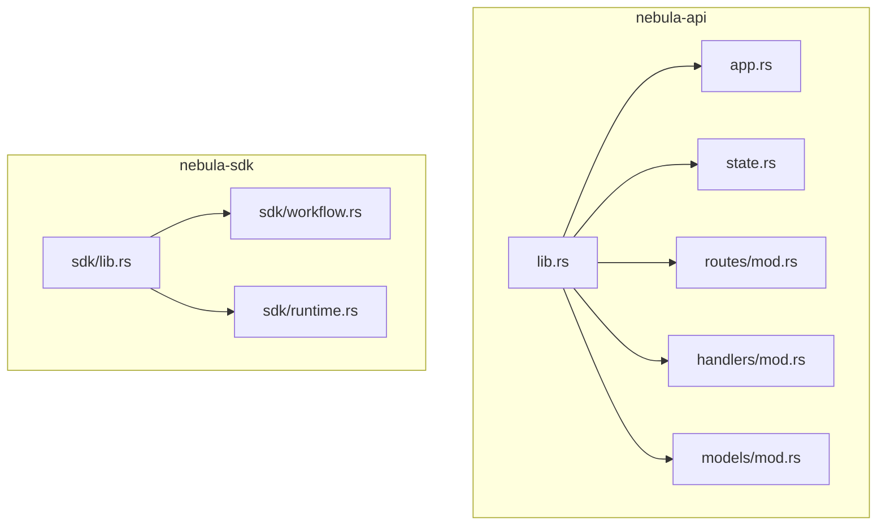
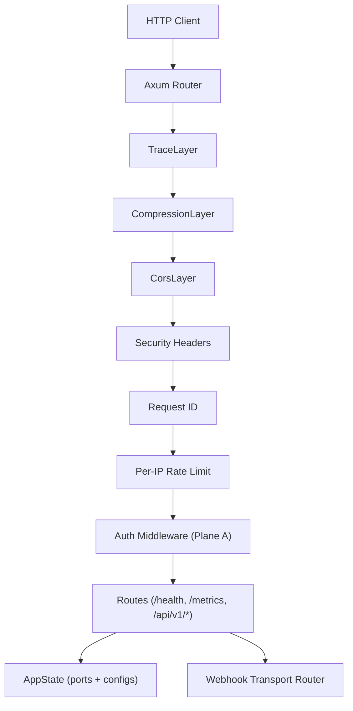
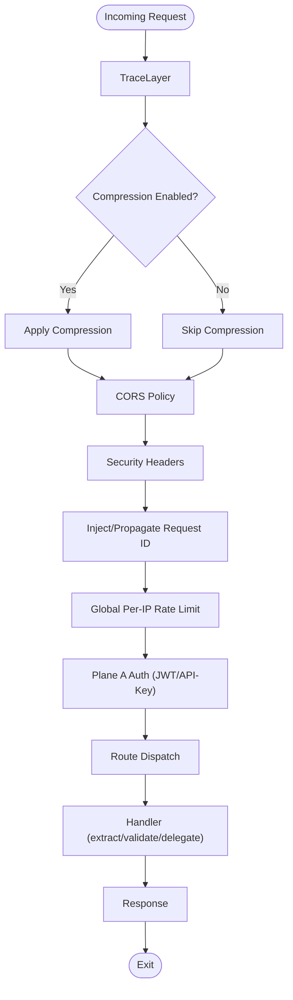
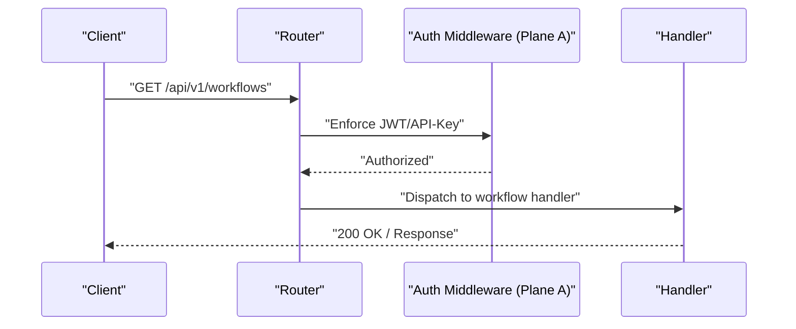
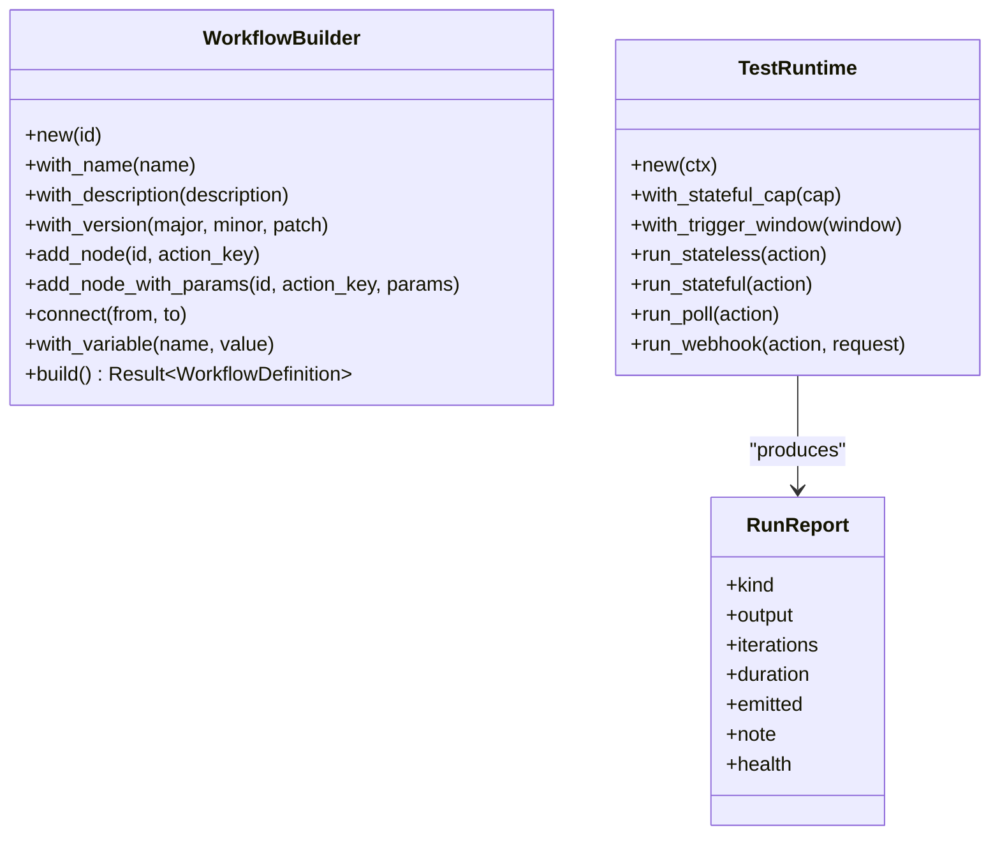
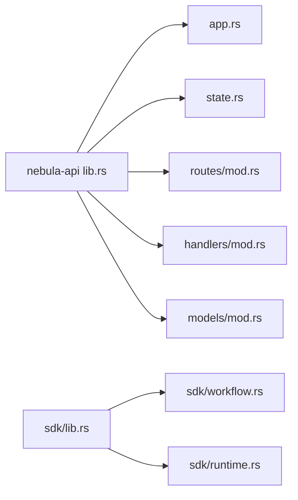

# API Layer Documentation

<cite>
**Referenced Files in This Document**
- [lib.rs](file://crates/api/src/lib.rs)
- [app.rs](file://crates/api/src/app.rs)
- [state.rs](file://crates/api/src/state.rs)
- [routes/mod.rs](file://crates/api/src/routes/mod.rs)
- [handlers/mod.rs](file://crates/api/src/handlers/mod.rs)
- [models/mod.rs](file://crates/api/src/models/mod.rs)
- [sdk/lib.rs](file://crates/sdk/src/lib.rs)
- [sdk/workflow.rs](file://crates/sdk/src/workflow.rs)
- [sdk/runtime.rs](file://crates/sdk/src/runtime.rs)
</cite>

## Table of Contents
1. [Introduction](#introduction)
2. [Project Structure](#project-structure)
3. [Core Components](#core-components)
4. [Architecture Overview](#architecture-overview)
5. [Detailed Component Analysis](#detailed-component-analysis)
6. [Dependency Analysis](#dependency-analysis)
7. [Performance Considerations](#performance-considerations)
8. [Troubleshooting Guide](#troubleshooting-guide)
9. [Conclusion](#conclusion)
10. [Appendices](#appendices)

## Introduction
This document explains the API Layer of Nebula with a focus on the HTTP server built on the Axum framework, middleware stack, authentication and authorization planes, webhook transport, and the integration SDK’s role in enabling clean authoring of integrations. It covers:
- How the REST API server is structured and how middleware is layered
- Authentication planes (Plane A for API access and Plane B for integration credentials)
- Webhook transport and how inbound triggers are handled
- The SDK façade that exposes a developer-friendly interface for building workflows and testing actions
- HTTP endpoints, request/response models, authentication methods, and error handling
- Practical examples from the codebase for building workflows programmatically and testing integrations
- Guidance for client implementations and performance optimization

## Project Structure
The API Layer centers around the nebula-api crate, which defines the HTTP entry point, middleware, routing, and state. The SDK crate provides a façade for integration authors to build workflows and test actions in-process.

**Diagram sources**
- [lib.rs:1-60](file://crates/api/src/lib.rs#L1-L60)
- [app.rs:1-187](file://crates/api/src/app.rs#L1-L187)
- [state.rs:1-153](file://crates/api/src/state.rs#L1-L153)
- [routes/mod.rs:1-43](file://crates/api/src/routes/mod.rs#L1-L43)
- [handlers/mod.rs:1-21](file://crates/api/src/handlers/mod.rs#L1-L21)
- [models/mod.rs:1-23](file://crates/api/src/models/mod.rs#L1-L23)
- [sdk/lib.rs:1-279](file://crates/sdk/src/lib.rs#L1-L279)
- [sdk/workflow.rs:1-317](file://crates/sdk/src/workflow.rs#L1-L317)
- [sdk/runtime.rs:1-326](file://crates/sdk/src/runtime.rs#L1-L326)

**Section sources**
- [lib.rs:1-60](file://crates/api/src/lib.rs#L1-L60)
- [sdk/lib.rs:1-279](file://crates/sdk/src/lib.rs#L1-L279)

## Core Components
- HTTP Server and Router Builder: Production-grade Axum server with configurable middleware stack, body limits, CORS, compression, and graceful shutdown.
- Application State: Holds port/trait dependencies (repositories, registries, transports) and configuration for auth and optional services.
- Routing: Modular routes grouped by domain and protected by Plane A authentication.
- Middleware Stack: Tracing, compression, CORS, security headers, request ID, and global per-IP rate limiting.
- Authentication Planes: Plane A (API access) via JWT and API keys; Plane B (integration credentials) via OAuth adapters nested under /api/v1.
- Webhook Transport: Optional inbound trigger transport merged into the main router.
- SDK Façade: Provides WorkflowBuilder, TestRuntime, and helpers for integration authors.

**Section sources**
- [app.rs:18-97](file://crates/api/src/app.rs#L18-L97)
- [state.rs:22-81](file://crates/api/src/state.rs#L22-L81)
- [routes/mod.rs:17-42](file://crates/api/src/routes/mod.rs#L17-L42)
- [lib.rs:18-29](file://crates/api/src/lib.rs#L18-L29)

## Architecture Overview
The API Layer follows an entry-point pattern where all business logic is delegated to injected port traits. The server composes middleware and routes, merges webhook transport when present, and serves requests with tracing, compression, CORS, and rate limiting.

**Diagram sources**
- [app.rs:18-97](file://crates/api/src/app.rs#L18-L97)
- [routes/mod.rs:17-42](file://crates/api/src/routes/mod.rs#L17-L42)
- [state.rs:22-81](file://crates/api/src/state.rs#L22-L81)

## Detailed Component Analysis

### HTTP Server and Middleware Stack
- Body Limits: REST routes apply a configurable default body limit; webhook transport maintains its own limit internally.
- Middleware Order: Applied bottom-up; rate limiting runs first to protect downstream layers.
- Compression: Optional per configuration; can disable specific encodings.
- CORS: Configurable origins, credentials support, exposed headers, and preflight caching.
- Security Headers: Applied globally.
- Request ID: Injected from header or generated, propagated in response.
- Graceful Shutdown: Supports Ctrl+C and Unix terminate signal.

**Diagram sources**
- [app.rs:44-97](file://crates/api/src/app.rs#L44-L97)

**Section sources**
- [app.rs:18-97](file://crates/api/src/app.rs#L18-L97)

### Application State (AppState)
AppState encapsulates all shared dependencies and optional services:
- JWT secret and API keys for Plane A auth
- Repositories (workflows, executions, control queue)
- Metrics registry, action/plugin catalogs
- Optional webhook transport
- Optional OAuth stores (feature-gated)

It provides builder-style methods to attach optional services and transports.

**Section sources**
- [state.rs:22-151](file://crates/api/src/state.rs#L22-L151)

### Routing and Authentication Planes
- Health and metrics are public (no auth).
- API v1 routes are protected by Plane A auth middleware.
- OAuth credential acquisition routes (Plane B) are nested under /api/v1 and protected by Plane A.

**Diagram sources**
- [routes/mod.rs:29-42](file://crates/api/src/routes/mod.rs#L29-L42)

**Section sources**
- [routes/mod.rs:17-42](file://crates/api/src/routes/mod.rs#L17-L42)
- [lib.rs:18-29](file://crates/api/src/lib.rs#L18-L29)

### Webhook Transport
- Optional transport is merged into the main router alongside REST routes.
- When attached, inbound triggers can activate webhook-style actions.
- Transport router carries its own state type and does not collide with AppState.

**Section sources**
- [app.rs:30-38](file://crates/api/src/app.rs#L30-L38)
- [state.rs:64-68](file://crates/api/src/state.rs#L64-L68)

### HTTP Endpoints and Models
Endpoints are grouped by domain and served under modular routers. The models module defines request/response DTOs for each domain.

Common endpoint families:
- Health: GET /health, GET /ready
- Metrics: GET /metrics
- Workflows: CRUD and activation endpoints
- Executions: listing, retrieval, starting, canceling, logs, outputs
- Catalogs: actions and plugins listing and details
- OAuth (feature-gated): credential acquisition adapters under /api/v1

Request/response models are exported via the models module and used by handlers.

**Section sources**
- [handlers/mod.rs:6-21](file://crates/api/src/handlers/mod.rs#L6-L21)
- [models/mod.rs:5-23](file://crates/api/src/models/mod.rs#L5-L23)

### Authentication and Authorization
- Plane A (API access):
  - JWT Bearer tokens validated against the configured JwtSecret
  - X-API-Key static keys (constant-time comparison) with nbl_sk_ prefix
- Plane B (integration credentials):
  - OAuth2 client flows for acquiring integration credentials
  - Nested under /api/v1 and protected by Plane A middleware
- Error handling:
  - All errors conform to RFC 9457 Problem Details semantics

**Section sources**
- [lib.rs:18-29](file://crates/api/src/lib.rs#L18-L29)
- [state.rs:25-37](file://crates/api/src/state.rs#L25-L37)

### Integration SDK: WorkflowBuilder and TestRuntime
The SDK provides a façade for integration authors:
- WorkflowBuilder: Programmatic construction of workflows with nodes, connections, variables, and versioning
- TestRuntime: In-process harness to run actions end-to-end (stateless, stateful, poll triggers, webhook triggers)
- Helpers: macros for concise workflow and action definitions

**Diagram sources**
- [sdk/workflow.rs:44-275](file://crates/sdk/src/workflow.rs#L44-L275)
- [sdk/runtime.rs:86-306](file://crates/sdk/src/runtime.rs#L86-L306)

**Section sources**
- [sdk/lib.rs:1-279](file://crates/sdk/src/lib.rs#L1-L279)
- [sdk/workflow.rs:27-275](file://crates/sdk/src/workflow.rs#L27-L275)
- [sdk/runtime.rs:78-306](file://crates/sdk/src/runtime.rs#L78-L306)

### Concrete Examples from the Codebase
- Building a workflow programmatically:
  - Use WorkflowBuilder to add nodes and connect them, then build a WorkflowDefinition
  - See [sdk/workflow.rs:10-16](file://crates/sdk/src/workflow.rs#L10-L16) for a usage example
- Testing an action in-process:
  - Use TestRuntime with a prepared TestContextBuilder to run stateless/stateful/poll/webhook actions
  - See [sdk/runtime.rs:11-27](file://crates/sdk/src/runtime.rs#L11-L27) for a usage example
- Defining actions and workflows with macros:
  - simple_action! and workflow! macros are exported from the SDK façade
  - See [sdk/lib.rs:201-234](file://crates/sdk/src/lib.rs#L201-L234) and [sdk/lib.rs:156-199](file://crates/sdk/src/lib.rs#L156-L199)

**Section sources**
- [sdk/workflow.rs:7-16](file://crates/sdk/src/workflow.rs#L7-L16)
- [sdk/runtime.rs:11-27](file://crates/sdk/src/runtime.rs#L11-L27)
- [sdk/lib.rs:201-234](file://crates/sdk/src/lib.rs#L201-L234)
- [sdk/lib.rs:156-199](file://crates/sdk/src/lib.rs#L156-L199)

## Dependency Analysis
The API Layer depends on port/trait abstractions for repositories and registries, ensuring local-first defaults and operational honesty. Optional services (metrics, catalogs, webhook transport) are attached through AppState.

**Diagram sources**
- [lib.rs:43-60](file://crates/api/src/lib.rs#L43-L60)
- [app.rs:11-16](file://crates/api/src/app.rs#L11-L16)
- [state.rs:10-18](file://crates/api/src/state.rs#L10-L18)
- [routes/mod.rs:13-16](file://crates/api/src/routes/mod.rs#L13-L16)
- [handlers/mod.rs:6-21](file://crates/api/src/handlers/mod.rs#L6-L21)
- [models/mod.rs:5-23](file://crates/api/src/models/mod.rs#L5-L23)
- [sdk/lib.rs:46-71](file://crates/sdk/src/lib.rs#L46-L71)
- [sdk/workflow.rs:20-25](file://crates/sdk/src/workflow.rs#L20-L25)
- [sdk/runtime.rs:34-41](file://crates/sdk/src/runtime.rs#L34-L41)

**Section sources**
- [lib.rs:43-60](file://crates/api/src/lib.rs#L43-L60)
- [sdk/lib.rs:46-71](file://crates/sdk/src/lib.rs#L46-L71)

## Performance Considerations
- Place global per-IP rate limiting outermost to drop overload early
- Enable compression selectively; consider disabling specific encodings if bandwidth is constrained
- Tune CORS origins and preflight caching to minimize browser preflights
- Use DefaultBodyLimit appropriately for REST vs. webhook routes
- Prefer in-process testing with TestRuntime to catch regressions early and reduce CI overhead
- Monitor metrics via the /metrics endpoint when a registry is attached

[No sources needed since this section provides general guidance]

## Troubleshooting Guide
- Authentication failures:
  - Verify JWT secret validity and API key prefixes
  - Confirm headers include Authorization (Bearer) or X-API-Key
- CORS preflights failing:
  - Ensure allowed headers include Authorization, Content-Type, Accept, and the custom Request ID header
- Webhook triggers not firing:
  - Confirm webhook transport is attached and routes are merged
- Body size errors:
  - Adjust REST body limit via configuration; webhook routes maintain their own limits
- Health and readiness:
  - Use /health and /ready endpoints to verify service status

**Section sources**
- [app.rs:99-142](file://crates/api/src/app.rs#L99-L142)
- [state.rs:64-68](file://crates/api/src/state.rs#L64-L68)
- [routes/mod.rs:20-23](file://crates/api/src/routes/mod.rs#L20-L23)

## Conclusion
Nebula’s API Layer offers a robust, production-grade HTTP entry point powered by Axum, with a clean separation of concerns, strong authentication planes, and optional webhook transport. The SDK complements the API by providing a developer-friendly façade for building workflows and testing actions in-process. Together, they enable integration authors to focus on business logic while the platform handles transport, security, and observability.

[No sources needed since this section summarizes without analyzing specific files]

## Appendices

### Client Implementation Guidelines
- Use Authorization: Bearer <JWT> or X-API-Key for authenticated requests
- Respect CORS policies and preflight handling
- Configure body limits according to payload sizes
- Leverage the SDK for rapid prototyping and testing

[No sources needed since this section provides general guidance]