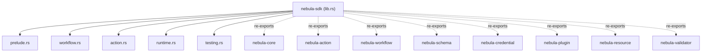
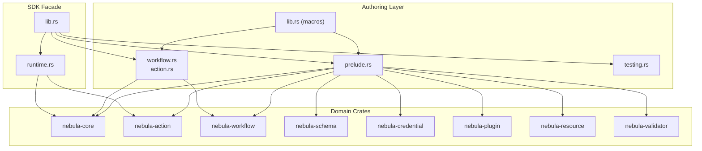
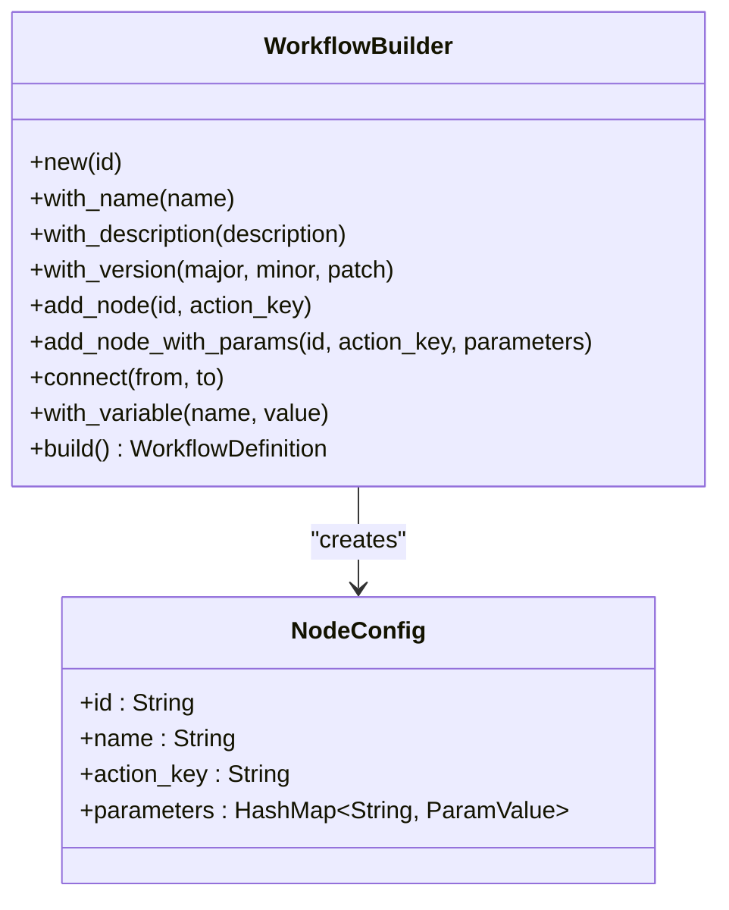
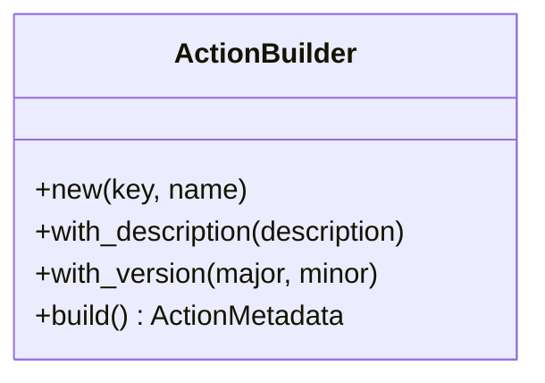
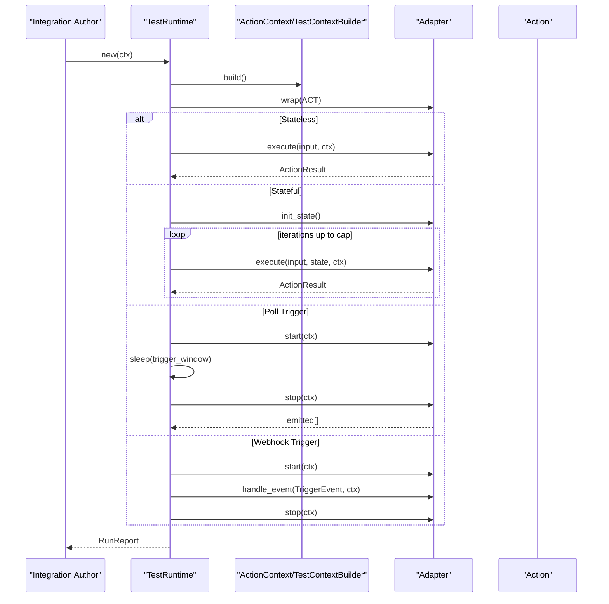
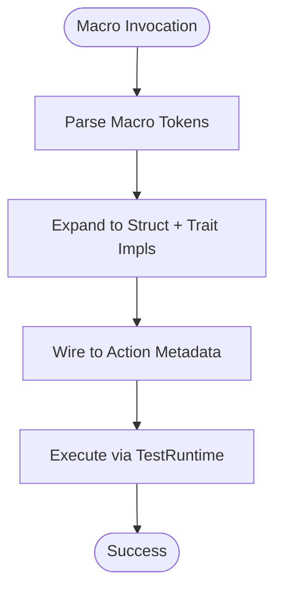
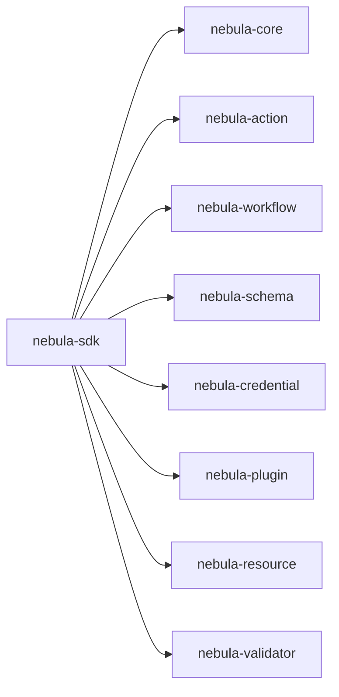

# Integration SDK

<cite>
**Referenced Files in This Document**
- [Cargo.toml](file://crates/sdk/Cargo.toml)
- [lib.rs](file://crates/sdk/src/lib.rs)
- [prelude.rs](file://crates/sdk/src/prelude.rs)
- [workflow.rs](file://crates/sdk/src/workflow.rs)
- [action.rs](file://crates/sdk/src/action.rs)
- [runtime.rs](file://crates/sdk/src/runtime.rs)
- [testing.rs](file://crates/sdk/src/testing.rs)
- [README.md](file://crates/sdk/README.md)
- [hello_action.rs](file://examples/hello_action.rs)
- [paginated_users.rs](file://examples/paginated_users.rs)
- [simple_action_macro.rs](file://crates/sdk/tests/simple_action_macro.rs)
- [execution_integration.rs](file://crates/action/tests/execution_integration.rs)
- [test_context_builder.rs](file://crates/action/src/testing.rs)
</cite>

## Table of Contents
1. [Introduction](#introduction)
2. [Project Structure](#project-structure)
3. [Core Components](#core-components)
4. [Architecture Overview](#architecture-overview)
5. [Detailed Component Analysis](#detailed-component-analysis)
6. [Dependency Analysis](#dependency-analysis)
7. [Performance Considerations](#performance-considerations)
8. [Troubleshooting Guide](#troubleshooting-guide)
9. [Conclusion](#conclusion)
10. [Appendices](#appendices)

## Introduction
The Integration SDK is a façade crate designed to simplify building integrations for the Nebula workflow engine. It re-exports the core integration surfaces (actions, credentials, resources, schema, workflow, plugin, validator, and core types) and provides ergonomic utilities for integration authors:
- A unified prelude for convenient imports
- Programmatic workflow construction via WorkflowBuilder
- Action metadata construction via ActionBuilder
- An in-process TestRuntime and RunReport for end-to-end testing
- Macros for concise action and workflow definitions

The SDK abstracts engine complexity while exposing the necessary capabilities to define actions, construct workflows, and test them locally before deployment.

## Project Structure
The SDK crate lives under crates/sdk and composes functionality from several domain crates. It exposes modules for prelude, workflow, action, runtime, and testing, along with public macros and error types.

**Diagram sources**
- [lib.rs:46-58](file://crates/sdk/src/lib.rs#L46-L58)
- [Cargo.toml:14-23](file://crates/sdk/Cargo.toml#L14-L23)

**Section sources**
- [Cargo.toml:14-23](file://crates/sdk/Cargo.toml#L14-L23)
- [lib.rs:46-58](file://crates/sdk/src/lib.rs#L46-L58)
- [README.md:12-27](file://crates/sdk/README.md#L12-L27)

## Core Components
- Predefined imports: The prelude module re-exports the most commonly used traits, types, and testing helpers, reducing boilerplate for integration authors.
- WorkflowBuilder: A fluent builder for constructing workflow definitions programmatically, including nodes, connections, variables, and metadata.
- ActionBuilder: A builder for action metadata, enabling programmatic creation of action descriptors.
- TestRuntime: An in-process harness that drives a single action end-to-end, supporting stateless, stateful, poll trigger, and webhook trigger lifecycles.
- Testing utilities: Helpers for asserting ActionResult shapes and lightweight fixtures for identifiers and timestamps.
- Macros: params!, json!, workflow!, and simple_action! to accelerate development.

These components collectively provide a cohesive developer experience for building, validating, and testing integrations.

**Section sources**
- [prelude.rs:11-97](file://crates/sdk/src/prelude.rs#L11-L97)
- [workflow.rs:27-276](file://crates/sdk/src/workflow.rs#L27-L276)
- [action.rs:20-73](file://crates/sdk/src/action.rs#L20-L73)
- [runtime.rs:78-306](file://crates/sdk/src/runtime.rs#L78-L306)
- [testing.rs:21-75](file://crates/sdk/src/testing.rs#L21-L75)
- [lib.rs:116-279](file://crates/sdk/src/lib.rs#L116-L279)

## Architecture Overview
The SDK sits between integration authors and the underlying engine/runtime crates. It provides:
- A single dependency surface (nebula-sdk) that re-exports the integration model
- Builders and macros for authoring actions and workflows
- A test harness that mirrors the engine’s adapter-driven lifecycle

**Diagram sources**
- [lib.rs:46-58](file://crates/sdk/src/lib.rs#L46-L58)
- [prelude.rs:15-84](file://crates/sdk/src/prelude.rs#L15-L84)
- [workflow.rs:20-25](file://crates/sdk/src/workflow.rs#L20-L25)
- [runtime.rs:34-41](file://crates/sdk/src/runtime.rs#L34-L41)

## Detailed Component Analysis

### WorkflowBuilder Pattern
WorkflowBuilder enables programmatic construction of workflows with:
- Node addition (id, action key, optional parameters)
- Connections between nodes
- Metadata (name, description, version)
- Variables and other workflow-level attributes

Validation ensures:
- Unique node ids
- Existence of referenced nodes in connections
- Valid action keys

**Diagram sources**
- [workflow.rs:44-276](file://crates/sdk/src/workflow.rs#L44-L276)

Practical usage examples:
- Constructing a workflow with nodes and connections
- Adding variables and setting version
- Building and validating the workflow definition

**Section sources**
- [workflow.rs:27-276](file://crates/sdk/src/workflow.rs#L27-L276)
- [README.md:56-62](file://crates/sdk/README.md#L56-L62)

### ActionBuilder and Action Metadata
ActionBuilder simplifies creating action metadata with:
- Action key and human-readable name
- Description and interface version

It integrates with the action trait family and schema system to describe action capabilities.

**Diagram sources**
- [action.rs:33-73](file://crates/sdk/src/action.rs#L33-L73)

Practical usage examples:
- Creating metadata for a custom action
- Setting description and version
- Using the metadata in action implementations

**Section sources**
- [action.rs:20-73](file://crates/sdk/src/action.rs#L20-L73)

### TestRuntime and RunReport
TestRuntime drives a single action through its full lifecycle:
- Stateless actions: one execute call
- Stateful actions: iterative execute until break or cap
- Poll triggers: start, run for a bounded window, cancel, capture emissions
- Webhook triggers: start, dispatch a single fake event, stop

RunReport captures structured outcomes including kind, output, iterations, duration, emitted payloads, notes, and health snapshots for triggers.

**Diagram sources**
- [runtime.rs:86-306](file://crates/sdk/src/runtime.rs#L86-L306)
- [test_context_builder.rs:61-209](file://crates/action/src/testing.rs#L61-L209)

Practical usage examples:
- Running a stateless action and asserting output
- Iterating a stateful action and verifying break reasons
- Testing poll triggers with a bounded window
- Testing webhook triggers with a synthetic request

**Section sources**
- [runtime.rs:78-306](file://crates/sdk/src/runtime.rs#L78-L306)
- [testing.rs:21-75](file://crates/sdk/src/testing.rs#L21-L75)

### Macros for Action and Plugin Development
The SDK provides macros to accelerate development:
- params!: Build FieldValues from key-value pairs
- json!: Re-export of serde_json::json!
- workflow!: Declarative workflow definition macro
- simple_action!: Define a simple stateless action with a unit struct

**Diagram sources**
- [lib.rs:142-279](file://crates/sdk/src/lib.rs#L142-L279)

Practical usage examples:
- Defining a simple stateless action with simple_action!
- Building parameter collections with params!
- Declaring workflows with workflow!

**Section sources**
- [lib.rs:116-279](file://crates/sdk/src/lib.rs#L116-L279)
- [simple_action_macro.rs:10-31](file://crates/sdk/tests/simple_action_macro.rs#L10-L31)

### Testing Utilities and Fixtures
Testing utilities include:
- Assertion helpers for ActionResult shapes
- Lightweight fixtures for workflow and execution identifiers and timestamps

These enable concise and readable tests for integration authors.

**Section sources**
- [testing.rs:21-75](file://crates/sdk/src/testing.rs#L21-L75)

### Example Workflows and Actions
Concrete examples demonstrate end-to-end usage:
- Stateless action with minimal boilerplate
- Paginated action using DX traits and TestRuntime

**Section sources**
- [hello_action.rs:30-57](file://examples/hello_action.rs#L30-L57)
- [paginated_users.rs:14-159](file://examples/paginated_users.rs#L14-L159)

## Dependency Analysis
The SDK depends on multiple domain crates and re-exports their public APIs. This creates a single dependency surface for integration authors while preserving modularity.

**Diagram sources**
- [Cargo.toml:14-23](file://crates/sdk/Cargo.toml#L14-L23)

**Section sources**
- [Cargo.toml:14-23](file://crates/sdk/Cargo.toml#L14-L23)
- [lib.rs:46-58](file://crates/sdk/src/lib.rs#L46-L58)

## Performance Considerations
- Prefer the prelude for efficient imports and reduced compile-time overhead.
- Use TestRuntime with appropriate caps and windows to avoid long-running tests.
- Keep action implementations synchronous where possible; defer heavy work to resources or external systems.
- Validate inputs early to fail fast and reduce unnecessary computation.
- Use paginated or batched actions to manage memory and throughput.

[No sources needed since this section provides general guidance]

## Troubleshooting Guide
Common issues and strategies:
- Workflow validation failures: Ensure node ids are unique and connections reference existing nodes; check action keys are valid.
- TestRuntime timeouts: Adjust trigger window or stateful cap for long-running actions.
- Missing credentials/resources in tests: Configure TestContextBuilder with credentials and resources before building the context.
- Assertion failures: Use testing utilities to assert ActionResult shapes and fixture identifiers.

**Section sources**
- [workflow.rs:159-275](file://crates/sdk/src/workflow.rs#L159-L275)
- [runtime.rs:103-115](file://crates/sdk/src/runtime.rs#L103-L115)
- [test_context_builder.rs:61-209](file://crates/action/src/testing.rs#L61-L209)
- [testing.rs:21-75](file://crates/sdk/src/testing.rs#L21-L75)

## Conclusion
The Integration SDK provides a focused, ergonomic surface for building integrations around the Nebula workflow engine. By re-exporting core integration concepts, offering builders and macros, and supplying a robust test harness, it lowers the barrier to entry while maintaining access to advanced capabilities. Integration authors can define actions, construct workflows, and test end-to-end with confidence, knowing the SDK abstracts engine complexity without hiding essential functionality.

[No sources needed since this section summarizes without analyzing specific files]

## Appendices

### Practical Patterns and Recipes
- Define a simple stateless action using simple_action! and run it through TestRuntime
- Build a multi-node workflow with WorkflowBuilder and connect nodes explicitly
- Use params! to assemble action parameters and json! for test fixtures
- Test stateful actions with iteration caps and verify break reasons
- Test triggers with bounded windows and inspect emitted payloads

**Section sources**
- [lib.rs:142-279](file://crates/sdk/src/lib.rs#L142-L279)
- [hello_action.rs:30-57](file://examples/hello_action.rs#L30-L57)
- [paginated_users.rs:14-159](file://examples/paginated_users.rs#L14-L159)
- [simple_action_macro.rs:10-31](file://crates/sdk/tests/simple_action_macro.rs#L10-L31)
- [execution_integration.rs:46-154](file://crates/action/tests/execution_integration.rs#L46-L154)