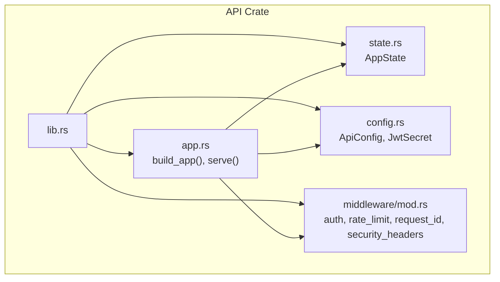
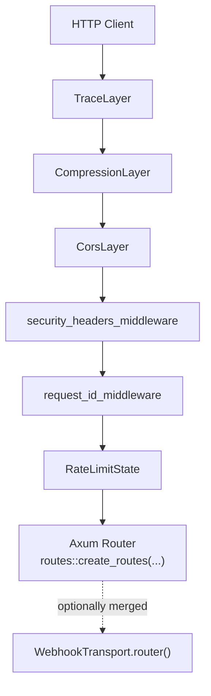
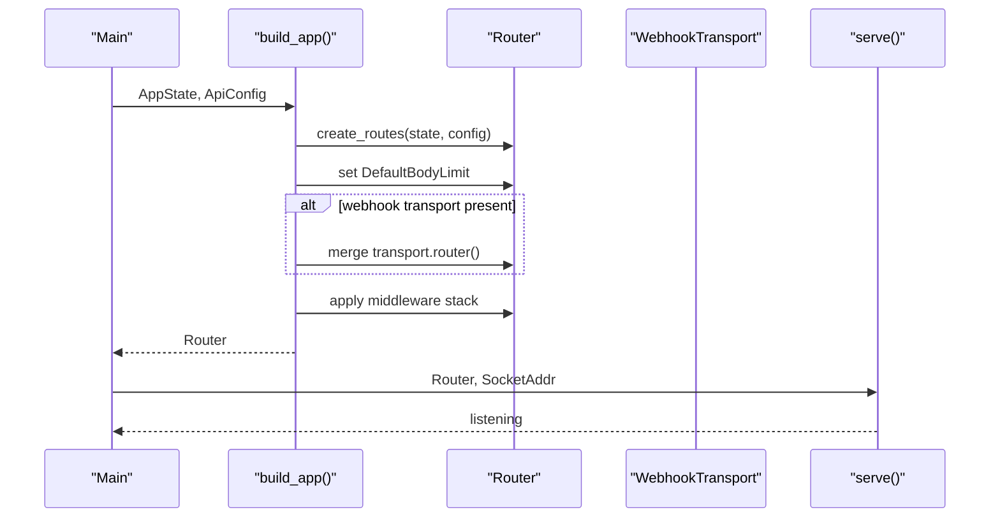
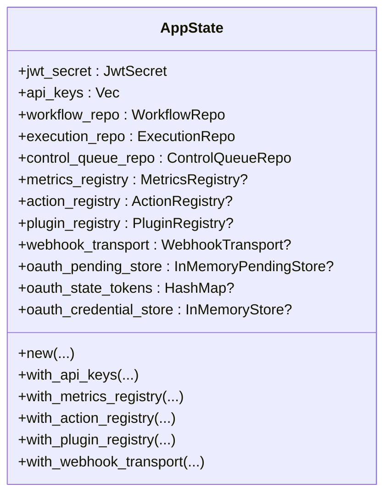
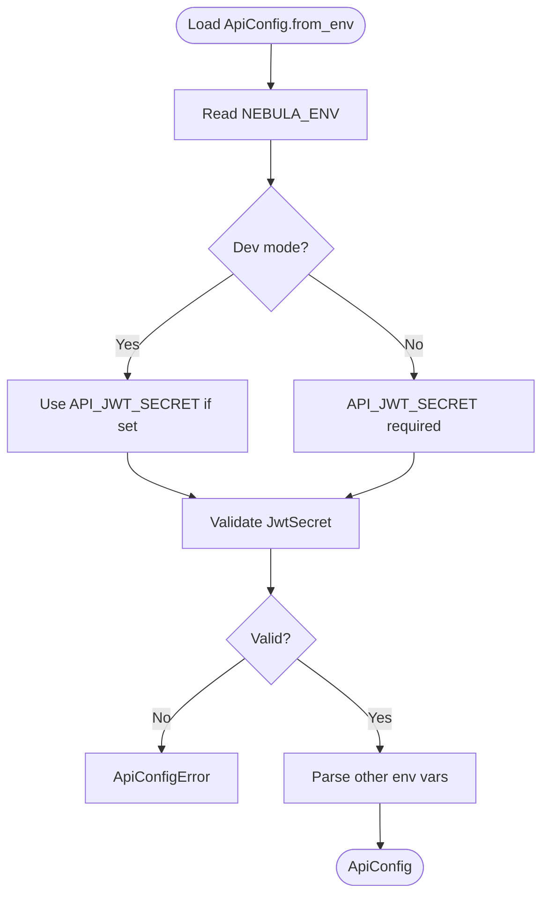
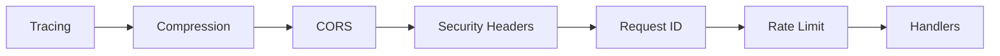
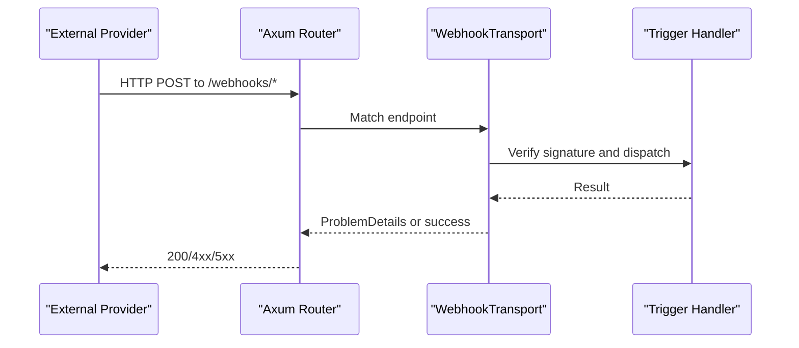
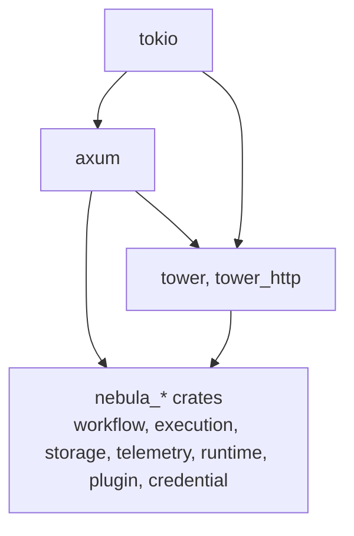

# REST API Server

<cite>
**Referenced Files in This Document**
- [lib.rs](file://crates/api/src/lib.rs)
- [app.rs](file://crates/api/src/app.rs)
- [state.rs](file://crates/api/src/state.rs)
- [config.rs](file://crates/api/src/config.rs)
- [mod.rs](file://crates/api/src/middleware/mod.rs)
</cite>

## Table of Contents
1. [Introduction](#introduction)
2. [Project Structure](#project-structure)
3. [Core Components](#core-components)
4. [Architecture Overview](#architecture-overview)
5. [Detailed Component Analysis](#detailed-component-analysis)
6. [Dependency Analysis](#dependency-analysis)
7. [Performance Considerations](#performance-considerations)
8. [Troubleshooting Guide](#troubleshooting-guide)
9. [Conclusion](#conclusion)

## Introduction
This document explains the REST API Server for Nebula’s HTTP entry point. It focuses on the Axum-based HTTP server architecture, middleware stack configuration, authentication planes (Plane A for API access and Plane B for integration credentials), the AppState pattern for dependency injection, error handling aligned with RFC 9457 ProblemDetails, and the webhook transport system. It also documents HTTP endpoints for workflows, executions, credentials, and catalog management, along with authentication methods (JWT bearer tokens and API keys), rate limiting strategies, security headers, webhook signature verification, endpoint activation/deactivation, and inbound trigger processing. Practical examples of common API usage patterns, error responses, and integration scenarios are included to help both beginners and experienced developers implement API clients.

## Project Structure
The API crate organizes the HTTP entry point around a clean separation of concerns:
- Application builder and server lifecycle
- Centralized configuration with strict validation
- Shared application state (dependency injection)
- Middleware stack (auth, rate limiting, tracing, compression, CORS, security headers)
- Routes and handlers (conceptual coverage)
- Error model and webhook transport (conceptual coverage)

**Diagram sources**
- [lib.rs:1-60](file://crates/api/src/lib.rs#L1-L60)
- [app.rs:1-187](file://crates/api/src/app.rs#L1-L187)
- [state.rs:1-153](file://crates/api/src/state.rs#L1-L153)
- [config.rs:1-555](file://crates/api/src/config.rs#L1-L555)
- [mod.rs:1-14](file://crates/api/src/middleware/mod.rs#L1-L14)

**Section sources**
- [lib.rs:1-60](file://crates/api/src/lib.rs#L1-L60)
- [app.rs:1-187](file://crates/api/src/app.rs#L1-L187)
- [state.rs:1-153](file://crates/api/src/state.rs#L1-L153)
- [config.rs:1-555](file://crates/api/src/config.rs#L1-L555)
- [mod.rs:1-14](file://crates/api/src/middleware/mod.rs#L1-L14)

## Core Components
- Application builder and server lifecycle: constructs the Axum Router, merges webhook routes, applies middleware, and serves with graceful shutdown.
- Centralized configuration: validates and loads API settings from environment variables, enforces strong defaults and security gates.
- Application state (AppState): dependency injection container holding port traits and optional services (metrics, catalogs, webhook transport).
- Middleware stack: tracing, compression, CORS, security headers, request ID, and global per-IP rate limiting.
- Authentication planes: Plane A (API access) via JWT bearer tokens and X-API-Key; Plane B (integration credentials) via OAuth flows nested under API routes and protected by Plane A.
- Error handling: RFC 9457 ProblemDetails via ApiError and errors module.
- Webhook transport: inbound trigger transport with endpoint activation/deactivation and signature verification.

**Section sources**
- [app.rs:18-69](file://crates/api/src/app.rs#L18-L69)
- [config.rs:192-234](file://crates/api/src/config.rs#L192-L234)
- [state.rs:22-81](file://crates/api/src/state.rs#L22-L81)
- [lib.rs:18-29](file://crates/api/src/lib.rs#L18-L29)
- [lib.rs:11-16](file://crates/api/src/lib.rs#L11-L16)

## Architecture Overview
The API server follows a production-grade Axum architecture:
- The application builder composes routes and middleware, applies a global per-IP rate limiter, and merges webhook routes if present.
- Middleware layers are applied from outermost to innermost: rate limit, request ID, security headers, and the inner stack (tracing, compression, CORS).
- AppState is passed into the router and into the webhook transport router when present.
- CORS configuration aligns with the protocol surface, including accepted headers for authentication.

**Diagram sources**
- [app.rs:44-69](file://crates/api/src/app.rs#L44-L69)
- [app.rs:100-142](file://crates/api/src/app.rs#L100-L142)
- [app.rs:35-38](file://crates/api/src/app.rs#L35-L38)

**Section sources**
- [app.rs:18-69](file://crates/api/src/app.rs#L18-L69)
- [app.rs:100-142](file://crates/api/src/app.rs#L100-L142)

## Detailed Component Analysis

### Application Builder and Server Lifecycle
- Builds the main router with REST routes and applies a configurable body limit.
- Optionally merges webhook routes into the same Axum app for unified ingress.
- Constructs a global per-IP rate limiter from configuration.
- Applies middleware in a strict order: tracing, compression, CORS, security headers, request ID, and rate limiting.
- Serves with graceful shutdown support.

**Diagram sources**
- [app.rs:19-69](file://crates/api/src/app.rs#L19-L69)
- [app.rs:145-186](file://crates/api/src/app.rs#L145-L186)

**Section sources**
- [app.rs:18-69](file://crates/api/src/app.rs#L18-L69)
- [app.rs:145-186](file://crates/api/src/app.rs#L145-L186)

### AppState Pattern for Dependency Injection
AppState centralizes all dependencies required by handlers:
- JWT secret and API keys for Plane A authentication
- Repositories for workflows and executions
- Control queue for durable execution control signals
- Optional registries for metrics, actions, plugins, and webhooks
- Feature-gated OAuth stores for rollout mode

**Diagram sources**
- [state.rs:22-81](file://crates/api/src/state.rs#L22-L81)

**Section sources**
- [state.rs:22-81](file://crates/api/src/state.rs#L22-L81)

### Configuration and Security Gates
ApiConfig enforces strong security and operational defaults:
- JWT secret validation prevents missing, too-short, or development placeholder secrets in production
- Environment-driven configuration with explicit error types
- Defaults for body size, compression, tracing, rate limits, and CORS origins
- Debug serialization redacts sensitive fields

**Diagram sources**
- [config.rs:286-371](file://crates/api/src/config.rs#L286-L371)

**Section sources**
- [config.rs:192-234](file://crates/api/src/config.rs#L192-L234)
- [config.rs:286-371](file://crates/api/src/config.rs#L286-L371)

### Middleware Stack and Authentication Planes
Middleware layers are applied in a specific order and include:
- Tracing for request lifecycle visibility
- Compression toggled by configuration
- CORS allowing required headers including authentication headers
- Security headers middleware
- Request ID propagation
- Global per-IP rate limiting

Authentication planes:
- Plane A (API access): JWT bearer tokens and X-API-Key for authenticating callers
- Plane B (integration credentials): OAuth flows for acquiring integration credentials, nested under API routes and protected by Plane A

**Diagram sources**
- [app.rs:44-69](file://crates/api/src/app.rs#L44-L69)
- [app.rs:100-142](file://crates/api/src/app.rs#L100-L142)
- [lib.rs:18-29](file://crates/api/src/lib.rs#L18-L29)

**Section sources**
- [app.rs:44-69](file://crates/api/src/app.rs#L44-L69)
- [app.rs:100-142](file://crates/api/src/app.rs#L100-L142)
- [lib.rs:18-29](file://crates/api/src/lib.rs#L18-L29)

### Error Handling with RFC 9457 ProblemDetails
All errors are standardized as RFC 9457 application/problem+json via ApiError and the errors module. This ensures consistent error responses across the API and avoids ad-hoc HTTP 500s for business logic failures.

**Section sources**
- [lib.rs:31-35](file://crates/api/src/lib.rs#L31-L35)

### Webhook Transport System
The webhook transport enables inbound trigger processing:
- Endpoint activation/deactivation
- Signature verification
- Router merge with REST routes for unified ingress
- Separate body limits for webhook providers

**Diagram sources**
- [lib.rs:12-13](file://crates/api/src/lib.rs#L12-L13)
- [app.rs:30-38](file://crates/api/src/app.rs#L30-L38)

**Section sources**
- [lib.rs:12-13](file://crates/api/src/lib.rs#L12-L13)
- [app.rs:30-38](file://crates/api/src/app.rs#L30-L38)

### HTTP Endpoints Overview
Endpoints are organized by domain:
- Workflows: CRUD and lifecycle operations
- Executions: creation, polling, cancellation, and status
- Credentials: management and Plane B OAuth flows
- Catalogs: actions and plugins discovery
- Webhooks: inbound triggers and endpoint management

These are exposed via the REST router and optionally merged webhook routes. Authentication is enforced by Plane A middleware for all routes except Plane B OAuth endpoints nested under API routes.

**Section sources**
- [lib.rs:9-11](file://crates/api/src/lib.rs#L9-L11)
- [app.rs:27-38](file://crates/api/src/app.rs#L27-L38)

### Authentication Methods
- JWT Bearer tokens: validated using the configured JwtSecret
- API keys: X-API-Key header with keys prefixed by nbl_sk_, compared in constant time
- Plane A protects all API routes; Plane B OAuth flows are nested under API routes and protected by Plane A

**Section sources**
- [state.rs:25-37](file://crates/api/src/state.rs#L25-L37)
- [lib.rs:18-29](file://crates/api/src/lib.rs#L18-L29)

### Rate Limiting Strategies
- Global per-IP rate limiter initialized from ApiConfig
- Applied as the outermost middleware to reject excessive traffic early
- Configurable via API_RATE_LIMIT environment variable

**Section sources**
- [app.rs:40-68](file://crates/api/src/app.rs#L40-L68)
- [config.rs:225-226](file://crates/api/src/config.rs#L225-L226)

### Security Headers
- Security headers middleware is applied after CORS and before handlers
- Ensures secure defaults for HTTP responses

**Section sources**
- [app.rs:61](file://crates/api/src/app.rs#L61)

### CORS Configuration
- Origins: wildcard or specific origins parsed from API_CORS_ORIGINS
- Methods: GET, POST, PUT, DELETE, PATCH, OPTIONS
- Headers: Content-Type, Authorization, Accept, X-Request-Id, and X-API-Key
- Exposed headers: X-Request-Id
- Max age: 1 hour

**Section sources**
- [app.rs:100-142](file://crates/api/src/app.rs#L100-L142)

## Dependency Analysis
The API crate depends on:
- Axum for routing and HTTP handling
- Tower and tower-http for middleware layers
- Nebula domain crates for repositories, registries, telemetry, and webhook transport
- Tokio for async runtime and graceful shutdown

**Diagram sources**
- [app.rs:7-16](file://crates/api/src/app.rs#L7-L16)

**Section sources**
- [app.rs:7-16](file://crates/api/src/app.rs#L7-L16)

## Performance Considerations
- Early rejection: global per-IP rate limiting reduces load on downstream handlers
- Compression: optional gzip/brotli/zstd based on configuration
- Body limits: REST body limit configurable via environment; webhook transport applies its own cap
- Tracing: optional for observability overhead control
- CORS preflight caching: max age reduces repeated OPTIONS requests

[No sources needed since this section provides general guidance]

## Troubleshooting Guide
Common issues and resolutions:
- Missing or invalid JWT secret in production: configure API_JWT_SECRET with a strong secret; development mode may auto-generate an ephemeral secret
- CORS preflights failing: ensure API_CORS_ORIGINS includes the client origin and that X-API-Key is allowed
- Unexpected 429 Too Many Requests: adjust API_RATE_LIMIT or reduce client concurrency
- Webhook signatures invalid: verify provider-specific signature verification and endpoint activation
- Metrics or catalog endpoints returning 503: attach the appropriate registries via AppState builder methods

**Section sources**
- [config.rs:286-371](file://crates/api/src/config.rs#L286-L371)
- [app.rs:100-142](file://crates/api/src/app.rs#L100-L142)
- [state.rs:114-151](file://crates/api/src/state.rs#L114-L151)

## Conclusion
Nebula’s REST API Server is built on a robust Axum foundation with a clear separation of concerns, strong security gates, and a production-grade middleware stack. The AppState pattern enables flexible dependency injection, while Plane A and Plane B authentication planes cleanly separate API access from integration credentials. RFC 9457 ProblemDetails ensure consistent error handling, and the webhook transport integrates inbound triggers seamlessly. Together, these components provide a solid HTTP entry point for building reliable integrations and clients.