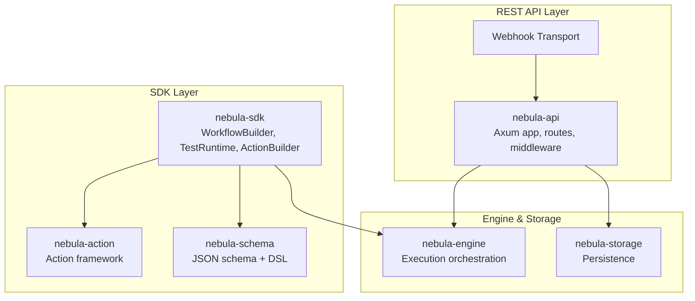
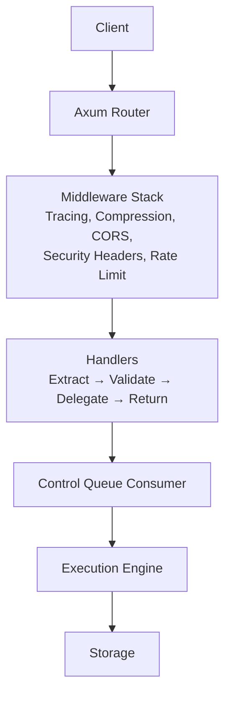
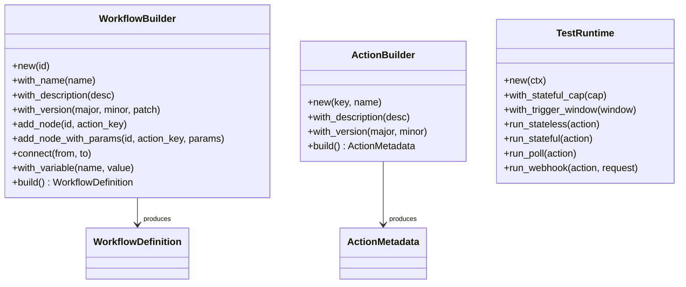
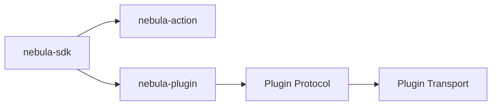
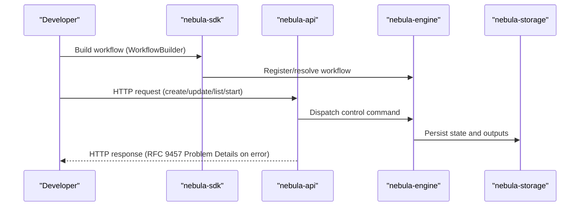
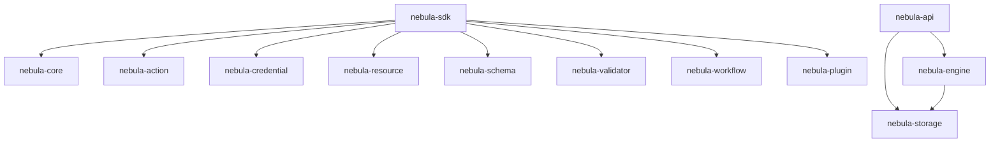

# API Reference

<cite>
**Referenced Files in This Document**
- [lib.rs](file://crates/api/src/lib.rs)
- [app.rs](file://crates/api/src/app.rs)
- [lib.rs](file://crates/sdk/src/lib.rs)
- [workflow.rs](file://crates/sdk/src/workflow.rs)
- [action.rs](file://crates/sdk/src/action.rs)
- [runtime.rs](file://crates/sdk/src/runtime.rs)
- [README.md](file://crates/api/README.md)
- [REST_API_AXUM_GUIDE.md](file://crates/api/docs/REST_API_AXUM_GUIDE.md)
- [axum-enterprise-clean-code.md](file://crates/api/docs/axum-enterprise-clean-code.md)
- [README.md](file://crates/sdk/README.md)
- [nebula-action-types.md](file://crates/action/nebula-action-types.md)
- [README.md](file://crates/action/README.md)
- [README.md](file://crates/plugin/README.md)
- [README.md](file://crates/plugin-sdk/README.md)
- [README.md](file://crates/engine/README.md)
- [README.md](file://crates/storage/README.md)
- [README.md](file://crates/core/README.md)
- [README.md](file://crates/execution/README.md)
- [README.md](file://crates/resource/README.md)
- [README.md](file://crates/credential/README.md)
- [README.md](file://crates/schema/README.md)
- [README.md](file://crates/validator/README.md)
- [README.md](file://crates/log/README.md)
- [README.md](file://crates/metrics/README.md)
- [README.md](file://crates/resilience/README.md)
- [README.md](file://crates/eventbus/README.md)
- [README.md](file://crates/rpc/README.md)
- [README.md](file://crates/runtime/README.md)
- [README.md](file://crates/system/README.md)
- [README.md](file://crates/telemetry/README.md)
- [README.md](file://crates/validator/docs/README.md)
- [README.md](file://crates/validator/examples/README.md)
- [README.md](file://docs/UPGRADE_COMPAT.md)
- [README.md](file://docs/INTEGRATION_MODEL.md)
- [README.md](file://docs/OBSERVABILITY.md)
- [README.md](file://docs/PRODUCT_CANON.md)
- [README.md](file://docs/RUST_EXPERT_STYLE_GUIDE.md)
- [README.md](file://docs/GUIDELINES/README.md)
- [README.md](file://docs/research/README.md)
- [README.md](file://docs/superpowers/specs/README.md)
- [README.md](file://docs/superpowers/plans/README.md)
- [README.md](file://docs/adr/README.md)
- [README.md](file://docs/audit/README.md)
- [README.md](file://docs/dev-setup.md)
- [README.md](file://docs/pitfalls.md)
- [README.md](file://docs/STYLE.md)
- [README.md](file://docs/IDIOM_REVIEW_CHECKLIST.md)
- [README.md](file://docs/QUALITY_GATES.md)
- [README.md](file://docs/MATURITY.md)
- [README.md](file://docs/ENGINE_GUARANTEES.md)
- [README.md](file://docs/COMPETITIVE.md)
- [README.md](file://docs/AGENT_PROTOCOL.md)
- [README.md](file://docs/AUDIT_TEMPLATE.md)
- [README.md](file://docs/DOC_TEMPLATE.md)
- [README.md](file://docs/ADRs/README.md)
- [README.md](file://docs/AGENTS.md)
- [README.md](file://docs/CLAUDE.md)
- [README.md](file://docs/CODE_OF_CONDUCT.md)
- [README.md](file://docs/CONTRIBUTING.md)
- [README.md](file://docs/GUIDELINES/01-meta-principles.md)
- [README.md](file://docs/GUIDELINES/02-language-rules.md)
- [README.md](file://docs/GUIDELINES/03-idioms.md)
- [README.md](file://docs/GUIDELINES/04-design-patterns.md)
- [README.md](file://docs/GUIDELINES/05-anti-patterns.md)
- [README.md](file://docs/GUIDELINES/06-functional-concepts.md)
- [README.md](file://docs/GUIDELINES/07-modern-rust.md)
- [README.md](file://docs/GUIDELINES/08-review-checklist.md)
- [README.md](file://docs/GUIDELINES/09-appendices.md)
- [README.md](file://docs/research/n8n-action-pain-points.md)
- [README.md](file://docs/research/n8n-credential-pain-points.md)
- [README.md](file://docs/research/n8n-parameter-pain-points.md)
- [README.md](file://docs/research/n8n-trigger-pain-points.md)
- [README.md](file://docs/research/temporal-peer-research.md)
- [README.md](file://docs/research/windmill-peer-research.md)
- [README.md](file://docs/superpowers/specs/README.md)
- [README.md](file://docs/superpowers/plans/README.md)
- [README.md](file://docs/adr/README.md)
- [README.md](file://docs/audit/README.md)
- [README.md](file://docs/dev-setup.md)
- [README.md](file://docs/pitfalls.md)
- [README.md](file://docs/STYLE.md)
- [README.md](file://docs/IDIOM_REVIEW_CHECKLIST.md)
- [README.md](file://docs/QUALITY_GATES.md)
- [README.md](file://docs/MATURITY.md)
- [README.md](file://docs/ENGINE_GUARANTEES.md)
- [README.md](file://docs/COMPETITIVE.md)
- [README.md](file://docs/AGENT_PROTOCOL.md)
- [README.md](file://docs/AUDIT_TEMPLATE.md)
- [README.md](file://docs/DOC_TEMPLATE.md)
- [README.md](file://docs/ADRs/README.md)
- [README.md](file://docs/AGENTS.md)
- [README.md](file://docs/CLAUDE.md)
- [README.md](file://docs/CODE_OF_CONDUCT.md)
- [README.md](file://docs/CONTRIBUTING.md)
</cite>

## Table of Contents
1. [Introduction](#introduction)
2. [Project Structure](#project-structure)
3. [Core Components](#core-components)
4. [Architecture Overview](#architecture-overview)
5. [Detailed Component Analysis](#detailed-component-analysis)
6. [Dependency Analysis](#dependency-analysis)
7. [Performance Considerations](#performance-considerations)
8. [Troubleshooting Guide](#troubleshooting-guide)
9. [Conclusion](#conclusion)
10. [Appendices](#appendices)

## Introduction
This document provides a comprehensive API reference for Nebula’s REST API and SDK interfaces. It covers:
- REST API endpoints for workflow management, execution control, credential operations, and webhook handling
- SDK façade APIs including WorkflowBuilder, TestRuntime, action framework APIs, and plugin development interfaces
- Authentication, rate limiting, and security considerations
- Practical usage patterns, error handling, and response formats
- How programmatic SDK usage maps to HTTP endpoints
- Common use cases, client implementation guidelines, performance optimization tips
- Migration and compatibility guidance

Nebula separates concerns into:
- REST API layer (HTTP entry point, middleware, routing, and transports)
- SDK layer (programmatic authoring and testing)
- Engine and storage layers (business logic, persistence, and runtime orchestration)

## Project Structure
At a high level:
- REST API: Axum-based server with middleware, routes, and webhook transport
- SDK: Façade re-exporting core integration surfaces and offering builders/testing
- Engine and storage: Orchestration, execution, and persistence
- Supporting crates: Action framework, credentials, resources, schema, validation, telemetry, resilience, and more

**Diagram sources**
- [lib.rs:1-60](file://crates/api/src/lib.rs#L1-L60)
- [app.rs:1-187](file://crates/api/src/app.rs#L1-L187)
- [lib.rs:1-279](file://crates/sdk/src/lib.rs#L1-L279)

**Section sources**
- [lib.rs:1-60](file://crates/api/src/lib.rs#L1-L60)
- [app.rs:1-187](file://crates/api/src/app.rs#L1-L187)
- [lib.rs:1-279](file://crates/sdk/src/lib.rs#L1-L279)

## Core Components
- REST API entry point and middleware stack
- SDK façade with WorkflowBuilder, ActionBuilder, TestRuntime, and helpers
- Action framework and plugin protocol
- Credential and resource abstractions
- Execution and storage layers

**Section sources**
- [lib.rs:1-60](file://crates/api/src/lib.rs#L1-L60)
- [app.rs:1-187](file://crates/api/src/app.rs#L1-L187)
- [lib.rs:1-279](file://crates/sdk/src/lib.rs#L1-L279)
- [workflow.rs:1-317](file://crates/sdk/src/workflow.rs#L1-L317)
- [action.rs:1-160](file://crates/sdk/src/action.rs#L1-L160)
- [runtime.rs:1-326](file://crates/sdk/src/runtime.rs#L1-L326)

## Architecture Overview
The REST API layer exposes HTTP endpoints and integrates a webhook transport. Middleware enforces security, tracing, compression, CORS, and global rate limiting. The SDK layer offers a façade for building workflows, actions, and testing them locally. The engine orchestrates execution and interacts with storage.

**Diagram sources**
- [lib.rs:1-60](file://crates/api/src/lib.rs#L1-L60)
- [app.rs:1-187](file://crates/api/src/app.rs#L1-L187)

## Detailed Component Analysis

### REST API: Endpoints, Authentication, and Security
- Entry point: The API crate defines the HTTP entry point and delegates business logic to injected ports. It includes handlers, middleware, errors, webhook transport, state, and configuration.
- Authentication planes:
  - Plane A (operator/API plane): JWT bearer tokens and X-API-Key for authenticating callers to the Nebula API
  - Plane B (integration credentials plane): OAuth2 flows for acquiring credentials used by workflows to talk to external systems (nested under /api/v1 and protected by Plane A)
- Security headers, CORS, compression, and request ID propagation are enforced via middleware.
- Body limits and per-IP rate limiting are configurable.

Typical endpoint categories:
- Workflow management: CRUD on workflows and workflow versions
- Execution control: start, cancel, resume, list executions
- Credential operations: list, create/update, rotate, delete credentials
- Webhook handling: inbound triggers via webhook transport

Authentication and headers:
- Authorization: Bearer JWT for operator access
- X-API-Key: Alternative API key for operator access
- Content-Type: application/json
- X-Request-Id: auto-generated or propagated request correlation ID

Rate limiting:
- Configurable per-IP limit applied globally before heavier processing

CORS:
- Configurable allowed origins, credentials allowed, exposed headers, and max age

Security considerations:
- All errors conform to RFC 9457 Problem Details
- Security headers middleware applied to all responses
- Body size limits configurable per deployment

**Section sources**
- [lib.rs:18-39](file://crates/api/src/lib.rs#L18-L39)
- [app.rs:44-68](file://crates/api/src/app.rs#L44-L68)
- [app.rs:100-142](file://crates/api/src/app.rs#L100-L142)
- [README.md](file://crates/api/README.md)

### SDK: WorkflowBuilder, ActionBuilder, TestRuntime
- WorkflowBuilder: Programmatic construction of workflows with nodes, connections, variables, and versioning. Validates node uniqueness and connection targets.
- ActionBuilder: Builds action metadata with key, name, description, and interface version.
- TestRuntime: In-process harness for running actions end-to-end:
  - Stateless actions: single execute
  - Stateful actions: iterative loop up to a safety cap
  - Poll triggers: spawn start, run for a configured window, cancel, capture emissions
  - Webhook triggers: wrap a WebhookRequest and dispatch a single event

**Diagram sources**
- [workflow.rs:44-276](file://crates/sdk/src/workflow.rs#L44-L276)
- [action.rs:33-73](file://crates/sdk/src/action.rs#L33-L73)
- [runtime.rs:86-306](file://crates/sdk/src/runtime.rs#L86-L306)

**Section sources**
- [workflow.rs:1-317](file://crates/sdk/src/workflow.rs#L1-L317)
- [action.rs:1-160](file://crates/sdk/src/action.rs#L1-L160)
- [runtime.rs:1-326](file://crates/sdk/src/runtime.rs#L1-L326)
- [lib.rs:1-279](file://crates/sdk/src/lib.rs#L1-L279)

### Action Framework and Plugin Protocol
- Action types and result system are documented in the action crate docs
- Plugins expose actions via a protocol and transport mechanism
- The SDK re-exports the action framework and integrates with the engine

**Diagram sources**
- [lib.rs:46-57](file://crates/sdk/src/lib.rs#L46-L57)
- [nebula-action-types.md](file://crates/action/nebula-action-types.md)
- [README.md](file://crates/plugin/README.md)
- [README.md](file://crates/plugin-sdk/README.md)

**Section sources**
- [nebula-action-types.md](file://crates/action/nebula-action-types.md)
- [README.md](file://crates/plugin/README.md)
- [README.md](file://crates/plugin-sdk/README.md)

### Relationship Between SDK and REST API
Programmatic SDK usage maps to HTTP endpoints as follows:
- Workflow creation/building (WorkflowBuilder) corresponds to REST endpoints for creating and updating workflows
- Action authoring (ActionBuilder) corresponds to registering actions and metadata via REST
- Execution control (start/cancel/resume) is exposed via REST endpoints and mirrored in the engine
- Credentials and resources are managed via dedicated REST endpoints and used by both SDK and REST flows
- Webhooks are handled by the webhook transport integrated into the REST app

**Diagram sources**
- [workflow.rs:154-276](file://crates/sdk/src/workflow.rs#L154-L276)
- [lib.rs:1-60](file://crates/api/src/lib.rs#L1-L60)
- [app.rs:1-187](file://crates/api/src/app.rs#L1-L187)

**Section sources**
- [workflow.rs:1-317](file://crates/sdk/src/workflow.rs#L1-L317)
- [lib.rs:1-60](file://crates/api/src/lib.rs#L1-L60)
- [app.rs:1-187](file://crates/api/src/app.rs#L1-L187)

### Typical Usage Patterns and Examples
- Building a workflow programmatically with WorkflowBuilder and validating connections
- Defining actions with ActionBuilder and using simple_action macro for boilerplate reduction
- Testing actions end-to-end with TestRuntime for stateless, stateful, poll, and webhook scenarios
- Using params! and json! helpers for concise parameter and payload construction

References to example usage:
- Workflow builder usage and tests
- Action builder usage and tests
- TestRuntime usage and run modes

**Section sources**
- [workflow.rs:1-317](file://crates/sdk/src/workflow.rs#L1-L317)
- [action.rs:1-160](file://crates/sdk/src/action.rs#L1-L160)
- [runtime.rs:1-326](file://crates/sdk/src/runtime.rs#L1-L326)
- [lib.rs:116-279](file://crates/sdk/src/lib.rs#L116-L279)

### Error Handling and Response Formats
- REST API responses use RFC 9457 Problem Details for all errors
- SDK Error enum covers workflow, action, parameter, serialization, and generic errors
- TestRuntime reports structured outcomes including iterations, duration, emitted payloads, and optional notes

**Section sources**
- [lib.rs:33-34](file://crates/api/src/lib.rs#L33-L34)
- [lib.rs:75-114](file://crates/sdk/src/lib.rs#L75-L114)
- [runtime.rs:56-76](file://crates/sdk/src/runtime.rs#L56-L76)

## Dependency Analysis
The SDK re-exports core integration surfaces and adds convenience APIs. The REST API depends on middleware, handlers, and state while delegating business logic to injected ports. The engine and storage layers provide execution and persistence.

**Diagram sources**
- [lib.rs:46-57](file://crates/sdk/src/lib.rs#L46-L57)
- [lib.rs:43-55](file://crates/api/src/lib.rs#L43-L55)

**Section sources**
- [lib.rs:46-57](file://crates/sdk/src/lib.rs#L46-L57)
- [lib.rs:43-55](file://crates/api/src/lib.rs#L43-L55)

## Performance Considerations
- Enable compression in middleware for reduced bandwidth
- Configure per-IP rate limiting to protect backend resources
- Use body size limits appropriate for your workload
- Prefer streaming and backpressure-aware runtime components for high-throughput scenarios
- Tune trigger windows and stateful caps in TestRuntime to avoid runaway loops

[No sources needed since this section provides general guidance]

## Troubleshooting Guide
Common issues and remedies:
- Authentication failures: verify Authorization header or X-API-Key presence and validity
- CORS preflights failing: ensure allowed origins and headers match middleware configuration
- Excessive request volume: adjust rate limit configuration and monitor logs
- Validation errors: use SDK helpers and schema validation to catch issues early
- Execution hangs: configure trigger windows and stateful caps in TestRuntime

**Section sources**
- [app.rs:100-142](file://crates/api/src/app.rs#L100-L142)
- [runtime.rs:43-50](file://crates/sdk/src/runtime.rs#L43-L50)

## Conclusion
Nebula provides a cohesive REST API and SDK story for building, managing, and executing workflows. The REST layer focuses on operator-facing operations with robust middleware and transports, while the SDK enables rapid authoring and testing of actions and workflows. By aligning programmatic SDK usage with HTTP endpoints and following the documented patterns, teams can achieve reliable, observable, and secure integrations.

[No sources needed since this section summarizes without analyzing specific files]

## Appendices

### A. REST API Endpoint Categories
- Workflow management: create, update, list, get, delete, publish, rollback
- Execution control: start, cancel, resume, list executions, get execution details
- Credential operations: list, create, update, rotate, delete, test
- Resource management: list, create, update, delete
- Webhook handling: register, activate, receive inbound triggers, manage endpoints

Authentication:
- Bearer JWT or X-API-Key for operator access
- Plane B OAuth2 flows nested under /api/v1 protected by Plane A

Headers:
- Authorization, X-API-Key, Content-Type, Accept, X-Request-Id

Errors:
- RFC 9457 Problem Details

**Section sources**
- [lib.rs:18-39](file://crates/api/src/lib.rs#L18-L39)

### B. SDK API Reference
- WorkflowBuilder: construct workflows programmatically with nodes, connections, variables, and versioning
- ActionBuilder: define action metadata with key, name, description, and interface version
- TestRuntime: run actions end-to-end with stateless, stateful, poll, and webhook modes
- Helpers: params!, json!, and macros for concise authoring

**Section sources**
- [workflow.rs:1-317](file://crates/sdk/src/workflow.rs#L1-L317)
- [action.rs:1-160](file://crates/sdk/src/action.rs#L1-L160)
- [runtime.rs:1-326](file://crates/sdk/src/runtime.rs#L1-L326)
- [lib.rs:116-279](file://crates/sdk/src/lib.rs#L116-L279)

### C. Migration and Compatibility Notes
- Follow documented upgrade and compatibility guidance for breaking changes
- Respect semantic versioning for action interface versions
- Use TestRuntime to validate compatibility across SDK versions

**Section sources**
- [README.md](file://docs/UPGRADE_COMPAT.md)
- [README.md](file://docs/PRODUCT_CANON.md)

### D. Integration Model and Observability
- Integration model and guarantees are documented for authors and operators
- Observability and telemetry are first-class concerns across the stack

**Section sources**
- [README.md](file://docs/INTEGRATION_MODEL.md)
- [README.md](file://docs/OBSERVABILITY.md)
- [README.md](file://docs/ENGINE_GUARANTEES.md)