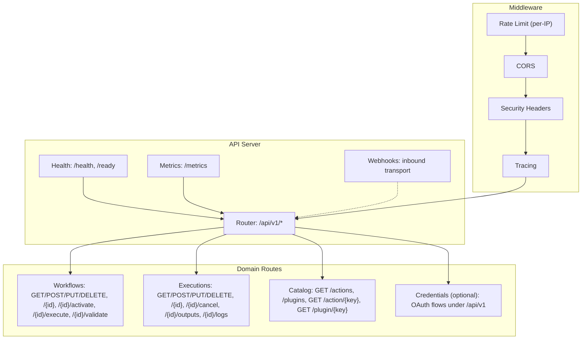
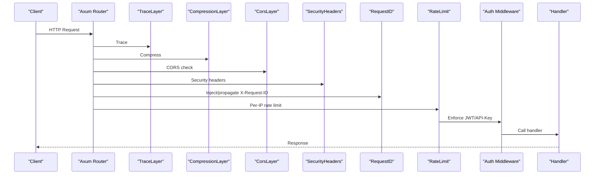
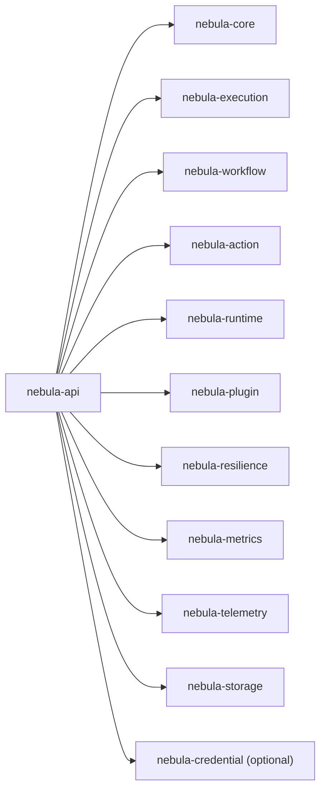

# REST API Endpoints

<cite>
**Referenced Files in This Document**
- [lib.rs](file://crates/api/src/lib.rs)
- [app.rs](file://crates/api/src/app.rs)
- [mod.rs](file://crates/api/src/routes/mod.rs)
- [workflow.rs](file://crates/api/src/routes/workflow.rs)
- [execution.rs](file://crates/api/src/routes/execution.rs)
- [handlers/mod.rs](file://crates/api/src/handlers/mod.rs)
- [workflow.rs](file://crates/api/src/handlers/workflow.rs)
- [execution.rs](file://crates/api/src/handlers/execution.rs)
- [health.rs](file://crates/api/src/handlers/health.rs)
- [metrics.rs](file://crates/api/src/handlers/metrics.rs)
- [auth.rs](file://crates/api/src/middleware/auth.rs)
- [rate_limit.rs](file://crates/api/src/middleware/rate_limit.rs)
- [security_headers.rs](file://crates/api/src/middleware/security_headers.rs)
- [webhook/mod.rs](file://crates/api/src/webhook/mod.rs)
- [webhook_transport.rs](file://crates/api/src/webhook/transport.rs)
- [webhook_endpoint_provider.rs](file://crates/api/src/webhook/endpoint_provider.rs)
- [webhook_rate_limiter.rs](file://crates/api/src/webhook/rate_limiter.rs)
- [webhook_signature.rs](file://crates/api/src/webhook/signature.rs)
- [webhook_payload_validation.rs](file://crates/api/src/webhook/payload_validation.rs)
- [webhook_delivery_guarantee.rs](file://crates/api/src/webhook/delivery_guarantee.rs)
- [webhook_integration_test.rs](file://crates/api/tests/webhook_transport_integration.rs)
- [rest_body_limit_test.rs](file://crates/api/tests/rest_body_limit.rs)
- [e2e_oauth2_flow_test.rs](file://crates/api/tests/e2e_oauth2_flow.rs)
- [Cargo.toml](file://crates/api/Cargo.toml)
</cite>

## Table of Contents
1. [Introduction](#introduction)
2. [Project Structure](#project-structure)
3. [Core Components](#core-components)
4. [Architecture Overview](#architecture-overview)
5. [Detailed Component Analysis](#detailed-component-analysis)
6. [Dependency Analysis](#dependency-analysis)
7. [Performance Considerations](#performance-considerations)
8. [Troubleshooting Guide](#troubleshooting-guide)
9. [Conclusion](#conclusion)

## Introduction
This document provides comprehensive REST API documentation for Nebula's HTTP endpoints. It covers workflow management, execution control, credential operations (when enabled), webhook handling, and health checks. The API follows a layered architecture with explicit authentication planes, robust middleware for security and performance, and webhook transport for inbound triggers. The documentation includes HTTP method mappings, URL patterns, request/response schemas, authentication requirements, rate limiting, error handling, and practical examples.

## Project Structure
Nebula's API server is implemented as a modular Axum application with domain-specific route groups and thin handlers delegating to injected ports. Middleware enforces authentication, rate limiting, compression, CORS, and security headers. Webhook transport is integrated alongside REST routes for unified ingress.

**Diagram sources**
- [mod.rs:17-42](file://crates/api/src/routes/mod.rs#L17-L42)
- [workflow.rs:10-32](file://crates/api/src/routes/workflow.rs#L10-L32)
- [execution.rs:10-25](file://crates/api/src/routes/execution.rs#L10-L25)
- [app.rs:18-69](file://crates/api/src/app.rs#L18-L69)

**Section sources**
- [lib.rs:1-60](file://crates/api/src/lib.rs#L1-L60)
- [app.rs:1-187](file://crates/api/src/app.rs#L1-L187)
- [mod.rs:1-43](file://crates/api/src/routes/mod.rs#L1-L43)

## Core Components
- Application builder constructs the router with middleware stack and merges webhook transport.
- Route modules define domain-specific endpoints under /api/v1 and public endpoints for health and metrics.
- Handlers are thin wrappers extracting requests, validating inputs, and delegating to injected ports.
- Middleware enforces authentication (JWT + API key), rate limiting, compression, CORS, and security headers.
- Webhook transport integrates inbound triggers with per-provider rate limiting and signature verification.

Key capabilities:
- Authentication planes separation (Plane A for API access, Plane B for integration credentials).
- Optional credential OAuth routes nested under /api/v1 guarded by Plane A middleware.
- Unified ingress supporting both REST and webhook routes on the same server.

**Section sources**
- [lib.rs:18-29](file://crates/api/src/lib.rs#L18-L29)
- [app.rs:18-69](file://crates/api/src/app.rs#L18-L69)
- [mod.rs:17-42](file://crates/api/src/routes/mod.rs#L17-L42)
- [Cargo.toml:98-112](file://crates/api/Cargo.toml#L98-L112)

## Architecture Overview
The API server composes middleware layers and routes, with webhook transport merged into the same Axum app for single-port operation. CORS and security headers align with accepted authentication headers. Request IDs propagate through the stack for observability.

**Diagram sources**
- [app.rs:44-68](file://crates/api/src/app.rs#L44-L68)
- [app.rs:99-142](file://crates/api/src/app.rs#L99-L142)
- [auth.rs](file://crates/api/src/middleware/auth.rs)
- [rate_limit.rs](file://crates/api/src/middleware/rate_limit.rs)
- [security_headers.rs](file://crates/api/src/middleware/security_headers.rs)

## Detailed Component Analysis

### Authentication and Authorization
- Plane A (API access): JWT bearer tokens and X-API-Key headers.
- Plane B (integration credentials): Optional OAuth flows under /api/v1 guarded by Plane A middleware.
- Authentication middleware validates tokens and API keys; CORS allows required headers.

Headers:
- Authorization: Bearer <JWT>
- X-API-Key: <api-key>
- Content-Type: application/json
- Accept: application/json
- X-Request-ID: generated or propagated

Behavior:
- Missing or invalid credentials result in appropriate 401/403 responses.
- CORS preflight accommodates authentication headers.

**Section sources**
- [lib.rs:18-29](file://crates/api/src/lib.rs#L18-L29)
- [app.rs:119-141](file://crates/api/src/app.rs#L119-L141)
- [auth.rs](file://crates/api/src/middleware/auth.rs)

### Rate Limiting
- Global per-IP rate limiter configured at server startup.
- Middleware applies limits before heavier processing.
- Configurable via API server configuration.

Guidance:
- Tune rate_limit_per_second according to deployment capacity.
- Monitor rejection patterns and adjust per-route allowances if needed.

**Section sources**
- [app.rs:40-68](file://crates/api/src/app.rs#L40-L68)
- [rate_limit.rs](file://crates/api/src/middleware/rate_limit.rs)

### Health and Readiness Checks
Endpoints:
- GET /health: Liveness check
- GET /ready: Readiness check

Response:
- 200 OK with minimal payload indicating service availability.
- Non-OK responses indicate unhealthy state.

**Section sources**
- [health.rs](file://crates/api/src/handlers/health.rs)
- [mod.rs:18-27](file://crates/api/src/routes/mod.rs#L18-L27)

### Metrics Endpoint
- GET /metrics: Exposes Prometheus metrics for scraping.
- No authentication required for metric scrapers.

**Section sources**
- [metrics.rs](file://crates/api/src/handlers/metrics.rs)
- [mod.rs:20-26](file://crates/api/src/routes/mod.rs#L20-L26)

### Workflow Management
URL Patterns:
- GET /api/v1/workflows
- POST /api/v1/workflows
- GET /api/v1/workflows/{id}
- PUT /api/v1/workflows/{id}
- DELETE /api/v1/workflows/{id}
- POST /api/v1/workflows/{id}/activate
- POST /api/v1/workflows/{id}/execute
- POST /api/v1/workflows/{id}/validate

Request/Response Schemas:
- List workflows: array of workflow summaries.
- Create workflow: request body defines workflow metadata and definition; response includes created workflow identifier and timestamps.
- Get workflow: returns full workflow definition.
- Update workflow: patch-like updates to workflow metadata/definition.
- Delete workflow: removes workflow by identifier.
- Activate workflow: transitions workflow to active state.
- Execute workflow: enqueues execution asynchronously; returns 202 Accepted with execution identifier.
- Validate workflow: validates workflow definition without persisting.

Headers:
- Authorization: Bearer <JWT>
- X-API-Key: <api-key>
- Content-Type: application/json

Response Codes:
- 200 OK: Successful retrieval or update.
- 201 Created: Resource created.
- 202 Accepted: Execution started.
- 400 Bad Request: Validation errors.
- 401 Unauthorized: Missing/invalid credentials.
- 403 Forbidden: Insufficient permissions.
- 404 Not Found: Resource not found.
- 409 Conflict: Validation conflicts.
- 422 Unprocessable Entity: Business validation failures.
- 429 Too Many Requests: Rate limited.
- 500 Internal Server Error: Unexpected server errors.

Pagination, Filtering, Sorting:
- Pagination supported for listing workflows.
- Filtering and sorting available via query parameters (e.g., limit, offset, sort, filter).

Examples:
- Create workflow:
  - Method: POST
  - URL: /api/v1/workflows
  - Headers: Authorization, X-API-Key, Content-Type
  - Body: workflow definition JSON
  - Response: 201 with workflow metadata

- Execute workflow:
  - Method: POST
  - URL: /api/v1/workflows/{id}/execute
  - Headers: Authorization, X-API-Key, Content-Type
  - Body: execution request JSON
  - Response: 202 with execution identifier

**Section sources**
- [workflow.rs:10-32](file://crates/api/src/routes/workflow.rs#L10-L32)
- [handlers/workflow.rs:492-521](file://crates/api/src/handlers/workflow.rs#L492-L521)
- [handlers/mod.rs:17-20](file://crates/api/src/handlers/mod.rs#L17-L20)

### Execution Control
URL Patterns:
- GET /api/v1/workflows/{workflow_id}/executions
- POST /api/v1/workflows/{workflow_id}/executions
- GET /api/v1/executions
- GET /api/v1/executions/{id}
- GET /api/v1/executions/{id}/cancel
- GET /api/v1/executions/{id}/outputs
- GET /api/v1/executions/{id}/logs

Request/Response Schemas:
- List executions: array of execution summaries.
- Start execution: request body defines inputs; response includes execution identifier.
- Get execution: returns execution state and metadata.
- Cancel execution: cancels running or queued execution.
- Outputs: returns node outputs for the execution.
- Logs: returns execution logs.

Headers:
- Authorization: Bearer <JWT>
- X-API-Key: <api-key>
- Content-Type: application/json

Response Codes:
- 200 OK: Successful retrieval.
- 202 Accepted: Async operation started.
- 400 Bad Request: Validation errors.
- 401 Unauthorized: Missing/invalid credentials.
- 403 Forbidden: Insufficient permissions.
- 404 Not Found: Resource not found.
- 422 Unprocessable Entity: Business validation failures.
- 429 Too Many Requests: Rate limited.
- 500 Internal Server Error: Unexpected server errors.

Pagination, Filtering, Sorting:
- Pagination supported for listing executions.
- Filtering and sorting via query parameters.

Examples:
- Start execution:
  - Method: POST
  - URL: /api/v1/workflows/{workflow_id}/executions
  - Headers: Authorization, X-API-Key, Content-Type
  - Body: inputs JSON
  - Response: 201 with execution metadata

- Cancel execution:
  - Method: POST
  - URL: /api/v1/executions/{id}/cancel
  - Headers: Authorization, X-API-Key
  - Response: 200 with cancellation result

**Section sources**
- [execution.rs:10-25](file://crates/api/src/routes/execution.rs#L10-L25)
- [handlers/execution.rs](file://crates/api/src/handlers/execution.rs)
- [handlers/mod.rs:12-16](file://crates/api/src/handlers/mod.rs#L12-L16)

### Catalog Operations
URL Patterns:
- GET /api/v1/actions
- GET /api/v1/plugins
- GET /api/v1/action/{key}
- GET /api/v1/plugin/{key}

Purpose:
- Retrieve available actions and plugins for building workflows.

Response Codes:
- 200 OK: Successful retrieval.
- 401 Unauthorized: Missing/invalid credentials.
- 403 Forbidden: Insufficient permissions.
- 404 Not Found: Resource not found.
- 429 Too Many Requests: Rate limited.
- 500 Internal Server Error: Unexpected server errors.

**Section sources**
- [handlers/mod.rs](file://crates/api/src/handlers/mod.rs#L11)

### Credential Operations (Optional)
When the credential-oauth feature is enabled, OAuth flows for integration credentials are exposed under /api/v1 and protected by Plane A authentication.

Endpoints:
- OAuth authorization and token exchange routes (nested under /api/v1).

Notes:
- These routes require Plane A credentials to operate.
- Implementation depends on external OAuth providers.

**Section sources**
- [lib.rs:23-27](file://crates/api/src/lib.rs#L23-L27)
- [mod.rs:38-39](file://crates/api/src/routes/mod.rs#L38-L39)
- [Cargo.toml:104-112](file://crates/api/Cargo.toml#L104-L112)

### Webhook Handling
Webhook transport is integrated into the main API server, allowing external providers to deliver events to webhook endpoints on the same port.

Key capabilities:
- Inbound trigger transport with provider-specific routing.
- Per-provider rate limiting to prevent abuse.
- Signature verification for authenticity.
- Payload validation against expected schema.
- Delivery guarantees and retry/backoff strategies.

Endpoints:
- Provider-specific webhook endpoints are mounted under the webhook transport router.

Headers:
- Varying by provider; signature verification uses standard headers (e.g., HMAC-SHA256).
- Content-Type: application/json or provider-specific.

Response Codes:
- 200 OK: Event accepted.
- 400 Bad Request: Malformed payload.
- 401 Unauthorized: Invalid signature.
- 403 Forbidden: Blocked by rate limit or policy.
- 413 Payload Too Large: Body exceeds configured limit.
- 429 Too Many Requests: Rate limited.
- 500 Internal Server Error: Unexpected server errors.

Examples:
- Webhook delivery:
  - Method: POST
  - URL: Provider-specific webhook endpoint
  - Headers: Signature and content-type
  - Body: Event payload
  - Response: 200 with acknowledgment

**Section sources**
- [lib.rs:12-13](file://crates/api/src/lib.rs#L12-L13)
- [app.rs:30-38](file://crates/api/src/app.rs#L30-L38)
- [webhook/mod.rs](file://crates/api/src/webhook/mod.rs)
- [webhook_transport.rs](file://crates/api/src/webhook/transport.rs)
- [webhook_endpoint_provider.rs](file://crates/api/src/webhook/endpoint_provider.rs)
- [webhook_rate_limiter.rs](file://crates/api/src/webhook/rate_limiter.rs)
- [webhook_signature.rs](file://crates/api/src/webhook/signature.rs)
- [webhook_payload_validation.rs](file://crates/api/src/webhook/payload_validation.rs)
- [webhook_delivery_guarantee.rs](file://crates/api/src/webhook/delivery_guarantee.rs)
- [webhook_integration_test.rs](file://crates/api/tests/webhook_transport_integration.rs)

## Dependency Analysis
The API crate composes multiple internal crates for business logic and infrastructure. Dependencies include storage, execution, workflow, action, runtime, plugin, resilience, and telemetry.

**Diagram sources**
- [Cargo.toml:14-27](file://crates/api/Cargo.toml#L14-L27)

**Section sources**
- [Cargo.toml:14-68](file://crates/api/Cargo.toml#L14-L68)

## Performance Considerations
- Compression: Enabled conditionally; reduces bandwidth for large responses.
- CORS: Preconfigured to minimize preflight overhead; aligns with accepted headers.
- Rate limiting: Applied per-IP before heavy processing to protect resources.
- Body limits: REST body limit configurable; webhook transport maintains its own limits.
- Observability: Tracing and request IDs aid in diagnosing slow paths.

Recommendations:
- Enable compression for JSON-heavy APIs.
- Tune rate limits per deployment needs.
- Monitor latency and error rates at the gateway level.
- Use pagination and filtering to reduce payload sizes.

**Section sources**
- [app.rs:47-52](file://crates/api/src/app.rs#L47-L52)
- [app.rs:119-141](file://crates/api/src/app.rs#L119-L141)
- [app.rs:20-28](file://crates/api/src/app.rs#L20-L28)
- [rest_body_limit_test.rs](file://crates/api/tests/rest_body_limit.rs)

## Troubleshooting Guide
Common issues and resolutions:
- Authentication failures:
  - Ensure Authorization: Bearer <JWT> or X-API-Key is present and valid.
  - Verify JWT secret configuration and API key registration.
- CORS preflights failing:
  - Confirm browser sends required headers and preflight succeeds.
  - Check allowed origins and exposed headers configuration.
- Rate limiting:
  - Reduce request frequency or increase per-second allowance.
  - Consider client-side backoff and retries.
- Body too large:
  - Reduce payload size or adjust max body size configuration.
- Webhook signature errors:
  - Verify provider signature algorithm and shared secret.
  - Ensure payload matches expected schema and headers.

Security considerations:
- Always use HTTPS in production.
- Rotate JWT secrets and API keys regularly.
- Restrict allowed origins and expose only necessary headers.
- Monitor and alert on repeated 401/403 responses.

**Section sources**
- [auth.rs](file://crates/api/src/middleware/auth.rs)
- [security_headers.rs](file://crates/api/src/middleware/security_headers.rs)
- [rate_limit.rs](file://crates/api/src/middleware/rate_limit.rs)
- [rest_body_limit_test.rs](file://crates/api/tests/rest_body_limit.rs)
- [webhook_signature.rs](file://crates/api/src/webhook/signature.rs)

## Conclusion
Nebula’s API provides a secure, observable, and extensible HTTP surface for workflow and execution management, with optional credential OAuth flows and integrated webhook support. The documented endpoints, headers, schemas, and policies enable reliable integrations while maintaining strong operational controls through middleware and configuration.