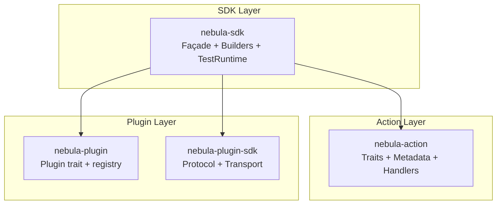
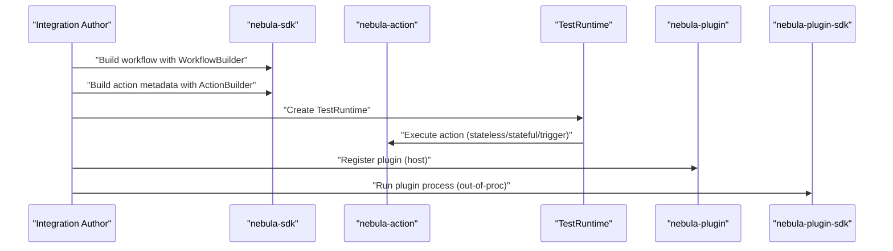
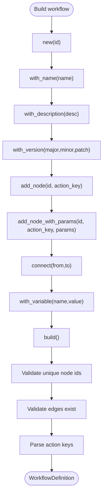
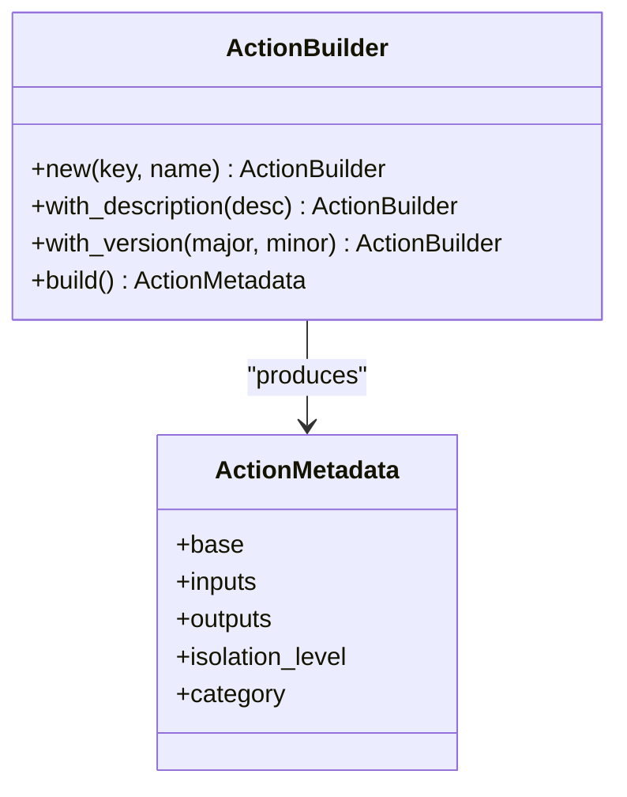
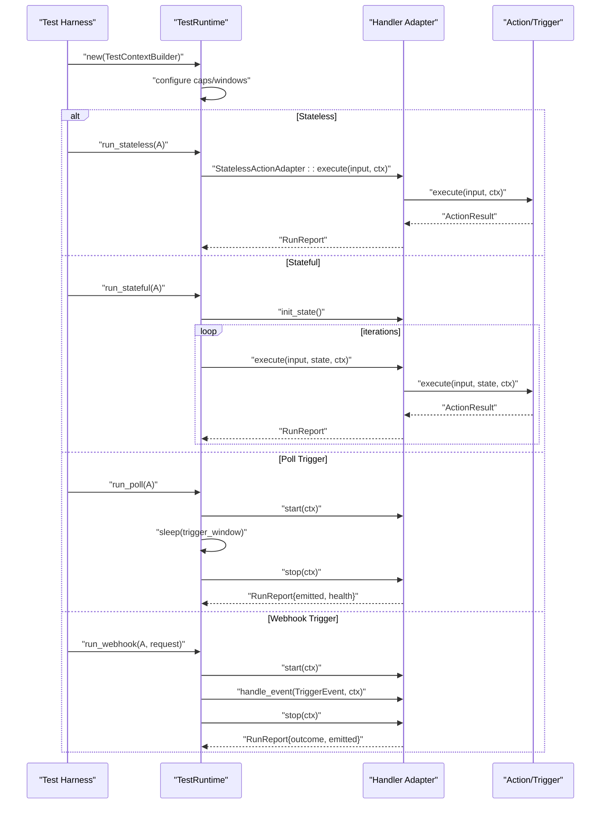
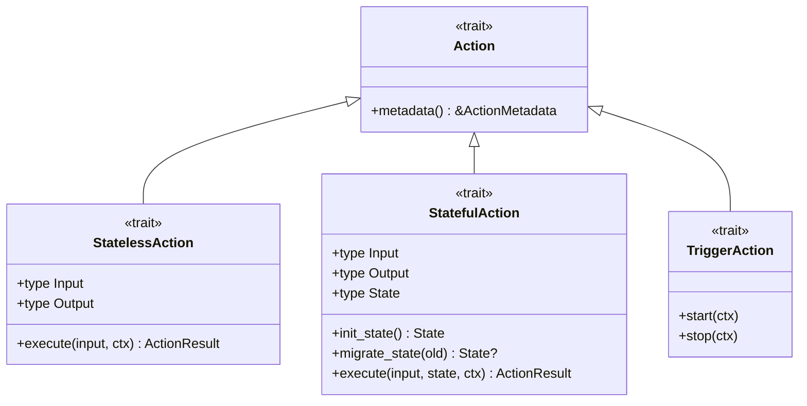
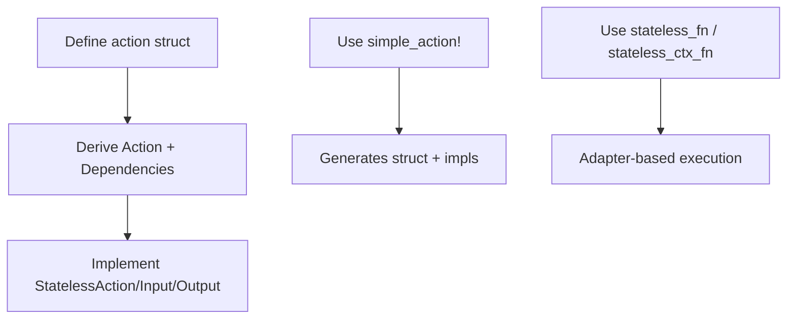
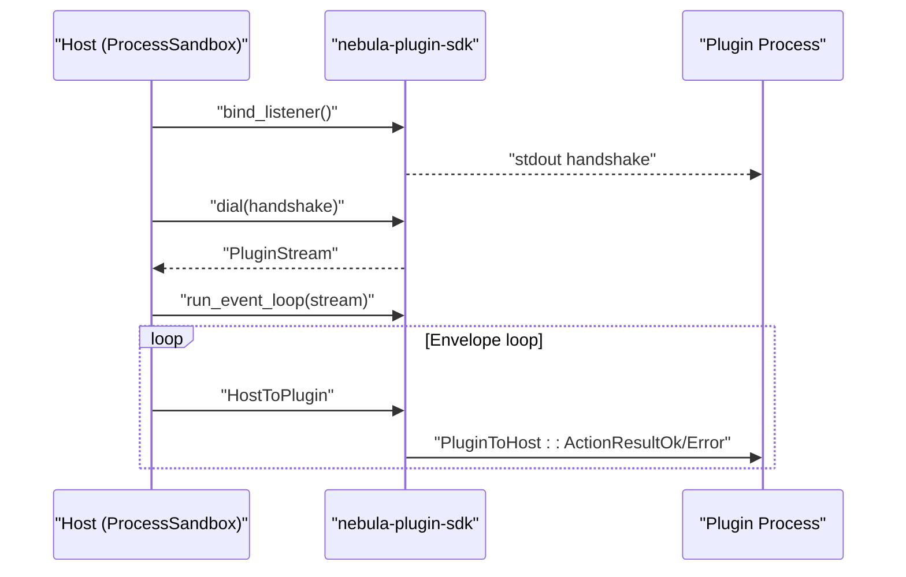
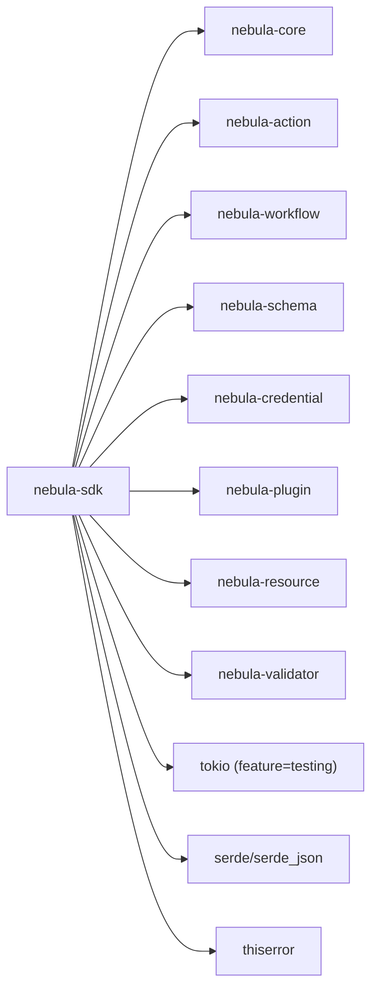

# SDK API Reference

<cite>
**Referenced Files in This Document**
- [sdk/README.md](file://crates/sdk/README.md)
- [sdk/Cargo.toml](file://crates/sdk/Cargo.toml)
- [sdk/src/lib.rs](file://crates/sdk/src/lib.rs)
- [sdk/src/workflow.rs](file://crates/sdk/src/workflow.rs)
- [sdk/src/runtimes.rs](file://crates/sdk/src/runtime.rs)
- [sdk/src/action.rs](file://crates/sdk/src/action.rs)
- [sdk/src/testing.rs](file://crates/sdk/src/testing.rs)
- [plugin-sdk/README.md](file://crates/plugin-sdk/README.md)
- [plugin-sdk/src/lib.rs](file://crates/plugin-sdk/src/lib.rs)
- [plugin-sdk/src/protocol.rs](file://crates/plugin-sdk/src/protocol.rs)
- [plugin-sdk/src/transport.rs](file://crates/plugin-sdk/src/transport.rs)
- [plugin/src/lib.rs](file://crates/plugin/src/lib.rs)
- [plugin/src/plugin.rs](file://crates/plugin/src/plugin.rs)
- [plugin/src/manifest.rs](file://crates/plugin/src/manifest.rs)
- [action/src/lib.rs](file://crates/action/src/lib.rs)
- [action/src/action.rs](file://crates/action/src/action.rs)
- [action/src/stateless.rs](file://crates/action/src/stateless.rs)
- [action/src/stateful.rs](file://crates/action/src/stateful.rs)
- [action/src/trigger.rs](file://crates/action/src/trigger.rs)
- [action/src/metadata.rs](file://crates/action/src/metadata.rs)
</cite>

## Table of Contents
1. [Introduction](#introduction)
2. [Project Structure](#project-structure)
3. [Core Components](#core-components)
4. [Architecture Overview](#architecture-overview)
5. [Detailed Component Analysis](#detailed-component-analysis)
6. [Dependency Analysis](#dependency-analysis)
7. [Performance Considerations](#performance-considerations)
8. [Troubleshooting Guide](#troubleshooting-guide)
9. [Conclusion](#conclusion)
10. [Appendices](#appendices)

## Introduction
This document is the SDK API reference for Nebula’s integration development interfaces. It focuses on:
- The SDK façade for building workflows and actions
- The TestRuntime harness for unit testing
- The action framework APIs and #[action] macro system
- Plugin development APIs and the out-of-process plugin protocol
- Practical usage patterns, parameter documentation, return values, error handling, migration notes, and production best practices

The SDK provides a single façade crate that re-exports the core integration surfaces and adds convenient builders and test harnesses.

## Project Structure
The SDK spans several crates:
- nebula-sdk: façade and helpers
- nebula-action: action trait family and execution metadata
- nebula-plugin: plugin trait and registry
- nebula-plugin-sdk: out-of-process plugin protocol and transport
- nebula-*: related integration crates (credential, resource, schema, workflow, etc.)

**Diagram sources**
- [sdk/src/lib.rs:46-58](file://crates/sdk/src/lib.rs#L46-L58)
- [action/src/lib.rs:1-152](file://crates/action/src/lib.rs#L1-L152)
- [plugin/src/lib.rs:1-50](file://crates/plugin/src/lib.rs#L1-L50)
- [plugin-sdk/src/lib.rs:1-120](file://crates/plugin-sdk/src/lib.rs#L1-L120)

**Section sources**
- [sdk/README.md:10-115](file://crates/sdk/README.md#L10-L115)
- [sdk/Cargo.toml:14-38](file://crates/sdk/Cargo.toml#L14-L38)

## Core Components
- WorkflowBuilder: programmatic workflow construction with method chaining, node addition, connections, and validation.
- ActionBuilder: programmatic action metadata construction with key, name, description, and version.
- TestRuntime: in-process harness for running actions end-to-end, capturing outputs and diagnostics.
- Testing helpers: assertions and fixtures for quick unit tests.
- SDK façade: re-exports core crates and provides macros for workflows and actions.

Key APIs:
- WorkflowBuilder::new → with_name / with_description / with_version → add_node / add_node_with_params → connect → build
- ActionBuilder::new → with_description → with_version → build
- TestRuntime::new → run_stateless / run_stateful / run_poll / run_webhook
- Testing helpers: is_success / is_failure / assert_success / assert_failure / fixtures

**Section sources**
- [sdk/src/workflow.rs:44-276](file://crates/sdk/src/workflow.rs#L44-L276)
- [sdk/src/action.rs:33-73](file://crates/sdk/src/action.rs#L33-L73)
- [sdk/src/runtimes.rs:86-306](file://crates/sdk/src/runtime.rs#L86-L306)
- [sdk/src/testing.rs:21-75](file://crates/sdk/src/testing.rs#L21-L75)
- [sdk/src/lib.rs:116-279](file://crates/sdk/src/lib.rs#L116-L279)

## Architecture Overview
The SDK integrates with the action and plugin ecosystems to enable:
- Programmatic workflow and action metadata creation
- In-process testing of actions and triggers
- Out-of-process plugin execution via a duplex JSON protocol

**Diagram sources**
- [sdk/src/workflow.rs:44-276](file://crates/sdk/src/workflow.rs#L44-L276)
- [sdk/src/action.rs:33-73](file://crates/sdk/src/action.rs#L33-L73)
- [sdk/src/runtimes.rs:86-306](file://crates/sdk/src/runtime.rs#L86-L306)
- [plugin/src/plugin.rs:27-84](file://crates/plugin/src/plugin.rs#L27-L84)
- [plugin-sdk/src/lib.rs:156-186](file://crates/plugin-sdk/src/lib.rs#L156-L186)

## Detailed Component Analysis

### WorkflowBuilder
Programmatic workflow construction with validation and method chaining.

- Construction
  - new(id): creates a builder with a generated WorkflowId and default version 1.0.0
  - with_name(name), with_description(desc), with_version(major, minor, patch)
- Nodes
  - add_node(id, action_key): registers a node with a user-facing id and action key
  - add_node_with_params(id, action_key, parameters): registers a node with initial parameters
- Edges
  - connect(from, to): connects two nodes by their ids
- Variables
  - with_variable(name, value): attaches a workflow variable
- Build
  - build(): validates uniqueness of node ids, resolves node keys, validates action keys, and constructs a WorkflowDefinition

Validation highlights:
- Duplicate node ids are rejected
- Unknown node ids in connections are rejected
- Invalid action keys produce action errors
- Node id normalization supports fallbacks for invalid identifiers

**Diagram sources**
- [sdk/src/workflow.rs:62-276](file://crates/sdk/src/workflow.rs#L62-L276)

**Section sources**
- [sdk/src/workflow.rs:44-276](file://crates/sdk/src/workflow.rs#L44-L276)

### ActionBuilder
Programmatic action metadata construction.

- new(key, name): creates a builder with a key and human-friendly name
- with_description(text): sets a description
- with_version(major, minor): sets interface version
- build(): produces ActionMetadata

**Diagram sources**
- [sdk/src/action.rs:33-73](file://crates/sdk/src/action.rs#L33-L73)
- [action/src/metadata.rs:97-118](file://crates/action/src/metadata.rs#L97-L118)

**Section sources**
- [sdk/src/action.rs:33-73](file://crates/sdk/src/action.rs#L33-L73)
- [action/src/metadata.rs:127-338](file://crates/action/src/metadata.rs#L127-L338)

### TestRuntime
In-process harness for running actions and triggers end-to-end.

- Runtime configuration
  - with_stateful_cap(n): iteration cap for stateful actions
  - with_trigger_window(duration): poll trigger runtime window
- Execution modes
  - run_stateless(action): single execute call, returns RunReport
  - run_stateful(action): loop execute until break or cap, returns RunReport
  - run_poll(action): spawn start, sleep window, cancel, capture emitted events
  - run_webhook(action, request): start → handle_event → stop, capture emitted
- RunReport fields
  - kind: "stateless", "stateful", "trigger:poll", "trigger:webhook"
  - output: primary output (ActionResult payload)
  - iterations: 1 for stateless, loop count for stateful, emitted count for triggers
  - duration: wall-clock time
  - emitted: emitted payloads for triggers
  - note: break reason, cap hit, start error, etc.
  - health: trigger health snapshot (when applicable)

**Diagram sources**
- [sdk/src/runtimes.rs:86-306](file://crates/sdk/src/runtime.rs#L86-L306)

**Section sources**
- [sdk/src/runtimes.rs:56-306](file://crates/sdk/src/runtime.rs#L56-L306)

### Action Framework APIs
The action framework defines the trait family and execution metadata.

- Core traits
  - Action: base trait providing metadata
  - StatelessAction: pure function from input to ActionResult
  - StatefulAction: iterative execution with persistent state
  - TriggerAction: workflow starters with start/stop lifecycle
  - ResourceAction: scoped resource configuration
- Metadata
  - ActionMetadata: key, version, ports, schema, isolation level, category
- Handlers and adapters
  - StatelessHandler, StatefulHandler, TriggerHandler
  - StatelessActionAdapter, StatefulActionAdapter, TriggerActionAdapter
- DX helpers
  - stateless_fn, stateless_ctx_fn for low-boilerplate actions
  - PaginatedAction, BatchAction convenience traits
  - #[action] macro system (see next section)

**Diagram sources**
- [action/src/action.rs:17-20](file://crates/action/src/action.rs#L17-L20)
- [action/src/stateless.rs:68-91](file://crates/action/src/stateless.rs#L68-L91)
- [action/src/stateful.rs:35-75](file://crates/action/src/stateful.rs#L35-L75)
- [action/src/trigger.rs:58-64](file://crates/action/src/trigger.rs#L58-L64)

**Section sources**
- [action/src/lib.rs:1-152](file://crates/action/src/lib.rs#L1-L152)
- [action/src/action.rs:17-20](file://crates/action/src/action.rs#L17-L20)
- [action/src/stateless.rs:68-91](file://crates/action/src/stateless.rs#L68-L91)
- [action/src/stateful.rs:35-75](file://crates/action/src/stateful.rs#L35-L75)
- [action/src/trigger.rs:58-64](file://crates/action/src/trigger.rs#L58-L64)
- [action/src/metadata.rs:97-118](file://crates/action/src/metadata.rs#L97-L118)

### #[action] Macro System and Custom Actions
The SDK provides convenience macros and helpers for action development.

- simple_action!
  - Generates a unit struct implementing Action + ActionDependencies + StatelessAction
  - Requires Input/Output types implementing HasSchema
  - Uses action_key! for the key and stringified name for metadata
- stateless_fn / stateless_ctx_fn
  - Zero-boilerplate adapters for async closures
  - stateless_ctx_fn injects credentials/resources/loggers into each invocation
- helpers
  - validate_schema: basic JSON schema validation
  - parse_input: typed parsing with serialization error conversion

**Diagram sources**
- [sdk/src/lib.rs:235-279](file://crates/sdk/src/lib.rs#L235-L279)
- [action/src/stateless.rs:155-302](file://crates/action/src/stateless.rs#L155-L302)

**Section sources**
- [sdk/src/lib.rs:116-279](file://crates/sdk/src/lib.rs#L116-L279)
- [action/src/stateless.rs:155-302](file://crates/action/src/stateless.rs#L155-L302)

### Plugin Development API
The SDK integrates with plugin and plugin-sdk crates for out-of-process execution.

- Plugin trait
  - Plugin: base trait every plugin implements; provides actions, credentials, resources, on_load/on_unload hooks
  - PluginManifest: bundle descriptor with builder API
  - PluginRegistry: in-memory registry
- Plugin SDK
  - PluginHandler: implement run_duplex; provides manifest, actions, execute
  - PluginCtx: execution context (placeholder)
  - PluginError: typed error with fatal/retryable variants
  - run_duplex: main entry point; binds transport, prints handshake, runs event loop
  - protocol: HostToPlugin / PluginToHost envelopes and ActionDescriptor
  - transport: bind_listener, dial, PluginListener, PluginStream

**Diagram sources**
- [plugin-sdk/src/lib.rs:188-242](file://crates/plugin-sdk/src/lib.rs#L188-L242)
- [plugin-sdk/src/protocol.rs:46-84](file://crates/plugin-sdk/src/protocol.rs#L46-L84)
- [plugin-sdk/src/transport.rs:364-421](file://crates/plugin-sdk/src/transport.rs#L364-L421)

**Section sources**
- [plugin/src/lib.rs:1-50](file://crates/plugin/src/lib.rs#L1-L50)
- [plugin/src/plugin.rs:27-84](file://crates/plugin/src/plugin.rs#L27-L84)
- [plugin/src/manifest.rs:1-11](file://crates/plugin/src/manifest.rs#L1-L11)
- [plugin-sdk/README.md:10-98](file://crates/plugin-sdk/README.md#L10-L98)
- [plugin-sdk/src/lib.rs:156-242](file://crates/plugin-sdk/src/lib.rs#L156-L242)
- [plugin-sdk/src/protocol.rs:46-155](file://crates/plugin-sdk/src/protocol.rs#L46-L155)
- [plugin-sdk/src/transport.rs:80-421](file://crates/plugin-sdk/src/transport.rs#L80-L421)

## Dependency Analysis
The SDK re-exports core integration crates and composes them into a cohesive façade.

**Diagram sources**
- [sdk/Cargo.toml:14-38](file://crates/sdk/Cargo.toml#L14-L38)
- [sdk/src/lib.rs:46-60](file://crates/sdk/src/lib.rs#L46-L60)

**Section sources**
- [sdk/Cargo.toml:14-38](file://crates/sdk/Cargo.toml#L14-L38)
- [sdk/src/lib.rs:46-60](file://crates/sdk/src/lib.rs#L46-L60)

## Performance Considerations
- Use appropriate isolation levels:
  - IsolationLevel::None for in-process actions
  - IsolationLevel::CapabilityGated for capability-gated in-process actions
  - IsolationLevel::Isolated for out-of-process plugins
- Prefer stateless actions for pure transformations to reduce checkpoint overhead
- For stateful actions, keep state serializable and bounded; use pagination/batch helpers to manage large datasets
- Tune TestRuntime caps and windows to avoid excessive resource usage during tests
- Out-of-process plugins should leverage the duplex protocol’s sequential dispatch characteristics; parallelism is planned for future slices

[No sources needed since this section provides general guidance]

## Troubleshooting Guide
Common issues and resolutions:
- Workflow building errors
  - Duplicate node ids: ensure unique node ids across the workflow
  - Unknown node ids in connections: verify node ids used in connect() exist
  - Invalid action keys: ensure action_key strings are valid ActionKey
- Action execution errors
  - Validation failures: check input schema and required fields
  - Serialization errors: ensure Input/Output types implement HasSchema and are serializable
  - Retryable vs fatal: categorize errors appropriately using ActionError
- TestRuntime reports
  - Iteration caps: adjust with_stateful_cap for long-running stateful actions
  - Trigger windows: adjust with_trigger_window for poll triggers
  - Notes: inspect RunReport.note for break reasons or start errors

**Section sources**
- [sdk/src/workflow.rs:159-276](file://crates/sdk/src/workflow.rs#L159-L276)
- [sdk/src/runtimes.rs:117-306](file://crates/sdk/src/runtime.rs#L117-L306)
- [action/src/stateless.rs:389-403](file://crates/action/src/stateless.rs#L389-L403)
- [action/src/stateful.rs:539-610](file://crates/action/src/stateful.rs#L539-L610)

## Conclusion
The SDK provides a cohesive façade for building workflows, actions, and testing them in-process, while integrating with the broader action and plugin ecosystems. By leveraging WorkflowBuilder, ActionBuilder, TestRuntime, and the action framework APIs, integration authors can develop robust, testable, and production-ready integrations. For out-of-process execution, the plugin SDK and protocol offer a stable duplex JSON envelope and transport abstraction.

[No sources needed since this section summarizes without analyzing specific files]

## Appendices

### Migration and Compatibility Notes
- SDK stability
  - The SDK maintains a stable façade; breaking changes to prelude or WorkflowBuilder require explicit announcements
  - The testing module and TestRuntime are usable but coverage is growing
- Credential/OAuth surface
  - The SDK re-exports nebula-credential; when credential/OAuth types move or rename, follow nebula-credential release notes
- Plugin protocol
  - Protocol versioning is evolving; breaking wire format changes require migration guidance

**Section sources**
- [sdk/README.md:75-115](file://crates/sdk/README.md#L75-L115)
- [plugin-sdk/README.md:49-98](file://crates/plugin-sdk/README.md#L49-L98)

### API Reference Index
- WorkflowBuilder
  - Methods: new, with_name, with_description, with_version, add_node, add_node_with_params, connect, with_variable, build
  - Returns: WorkflowDefinition or SDK Error
- ActionBuilder
  - Methods: new, with_description, with_version, build
  - Returns: ActionMetadata
- TestRuntime
  - Methods: new, with_stateful_cap, with_trigger_window, run_stateless, run_stateful, run_poll, run_webhook
  - Returns: RunReport
- Testing helpers
  - Functions: is_success, is_failure, assert_success, assert_failure, fixtures (workflow_id, execution_id, timestamp)
- Plugin SDK
  - Traits: PluginHandler, Plugin
  - Types: PluginCtx, PluginError, PluginManifest, ActionDescriptor
  - Functions: run_duplex, dial, bind_listener
  - Protocol: HostToPlugin, PluginToHost, LogLevel, ActionDescriptor

**Section sources**
- [sdk/src/workflow.rs:62-276](file://crates/sdk/src/workflow.rs#L62-L276)
- [sdk/src/action.rs:40-73](file://crates/sdk/src/action.rs#L40-L73)
- [sdk/src/runtimes.rs:92-306](file://crates/sdk/src/runtime.rs#L92-L306)
- [sdk/src/testing.rs:21-75](file://crates/sdk/src/testing.rs#L21-L75)
- [plugin/src/plugin.rs:27-84](file://crates/plugin/src/plugin.rs#L27-L84)
- [plugin-sdk/src/lib.rs:156-242](file://crates/plugin-sdk/src/lib.rs#L156-L242)
- [plugin-sdk/src/protocol.rs:46-155](file://crates/plugin-sdk/src/protocol.rs#L46-L155)
- [plugin-sdk/src/transport.rs:364-421](file://crates/plugin-sdk/src/transport.rs#L364-L421)