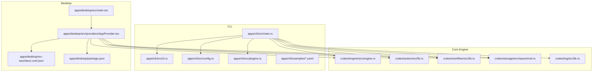
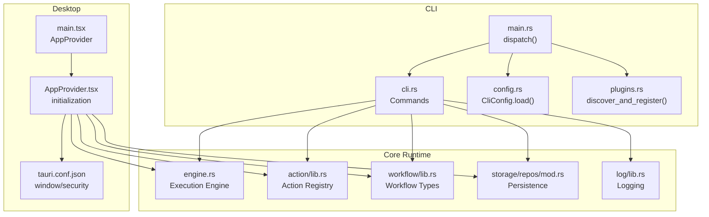
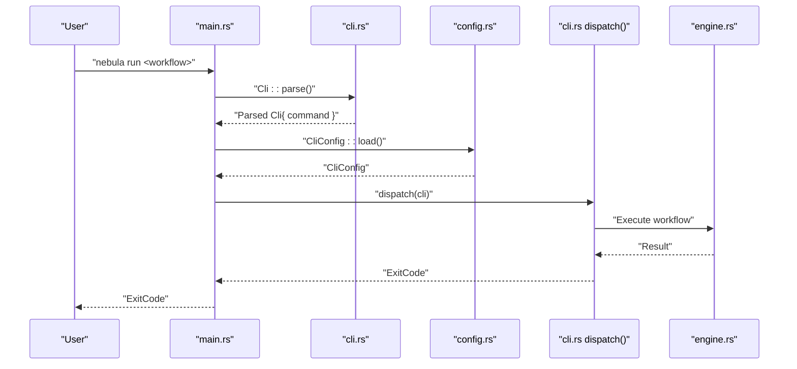
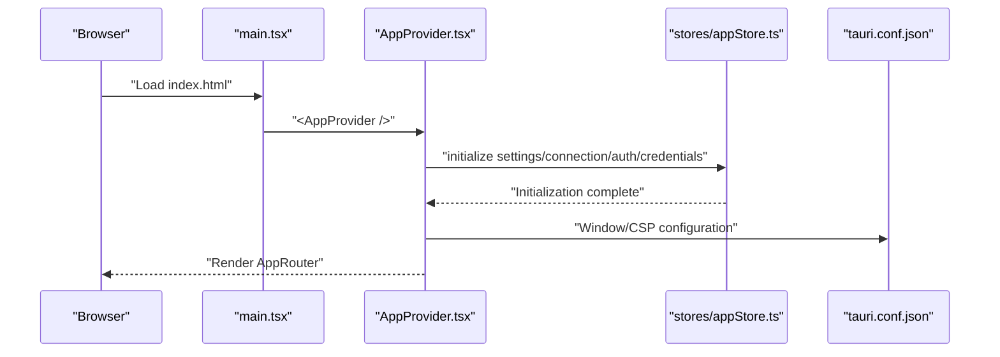
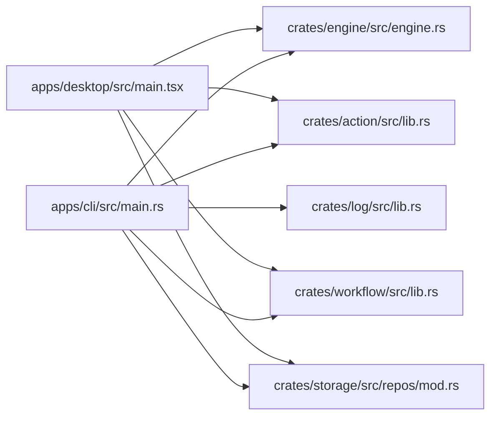

# Application Layer

<cite>
**Referenced Files in This Document**
- [apps/cli/src/main.rs](file://apps/cli/src/main.rs)
- [apps/cli/src/cli.rs](file://apps/cli/src/cli.rs)
- [apps/cli/src/config.rs](file://apps/cli/src/config.rs)
- [apps/cli/src/plugins.rs](file://apps/cli/src/plugins.rs)
- [apps/cli/examples/hello.yaml](file://apps/cli/examples/hello.yaml)
- [apps/cli/examples/pipeline.yaml](file://apps/cli/examples/pipeline.yaml)
- [apps/cli/examples/complex.yaml](file://apps/cli/examples/complex.yaml)
- [apps/cli/examples/http-test.yaml](file://apps/cli/examples/http-test.yaml)
- [apps/cli/examples/community-plugin-test.yaml](file://apps/cli/examples/community-plugin-test.yaml)
- [apps/desktop/src/main.tsx](file://apps/desktop/src/main.tsx)
- [apps/desktop/src/providers/AppProvider.tsx](file://apps/desktop/src/providers/AppProvider.tsx)
- [apps/desktop/src/stores/appStore.ts](file://apps/desktop/src/stores/appStore.ts)
- [apps/desktop/src-tauri/tauri.conf.json](file://apps/desktop/src-tauri/tauri.conf.json)
- [apps/desktop/package.json](file://apps/desktop/package.json)
- [crates/engine/src/engine.rs](file://crates/engine/src/engine.rs)
- [crates/action/src/lib.rs](file://crates/action/src/lib.rs)
- [crates/workflow/src/lib.rs](file://crates/workflow/src/lib.rs)
- [crates/storage/src/repos/mod.rs](file://crates/storage/src/repos/mod.rs)
- [crates/log/src/lib.rs](file://crates/log/src/lib.rs)
</cite>

## Table of Contents
1. [Introduction](#introduction)
2. [Project Structure](#project-structure)
3. [Core Components](#core-components)
4. [Architecture Overview](#architecture-overview)
5. [Detailed Component Analysis](#detailed-component-analysis)
6. [Dependency Analysis](#dependency-analysis)
7. [Performance Considerations](#performance-considerations)
8. [Troubleshooting Guide](#troubleshooting-guide)
9. [Conclusion](#conclusion)
10. [Appendices](#appendices)

## Introduction
This document describes the Application Layer of Nebula, focusing on two user-facing applications:
- The CLI application for workflow authoring, validation, execution, and plugin management
- The Desktop application integrating Tauri, React, and a workflow editor for visual development and monitoring

It explains how these applications interact with the core engine and business layer, how to configure and operate them, and how to extend them for advanced use cases.

## Project Structure
The Application Layer spans:
- CLI application under apps/cli
- Desktop application under apps/desktop with Tauri configuration under apps/desktop/src-tauri

**Diagram sources**
- [apps/cli/src/main.rs:1-106](file://apps/cli/src/main.rs#L1-L106)
- [apps/cli/src/cli.rs:1-359](file://apps/cli/src/cli.rs#L1-L359)
- [apps/cli/src/config.rs:1-433](file://apps/cli/src/config.rs#L1-L433)
- [apps/cli/src/plugins.rs:1-82](file://apps/cli/src/plugins.rs#L1-L82)
- [apps/desktop/src/main.tsx:1-14](file://apps/desktop/src/main.tsx#L1-L14)
- [apps/desktop/src/providers/AppProvider.tsx:1-76](file://apps/desktop/src/providers/AppProvider.tsx#L1-L76)
- [apps/desktop/src-tauri/tauri.conf.json:1-62](file://apps/desktop/src-tauri/tauri.conf.json#L1-L62)
- [apps/desktop/package.json:1-48](file://apps/desktop/package.json#L1-L48)
- [crates/engine/src/engine.rs](file://crates/engine/src/engine.rs)
- [crates/action/src/lib.rs](file://crates/action/src/lib.rs)
- [crates/workflow/src/lib.rs](file://crates/workflow/src/lib.rs)
- [crates/storage/src/repos/mod.rs](file://crates/storage/src/repos/mod.rs)
- [crates/log/src/lib.rs](file://crates/log/src/lib.rs)

**Section sources**
- [apps/cli/src/main.rs:1-106](file://apps/cli/src/main.rs#L1-L106)
- [apps/desktop/src/main.tsx:1-14](file://apps/desktop/src/main.tsx#L1-L14)

## Core Components
- CLI entry point and command dispatcher
- CLI configuration loader with layered resolution
- Plugin discovery and registration
- Desktop React entry and provider initialization
- Tauri window and security configuration
- Example workflow definitions for common scenarios

**Section sources**
- [apps/cli/src/main.rs:18-106](file://apps/cli/src/main.rs#L18-L106)
- [apps/cli/src/cli.rs:18-359](file://apps/cli/src/cli.rs#L18-L359)
- [apps/cli/src/config.rs:163-216](file://apps/cli/src/config.rs#L163-L216)
- [apps/cli/src/plugins.rs:23-82](file://apps/cli/src/plugins.rs#L23-L82)
- [apps/desktop/src/main.tsx:1-14](file://apps/desktop/src/main.tsx#L1-L14)
- [apps/desktop/src/providers/AppProvider.tsx:1-76](file://apps/desktop/src/providers/AppProvider.tsx#L1-L76)
- [apps/desktop/src-tauri/tauri.conf.json:1-62](file://apps/desktop/src-tauri/tauri.conf.json#L1-L62)

## Architecture Overview
The CLI and Desktop applications share a common runtime powered by the core engine and business layer crates. The CLI focuses on developer workflows (validation, execution, replay, plugin scaffolding), while the Desktop provides a visual workflow editor and monitoring surface.

**Diagram sources**
- [apps/cli/src/main.rs:36-106](file://apps/cli/src/main.rs#L36-L106)
- [apps/cli/src/cli.rs:36-105](file://apps/cli/src/cli.rs#L36-L105)
- [apps/cli/src/config.rs:163-190](file://apps/cli/src/config.rs#L163-L190)
- [apps/cli/src/plugins.rs:26-64](file://apps/cli/src/plugins.rs#L26-L64)
- [apps/desktop/src/main.tsx:1-14](file://apps/desktop/src/main.tsx#L1-L14)
- [apps/desktop/src/providers/AppProvider.tsx:22-75](file://apps/desktop/src/providers/AppProvider.tsx#L22-L75)
- [apps/desktop/src-tauri/tauri.conf.json:1-62](file://apps/desktop/src-tauri/tauri.conf.json#L1-L62)
- [crates/engine/src/engine.rs](file://crates/engine/src/engine.rs)
- [crates/action/src/lib.rs](file://crates/action/src/lib.rs)
- [crates/workflow/src/lib.rs](file://crates/workflow/src/lib.rs)
- [crates/storage/src/repos/mod.rs](file://crates/storage/src/repos/mod.rs)
- [crates/log/src/lib.rs](file://crates/log/src/lib.rs)

## Detailed Component Analysis

### CLI Application
The CLI application is a command-line interface for workflow development and execution. It parses arguments, loads configuration, initializes logging, and dispatches to subcommands.

Key responsibilities:
- Argument parsing and validation
- Configuration loading and environment override
- Logging initialization
- Command dispatch and output formatting
- Plugin discovery and registration

**Diagram sources**
- [apps/cli/src/main.rs:18-106](file://apps/cli/src/main.rs#L18-L106)
- [apps/cli/src/cli.rs:36-105](file://apps/cli/src/cli.rs#L36-L105)
- [apps/cli/src/config.rs:163-190](file://apps/cli/src/config.rs#L163-L190)
- [crates/engine/src/engine.rs](file://crates/engine/src/engine.rs)

Command-line options and configuration parameters:
- Global flags: verbose logging, quiet output
- Commands:
  - run: workflow path, input JSON or file, parameter overrides, timeout, concurrency, dry-run, streaming, optional TUI toggle, output format
  - validate: workflow path, output format
  - replay: workflow path, replay-from node, pinned outputs file, input, format
  - watch: workflow path, input, overrides, concurrency
  - actions: list, info, test
  - plugin: list, new
  - dev: init, action new
  - config: show, init
  - completion: shell generation

Configuration parameters:
- run.concurrency, run.timeout_secs, run.format
- log.level
- remote.url, remote.api_key (future client mode)
- Environment variables use NEBULA_ prefix with double underscore path separators

Plugin management:
- Discovers community plugins from local and global directories
- Registers actions into the runtime ActionRegistry
- Handles collisions and logs warnings

Example workflow files:
- hello.yaml, pipeline.yaml, complex.yaml, http-test.yaml, community-plugin-test.yaml

**Section sources**
- [apps/cli/src/main.rs:18-106](file://apps/cli/src/main.rs#L18-L106)
- [apps/cli/src/cli.rs:18-359](file://apps/cli/src/cli.rs#L18-L359)
- [apps/cli/src/config.rs:1-216](file://apps/cli/src/config.rs#L1-L216)
- [apps/cli/src/plugins.rs:1-82](file://apps/cli/src/plugins.rs#L1-L82)
- [apps/cli/examples/hello.yaml](file://apps/cli/examples/hello.yaml)
- [apps/cli/examples/pipeline.yaml](file://apps/cli/examples/pipeline.yaml)
- [apps/cli/examples/complex.yaml](file://apps/cli/examples/complex.yaml)
- [apps/cli/examples/http-test.yaml](file://apps/cli/examples/http-test.yaml)
- [apps/cli/examples/community-plugin-test.yaml](file://apps/cli/examples/community-plugin-test.yaml)

### Desktop Application
The Desktop application integrates React, Tauri, and a workflow editor. It initializes providers, manages state, and configures windows and security policies.

Key responsibilities:
- React entry point and strict mode rendering
- Provider chain: theme, error boundary, query client, router, app initializer
- App initialization sequence: settings, connection, auth, credentials
- Tauri configuration: windows, CSP, bundling, deep link, updater

**Diagram sources**
- [apps/desktop/src/main.tsx:1-14](file://apps/desktop/src/main.tsx#L1-L14)
- [apps/desktop/src/providers/AppProvider.tsx:22-75](file://apps/desktop/src/providers/AppProvider.tsx#L22-L75)
- [apps/desktop/src/stores/appStore.ts:1-20](file://apps/desktop/src/stores/appStore.ts#L1-L20)
- [apps/desktop/src-tauri/tauri.conf.json:1-62](file://apps/desktop/src-tauri/tauri.conf.json#L1-L62)

UI component architecture highlights:
- Zustand stores for app state
- TanStack Query for caching and retries
- React Router for navigation
- Theme provider and i18n initialization
- Error boundary for graceful failure handling

Tauri configuration highlights:
- Two windows: main and splashscreen
- Content Security Policy tailored for assets and IPC
- Bundling icons and target platforms
- Deep link scheme and updater plugin configuration

**Section sources**
- [apps/desktop/src/main.tsx:1-14](file://apps/desktop/src/main.tsx#L1-L14)
- [apps/desktop/src/providers/AppProvider.tsx:1-76](file://apps/desktop/src/providers/AppProvider.tsx#L1-L76)
- [apps/desktop/src/stores/appStore.ts:1-20](file://apps/desktop/src/stores/appStore.ts#L1-L20)
- [apps/desktop/src-tauri/tauri.conf.json:1-62](file://apps/desktop/src-tauri/tauri.conf.json#L1-L62)
- [apps/desktop/package.json:1-48](file://apps/desktop/package.json#L1-L48)

## Dependency Analysis
The CLI and Desktop applications depend on the core engine and business layer crates. The CLI additionally depends on the action registry and storage repositories for execution and persistence.

**Diagram sources**
- [apps/cli/src/main.rs:1-106](file://apps/cli/src/main.rs#L1-L106)
- [apps/desktop/src/main.tsx:1-14](file://apps/desktop/src/main.tsx#L1-L14)
- [crates/engine/src/engine.rs](file://crates/engine/src/engine.rs)
- [crates/action/src/lib.rs](file://crates/action/src/lib.rs)
- [crates/workflow/src/lib.rs](file://crates/workflow/src/lib.rs)
- [crates/storage/src/repos/mod.rs](file://crates/storage/src/repos/mod.rs)
- [crates/log/src/lib.rs](file://crates/log/src/lib.rs)

**Section sources**
- [apps/cli/src/main.rs:1-106](file://apps/cli/src/main.rs#L1-L106)
- [apps/desktop/src/main.tsx:1-14](file://apps/desktop/src/main.tsx#L1-L14)

## Performance Considerations
- CLI concurrency: tune run.concurrency to balance throughput and resource usage; lower values reduce contention, higher values increase parallelism
- Timeout configuration: set run.timeout_secs globally or per-command to prevent runaway executions
- Streaming execution: use stream flag to observe progress without buffering full output
- Plugin discovery: avoid excessive plugin directories; collisions are logged and skipped
- Desktop caching: TanStack Query default retry and staleness reduce network overhead; adjust as needed for your environment

[No sources needed since this section provides general guidance]

## Troubleshooting Guide
Common issues and resolutions:
- Invalid TOML configuration: configuration loading fails fast; check file syntax and size limits
- Oversized configuration files: streaming guard prevents OOM; ensure files are within the configured limit
- Environment variable precedence: NEBULA_ prefixed variables override config sections; verify variable names and separators
- Plugin collisions: community actions with existing keys are skipped; rename or remove duplicates
- Logging verbosity: use verbose flag or environment variables to increase log level for diagnostics
- Desktop CSP: if assets or IPC fail, review tauri.conf.json CSP for allowed origins and schemes

**Section sources**
- [apps/cli/src/config.rs:109-190](file://apps/cli/src/config.rs#L109-L190)
- [apps/cli/src/plugins.rs:47-64](file://apps/cli/src/plugins.rs#L47-L64)
- [apps/desktop/src-tauri/tauri.conf.json:34-37](file://apps/desktop/src-tauri/tauri.conf.json#L34-L37)

## Conclusion
The Application Layer provides two complementary interfaces for Nebula:
- The CLI for robust automation, validation, and developer tooling
- The Desktop for visual workflow authoring and monitoring

Both integrate with the core engine and business layer to deliver reliable execution, configuration-driven behavior, and extensible plugin ecosystems.

[No sources needed since this section summarizes without analyzing specific files]

## Appendices

### CLI Usage Examples
- Run a workflow with JSON input and concurrency tuning
  - Command: nebula run <workflow> --input '{"key":"value"}' --concurrency 5
  - Reference: [apps/cli/src/cli.rs:215-258](file://apps/cli/src/cli.rs#L215-L258)
- Validate a workflow without execution
  - Command: nebula validate <workflow>
  - Reference: [apps/cli/src/cli.rs:302-311](file://apps/cli/src/cli.rs#L302-L311)
- Replay from a specific node with pinned outputs
  - Command: nebula replay <workflow> --from <node> --outputs-file <path> --input '{}'
  - Reference: [apps/cli/src/cli.rs:279-300](file://apps/cli/src/cli.rs#L279-L300)
- Watch a workflow file and auto-re-run on changes
  - Command: nebula watch <workflow> --concurrency 10
  - Reference: [apps/cli/src/cli.rs:260-277](file://apps/cli/src/cli.rs#L260-L277)
- List and inspect actions
  - Command: nebula actions list --format json
  - Reference: [apps/cli/src/cli.rs:97-136](file://apps/cli/src/cli.rs#L97-L136)
- Manage plugins
  - List: nebula plugin list
  - New plugin scaffold: nebula plugin new <name> --actions 1
  - Reference: [apps/cli/src/cli.rs:138-161](file://apps/cli/src/cli.rs#L138-L161)
- Developer tools
  - Initialize project: nebula dev init --name <project> --path .
  - Scaffold action: nebula dev action new <name>
  - Reference: [apps/cli/src/cli.rs:163-203](file://apps/cli/src/cli.rs#L163-L203)
- Configuration management
  - Show resolved config: nebula config show
  - Initialize global config: nebula config init --global
  - Reference: [apps/cli/src/cli.rs:78-93](file://apps/cli/src/cli.rs#L78-L93)
- Shell completion
  - Generate: nebula completion bash
  - Reference: [apps/cli/src/cli.rs:205-211](file://apps/cli/src/cli.rs#L205-L211)

**Section sources**
- [apps/cli/src/cli.rs:36-105](file://apps/cli/src/cli.rs#L36-L105)

### Desktop UI Integration Patterns
- Provider composition: wrap the app with ThemeProvider, ErrorBoundary, QueryClientProvider, and AppInitializer
  - Reference: [apps/desktop/src/providers/AppProvider.tsx:63-75](file://apps/desktop/src/providers/AppProvider.tsx#L63-L75)
- Window configuration: define main and splashscreen windows with CSP and resources
  - Reference: [apps/desktop/src-tauri/tauri.conf.json:13-37](file://apps/desktop/src-tauri/tauri.conf.json#L13-L37)
- Store initialization: initialize settings, connection, auth, and credentials in sequence
  - Reference: [apps/desktop/src/providers/AppProvider.tsx:32-49](file://apps/desktop/src/providers/AppProvider.tsx#L32-L49)
- Package dependencies: React, Tauri plugins, routing, state management, and UI libraries
  - Reference: [apps/desktop/package.json:19-46](file://apps/desktop/package.json#L19-L46)

**Section sources**
- [apps/desktop/src/providers/AppProvider.tsx:1-76](file://apps/desktop/src/providers/AppProvider.tsx#L1-L76)
- [apps/desktop/src-tauri/tauri.conf.json:1-62](file://apps/desktop/src-tauri/tauri.conf.json#L1-L62)
- [apps/desktop/package.json:1-48](file://apps/desktop/package.json#L1-L48)