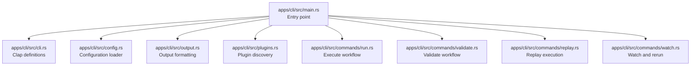
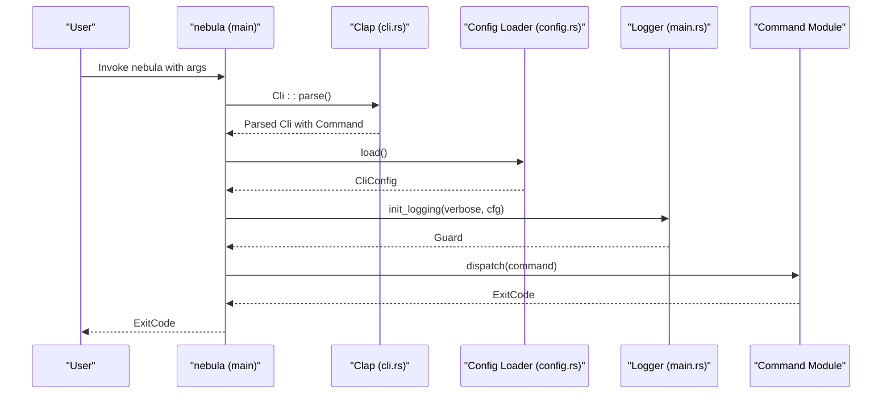
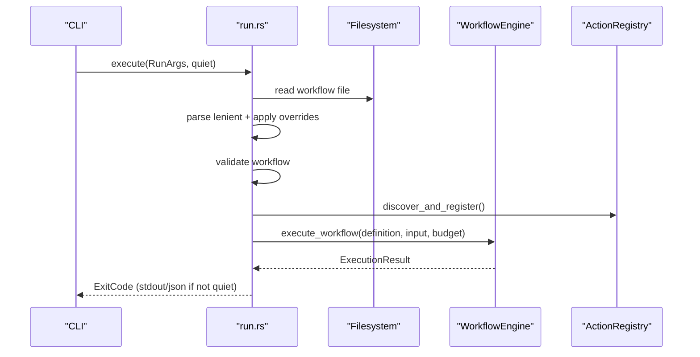
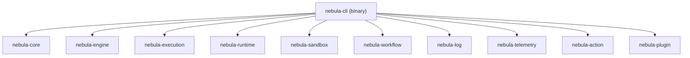

# CLI Application

<cite>
**Referenced Files in This Document**
- [main.rs](file://apps/cli/src/main.rs)
- [cli.rs](file://apps/cli/src/cli.rs)
- [Cargo.toml](file://apps/cli/Cargo.toml)
- [config.rs](file://apps/cli/src/config.rs)
- [output.rs](file://apps/cli/src/output.rs)
- [plugins.rs](file://apps/cli/src/plugins.rs)
- [run.rs](file://apps/cli/src/commands/run.rs)
- [validate.rs](file://apps/cli/src/commands/validate.rs)
- [replay.rs](file://apps/cli/src/commands/replay.rs)
- [watch.rs](file://apps/cli/src/commands/watch.rs)
</cite>

## Table of Contents
1. [Introduction](#introduction)
2. [Project Structure](#project-structure)
3. [Core Components](#core-components)
4. [Architecture Overview](#architecture-overview)
5. [Detailed Component Analysis](#detailed-component-analysis)
6. [Dependency Analysis](#dependency-analysis)
7. [Performance Considerations](#performance-considerations)
8. [Troubleshooting Guide](#troubleshooting-guide)
9. [Conclusion](#conclusion)
10. [Appendices](#appendices)

## Introduction
This document explains the CLI Application for the Nebula workflow engine. It covers the command-line interface implementation, including the main entry point, command parsing with Clap, and asynchronous runtime setup. It documents all CLI commands (run, validate, replay, watch, actions, plugin, dev, config, completion), command dispatching logic, configuration loading, logging initialization, and error handling patterns. It also provides practical examples for workflow development, validation, testing, and plugin management, along with command-line options, configuration parameters, environment variables, and output formatting guidance.

## Project Structure
The CLI is implemented as a Rust binary named nebula. The primary entry point initializes the Tokio runtime, parses arguments via Clap, loads configuration, initializes logging, and dispatches to the appropriate command module. Commands are organized under a dedicated commands directory, with shared utilities for output formatting and plugin discovery.

**Diagram sources**
- [main.rs:1-106](file://apps/cli/src/main.rs#L1-L106)
- [cli.rs:1-359](file://apps/cli/src/cli.rs#L1-L359)
- [config.rs:1-433](file://apps/cli/src/config.rs#L1-L433)
- [output.rs:1-31](file://apps/cli/src/output.rs#L1-L31)
- [plugins.rs:1-82](file://apps/cli/src/plugins.rs#L1-L82)
- [run.rs:1-506](file://apps/cli/src/commands/run.rs#L1-L506)
- [validate.rs:1-115](file://apps/cli/src/commands/validate.rs#L1-L115)
- [replay.rs:1-153](file://apps/cli/src/commands/replay.rs#L1-L153)
- [watch.rs:1-183](file://apps/cli/src/commands/watch.rs#L1-L183)

**Section sources**
- [main.rs:1-106](file://apps/cli/src/main.rs#L1-L106)
- [cli.rs:1-359](file://apps/cli/src/cli.rs#L1-L359)
- [Cargo.toml:1-78](file://apps/cli/Cargo.toml#L1-L78)

## Core Components
- Entry point and runtime: The program builds a multi-threaded Tokio runtime and blocks on an async run function. Errors are printed to stderr and mapped to a failure exit code.
- Command parsing: Clap derives argument parsers for each command and subcommand, including global flags for verbosity and quiet output.
- Configuration loading: Layered configuration resolution from defaults, global and local TOML files, environment variables, and CLI flags.
- Logging initialization: Conditional initialization based on environment variables or CLI verbosity, with a default configuration otherwise.
- Command dispatch: A match over the parsed command enum invokes the corresponding command module.

**Section sources**
- [main.rs:18-106](file://apps/cli/src/main.rs#L18-L106)
- [cli.rs:21-76](file://apps/cli/src/cli.rs#L21-L76)
- [config.rs:163-190](file://apps/cli/src/config.rs#L163-L190)

## Architecture Overview
The CLI follows a layered architecture:
- Parsing: Clap defines top-level and nested subcommands with typed arguments.
- Dispatch: The dispatcher selects the command and passes parsed arguments to the implementation.
- Execution: Commands load workflows, optionally apply overrides, validate, and execute via the engine.
- Output: Results are formatted according to the requested output format or auto-detected behavior.

**Diagram sources**
- [main.rs:18-106](file://apps/cli/src/main.rs#L18-L106)
- [cli.rs:21-76](file://apps/cli/src/cli.rs#L21-L76)
- [config.rs:163-190](file://apps/cli/src/config.rs#L163-L190)

## Detailed Component Analysis

### Entry Point and Runtime Setup
- Builds a multi-threaded Tokio runtime and executes the async run function.
- Loads CLI configuration and initializes logging.
- Dispatches to the selected command and maps results to an ExitCode.

**Section sources**
- [main.rs:18-106](file://apps/cli/src/main.rs#L18-L106)

### Command Dispatching Logic
- Top-level commands: run, validate, replay, watch, actions, plugin, dev, config, completion.
- Subcommands are dispatched via nested matches for actions, plugin, dev, and config.
- Quiet mode suppresses stdout output for machine-readable consumption.

**Section sources**
- [main.rs:61-105](file://apps/cli/src/main.rs#L61-L105)

### CLI Argument Definitions and Options
- Global flags: verbose (-v) and quiet (-q).
- OutputFormat enum supports json and text; auto-detection prefers text for terminals and json for pipes.
- Duration parsing supports s, m, h suffixes.

Examples of argument definitions:
- RunArgs: workflow path, input JSON or file, parameter overrides, timeout, concurrency, dry-run, streaming, optional TUI, output format.
- ValidateArgs: workflow path, output format.
- ReplayArgs: workflow path, replay-from node, pinned outputs file, input override, output format.
- WatchArgs: workflow path, input JSON, overrides, concurrency.
- Actions: list, info, test with optional output format.
- Plugin: list, new with name, actions count, target path.
- Dev: init with name/path, action new with name/path.
- Config: show, init with global flag.
- Completion: shell selection.

**Section sources**
- [cli.rs:36-359](file://apps/cli/src/cli.rs#L36-L359)

### Configuration Loading and Environment Variables
- Resolution order: defaults → global TOML (~/.config/nebula/config.toml) → local nebula.toml → environment variables → CLI flags.
- Environment variable convention: NEBULA_SECTION__FIELD; double underscore separates nested keys.
- Examples of supported variables:
  - NEBULA_RUN__CONCURRENCY → run.concurrency
  - NEBULA_RUN__TIMEOUT_SECS → run.timeout_secs
  - NEBULA_RUN__FORMAT → run.format
  - NEBULA_LOG__LEVEL → log.level
  - NEBULA_REMOTE__URL → remote.url
  - NEBULA_REMOTE__API_KEY → remote.api_key
- Size limits prevent OOM from maliciously large config files.

**Section sources**
- [config.rs:1-433](file://apps/cli/src/config.rs#L1-L433)

### Logging Initialization
- If RUST_LOG or NEBULA_LOG environment variables are set, automatic initialization is used.
- Otherwise, a default Config is constructed with level derived from verbose or config, and stderr writer.

**Section sources**
- [main.rs:42-59](file://apps/cli/src/main.rs#L42-L59)

### Output Formatting Utilities
- JSON pretty-printing for structured output.
- Validation summary formatting supports both JSON and text modes.

**Section sources**
- [output.rs:1-31](file://apps/cli/src/output.rs#L1-L31)

### Plugin Discovery
- Scans local plugins/ and platform data directory for community plugin binaries.
- Registers discovered actions into the ActionRegistry, with warnings on collisions.

**Section sources**
- [plugins.rs:1-82](file://apps/cli/src/plugins.rs#L1-L82)

### Command: run
- Reads and parses workflow (YAML/JSON), applies parameter overrides, validates, and optionally prints a dry-run plan.
- Builds ActionRegistry, registers community plugins, constructs ActionRuntime and WorkflowEngine, and executes with an ExecutionBudget.
- Supports streaming node events to stderr and an optional TUI (feature-gated).
- Outputs results in JSON or text based on format or auto-detection.
- Exit codes reflect completion, timeout, or workflow failure.

**Diagram sources**
- [run.rs:14-147](file://apps/cli/src/commands/run.rs#L14-L147)

**Section sources**
- [run.rs:14-147](file://apps/cli/src/commands/run.rs#L14-L147)

### Command: validate
- Parses workflow (strict or lenient) and runs validation.
- Prints validation result summary in JSON or text depending on format or auto-detection.
- Returns success if no errors, otherwise a validation failure exit code.

**Section sources**
- [validate.rs:10-30](file://apps/cli/src/commands/validate.rs#L10-L30)

### Command: replay
- Parses workflow and locates the replay-from node by name.
- Loads pinned outputs from a JSON file and applies input overrides if provided.
- Builds a ReplayPlan and executes via WorkflowEngine.
- Outputs results in JSON or text and maps status to exit code.

**Section sources**
- [replay.rs:14-153](file://apps/cli/src/commands/replay.rs#L14-L153)

### Command: watch
- Watches the workflow file for modifications and re-runs execution after a debounce window.
- Applies overrides, validates, parses input, and executes with a fresh engine each run.
- Reports status, node counts, durations, and error messages.

**Section sources**
- [watch.rs:21-183](file://apps/cli/src/commands/watch.rs#L21-L183)

### Command: actions (list, info, test)
- list: Lists registered actions with optional output format.
- info: Shows detailed info about a specific action key with optional output format.
- test: Executes a single action with provided JSON input and optional output format.

Note: The test command is defined in the CLI argument structure and dispatch logic, but the implementation file path was not found in the provided context. The dispatch logic indicates it is reachable.

**Section sources**
- [cli.rs:97-136](file://apps/cli/src/cli.rs#L97-L136)
- [main.rs:69-75](file://apps/cli/src/main.rs#L69-L75)

### Command: plugin (list, new)
- list: Lists loaded plugins (built-in and external).
- new: Scaffolds a new plugin project with a given name, number of actions, and target path.

**Section sources**
- [cli.rs:140-161](file://apps/cli/src/cli.rs#L140-L161)
- [main.rs:77-82](file://apps/cli/src/main.rs#L77-L82)

### Command: dev (init, action)
- init: Initializes a new Nebula project in the current directory with optional name and path.
- action new: Scaffolds a new action crate with a given name and optional path.

**Section sources**
- [cli.rs:165-203](file://apps/cli/src/cli.rs#L165-L203)
- [main.rs:84-92](file://apps/cli/src/main.rs#L84-L92)

### Command: config (show, init)
- show: Prints the resolved configuration.
- init: Generates a default config file (global or local) based on the global flag.

**Section sources**
- [cli.rs:80-93](file://apps/cli/src/cli.rs#L80-L93)
- [main.rs:93-99](file://apps/cli/src/main.rs#L93-L99)

### Command: completion
- Generates shell completions for a specified shell.

**Section sources**
- [cli.rs:207-211](file://apps/cli/src/cli.rs#L207-L211)
- [main.rs:100-103](file://apps/cli/src/main.rs#L100-L103)

## Dependency Analysis
The CLI depends on several Nebula crates for execution, runtime, sandboxing, telemetry, and logging. These dependencies enable workflow execution, action registration, and observability.

**Diagram sources**
- [Cargo.toml:57-66](file://apps/cli/Cargo.toml#L57-L66)

**Section sources**
- [Cargo.toml:1-78](file://apps/cli/Cargo.toml#L1-L78)

## Performance Considerations
- Concurrency: The run and watch commands accept a concurrency parameter. The CLI enforces a minimum of 1 to avoid deadlocks.
- Timeout: The run command accepts a maximum execution duration; use human-friendly durations (e.g., 30s, 5m).
- Streaming and TUI: Enabling streaming or TUI adds overhead; use streaming for debugging and TUI for interactive monitoring.
- Plugin discovery: Community plugin discovery scans local and global directories; keep plugins organized to minimize startup overhead.

**Section sources**
- [cli.rs:7-16](file://apps/cli/src/cli.rs#L7-L16)
- [cli.rs:235-239](file://apps/cli/src/cli.rs#L235-L239)
- [run.rs:80-86](file://apps/cli/src/commands/run.rs#L80-L86)
- [watch.rs:145-148](file://apps/cli/src/commands/watch.rs#L145-L148)

## Troubleshooting Guide
Common issues and resolutions:
- Invalid TOML configuration: The loader returns an error if a config file is syntactically invalid. Fix the TOML or remove the offending file.
- Oversized configuration: Files exceeding the configured size limit are rejected to prevent OOM. Reduce file size or remove extraneous content.
- Missing or invalid input JSON: The run and replay commands require valid JSON for --input or --input-file. Validate JSON syntax and ensure stdin redirection is correct when using "-".
- Unknown node in --set overrides: The run command validates node names and suggests the closest match if misspelled.
- Plugin registration collisions: If a community action key collides with an existing action, registration is skipped with a warning.
- Logging configuration: If RUST_LOG or NEBULA_LOG is set, automatic initialization is used; otherwise, configure via CLI verbosity or config.

**Section sources**
- [config.rs:115-161](file://apps/cli/src/config.rs#L115-L161)
- [config.rs:163-190](file://apps/cli/src/config.rs#L163-L190)
- [run.rs:224-277](file://apps/cli/src/commands/run.rs#L224-L277)
- [plugins.rs:48-61](file://apps/cli/src/plugins.rs#L48-L61)
- [main.rs:42-59](file://apps/cli/src/main.rs#L42-L59)

## Conclusion
The CLI provides a robust, extensible interface for developing, validating, executing, and iterating on workflows. Its layered configuration, flexible output formatting, and strong integration with the Nebula runtime enable efficient local development and plugin authoring. By leveraging environment variables, configuration files, and command-line flags, teams can tailor the CLI to diverse environments and automation needs.

## Appendices

### Command Reference and Examples
- run
  - Purpose: Execute a workflow from a YAML or JSON file.
  - Key options: workflow path, input JSON or file, --set overrides, timeout, concurrency, dry-run, stream, optional TUI, format.
  - Example: nebula run ./examples/hello.yaml --input '{"name":"Alice"}' --concurrency 5 --format json
- validate
  - Purpose: Validate a workflow definition without executing it.
  - Example: nebula validate ./examples/hello.yaml --format text
- replay
  - Purpose: Replay a previous execution from a specific node.
  - Example: nebula replay ./examples/hello.yaml --from fetch --outputs-file ./outputs.json --input '{}'
- watch
  - Purpose: Watch a workflow file and re-run on changes.
  - Example: nebula watch ./examples/hello.yaml --input '{}' --concurrency 10
- actions
  - list: nebula actions list --format json
  - info: nebula actions info echo --format text
  - test: nebula actions test echo --input '{"value":"hello"}' --format json
- plugin
  - list: nebula plugin list
  - new: nebula plugin new my-plugin --actions 2 --path ./plugins/my-plugin
- dev
  - init: nebula dev init --name my-project --path .
  - action new: nebula dev action new my-action --path ./actions/my-action
- config
  - show: nebula config show
  - init: nebula config init --global
- completion
  - Example: nebula completion bash > /etc/bash_completion.d/nebula

### Configuration Parameters and Environment Variables
- Configuration precedence: defaults → global TOML → local TOML → environment → CLI flags.
- Environment variable convention: NEBULA_SECTION__FIELD.
- Common variables:
  - NEBULA_RUN__CONCURRENCY → run.concurrency
  - NEBULA_RUN__TIMEOUT_SECS → run.timeout_secs
  - NEBULA_RUN__FORMAT → run.format
  - NEBULA_LOG__LEVEL → log.level
  - NEBULA_REMOTE__URL → remote.url
  - NEBULA_REMOTE__API_KEY → remote.api_key

### Extending the CLI with New Commands
- Add a new subcommand enum variant and argument struct in cli.rs.
- Implement the command logic in a new module under commands/.
- Wire the dispatch in main.rs under the Command enum match.
- Consider adding environment variable support via the config loader and update help text for clarity.