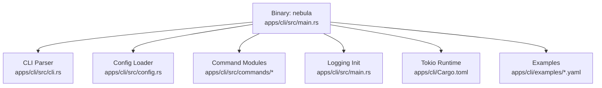
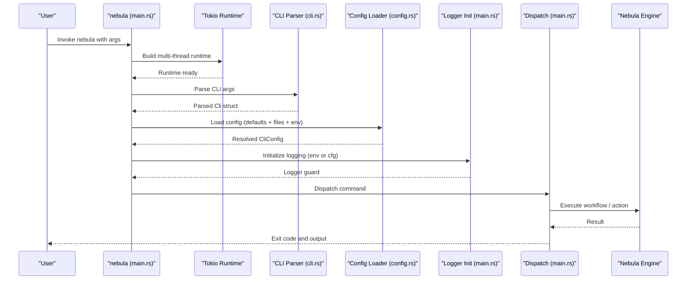
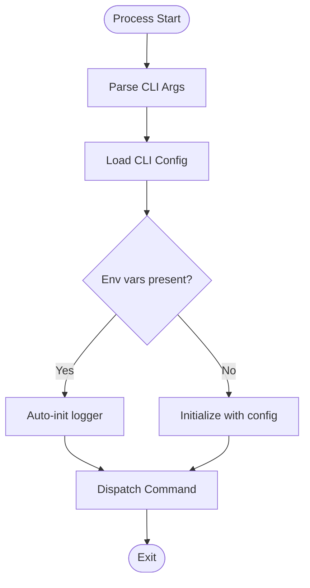
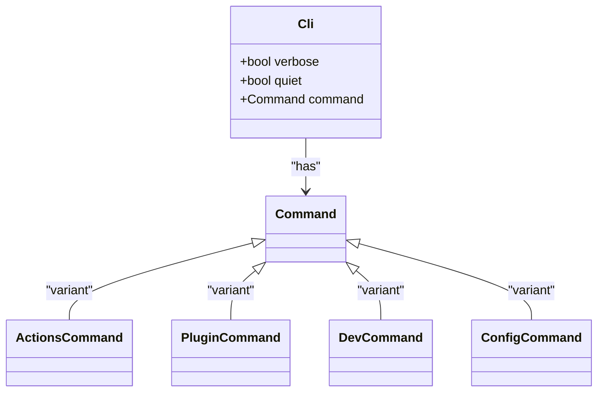
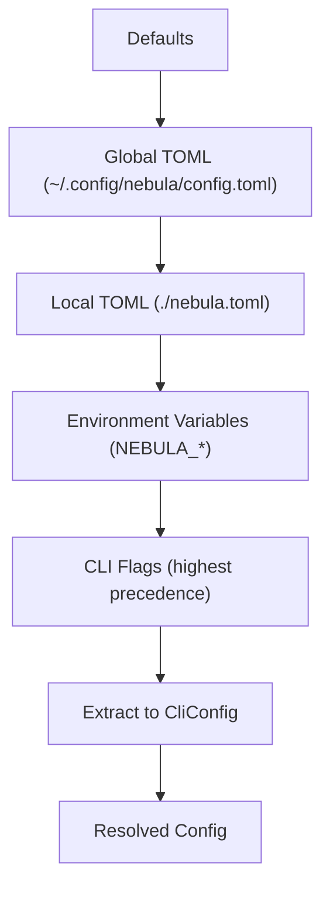
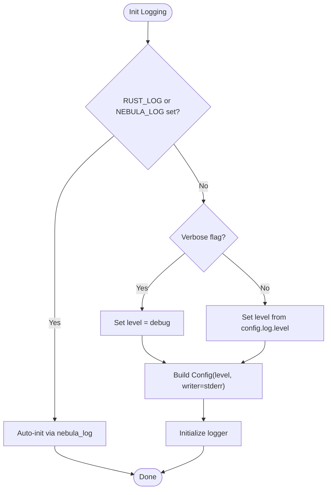
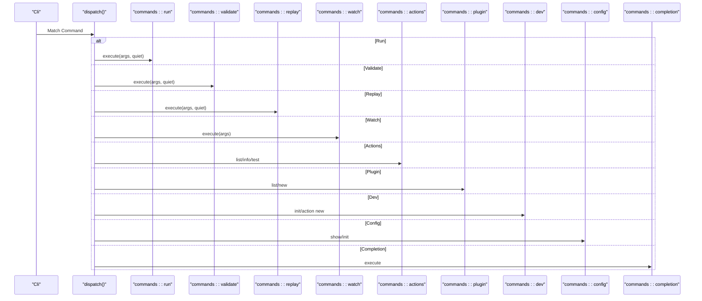
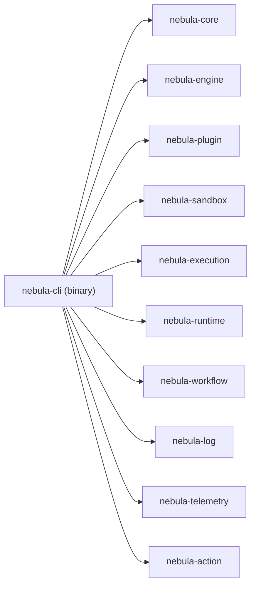

# CLI Overview

<cite>
**Referenced Files in This Document**
- [main.rs](file://apps/cli/src/main.rs)
- [cli.rs](file://apps/cli/src/cli.rs)
- [config.rs](file://apps/cli/src/config.rs)
- [Cargo.toml](file://apps/cli/Cargo.toml)
- [hello.yaml](file://apps/cli/examples/hello.yaml)
- [community-plugin-test.yaml](file://apps/cli/examples/community-plugin-test.yaml)
</cite>

## Table of Contents
1. [Introduction](#introduction)
2. [Project Structure](#project-structure)
3. [Core Components](#core-components)
4. [Architecture Overview](#architecture-overview)
5. [Detailed Component Analysis](#detailed-component-analysis)
6. [Dependency Analysis](#dependency-analysis)
7. [Performance Considerations](#performance-considerations)
8. [Troubleshooting Guide](#troubleshooting-guide)
9. [Conclusion](#conclusion)

## Introduction
This document provides a comprehensive overview of the Nebula CLI application. It explains the CLI architecture, main entry point, command structure, asynchronous runtime setup with Tokio, logging initialization patterns, configuration loading mechanisms, and how commands are dispatched to the underlying Nebula engine. It also covers CLI configuration options, environment variable handling, and logging verbosity levels, and demonstrates basic usage patterns with concrete examples from the repository.

## Project Structure
The CLI application resides under apps/cli and is organized around a central entry point, a command model, configuration loading, and a set of command modules. The binary target is named nebula and depends on several Nebula crates to integrate with the engine and related subsystems.

**Diagram sources**
- [main.rs:1-106](file://apps/cli/src/main.rs#L1-L106)
- [cli.rs:1-359](file://apps/cli/src/cli.rs#L1-L359)
- [config.rs:1-433](file://apps/cli/src/config.rs#L1-L433)
- [Cargo.toml:1-80](file://apps/cli/Cargo.toml#L1-L80)

**Section sources**
- [Cargo.toml:13-16](file://apps/cli/Cargo.toml#L13-L16)
- [main.rs:1-106](file://apps/cli/src/main.rs#L1-L106)
- [cli.rs:18-359](file://apps/cli/src/cli.rs#L18-L359)
- [config.rs:1-433](file://apps/cli/src/config.rs#L1-L433)

## Core Components
- Entry point and runtime: The CLI initializes a multi-threaded Tokio runtime and runs the async dispatcher loop. See [main.rs:18-40](file://apps/cli/src/main.rs#L18-L40).
- CLI model: The CLI structure defines top-level flags and subcommands, including run, validate, replay, watch, actions, plugin, dev, config, and completion. See [cli.rs:21-76](file://apps/cli/src/cli.rs#L21-L76).
- Configuration: The CLI loads defaults, merges global and local TOML files, applies environment variables, and exposes structured settings for run concurrency, timeouts, output format, and logging level. See [config.rs:49-85](file://apps/cli/src/config.rs#L49-L85) and [config.rs:163-190](file://apps/cli/src/config.rs#L163-L190).
- Logging: The CLI initializes logging either from environment variables or from resolved configuration, with verbosity controlled by a global flag and configuration. See [main.rs:42-59](file://apps/cli/src/main.rs#L42-L59) and [config.rs:80-85](file://apps/cli/src/config.rs#L80-L85).
- Command dispatch: The CLI parses arguments and dispatches to command-specific modules. See [main.rs:61-105](file://apps/cli/src/main.rs#L61-L105).

**Section sources**
- [main.rs:18-105](file://apps/cli/src/main.rs#L18-L105)
- [cli.rs:21-76](file://apps/cli/src/cli.rs#L21-L76)
- [config.rs:49-85](file://apps/cli/src/config.rs#L49-L85)
- [config.rs:163-190](file://apps/cli/src/config.rs#L163-L190)

## Architecture Overview
The CLI follows a layered architecture:
- Binary entry point sets up the async runtime and logging.
- Configuration is loaded and merged from multiple sources.
- Commands are parsed and dispatched to specialized modules.
- Underlying engine and related crates are invoked to execute workflows and actions.

**Diagram sources**
- [main.rs:18-105](file://apps/cli/src/main.rs#L18-L105)
- [cli.rs:21-76](file://apps/cli/src/cli.rs#L21-L76)
- [config.rs:163-190](file://apps/cli/src/config.rs#L163-L190)

## Detailed Component Analysis

### Entry Point and Asynchronous Runtime Setup
- The binary builds a multi-threaded Tokio runtime and blocks on an async run function.
- The run function loads configuration, initializes logging, and dispatches the command.
- Logging initialization respects environment variables and falls back to configuration-derived verbosity.

**Diagram sources**
- [main.rs:18-59](file://apps/cli/src/main.rs#L18-L59)

**Section sources**
- [main.rs:18-59](file://apps/cli/src/main.rs#L18-L59)

### CLI Command Model and Subcommands
- Top-level flags include global verbosity and quiet modes.
- Subcommands include run, validate, replay, watch, actions, plugin, dev, config, and completion.
- Many subcommands have nested subcommands (e.g., actions list/info/test, plugin list/new, dev init/action new, config show/init).

**Diagram sources**
- [cli.rs:21-76](file://apps/cli/src/cli.rs#L21-L76)
- [cli.rs:97-105](file://apps/cli/src/cli.rs#L97-L105)
- [cli.rs:140-146](file://apps/cli/src/cli.rs#L140-L146)
- [cli.rs:165-174](file://apps/cli/src/cli.rs#L165-L174)
- [cli.rs:80-86](file://apps/cli/src/cli.rs#L80-L86)

**Section sources**
- [cli.rs:21-76](file://apps/cli/src/cli.rs#L21-L76)

### Configuration Loading Mechanism
- Resolution order: built-in defaults, user-global TOML, project-local TOML, environment variables, and finally CLI flags override.
- Environment variables use a double-underscore convention to represent nested configuration paths.
- The loader enforces a strict size cap on configuration files to prevent OOM conditions before logging is initialized.

**Diagram sources**
- [config.rs:3-27](file://apps/cli/src/config.rs#L3-L27)
- [config.rs:163-190](file://apps/cli/src/config.rs#L163-L190)

**Section sources**
- [config.rs:3-27](file://apps/cli/src/config.rs#L3-L27)
- [config.rs:163-190](file://apps/cli/src/config.rs#L163-L190)

### Logging Initialization Patterns
- If RUST_LOG or NEBULA_LOG environment variables are set, the logger auto-initializes.
- Otherwise, the CLI constructs a logger configuration from verbosity and resolved configuration, writing to stderr by default.
- The logger guard is stored to keep the logger alive for the process lifetime.

**Diagram sources**
- [main.rs:42-59](file://apps/cli/src/main.rs#L42-L59)
- [config.rs:80-85](file://apps/cli/src/config.rs#L80-L85)

**Section sources**
- [main.rs:42-59](file://apps/cli/src/main.rs#L42-L59)
- [config.rs:80-85](file://apps/cli/src/config.rs#L80-L85)

### Command Dispatching System
- The dispatcher matches the parsed command and invokes the appropriate module.
- Some commands are async (e.g., run, replay, watch), while others are synchronous.
- Quiet mode suppresses normal output except for errors.

**Diagram sources**
- [main.rs:61-105](file://apps/cli/src/main.rs#L61-L105)

**Section sources**
- [main.rs:61-105](file://apps/cli/src/main.rs#L61-L105)

### Relationship Between CLI Commands and the Nebula Engine
- The CLI orchestrates execution of workflows and actions by invoking engine APIs exposed through Nebula crates.
- The CLI’s run, validate, replay, and watch commands interact with the engine to schedule, execute, and observe workflow runs.
- The actions subcommands introspect and test actions, which internally rely on the engine’s action resolution and execution facilities.
- The dev and plugin subcommands scaffold projects and plugins, preparing artifacts that the engine consumes.

[No sources needed since this section explains conceptual relationships without analyzing specific files]

### CLI Configuration Options and Environment Variables
- Configuration sections include run, remote, and log.
- Environment variables follow the NEBULA_ prefix with double underscores separating nested paths.
- Examples of recognized variables include NEBULA_RUN__CONCURRENCY, NEBULA_RUN__TIMEOUT_SECS, NEBULA_RUN__FORMAT, NEBULA_LOG__LEVEL, NEBULA_REMOTE__URL, NEBULA_REMOTE__API_KEY.

**Section sources**
- [config.rs:10-27](file://apps/cli/src/config.rs#L10-L27)
- [config.rs:49-85](file://apps/cli/src/config.rs#L49-L85)

### Basic CLI Usage Patterns
- Run a workflow from a YAML or JSON file with optional input, overrides, concurrency, and timeout.
- Validate a workflow definition without executing it.
- Replay a previous execution from a specific node.
- Watch a workflow file and re-run on changes.
- Explore and test actions.
- Manage plugins and developer scaffolding.
- Inspect and initialize CLI configuration.

Concrete examples are provided in the repository’s examples directory:
- Minimal workflow example: [hello.yaml:1-20](file://apps/cli/examples/hello.yaml#L1-L20)
- Community plugin test workflow: [community-plugin-test.yaml:1-33](file://apps/cli/examples/community-plugin-test.yaml#L1-L33)

**Section sources**
- [cli.rs:215-258](file://apps/cli/src/cli.rs#L215-L258)
- [cli.rs:302-311](file://apps/cli/src/cli.rs#L302-L311)
- [cli.rs:279-300](file://apps/cli/src/cli.rs#L279-L300)
- [cli.rs:260-277](file://apps/cli/src/cli.rs#L260-L277)
- [hello.yaml:1-20](file://apps/cli/examples/hello.yaml#L1-L20)
- [community-plugin-test.yaml:1-33](file://apps/cli/examples/community-plugin-test.yaml#L1-L33)

## Dependency Analysis
The CLI binary depends on Nebula crates to integrate with the engine and related systems. These dependencies enable the CLI to execute workflows, manage plugins, and leverage logging and telemetry.

**Diagram sources**
- [Cargo.toml:56-66](file://apps/cli/Cargo.toml#L56-L66)

**Section sources**
- [Cargo.toml:56-66](file://apps/cli/Cargo.toml#L56-L66)

## Performance Considerations
- Concurrency: The CLI validates that concurrency is at least one to avoid deadlocks in the engine’s semaphore-based scheduler.
- Timeout parsing: Human-friendly durations are supported and parsed into precise time spans.
- Logging overhead: The logger is initialized early to capture startup diagnostics; avoid excessive logging in hot paths.
- File size limits: Configuration files are bounded to prevent memory exhaustion before logging is available.

**Section sources**
- [cli.rs:7-16](file://apps/cli/src/cli.rs#L7-L16)
- [cli.rs:334-358](file://apps/cli/src/cli.rs#L334-L358)
- [config.rs:41-47](file://apps/cli/src/config.rs#L41-L47)

## Troubleshooting Guide
- Invalid TOML in configuration: The loader returns a descriptive error when TOML is malformed.
- Oversized configuration: The loader rejects files exceeding the configured size limit, protecting against OOM scenarios.
- Environment variable precedence: Ensure NEBULA_* variables use double underscores for nested paths.
- Logging not appearing: If RUST_LOG or NEBULA_LOG is set, the logger auto-initializes; otherwise, adjust verbosity or configuration.

**Section sources**
- [config.rs:109-161](file://apps/cli/src/config.rs#L109-L161)
- [config.rs:163-190](file://apps/cli/src/config.rs#L163-L190)
- [config.rs:311-324](file://apps/cli/src/config.rs#L311-L324)

## Conclusion
The Nebula CLI provides a robust, configurable, and extensible command-line interface for interacting with the Nebula workflow engine. Its architecture centers on a clear separation of concerns: a concise entry point, a rich CLI model, layered configuration, and a flexible dispatch mechanism. By leveraging Tokio for async operations, a strict configuration resolution order, and environment-aware logging, the CLI integrates seamlessly with the broader Nebula ecosystem while remaining beginner-friendly and powerful for advanced users.