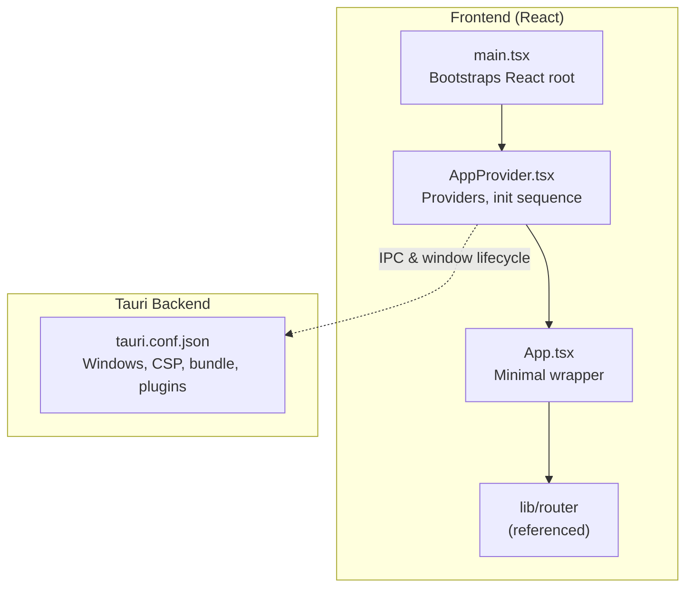
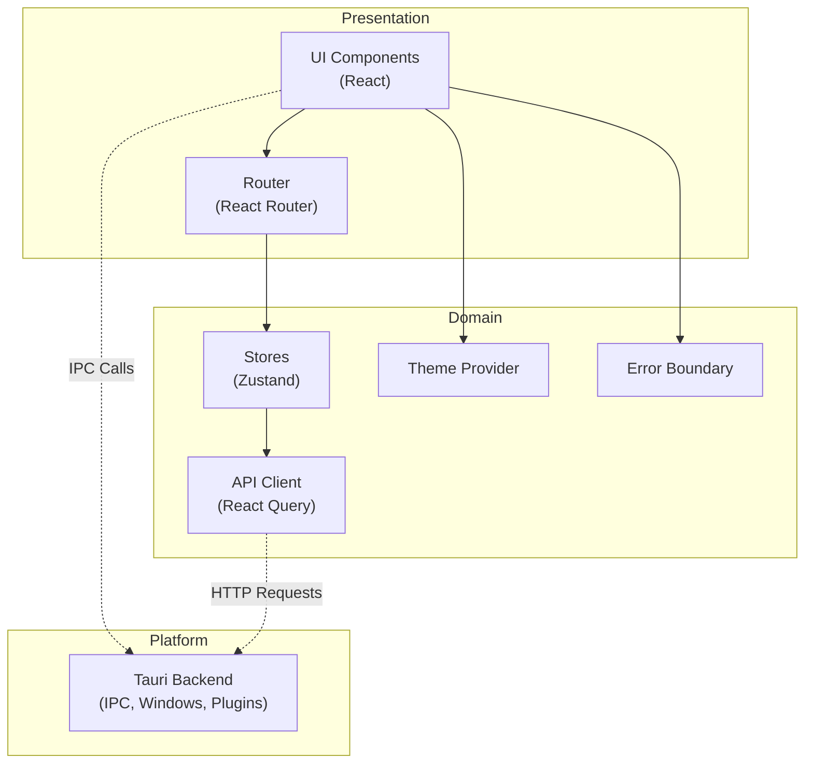
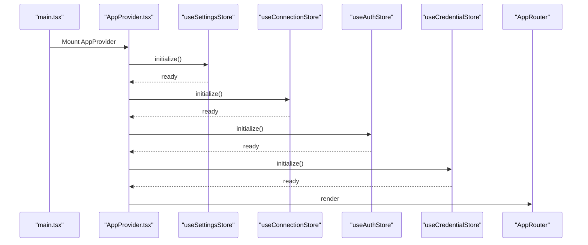
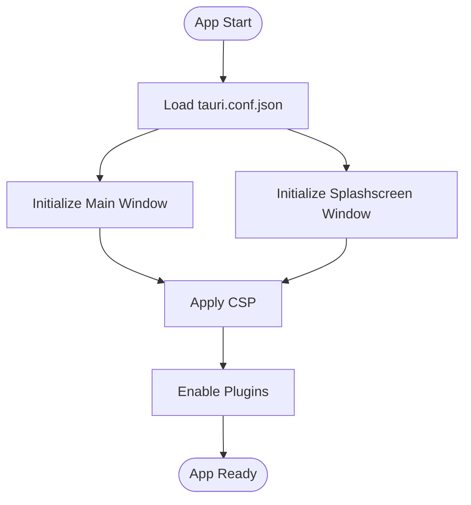
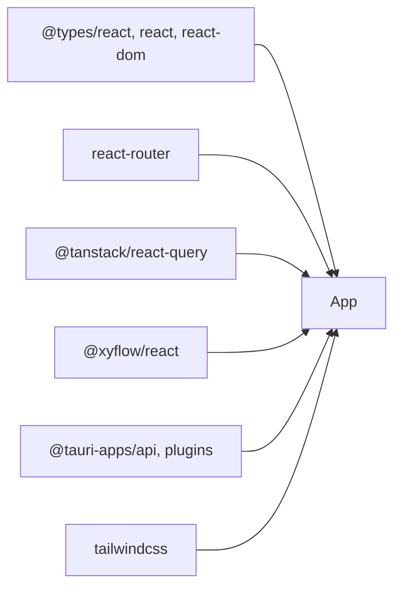

# Desktop Application

<cite>
**Referenced Files in This Document**
- [main.tsx](file://apps/desktop/src/main.tsx)
- [AppProvider.tsx](file://apps/desktop/src/providers/AppProvider.tsx)
- [App.tsx](file://apps/desktop/src/ui/App.tsx)
- [tauri.conf.json](file://apps/desktop/src-tauri/tauri.conf.json)
- [package.json](file://apps/desktop/package.json)
- [vite.config.ts](file://apps/desktop/vite.config.ts)
</cite>

## Table of Contents
1. [Introduction](#introduction)
2. [Project Structure](#project-structure)
3. [Core Components](#core-components)
4. [Architecture Overview](#architecture-overview)
5. [Detailed Component Analysis](#detailed-component-analysis)
6. [Dependency Analysis](#dependency-analysis)
7. [Performance Considerations](#performance-considerations)
8. [Troubleshooting Guide](#troubleshooting-guide)
9. [Conclusion](#conclusion)

## Introduction
This document explains the desktop application architecture for Nebula, a Tauri-based desktop app with a React frontend (TypeScript) and integrated IPC communication with the Tauri backend. It covers the application shell layout, provider setup, router-driven navigation, and how the frontend integrates with the Nebula engine via API clients and stores. It also documents the workflow editor concept (drag-and-drop canvas, node palette, toolbar, and execution visualization) and outlines state management, theming, and IPC patterns. Guidance is included for building, running, and troubleshooting the desktop app, with practical examples for developing, editing, and monitoring workflows.

## Project Structure
The desktop application is organized into two primary parts:
- Frontend (React + TypeScript): Located under apps/desktop/src, with providers, stores, UI components, and routing.
- Backend (Tauri): Located under apps/desktop/src-tauri, with configuration, capabilities, and Rust-side logic.

Key entry points:
- Frontend bootstrapping: apps/desktop/src/main.tsx initializes the React root and mounts the AppProvider.
- Provider orchestration: apps/desktop/src/providers/AppProvider.tsx sets up theme, error boundary, React Query, and app initialization sequence.
- Routing: apps/desktop/src/lib/router (referenced by providers and UI) orchestrates navigation.
- Tauri configuration: apps/desktop/src-tauri/tauri.conf.json defines windows, CSP, bundling, and plugins.
- Build tooling: apps/desktop/package.json and apps/desktop/vite.config.ts configure Vite, React, Tailwind, and Tauri CLI.

**Diagram sources**
- [main.tsx:1-14](file://apps/desktop/src/main.tsx#L1-L14)
- [AppProvider.tsx:1-76](file://apps/desktop/src/providers/AppProvider.tsx#L1-L76)
- [App.tsx:1-10](file://apps/desktop/src/ui/App.tsx#L1-L10)
- [tauri.conf.json:1-62](file://apps/desktop/src-tauri/tauri.conf.json#L1-L62)

**Section sources**
- [main.tsx:1-14](file://apps/desktop/src/main.tsx#L1-L14)
- [AppProvider.tsx:1-76](file://apps/desktop/src/providers/AppProvider.tsx#L1-L76)
- [App.tsx:1-10](file://apps/desktop/src/ui/App.tsx#L1-L10)
- [tauri.conf.json:1-62](file://apps/desktop/src-tauri/tauri.conf.json#L1-L62)
- [package.json:1-48](file://apps/desktop/package.json#L1-L48)
- [vite.config.ts:1-34](file://apps/desktop/vite.config.ts#L1-L34)

## Core Components
- React root and provider chain:
  - The React root mounts AppProvider, which wraps the app with ThemeProvider, React Query, and an ErrorBoundary. It runs an initialization sequence to set up settings, connection, authentication, and credentials stores before rendering the router.
- Router-driven layout:
  - Navigation is handled by AppRouter (referenced in providers and UI), enabling route-based layouts and views.
- Tauri integration:
  - Tauri configuration defines windows (main and splashscreen), CSP policies, bundling, and plugins such as deep-link and updater.
- Build and dev tooling:
  - Vite is configured with React and Tailwind plugins, TypeScript, and HMR support. Scripts in package.json enable development modes and Tauri builds.

Practical implications:
- Providers encapsulate cross-cutting concerns (theming, error handling, caching).
- Initialization order ensures dependent stores initialize in the correct sequence.
- Tauri configuration governs security boundaries and window behavior.

**Section sources**
- [AppProvider.tsx:1-76](file://apps/desktop/src/providers/AppProvider.tsx#L1-L76)
- [tauri.conf.json:1-62](file://apps/desktop/src-tauri/tauri.conf.json#L1-L62)
- [package.json:1-48](file://apps/desktop/package.json#L1-L48)
- [vite.config.ts:1-34](file://apps/desktop/vite.config.ts#L1-L34)

## Architecture Overview
The desktop app follows a layered architecture:
- Presentation Layer: React components and UI primitives.
- Domain Layer: Stores (Zustand), API client (TanStack Query), and router.
- Platform Layer: Tauri backend with IPC, window management, and plugins.

**Diagram sources**
- [AppProvider.tsx:1-76](file://apps/desktop/src/providers/AppProvider.tsx#L1-L76)
- [tauri.conf.json:1-62](file://apps/desktop/src-tauri/tauri.conf.json#L1-L62)

## Detailed Component Analysis

### Application Shell and Initialization
The AppProvider coordinates initialization and global providers:
- Initializes settings, connection, auth, and credentials stores in a specific order.
- Controls splashscreen visibility and readiness.
- Wraps the app with ThemeProvider, ErrorBoundary, and React Query provider.

**Diagram sources**
- [main.tsx:1-14](file://apps/desktop/src/main.tsx#L1-L14)
- [AppProvider.tsx:22-61](file://apps/desktop/src/providers/AppProvider.tsx#L22-L61)

**Section sources**
- [main.tsx:1-14](file://apps/desktop/src/main.tsx#L1-L14)
- [AppProvider.tsx:1-76](file://apps/desktop/src/providers/AppProvider.tsx#L1-L76)

### Routing and Layout
- The UI relies on AppRouter for navigation. The minimal App component delegates routing to the router, keeping the entry point thin and centralized.
- Layouts and views are managed by the router; the provider chain ensures global state and theme are available across routes.

**Section sources**
- [App.tsx:1-10](file://apps/desktop/src/ui/App.tsx#L1-L10)
- [AppProvider.tsx:8](file://apps/desktop/src/providers/AppProvider.tsx#L8)

### Tauri Backend Integration
- Windows:
  - Main window: resizable, decorations disabled, initially hidden until ready.
  - Splashscreen window: centered, top-most, non-resizable.
- Security:
  - Content Security Policy restricts sources and enables IPC and custom protocols.
- Plugins:
  - Deep-link plugin registers a custom URI scheme for desktop deep linking.
  - Updater plugin is configured for application updates.
- Bundling:
  - Icons and target platforms are configured for distribution.

**Diagram sources**
- [tauri.conf.json:13-38](file://apps/desktop/src-tauri/tauri.conf.json#L13-L38)

**Section sources**
- [tauri.conf.json:1-62](file://apps/desktop/src-tauri/tauri.conf.json#L1-L62)

### Workflow Editor Concept (Drag-and-Drop Canvas, Palette, Toolbar, Visualization)
Note: The repository snapshot does not include the specific workflow editor implementation. The following describes a recommended architecture aligned with the existing frontend stack and Tauri backend:

- Canvas:
  - Built with a React-based flow library (XYFlow) for drag-and-drop nodes and edges.
  - Nodes represent actions/workflow steps; edges represent data/control flow.
- Node Palette:
  - Collapsible panel listing available action types; dragging adds nodes to the canvas.
- Toolbar:
  - Controls for save, run, pause, reset, and zoom; integrates with the engine via IPC.
- Real-time Execution Visualization:
  - Live execution status, logs, and node outputs rendered alongside the canvas.
- State Management:
  - Zustand stores manage canvas state, selected node, and execution progress.
  - TanStack Query fetches and caches workflow metadata and execution history.
- IPC Communication:
  - Tauri commands trigger engine execution and receive progress updates.
- Theming and Accessibility:
  - ThemeProvider supports light/dark modes; focus management and keyboard shortcuts improve accessibility.

[No sources needed since this section describes a conceptual implementation not present in the current repository snapshot]

### State Management Approach
- Stores (Zustand):
  - Organized per feature (auth, connection, credentials, settings, app).
  - Initialize stores during the provider initialization sequence.
- API Client (TanStack Query):
  - Centralized caching and refetching with retry and stale-time policies.
- Theme Management:
  - ThemeProvider wraps the app to enable global theme switching and persistence.

**Section sources**
- [AppProvider.tsx:13-20](file://apps/desktop/src/providers/AppProvider.tsx#L13-L20)
- [AppProvider.tsx:25-49](file://apps/desktop/src/providers/AppProvider.tsx#L25-L49)

### IPC Communication Patterns
- Frontend:
  - Uses @tauri-apps/api to invoke commands and listen to events.
  - Integrates with Tauri commands for file operations, deep links, and engine control.
- Backend:
  - Commands and listeners are defined in Tauri’s Rust layer; configuration in tauri.conf.json exposes IPC and custom protocol domains.

[No sources needed since this section describes general IPC patterns; specific command definitions are not present in the current snapshot]

### Sidebar Navigation and Component Hierarchy
- The router manages navigation; the provider chain ensures stores and theme are available across views.
- Sidebar navigation can be implemented as a route-based layout with nested routes for workflows, executions, and settings.

[No sources needed since this section describes a conceptual layout pattern]

### Using the Desktop Interface for Workflow Development
- Development:
  - Open the workflow canvas; drag nodes from the palette to the canvas; connect nodes to define flow.
  - Use toolbar controls to save and run the workflow.
- Editing:
  - Select nodes to edit properties; adjust parameters and re-run to validate changes.
- Monitoring:
  - View execution logs and node outputs in real time; inspect failures and retry failed steps.

[No sources needed since this section provides usage guidance]

## Dependency Analysis
The desktop app’s frontend depends on:
- React and React Router for UI and routing.
- TanStack Query for caching and API integration.
- XYFlow for drag-and-drop canvas (conceptual).
- Tauri plugins for shell, opener, store, updater, and deep-link.
- TailwindCSS for styling.

**Diagram sources**
- [package.json:19-35](file://apps/desktop/package.json#L19-L35)

**Section sources**
- [package.json:1-48](file://apps/desktop/package.json#L1-L48)

## Performance Considerations
- Large workflows:
  - Virtualize canvas rendering and lazy-load node details.
  - Debounce property editors and avoid excessive re-renders.
  - Use TanStack Query’s background refetch and selective invalidation.
- IPC overhead:
  - Batch engine commands and coalesce frequent updates.
  - Use streaming progress events instead of polling.
- Rendering:
  - Prefer memoization and stable callbacks in node components.
  - Limit DOM depth in the canvas and use efficient SVG/HTML rendering.

[No sources needed since this section provides general guidance]

## Troubleshooting Guide
- Dev server not starting:
  - Verify Vite server port matches tauri.conf.json devUrl.
  - Ensure HMR host and ports are correctly configured.
- Tauri window not appearing:
  - Confirm main window visibility and decorations settings.
  - Check CSP for IPC and asset sources.
- Initialization failures:
  - Review provider initialization order and error logs.
  - Validate store initialization methods and environment variables.
- Build issues:
  - Ensure TypeScript compilation precedes Vite build.
  - Confirm Tauri CLI is installed and configured.

**Section sources**
- [vite.config.ts:18-32](file://apps/desktop/vite.config.ts#L18-L32)
- [tauri.conf.json:6-11](file://apps/desktop/src-tauri/tauri.conf.json#L6-L11)
- [AppProvider.tsx:32-49](file://apps/desktop/src/providers/AppProvider.tsx#L32-L49)

## Conclusion
The desktop application leverages a clean provider chain, router-driven navigation, and robust Tauri integration to deliver a secure, extensible desktop experience. The React Query and Zustand combination provides scalable state and API management, while Tauri’s configuration and plugins enable deep OS integration. The workflow editor concept aligns with the existing frontend stack and can be extended with drag-and-drop, real-time execution, and IPC-driven engine control. Following the guidance here will help both beginners and advanced developers build, customize, and troubleshoot the desktop interface effectively.