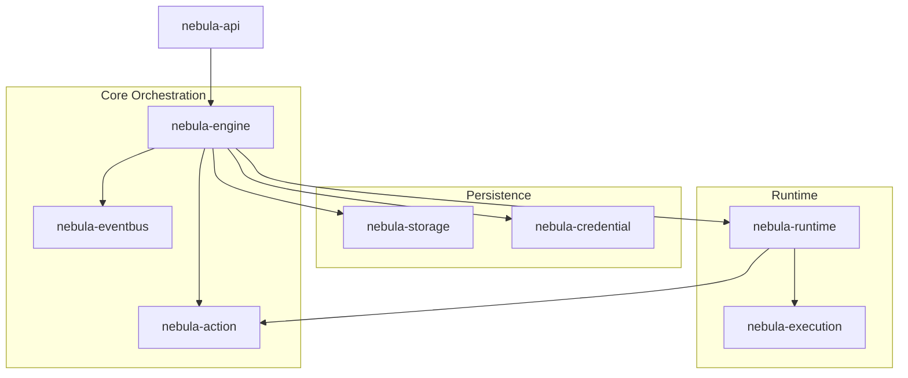
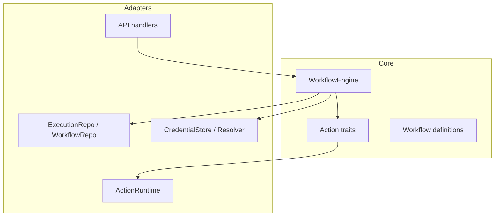
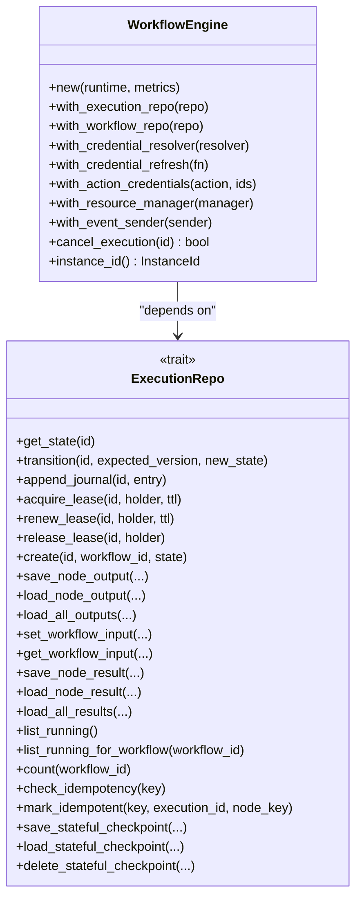
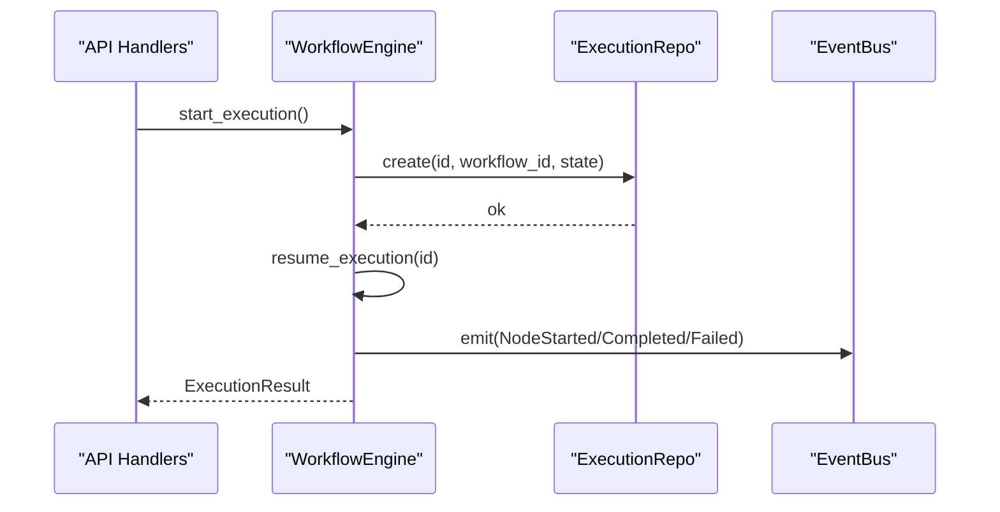
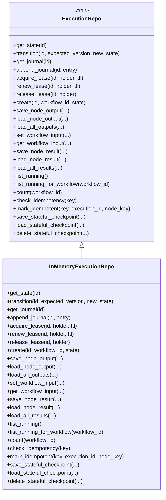
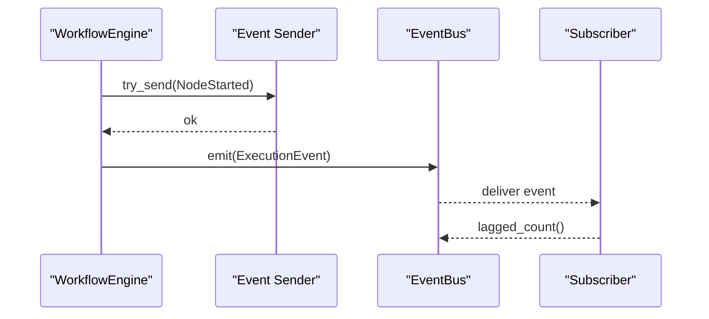
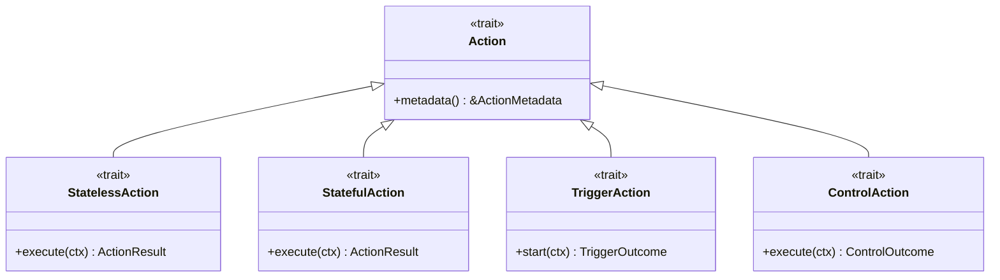
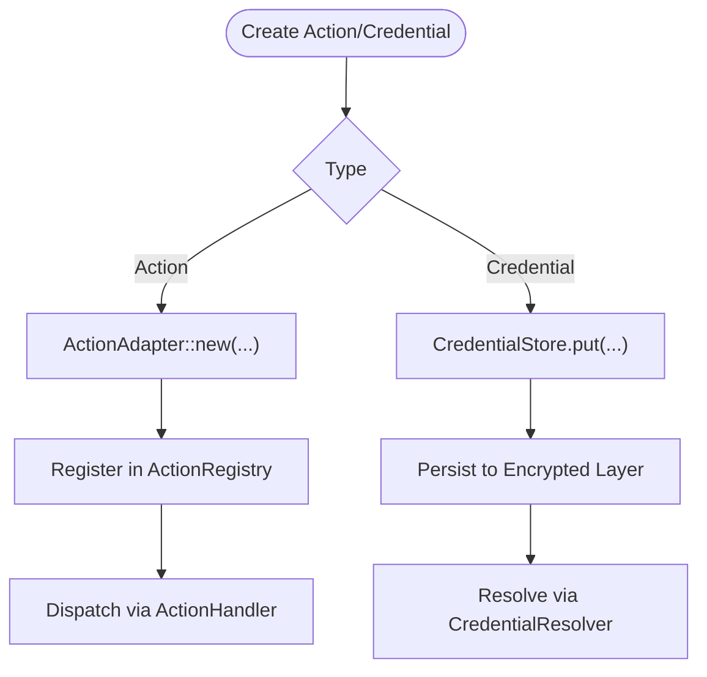
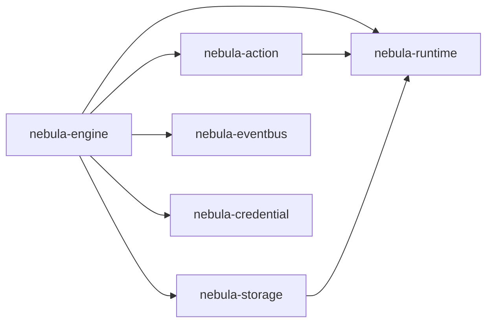

# Architectural Design Patterns and Principles

<cite>
**Referenced Files in This Document**
- [engine/lib.rs](file://crates/engine/src/lib.rs)
- [engine/engine.rs](file://crates/engine/src/engine.rs)
- [engine/control_consumer.rs](file://crates/engine/src/control_consumer.rs)
- [engine/control_dispatch.rs](file://crates/engine/src/control_dispatch.rs)
- [engine/event.rs](file://crates/engine/src/event.rs)
- [engine/result.rs](file://crates/engine/src/result.rs)
- [storage/lib.rs](file://crates/storage/src/lib.rs)
- [storage/execution_repo.rs](file://crates/storage/src/execution_repo.rs)
- [action/lib.rs](file://crates/action/src/lib.rs)
- [action/action.rs](file://crates/action/src/action.rs)
- [credential/store.rs](file://crates/credential/src/store.rs)
- [eventbus/lib.rs](file://crates/eventbus/src/lib.rs)
</cite>

## Table of Contents
1. [Introduction](#introduction)
2. [Project Structure](#project-structure)
3. [Core Components](#core-components)
4. [Architecture Overview](#architecture-overview)
5. [Detailed Component Analysis](#detailed-component-analysis)
6. [Dependency Analysis](#dependency-analysis)
7. [Performance Considerations](#performance-considerations)
8. [Troubleshooting Guide](#troubleshooting-guide)
9. [Conclusion](#conclusion)
10. [Appendices](#appendices)

## Introduction
This document analyzes the Nebula system’s architectural design patterns and principles, focusing on:
- Composition Root pattern for centralized engine initialization
- Ports & Adapters architecture separating core logic from external dependencies
- Repository pattern for abstraction over storage backends
- Observer pattern for event-driven architecture
- Strategy pattern usage for pluggable execution strategies
- Factory pattern application for action and credential creation

We explain how these patterns contribute to maintainability, testability, and extensibility, and we highlight potential violations and anti-patterns that could compromise architectural integrity. We also provide guidelines for applying these patterns consistently across the codebase.

## Project Structure
Nebula organizes functionality into focused crates:
- Engine orchestrates workflow execution and control-plane commands
- Storage defines persistence interfaces and repositories
- Action defines the action trait family and execution metadata
- Credential manages secure credential storage and resolution
- EventBus provides publish-subscribe channels for in-process observability
- Additional crates (execution, workflow, runtime, etc.) support the core runtime and orchestration

[No sources needed since this diagram shows conceptual workflow, not actual code structure]

## Core Components
This section outlines the primary architectural patterns and their concrete implementations across the Engine, Storage, and Action crates.

- Composition Root (Engine initialization)
  - Centralized construction of the WorkflowEngine with dependencies injected via builder-style methods
  - Clear separation of concerns: runtime, metrics, plugin registry, resolvers, repositories, and event channels
  - Example builder methods: with_execution_repo, with_workflow_repo, with_credential_resolver, with_event_sender

- Ports & Adapters (Core logic vs. external dependencies)
  - Engine depends on traits (ExecutionRepo, WorkflowRepo, CredentialResolver) rather than concrete implementations
  - Action defines a trait family (Action, StatelessAction, StatefulAction, TriggerAction, etc.) enabling pluggable execution strategies
  - Storage exposes ExecutionRepo and WorkflowRepo traits; concrete backends (SQLite, PostgreSQL) implement these traits

- Repository pattern (Storage abstraction)
  - ExecutionRepo trait encapsulates state transitions, journaling, leases, idempotency, and node result persistence
  - InMemoryExecutionRepo provides a test-friendly adapter; production backends implement the same interface

- Observer pattern (Event-driven architecture)
  - Engine emits ExecutionEvent values through a bounded channel
  - EventBus provides a publish-subscribe mechanism for in-process observability
  - Event types capture node lifecycle and execution completion

- Strategy pattern (Pluggable execution strategies)
  - Action trait family defines multiple execution strategies (StatelessAction, StatefulAction, TriggerAction, ControlAction)
  - Adapter pattern bridges domain-specific actions to a unified handler interface

- Factory pattern (Action and credential creation)
  - Action macro and adapters create action instances
  - CredentialStore defines CRUD operations enabling factory-like creation and updates

**Section sources**
- [engine/lib.rs:1-79](file://crates/engine/src/lib.rs#L1-L79)
- [engine/engine.rs:247-514](file://crates/engine/src/engine.rs#L247-L514)
- [storage/lib.rs:1-105](file://crates/storage/src/lib.rs#L1-L105)
- [storage/execution_repo.rs:119-410](file://crates/storage/src/execution_repo.rs#L119-L410)
- [action/lib.rs:1-152](file://crates/action/src/lib.rs#L1-L152)
- [action/action.rs:17-21](file://crates/action/src/action.rs#L17-L21)
- [credential/store.rs:108-161](file://crates/credential/src/store.rs#L108-L161)
- [eventbus/lib.rs:1-156](file://crates/eventbus/src/lib.rs#L1-L156)

## Architecture Overview
The system follows a layered Ports & Adapters architecture:
- Core logic (Engine, Action, Workflow) remains independent of external systems
- External systems (Storage, Credential, Runtime, API) are adapters behind well-defined interfaces
- Composition Root wires adapters into the core at startup

**Diagram sources**
- [engine/engine.rs:121-202](file://crates/engine/src/engine.rs#L121-L202)
- [storage/execution_repo.rs:119-410](file://crates/storage/src/execution_repo.rs#L119-L410)
- [action/lib.rs:37-152](file://crates/action/src/lib.rs#L37-L152)

## Detailed Component Analysis

### Composition Root Pattern (Engine Initialization)
The Engine crate centralizes initialization and dependency injection:
- WorkflowEngine::new constructs the core engine with runtime and metrics
- Builder methods attach repositories, resolvers, managers, and event channels
- Execution lease management and cancellation registry are encapsulated

**Diagram sources**
- [engine/engine.rs:121-202](file://crates/engine/src/engine.rs#L121-L202)
- [engine/engine.rs:478-498](file://crates/engine/src/engine.rs#L478-L498)
- [storage/execution_repo.rs:119-410](file://crates/storage/src/execution_repo.rs#L119-L410)

**Section sources**
- [engine/engine.rs:247-514](file://crates/engine/src/engine.rs#L247-L514)
- [engine/lib.rs:48-79](file://crates/engine/src/lib.rs#L48-L79)

### Ports & Adapters Architecture
The Ports & Adapters pattern separates core logic from external dependencies:
- Engine depends on traits (ExecutionRepo, WorkflowRepo, CredentialResolver) rather than concrete storage implementations
- Action defines a sealed trait family enabling pluggable execution strategies
- API and Runtime act as adapters consuming core interfaces

**Diagram sources**
- [engine/engine.rs:571-761](file://crates/engine/src/engine.rs#L571-L761)
- [engine/event.rs:15-79](file://crates/engine/src/event.rs#L15-L79)
- [storage/execution_repo.rs:183-189](file://crates/storage/src/execution_repo.rs#L183-L189)

**Section sources**
- [engine/engine.rs:121-202](file://crates/engine/src/engine.rs#L121-L202)
- [action/lib.rs:37-152](file://crates/action/src/lib.rs#L37-L152)

### Repository Pattern (Storage Abstraction)
The Repository pattern abstracts persistence:
- ExecutionRepo defines a comprehensive interface for state, journal, leases, idempotency, and node results
- InMemoryExecutionRepo provides a test-friendly implementation
- Production backends implement the same interface for interchangeable persistence

**Diagram sources**
- [storage/execution_repo.rs:119-410](file://crates/storage/src/execution_repo.rs#L119-L410)
- [storage/execution_repo.rs:518-530](file://crates/storage/src/execution_repo.rs#L518-L530)

**Section sources**
- [storage/execution_repo.rs:119-410](file://crates/storage/src/execution_repo.rs#L119-L410)
- [storage/lib.rs:1-105](file://crates/storage/src/lib.rs#L1-L105)

### Observer Pattern (Event-Driven Architecture)
The Observer pattern enables decoupled event emission and consumption:
- Engine emits ExecutionEvent values through a bounded channel
- EventBus provides a publish-subscribe mechanism with back-pressure and filtering
- Event types capture node lifecycle and execution completion

**Diagram sources**
- [engine/engine.rs:520-535](file://crates/engine/src/engine.rs#L520-L535)
- [engine/event.rs:15-79](file://crates/engine/src/event.rs#L15-L79)
- [eventbus/lib.rs:146-156](file://crates/eventbus/src/lib.rs#L146-L156)

**Section sources**
- [engine/event.rs:15-79](file://crates/engine/src/event.rs#L15-L79)
- [engine/result.rs:10-41](file://crates/engine/src/result.rs#L10-L41)
- [eventbus/lib.rs:1-156](file://crates/eventbus/src/lib.rs#L1-L156)

### Strategy Pattern (Pluggable Execution Strategies)
The Strategy pattern enables multiple execution strategies through a trait family:
- Action trait family defines StatelessAction, StatefulAction, TriggerAction, ControlAction, etc.
- Each strategy encapsulates its execution semantics while conforming to a common interface
- Adapters bridge domain-specific actions to a unified handler path

**Diagram sources**
- [action/action.rs:17-21](file://crates/action/src/action.rs#L17-L21)
- [action/lib.rs:37-152](file://crates/action/src/lib.rs#L37-L152)

**Section sources**
- [action/lib.rs:11-32](file://crates/action/src/lib.rs#L11-L32)
- [action/action.rs:17-21](file://crates/action/src/action.rs#L17-L21)

### Factory Pattern (Action and Credential Creation)
The Factory pattern supports creation of actions and credentials:
- Action macro and adapters create action instances
- CredentialStore defines CRUD operations enabling factory-like creation and updates

**Diagram sources**
- [action/lib.rs:108-152](file://crates/action/src/lib.rs#L108-L152)
- [credential/store.rs:108-161](file://crates/credential/src/store.rs#L108-L161)

**Section sources**
- [action/lib.rs:108-152](file://crates/action/src/lib.rs#L108-L152)
- [credential/store.rs:108-161](file://crates/credential/src/store.rs#L108-L161)

## Dependency Analysis
This section maps dependencies among core components and highlights coupling and cohesion.

**Diagram sources**
- [engine/lib.rs:48-79](file://crates/engine/src/lib.rs#L48-L79)
- [storage/lib.rs:1-105](file://crates/storage/src/lib.rs#L1-L105)
- [action/lib.rs:1-152](file://crates/action/src/lib.rs#L1-L152)
- [eventbus/lib.rs:1-156](file://crates/eventbus/src/lib.rs#L1-L156)

**Section sources**
- [engine/lib.rs:48-79](file://crates/engine/src/lib.rs#L48-L79)
- [storage/lib.rs:1-105](file://crates/storage/src/lib.rs#L1-L105)
- [action/lib.rs:1-152](file://crates/action/src/lib.rs#L1-L152)
- [eventbus/lib.rs:1-156](file://crates/eventbus/src/lib.rs#L1-L156)

## Performance Considerations
- Bounded event channels prevent memory growth under backpressure
- Lease-based execution fencing ensures single-runner correctness without distributed consensus
- CAS-based state transitions minimize contention and enable idempotent operations
- In-memory repositories reduce latency for testing and single-process scenarios
- Back-pressure policies in EventBus avoid overwhelming slow subscribers

[No sources needed since this section provides general guidance]

## Troubleshooting Guide
Common issues and remedies:
- Lease conflicts: EngineError::Leased indicates another runner holds the lease; verify execution_repo configuration and lease TTL
- Event channel backpressure: Full or closed channel leads to dropped events; increase capacity or improve consumer throughput
- Control-queue redelivery: Ensure ControlDispatch implementations are idempotent; verify persisted status before re-dispatch
- Storage errors: ExecutionRepoError variants indicate not found, conflict, timeout, or unknown schema version; inspect backend connectivity and schema compatibility

**Section sources**
- [engine/engine.rs:779-842](file://crates/engine/src/engine.rs#L779-L842)
- [engine/engine.rs:520-535](file://crates/engine/src/engine.rs#L520-L535)
- [engine/control_dispatch.rs:162-299](file://crates/engine/src/control_dispatch.rs#L162-L299)
- [storage/execution_repo.rs:18-117](file://crates/storage/src/execution_repo.rs#L18-L117)

## Conclusion
Nebula’s architecture leverages well-established design patterns to achieve:
- Clean separation of concerns via Ports & Adapters
- Extensibility through Strategy and Factory patterns
- Observability and reliability through Observer and Repository patterns
- Centralized, testable initialization via Composition Root

Consistent adherence to these patterns improves maintainability, testability, and extensibility across the system.

[No sources needed since this section summarizes without analyzing specific files]

## Appendices

### Guidelines for Applying Patterns
- Composition Root
  - Gather all dependencies at startup; avoid scattered initialization
  - Use builder methods for optional components (repositories, resolvers, event channels)
  - Keep the Composition Root in a single module or crate boundary

- Ports & Adapters
  - Define traits in core crates; implement adapters in external crates
  - Avoid leaking adapter types into public APIs
  - Ensure all external dependencies are behind traits

- Repository
  - Encapsulate persistence logic behind a single interface
  - Provide an in-memory implementation for testing
  - Treat persistence as a black box; do not expose backend internals

- Observer
  - Use bounded channels to prevent unbounded memory growth
  - Emit structured events for observability; avoid verbose logs
  - Provide filtering and scoped subscriptions for performance

- Strategy
  - Define a sealed trait family for actions; allow community implementations
  - Use adapters to bridge domain actions to a unified handler
  - Keep execution logic in strategies; avoid mixing with orchestration logic

- Factory
  - Use factories for creating actions and credentials
  - Encapsulate creation logic behind traits or macros
  - Ensure factory methods validate inputs and enforce invariants

[No sources needed since this section provides general guidance]