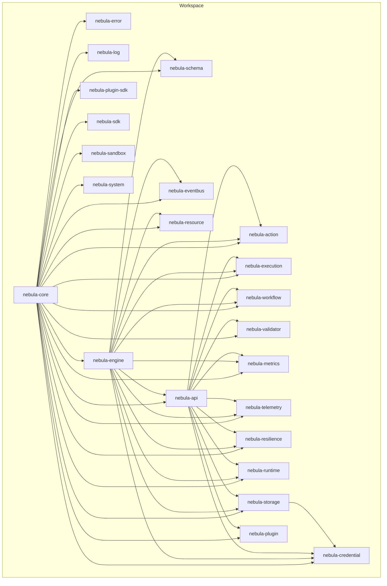
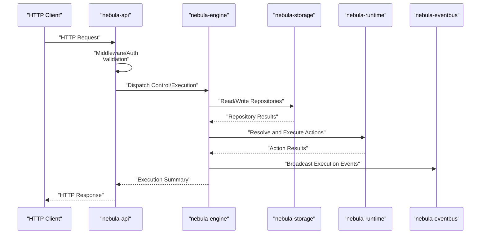
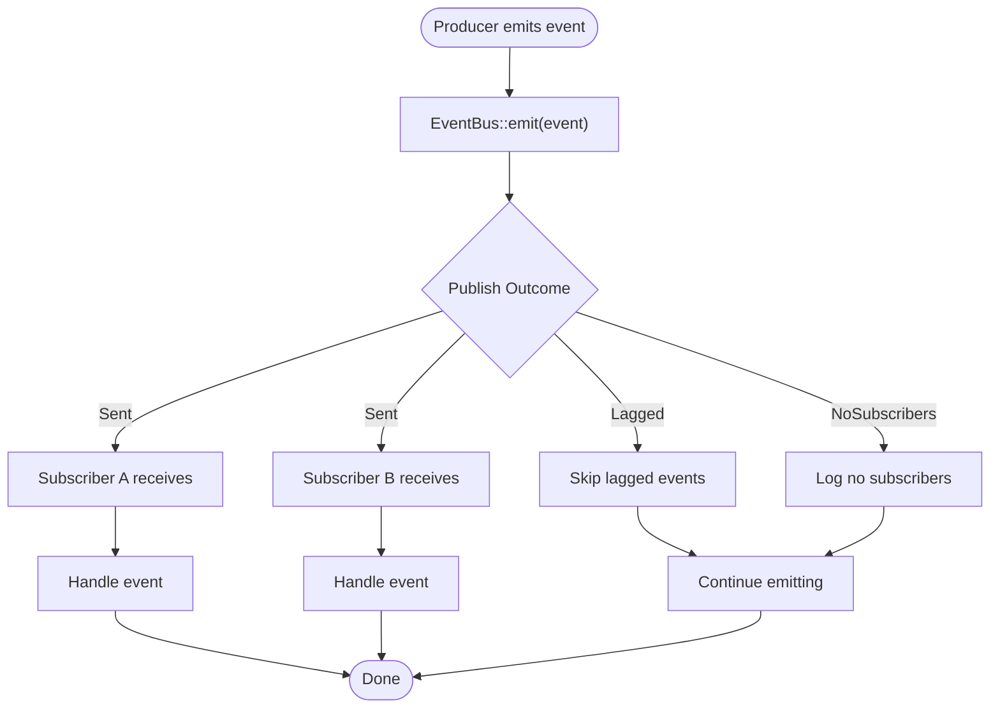
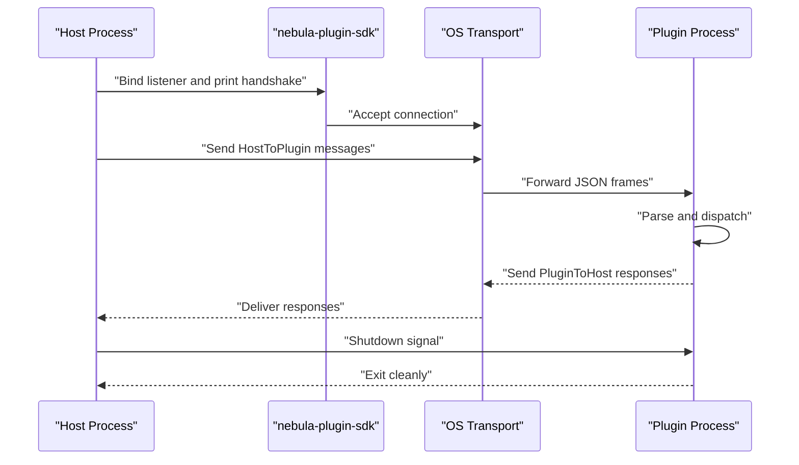
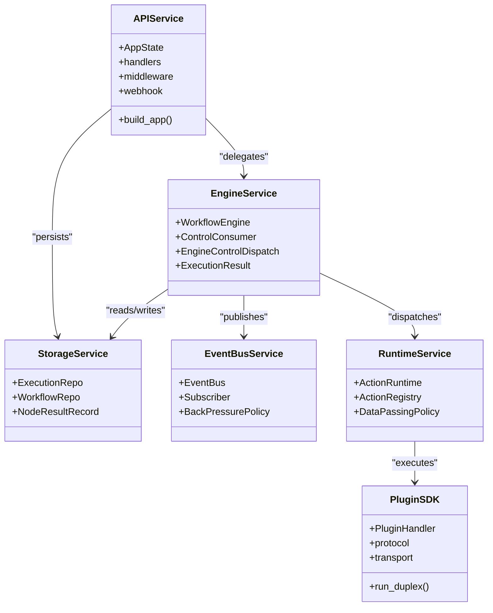
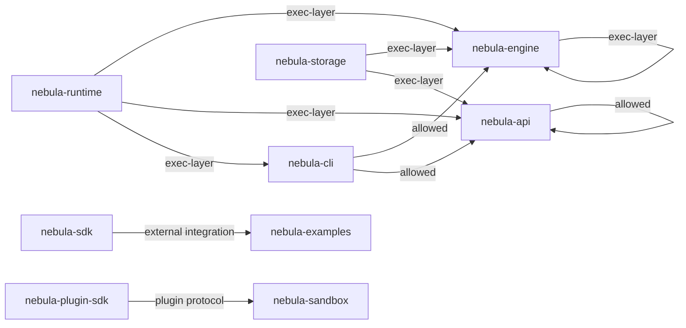

# Architecture Deep Dive

<cite>
**Referenced Files in This Document**
- [Cargo.toml](file://Cargo.toml)
- [deny.toml](file://deny.toml)
- [.cargo/config.toml](file://.cargo/config.toml)
- [crates/core/src/lib.rs](file://crates/core/src/lib.rs)
- [crates/engine/src/lib.rs](file://crates/engine/src/lib.rs)
- [crates/api/src/lib.rs](file://crates/api/src/lib.rs)
- [crates/storage/src/lib.rs](file://crates/storage/src/lib.rs)
- [crates/eventbus/src/lib.rs](file://crates/eventbus/src/lib.rs)
- [crates/sdk/src/lib.rs](file://crates/sdk/src/lib.rs)
- [crates/plugin-sdk/src/lib.rs](file://crates/plugin-sdk/src/lib.rs)
- [crates/runtime/src/lib.rs](file://crates/runtime/src/lib.rs)
- [crates/api/Cargo.toml](file://crates/api/Cargo.toml)
- [crates/engine/Cargo.toml](file://crates/engine/Cargo.toml)
- [crates/storage/Cargo.toml](file://crates/storage/Cargo.toml)
- [crates/eventbus/Cargo.toml](file://crates/eventbus/Cargo.toml)
</cite>

## Table of Contents
1. [Introduction](#introduction)
2. [Project Structure](#project-structure)
3. [Core Components](#core-components)
4. [Architecture Overview](#architecture-overview)
5. [Detailed Component Analysis](#detailed-component-analysis)
6. [Dependency Analysis](#dependency-analysis)
7. [Performance Considerations](#performance-considerations)
8. [Troubleshooting Guide](#troubleshooting-guide)
9. [Conclusion](#conclusion)
10. [Appendices](#appendices)

## Introduction
This document presents a deep dive into the Nebula system architecture. Nebula is a Rust-based workflow automation toolkit organized as a layered, modular workspace. The architecture enforces a strict one-way dependency model across seven conceptual layers: Core, Business, Exec, API/Public, Cross-cutting, Infrastructure, and External Integration. It leverages a publish-subscribe EventBus for in-process communication, cargo deny for dependency governance, and a robust async runtime stack centered on Tokio and Axum. The system supports embedding and extension via SDKs, plugin protocols, and pluggable storage backends.

## Project Structure
Nebula is a Cargo workspace spanning multiple crates grouped by functional domains. The workspace members include core libraries, execution orchestration, API, storage, observability, resilience, and integration scaffolding. The workspace configuration centralizes dependency versions and lint policies, while deny.toml enforces cross-crate dependency constraints to maintain layer discipline.

**Diagram sources**
- [Cargo.toml:1-40](file://Cargo.toml#L1-L40)
- [crates/engine/Cargo.toml:24-40](file://crates/engine/Cargo.toml#L24-L40)
- [crates/api/Cargo.toml:14-27](file://crates/api/Cargo.toml#L14-L27)

**Section sources**
- [Cargo.toml:1-40](file://Cargo.toml#L1-L40)
- [.cargo/config.toml:23-31](file://.cargo/config.toml#L23-L31)

## Core Components
This section outlines the foundational building blocks that underpin the layered architecture.

- Core layer (nebula-core): Provides shared identifiers, keys, scopes, context contracts, guards, lifecycle primitives, and observability identities. It is the only crate that other crates may depend on without introducing cross-layer coupling.
- Execution layer (nebula-engine): Orchestrates workflow execution, controls durable queues, coordinates credential resolution, and broadcasts events via EventBus. It depends on Core, Runtime, Storage, and other domain crates.
- API layer (nebula-api): HTTP entry point implementing the API Gateway pattern. Delegates business logic to injected ports and middleware; no storage knowledge resides here.
- Storage layer (nebula-storage): Persistence seam exposing repositories for executions and workflows, with optional backends (SQLite, Postgres, Redis, S3).
- EventBus (nebula-eventbus): In-process publish-subscribe channel with backpressure semantics for domain events.
- Runtime (nebula-runtime): Action dispatcher between engine and sandbox, enforcing data policies and delegating execution.
- SDKs and Plugins: nebula-sdk offers a façade for integration authors; nebula-plugin-sdk defines the out-of-process plugin protocol.

**Section sources**
- [crates/core/src/lib.rs:1-111](file://crates/core/src/lib.rs#L1-L111)
- [crates/engine/src/lib.rs:1-79](file://crates/engine/src/lib.rs#L1-L79)
- [crates/api/src/lib.rs:1-60](file://crates/api/src/lib.rs#L1-L60)
- [crates/storage/src/lib.rs:1-105](file://crates/storage/src/lib.rs#L1-L105)
- [crates/eventbus/src/lib.rs:1-156](file://crates/eventbus/src/lib.rs#L1-L156)
- [crates/runtime/src/lib.rs:1-50](file://crates/runtime/src/lib.rs#L1-L50)
- [crates/sdk/src/lib.rs:1-279](file://crates/sdk/src/lib.rs#L1-L279)
- [crates/plugin-sdk/src/lib.rs:1-515](file://crates/plugin-sdk/src/lib.rs#L1-L515)

## Architecture Overview
The Nebula architecture follows a layered design with explicit one-way dependencies enforced by cargo deny. The layers are conceptual and map to crates as follows:

- Core: Shared types and contracts (nebula-core)
- Business: Domain capabilities (nebula-action, nebula-workflow, nebula-schema, nebula-validator, nebula-credential, nebula-resource, nebula-plugin)
- Exec: Orchestration and runtime (nebula-engine, nebula-runtime, nebula-execution)
- API/Public: HTTP entry point (nebula-api)
- Cross-cutting: Observability and resilience (nebula-log, nebula-metrics, nebula-telemetry, nebula-resilience, nebula-error)
- Infrastructure: Persistence and transport (nebula-storage, nebula-eventbus)
- External Integration: SDKs and plugin protocol (nebula-sdk, nebula-plugin-sdk, nebula-sandbox)

```mermaid
graph TB
subgraph "Core"
CORE["nebula-core"]
end
subgraph "Business"
ACTION["nebula-action"]
WORKFLOW["nebula-workflow"]
SCHEMA["nebula-schema"]
VALIDATOR["nebula-validator"]
CREDENTIAL["nebula-credential"]
RESOURCE["nebula-resource"]
PLUGIN["nebula-plugin"]
end
subgraph "Exec"
ENGINE["nebula-engine"]
RUNTIME["nebula-runtime"]
EXECUTION["nebula-execution"]
end
subgraph "API/Public"
API["nebula-api"]
end
subgraph "Cross-cutting"
LOG["nebula-log"]
METRICS["nebula-metrics"]
TELEMETRY["nebula-telemetry"]
RESILIENCE["nebula-resilience"]
ERROR["nebula-error"]
end
subgraph "Infrastructure"
STORAGE["nebula-storage"]
EVENTBUS["nebula-eventbus"]
end
subgraph "External Integration"
SDK["nebula-sdk"]
PLUGIN_SDK["nebula-plugin-sdk"]
SANDBOX["nebula-sandbox"]
end
CORE --> ACTION
CORE --> WORKFLOW
CORE --> SCHEMA
CORE --> VALIDATOR
CORE --> CREDENTIAL
CORE --> RESOURCE
CORE --> PLUGIN
CORE --> ENGINE
CORE --> RUNTIME
CORE --> EXECUTION
CORE --> API
CORE --> LOG
CORE --> METRICS
CORE --> TELEMETRY
CORE --> RESILIENCE
CORE --> ERROR
CORE --> STORAGE
CORE --> EVENTBUS
CORE --> SDK
CORE --> PLUGIN_SDK
CORE --> SANDBOX
ENGINE --> RUNTIME
ENGINE --> STORAGE
ENGINE --> EVENTBUS
ENGINE --> CREDENTIAL
ENGINE --> RESOURCE
ENGINE --> ACTION
ENGINE --> EXECUTION
ENGINE --> WORKFLOW
ENGINE --> SCHEMA
ENGINE --> RESILIENCE
ENGINE --> METRICS
ENGINE --> TELEMETRY
API --> STORAGE
API --> EXECUTION
API --> WORKFLOW
API --> ACTION
API --> RUNTIME
API --> PLUGIN
API --> RESILIENCE
API --> METRICS
API --> TELEMETRY
API --> CREDENTIAL
API --> VALIDATOR
```

**Diagram sources**
- [Cargo.toml:1-40](file://Cargo.toml#L1-L40)
- [deny.toml:51-86](file://deny.toml#L51-L86)
- [crates/engine/Cargo.toml:24-40](file://crates/engine/Cargo.toml#L24-L40)
- [crates/api/Cargo.toml:14-27](file://crates/api/Cargo.toml#L14-L27)

## Detailed Component Analysis

### API Layer Interaction with Engine and Storage
The API layer acts as the HTTP entry point and delegates business logic to injected ports. It coordinates with the Engine layer for execution control and with the Storage layer for persistence. The Engine layer consumes durable control signals and coordinates action execution via Runtime and Sandbox.

**Diagram sources**
- [crates/api/src/lib.rs:1-60](file://crates/api/src/lib.rs#L1-L60)
- [crates/engine/src/lib.rs:1-79](file://crates/engine/src/lib.rs#L1-L79)
- [crates/storage/src/lib.rs:1-105](file://crates/storage/src/lib.rs#L1-L105)
- [crates/eventbus/src/lib.rs:1-156](file://crates/eventbus/src/lib.rs#L1-L156)
- [crates/runtime/src/lib.rs:1-50](file://crates/runtime/src/lib.rs#L1-L50)

**Section sources**
- [crates/api/src/lib.rs:1-60](file://crates/api/src/lib.rs#L1-L60)
- [crates/engine/src/lib.rs:1-79](file://crates/engine/src/lib.rs#L1-L79)
- [crates/storage/src/lib.rs:1-105](file://crates/storage/src/lib.rs#L1-L105)
- [crates/eventbus/src/lib.rs:1-156](file://crates/eventbus/src/lib.rs#L1-L156)
- [crates/runtime/src/lib.rs:1-50](file://crates/runtime/src/lib.rs#L1-L50)

### Cross-Crate Communication via EventBus
EventBus provides a typed, in-process publish-subscribe channel with backpressure. Producers publish domain events (e.g., execution events) and subscribers receive them asynchronously. Slow subscribers automatically reposition to the latest event, ensuring producers remain unblocked.

**Diagram sources**
- [crates/eventbus/src/lib.rs:1-156](file://crates/eventbus/src/lib.rs#L1-L156)

**Section sources**
- [crates/eventbus/src/lib.rs:1-156](file://crates/eventbus/src/lib.rs#L1-L156)

### Plugin System and Out-of-Process Isolation
Plugins communicate with the host via a duplex line-delimited JSON protocol over OS-native transports. The plugin SDK manages transport binding, framing, and dispatch loops, while the host sandbox orchestrates isolation and execution.

**Diagram sources**
- [crates/plugin-sdk/src/lib.rs:1-515](file://crates/plugin-sdk/src/lib.rs#L1-L515)

**Section sources**
- [crates/plugin-sdk/src/lib.rs:1-515](file://crates/plugin-sdk/src/lib.rs#L1-L515)

### Component Breakdown: API Gateway, Execution Engine, Storage, Plugin Systems
- API Gateway (nebula-api): Thin HTTP handlers, middleware, error handling, webhook transport, and state injection. It relies on Core, Execution, Workflow, Action, Runtime, Plugin, Resilience, Metrics, Telemetry, and optionally Credential.
- Execution Engine (nebula-engine): Orchestrates workflow execution, controls durable queues, coordinates credential/resource accessors, and publishes events. It depends on Core, Action, Expression, Plugin, Workflow, Execution, Schema, Credential, EventBus, Resource, Runtime, Resilience, Storage, Metrics, and Telemetry.
- Storage Seam (nebula-storage): Provides ExecutionRepo and WorkflowRepo abstractions with optional backends (Postgres, Redis, S3). It depends on Core and Credential.
- Plugin Systems: nebula-sdk offers a façade for integration authors; nebula-plugin-sdk defines the wire protocol for out-of-process plugins.

**Diagram sources**
- [crates/api/src/lib.rs:1-60](file://crates/api/src/lib.rs#L1-L60)
- [crates/engine/src/lib.rs:1-79](file://crates/engine/src/lib.rs#L1-L79)
- [crates/storage/src/lib.rs:1-105](file://crates/storage/src/lib.rs#L1-L105)
- [crates/eventbus/src/lib.rs:1-156](file://crates/eventbus/src/lib.rs#L1-L156)
- [crates/runtime/src/lib.rs:1-50](file://crates/runtime/src/lib.rs#L1-L50)
- [crates/plugin-sdk/src/lib.rs:1-515](file://crates/plugin-sdk/src/lib.rs#L1-L515)

**Section sources**
- [crates/api/src/lib.rs:1-60](file://crates/api/src/lib.rs#L1-L60)
- [crates/engine/src/lib.rs:1-79](file://crates/engine/src/lib.rs#L1-L79)
- [crates/storage/src/lib.rs:1-105](file://crates/storage/src/lib.rs#L1-L105)
- [crates/eventbus/src/lib.rs:1-156](file://crates/eventbus/src/lib.rs#L1-L156)
- [crates/runtime/src/lib.rs:1-50](file://crates/runtime/src/lib.rs#L1-L50)
- [crates/plugin-sdk/src/lib.rs:1-515](file://crates/plugin-sdk/src/lib.rs#L1-L515)

## Dependency Analysis
Nebula enforces one-way layer dependencies using cargo deny. The configuration restricts which crates may depend on others, preventing lower-level crates from depending on higher-level ones. This ensures clear separation of concerns and reduces accidental coupling.

**Diagram sources**
- [deny.toml:51-86](file://deny.toml#L51-L86)

**Section sources**
- [deny.toml:51-86](file://deny.toml#L51-L86)

## Performance Considerations
- Async runtime: Tokio is configured with multi-threaded runtime, timers, and synchronization primitives to support high-throughput asynchronous workflows.
- Observability: OpenTelemetry and tracing are integrated for metrics and distributed tracing, enabling production-grade observability.
- Backpressure: EventBus employs bounded channels with lagging semantics to prevent unbounded memory growth under load.
- Storage backends: Optional Postgres, Redis, and S3 backends allow scaling persistence horizontally; SQLite remains the default for development and local scenarios.
- Build profile: Release profiles use thin LTO, multiple codegen units, symbol stripping, and abort panics for smaller binaries and faster startup.

**Section sources**
- [Cargo.toml:57-63](file://Cargo.toml#L57-L63)
- [Cargo.toml:127-133](file://Cargo.toml#L127-L133)
- [crates/eventbus/Cargo.toml:14-19](file://crates/eventbus/Cargo.toml#L14-L19)
- [crates/storage/Cargo.toml:38-58](file://crates/storage/Cargo.toml#L38-L58)
- [Cargo.toml:290-297](file://Cargo.toml#L290-L297)

## Troubleshooting Guide
- Dependency violations: cargo deny enforces layer constraints. If a build fails due to disallowed dependencies, review deny.toml and adjust crate dependencies accordingly.
- Logging and tracing: Use the log and telemetry crates to instrument critical paths. Enable tracing filters during development and production to capture spans and metrics.
- Error handling: Centralize error types in the error crate and propagate typed errors through the system. Use thiserror for error derivation and ensure API surfaces RFC 9457 Problem Details.
- Observability: Leverage metrics and telemetry adapters to export data to external systems. Monitor EventBus lag and runtime queue depths to detect bottlenecks.

**Section sources**
- [deny.toml:1-141](file://deny.toml#L1-L141)
- [Cargo.toml:127-133](file://Cargo.toml#L127-L133)
- [crates/error](file://crates/error/src/lib.rs)

## Conclusion
Nebula’s architecture balances modularity, safety, and scalability through a strict layered design, enforced by cargo deny, and powered by a robust async runtime stack. The API layer remains thin and secure, delegating orchestration to the Engine layer and persistence to Storage. EventBus enables efficient in-process eventing, while SDKs and plugin protocols support embedding and extensibility. The modular structure facilitates incremental adoption, clear ownership boundaries, and seamless integration with diverse infrastructure backends.

## Appendices

### Technology Stack
- Async runtime: Tokio (multi-threaded, timers, sync)
- Web framework: Axum (HTTP server)
- Observability: Tracing, OpenTelemetry, Prometheus-compatible metrics
- Serialization: Serde (JSON)
- Databases: SQLx (Postgres, SQLite)
- Security: JWT, cryptographic primitives, TLS via rustls
- Resilience: Circuit breakers, retries, timeouts, rate limiting

**Section sources**
- [Cargo.toml:57-133](file://Cargo.toml#L57-L133)
- [crates/api/Cargo.toml:29-68](file://crates/api/Cargo.toml#L29-L68)
- [crates/storage/Cargo.toml:38-58](file://crates/storage/Cargo.toml#L38-L58)

### Deployment Topology
- Single-node local: SQLite, in-memory repositories, embedded runtime.
- Multi-node production: Postgres for durable repositories, optional Redis/S3 for caching and artifacts, Axum fronting the API, and horizontal scaling of worker processes running the Engine and Runtime.

**Section sources**
- [crates/storage/src/lib.rs:1-105](file://crates/storage/src/lib.rs#L1-L105)
- [crates/api/Cargo.toml:29-68](file://crates/api/Cargo.toml#L29-L68)