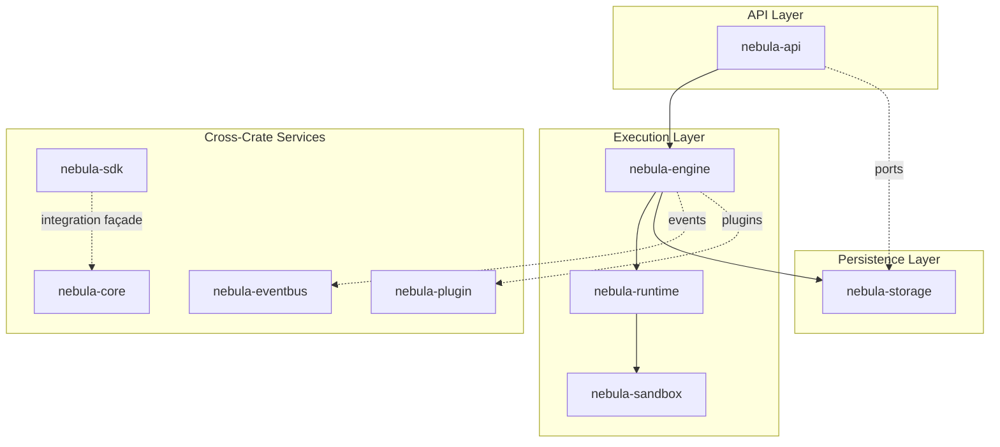
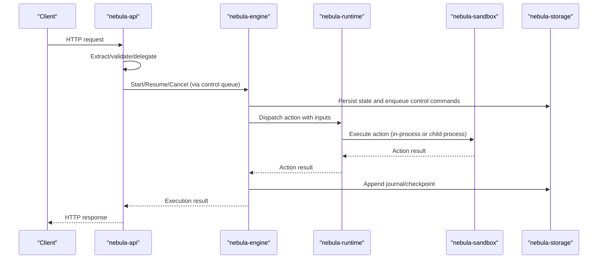
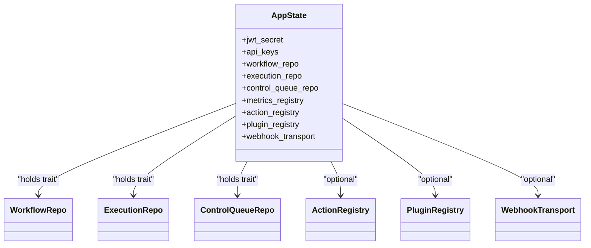
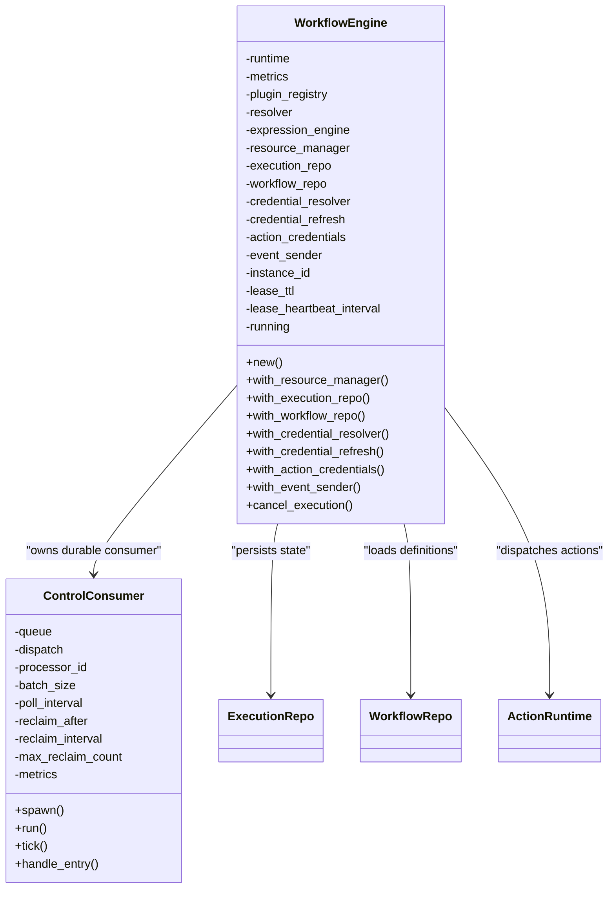
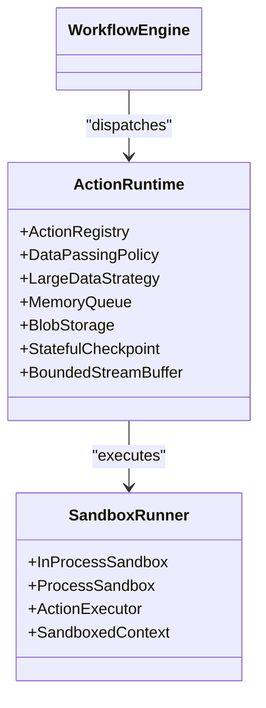
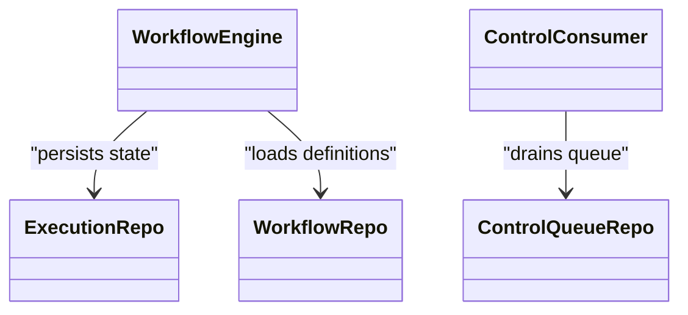
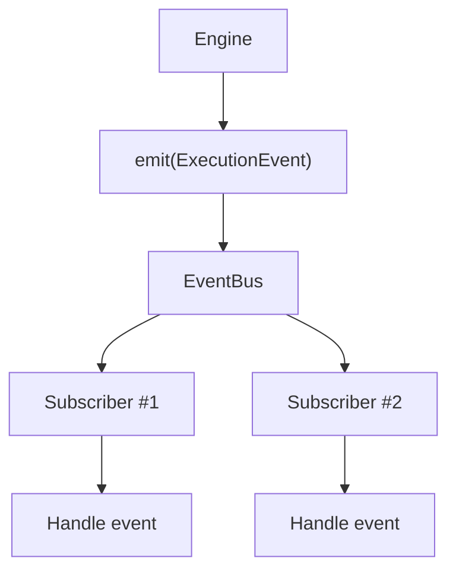
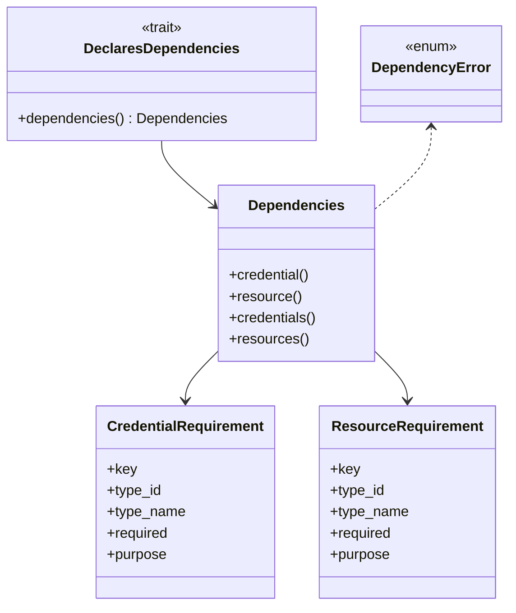
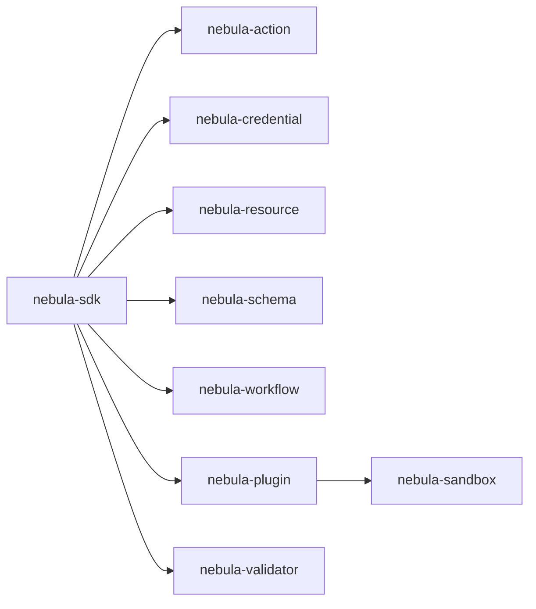
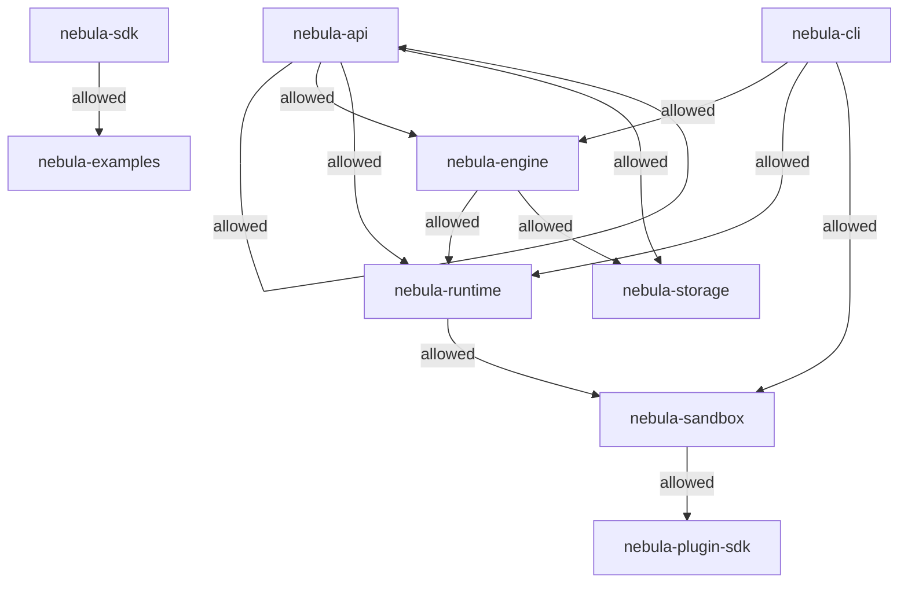

# Component Relationships and Dependencies

<cite>
**Referenced Files in This Document**
- [Cargo.toml](file://Cargo.toml)
- [deny.toml](file://deny.toml)
- [crates/api/src/lib.rs](file://crates/api/src/lib.rs)
- [crates/api/src/state.rs](file://crates/api/src/state.rs)
- [crates/engine/src/lib.rs](file://crates/engine/src/lib.rs)
- [crates/engine/src/engine.rs](file://crates/engine/src/engine.rs)
- [crates/engine/src/control_consumer.rs](file://crates/engine/src/control_consumer.rs)
- [crates/storage/src/lib.rs](file://crates/storage/src/lib.rs)
- [crates/storage/Cargo.toml](file://crates/storage/Cargo.toml)
- [crates/runtime/src/lib.rs](file://crates/runtime/src/lib.rs)
- [crates/sandbox/src/lib.rs](file://crates/sandbox/src/lib.rs)
- [crates/eventbus/src/lib.rs](file://crates/eventbus/src/lib.rs)
- [crates/core/src/dependencies.rs](file://crates/core/src/dependencies.rs)
- [crates/sdk/src/lib.rs](file://crates/sdk/src/lib.rs)
- [crates/plugin/src/lib.rs](file://crates/plugin/src/lib.rs)
</cite>

## Table of Contents
1. [Introduction](#introduction)
2. [Project Structure](#project-structure)
3. [Core Components](#core-components)
4. [Architecture Overview](#architecture-overview)
5. [Detailed Component Analysis](#detailed-component-analysis)
6. [Dependency Analysis](#dependency-analysis)
7. [Performance Considerations](#performance-considerations)
8. [Troubleshooting Guide](#troubleshooting-guide)
9. [Conclusion](#conclusion)
10. [Appendices](#appendices)

## Introduction
This document explains how Nebula’s components relate and interact across layers, focusing on the execution flow from the API gateway through the engine to storage persistence. It details dependency injection patterns, service composition, cross-crate communication, and the role of EventBus in decoupling modules. It also covers cargo deny configuration enforcing architectural boundaries, lifecycle management, and practical examples drawn from the codebase.

## Project Structure
Nebula is a Rust workspace composed of multiple crates organized by functional layer:
- API gateway: HTTP entry point and handler orchestration
- Engine: Workflow execution orchestration and control-plane coordination
- Runtime: Action dispatch and data-passing policies
- Sandbox: Process sandboxing and plugin integration
- Storage: Persistence seam and repositories
- EventBus: In-process publish-subscribe channel
- Core: Shared types and dependency declaration infrastructure
- SDK: Integration façade for external authors
- Plugin: Plugin distribution unit and registry

**Diagram sources**
- [Cargo.toml:1-39](file://Cargo.toml#L1-L39)
- [crates/api/src/lib.rs:1-60](file://crates/api/src/lib.rs#L1-L60)
- [crates/engine/src/lib.rs:1-79](file://crates/engine/src/lib.rs#L1-L79)
- [crates/runtime/src/lib.rs:1-50](file://crates/runtime/src/lib.rs#L1-L50)
- [crates/sandbox/src/lib.rs:1-56](file://crates/sandbox/src/lib.rs#L1-L56)
- [crates/storage/src/lib.rs:1-105](file://crates/storage/src/lib.rs#L1-L105)
- [crates/eventbus/src/lib.rs:1-156](file://crates/eventbus/src/lib.rs#L1-L156)
- [crates/core/src/dependencies.rs:1-127](file://crates/core/src/dependencies.rs#L1-L127)
- [crates/sdk/src/lib.rs:1-279](file://crates/sdk/src/lib.rs#L1-L279)
- [crates/plugin/src/lib.rs:1-50](file://crates/plugin/src/lib.rs#L1-L50)

**Section sources**
- [Cargo.toml:1-39](file://Cargo.toml#L1-L39)

## Core Components
- API: Thin HTTP handlers and middleware; delegates business logic to injected port traits. Application state holds only traits (no concrete implementations).
- Engine: Builds execution plans, coordinates node execution, manages leases, and emits events. Owns the durable control-plane consumer.
- Runtime: Action dispatcher between engine and sandbox; enforces data-passing policies and telemetry.
- Sandbox: Host-side broker for in-process and child-process execution; integrates plugins via discovery and capability model.
- Storage: Persistence interface and repositories; provides execution/workflow repositories and control-queue repository.
- EventBus: In-memory publish-subscribe channel for intra-workspace event broadcasting without tight coupling.
- Core: Shared types and dependency declaration infrastructure used by registries and builders.
- SDK: Integration façade exposing Action, Credential, Resource, Schema, Plugin, Validator, plus builders and test harness.
- Plugin: Plugin distribution unit and registry; plugins register actions, credentials, and resources.

**Section sources**
- [crates/api/src/lib.rs:1-60](file://crates/api/src/lib.rs#L1-L60)
- [crates/api/src/state.rs:1-153](file://crates/api/src/state.rs#L1-L153)
- [crates/engine/src/lib.rs:1-79](file://crates/engine/src/lib.rs#L1-L79)
- [crates/runtime/src/lib.rs:1-50](file://crates/runtime/src/lib.rs#L1-L50)
- [crates/sandbox/src/lib.rs:1-56](file://crates/sandbox/src/lib.rs#L1-L56)
- [crates/storage/src/lib.rs:1-105](file://crates/storage/src/lib.rs#L1-L105)
- [crates/eventbus/src/lib.rs:1-156](file://crates/eventbus/src/lib.rs#L1-L156)
- [crates/core/src/dependencies.rs:1-127](file://crates/core/src/dependencies.rs#L1-L127)
- [crates/sdk/src/lib.rs:1-279](file://crates/sdk/src/lib.rs#L1-L279)
- [crates/plugin/src/lib.rs:1-50](file://crates/plugin/src/lib.rs#L1-L50)

## Architecture Overview
The canonical flow:
- API receives requests and delegates to injected port traits.
- Engine orchestrates workflow execution, coordinates with Runtime, and persists state via Storage.
- Sandbox executes actions either in-process or in a child process.
- EventBus decouples producers and consumers for in-process observability.
- Plugins are integrated through the Sandbox and registered via the Plugin registry.

**Diagram sources**
- [crates/api/src/lib.rs:1-60](file://crates/api/src/lib.rs#L1-L60)
- [crates/engine/src/engine.rs:121-202](file://crates/engine/src/engine.rs#L121-L202)
- [crates/runtime/src/lib.rs:1-50](file://crates/runtime/src/lib.rs#L1-L50)
- [crates/sandbox/src/lib.rs:1-56](file://crates/sandbox/src/lib.rs#L1-L56)
- [crates/storage/src/lib.rs:1-105](file://crates/storage/src/lib.rs#L1-L105)

## Detailed Component Analysis

### API Layer: Dependency Injection and Delegation
- Application state holds only port traits (workflow_repo, execution_repo, control_queue_repo, metrics_registry, action_registry, plugin_registry, webhook_transport). This ensures the API remains free of storage or engine internals.
- Handlers extract and validate requests, then delegate to the injected traits. This enforces separation of concerns and testability.

**Diagram sources**
- [crates/api/src/state.rs:24-81](file://crates/api/src/state.rs#L24-L81)

**Section sources**
- [crates/api/src/state.rs:1-153](file://crates/api/src/state.rs#L1-L153)
- [crates/api/src/lib.rs:1-60](file://crates/api/src/lib.rs#L1-L60)

### Engine Layer: Orchestration, Control Plane, and Storage Coordination
- The engine constructs a dependency graph from the workflow definition, executes nodes frontier-by-frontier, evaluates edge conditions, resolves inputs, and delegates action dispatch to the Runtime.
- It owns the durable control-plane consumer that drains the execution control queue and dispatches typed commands (Start, Resume, Restart, Cancel, Terminate) to the engine’s start/cancel paths.
- The engine optionally persists execution state and checkpoints via ExecutionRepo and WorkflowRepo, emitting ExecutionEvents to the EventBus for observability.

**Diagram sources**
- [crates/engine/src/engine.rs:121-202](file://crates/engine/src/engine.rs#L121-L202)
- [crates/engine/src/control_consumer.rs:204-220](file://crates/engine/src/control_consumer.rs#L204-L220)

**Section sources**
- [crates/engine/src/lib.rs:1-79](file://crates/engine/src/lib.rs#L1-L79)
- [crates/engine/src/engine.rs:121-202](file://crates/engine/src/engine.rs#L121-L202)
- [crates/engine/src/control_consumer.rs:1-636](file://crates/engine/src/control_consumer.rs#L1-L636)

### Runtime and Sandbox: Action Dispatch and Plugin Integration
- Runtime sits between the Engine and Sandbox. It resolves action handlers from the registry, enforces data-passing policies, emits telemetry, and delegates to the Sandbox for execution.
- Sandbox provides in-process and child-process execution modes and bridges into the ActionRegistry. Plugins are hosted by the Sandbox and integrated via discovery and capability models.

**Diagram sources**
- [crates/runtime/src/lib.rs:1-50](file://crates/runtime/src/lib.rs#L1-L50)
- [crates/sandbox/src/lib.rs:1-56](file://crates/sandbox/src/lib.rs#L1-L56)

**Section sources**
- [crates/runtime/src/lib.rs:1-50](file://crates/runtime/src/lib.rs#L1-L50)
- [crates/sandbox/src/lib.rs:1-56](file://crates/sandbox/src/lib.rs#L1-L56)

### Storage: Repositories and Backends
- Storage exposes ExecutionRepo and WorkflowRepo as the primary persistence interfaces, with optional backends (SQLite, PostgreSQL, Redis, S3) gated by features.
- The repos module defines planned traits for a future row model; ControlQueueRepo is a production trait consumed by the Engine’s ControlConsumer.

**Diagram sources**
- [crates/storage/src/lib.rs:1-105](file://crates/storage/src/lib.rs#L1-L105)
- [crates/engine/src/control_consumer.rs:204-220](file://crates/engine/src/control_consumer.rs#L204-L220)

**Section sources**
- [crates/storage/src/lib.rs:1-105](file://crates/storage/src/lib.rs#L1-L105)
- [crates/storage/Cargo.toml:1-98](file://crates/storage/Cargo.toml#L1-L98)

### EventBus: Decoupling and Observability
- EventBus provides a bounded, in-memory publish-subscribe channel with back-pressure semantics. It enables domain crates to broadcast events without tight coupling.
- The Engine emits ExecutionEvents to the EventBus for observability and TUI updates.

**Diagram sources**
- [crates/eventbus/src/lib.rs:1-156](file://crates/eventbus/src/lib.rs#L1-L156)
- [crates/engine/src/engine.rs:520-535](file://crates/engine/src/engine.rs#L520-L535)

**Section sources**
- [crates/eventbus/src/lib.rs:1-156](file://crates/eventbus/src/lib.rs#L1-L156)
- [crates/engine/src/engine.rs:520-535](file://crates/engine/src/engine.rs#L520-L535)

### Dependency Declaration Infrastructure
- Core provides a mechanism for declaring dependencies (credentials and resources) with validation and error reporting. This supports registry validation and helps prevent missing or cyclic dependencies.

**Diagram sources**
- [crates/core/src/dependencies.rs:8-41](file://crates/core/src/dependencies.rs#L8-L41)
- [crates/core/src/dependencies.rs:54-82](file://crates/core/src/dependencies.rs#L54-L82)
- [crates/core/src/dependencies.rs:90-111](file://crates/core/src/dependencies.rs#L90-L111)

**Section sources**
- [crates/core/src/dependencies.rs:1-127](file://crates/core/src/dependencies.rs#L1-L127)

### SDK and Plugin Integration
- SDK provides a façade for integration authors, re-exporting Action, Credential, Resource, Schema, Plugin, Validator, plus builders and test harness.
- Plugin defines the plugin distribution unit and registry; plugins register actions, credentials, and resources and are integrated via the Sandbox.

**Diagram sources**
- [crates/sdk/src/lib.rs:1-279](file://crates/sdk/src/lib.rs#L1-L279)
- [crates/plugin/src/lib.rs:1-50](file://crates/plugin/src/lib.rs#L1-L50)
- [crates/sandbox/src/lib.rs:1-56](file://crates/sandbox/src/lib.rs#L1-L56)

**Section sources**
- [crates/sdk/src/lib.rs:1-279](file://crates/sdk/src/lib.rs#L1-L279)
- [crates/plugin/src/lib.rs:1-50](file://crates/plugin/src/lib.rs#L1-L50)
- [crates/sandbox/src/lib.rs:1-56](file://crates/sandbox/src/lib.rs#L1-L56)

## Dependency Analysis
Nebula enforces architectural boundaries using cargo deny to prevent lower-level crates from depending on higher-level ones:
- API is the top layer; lower-level crates must not depend on it.
- Engine is the execution layer; business/core crates must not depend on it.
- Runtime is the execution layer; only designated upper-layer crates may depend on it.
- Sandbox is the execution/infrastructure boundary; only Runtime and CLI may depend on it directly.
- Storage is the execution layer; business and core crates must not depend on it directly.
- SDK is the external integration surface; only examples may depend on it.
- Plugin-SDK is the out-of-process plugin protocol; only Sandbox may depend on it.

**Diagram sources**
- [deny.toml:51-85](file://deny.toml#L51-L85)

**Section sources**
- [deny.toml:1-141](file://deny.toml#L1-L141)

## Performance Considerations
- Engine event channel is bounded to prevent memory growth under slow consumers; events are dropped rather than blocking the engine.
- Control consumer uses exponential backoff on storage errors and reclaim sweeps to recover stuck rows.
- Runtime and Sandbox enforce data-passing policies and streaming backpressure to maintain responsiveness.
- Storage backends are feature-gated to minimize dependencies and tailor performance characteristics.

[No sources needed since this section provides general guidance]

## Troubleshooting Guide
Common issues and remedies:
- Slow TUI or observability consumers: bounded engine event channel may drop events; increase buffer capacity or investigate consumer throughput.
- Control queue backpressure: monitor reclaim outcomes and adjust reclaim intervals; ensure storage is healthy to avoid repeated backoff.
- Credential access denials: verify action credential allowlists and resolver configuration; ensure proactive refresh is set for short-lived credentials.
- Plugin integration problems: confirm plugin discovery and capability declarations; ensure Sandbox runner is configured for the desired execution mode.

**Section sources**
- [crates/engine/src/engine.rs:520-535](file://crates/engine/src/engine.rs#L520-L535)
- [crates/engine/src/control_consumer.rs:368-426](file://crates/engine/src/control_consumer.rs#L368-L426)
- [crates/runtime/src/lib.rs:1-50](file://crates/runtime/src/lib.rs#L1-L50)
- [crates/sandbox/src/lib.rs:1-56](file://crates/sandbox/src/lib.rs#L1-L56)

## Conclusion
Nebula’s architecture separates concerns across layers with clear dependency boundaries enforced by cargo deny. The API delegates to injected ports, the Engine orchestrates execution and control-plane coordination, Runtime dispatches actions, Sandbox executes them, and Storage persists state. EventBus decouples producers and consumers for observability. Dependency injection and service composition enable testability and maintainability, while architectural constraints ensure predictable evolution.

[No sources needed since this section summarizes without analyzing specific files]

## Appendices

### Component Lifecycle Management and Shutdown Procedures
- Control consumer shutdown: gracefully flushes already-claimed commands and exits upon cancellation; rows remain in Processing and are reclaimed by the next runner.
- Engine lease lifecycle: acquisition and heartbeat tasks coordinate ownership; heartbeat loss or cancellation terminates frontier loops safely.
- Sandbox execution: in-process and child-process modes provide different isolation guarantees; cleanup and cancellation are handled by the Sandbox runner.

**Section sources**
- [crates/engine/src/control_consumer.rs:307-363](file://crates/engine/src/control_consumer.rs#L307-L363)
- [crates/engine/src/engine.rs:779-846](file://crates/engine/src/engine.rs#L779-L846)
- [crates/sandbox/src/lib.rs:1-56](file://crates/sandbox/src/lib.rs#L1-L56)

### Practical Examples from the Codebase
- API state composition: Application state aggregates port traits and optional registries/transports; handlers delegate to these traits.
- Engine composition: WorkflowEngine is constructed with ActionRuntime and MetricsRegistry; optional repositories, resolvers, and event sender are attached via builder methods.
- Storage backends: Feature flags select backends (postgres, redis, s3); repositories are exposed as traits for pluggable persistence.

**Section sources**
- [crates/api/src/state.rs:24-81](file://crates/api/src/state.rs#L24-L81)
- [crates/engine/src/engine.rs:249-274](file://crates/engine/src/engine.rs#L249-L274)
- [crates/storage/Cargo.toml:61-75](file://crates/storage/Cargo.toml#L61-L75)