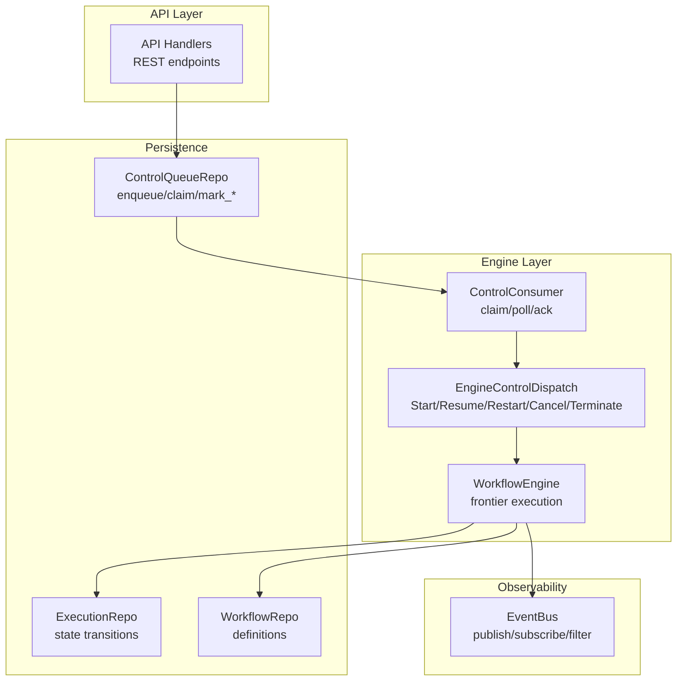
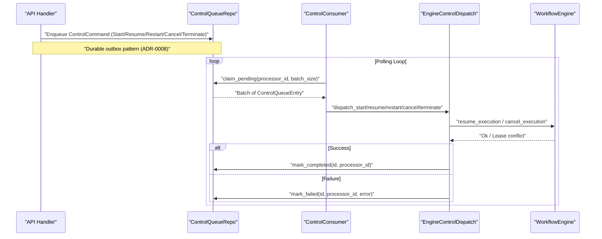
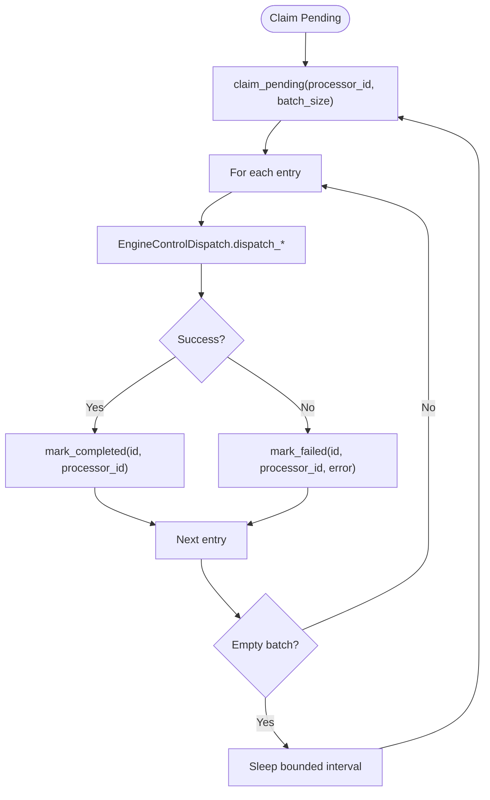
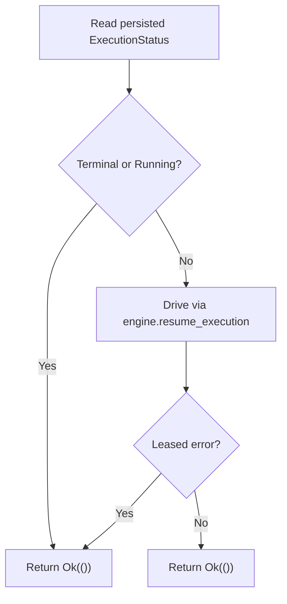
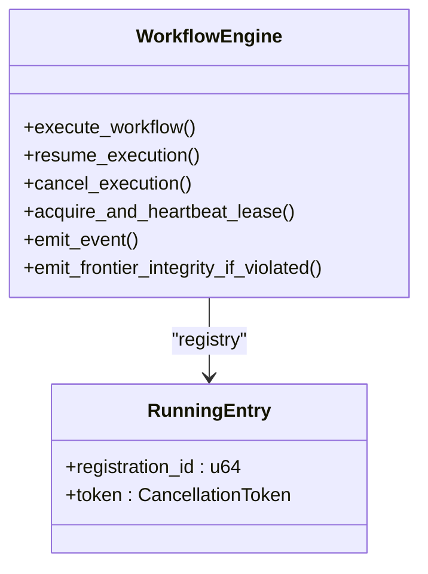
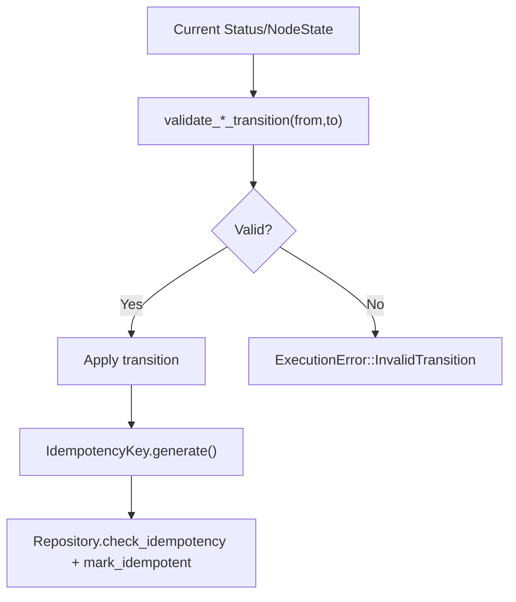
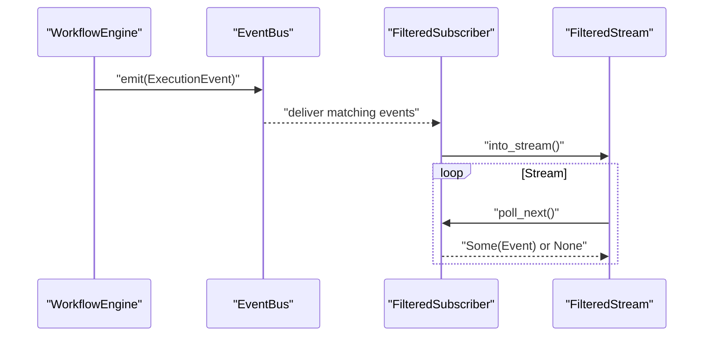
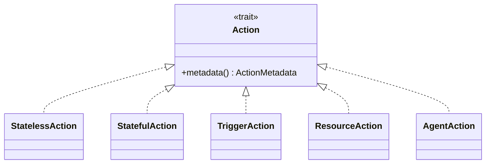
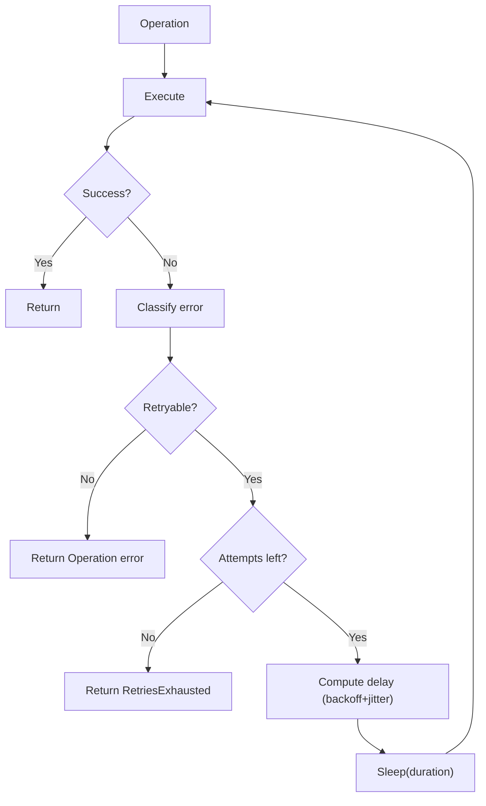
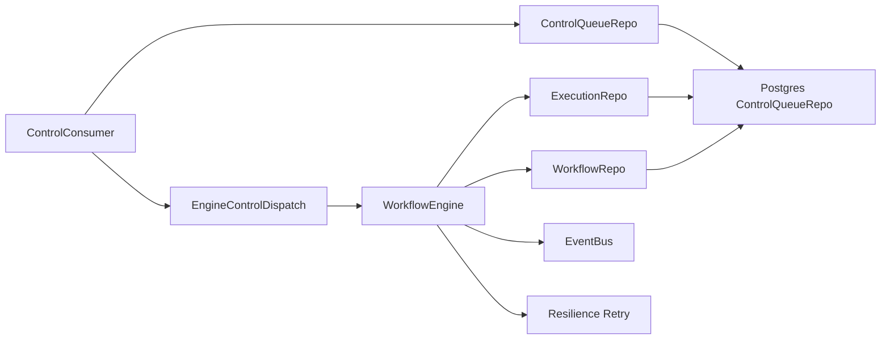

# Data Flow Analysis and Processing Pipelines

<cite>
**Referenced Files in This Document**
- [control_consumer.rs](file://crates/engine/src/control_consumer.rs)
- [control_dispatch.rs](file://crates/engine/src/control_dispatch.rs)
- [engine.rs](file://crates/engine/src/engine.rs)
- [control_queue.rs](file://crates/storage/src/repos/control_queue.rs)
- [bus.rs](file://crates/eventbus/src/bus.rs)
- [filter.rs](file://crates/eventbus/src/filter.rs)
- [stream.rs](file://crates/eventbus/src/stream.rs)
- [idempotency.rs](file://crates/execution/src/idempotency.rs)
- [transition.rs](file://crates/execution/src/transition.rs)
- [error.rs](file://crates/execution/src/error.rs)
- [retry.rs](file://crates/resilience/src/retry.rs)
- [postgres.rs](file://crates/storage/src/backend/postgres.rs)
- [lib.rs](file://crates/schema/src/lib.rs)
- [action.rs](file://crates/action/src/action.rs)
- [Action Types.md](file://crates/action/docs/Action Types.md)
- [0008-execution-control-queue-consumer.md](file://docs/adr/0008-execution-control-queue-consumer.md)
- [engine-lifecycle-canon-cluster-2026-04.md](file://docs/plans/archive/engine-lifecycle-canon-cluster-2026-04.md)
- [control_consumer_wiring.rs](file://crates/engine/tests/control_consumer_wiring.rs)
</cite>

## Table of Contents
1. [Introduction](#introduction)
2. [Project Structure](#project-structure)
3. [Core Components](#core-components)
4. [Architecture Overview](#architecture-overview)
5. [Detailed Component Analysis](#detailed-component-analysis)
6. [Dependency Analysis](#dependency-analysis)
7. [Performance Considerations](#performance-considerations)
8. [Troubleshooting Guide](#troubleshooting-guide)
9. [Conclusion](#conclusion)
10. [Appendices](#appendices)

## Introduction
This document provides comprehensive data flow documentation for Nebula’s processing pipelines. It traces the end-to-end journey from trigger events and API ingestion through workflow execution, action processing, and persistence. It explains the execution control queue consumer pattern, state transition mechanisms, and idempotency enforcement. It also details how data flows between components using the EventBus system, including event publication, subscription, and filtering patterns. Finally, it covers error propagation, retry mechanisms, recovery strategies, serialization formats, schema evolution, and backward compatibility considerations.

## Project Structure
Nebula is organized into cohesive crates that implement the orchestration, execution, persistence, eventing, and resilience layers. The most relevant areas for data flow are:
- Engine: orchestrates workflows, manages leases, and coordinates control signals.
- Execution: defines state machines, transitions, idempotency, and error models.
- Storage: durable repositories for workflows, executions, and the control queue.
- EventBus: publish-subscribe for cross-component observability and control.
- Resilience: retry policies and backoff strategies.
- Schema: typed schema definitions and wire formats.
- Action: action types and handler abstractions.

**Diagram sources**
- [control_consumer.rs:1-260](file://crates/engine/src/control_consumer.rs#L1-L260)
- [control_dispatch.rs:1-299](file://crates/engine/src/control_dispatch.rs#L1-L299)
- [engine.rs:1-800](file://crates/engine/src/engine.rs#L1-L800)
- [control_queue.rs:1-526](file://crates/storage/src/repos/control_queue.rs#L1-L526)

**Section sources**
- [control_consumer.rs:1-260](file://crates/engine/src/control_consumer.rs#L1-L260)
- [control_dispatch.rs:1-299](file://crates/engine/src/control_dispatch.rs#L1-L299)
- [engine.rs:1-800](file://crates/engine/src/engine.rs#L1-L800)
- [control_queue.rs:1-526](file://crates/storage/src/repos/control_queue.rs#L1-L526)

## Core Components
- Control Queue Consumer: Drains the durable control plane, claims batches, dispatches commands, and handles reclaim and idempotency.
- Engine Control Dispatch: Reads persisted status, enforces idempotency, and forwards commands to the engine’s resume path or cancel registry.
- Workflow Engine: Runs the frontier-based execution, manages leases, and emits events.
- Execution State Machine: Validates transitions, enforces idempotency keys, and reports integrity violations.
- EventBus: Publishes and filters execution events for observability and control.
- Resilience: Provides retry policies with backoff, jitter, and classification.
- Storage Repositories: Persist workflows, executions, and control commands with durable semantics.
- Schema: Defines typed field structures and wire formats for configuration and validation.

**Section sources**
- [control_consumer.rs:1-260](file://crates/engine/src/control_consumer.rs#L1-L260)
- [control_dispatch.rs:1-299](file://crates/engine/src/control_dispatch.rs#L1-L299)
- [engine.rs:1-800](file://crates/engine/src/engine.rs#L1-L800)
- [transition.rs:1-283](file://crates/execution/src/transition.rs#L1-L283)
- [idempotency.rs:1-80](file://crates/execution/src/idempotency.rs#L1-L80)
- [bus.rs:436-654](file://crates/eventbus/src/bus.rs#L436-L654)
- [retry.rs:1-800](file://crates/resilience/src/retry.rs#L1-L800)
- [control_queue.rs:1-526](file://crates/storage/src/repos/control_queue.rs#L1-L526)
- [lib.rs:1-235](file://crates/schema/src/lib.rs#L1-L235)

## Architecture Overview
The system implements a durable control plane using an execution control queue. API handlers enqueue control commands alongside state transitions. A dedicated consumer claims and dispatches commands to the engine, which resumes or cancels executions. The engine maintains execution state, checkpoints progress, and publishes events via EventBus. Persistence is handled by repositories with versioned state and idempotency checks.

**Diagram sources**
- [0008-execution-control-queue-consumer.md:1-69](file://docs/adr/0008-execution-control-queue-consumer.md#L1-L69)
- [control_consumer.rs:1-260](file://crates/engine/src/control_consumer.rs#L1-L260)
- [control_dispatch.rs:1-299](file://crates/engine/src/control_dispatch.rs#L1-L299)
- [control_queue.rs:1-526](file://crates/storage/src/repos/control_queue.rs#L1-L526)

**Section sources**
- [0008-execution-control-queue-consumer.md:1-69](file://docs/adr/0008-execution-control-queue-consumer.md#L1-L69)
- [control_consumer_wiring.rs:238-279](file://crates/engine/tests/control_consumer_wiring.rs#L238-L279)

## Detailed Component Analysis

### Execution Control Queue Consumer Pattern
- Durable outbox: every control command is persisted alongside the state transition that caused it.
- Polling loop with backoff: claims batches, dispatches, and acknowledges with idempotency.
- Reclaim sweep: detects crashed runners and redelivers stuck commands.
- Idempotency: dispatch methods short-circuit on terminal or running states; lease conflicts are treated as success.

**Diagram sources**
- [control_consumer.rs:1-260](file://crates/engine/src/control_consumer.rs#L1-L260)
- [control_dispatch.rs:1-299](file://crates/engine/src/control_dispatch.rs#L1-L299)
- [control_queue.rs:1-526](file://crates/storage/src/repos/control_queue.rs#L1-L526)

**Section sources**
- [control_consumer.rs:1-260](file://crates/engine/src/control_consumer.rs#L1-L260)
- [control_dispatch.rs:1-299](file://crates/engine/src/control_dispatch.rs#L1-L299)
- [control_queue.rs:1-526](file://crates/storage/src/repos/control_queue.rs#L1-L526)

### Engine Control Dispatch and Idempotency Enforcement
- Start/Resume/Restart: read persisted status; if already terminal or running, no-op; otherwise drive via engine resume path.
- Cancel/Terminate: always signal the engine’s cancel registry; idempotent; do not short-circuit on terminal to avoid orphaned loops.
- Lease conflict handling: treat as success to avoid consumer marking failed rows for already-owned executions.

**Diagram sources**
- [control_dispatch.rs:1-299](file://crates/engine/src/control_dispatch.rs#L1-L299)

**Section sources**
- [control_dispatch.rs:1-299](file://crates/engine/src/control_dispatch.rs#L1-L299)

### Workflow Engine Execution and Lease Management
- Frontier-based execution: spawns nodes when dependencies are resolved; bounded concurrency; error routing and conditional edges.
- Execution lease: single-runner fence; acquisition and heartbeat; graceful shutdown; integrity violations reported.
- Event emission: bounded channel for live monitoring; drops on backpressure; integrity violations escalated.

**Diagram sources**
- [engine.rs:1-800](file://crates/engine/src/engine.rs#L1-L800)

**Section sources**
- [engine.rs:1-800](file://crates/engine/src/engine.rs#L1-L800)

### Execution State Machine and Idempotency Keys
- Transition validation: strict execution and node state transitions; invalid transitions raise errors.
- Idempotency keys: deterministic keys derived from execution id, node key, and attempt; enforced via repository checks.
- Integrity reporting: emits violations when frontier exits with non-terminal nodes.

**Diagram sources**
- [transition.rs:1-283](file://crates/execution/src/transition.rs#L1-L283)
- [idempotency.rs:1-80](file://crates/execution/src/idempotency.rs#L1-L80)
- [error.rs:1-106](file://crates/execution/src/error.rs#L1-L106)

**Section sources**
- [transition.rs:1-283](file://crates/execution/src/transition.rs#L1-L283)
- [idempotency.rs:1-80](file://crates/execution/src/idempotency.rs#L1-L80)
- [error.rs:1-106](file://crates/execution/src/error.rs#L1-L106)

### EventBus System: Publication, Subscription, and Filtering
- Publish/Subscribe: event bus supports scoped and filtered subscriptions; lagged events are tracked and skipped.
- Filtering: predicate-based filters and scope-based filters; streams adapt filtered subscribers.
- Integration: engine emits execution events; consumers can subscribe and stream with backpressure awareness.

**Diagram sources**
- [bus.rs:436-654](file://crates/eventbus/src/bus.rs#L436-L654)
- [filter.rs:1-54](file://crates/eventbus/src/filter.rs#L1-L54)
- [stream.rs:1-122](file://crates/eventbus/src/stream.rs#L1-L122)

**Section sources**
- [bus.rs:436-654](file://crates/eventbus/src/bus.rs#L436-L654)
- [filter.rs:1-54](file://crates/eventbus/src/filter.rs#L1-L54)
- [stream.rs:1-122](file://crates/eventbus/src/stream.rs#L1-L122)

### Action Types and Processing Flows
- Stateless, Stateful, Trigger, Resource, Agent: each action type has distinct processing semantics and capabilities.
- Trigger actions: event sources that continuously produce events to initiate workflows.
- Stateful actions: maintain state across invocations; suitable for iterative processing and long-running operations.

**Diagram sources**
- [action.rs:1-21](file://crates/action/src/action.rs#L1-L21)
- [Action Types.md:1001-1034](file://crates/action/docs/Action Types.md#L1001-L1034)

**Section sources**
- [action.rs:1-21](file://crates/action/src/action.rs#L1-L21)
- [Action Types.md:1001-1034](file://crates/action/docs/Action Types.md#L1001-L1034)

### Error Propagation, Retry, and Recovery
- Classification: errors are classified by category and code; retryable decisions are made automatically or via predicates.
- Retry policies: fixed, linear, exponential, Fibonacci, and custom backoff; jitter support; total budget; on-retry callbacks.
- Recovery: control queue reclaim sweep moves stuck commands back to pending or marks them failed after exhaustion.

**Diagram sources**
- [retry.rs:1-800](file://crates/resilience/src/retry.rs#L1-L800)
- [control_queue.rs:148-171](file://crates/storage/src/repos/control_queue.rs#L148-L171)

**Section sources**
- [retry.rs:1-800](file://crates/resilience/src/retry.rs#L1-L800)
- [control_queue.rs:148-171](file://crates/storage/src/repos/control_queue.rs#L148-L171)

### Data Serialization Formats and Schema Evolution
- JSON serialization: state and configuration are represented as JSON; idempotency keys and event payloads are serialized.
- Schema wire format: schema definitions include a wire version; conditional fields and mode variants define dynamic shapes.
- Backward compatibility: schema evolution is supported via versioned fields and optional payloads; wire format version ensures compatibility.

**Section sources**
- [idempotency.rs:1-80](file://crates/execution/src/idempotency.rs#L1-L80)
- [lib.rs:1-235](file://crates/schema/src/lib.rs#L1-L235)

## Dependency Analysis
The following diagram highlights key dependencies among core components:

**Diagram sources**
- [control_consumer.rs:1-260](file://crates/engine/src/control_consumer.rs#L1-L260)
- [control_dispatch.rs:1-299](file://crates/engine/src/control_dispatch.rs#L1-L299)
- [engine.rs:1-800](file://crates/engine/src/engine.rs#L1-L800)
- [control_queue.rs:1-526](file://crates/storage/src/repos/control_queue.rs#L1-L526)
- [postgres.rs:1-479](file://crates/storage/src/backend/postgres.rs#L1-L479)

**Section sources**
- [control_consumer.rs:1-260](file://crates/engine/src/control_consumer.rs#L1-L260)
- [control_dispatch.rs:1-299](file://crates/engine/src/control_dispatch.rs#L1-L299)
- [engine.rs:1-800](file://crates/engine/src/engine.rs#L1-L800)
- [control_queue.rs:1-526](file://crates/storage/src/repos/control_queue.rs#L1-L526)
- [postgres.rs:1-479](file://crates/storage/src/backend/postgres.rs#L1-L479)

## Performance Considerations
- Bounded event channels: engine event channel is bounded to prevent memory inflation under backpressure.
- Lease heartbeat intervals: tuned to balance liveness detection and overhead.
- Retry budgets: total time budgets bound cumulative retry durations; jitter reduces thundering herd.
- Control queue reclaim: periodic reclaim prevents stuck commands from blocking progress.

[No sources needed since this section provides general guidance]

## Troubleshooting Guide
Common issues and remedies:
- Lease conflicts: when a second runner sees an execution already in flight, it receives a lease error; clients should back off rather than retrying immediately.
- Frontics integrity violations: if the frontier exits with non-terminal nodes, the engine reports an integrity violation; investigate scheduling or node bookkeeping bugs.
- Control queue failures: use reclaim sweeps to recover stuck commands; monitor error messages for poison pills or reclaim exhaustion.
- Retry storms: configure retry budgets and jitter; ensure classification excludes permanent errors.

**Section sources**
- [engine.rs:154-177](file://crates/engine/src/engine.rs#L154-L177)
- [engine.rs:91-110](file://crates/engine/src/engine.rs#L91-L110)
- [control_queue.rs:148-171](file://crates/storage/src/repos/control_queue.rs#L148-L171)
- [retry.rs:1-800](file://crates/resilience/src/retry.rs#L1-L800)

## Conclusion
Nebula’s data flow is built on a durable control plane, robust state machines, and resilient retry mechanisms. The control queue consumer ensures at-least-once delivery and idempotent processing, while the engine’s lease model and integrity checks guarantee single-writer correctness. EventBus enables observable, filtered event streams for monitoring and control. Together, these components provide a reliable foundation for complex workflow execution with strong guarantees around persistence, concurrency, and error handling.

[No sources needed since this section summarizes without analyzing specific files]

## Appendices

### Typical Execution Paths by Action Type
- Stateless actions: invoked on demand with immediate result; minimal state maintenance.
- Stateful actions: maintain execution state across invocations; suitable for iterative processing and checkpoints.
- Trigger actions: continuously stream events; integrate with webhooks and external systems.
- Resource actions: manage scoped resources; lifecycle coordinated with execution state.
- Agent actions: orchestrate higher-level agent behaviors; coordinate with resource and credential managers.

**Section sources**
- [Action Types.md:1001-1034](file://crates/action/docs/Action Types.md#L1001-L1034)
- [action.rs:1-21](file://crates/action/src/action.rs#L1-L21)

### Canonical References and Architectural Decisions
- Execution control-queue consumer: durable control plane, polling loop, claim/ack, and reclaim sweep.
- Engine lifecycle gaps: API ↔ Engine control plane wiring and consumer implementation.
- Lease lifecycle: single-runner fence with heartbeat and graceful shutdown.

**Section sources**
- [0008-execution-control-queue-consumer.md:1-69](file://docs/adr/0008-execution-control-queue-consumer.md#L1-L69)
- [engine-lifecycle-canon-cluster-2026-04.md:72-89](file://docs/plans/archive/engine-lifecycle-canon-cluster-2026-04.md#L72-L89)