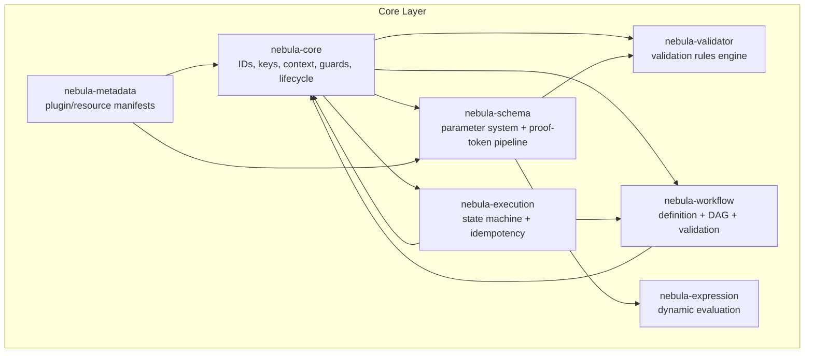
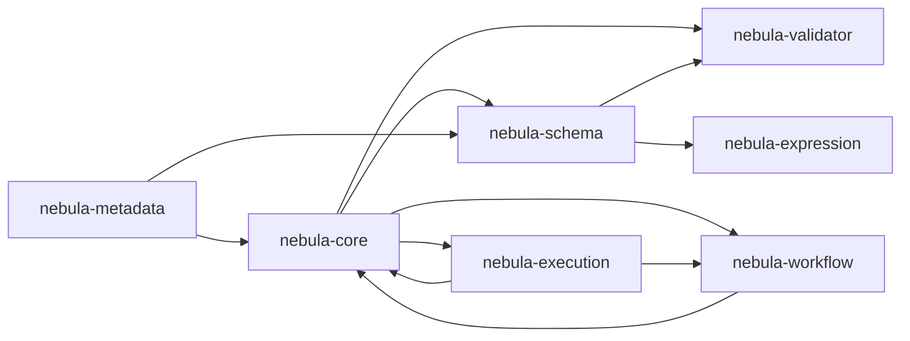
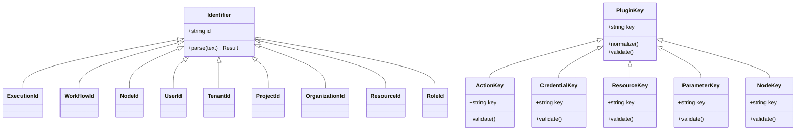
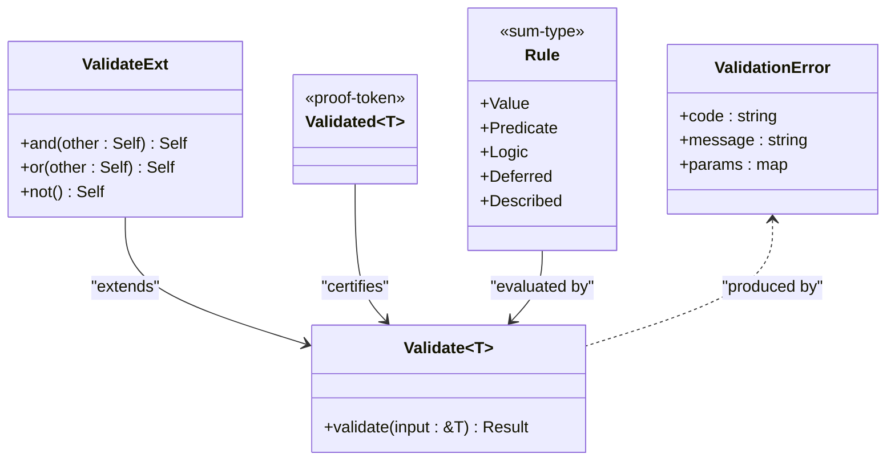
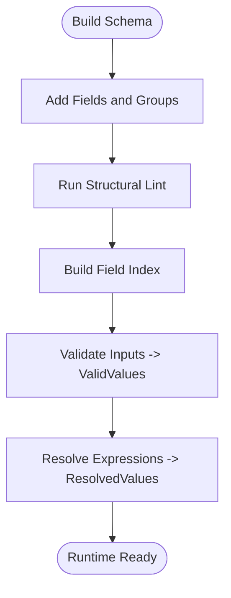
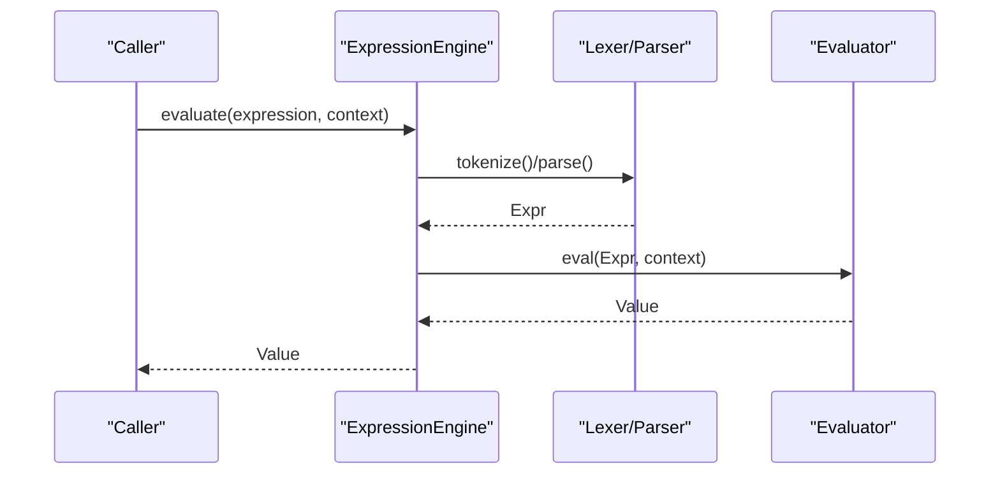
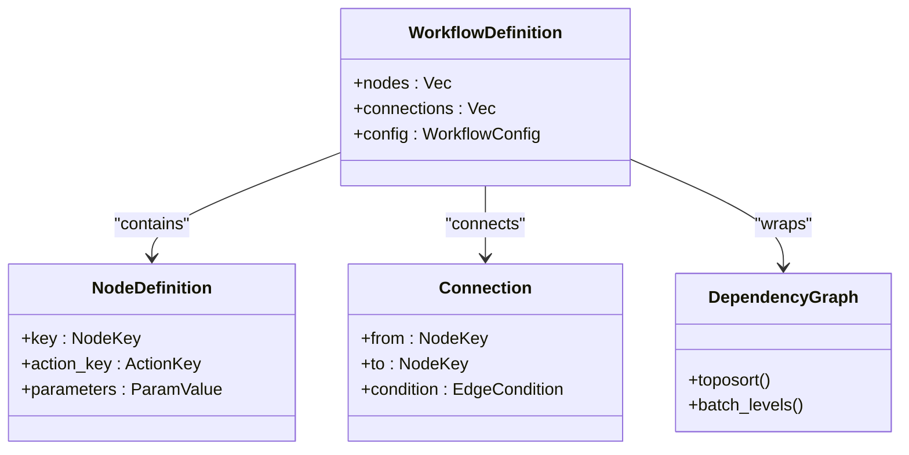
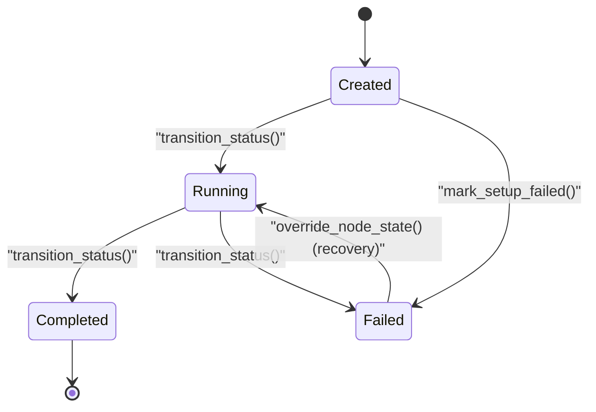
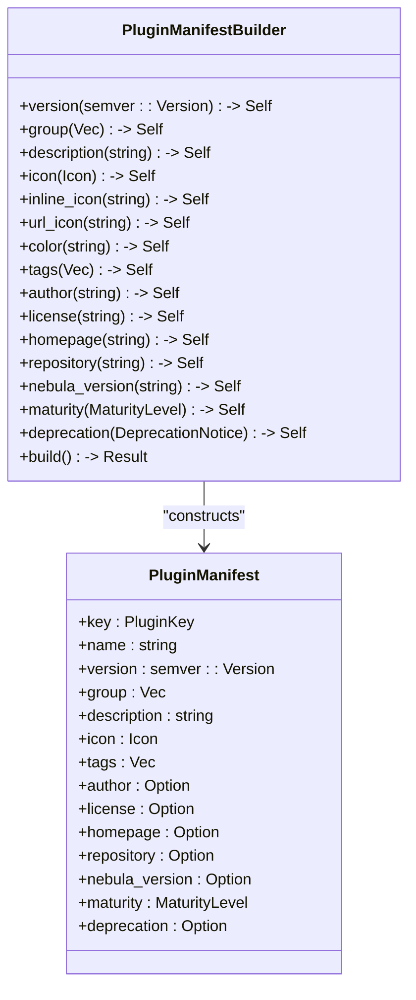
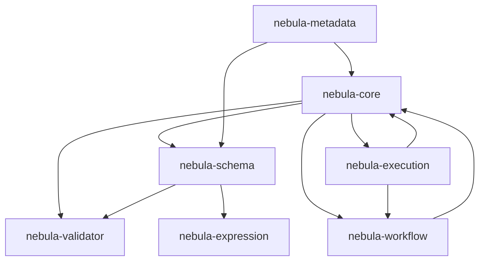

# Core Layer

<cite>
**Referenced Files in This Document**
- [Cargo.toml](file://crates/core/Cargo.toml)
- [lib.rs](file://crates/core/src/lib.rs)
- [mod.rs](file://crates/core/src/id/mod.rs)
- [keys.rs](file://crates/core/src/keys.rs)
- [Cargo.toml](file://crates/validator/Cargo.toml)
- [lib.rs](file://crates/validator/src/lib.rs)
- [mod.rs](file://crates/validator/src/foundation/mod.rs)
- [Cargo.toml](file://crates/schema/Cargo.toml)
- [lib.rs](file://crates/schema/src/lib.rs)
- [schema.rs](file://crates/schema/src/schema.rs)
- [Cargo.toml](file://crates/expression/Cargo.toml)
- [lib.rs](file://crates/expression/src/lib.rs)
- [engine.rs](file://crates/expression/src/engine.rs)
- [Cargo.toml](file://crates/workflow/Cargo.toml)
- [lib.rs](file://crates/workflow/src/lib.rs)
- [Cargo.toml](file://crates/execution/Cargo.toml)
- [lib.rs](file://crates/execution/src/lib.rs)
- [state.rs](file://crates/execution/src/state.rs)
- [Cargo.toml](file://crates/metadata/Cargo.toml)
- [lib.rs](file://crates/metadata/src/lib.rs)
- [manifest.rs](file://crates/metadata/src/manifest.rs)
</cite>

## Table of Contents
1. [Introduction](#introduction)
2. [Project Structure](#project-structure)
3. [Core Components](#core-components)
4. [Architecture Overview](#architecture-overview)
5. [Detailed Component Analysis](#detailed-component-analysis)
6. [Dependency Analysis](#dependency-analysis)
7. [Performance Considerations](#performance-considerations)
8. [Troubleshooting Guide](#troubleshooting-guide)
9. [Conclusion](#conclusion)

## Introduction
Nebula’s Core Layer is the foundational set of crates that define the shared primitives, typing, and contracts enabling higher layers to build robust integrations. It provides:
- Strongly typed identifiers and domain keys
- A validation framework with typed errors
- A schema system for parameter definition and proof-token pipelines
- An expression language for dynamic evaluation
- A workflow definition system and execution state machine
- A metadata system for plugin and resource descriptions

These crates are designed to be minimal, stable, and reusable across the entire platform, ensuring consistent behavior and strong guarantees for downstream systems.

## Project Structure
The Core Layer comprises six crates, each focused on a distinct foundational capability. They are organized by functional responsibility and layered to minimize coupling.

**Diagram sources**
- [Cargo.toml:14-22](file://crates/core/Cargo.toml#L14-L22)
- [Cargo.toml:26-32](file://crates/validator/Cargo.toml#L26-L32)
- [Cargo.toml:18-28](file://crates/schema/Cargo.toml#L18-L28)
- [Cargo.toml:15-21](file://crates/expression/Cargo.toml#L15-L21)
- [Cargo.toml:14-22](file://crates/workflow/Cargo.toml#L14-L22)
- [Cargo.toml:14-21](file://crates/execution/Cargo.toml#L14-L21)
- [Cargo.toml:14-20](file://crates/metadata/Cargo.toml#L14-L20)

**Section sources**
- [Cargo.toml:14-22](file://crates/core/Cargo.toml#L14-L22)
- [Cargo.toml:26-32](file://crates/validator/Cargo.toml#L26-L32)
- [Cargo.toml:18-28](file://crates/schema/Cargo.toml#L18-L28)
- [Cargo.toml:15-21](file://crates/expression/Cargo.toml#L15-L21)
- [Cargo.toml:14-22](file://crates/workflow/Cargo.toml#L14-L22)
- [Cargo.toml:14-21](file://crates/execution/Cargo.toml#L14-L21)
- [Cargo.toml:14-20](file://crates/metadata/Cargo.toml#L14-L20)

## Core Components
This section introduces each core crate and its primary responsibilities.

- nebula-core
  - Provides opaque, prefixed ULID identifiers and normalized domain keys used across the system.
  - Exposes context, guards, lifecycle, and observability primitives.
  - Re-exports a common prelude for downstream crates.

- nebula-validator
  - A typed validation framework with combinators and proof tokens.
  - Supports both programmatic validators and declarative rules.

- nebula-schema
  - Defines parameter schemas, validates inputs, and drives a proof-token pipeline.
  - Integrates with the expression engine for dynamic resolution.

- nebula-expression
  - Evaluates expressions and templates against runtime contexts.
  - Offers caching, policy controls, and extensible built-in functions.

- nebula-workflow
  - Describes workflow definitions, nodes, connections, and validation.
  - Provides a builder and a DAG abstraction.

- nebula-execution
  - Models execution state, transitions, idempotency, and planning.
  - Encodes CAS semantics via optimistic concurrency versioning.

- nebula-metadata
  - Defines shared metadata shapes and plugin manifests.
  - Supports maturity levels, deprecation notices, and icon representations.

**Section sources**
- [lib.rs:1-111](file://crates/core/src/lib.rs#L1-L111)
- [lib.rs:1-95](file://crates/validator/src/lib.rs#L1-L95)
- [lib.rs:1-235](file://crates/schema/src/lib.rs#L1-L235)
- [lib.rs:1-165](file://crates/expression/src/lib.rs#L1-L165)
- [lib.rs:1-54](file://crates/workflow/src/lib.rs#L1-L54)
- [lib.rs:1-63](file://crates/execution/src/lib.rs#L1-L63)
- [lib.rs:1-31](file://crates/metadata/src/lib.rs#L1-L31)

## Architecture Overview
The Core Layer establishes a layered architecture where each crate encapsulates a specific concern and exposes a focused API surface. Dependencies flow outward from core to specialized domains, ensuring low coupling and high cohesion.

**Diagram sources**
- [Cargo.toml:14-22](file://crates/core/Cargo.toml#L14-L22)
- [Cargo.toml:26-32](file://crates/validator/Cargo.toml#L26-L32)
- [Cargo.toml:18-28](file://crates/schema/Cargo.toml#L18-L28)
- [Cargo.toml:15-21](file://crates/expression/Cargo.toml#L15-L21)
- [Cargo.toml:14-22](file://crates/workflow/Cargo.toml#L14-L22)
- [Cargo.toml:14-21](file://crates/execution/Cargo.toml#L14-L21)
- [Cargo.toml:14-20](file://crates/metadata/Cargo.toml#L14-L20)

## Detailed Component Analysis

### ID Management and Domain Keys (nebula-core)
- Prefixed ULIDs
  - All identifiers are prefixed ULIDs (e.g., execution, workflow, node), ensuring global uniqueness and sortable timestamps.
  - Parsing and error types are re-exported for consistent handling.
- Domain Keys
  - Normalized string keys for plugins, actions, credentials, resources, parameters, and nodes.
  - Compile-time validation via macros ensures correctness at build time.

**Diagram sources**
- [mod.rs:1-11](file://crates/core/src/id/mod.rs#L1-L11)
- [keys.rs:1-165](file://crates/core/src/keys.rs#L1-L165)

Practical example paths:
- [Prefixed ULID identifiers:1-11](file://crates/core/src/id/mod.rs#L1-L11)
- [Normalized domain keys and compile-time validation macros:1-165](file://crates/core/src/keys.rs#L1-L165)

**Section sources**
- [mod.rs:1-11](file://crates/core/src/id/mod.rs#L1-L11)
- [keys.rs:1-165](file://crates/core/src/keys.rs#L1-L165)

### Validation Framework (nebula-validator)
- Programmatic validators
  - Trait-based validation with extension methods and combinators (and/or/not).
  - Strongly typed errors with structured diagnostics.
- Declarative rules
  - Unified rule model supporting value, predicate, logic, and deferred forms.
  - Execution modes control which categories run (static-only, deferred, full).

**Diagram sources**
- [mod.rs:1-176](file://crates/validator/src/foundation/mod.rs#L1-L176)
- [lib.rs:1-95](file://crates/validator/src/lib.rs#L1-L95)

Practical example paths:
- [Foundation traits and combinators:1-176](file://crates/validator/src/foundation/mod.rs#L1-L176)
- [Crate overview and rule model:1-95](file://crates/validator/src/lib.rs#L1-L95)

**Section sources**
- [mod.rs:1-176](file://crates/validator/src/foundation/mod.rs#L1-L176)
- [lib.rs:1-95](file://crates/validator/src/lib.rs#L1-L95)

### Schema-Based Parameter System (nebula-schema)
- Schema builder and validation
  - Fluent builder constructs typed fields and groups.
  - Structural linting and index-building for fast lookups.
- Proof-token pipeline
  - Validates inputs to produce a ValidSchema and ValidValues.
  - Resolves expressions to produce ResolvedValues for runtime usage.
- Integration with validator and expression
  - Uses nebula-validator for rule evaluation.
  - Uses nebula-expression for dynamic resolution.

**Diagram sources**
- [schema.rs:240-363](file://crates/schema/src/schema.rs#L240-L363)

Practical example paths:
- [Schema builder and index building:240-363](file://crates/schema/src/schema.rs#L240-L363)
- [Crate overview and exports:1-235](file://crates/schema/src/lib.rs#L1-L235)

**Section sources**
- [schema.rs:240-363](file://crates/schema/src/schema.rs#L240-L363)
- [lib.rs:1-235](file://crates/schema/src/lib.rs#L1-L235)

### Expression Language (nebula-expression)
- Engine and evaluation
  - Parses expressions and templates, evaluates against an EvaluationContext.
  - Optional caching for parsed ASTs and templates.
- Policy and safety
  - EvaluationPolicy sets budgets and recursion limits.
  - Function allowlists restrict built-in usage.
- Extensibility
  - BuiltinRegistry supports registering custom functions.

**Diagram sources**
- [engine.rs:104-321](file://crates/expression/src/engine.rs#L104-L321)

Practical example paths:
- [Expression engine with caching and policies:104-321](file://crates/expression/src/engine.rs#L104-L321)
- [Crate overview and entry points:1-165](file://crates/expression/src/lib.rs#L1-L165)

**Section sources**
- [engine.rs:104-321](file://crates/expression/src/engine.rs#L104-L321)
- [lib.rs:1-165](file://crates/expression/src/lib.rs#L1-L165)

### Workflow Definition DSL (nebula-workflow)
- Definition types
  - WorkflowDefinition, NodeDefinition, ParamValue, Connection, EdgeCondition.
- Graph and validation
  - DependencyGraph with topological sorting and batching.
  - validate_workflow ensures structural soundness at activation time.

**Diagram sources**
- [lib.rs:40-54](file://crates/workflow/src/lib.rs#L40-L54)

Practical example paths:
- [Public API and types:40-54](file://crates/workflow/src/lib.rs#L40-L54)

**Section sources**
- [lib.rs:40-54](file://crates/workflow/src/lib.rs#L40-L54)

### Execution State Machine (nebula-execution)
- State modeling
  - ExecutionState and NodeExecutionState track progress, attempts, and timestamps.
- Transitions and CAS
  - validate_execution_transition and validate_node_transition enforce valid state changes.
  - Optimistic concurrency via version bumping ensures consistency.
- Idempotency
  - IdempotencyKey encodes execution_id, node_id, and attempt for deduplication.

**Diagram sources**
- [state.rs:425-440](file://crates/execution/src/state.rs#L425-L440)

Practical example paths:
- [Node and execution state transitions:44-118](file://crates/execution/src/state.rs#L44-L118)
- [ExecutionState transition and idempotency key generation:171-258](file://crates/execution/src/state.rs#L171-L258)

**Section sources**
- [state.rs:44-118](file://crates/execution/src/state.rs#L44-L118)
- [state.rs:171-258](file://crates/execution/src/state.rs#L171-L258)
- [state.rs:425-440](file://crates/execution/src/state.rs#L425-L440)

### Metadata System (nebula-metadata)
- Plugin manifests
  - PluginManifest describes plugin containers with key, version, grouping, and metadata.
  - Builder enforces normalization and validation, including deprecation forcing maturity.
- Shared metadata shapes
  - BaseMetadata, MaturityLevel, DeprecationNotice, Icon.

**Diagram sources**
- [manifest.rs:77-115](file://crates/metadata/src/manifest.rs#L77-L115)
- [manifest.rs:231-247](file://crates/metadata/src/manifest.rs#L231-L247)

Practical example paths:
- [Plugin manifest and builder:77-115](file://crates/metadata/src/manifest.rs#L77-L115)
- [Builder API and validation:231-247](file://crates/metadata/src/manifest.rs#L231-L247)

**Section sources**
- [manifest.rs:77-115](file://crates/metadata/src/manifest.rs#L77-L115)
- [manifest.rs:231-247](file://crates/metadata/src/manifest.rs#L231-L247)

## Dependency Analysis
The Core Layer exhibits a clean dependency graph with nebula-core at the center, feeding specialized domains outward.

**Diagram sources**
- [Cargo.toml:14-22](file://crates/core/Cargo.toml#L14-L22)
- [Cargo.toml:26-32](file://crates/validator/Cargo.toml#L26-L32)
- [Cargo.toml:18-28](file://crates/schema/Cargo.toml#L18-L28)
- [Cargo.toml:15-21](file://crates/expression/Cargo.toml#L15-L21)
- [Cargo.toml:14-22](file://crates/workflow/Cargo.toml#L14-L22)
- [Cargo.toml:14-21](file://crates/execution/Cargo.toml#L14-L21)
- [Cargo.toml:14-20](file://crates/metadata/Cargo.toml#L14-L20)

**Section sources**
- [Cargo.toml:14-22](file://crates/core/Cargo.toml#L14-L22)
- [Cargo.toml:26-32](file://crates/validator/Cargo.toml#L26-L32)
- [Cargo.toml:18-28](file://crates/schema/Cargo.toml#L18-L28)
- [Cargo.toml:15-21](file://crates/expression/Cargo.toml#L15-L21)
- [Cargo.toml:14-22](file://crates/workflow/Cargo.toml#L14-L22)
- [Cargo.toml:14-21](file://crates/execution/Cargo.toml#L14-L21)
- [Cargo.toml:14-20](file://crates/metadata/Cargo.toml#L14-L20)

## Performance Considerations
- Caching in expression evaluation
  - ExpressionEngine supports optional LRU caches for parsed expressions and templates to reduce repeated parsing overhead.
  - Cache statistics snapshots enable observability into hit/miss ratios.
- Indexing in schema
  - Flat path indexing and schema flags enable O(1) field lookup and runtime optimizations for expression and loader usage detection.
- Serialization and compactness
  - Serde derives and compact representations minimize memory footprint and improve throughput.
- Evaluation policies
  - EvaluationPolicy allows tuning recursion depth and step budgets to prevent resource exhaustion.

[No sources needed since this section provides general guidance]

## Troubleshooting Guide
- Validation errors
  - Use structured ValidationError payloads to diagnose rule failures and field mismatches.
  - Combine validator combinators to isolate failing constraints.
- Schema build failures
  - Review ValidationReport from SchemaBuilder::build for structural issues and index limits.
- Expression evaluation issues
  - Enable function allowlists and policies to constrain unsafe or expensive operations.
  - Inspect cache overview to detect hotspots or misconfiguration.
- Execution state inconsistencies
  - Ensure transitions use validated helpers to maintain optimistic concurrency via version bumps.
  - Verify idempotency keys incorporate attempt counts to avoid replay collisions.

**Section sources**
- [mod.rs:1-176](file://crates/validator/src/foundation/mod.rs#L1-L176)
- [schema.rs:331-362](file://crates/schema/src/schema.rs#L331-L362)
- [engine.rs:380-440](file://crates/expression/src/engine.rs#L380-L440)
- [state.rs:323-336](file://crates/execution/src/state.rs#L323-L336)

## Conclusion
Nebula’s Core Layer delivers a cohesive set of primitives that enable reliable, type-safe, and observable integration development. By centralizing ID management, validation, schema-driven parameterization, expression evaluation, workflow modeling, execution semantics, and metadata, it provides a solid foundation for higher layers. The emphasis on proof tokens, CAS semantics, and structured error handling ensures predictable behavior and strong guarantees across the system.