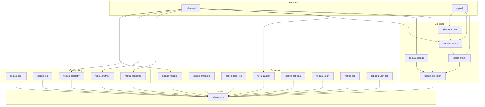
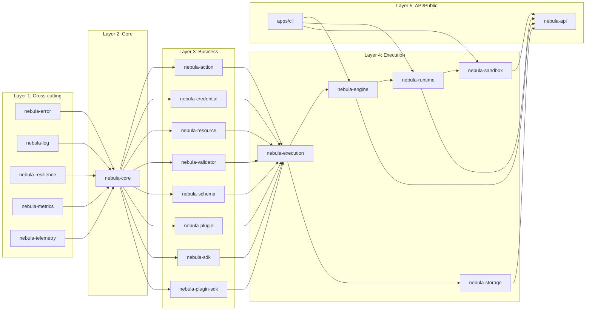
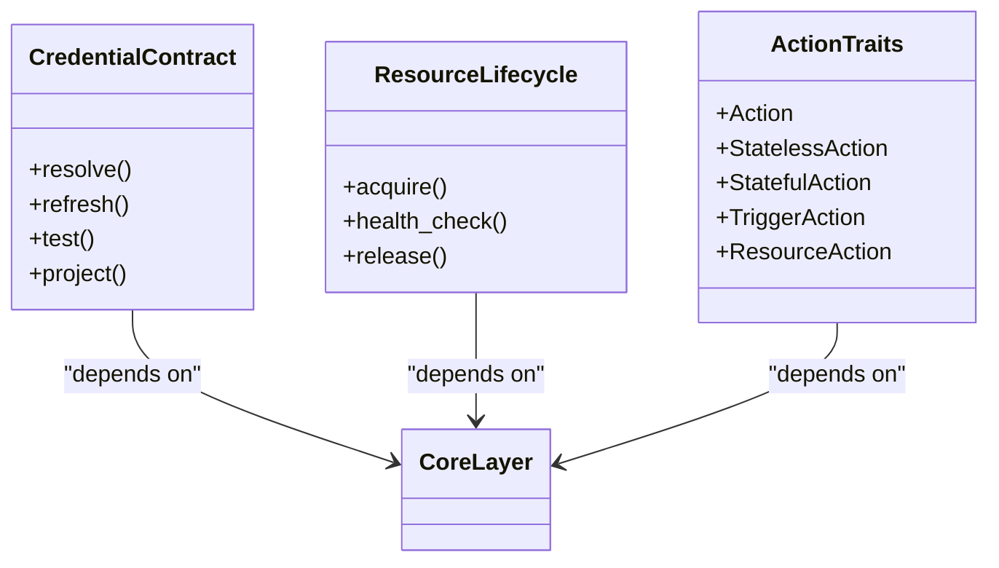
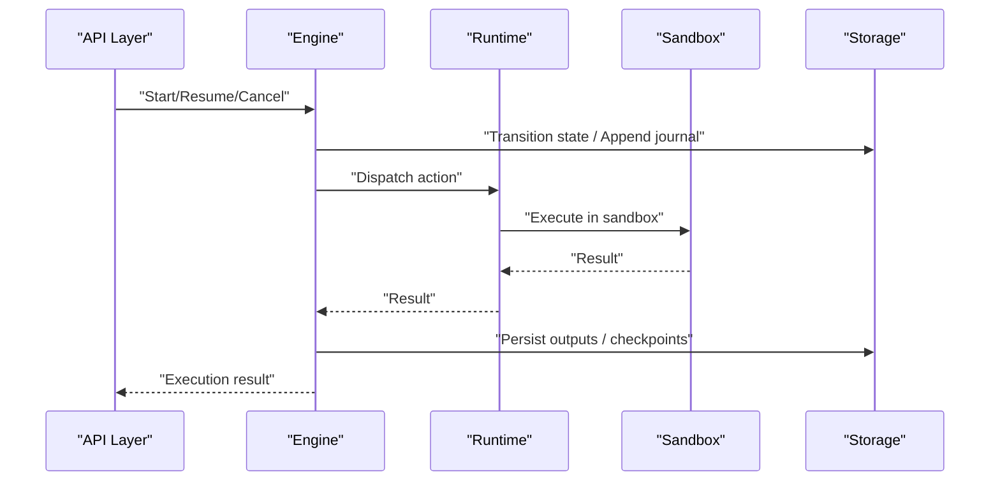
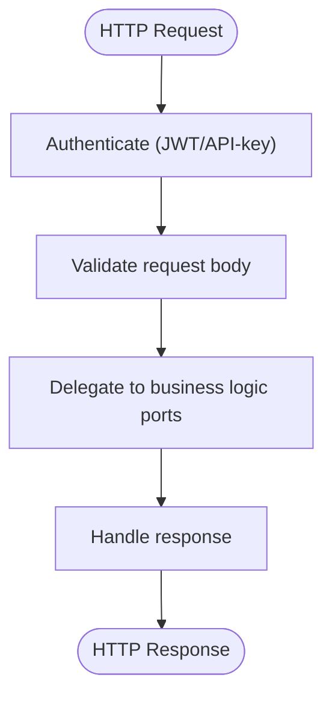
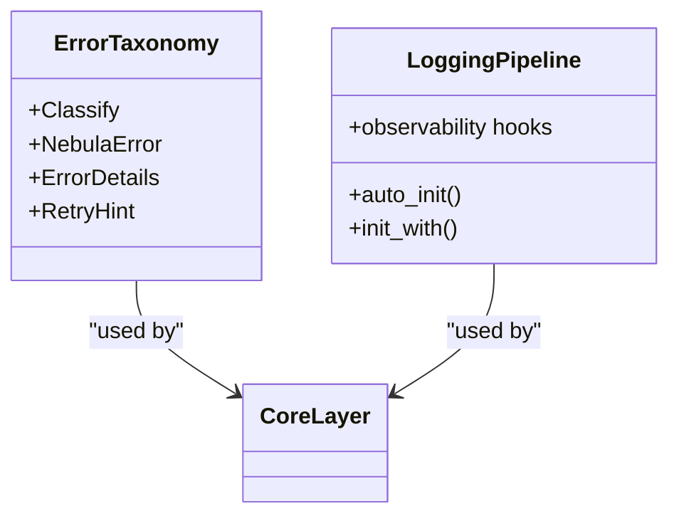
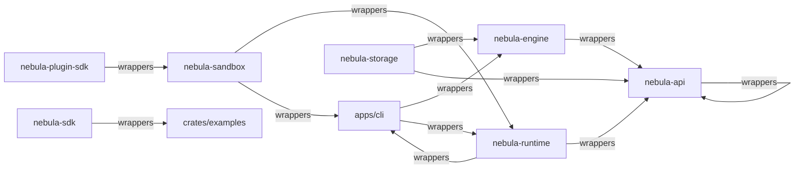

# Layered Architecture Design

<cite>
**Referenced Files in This Document**
- [Cargo.toml](file://Cargo.toml)
- [deny.toml](file://deny.toml)
- [crates/core/Cargo.toml](file://crates/core/Cargo.toml)
- [crates/core/src/lib.rs](file://crates/core/src/lib.rs)
- [crates/execution/Cargo.toml](file://crates/execution/Cargo.toml)
- [crates/execution/src/lib.rs](file://crates/execution/src/lib.rs)
- [crates/api/Cargo.toml](file://crates/api/Cargo.toml)
- [crates/api/src/lib.rs](file://crates/api/src/lib.rs)
- [crates/error/Cargo.toml](file://crates/error/Cargo.toml)
- [crates/error/src/lib.rs](file://crates/error/src/lib.rs)
- [crates/log/Cargo.toml](file://crates/log/Cargo.toml)
- [crates/log/src/lib.rs](file://crates/log/src/lib.rs)
- [crates/credential/src/lib.rs](file://crates/credential/src/lib.rs)
- [crates/resource/src/lib.rs](file://crates/resource/src/lib.rs)
- [crates/action/src/lib.rs](file://crates/action/src/lib.rs)
- [crates/engine/src/lib.rs](file://crates/engine/src/lib.rs)
- [crates/runtime/src/lib.rs](file://crates/runtime/src/lib.rs)
- [crates/storage/src/lib.rs](file://crates/storage/src/lib.rs)
</cite>

## Table of Contents
1. [Introduction](#introduction)
2. [Project Structure](#project-structure)
3. [Core Components](#core-components)
4. [Architecture Overview](#architecture-overview)
5. [Detailed Component Analysis](#detailed-component-analysis)
6. [Dependency Analysis](#dependency-analysis)
7. [Performance Considerations](#performance-considerations)
8. [Troubleshooting Guide](#troubleshooting-guide)
9. [Conclusion](#conclusion)
10. [Appendices](#appendices)

## Introduction
This document describes Nebula’s seven-layered architecture and how it enforces one-way dependencies across layers. The system is organized into:
- Core (foundation types and contracts)
- Business (credential management, resource pooling, action framework)
- Execution (engine orchestration, runtime scheduling, storage persistence)
- API/Public (REST server, integration SDK)
- Cross-cutting (error handling, resilience, logging, observability)

We explain how cargo deny configuration enforces layer discipline, how the Rust ecosystem and Tokio/Axum/SQLx power the system, and how the modular design supports embedding and extension while preserving separation of concerns.

## Project Structure
Nebula is a multi-crate workspace centered on a layered design. The workspace members define the seven layers and their relationships. The top-level Cargo.toml lists all crates, and deny.toml enforces one-way dependency constraints.

**Diagram sources**
- [Cargo.toml:1-39](file://Cargo.toml#L1-L39)
- [deny.toml:51-86](file://deny.toml#L51-L86)

**Section sources**
- [Cargo.toml:1-39](file://Cargo.toml#L1-L39)
- [deny.toml:1-141](file://deny.toml#L1-L141)

## Core Components
This section outlines the seven layers and their responsibilities, with pointers to representative crates and their roles.

- Core (Foundation): Provides shared identifiers, keys, scopes, context, lifecycle, and error primitives. It is the lowest layer and must not depend on any other layer.
  - Representative: [crates/core/src/lib.rs:1-111](file://crates/core/src/lib.rs#L1-L111)
- Business: Credential management, resource pooling, and action framework. These crates depend on Core and may depend on Cross-cutting crates.
  - Representative: [crates/credential/src/lib.rs:1-175](file://crates/credential/src/lib.rs#L1-L175), [crates/resource/src/lib.rs:1-108](file://crates/resource/src/lib.rs#L1-L108), [crates/action/src/lib.rs:1-152](file://crates/action/src/lib.rs#L1-L152)
- Execution: Engine orchestration, runtime scheduling, and storage persistence. Execution depends on Core and Business; it may depend on Cross-cutting.
  - Representative: [crates/engine/src/lib.rs:1-79](file://crates/engine/src/lib.rs#L1-L79), [crates/runtime/src/lib.rs:1-50](file://crates/runtime/src/lib.rs#L1-L50), [crates/storage/src/lib.rs:1-105](file://crates/storage/src/lib.rs#L1-L105), [crates/execution/src/lib.rs:1-63](file://crates/execution/src/lib.rs#L1-L63)
- API/Public: REST server and integration SDK. Depends on Execution and Cross-cutting; must not depend on lower-level crates.
  - Representative: [crates/api/src/lib.rs:1-60](file://crates/api/src/lib.rs#L1-L60)
- Cross-cutting: Error handling, resilience, logging, and observability. These are foundational services that do not depend on higher layers.
  - Representative: [crates/error/src/lib.rs:1-72](file://crates/error/src/lib.rs#L1-L72), [crates/log/src/lib.rs:1-280](file://crates/log/src/lib.rs#L1-L280)

Technology stack highlights:
- Rust ecosystem and toolchain: workspace-wide dependency management and lint policies.
- Tokio async runtime: pervasive across crates for concurrency and scheduling.
- Axum web framework: used by the API layer for HTTP routing and middleware.
- SQLx database access: used by storage layer for PostgreSQL and SQLite backends.

**Section sources**
- [crates/core/src/lib.rs:1-111](file://crates/core/src/lib.rs#L1-L111)
- [crates/credential/src/lib.rs:1-175](file://crates/credential/src/lib.rs#L1-L175)
- [crates/resource/src/lib.rs:1-108](file://crates/resource/src/lib.rs#L1-L108)
- [crates/action/src/lib.rs:1-152](file://crates/action/src/lib.rs#L1-L152)
- [crates/engine/src/lib.rs:1-79](file://crates/engine/src/lib.rs#L1-L79)
- [crates/runtime/src/lib.rs:1-50](file://crates/runtime/src/lib.rs#L1-L50)
- [crates/storage/src/lib.rs:1-105](file://crates/storage/src/lib.rs#L1-L105)
- [crates/execution/src/lib.rs:1-63](file://crates/execution/src/lib.rs#L1-L63)
- [crates/api/src/lib.rs:1-60](file://crates/api/src/lib.rs#L1-L60)
- [crates/error/src/lib.rs:1-72](file://crates/error/src/lib.rs#L1-L72)
- [crates/log/src/lib.rs:1-280](file://crates/log/src/lib.rs#L1-L280)
- [Cargo.toml:55-136](file://Cargo.toml#L55-L136)

## Architecture Overview
The seven-layer architecture enforces one-way dependencies: each layer may only depend on layers beneath it. The deny.toml configuration codifies this rule across the workspace.

**Diagram sources**
- [deny.toml:51-86](file://deny.toml#L51-L86)
- [Cargo.toml:1-39](file://Cargo.toml#L1-L39)

**Section sources**
- [deny.toml:51-86](file://deny.toml#L51-L86)
- [Cargo.toml:1-39](file://Cargo.toml#L1-L39)

## Detailed Component Analysis

### Core Layer
- Purpose: Shared vocabulary and contracts for identifiers, keys, scopes, context, lifecycle, and error primitives.
- Key responsibilities:
  - Define opaque identifiers and normalized keys.
  - Provide context and capability injection traits.
  - Offer lifecycle primitives and observability identity types.
- Examples from codebase:
  - Identifier and key types: [crates/core/src/lib.rs:48-77](file://crates/core/src/lib.rs#L48-L77)
  - Context and capability traits: [crates/core/src/lib.rs:64-76](file://crates/core/src/lib.rs#L64-L76)
  - Error primitives and prelude exports: [crates/core/src/lib.rs:69-110](file://crates/core/src/lib.rs#L69-L110)

**Section sources**
- [crates/core/src/lib.rs:1-111](file://crates/core/src/lib.rs#L1-L111)

### Business Layer
- Credential Management:
  - Role: Credential contract, encryption-at-rest, rotation, refresh, and accessor interfaces.
  - Examples: [crates/credential/src/lib.rs:1-175](file://crates/credential/src/lib.rs#L1-L175)
- Resource Pooling:
  - Role: Engine-owned resource lifecycle, bulkhead pools, and topology abstractions.
  - Examples: [crates/resource/src/lib.rs:1-108](file://crates/resource/src/lib.rs#L1-L108)
- Action Framework:
  - Role: Action trait family, metadata, ports/adapters, and result types.
  - Examples: [crates/action/src/lib.rs:1-152](file://crates/action/src/lib.rs#L1-L152)

**Diagram sources**
- [crates/credential/src/lib.rs:1-175](file://crates/credential/src/lib.rs#L1-L175)
- [crates/resource/src/lib.rs:1-108](file://crates/resource/src/lib.rs#L1-L108)
- [crates/action/src/lib.rs:1-152](file://crates/action/src/lib.rs#L1-L152)

**Section sources**
- [crates/credential/src/lib.rs:1-175](file://crates/credential/src/lib.rs#L1-L175)
- [crates/resource/src/lib.rs:1-108](file://crates/resource/src/lib.rs#L1-L108)
- [crates/action/src/lib.rs:1-152](file://crates/action/src/lib.rs#L1-L152)

### Execution Layer
- Engine Orchestration:
  - Role: Build execution plans, manage state transitions, and dispatch control commands.
  - Examples: [crates/engine/src/lib.rs:1-79](file://crates/engine/src/lib.rs#L1-L79)
- Runtime Scheduling:
  - Role: Action dispatch, data passing policies, and sandbox integration.
  - Examples: [crates/runtime/src/lib.rs:1-50](file://crates/runtime/src/lib.rs#L1-L50)
- Storage Persistence:
  - Role: Repositories for execution/workflow persistence and control queue.
  - Examples: [crates/storage/src/lib.rs:1-105](file://crates/storage/src/lib.rs#L1-L105)
- Execution State Machine:
  - Role: Execution state, journal, idempotency, and planning types.
  - Examples: [crates/execution/src/lib.rs:1-63](file://crates/execution/src/lib.rs#L1-L63)

**Diagram sources**
- [crates/engine/src/lib.rs:1-79](file://crates/engine/src/lib.rs#L1-L79)
- [crates/runtime/src/lib.rs:1-50](file://crates/runtime/src/lib.rs#L1-L50)
- [crates/storage/src/lib.rs:1-105](file://crates/storage/src/lib.rs#L1-L105)
- [crates/api/src/lib.rs:1-60](file://crates/api/src/lib.rs#L1-L60)

**Section sources**
- [crates/engine/src/lib.rs:1-79](file://crates/engine/src/lib.rs#L1-L79)
- [crates/runtime/src/lib.rs:1-50](file://crates/runtime/src/lib.rs#L1-L50)
- [crates/storage/src/lib.rs:1-105](file://crates/storage/src/lib.rs#L1-L105)
- [crates/execution/src/lib.rs:1-63](file://crates/execution/src/lib.rs#L1-L63)

### API/Public Layer
- REST Server:
  - Role: HTTP entry point, authentication, middleware, and error mapping to ProblemDetails.
  - Examples: [crates/api/src/lib.rs:1-60](file://crates/api/src/lib.rs#L1-L60)
- Integration SDK:
  - Role: External integration surface; only examples may depend on it.
  - Examples: [crates/api/Cargo.toml:90-104](file://crates/api/Cargo.toml#L90-L104)

**Diagram sources**
- [crates/api/src/lib.rs:1-60](file://crates/api/src/lib.rs#L1-L60)

**Section sources**
- [crates/api/src/lib.rs:1-60](file://crates/api/src/lib.rs#L1-L60)
- [crates/api/Cargo.toml:90-104](file://crates/api/Cargo.toml#L90-L104)

### Cross-cutting Concerns
- Error Handling:
  - Role: Error taxonomy, classification, and structured retry hints.
  - Examples: [crates/error/src/lib.rs:1-72](file://crates/error/src/lib.rs#L1-L72)
- Logging and Observability:
  - Role: Structured logging pipeline, telemetry integrations, and runtime reload.
  - Examples: [crates/log/src/lib.rs:1-280](file://crates/log/src/lib.rs#L1-L280)

**Diagram sources**
- [crates/error/src/lib.rs:1-72](file://crates/error/src/lib.rs#L1-L72)
- [crates/log/src/lib.rs:1-280](file://crates/log/src/lib.rs#L1-L280)

**Section sources**
- [crates/error/src/lib.rs:1-72](file://crates/error/src/lib.rs#L1-L72)
- [crates/log/src/lib.rs:1-280](file://crates/log/src/lib.rs#L1-L280)

## Dependency Analysis
Layer dependencies are enforced by cargo deny configuration. The deny rules specify which crates may wrap or depend on others, ensuring upward dependencies are prohibited.

**Diagram sources**
- [deny.toml:51-86](file://deny.toml#L51-L86)

**Section sources**
- [deny.toml:51-86](file://deny.toml#L51-L86)

## Performance Considerations
- Asynchronous runtime: Tokio is configured with multi-threaded runtime and time features across crates to support high-throughput I/O and scheduling.
- HTTP stack: Axum with Tower middleware provides timeouts, compression, and load shedding for robust performance under load.
- Database access: SQLx is used for both SQLite and PostgreSQL backends; feature flags enable PostgreSQL-specific implementations.
- Logging and telemetry: Structured logging and optional OTLP/Sentry integrations enable efficient observability without compromising performance in production.

[No sources needed since this section provides general guidance]

## Troubleshooting Guide
- Error taxonomy and classification:
  - Use the error crate to classify transient vs permanent failures and attach structured retry hints.
  - References: [crates/error/src/lib.rs:1-72](file://crates/error/src/lib.rs#L1-L72)
- Logging initialization:
  - Use auto-init or explicit initialization to configure formats, writers, and telemetry integrations.
  - References: [crates/log/src/lib.rs:192-280](file://crates/log/src/lib.rs#L192-L280)
- API error mapping:
  - All errors are mapped to RFC 9457 ProblemDetails at the HTTP boundary.
  - References: [crates/api/src/lib.rs:31-39](file://crates/api/src/lib.rs#L31-L39)

**Section sources**
- [crates/error/src/lib.rs:1-72](file://crates/error/src/lib.rs#L1-L72)
- [crates/log/src/lib.rs:192-280](file://crates/log/src/lib.rs#L192-L280)
- [crates/api/src/lib.rs:31-39](file://crates/api/src/lib.rs#L31-L39)

## Conclusion
Nebula’s seven-layered architecture cleanly separates concerns across Core, Business, Execution, API/Public, and Cross-cutting layers. cargo deny enforces one-way dependencies, preventing upward coupling and preserving architectural integrity. The Rust ecosystem, Tokio, Axum, and SQLx provide a robust foundation for building scalable, observable, and resilient workflow automation systems. The modular design enables embedding and extension while maintaining strong separation of concerns.

[No sources needed since this section summarizes without analyzing specific files]

## Appendices
- Technology stack highlights:
  - Tokio async runtime: [Cargo.toml:57-63](file://Cargo.toml#L57-L63)
  - Axum web framework: [Cargo.toml:114](file://Cargo.toml#L114)
  - SQLx database access: [Cargo.toml:88-90](file://Cargo.toml#L88-L90)

**Section sources**
- [Cargo.toml:57-63](file://Cargo.toml#L57-L63)
- [Cargo.toml:114](file://Cargo.toml#L114)
- [Cargo.toml:88-90](file://Cargo.toml#L88-L90)