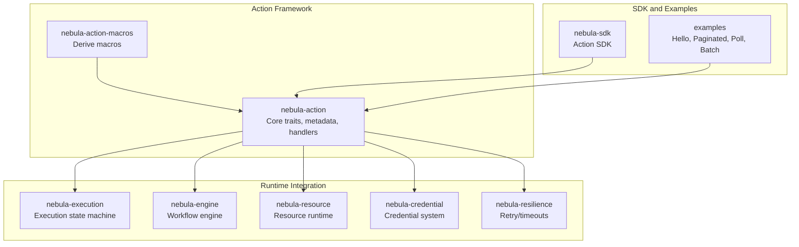
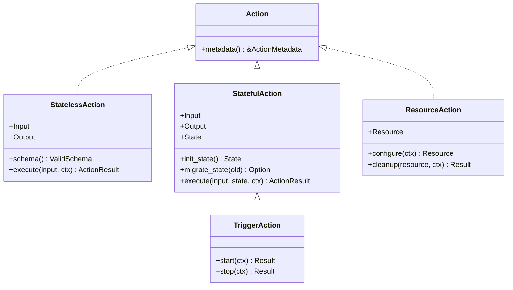
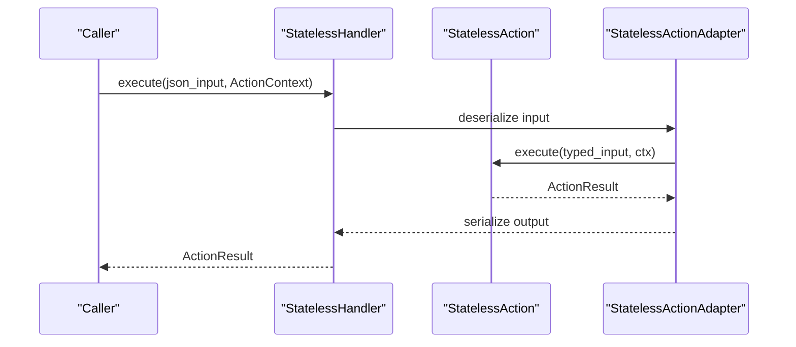
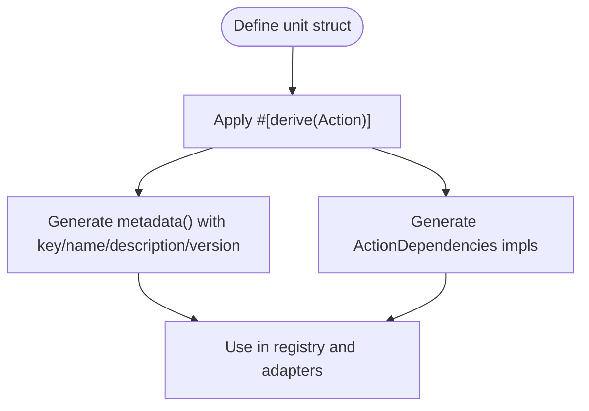
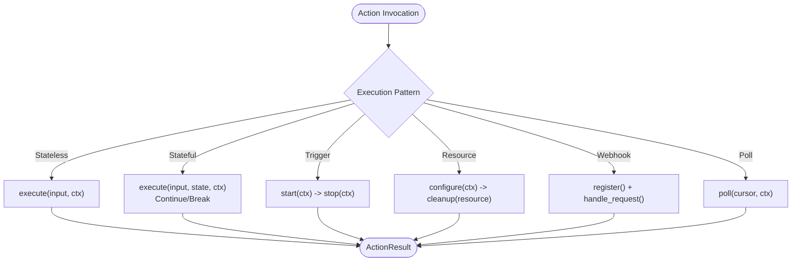
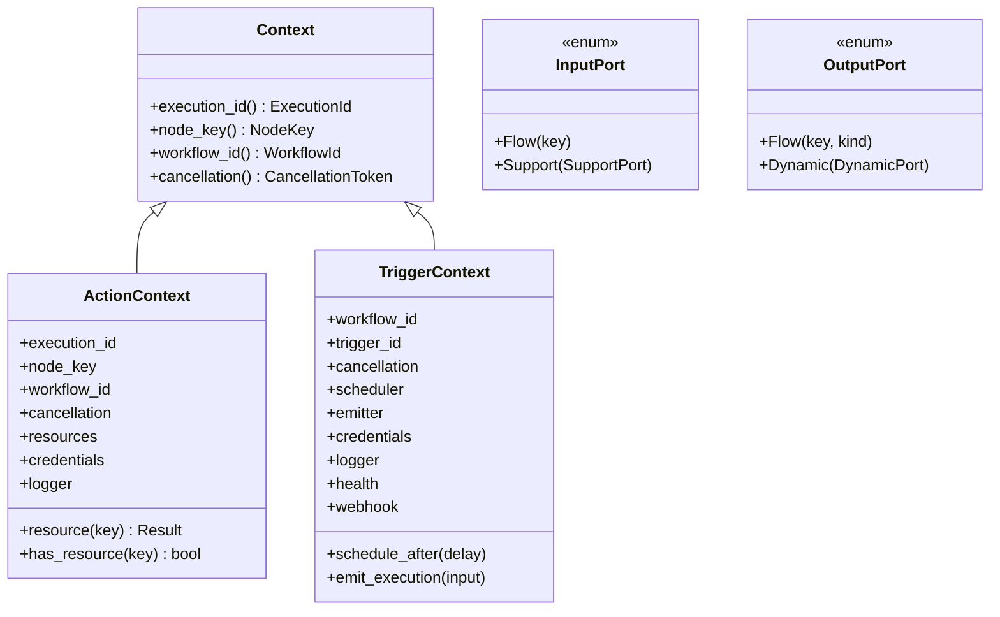
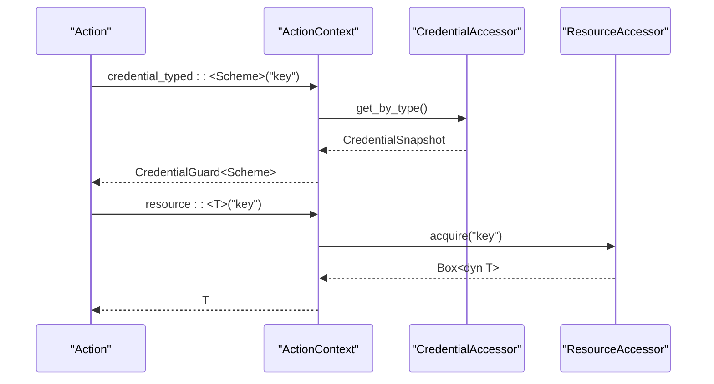
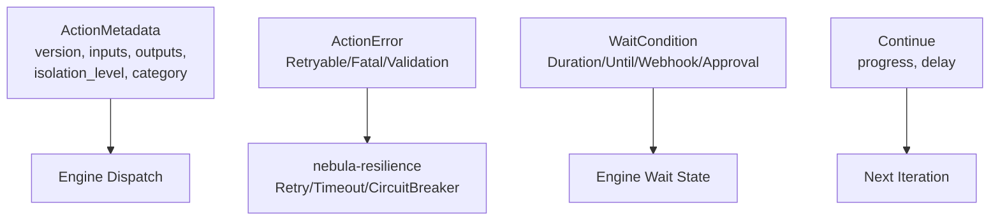
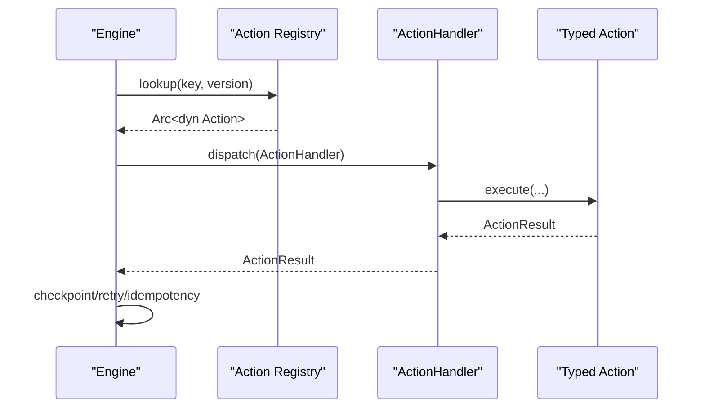
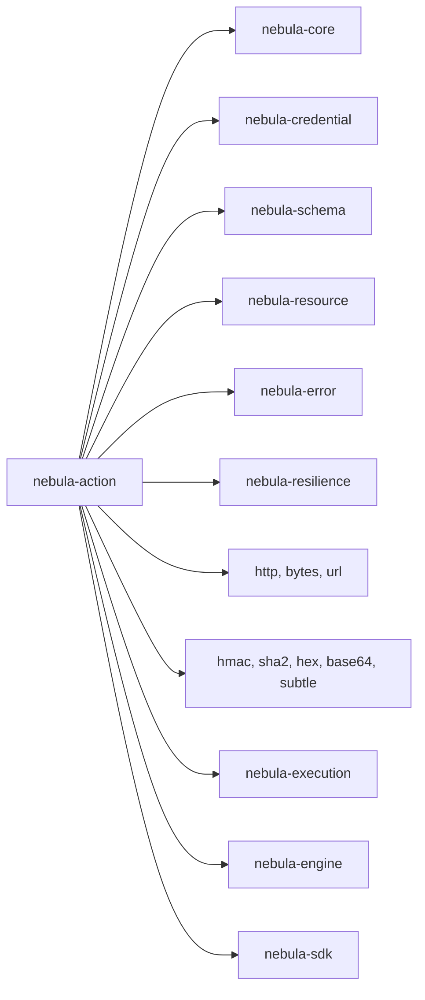

# Action Framework

<cite>
**Referenced Files in This Document**
- [Cargo.toml](file://crates/action/Cargo.toml)
- [README.md](file://crates/action/README.md)
- [nebula-action-types.md](file://crates/action/nebula-action-types.md)
- [lib.rs](file://crates/action/src/lib.rs)
- [action.rs](file://crates/action/src/action.rs)
- [stateless.rs](file://crates/action/src/stateless.rs)
- [stateful.rs](file://crates/action/src/stateful.rs)
- [trigger.rs](file://crates/action/src/trigger.rs)
- [resource.rs](file://crates/action/src/resource.rs)
- [context.rs](file://crates/action/src/context.rs)
- [result.rs](file://crates/action/src/result.rs)
- [port.rs](file://crates/action/src/port.rs)
- [metadata.rs](file://crates/action/src/metadata.rs)
- [error.rs](file://crates/action/src/error.rs)
- [lib.rs](file://crates/action/macros/src/lib.rs)
- [execution.rs](file://crates/execution/src/lib.rs)
- [engine.rs](file://crates/engine/src/engine.rs)
- [resource_runtime.rs](file://crates/resource/src/runtime/lib.rs)
- [credential.rs](file://crates/credential/src/lib.rs)
- [resilience.rs](file://crates/resilience/src/lib.rs)
- [sdk_action.rs](file://crates/sdk/src/action.rs)
- [hello_action.rs](file://examples/hello_action.rs)
- [paginated_users.rs](file://examples/paginated_users.rs)
- [poll_habr.rs](file://examples/poll_habr.rs)
- [batch_products.rs](file://examples/batch_products.rs)
- [validator_derive.rs](file://examples/validator_derive.rs)
- [validator_macro.rs](file://examples/validator_macro.rs)
</cite>

## Table of Contents
1. [Introduction](#introduction)
2. [Project Structure](#project-structure)
3. [Core Components](#core-components)
4. [Architecture Overview](#architecture-overview)
5. [Detailed Component Analysis](#detailed-component-analysis)
6. [Dependency Analysis](#dependency-analysis)
7. [Performance Considerations](#performance-considerations)
8. [Troubleshooting Guide](#troubleshooting-guide)
9. [Conclusion](#conclusion)
10. [Appendices](#appendices)

## Introduction
This document describes the Action Framework that powers Nebula's trait-based integration development system. It explains the 12 universal action types, the action trait family with derive macros, execution patterns (synchronous, asynchronous, polling, webhook-based), the action context system, port handling, result propagation, capability-based security, resource access patterns, configuration options, and integration with the execution layer and workflow engine. Concrete examples from the codebase illustrate implementation patterns, state management, and error handling.

## Project Structure
The Action Framework is implemented in the `nebula-action` crate with supporting crates for execution, engine, resource, credential, and resilience. The framework provides:
- Core traits for Stateless, Stateful, Trigger, and Resource actions
- DX specializations (Webhook, Poll, Batch, Paginated, Control)
- Action metadata, ports, and validation
- Context types and capabilities
- Result types and error taxonomy
- Derive macros for boilerplate reduction
- Handler adapters for JSON-level dispatch

**Diagram sources**
- [lib.rs:1-152](file://crates/action/src/lib.rs#L1-L152)
- [Cargo.toml:22-56](file://crates/action/Cargo.toml#L22-L56)

**Section sources**
- [Cargo.toml:1-68](file://crates/action/Cargo.toml#L1-L68)
- [README.md:1-118](file://crates/action/README.md#L1-L118)
- [lib.rs:1-152](file://crates/action/src/lib.rs#L1-L152)

## Core Components
- Action trait family: Action, StatelessAction, StatefulAction, TriggerAction, ResourceAction
- DX specializations: WebhookAction, PollAction, BatchAction, PaginatedAction, ControlAction
- Metadata and policy: ActionMetadata, ActionCategory, IsolationLevel
- Result and output: ActionResult, ActionOutput, TerminationReason
- Context and capabilities: ActionContext, TriggerContext, CredentialContextExt
- Ports: InputPort, OutputPort, SupportPort, DynamicPort
- Error taxonomy: ActionError, RetryHintCode, ValidationReason
- Derive macros: #[derive(Action)] for boilerplate reduction

**Section sources**
- [action.rs:1-21](file://crates/action/src/action.rs#L1-L21)
- [stateless.rs:1-648](file://crates/action/src/stateless.rs#L1-L648)
- [stateful.rs:1-895](file://crates/action/src/stateful.rs#L1-L895)
- [trigger.rs:1-608](file://crates/action/src/trigger.rs#L1-L608)
- [resource.rs:1-295](file://crates/action/src/resource.rs#L1-L295)
- [metadata.rs:1-621](file://crates/action/src/metadata.rs#L1-L621)
- [result.rs:1-1681](file://crates/action/src/result.rs#L1-L1681)
- [port.rs:1-512](file://crates/action/src/port.rs#L1-L512)
- [error.rs:1-973](file://crates/action/src/error.rs#L1-L973)
- [lib.rs:1-54](file://crates/action/macros/src/lib.rs#L1-L54)

## Architecture Overview
The Action Framework separates concerns between the action trait family (contract) and the runtime (execution policy). Actions declare behavior via traits; the engine dispatches handlers and manages execution lifecycle, checkpointing, retries, and idempotency. Capabilities are injected via contexts; resources are scoped to graph branches via ResourceAction.

**Diagram sources**
- [action.rs:1-21](file://crates/action/src/action.rs#L1-L21)
- [stateless.rs:68-100](file://crates/action/src/stateless.rs#L68-L100)
- [stateful.rs:35-75](file://crates/action/src/stateful.rs#L35-L75)
- [trigger.rs:58-64](file://crates/action/src/trigger.rs#L58-L64)
- [resource.rs:37-53](file://crates/action/src/resource.rs#L37-L53)

**Section sources**
- [README.md:12-118](file://crates/action/README.md#L12-L118)
- [nebula-action-types.md:14-208](file://crates/action/nebula-action-types.md#L14-L208)

## Detailed Component Analysis

### Action Trait Family and DX Specializations
- StatelessAction: Pure function Input → Output with JSON-level handler StatelessHandler and adapter StatelessActionAdapter.
- StatefulAction: Iterative execution with persistent State, Continue/Break semantics, and adapters StatefulActionAdapter.
- TriggerAction: Workflow starter with start/stop lifecycle and TriggerHandler/TriggerActionAdapter.
- ResourceAction: Scoped resource provisioning for downstream nodes with ResourceHandler/ResourceActionAdapter.
- DX specializations:
  - WebhookAction: HTTP webhook registration, signature verification, and request handling.
  - PollAction: Periodic polling with cursor management and deduplication.
  - BatchAction/PaginatedAction: Chunked processing and cursor-driven pagination.
  - ControlAction: Flow-control nodes (If, Switch, Router, Filter, NoOp, Stop, Fail).

**Diagram sources**
- [stateless.rs:340-421](file://crates/action/src/stateless.rs#L340-L421)

**Section sources**
- [stateless.rs:1-648](file://crates/action/src/stateless.rs#L1-L648)
- [stateful.rs:1-895](file://crates/action/src/stateful.rs#L1-L895)
- [trigger.rs:1-608](file://crates/action/src/trigger.rs#L1-L608)
- [resource.rs:1-295](file://crates/action/src/resource.rs#L1-L295)
- [nebula-action-types.md:210-431](file://crates/action/nebula-action-types.md#L210-L431)

### Derive Macros for Custom Action Implementation
The #[derive(Action)] macro generates ActionDependencies and Action trait impls with metadata(), including:
- key, name, description, version
- credential(s) and resource(s) declarations
- parameters schema derivation from Input type

**Diagram sources**
- [lib.rs:15-53](file://crates/action/macros/src/lib.rs#L15-L53)

**Section sources**
- [lib.rs:1-54](file://crates/action/macros/src/lib.rs#L1-L54)
- [metadata.rs:127-344](file://crates/action/src/metadata.rs#L127-L344)

### Execution Patterns
- Synchronous actions: StatelessAction.execute runs once per invocation.
- Asynchronous actions: All traits accept async execution with tokio::select! for cancellation.
- Polling actions: PollAction polls with interval scheduling and cursor management.
- Webhook-based actions: WebhookAction registers endpoints and verifies signatures before invoking handle_request.

**Diagram sources**
- [stateless.rs:88-100](file://crates/action/src/stateless.rs#L88-L100)
- [stateful.rs:65-75](file://crates/action/src/stateful.rs#L65-L75)
- [trigger.rs:58-64](file://crates/action/src/trigger.rs#L58-L64)
- [resource.rs:37-53](file://crates/action/src/resource.rs#L37-L53)
- [nebula-action-types.md:325-380](file://crates/action/nebula-action-types.md#L325-L380)

**Section sources**
- [stateless.rs:8-21](file://crates/action/src/stateless.rs#L8-L21)
- [stateful.rs:23-35](file://crates/action/src/stateful.rs#L23-L35)
- [trigger.rs:48-64](file://crates/action/src/trigger.rs#L48-L64)
- [resource.rs:20-40](file://crates/action/src/resource.rs#L20-L40)
- [nebula-action-types.md:325-380](file://crates/action/nebula-action-types.md#L325-L380)

### Action Context System, Ports, and Result Propagation
- Context: ActionContext for stateful actions and ResourceAction; TriggerContext for TriggerAction. Both implement Context and provide capabilities (resources, credentials, logger).
- Ports: InputPort/OutputPort define flow/support/dynamic connections; ConnectionFilter restricts allowed node types/tags.
- Result propagation: ActionResult variants carry data and flow-control intent; adapters serialize/deserialize JSON for handler boundaries.

**Diagram sources**
- [context.rs:28-78](file://crates/action/src/context.rs#L28-L78)
- [context.rs:47-144](file://crates/action/src/context.rs#L47-L144)
- [context.rs:151-263](file://crates/action/src/context.rs#L151-L263)
- [port.rs:115-177](file://crates/action/src/port.rs#L115-L177)
- [port.rs:179-249](file://crates/action/src/port.rs#L179-L249)

**Section sources**
- [context.rs:1-711](file://crates/action/src/context.rs#L1-L711)
- [port.rs:1-512](file://crates/action/src/port.rs#L1-L512)
- [result.rs:17-224](file://crates/action/src/result.rs#L17-L224)

### Capability-Based Security Model and Resource Access Patterns
- Capability-gated execution: IsolationLevel controls sandbox routing (None, CapabilityGated, Isolated).
- Credential access: CredentialContextExt provides typed and by-id credential retrieval with scheme projection and zeroization.
- Resource access: ActionContext.resource() and has_resource() for scoped resources; ResourceAction provides graph-scoped DI.
- Sandbox violations: ActionError::SandboxViolation for denied capabilities.

**Diagram sources**
- [context.rs:304-395](file://crates/action/src/context.rs#L304-L395)
- [context.rs:121-130](file://crates/action/src/context.rs#L121-L130)
- [metadata.rs:9-24](file://crates/action/src/metadata.rs#L9-L24)

**Section sources**
- [context.rs:265-407](file://crates/action/src/context.rs#L265-L407)
- [metadata.rs:9-24](file://crates/action/src/metadata.rs#L9-L24)
- [error.rs:186-193](file://crates/action/src/error.rs#L186-L193)

### Configuration Options, Retry Policies, and Timeout Settings
- Action metadata: versioning, inputs/outputs, isolation level, category.
- Retry policies: ActionError::Retryable supports backoff hints and partial outputs; canonical retry surface is nebula-resilience pipeline.
- Timeout settings: WaitCondition supports duration and datetime-based waits; Continue supports optional delay.

**Diagram sources**
- [metadata.rs:86-118](file://crates/action/src/metadata.rs#L86-L118)
- [error.rs:125-237](file://crates/action/src/error.rs#L125-L237)
- [result.rs:156-167](file://crates/action/src/result.rs#L156-L167)
- [stateful.rs:93-104](file://crates/action/src/stateful.rs#L93-L104)

**Section sources**
- [metadata.rs:127-344](file://crates/action/src/metadata.rs#L127-L344)
- [error.rs:118-237](file://crates/action/src/error.rs#L118-L237)
- [result.rs:156-224](file://crates/action/src/result.rs#L156-L224)
- [stateful.rs:93-104](file://crates/action/src/stateful.rs#L93-L104)

### Integration with Execution Layer and Workflow Engine
- Handlers: ActionHandler enum dispatcher; StatelessHandler, StatefulHandler, TriggerHandler, ResourceHandler.
- Execution integration: Engine routes by core trait, not ActionCategory; adapters bridge typed actions to JSON handlers.
- Resource lifecycle: ResourceAction configure/cleanup executed before/after downstream nodes.
- Control actions: ControlActionAdapter integrates flow-control nodes into the engine.

**Diagram sources**
- [lib.rs:52-91](file://crates/action/src/lib.rs#L52-L91)
- [engine.rs:1-200](file://crates/engine/src/engine.rs#L1-L200)

**Section sources**
- [lib.rs:52-91](file://crates/action/src/lib.rs#L52-L91)
- [README.md:80-118](file://crates/action/README.md#L80-L118)

### Common Action Development Patterns, Testing Strategies, and Performance Optimization
- Development patterns:
  - Use #[derive(Action)] for boilerplate-free metadata and dependency declarations.
  - StatelessAction for pure transformations; StatefulAction for iterative processing with Continue/Break.
  - ResourceAction for scoped graph resources; TriggerAction for workflow starters.
  - DX patterns: BatchAction for chunked processing, PaginatedAction for cursor-driven pagination, WebhookAction for HTTP callbacks, PollAction for periodic polling.
- Testing strategies:
  - Test harnesses: StatefulTestHarness, TriggerTestHarness, TestContextBuilder.
  - Spy capabilities: SpyEmitter, SpyLogger, SpyScheduler.
  - Assertions: assert_success!, assert_continue!, assert_break! macros.
- Performance optimization:
  - Minimize state size and serialization overhead.
  - Use Continue.delay for rate limiting and pacing.
  - Leverage cancellation tokens for cooperative cancellation.
  - Use ResourceAction for pooled resources to reduce setup costs.

**Section sources**
- [stateless.rs:1-648](file://crates/action/src/stateless.rs#L1-L648)
- [stateful.rs:1-895](file://crates/action/src/stateful.rs#L1-L895)
- [trigger.rs:1-608](file://crates/action/src/trigger.rs#L1-L608)
- [resource.rs:1-295](file://crates/action/src/resource.rs#L1-L295)
- [README.md:71-118](file://crates/action/README.md#L71-L118)

### Action Validation System and Schema-Based Parameter Handling
- Validation taxonomy: ValidationReason categories (missing field, wrong type, out of range, malformed JSON, state deserialization).
- Parameter schema: Auto-derived from Input types via HasSchema; ActionMetadata.with_schema for custom schemas.
- Validation error construction: ActionError::validation with sanitized details and bounded length.

**Section sources**
- [error.rs:50-116](file://crates/action/src/error.rs#L50-L116)
- [metadata.rs:167-222](file://crates/action/src/metadata.rs#L167-L222)
- [error.rs:430-461](file://crates/action/src/error.rs#L430-L461)

## Dependency Analysis
The Action Framework depends on core, credential, schema, resource, and resilience crates. It re-exports key types for action authors and integrates with execution and engine crates.

**Diagram sources**
- [Cargo.toml:22-56](file://crates/action/Cargo.toml#L22-L56)

**Section sources**
- [Cargo.toml:1-68](file://crates/action/Cargo.toml#L1-L68)

## Performance Considerations
- Prefer lightweight state for StatefulAction to minimize checkpoint overhead.
- Use Continue.delay to implement rate limiting and backpressure.
- Avoid large binary outputs; prefer streaming or references via ActionOutput.
- Utilize ResourceAction for pooled resources to reduce initialization costs.
- Keep parameter schemas minimal and precise to speed up validation.

## Troubleshooting Guide
- Validation errors: Use ActionError::validation with appropriate ValidationReason; check sanitized details for untrusted input.
- Retryable vs Fatal: Use ActionError::retryable vs ActionError::fatal; attach RetryHintCode for smarter retry strategies.
- Sandbox violations: Ensure declared dependencies match capability gating; review IsolationLevel.
- State deserialization: Implement migrate_state for versioned state evolution.
- Cancellation: Respect cancellation tokens in long-running operations.

**Section sources**
- [error.rs:118-237](file://crates/action/src/error.rs#L118-L237)
- [stateful.rs:54-63](file://crates/action/src/stateful.rs#L54-L63)
- [context.rs:265-407](file://crates/action/src/context.rs#L265-L407)

## Conclusion
Nebula's Action Framework provides a robust, trait-based foundation for building integrations with strong separation of concerns, capability-based security, and rich execution semantics. The derive macros, adapters, and DX specializations accelerate development while the metadata and validation systems ensure correctness and operability. Integration with the execution layer and workflow engine enables scalable, observable workflows with fine-grained control over retries, timeouts, and resource provisioning.

## Appendices

### Concrete Implementation Examples
- Hello Action: Basic StatelessAction with #[derive(Action)] and StatelessHandler usage.
- Paginated Users: Cursor-driven pagination via impl_paginated_action!.
- Poll Habr: Periodic polling with PollAction and deduplication.
- Batch Products: Fixed-size chunk processing via impl_batch_action!.

**Section sources**
- [hello_action.rs:1-200](file://examples/hello_action.rs#L1-L200)
- [paginated_users.rs:1-200](file://examples/paginated_users.rs#L1-L200)
- [poll_habr.rs:1-200](file://examples/poll_habr.rs#L1-L200)
- [batch_products.rs:1-200](file://examples/batch_products.rs#L1-L200)

### Validator Examples
- Derive macro usage for schema generation.
- Macro-based schema definition.

**Section sources**
- [validator_derive.rs:1-200](file://examples/validator_derive.rs#L1-L200)
- [validator_macro.rs:1-200](file://examples/validator_macro.rs#L1-L200)