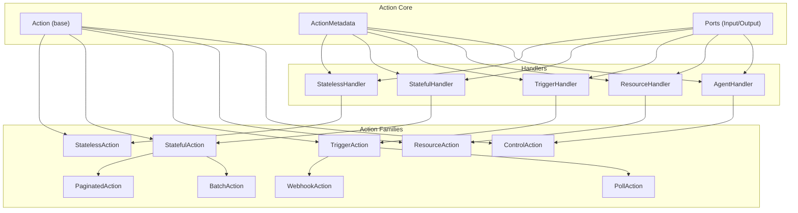
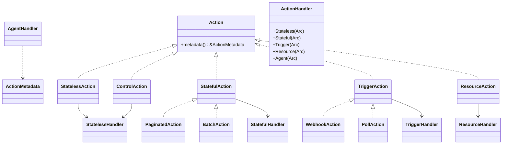
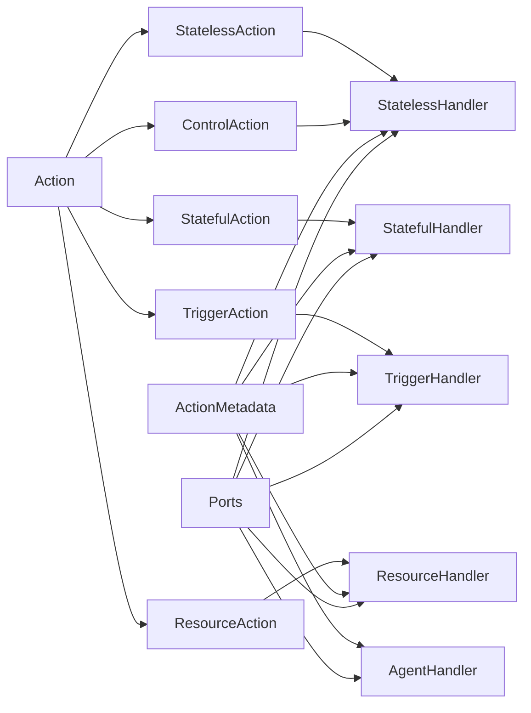

# Action Trait Family

<cite>
**Referenced Files in This Document**
- [lib.rs](file://crates/action/src/lib.rs)
- [action.rs](file://crates/action/src/action.rs)
- [stateless.rs](file://crates/action/src/stateless.rs)
- [stateful.rs](file://crates/action/src/stateful.rs)
- [trigger.rs](file://crates/action/src/trigger.rs)
- [handler.rs](file://crates/action/src/handler.rs)
- [resource.rs](file://crates/action/src/resource.rs)
- [control.rs](file://crates/action/src/control.rs)
- [webhook.rs](file://crates/action/src/webhook.rs)
- [poll.rs](file://crates/action/src/poll.rs)
</cite>

## Table of Contents
1. [Introduction](#introduction)
2. [Project Structure](#project-structure)
3. [Core Components](#core-components)
4. [Architecture Overview](#architecture-overview)
5. [Detailed Component Analysis](#detailed-component-analysis)
6. [Dependency Analysis](#dependency-analysis)
7. [Performance Considerations](#performance-considerations)
8. [Troubleshooting Guide](#troubleshooting-guide)
9. [Conclusion](#conclusion)

## Introduction
This document explains the Action Trait Family that defines Nebula’s action model and execution policy metadata. It covers the foundational Action trait, the 12 universal action types (StatelessAction, StatefulAction, TriggerAction, ResourceAction, ControlAction, PaginatedAction, BatchAction, WebhookAction, PollAction), and how they relate to the ActionHandler dispatcher. It also documents execution policy metadata (ports, adapters, and capability interfaces), canonical invariants, and the relationship between traits and execution environments in the sandbox system.

## Project Structure
The Action crate organizes the trait family and supporting contracts into focused modules:
- Base trait and metadata: action.rs, metadata.rs, port.rs
- Execution handlers and dispatcher: handler.rs
- Action families: stateless.rs, stateful.rs, trigger.rs, resource.rs, control.rs
- Specialized triggers: webhook.rs, poll.rs
- Supporting types: result.rs, error.rs, context.rs, capability.rs

**Diagram sources**
- [action.rs:17-20](file://crates/action/src/action.rs#L17-L20)
- [handler.rs:74-85](file://crates/action/src/handler.rs#L74-L85)
- [stateless.rs:68-100](file://crates/action/src/stateless.rs#L68-L100)
- [stateful.rs:35-75](file://crates/action/src/stateful.rs#L35-L75)
- [trigger.rs:58-64](file://crates/action/src/trigger.rs#L58-L64)
- [resource.rs:37-53](file://crates/action/src/resource.rs#L37-L53)
- [control.rs:394-432](file://crates/action/src/control.rs#L394-L432)
- [webhook.rs:578-663](file://crates/action/src/webhook.rs#L578-L663)
- [poll.rs:722-800](file://crates/action/src/poll.rs#L722-L800)

**Section sources**
- [lib.rs:1-152](file://crates/action/src/lib.rs#L1-L152)

## Core Components
- Action: Base trait providing identity and metadata. All action families extend Action.
- ActionMetadata: Captures key, version, ports, schema, isolation level, and category.
- ActionHandler: Enum dispatcher over all handler variants (Stateless, Stateful, Trigger, Resource, Agent).
- Ports: InputPort, OutputPort, SupportPort define the typed I/O boundary for actions.
- Capability interfaces: ActionLogger, ResourceAccessor, TriggerScheduler, TriggerHealth enable contextual capabilities.

Key responsibilities:
- Identity and metadata: Action::metadata
- JSON-level contracts: StatelessHandler, StatefulHandler, TriggerHandler, ResourceHandler, AgentHandler
- Specialized DX families: StatelessAction, StatefulAction, TriggerAction, ResourceAction, ControlAction, PaginatedAction, BatchAction, WebhookAction, PollAction

**Section sources**
- [action.rs:17-20](file://crates/action/src/action.rs#L17-L20)
- [lib.rs:95-152](file://crates/action/src/lib.rs#L95-L152)
- [handler.rs:66-156](file://crates/action/src/handler.rs#L66-L156)

## Architecture Overview
The Action Trait Family centers on Action and five handler traits that expose a JSON-level contract to the runtime. The ActionHandler enum routes to the appropriate handler variant. Specialized action families (StatefulAction, TriggerAction, ResourceAction, ControlAction, WebhookAction, PollAction) provide domain-specific behavior and DX patterns.

**Diagram sources**
- [action.rs:17-20](file://crates/action/src/action.rs#L17-L20)
- [stateless.rs:68-100](file://crates/action/src/stateless.rs#L68-L100)
- [stateful.rs:35-75](file://crates/action/src/stateful.rs#L35-L75)
- [trigger.rs:58-64](file://crates/action/src/trigger.rs#L58-L64)
- [resource.rs:37-53](file://crates/action/src/resource.rs#L37-L53)
- [control.rs:394-432](file://crates/action/src/control.rs#L394-L432)
- [webhook.rs:578-663](file://crates/action/src/webhook.rs#L578-L663)
- [poll.rs:722-800](file://crates/action/src/poll.rs#L722-L800)
- [handler.rs:74-85](file://crates/action/src/handler.rs#L74-L85)

## Detailed Component Analysis

### Base Action and Metadata
- Action: Provides metadata() and requires ActionDependencies. It is object-safe and stored as Arc<dyn Action>.
- ActionMetadata: Holds key, version, ports, schema, isolation level, and category. It informs engine inspection and routing.

Implementation highlights:
- Object safety: Action is Send + Sync + 'static and usable as dyn Action.
- Registration-time dependency methods (credential(), resources()) are Sized-only and not part of the vtable.

**Section sources**
- [action.rs:17-20](file://crates/action/src/action.rs#L17-L20)
- [lib.rs:95-116](file://crates/action/src/lib.rs#L95-L116)

### StatelessAction
- Purpose: Pure function from input to output; no state between executions.
- Associated types: Input, Output, with HasSchema requirement for Input.
- Execution: execute(input, &impl Context) -> Future<Output = Result<ActionResult<Output>, ActionError>>.
- DX adapters: FnStatelessAction and FnStatelessCtxAction for closures; StatelessActionAdapter bridges typed actions to StatelessHandler.

Method signatures and return types:
- schema() -> ValidSchema (derives from Input)
- execute(input: Self::Input, ctx: &impl Context) -> impl Future<Output = Result<ActionResult<Self::Output>, ActionError>> + Send

**Section sources**
- [stateless.rs:36-100](file://crates/action/src/stateless.rs#L36-L100)
- [stateless.rs:104-171](file://crates/action/src/stateless.rs#L104-L171)
- [stateless.rs:181-327](file://crates/action/src/stateless.rs#L181-L327)
- [stateless.rs:357-421](file://crates/action/src/stateless.rs#L357-L421)

### StatefulAction
- Purpose: Iterative execution with persistent state; engine calls execute repeatedly.
- Associated types: Input, Output, State (Serialize + DeserializeOwned + Clone).
- Methods: init_state(), migrate_state(), execute(input, &mut State, &impl Context).
- DX families: PaginatedAction (cursor-driven pagination), BatchAction (chunked processing).

Method signatures and return types:
- init_state() -> Self::State
- migrate_state(old: Value) -> Option<Self::State>
- execute(input: Self::Input, state: &mut Self::State, ctx: &impl Context) -> impl Future<Output = Result<ActionResult<Self::Output>, ActionError>> + Send

**Section sources**
- [stateful.rs:23-75](file://crates/action/src/stateful.rs#L23-L75)
- [stateful.rs:118-152](file://crates/action/src/stateful.rs#L118-L152)
- [stateful.rs:264-298](file://crates/action/src/stateful.rs#L264-L298)

### TriggerAction
- Purpose: Workflow starter outside the execution graph; emits new executions in response to external events.
- Methods: start(&TriggerContext) and stop(&TriggerContext).
- Transport-agnostic envelope: TriggerEvent (id, received_at, erased payload) and TriggerEventOutcome (Skip, Emit, EmitMany).

Method signatures and return types:
- start(ctx: &TriggerContext) -> impl Future<Output = Result<(), ActionError>> + Send
- stop(ctx: &TriggerContext) -> impl Future<Output = Result<(), ActionError>> + Send

**Section sources**
- [trigger.rs:50-64](file://crates/action/src/trigger.rs#L50-L64)
- [trigger.rs:88-194](file://crates/action/src/trigger.rs#L88-L194)
- [trigger.rs:209-255](file://crates/action/src/trigger.rs#L209-L255)

### ResourceAction
- Purpose: Graph-scoped dependency injection; configure before downstream nodes, cleanup when scope ends.
- Associated type: Resource (produced by configure, consumed by cleanup).
- Methods: configure(&impl Context) -> Future<Output = Result<Self::Resource, ActionError>>, cleanup(Self::Resource, &impl Context).

Method signatures and return types:
- configure(ctx: &impl Context) -> impl Future<Output = Result<Self::Resource, ActionError>> + Send
- cleanup(resource: Self::Resource, ctx: &impl Context) -> impl Future<Output = Result<(), ActionError>> + Send

**Section sources**
- [resource.rs:22-53](file://crates/action/src/resource.rs#L22-L53)

### ControlAction
- Purpose: Synchronous flow-control decisions on a single input; no engine-persisted state.
- Associated types: ControlInput (typed accessors), ControlOutcome (Branch, Route, Pass, Drop, Terminate).
- Methods: evaluate(ControlInput, &ActionContext) -> Future<Output = Result<ControlOutcome, ActionError>> + Send.
- Adapter: ControlActionAdapter wraps ControlAction as StatelessHandler and stamps ActionCategory based on outputs.

Method signatures and return types:
- evaluate(input: ControlInput, ctx: &ActionContext) -> impl Future<Output = Result<ControlOutcome, ActionError>> + Send

**Section sources**
- [control.rs:92-254](file://crates/action/src/control.rs#L92-L254)
- [control.rs:256-355](file://crates/action/src/control.rs#L256-L355)
- [control.rs:358-432](file://crates/action/src/control.rs#L358-L432)
- [control.rs:434-514](file://crates/action/src/control.rs#L434-L514)

### PaginatedAction and BatchAction
- PaginatedAction: Cursor-driven pagination; implement fetch_page and use impl_paginated_action! macro to generate StatefulAction impl.
- BatchAction: Fixed-size chunked processing; implement extract_items, process_item, merge_results and use impl_batch_action! macro.

Key behaviors:
- PaginationState and BatchState manage progress and results.
- Continue/Break decisions and progress reporting are generated by the macros.

**Section sources**
- [stateful.rs:78-224](file://crates/action/src/stateful.rs#L78-L224)
- [stateful.rs:226-372](file://crates/action/src/stateful.rs#L226-L372)

### WebhookAction
- Purpose: HTTP webhook trigger; lifecycle includes on_activate, handle_request, on_deactivate.
- Request type: WebhookRequest (method, path, query, headers, body, received_at) with size and header limits.
- Response type: WebhookResponse (Accept, Respond) controlling HTTP response and workflow emission.
- Security: SignaturePolicy with Required, OptionalAcceptUnsigned, and Custom policies; constant-time verification helpers.

Method signatures and return types:
- on_activate(ctx: &TriggerContext) -> impl Future<Output = Result<Self::State, ActionError>> + Send
- handle_request(request: &WebhookRequest, state: &Self::State, ctx: &TriggerContext) -> impl Future<Output = Result<WebhookResponse, ActionError>> + Send
- on_deactivate(state: Self::State, ctx: &TriggerContext) -> impl Future<Output = Result<(), ActionError>> + Send
- config() -> WebhookConfig

**Section sources**
- [webhook.rs:533-663](file://crates/action/src/webhook.rs#L533-L663)
- [webhook.rs:105-391](file://crates/action/src/webhook.rs#L105-L391)
- [webhook.rs:446-531](file://crates/action/src/webhook.rs#L446-L531)

### PollAction
- Purpose: Periodic pull-based trigger with in-memory cursor; adapter runs sleep → poll → emit loop.
- Configuration: PollConfig (base/max intervals, backoff, jitter, timeout, emit failure policy, max pages hint).
- Cursor: PollCursor (checkpoint/rollback), DeduplicatingCursor (bounded seen-set with FIFO eviction).

Method signatures and return types:
- poll_config() -> PollConfig
- poll(cursor: &mut PollCursor<Self::Cursor>, ctx: &TriggerContext) -> impl Future<Output = Result<PollResult<Self::Event>, ActionError>> + Send
- initial_cursor() -> Self::Cursor (default: Default::default())

**Section sources**
- [poll.rs:37-245](file://crates/action/src/poll.rs#L37-L245)
- [poll.rs:281-386](file://crates/action/src/poll.rs#L281-L386)
- [poll.rs:440-491](file://crates/action/src/poll.rs#L440-L491)
- [poll.rs:493-720](file://crates/action/src/poll.rs#L493-L720)
- [poll.rs:722-800](file://crates/action/src/poll.rs#L722-L800)

### ActionHandler Dispatcher
- Enum variants: Stateless, Stateful, Trigger, Resource, Agent.
- Each variant wraps an Arc<dyn XxxHandler>.
- Provides metadata() delegation and is_* predicates for runtime routing.

Dispatch flow:
- Engine selects ActionHandler variant based on action type.
- Handlers operate at JSON boundary (Value) for typed actions via adapters.

**Section sources**
- [handler.rs:66-156](file://crates/action/src/handler.rs#L66-L156)

## Dependency Analysis
- Coupling: All specialized action families extend Action; handlers depend on ActionMetadata and ports.
- Cohesion: Each module encapsulates a cohesive domain (stateless, stateful, trigger, resource, control, webhook, poll).
- External dependencies: async_trait, serde_json, http (for webhook), parking_lot, subtle, hmac, sha2 (for security).

**Diagram sources**
- [action.rs:17-20](file://crates/action/src/action.rs#L17-L20)
- [handler.rs:74-85](file://crates/action/src/handler.rs#L74-L85)
- [lib.rs:95-152](file://crates/action/src/lib.rs#L95-L152)

**Section sources**
- [handler.rs:27-36](file://crates/action/src/handler.rs#L27-L36)
- [lib.rs:95-152](file://crates/action/src/lib.rs#L95-L152)

## Performance Considerations
- Cancellation: All action families rely on runtime cancellation via tokio::select! with ctx.cancellation().cancelled(). Implementations should cooperate at specific points if needed.
- Serialization costs: StatefulActionAdapter and StatelessActionAdapter incur JSON (de)serialization overhead; keep inputs/outputs compact and avoid unnecessary cloning.
- State checkpointing: StatefulActionAdapter ensures state mutations are flushed back to JSON before propagating errors to prevent duplicated side effects on retry.
- Polling: PollConfig supports backoff, jitter, and timeouts to reduce thundering herds and upstream pressure; tune max_pages_hint to balance throughput and memory.

[No sources needed since this section provides general guidance]

## Troubleshooting Guide
Common issues and remedies:
- Validation errors: Use ActionError::validation with ValidationReason for malformed inputs or state deserialization failures.
- Retryable vs fatal: Distinguish between ActionError::Retryable and ActionError::Fatal to control engine behavior.
- Serialization failures: Fatal errors are surfaced when serialization/deserialization fails; ensure types implement Serialize/DeserializeOwned and are compatible with JSON.
- Signature verification: Use constant-time verification helpers (verify_hmac_sha256, verify_tag_constant_time) to avoid timing-side-channel leaks.
- Poll cursor rollback: Understand checkpoint vs pre-poll rollback semantics to avoid duplicated emissions or missed events.

**Section sources**
- [stateful.rs:519-610](file://crates/action/src/stateful.rs#L519-L610)
- [webhook.rs:578-663](file://crates/action/src/webhook.rs#L578-L663)
- [poll.rs:440-491](file://crates/action/src/poll.rs#L440-L491)

## Conclusion
The Action Trait Family establishes a robust, extensible foundation for Nebula actions. The base Action trait and ActionMetadata provide identity and inspection hooks; the five handler traits and ActionHandler dispatcher enable JSON-level interoperability; and the 12 specialized action families deliver ergonomic patterns for common use cases. Canonical invariants and the sandbox relationship ensure consistent, secure, and predictable execution across environments.