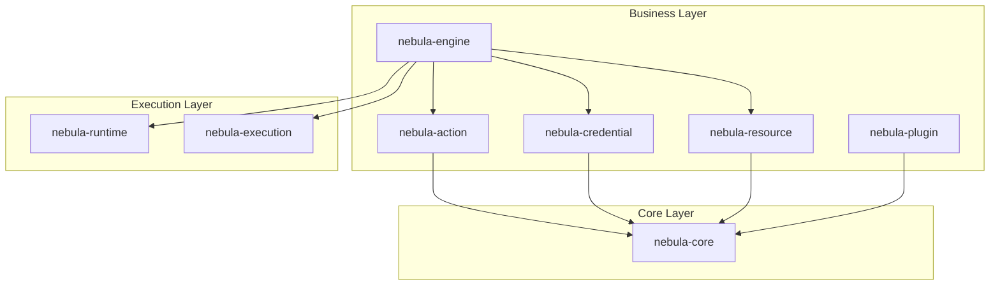
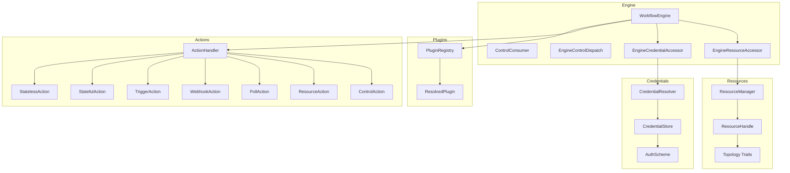
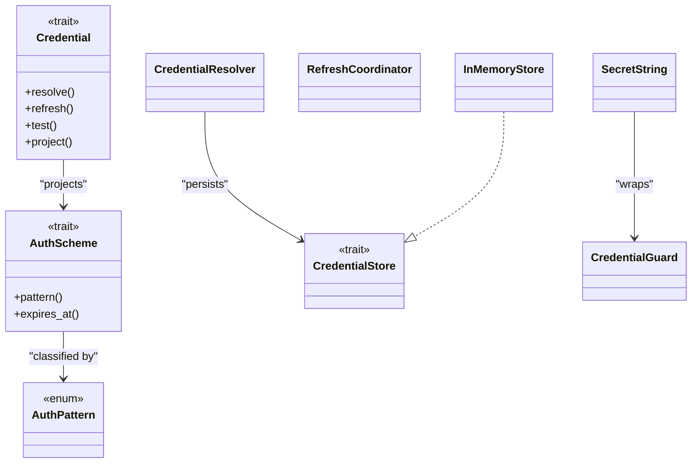
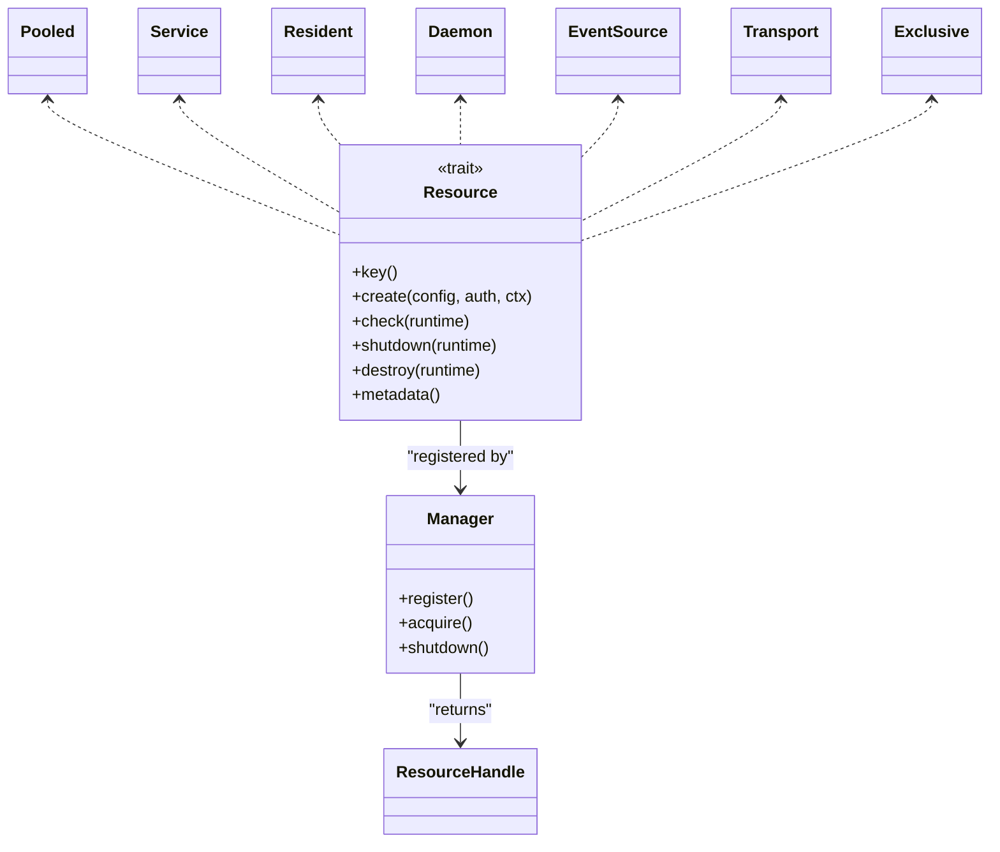
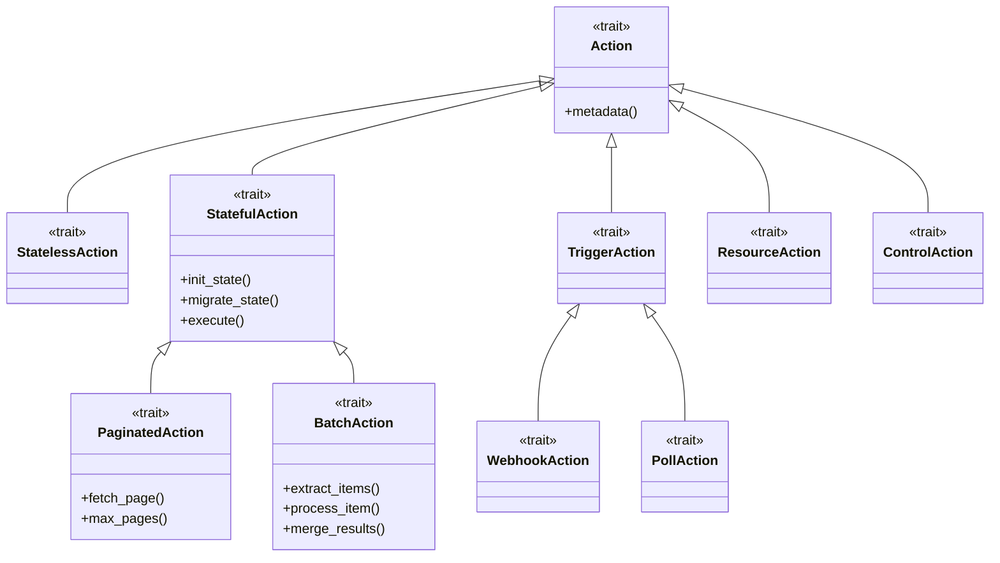
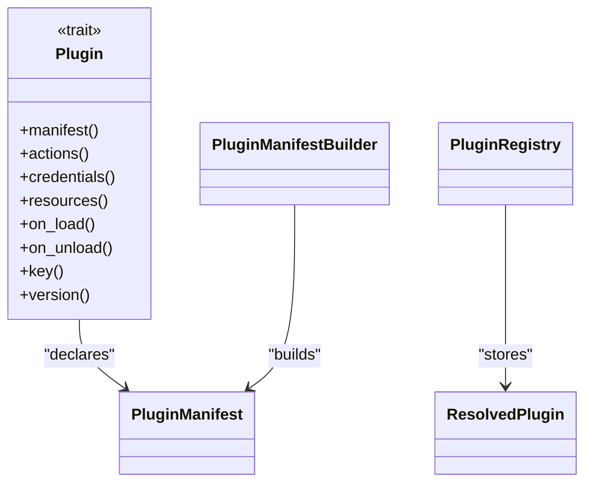
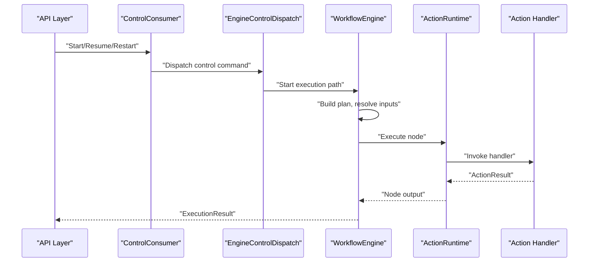
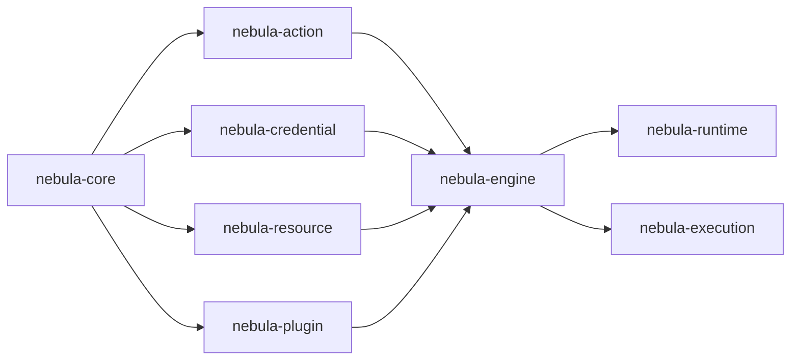

# Business Layer Documentation

<cite>
**Referenced Files in This Document**
- [action/lib.rs](file://crates/action/src/lib.rs)
- [action/action.rs](file://crates/action/src/action.rs)
- [action/stateful.rs](file://crates/action/src/stateful.rs)
- [credential/lib.rs](file://crates/credential/src/lib.rs)
- [credential/scheme/mod.rs](file://crates/credential/src/scheme/mod.rs)
- [credential/scheme/auth.rs](file://crates/credential/src/scheme/auth.rs)
- [resource/lib.rs](file://crates/resource/src/lib.rs)
- [resource/resource.rs](file://crates/resource/src/resource.rs)
- [plugin/lib.rs](file://crates/plugin/src/lib.rs)
- [plugin/plugin.rs](file://crates/plugin/src/plugin.rs)
- [plugin/manifest.rs](file://crates/plugin/src/manifest.rs)
- [engine/lib.rs](file://crates/engine/src/lib.rs)
- [engine/engine.rs](file://crates/engine/src/engine.rs)
</cite>

## Table of Contents
1. [Introduction](#introduction)
2. [Project Structure](#project-structure)
3. [Core Components](#core-components)
4. [Architecture Overview](#architecture-overview)
5. [Detailed Component Analysis](#detailed-component-analysis)
6. [Dependency Analysis](#dependency-analysis)
7. [Performance Considerations](#performance-considerations)
8. [Troubleshooting Guide](#troubleshooting-guide)
9. [Conclusion](#conclusion)

## Introduction
This document explains Nebula’s Business Layer with a focus on integration and automation. It covers how the system composes actions, credentials, resources, and plugins into reliable workflows, and how the engine orchestrates execution. You will learn:
- How credentials are modeled, securely stored, rotated, and projected to actions
- How resources are pooled, health-checked, and lifecycle-managed
- How the action framework supports multiple execution patterns (stateless, stateful, pagination, batching, triggers, webhooks, polling)
- How the plugin system enables dynamic discovery and loading of actions, credentials, and resources
- How bulkhead patterns and resilience controls protect systems during automation
- How configuration, parameters, and return values are defined and used across crates
- How the Business Layer integrates with core and execution layers

The goal is to make these concepts accessible to newcomers while providing deep, code-backed insights for advanced customization.

## Project Structure
Nebula organizes business capabilities into focused crates:
- nebula-action: Action trait families, execution metadata, and DX patterns
- nebula-credential: Credential contract, schemes, secure storage, rotation, and projection
- nebula-resource: Resource lifecycle, pooling, topology, and bulkhead patterns
- nebula-plugin: Plugin distribution unit, manifests, and registry
- nebula-engine: Workflow engine, control plane, and orchestration glue

**Diagram sources**
- [engine/lib.rs:1-79](file://crates/engine/src/lib.rs#L1-L79)
- [action/lib.rs:1-152](file://crates/action/src/lib.rs#L1-L152)
- [credential/lib.rs:1-175](file://crates/credential/src/lib.rs#L1-L175)
- [resource/lib.rs:1-108](file://crates/resource/src/lib.rs#L1-L108)
- [plugin/lib.rs:1-50](file://crates/plugin/src/lib.rs#L1-L50)

**Section sources**
- [engine/lib.rs:1-79](file://crates/engine/src/lib.rs#L1-L79)
- [action/lib.rs:1-152](file://crates/action/src/lib.rs#L1-L152)
- [credential/lib.rs:1-175](file://crates/credential/src/lib.rs#L1-L175)
- [resource/lib.rs:1-108](file://crates/resource/src/lib.rs#L1-L108)
- [plugin/lib.rs:1-50](file://crates/plugin/src/lib.rs#L1-L50)

## Core Components
This section summarizes each business crate’s purpose, key types, and integration points.

- nebula-action
  - Role: Action trait families and execution policy metadata
  - Key types: Action, StatelessAction, StatefulAction, TriggerAction, ResourceAction, PaginatedAction, BatchAction, WebhookAction, PollAction, ControlAction, ActionMetadata, ActionResult, ActionError, ActionHandler
  - Integration: Engine dispatches actions via runtime; actions declare dependencies and metadata; output/result types carry flow-control intents
  - References: [action/lib.rs:1-152](file://crates/action/src/lib.rs#L1-L152), [action/action.rs:1-21](file://crates/action/src/action.rs#L1-L21), [action/stateful.rs:1-800](file://crates/action/src/stateful.rs#L1-L800)

- nebula-credential
  - Role: Credential contract, secure storage, rotation, and projection
  - Key types: Credential, CredentialMetadata, CredentialStore, AuthScheme, AuthPattern, SecretString, CredentialGuard, encryption helpers, resolve/refresh/pending APIs
  - Security: AES-256-GCM with Argon2id KDF, zeroizing wrappers, redacted Debug, no plaintext logs
  - References: [credential/lib.rs:1-175](file://crates/credential/src/lib.rs#L1-L175), [credential/scheme/mod.rs:1-40](file://crates/credential/src/scheme/mod.rs#L1-L40), [credential/scheme/auth.rs:1-141](file://crates/credential/src/scheme/auth.rs#L1-L141)

- nebula-resource
  - Role: Bulkhead pool and resource lifecycle (acquire, health, release)
  - Key types: Resource, ResourceConfig, ResourceHandle, Manager, ReleaseQueue, topology traits (service, transport, pooled, resident, daemon, event-source, exclusive)
  - Patterns: Pooling, residency, service, transport, event-source, daemon, exclusive; drain timeouts and recovery gates
  - References: [resource/lib.rs:1-108](file://crates/resource/src/lib.rs#L1-L108), [resource/resource.rs:1-277](file://crates/resource/src/resource.rs#L1-L277)

- nebula-plugin
  - Role: Plugin distribution unit (actions, credentials, resources) with manifest and registry
  - Key types: Plugin, PluginManifest, ResolvedPlugin, PluginRegistry, ComponentKind
  - References: [plugin/lib.rs:1-50](file://crates/plugin/src/lib.rs#L1-L50), [plugin/plugin.rs:1-125](file://crates/plugin/src/plugin.rs#L1-L125), [plugin/manifest.rs:1-11](file://crates/plugin/src/manifest.rs#L1-L11)

- nebula-engine
  - Role: Workflow execution orchestrator; control plane consumer; credential/resource accessors; event emission
  - Key types: WorkflowEngine, ControlConsumer, EngineControlDispatch, ExecutionResult, EngineError, EngineCredentialAccessor, EngineResourceAccessor
  - References: [engine/lib.rs:1-79](file://crates/engine/src/lib.rs#L1-L79), [engine/engine.rs:1-800](file://crates/engine/src/engine.rs#L1-L800)

**Section sources**
- [action/lib.rs:1-152](file://crates/action/src/lib.rs#L1-L152)
- [action/action.rs:1-21](file://crates/action/src/action.rs#L1-L21)
- [action/stateful.rs:1-800](file://crates/action/src/stateful.rs#L1-L800)
- [credential/lib.rs:1-175](file://crates/credential/src/lib.rs#L1-L175)
- [credential/scheme/mod.rs:1-40](file://crates/credential/src/scheme/mod.rs#L1-L40)
- [credential/scheme/auth.rs:1-141](file://crates/credential/src/scheme/auth.rs#L1-L141)
- [resource/lib.rs:1-108](file://crates/resource/src/lib.rs#L1-L108)
- [resource/resource.rs:1-277](file://crates/resource/src/resource.rs#L1-L277)
- [plugin/lib.rs:1-50](file://crates/plugin/src/lib.rs#L1-L50)
- [plugin/plugin.rs:1-125](file://crates/plugin/src/plugin.rs#L1-L125)
- [plugin/manifest.rs:1-11](file://crates/plugin/src/manifest.rs#L1-L11)
- [engine/lib.rs:1-79](file://crates/engine/src/lib.rs#L1-L79)
- [engine/engine.rs:1-800](file://crates/engine/src/engine.rs#L1-L800)

## Architecture Overview
The Business Layer sits between the Core and Execution layers. The engine coordinates:
- Action discovery and dispatch (via plugin registry)
- Credential resolution and proactive refresh hooks
- Resource acquisition and health checks
- Execution control (start, resume, restart, cancel, terminate)
- Event emission for observability

**Diagram sources**
- [engine/engine.rs:1-800](file://crates/engine/src/engine.rs#L1-L800)
- [engine/lib.rs:1-79](file://crates/engine/src/lib.rs#L1-L79)
- [action/lib.rs:1-152](file://crates/action/src/lib.rs#L1-L152)
- [credential/lib.rs:1-175](file://crates/credential/src/lib.rs#L1-L175)
- [resource/lib.rs:1-108](file://crates/resource/src/lib.rs#L1-L108)
- [plugin/lib.rs:1-50](file://crates/plugin/src/lib.rs#L1-L50)

## Detailed Component Analysis

### Credential Management: Secure Storage, Rotation, Projection
- Purpose: Unify credential contract, enforce encryption at rest, prevent plaintext exposure, and project auth material to actions
- Implementation highlights
  - Contract and types: Credential trait, CredentialMetadata, CredentialStore, ResolveResult, RefreshCoordinator, PendingStateStore
  - Security: AES-256-GCM with Argon2id KDF, encrypted at rest, zeroizing wrappers, redacted Debug
  - Schemes and patterns: 12 built-in AuthScheme types mapped to AuthPattern categories (e.g., SecretToken, OAuth2, Certificate, KeyPair)
  - Rotation: Feature-gated rotation subsystem for blue-green, transactional state machines
  - Projection: Actions bind to AuthScheme; engine injects resolved snapshot via scoped accessor
- Configuration and parameters
  - CredentialStore: put/get/update with PutMode; layered composition (cache, audit, scope)
  - Resolve/Refresh: policies, retry/backoff, test flows, interaction requests
  - Pending store: in-memory and storage-backed stores for interactive flows
- Return values and errors
  - ResolveResult, RefreshOutcome, TestResult, CredentialError, Snapshot errors
- Integration with core and execution
  - EngineCredentialAccessor injected into ActionContext; proactive refresh hook; allowlist enforcement per ActionKey
- Security considerations
  - No plaintext logs; strict separation between stored state and projected auth material; thundering herd prevention via refresh coordination

**Diagram sources**
- [credential/lib.rs:1-175](file://crates/credential/src/lib.rs#L1-L175)
- [credential/scheme/mod.rs:1-40](file://crates/credential/src/scheme/mod.rs#L1-L40)
- [credential/scheme/auth.rs:1-141](file://crates/credential/src/scheme/auth.rs#L1-L141)

**Section sources**
- [credential/lib.rs:1-175](file://crates/credential/src/lib.rs#L1-L175)
- [credential/scheme/mod.rs:1-40](file://crates/credential/src/scheme/mod.rs#L1-L40)
- [credential/scheme/auth.rs:1-141](file://crates/credential/src/scheme/auth.rs#L1-L141)
- [engine/engine.rs:356-443](file://crates/engine/src/engine.rs#L356-L443)

### Resource Pooling and Lifecycle Management: Bulkhead Patterns
- Purpose: Provide bulkhead pools and resilient resource lifecycles with health checks, hot-reload, and best-effort async release
- Implementation highlights
  - Core trait: Resource with associated types (Config, Runtime, Lease, Error, Auth) and lifecycle (create/check/shutdown/destroy)
  - Topologies: service, transport, pooled, resident, daemon, event-source, exclusive
  - Manager: central registry with acquire dispatch, drain timeouts, shutdown
  - ReleaseQueue: background workers for best-effort cleanup on crashes
  - Recovery: gates, watchdogs, and recovery groups for transient failures
- Configuration and parameters
  - Topology-specific configs (e.g., PoolConfig, ServiceConfig, ResidentConfig)
  - Acquire options/intents, drain policies, recovery gate configs
- Return values and errors
  - ResourceHandle (Owned/Guarded/Shared), ResourceEvent, ResourceOpsMetrics, typed ErrorKind
- Integration with core and execution
  - EngineResourceAccessor injected into ActionContext; resource manager optional; topology runtimes integrated at registration
- Security considerations
  - Secrets in ResourceConfig must be schema-less or handled via credential projection; no secrets in topology configs

**Diagram sources**
- [resource/resource.rs:1-277](file://crates/resource/src/resource.rs#L1-L277)
- [resource/lib.rs:1-108](file://crates/resource/src/lib.rs#L1-L108)

**Section sources**
- [resource/resource.rs:1-277](file://crates/resource/src/resource.rs#L1-L277)
- [resource/lib.rs:1-108](file://crates/resource/src/lib.rs#L1-L108)
- [engine/engine.rs:349-354](file://crates/engine/src/engine.rs#L349-L354)

### Action Framework: Multiple Execution Patterns
- Purpose: Define a trait family for actions and provide DX patterns for common automation scenarios
- Implementation highlights
  - Base: Action trait with metadata and dependencies
  - StatelessAction: single-shot, pure execution
  - StatefulAction: iterative with persistent state; supports pagination and batching via macros
  - TriggerAction: workflow starters (webhook and poll specializations)
  - ResourceAction: graph-level DI for scoped resource provisioning
  - ControlAction: flow-control nodes (If, Switch, Router, NoOp, Stop, Fail)
  - Output/result types: ActionResult, ActionOutput, DeferredOutput, StreamOutput, WaitCondition
- Configuration and parameters
  - ActionMetadata: key, version, ports, ValidSchema parameters, IsolationLevel, ActionCategory
  - Ports: InputPort, OutputPort, DynamicPort, FlowKind, ConnectionFilter
  - Result types: BranchKey, TerminationReason, TerminationCode, WaitCondition
- Return values and errors
  - ActionResult: Continue/Break with output and progress; BreakReason; ActionError with retry hints
- Integration with core and execution
  - Engine dispatches actions via ActionRuntime; adapters bridge typed actions to JSON handlers for checkpointing

**Diagram sources**
- [action/action.rs:1-21](file://crates/action/src/action.rs#L1-L21)
- [action/stateful.rs:1-800](file://crates/action/src/stateful.rs#L1-L800)
- [action/lib.rs:1-152](file://crates/action/src/lib.rs#L1-L152)

**Section sources**
- [action/lib.rs:1-152](file://crates/action/src/lib.rs#L1-L152)
- [action/action.rs:1-21](file://crates/action/src/action.rs#L1-L21)
- [action/stateful.rs:1-800](file://crates/action/src/stateful.rs#L1-L800)

### Plugin System: Dynamic Loading and Discovery
- Purpose: Package actions, credentials, and resources into a distribution unit; enable dynamic discovery and loading
- Implementation highlights
  - Plugin trait: returns Arc<dyn Action>, Arc<dyn AnyCredential>, Arc<dyn AnyResource>; lifecycle hooks (on_load/on_unload)
  - Manifest: identity, version, grouping, metadata; builder API
  - Registry: in-memory PluginKey → ResolvedPlugin mapping; enforces namespace invariants
  - ComponentKind: discriminant for error categorization
- Configuration and parameters
  - PluginManifestBuilder: key, name, version, group, icon, maturity, deprecation, author/license/homepage
  - ResolvedPlugin: eager caching of components; constructed once at registration
- Return values and errors
  - PluginError, ManifestError; typed errors for duplicates and namespace violations
- Integration with core and execution
  - Engine loads plugins via PluginRegistry; actions/resources/credentials become available to the engine

**Diagram sources**
- [plugin/plugin.rs:1-125](file://crates/plugin/src/plugin.rs#L1-L125)
- [plugin/manifest.rs:1-11](file://crates/plugin/src/manifest.rs#L1-L11)
- [plugin/lib.rs:1-50](file://crates/plugin/src/lib.rs#L1-L50)

**Section sources**
- [plugin/plugin.rs:1-125](file://crates/plugin/src/plugin.rs#L1-L125)
- [plugin/manifest.rs:1-11](file://crates/plugin/src/manifest.rs#L1-L11)
- [plugin/lib.rs:1-50](file://crates/plugin/src/lib.rs#L1-L50)

### Engine Orchestration: Control Plane and Execution
- Purpose: Build execution plans, resolve inputs, manage leases, and dispatch actions
- Implementation highlights
  - WorkflowEngine: frontier-based execution, bounded concurrency, event emission, optional execution/workflow repos
  - ControlConsumer/EngineControlDispatch: durable control-queue consumer for Start/Resume/Restart/Cancel/Terminate
  - Credential/resource accessors: injected into ActionContext; proactive refresh hook; allowlist enforcement
  - ExecutionResult: post-run summary for API layer
- Configuration and parameters
  - Lease TTL and heartbeat intervals; event channel capacity; action credential allowlists
  - Optional repositories for persistence and resume
- Return values and errors
  - ExecutionResult, EngineError; typed errors for planning, leases, and integrity violations
- Integration with core and execution
  - Uses ActionRuntime for execution; integrates with ExecutionRepo for state persistence; emits ExecutionEvent for observability

**Diagram sources**
- [engine/engine.rs:1-800](file://crates/engine/src/engine.rs#L1-L800)
- [engine/lib.rs:1-79](file://crates/engine/src/lib.rs#L1-L79)

**Section sources**
- [engine/engine.rs:1-800](file://crates/engine/src/engine.rs#L1-L800)
- [engine/lib.rs:1-79](file://crates/engine/src/lib.rs#L1-L79)

## Dependency Analysis
- Cohesion and coupling
  - Action, Credential, Resource, Plugin crates are cohesive around their domains and expose thin public surfaces
  - Engine ties them together with minimal coupling via traits and accessors
- External dependencies and integration points
  - Core abstractions (keys, ids, scopes) used across crates
  - Runtime and Execution layers consume engine outputs and drive action execution
- Potential circular dependencies
  - Plugin → Manifest moved to metadata crate for source compatibility; no circular deps intended
- Interface contracts
  - ActionDependencies for actions
  - AnyResource for resource discovery
  - Plugin trait for component contribution

**Diagram sources**
- [engine/lib.rs:1-79](file://crates/engine/src/lib.rs#L1-L79)
- [action/lib.rs:1-152](file://crates/action/src/lib.rs#L1-L152)
- [credential/lib.rs:1-175](file://crates/credential/src/lib.rs#L1-L175)
- [resource/lib.rs:1-108](file://crates/resource/src/lib.rs#L1-L108)
- [plugin/lib.rs:1-50](file://crates/plugin/src/lib.rs#L1-L50)

**Section sources**
- [engine/lib.rs:1-79](file://crates/engine/src/lib.rs#L1-L79)
- [action/lib.rs:1-152](file://crates/action/src/lib.rs#L1-L152)
- [credential/lib.rs:1-175](file://crates/credential/src/lib.rs#L1-L175)
- [resource/lib.rs:1-108](file://crates/resource/src/lib.rs#L1-L108)
- [plugin/lib.rs:1-50](file://crates/plugin/src/lib.rs#L1-L50)

## Performance Considerations
- Credential refresh and thundering herd
  - Use RefreshCoordinator to coalesce refresh requests and reduce load
  - Proactive refresh hook reduces token expiration risk during action execution
- Resource pooling and bulkheads
  - Choose appropriate topology (pooled/service/transport) to balance throughput and latency
  - Tune drain timeouts and recovery gates to minimize downtime during transient failures
- Action execution
  - Stateful actions should checkpoint frequently; avoid long-running critical sections without proper cancellation handling
  - Use pagination/batch macros to amortize overhead and improve throughput
- Engine throughput
  - Adjust execution-lease TTL and heartbeat intervals for workload characteristics
  - Use bounded event channels to prevent memory pressure during bursts

## Troubleshooting Guide
- Credential troubleshooting
  - Verify encryption layer configuration and key derivation
  - Check resolve/refresh outcomes and retry policies
  - Confirm pending state store availability for interactive flows
- Resource troubleshooting
  - Inspect health-check failures and shutdown sequences
  - Validate topology configs and drain policies
  - Monitor recovery gates and watchdogs for transient issues
- Action troubleshooting
  - Validate ActionMetadata and schema compatibility
  - Inspect ActionResult flow-control decisions and progress reporting
  - Review state serialization errors and migration paths
- Engine troubleshooting
  - Investigate lease acquisition failures and heartbeat loss
  - Check event channel backpressure and dropped events
  - Validate control-plane commands and execution results

**Section sources**
- [credential/lib.rs:1-175](file://crates/credential/src/lib.rs#L1-L175)
- [resource/resource.rs:1-277](file://crates/resource/src/resource.rs#L1-L277)
- [action/stateful.rs:1-800](file://crates/action/src/stateful.rs#L1-L800)
- [engine/engine.rs:516-569](file://crates/engine/src/engine.rs#L516-L569)

## Conclusion
Nebula’s Business Layer provides a robust foundation for automation:
- Credentials are modeled securely with encryption, rotation, and safe projection
- Resources are lifecycle-managed with bulkhead patterns and resilient topologies
- Actions support diverse execution patterns with strong metadata and result contracts
- Plugins enable dynamic discovery and composition of capabilities
- The engine orchestrates control, credentials, and resources into reliable workflows

By following the patterns and contracts documented here, teams can implement custom actions, credentials, and plugins while maintaining security, reliability, and operability.