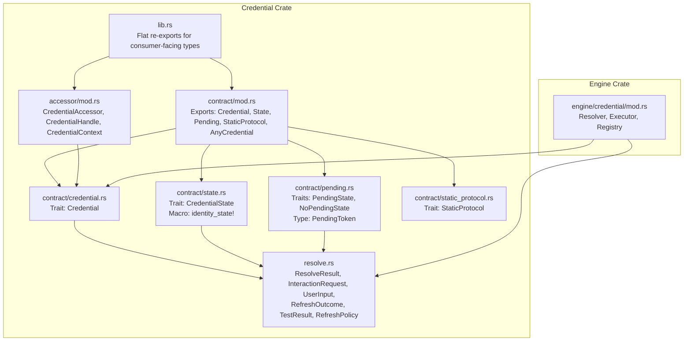
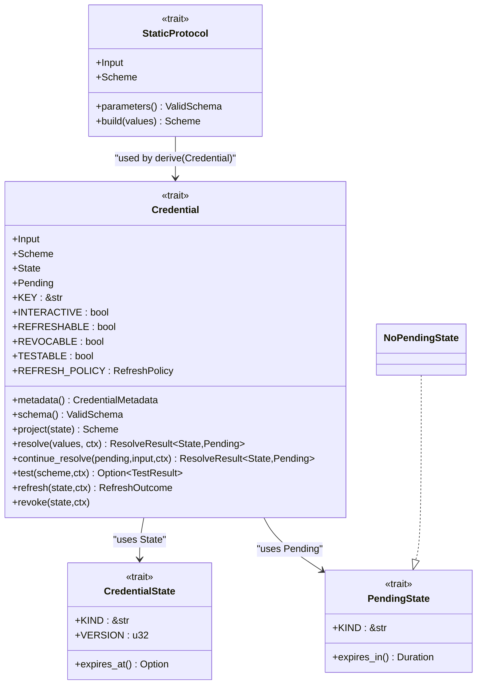
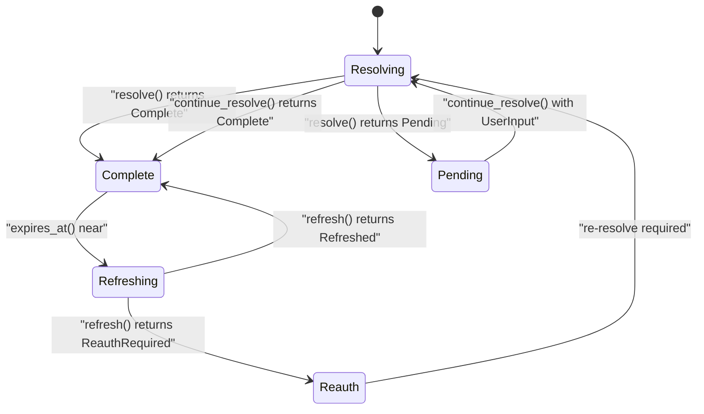
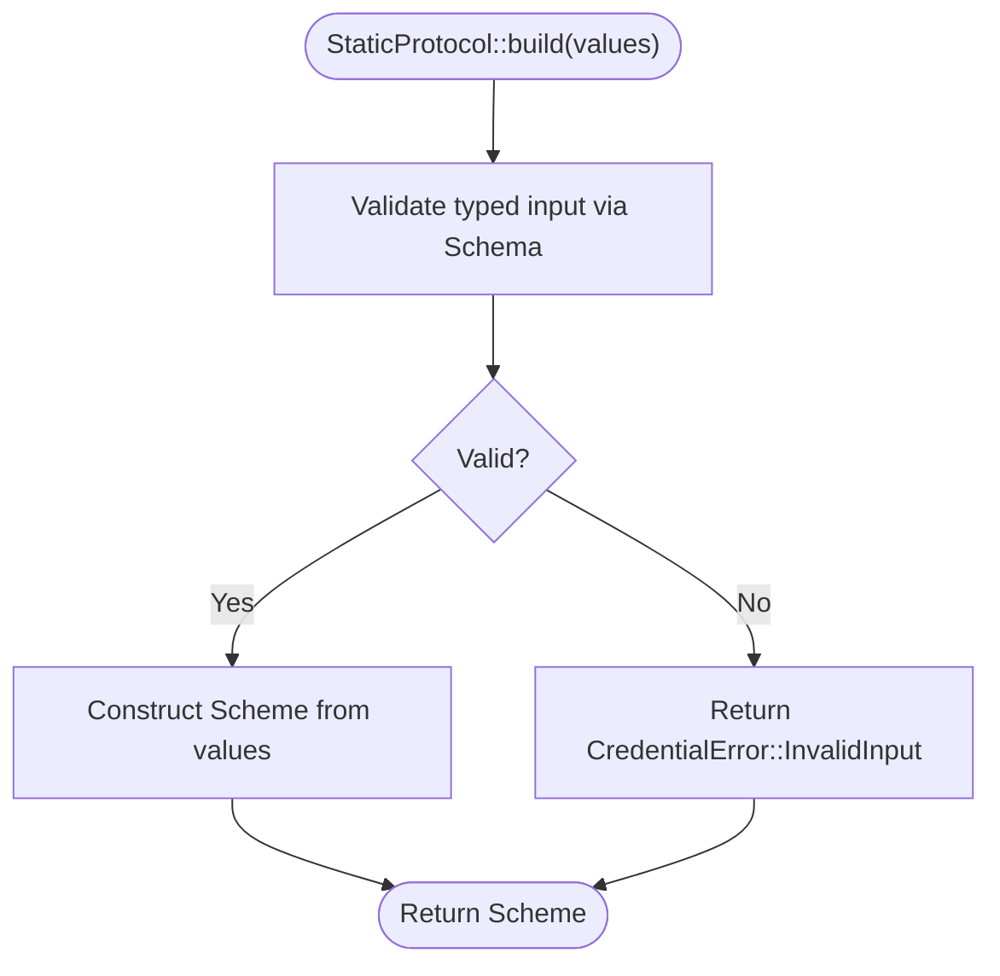
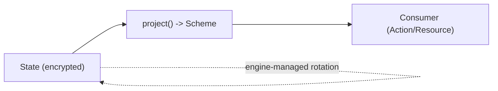
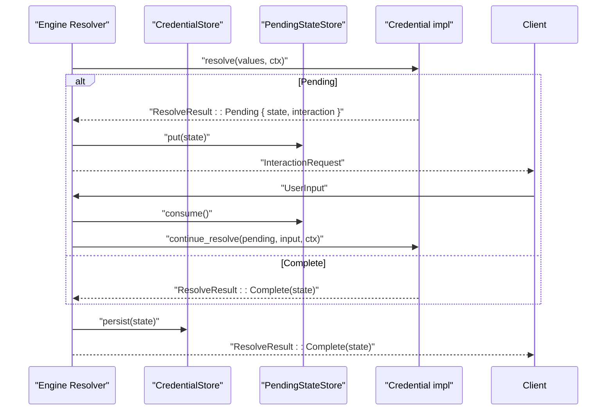
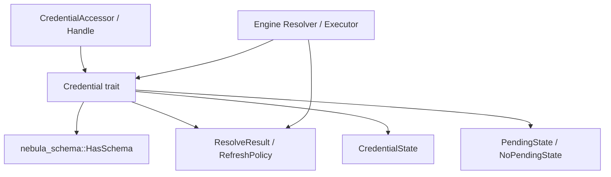
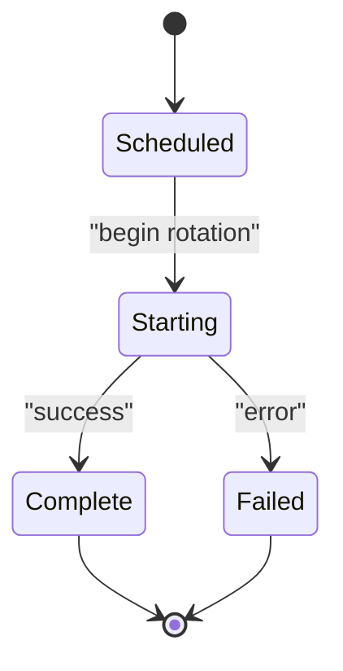

# Credential Contract and Core Types

<cite>
**Referenced Files in This Document**
- [lib.rs](file://crates/credential/src/lib.rs)
- [mod.rs (contract)](file://crates/credential/src/contract/mod.rs)
- [credential.rs](file://crates/credential/src/contract/credential.rs)
- [state.rs](file://crates/credential/src/contract/state.rs)
- [pending.rs](file://crates/credential/src/contract/pending.rs)
- [static_protocol.rs](file://crates/credential/src/contract/static_protocol.rs)
- [any.rs](file://crates/credential/src/contract/any.rs)
- [resolve.rs](file://crates/credential/src/resolve.rs)
- [accessor/mod.rs](file://crates/credential/src/accessor/mod.rs)
- [engine/credential/mod.rs](file://crates/engine/src/credential/mod.rs)
- [rotation/error.rs](file://crates/credential/src/rotation/error.rs)
- [rotation/events.rs](file://crates/credential/src/rotation/events.rs)
- [credential_metadata.rs](file://crates/credential/examples/credential_metadata.rs)
</cite>

## Table of Contents
1. [Introduction](#introduction)
2. [Project Structure](#project-structure)
3. [Core Components](#core-components)
4. [Architecture Overview](#architecture-overview)
5. [Detailed Component Analysis](#detailed-component-analysis)
6. [Dependency Analysis](#dependency-analysis)
7. [Performance Considerations](#performance-considerations)
8. [Troubleshooting Guide](#troubleshooting-guide)
9. [Conclusion](#conclusion)
10. [Appendices](#appendices)

## Introduction
This document explains the Credential Contract system with a focus on the unified Credential trait and its associated types. It documents the four fundamental methods—resolve(), refresh(), test(), and project()—and details the credential state machine with CredentialState, PendingState, and NoPendingState. It also covers the StaticProtocol pattern for compile-time credential validation, shows how action authors interact with credentials through the contract interface, and clarifies the relationship between stored state and projected auth material. Finally, it addresses credential lifecycle management, error handling patterns, and integration with the resolution pipeline.

## Project Structure
The credential contract resides in the credential crate and exposes a flat public API surface for consumers. The contract module defines the core trait and supporting types, while the accessor module provides the runtime surface for action/resource code to obtain credentials safely. Engine-owned orchestration and rotation are implemented in the engine crate.



**Diagram sources**
- [mod.rs (contract):1-22](file://crates/credential/src/contract/mod.rs#L1-L22)
- [credential.rs:1-259](file://crates/credential/src/contract/credential.rs#L1-L259)
- [state.rs:1-50](file://crates/credential/src/contract/state.rs#L1-L50)
- [pending.rs:1-146](file://crates/credential/src/contract/pending.rs#L1-L146)
- [static_protocol.rs:1-154](file://crates/credential/src/contract/static_protocol.rs#L1-L154)
- [resolve.rs:1-205](file://crates/credential/src/resolve.rs#L1-L205)
- [accessor/mod.rs:1-39](file://crates/credential/src/accessor/mod.rs#L1-L39)
- [lib.rs:105-175](file://crates/credential/src/lib.rs#L105-L175)
- [engine/credential/mod.rs:1-18](file://crates/engine/src/credential/mod.rs#L1-L18)

**Section sources**
- [lib.rs:1-175](file://crates/credential/src/lib.rs#L1-L175)
- [mod.rs (contract):1-22](file://crates/credential/src/contract/mod.rs#L1-L22)
- [accessor/mod.rs:1-39](file://crates/credential/src/accessor/mod.rs#L1-L39)
- [engine/credential/mod.rs:1-18](file://crates/engine/src/credential/mod.rs#L1-L18)

## Core Components
- Credential trait: Unifies resolve(), project(), refresh(), test(), and revoke() with capability flags and associated types for input, scheme, state, and pending.
- CredentialState: Represents stored state persisted in encrypted form; may include refresh internals not exposed to consumers.
- PendingState and NoPendingState: Typed ephemeral state for interactive flows; NoPendingState is a zero-cost marker for single-step credentials.
- StaticProtocol: Compile-time pattern for static (non-interactive) credentials that builds auth material from typed parameters.
- ResolveResult and related types: Model outcomes of resolution (Complete, Pending, Retry), interaction requests, user input, refresh outcomes, and test results.
- Accessor surface: CredentialAccessor, CredentialHandle, CredentialContext enable safe, cancellable acquisition of credentials at runtime.
- Engine integration: Resolver, Executor, and Registry orchestrate credential resolution and rotation in the execution engine.

**Section sources**
- [credential.rs:98-259](file://crates/credential/src/contract/credential.rs#L98-L259)
- [state.rs:12-50](file://crates/credential/src/contract/state.rs#L12-L50)
- [pending.rs:19-61](file://crates/credential/src/contract/pending.rs#L19-L61)
- [static_protocol.rs:75-109](file://crates/credential/src/contract/static_protocol.rs#L75-L109)
- [resolve.rs:15-205](file://crates/credential/src/resolve.rs#L15-L205)
- [accessor/mod.rs:1-39](file://crates/credential/src/accessor/mod.rs#L1-L39)
- [engine/credential/mod.rs:1-18](file://crates/engine/src/credential/mod.rs#L1-L18)

## Architecture Overview
The Credential Contract separates stored state from projected auth material. Stored state is encrypted at rest and managed by the engine; consumers receive only the AuthScheme for use in actions/resources. The engine orchestrates resolution, refresh, and rotation, ensuring security invariants and preventing secret exposure.

```mermaid
sequenceDiagram
participant Action as "Action/Resource"
participant Accessor as "CredentialAccessor"
participant Resolver as "Engine Resolver"
participant Store as "CredentialStore"
participant Pending as "PendingStateStore"
Action->>Accessor : "Acquire credential handle"
Accessor->>Resolver : "Resolve(key, input)"
Resolver->>Store : "Load existing state (if any)"
alt Interactive
Resolver->>Pending : "Store PendingState"
Resolver-->>Action : "ResolveResult : : Pending { interaction }"
Action->>Resolver : "Continue resolve with UserInput"
Resolver->>Pending : "Consume PendingState"
else Non-interactive
Resolver-->>Action : "ResolveResult : : Complete(state)"
end
Resolver->>Store : "Persist updated state"
Action->>Accessor : "Project scheme from state"
Accessor-->>Action : "CredentialHandle<Scheme>"
Note over Action,Accessor : "Handle is RAII; secrets zeroized on drop"
```

**Diagram sources**
- [credential.rs:178-192](file://crates/credential/src/contract/credential.rs#L178-L192)
- [resolve.rs:25-51](file://crates/credential/src/resolve.rs#L25-L51)
- [accessor/mod.rs:1-39](file://crates/credential/src/accessor/mod.rs#L1-L39)
- [engine/credential/mod.rs:15-18](file://crates/engine/src/credential/mod.rs#L15-L18)

## Detailed Component Analysis

### Credential Trait and Four Fundamental Methods
- resolve(values, ctx) -> Future<ResolveResult<State, Pending>>
  - Converts user input into a credential state. For interactive flows, returns Pending with an InteractionRequest; for non-interactive, returns Complete with the state. The engine manages PendingState storage and lifecycle.
- project(state) -> Scheme
  - Extracts the consumer-facing auth material (e.g., SecretToken, ConnectionUri) from stored state. Consumers bind to Scheme for action execution.
- refresh(state, ctx) -> Future<RefreshOutcome>
  - Attempts token renewal. Defaults to NotSupported; refreshable credentials override to implement protocol-specific logic.
- test(scheme, ctx) -> Future<Option<TestResult>>
  - Validates that the credential works against the target service. Defaults to None (not testable); testable credentials return Success or Failed with a reason.
- revoke(state, ctx) -> Future<Result<(), CredentialError>>
  - Revokes the credential at the provider. Defaults to no-op.



**Diagram sources**
- [credential.rs:98-259](file://crates/credential/src/contract/credential.rs#L98-L259)
- [state.rs:12-28](file://crates/credential/src/contract/state.rs#L12-L28)
- [pending.rs:19-61](file://crates/credential/src/contract/pending.rs#L19-L61)
- [static_protocol.rs:75-109](file://crates/credential/src/contract/static_protocol.rs#L75-L109)

**Section sources**
- [credential.rs:98-259](file://crates/credential/src/contract/credential.rs#L98-L259)

### Credential State Machine and Associated Types
- CredentialState: Stored encrypted state; may include refresh internals not exposed to consumers. Provides KIND and VERSION for persistence/migration.
- PendingState: Ephemeral state for interactive flows with TTL, single-use semantics, encryption, and zeroize on drop. NoPendingState is a marker for non-interactive credentials.
- NoPendingState: Serializes to null and expires immediately; used when resolve() completes in one step.



**Diagram sources**
- [resolve.rs:25-51](file://crates/credential/src/resolve.rs#L25-L51)
- [credential.rs:236-244](file://crates/credential/src/contract/credential.rs#L236-L244)

**Section sources**
- [state.rs:12-28](file://crates/credential/src/contract/state.rs#L12-L28)
- [pending.rs:19-61](file://crates/credential/src/contract/pending.rs#L19-L61)

### StaticProtocol Pattern for Compile-Time Validation
StaticProtocol encapsulates the common pattern for static credentials: typed input schema and a build() method that constructs the Scheme. The derive(Credential) macro leverages this to auto-generate resolve() for non-interactive credentials.



**Diagram sources**
- [static_protocol.rs:98-108](file://crates/credential/src/contract/static_protocol.rs#L98-L108)

**Section sources**
- [static_protocol.rs:75-109](file://crates/credential/src/contract/static_protocol.rs#L75-L109)

### Relationship Between Stored State and Projected Auth Material
- Stored state (State) is encrypted at rest and may include refresh internals (e.g., refresh_token).
- Projected auth material (Scheme) is what consumers receive; it is derived from State via project().
- Engine ownership of rotation ensures secrets are handled securely and never exposed to action authors or logs.



**Diagram sources**
- [credential.rs:173-176](file://crates/credential/src/contract/credential.rs#L173-L176)
- [state.rs:12-28](file://crates/credential/src/contract/state.rs#L12-L28)

**Section sources**
- [credential.rs:173-176](file://crates/credential/src/contract/credential.rs#L173-L176)
- [state.rs:12-28](file://crates/credential/src/contract/state.rs#L12-L28)

### Lifecycle Management and Integration with the Resolution Pipeline
- Non-interactive credentials: resolve() returns Complete; project() yields Scheme immediately.
- Interactive credentials: resolve() returns Pending with InteractionRequest; continue_resolve() consumes PendingState and returns Complete.
- Retry pattern: resolve() may return Retry with a delay for polling-based flows (e.g., device code).
- Refresh policy: Early refresh, backoff, and jitter are configured via REFRESH_POLICY; refresh() returns Refreshed or ReauthRequired.
- Rotation: Optional engine-driven rotation emits events and enforces state transitions; rotation errors are strongly typed.



**Diagram sources**
- [resolve.rs:25-51](file://crates/credential/src/resolve.rs#L25-L51)
- [credential.rs:178-209](file://crates/credential/src/contract/credential.rs#L178-L209)

**Section sources**
- [resolve.rs:15-205](file://crates/credential/src/resolve.rs#L15-L205)
- [credential.rs:178-209](file://crates/credential/src/contract/credential.rs#L178-L209)

### Error Handling Patterns
- Resolve/Continue: Errors indicate invalid input, network issues, or unsupported flows; ResolveResult wraps outcomes and Retry delays.
- Test: Returns Some(TestResult) on supported credentials; None indicates not testable.
- Refresh: Returns RefreshOutcome with NotSupported, Refreshed, or ReauthRequired; failures propagate as CredentialError.
- Rotation: Strongly typed RotationError with validation, transaction, rollback, and restore failure modes.

**Section sources**
- [resolve.rs:136-174](file://crates/credential/src/resolve.rs#L136-L174)
- [credential.rs:211-244](file://crates/credential/src/contract/credential.rs#L211-L244)
- [rotation/error.rs:9-47](file://crates/credential/src/rotation/error.rs#L9-L47)

### Practical Examples for Action Authors
Action authors bind to the Credential trait and use the accessor surface to obtain a CredentialHandle containing the projected Scheme. The handle is RAII and zeroizes secrets on drop. Metadata and schemas are declared via CredentialMetadata and StaticProtocol.

- Declaring credential metadata and schemas:
  - See [credential_metadata.rs:13-92](file://crates/credential/examples/credential_metadata.rs#L13-L92) for examples building GitHub OAuth2, PostgreSQL, and API Key credential types.
- Using accessor surface:
  - Import from the flat re-exports and use CredentialAccessor/CredentialHandle to acquire credentials safely.
  - See [accessor/mod.rs:1-39](file://crates/credential/src/accessor/mod.rs#L1-L39) for the consumer-facing API.

**Section sources**
- [credential_metadata.rs:13-92](file://crates/credential/examples/credential_metadata.rs#L13-L92)
- [accessor/mod.rs:1-39](file://crates/credential/src/accessor/mod.rs#L1-L39)

## Dependency Analysis
The credential contract depends on schema types for input validation and on engine/resolver components for orchestration. The accessor module provides a clean separation between credential acquisition and the underlying engine.



**Diagram sources**
- [credential.rs:18-25](file://crates/credential/src/contract/credential.rs#L18-L25)
- [resolve.rs:15-205](file://crates/credential/src/resolve.rs#L15-L205)
- [accessor/mod.rs:1-39](file://crates/credential/src/accessor/mod.rs#L1-L39)
- [engine/credential/mod.rs:15-18](file://crates/engine/src/credential/mod.rs#L15-L18)

**Section sources**
- [credential.rs:18-25](file://crates/credential/src/contract/credential.rs#L18-L25)
- [resolve.rs:15-205](file://crates/credential/src/resolve.rs#L15-L205)
- [accessor/mod.rs:1-39](file://crates/credential/src/accessor/mod.rs#L1-L39)
- [engine/credential/mod.rs:1-18](file://crates/engine/src/credential/mod.rs#L1-L18)

## Performance Considerations
- Thundering herd prevention: RefreshPolicy includes jitter to randomize refresh timing.
- Minimal allocations: Capability flags and associated types are const and zero-cost.
- Efficient serialization: CredentialState and PendingState use serde with zeroize semantics.

[No sources needed since this section provides general guidance]

## Troubleshooting Guide
- NotInteractive errors: Occur when continue_resolve() is called for non-interactive credentials.
- InvalidInput errors: Returned by StaticProtocol::build() when required parameters are missing or malformed.
- Refresh failures: Distinguish between transient failures (retry with backoff) and ReauthRequired (full re-resolve).
- Rotation failures: Inspect RotationError variants for validation, transaction, rollback, and restore issues.

**Section sources**
- [credential.rs:200-209](file://crates/credential/src/contract/credential.rs#L200-L209)
- [static_protocol.rs:104-108](file://crates/credential/src/contract/static_protocol.rs#L104-L108)
- [resolve.rs:136-154](file://crates/credential/src/resolve.rs#L136-L154)
- [rotation/error.rs:9-47](file://crates/credential/src/rotation/error.rs#L9-L47)

## Conclusion
The Credential Contract unifies credential lifecycle management behind a single, secure trait. Stored state remains encrypted and separate from projected auth material, with the engine owning rotation and refresh to uphold security invariants. Action authors interact through a clean accessor surface, leveraging StaticProtocol for compile-time validation and the resolution pipeline for robust, observable credential handling.

[No sources needed since this section summarizes without analyzing specific files]

## Appendices

### Credential Lifecycle Events (Rotation)
Rotation emits structured events for scheduling, starting, completion, and failure, carrying only identifiers and counters to avoid leaking secrets.



**Diagram sources**
- [rotation/events.rs:84-151](file://crates/credential/src/rotation/events.rs#L84-L151)

**Section sources**
- [rotation/events.rs:63-151](file://crates/credential/src/rotation/events.rs#L63-L151)