# Credential Management

<cite>
**Referenced Files in This Document**
- [lib.rs](file://crates/credential/src/lib.rs)
- [mod.rs (contract)](file://crates/credential/src/contract/mod.rs)
- [credential.rs](file://crates/credential/src/contract/credential.rs)
- [mod.rs (scheme)](file://crates/credential/src/scheme/mod.rs)
- [oauth2.rs](file://crates/credential/src/scheme/oauth2.rs)
- [mod.rs (accessor)](file://crates/credential/src/accessor/mod.rs)
- [mod.rs (secrets)](file://crates/credential/src/secrets/mod.rs)
- [mod.rs (metadata)](file://crates/credential/src/metadata/mod.rs)
- [store.rs](file://crates/credential/src/store.rs)
- [mod.rs (rotation)](file://crates/credential/src/rotation/mod.rs)
- [lib.rs (engine)](file://crates/engine/src/lib.rs)
- [lib.rs (storage)](file://crates/storage/src/lib.rs)
- [mod.rs (storage credential)](file://crates/storage/src/credential/mod.rs)
- [credential.rs (API routes)](file://crates/api/src/routes/credential.rs)
- [e2e_oauth2_flow.rs](file://crates/api/tests/e2e_oauth2_flow.rs)
- [credential_metadata.rs](file://crates/credential/examples/credential_metadata.rs)
</cite>

## Table of Contents
1. [Introduction](#introduction)
2. [Project Structure](#project-structure)
3. [Core Components](#core-components)
4. [Architecture Overview](#architecture-overview)
5. [Detailed Component Analysis](#detailed-component-analysis)
6. [Dependency Analysis](#dependency-analysis)
7. [Performance Considerations](#performance-considerations)
8. [Troubleshooting Guide](#troubleshooting-guide)
9. [Conclusion](#conclusion)
10. [Appendices](#appendices)

## Introduction
This document explains Nebula’s Credential Management system with a focus on secure storage, rotation, and lifecycle orchestration. It details the credential contract pattern (resolve(), refresh(), test(), revoke(), project()), the 12 universal authentication schemes, AES-256-GCM encryption at rest with Argon2id KDF and credential ID binding as AAD, zeroizing secret wrappers, and the lifecycle from creation through rotation to expiration. It also documents the credential accessor pattern, the rotation scheduler (blue-green), configuration options, and relationships with the storage layer and engine orchestration.

## Project Structure
Nebula separates concerns across crates:
- nebula-credential: Defines the credential contract, schemes, accessor, secrets, store, rotation, and metadata.
- nebula-engine: Owns engine-side resolution, rotation scheduling, and executor integration.
- nebula-storage: Provides the canonical persistence implementations and layered store composition.
- nebula-api: Exposes REST endpoints for credential operations and end-to-end OAuth2 flows.

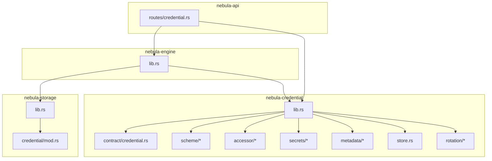

**Diagram sources**
- [lib.rs:105-175](file://crates/credential/src/lib.rs#L105-L175)
- [credential.rs:98-246](file://crates/credential/src/contract/credential.rs#L98-L246)
- [mod.rs (scheme):1-40](file://crates/credential/src/scheme/mod.rs#L1-L40)
- [mod.rs (accessor):1-39](file://crates/credential/src/accessor/mod.rs#L1-L39)
- [mod.rs (secrets):1-35](file://crates/credential/src/secrets/mod.rs#L1-L35)
- [mod.rs (metadata):1-29](file://crates/credential/src/metadata/mod.rs#L1-L29)
- [store.rs:108-161](file://crates/credential/src/store.rs#L108-L161)
- [mod.rs (rotation):1-64](file://crates/credential/src/rotation/mod.rs#L1-L64)
- [lib.rs (engine):48-79](file://crates/engine/src/lib.rs#L48-L79)
- [lib.rs (storage):1-105](file://crates/storage/src/lib.rs#L1-L105)
- [mod.rs (storage credential):1-37](file://crates/storage/src/credential/mod.rs#L1-L37)
- [credential.rs (API routes)](file://crates/api/src/routes/credential.rs)

**Section sources**
- [lib.rs:1-175](file://crates/credential/src/lib.rs#L1-L175)
- [lib.rs (engine):1-79](file://crates/engine/src/lib.rs#L1-L79)
- [lib.rs (storage):1-105](file://crates/storage/src/lib.rs#L1-L105)

## Core Components
- Credential contract: A unified trait with resolve(), project(), refresh(), test(), revoke(), and associated types for Scheme, State, and Pending. See [credential.rs:98-246](file://crates/credential/src/contract/credential.rs#L98-L246).
- Accessor pattern: Typed RAII handle and context for safe credential retrieval. See [mod.rs (accessor):1-39](file://crates/credential/src/accessor/mod.rs#L1-L39).
- Authentication schemes: 12 built-in schemes plus extensible AuthScheme trait. See [mod.rs (scheme):1-40](file://crates/credential/src/scheme/mod.rs#L1-L40).
- Secrets and encryption: AES-256-GCM with Argon2id KDF, credential ID bound as AAD, and zeroizing wrappers. See [mod.rs (secrets):1-35](file://crates/credential/src/secrets/mod.rs#L1-L35).
- Store and metadata: Store trait with optimistic concurrency, StoredCredential DTO, and metadata types. See [store.rs:108-161](file://crates/credential/src/store.rs#L108-L161) and [mod.rs (metadata):1-29](file://crates/credential/src/metadata/mod.rs#L1-L29).
- Rotation: Blue-green, grace period, policies, and validation contracts. See [mod.rs (rotation):1-64](file://crates/credential/src/rotation/mod.rs#L1-L64).
- Engine orchestration: Resolution, rotation scheduling, and executor integration. See [lib.rs (engine):48-79](file://crates/engine/src/lib.rs#L48-L79).
- Storage layer: Canonical persistence implementations and layered composition. See [lib.rs (storage):1-105](file://crates/storage/src/lib.rs#L1-L105) and [mod.rs (storage credential):1-37](file://crates/storage/src/credential/mod.rs#L1-L37).

**Section sources**
- [credential.rs:98-246](file://crates/credential/src/contract/credential.rs#L98-L246)
- [mod.rs (accessor):1-39](file://crates/credential/src/accessor/mod.rs#L1-L39)
- [mod.rs (scheme):1-40](file://crates/credential/src/scheme/mod.rs#L1-L40)
- [mod.rs (secrets):1-35](file://crates/credential/src/secrets/mod.rs#L1-L35)
- [store.rs:108-161](file://crates/credential/src/store.rs#L108-L161)
- [mod.rs (metadata):1-29](file://crates/credential/src/metadata/mod.rs#L1-L29)
- [mod.rs (rotation):1-64](file://crates/credential/src/rotation/mod.rs#L1-L64)
- [lib.rs (engine):48-79](file://crates/engine/src/lib.rs#L48-L79)
- [lib.rs (storage):1-105](file://crates/storage/src/lib.rs#L1-L105)
- [mod.rs (storage credential):1-37](file://crates/storage/src/credential/mod.rs#L1-L37)

## Architecture Overview
The system enforces strict separation of concerns:
- Consumers bind to the Credential trait and use the Accessor to obtain projected auth material.
- The engine orchestrates resolution, refresh, and rotation.
- The storage layer persists encrypted state with layered composition (encryption, caching, auditing, scoping).
- The API exposes endpoints for credential operations and end-to-end flows like OAuth2.

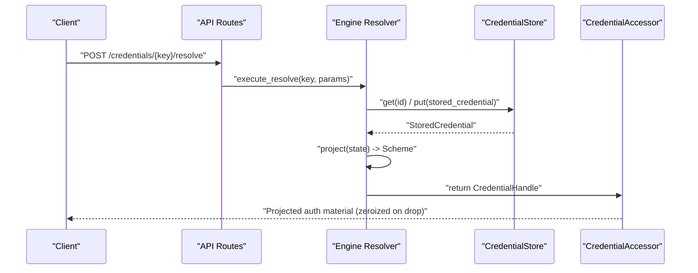

**Diagram sources**
- [credential.rs (API routes)](file://crates/api/src/routes/credential.rs)
- [credential.rs:165-179](file://crates/credential/src/contract/credential.rs#L165-L179)
- [store.rs:108-161](file://crates/credential/src/store.rs#L108-L161)
- [mod.rs (accessor):1-39](file://crates/credential/src/accessor/mod.rs#L1-L39)
- [lib.rs (engine):66-69](file://crates/engine/src/lib.rs#L66-L69)

## Detailed Component Analysis

### Credential Contract Pattern
The Credential trait defines the full lifecycle:
- resolve(values, ctx) -> ResolveResult<State, Pending>
- project(&State) -> Scheme
- refresh(&mut State, ctx) -> RefreshOutcome
- test(&Scheme, ctx) -> Option<TestResult>
- revoke(&mut State, ctx) -> ()
- Associated types: Input, Scheme, State, Pending
- Capability flags: INTERACTIVE, REFRESHABLE, REVOCABLE, TESTABLE, REFRESH_POLICY

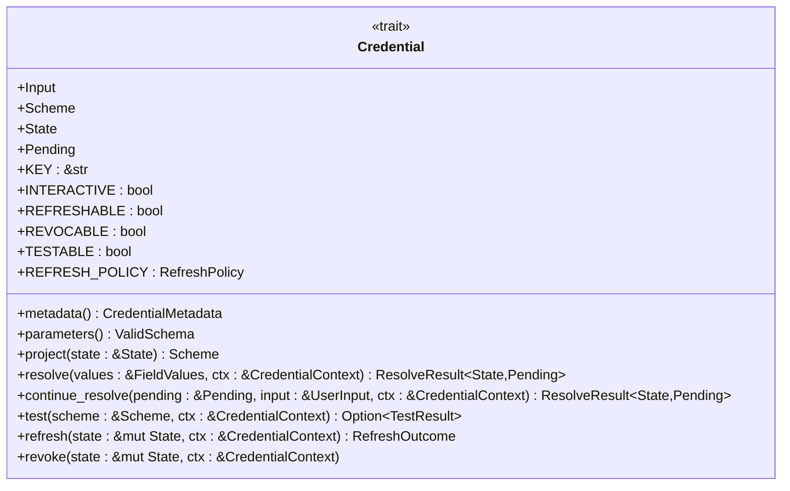

**Diagram sources**
- [credential.rs:98-246](file://crates/credential/src/contract/credential.rs#L98-L246)

**Section sources**
- [credential.rs:98-246](file://crates/credential/src/contract/credential.rs#L98-L246)

### Universal Authentication Schemes
Built-in schemes include OAuth2Token, SecretToken, BasicAuth, Certificate, ConnectionUri, FederatedAssertion, IdentityPassword, InstanceBinding, KeyPair, OtpSeed, SharedKey, SigningKey, and ChallengeSecret. The AuthScheme trait and AuthPattern classification bridge credentials and resources.

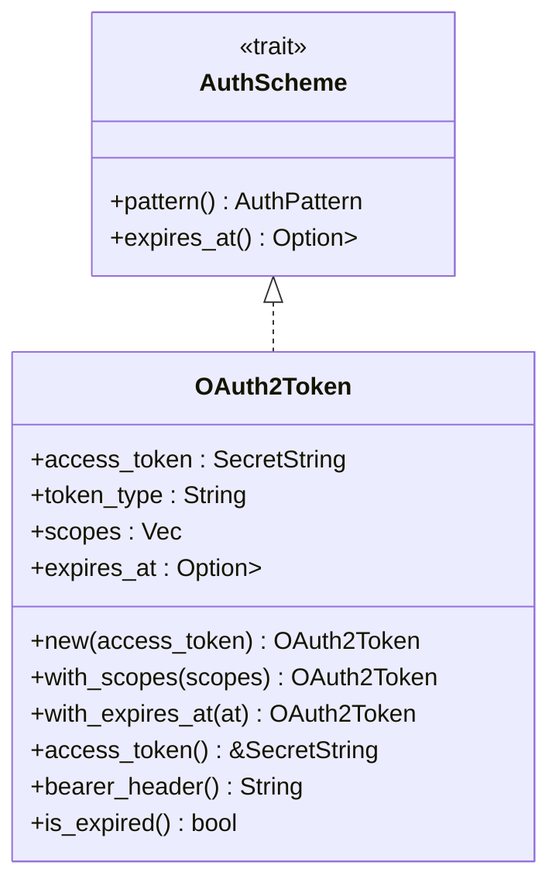

**Diagram sources**
- [oauth2.rs:16-88](file://crates/credential/src/scheme/oauth2.rs#L16-L88)
- [mod.rs (scheme):27-40](file://crates/credential/src/scheme/mod.rs#L27-L40)

**Section sources**
- [mod.rs (scheme):1-40](file://crates/credential/src/scheme/mod.rs#L1-L40)
- [oauth2.rs:1-88](file://crates/credential/src/scheme/oauth2.rs#L1-L88)

### Secure Storage and Encryption
- AES-256-GCM with Argon2id KDF and credential ID bound as AAD.
- Zeroizing wrappers and guards ensure secrets are wiped from memory.
- Store trait provides CRUD with optimistic concurrency control (CAS).
- Storage crate composes layers: EncryptionLayer, CacheLayer, AuditLayer, ScopeLayer.

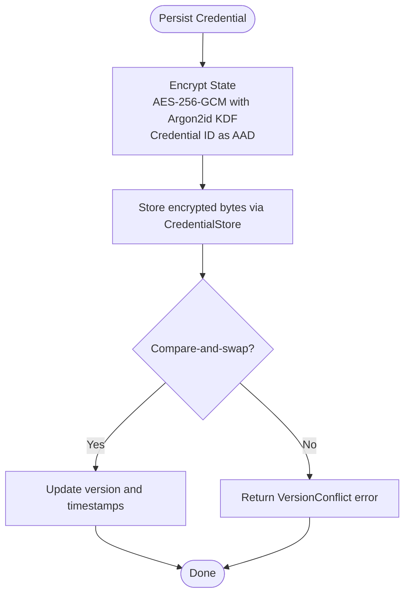

**Diagram sources**
- [mod.rs (secrets):1-35](file://crates/credential/src/secrets/mod.rs#L1-L35)
- [store.rs:108-161](file://crates/credential/src/store.rs#L108-L161)
- [mod.rs (storage credential):29-32](file://crates/storage/src/credential/mod.rs#L29-L32)

**Section sources**
- [mod.rs (secrets):1-35](file://crates/credential/src/secrets/mod.rs#L1-L35)
- [store.rs:108-161](file://crates/credential/src/store.rs#L108-L161)
- [mod.rs (storage credential):29-32](file://crates/storage/src/credential/mod.rs#L29-L32)

### Credential Lifecycle: Creation, Rotation, Expiration
Lifecycle stages:
- Creation: resolve() produces initial State; store.put() persists encrypted data.
- Projection: project() yields Scheme for consumers.
- Refresh: refresh() updates expiring tokens; coordinated to prevent thundering herds.
- Rotation: blue-green transitions, grace periods, and validation tests.
- Expiration: metadata and schemes expose expires_at; grace period tracking.

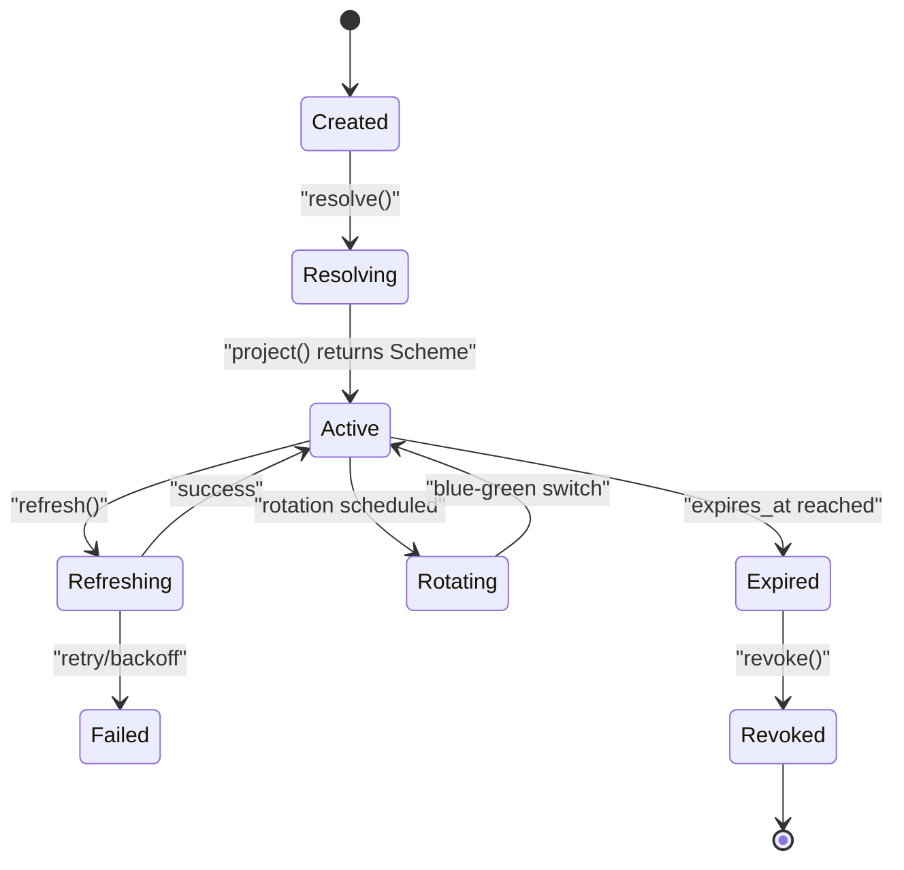

**Diagram sources**
- [credential.rs:165-244](file://crates/credential/src/contract/credential.rs#L165-L244)
- [mod.rs (rotation):48-63](file://crates/credential/src/rotation/mod.rs#L48-L63)
- [oauth2.rs:73-76](file://crates/credential/src/scheme/oauth2.rs#L73-L76)

**Section sources**
- [credential.rs:165-244](file://crates/credential/src/contract/credential.rs#L165-L244)
- [mod.rs (rotation):1-64](file://crates/credential/src/rotation/mod.rs#L1-L64)
- [oauth2.rs:1-88](file://crates/credential/src/scheme/oauth2.rs#L1-L88)

### Credential Accessor Pattern
The accessor provides:
- CredentialHandle: RAII lease owning projected scheme; zeroize-on-drop.
- CredentialContext: execution scope with cancellation, logging, and resolver handle.
- default_credential_accessor, ScopedCredentialAccessor, NoopCredentialAccessor.

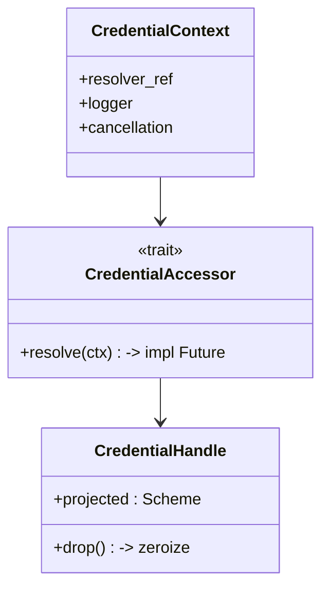

**Diagram sources**
- [mod.rs (accessor):1-39](file://crates/credential/src/accessor/mod.rs#L1-L39)

**Section sources**
- [mod.rs (accessor):1-39](file://crates/credential/src/accessor/mod.rs#L1-L39)

### Rotation Scheduler (Blue-Green)
Engine-owned rotation orchestrates blue-green transitions, grace periods, and validation. Contracts live in nebula-credential; orchestration in nebula-engine.

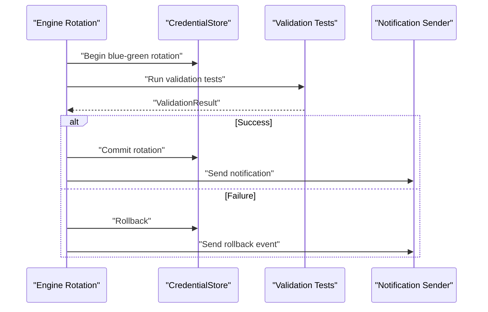

**Diagram sources**
- [mod.rs (rotation):44-63](file://crates/credential/src/rotation/mod.rs#L44-L63)
- [lib.rs (engine):66-69](file://crates/engine/src/lib.rs#L66-L69)

**Section sources**
- [mod.rs (rotation):1-64](file://crates/credential/src/rotation/mod.rs#L1-L64)
- [lib.rs (engine):48-79](file://crates/engine/src/lib.rs#L48-L79)

### OAuth2 Flow Implementation
The API exposes credential endpoints and includes end-to-end OAuth2 flow tests. The OAuth2Token scheme projects bearer tokens for HTTP clients.

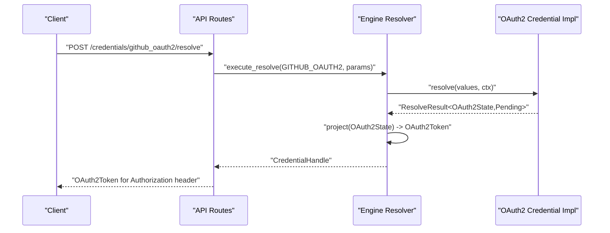

**Diagram sources**
- [credential.rs (API routes)](file://crates/api/src/routes/credential.rs)
- [credential.rs:165-179](file://crates/credential/src/contract/credential.rs#L165-L179)
- [oauth2.rs:16-88](file://crates/credential/src/scheme/oauth2.rs#L16-L88)
- [e2e_oauth2_flow.rs](file://crates/api/tests/e2e_oauth2_flow.rs)

**Section sources**
- [credential.rs (API routes)](file://crates/api/src/routes/credential.rs)
- [e2e_oauth2_flow.rs](file://crates/api/tests/e2e_oauth2_flow.rs)
- [oauth2.rs:1-88](file://crates/credential/src/scheme/oauth2.rs#L1-L88)

### Credential Metadata Management
Metadata includes static descriptors (CredentialMetadata) and runtime record (CredentialRecord). Builders and compatibility checks ensure schema evolution safety.

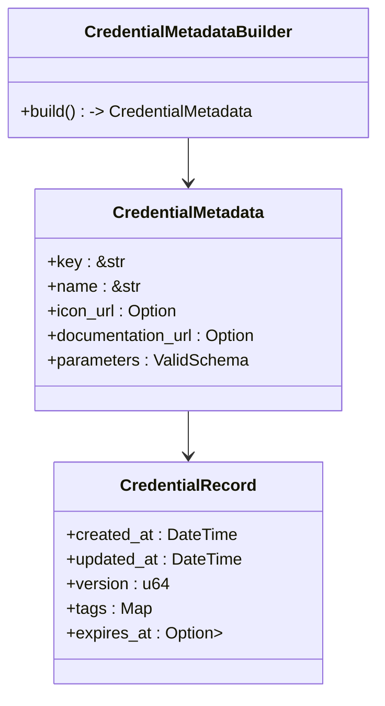

**Diagram sources**
- [mod.rs (metadata):16-29](file://crates/credential/src/metadata/mod.rs#L16-L29)

**Section sources**
- [mod.rs (metadata):1-29](file://crates/credential/src/metadata/mod.rs#L1-L29)
- [credential_metadata.rs](file://crates/credential/examples/credential_metadata.rs)

### Secure Storage Patterns
- Use SecretString and CredentialGuard for zeroizing secrets.
- encrypt_with_aad binds credential ID as AAD; decrypt_with_aad verifies integrity.
- Store encrypted bytes; never log plaintext secrets.

**Section sources**
- [mod.rs (secrets):28-34](file://crates/credential/src/secrets/mod.rs#L28-L34)
- [store.rs:108-161](file://crates/credential/src/store.rs#L108-L161)

## Dependency Analysis
- nebula-credential depends on nebula-schema for typed parameters and JSON schema.
- nebula-engine depends on nebula-credential for the contract and on nebula-storage for persistence.
- nebula-storage provides the canonical CredentialStore implementations and composable layers.
- nebula-api depends on both engine and credential for endpoints and flows.

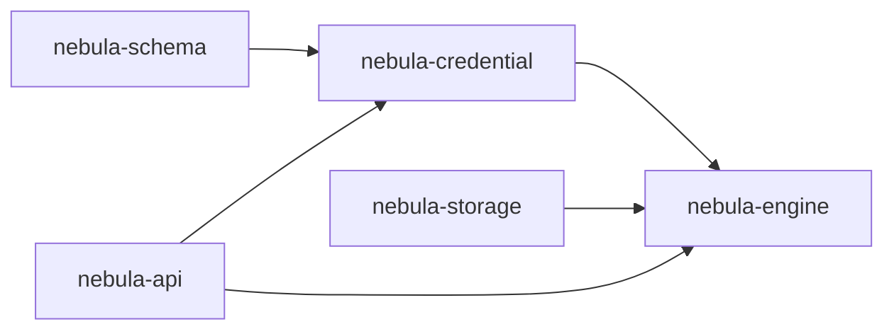

**Diagram sources**
- [credential.rs:18-25](file://crates/credential/src/contract/credential.rs#L18-L25)
- [lib.rs (engine):48-79](file://crates/engine/src/lib.rs#L48-L79)
- [lib.rs (storage):1-105](file://crates/storage/src/lib.rs#L1-L105)
- [credential.rs (API routes)](file://crates/api/src/routes/credential.rs)

**Section sources**
- [credential.rs:18-25](file://crates/credential/src/contract/credential.rs#L18-L25)
- [lib.rs (engine):48-79](file://crates/engine/src/lib.rs#L48-L79)
- [lib.rs (storage):1-105](file://crates/storage/src/lib.rs#L1-L105)

## Performance Considerations
- Prefer projection caching via Accessor handles to minimize repeated decryption.
- Use RefreshCoordinator to prevent thundering herds during token refresh.
- Optimize store reads/writes with appropriate layers (cache, audit).
- Keep secret lifetimes minimal; zeroize immediately after use.

## Troubleshooting Guide
Common issues and resolutions:
- Version conflicts on put: indicates concurrent updates; retry with refreshed version.
- Audit sink failures: fail-closed; investigate audit sink health before retry.
- Not interactive errors: ensure INTERACTIVE flag and continue_resolve implementation for multi-step flows.
- Refresh failures: verify REFRESH_POLICY and backoff/jitter configuration.
- Expiration handling: use expires_at on schemes and grace period tracking for safe rollover.

**Section sources**
- [store.rs:52-101](file://crates/credential/src/store.rs#L52-L101)
- [credential.rs:187-196](file://crates/credential/src/contract/credential.rs#L187-L196)

## Conclusion
Nebula’s Credential Management system provides a robust, secure, and composable framework for storing, projecting, rotating, and validating external service credentials. By enforcing strict separation of concerns, zeroizing secrets, and leveraging layered storage, it ensures confidentiality, integrity, and availability across the lifecycle of credentials.

## Appendices

### Configuration Options
- Encryption keys: KeyProvider variants (EnvKeyProvider, FileKeyProvider, StaticKeyProvider) supply Argon2id KDF keys.
- Rotation policies: BeforeExpiryConfig, PeriodicConfig, ScheduledConfig, ManualConfig define when and how rotations occur.
- Refresh coordination: RefreshCoordinator prevents stampedes; configure early refresh and jitter via REFRESH_POLICY.

**Section sources**
- [mod.rs (storage credential):28-32](file://crates/storage/src/credential/mod.rs#L28-L32)
- [mod.rs (rotation):52-54](file://crates/credential/src/rotation/mod.rs#L52-L54)
- [credential.rs:139-142](file://crates/credential/src/contract/credential.rs#L139-L142)