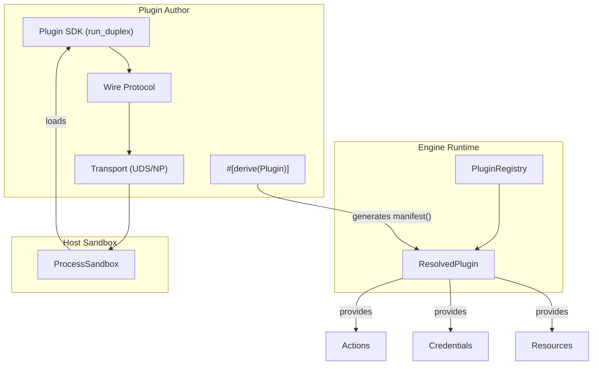
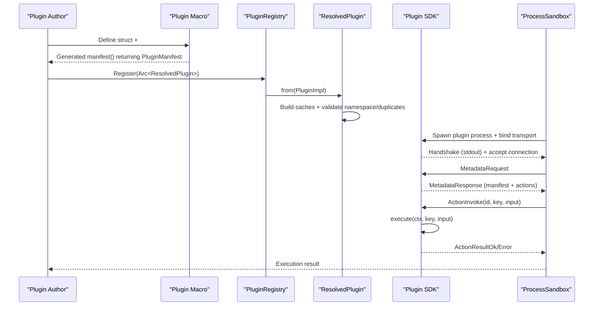
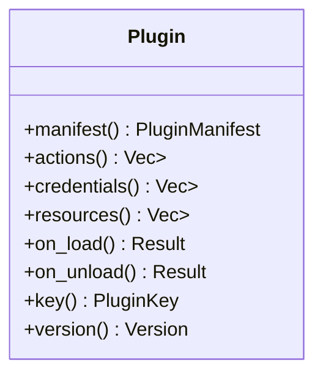
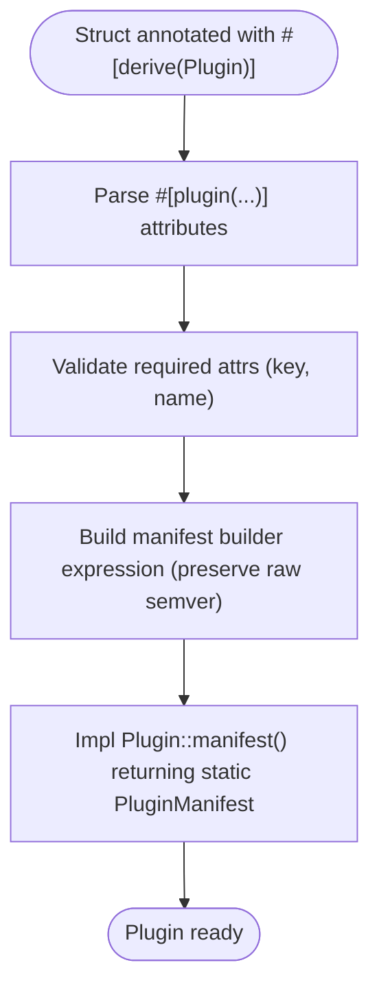
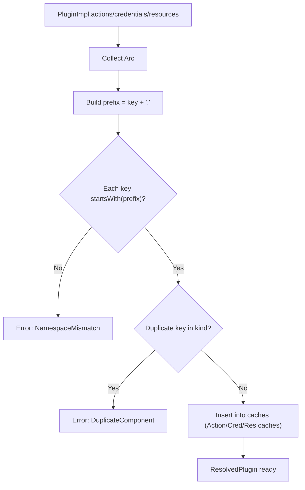
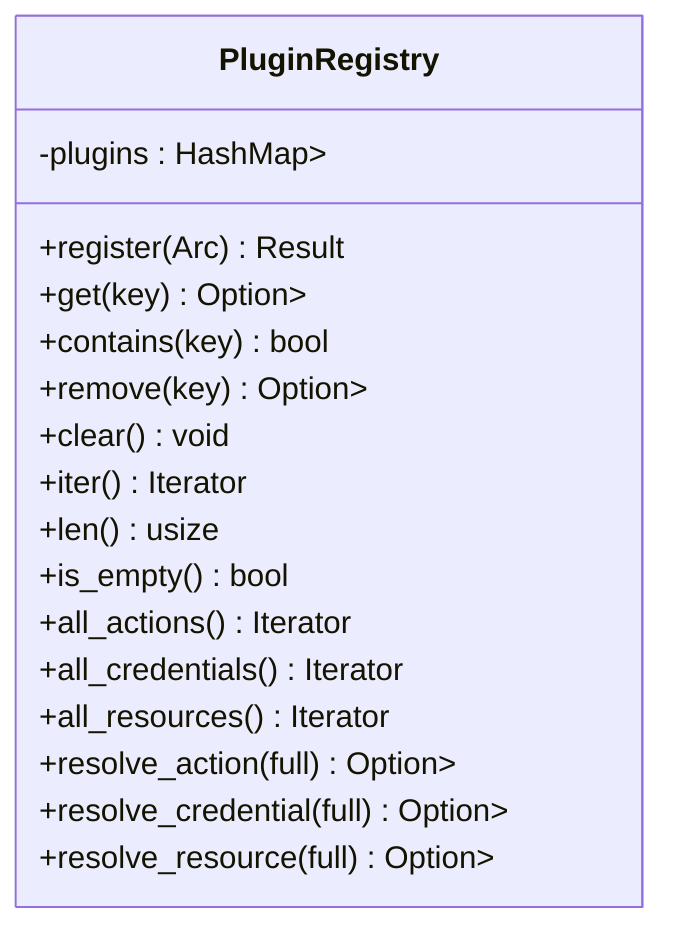
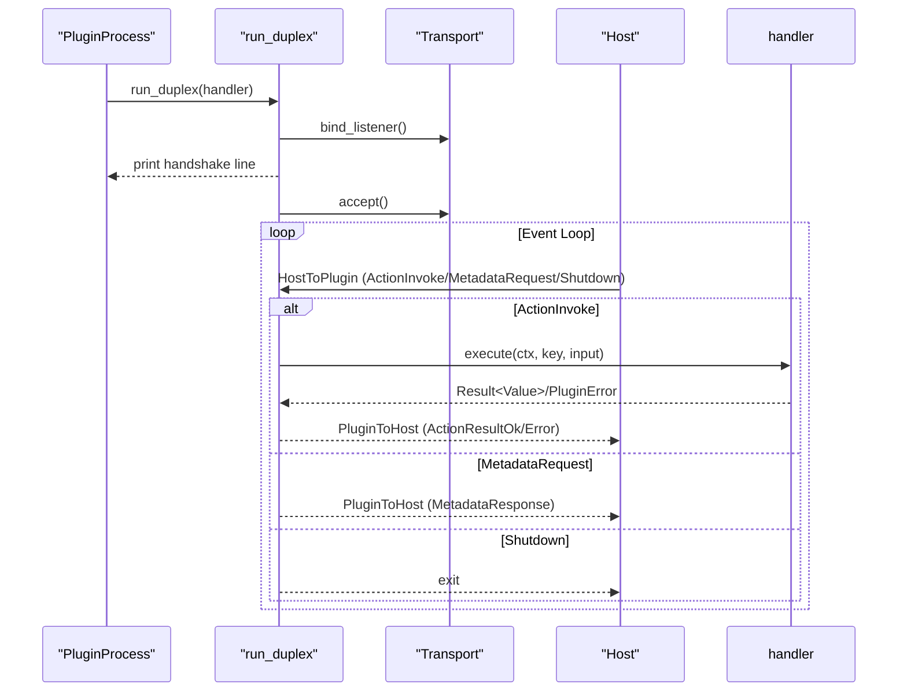
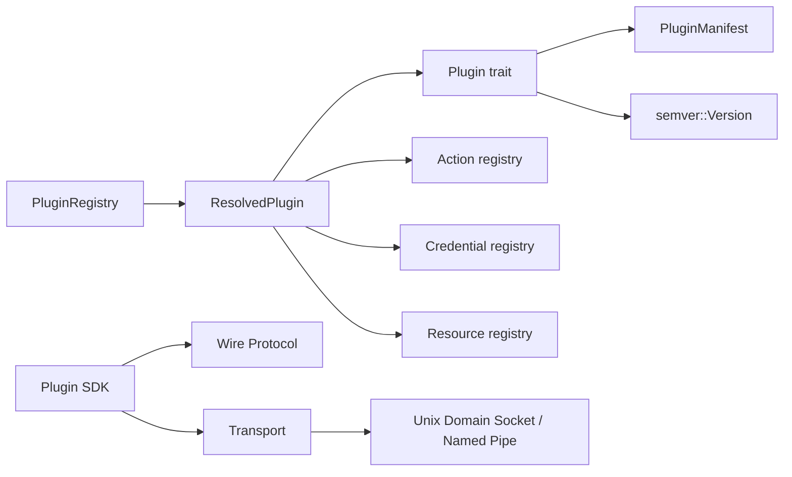

# Plugin Development

<cite>
**Referenced Files in This Document**
- [lib.rs](file://crates/plugin/src/lib.rs)
- [plugin.rs](file://crates/plugin/src/plugin.rs)
- [manifest.rs](file://crates/plugin/src/manifest.rs)
- [registry.rs](file://crates/plugin/src/registry.rs)
- [resolved_plugin.rs](file://crates/plugin/src/resolved_plugin.rs)
- [error.rs](file://crates/plugin/src/error.rs)
- [lib.rs (plugin macros)](file://crates/plugin/macros/src/lib.rs)
- [plugin.rs (plugin macros)](file://crates/plugin/macros/src/plugin.rs)
- [plugin_attrs.rs (plugin macros)](file://crates/plugin/macros/src/plugin_attrs.rs)
- [derive_plugin.rs (plugin tests)](file://crates/plugin/tests/derive_plugin.rs)
- [lib.rs (plugin-sdk)](file://crates/plugin-sdk/src/lib.rs)
- [protocol.rs (plugin-sdk)](file://crates/plugin-sdk/src/protocol.rs)
- [transport.rs (plugin-sdk)](file://crates/plugin-sdk/src/transport.rs)
- [sandbox_demo.rs (sandbox example)](file://crates/sandbox/examples/sandbox_demo.rs)
- [community-plugin-test.yaml (CLI example)](file://apps/cli/examples/community-plugin-test.yaml)
- [plugin.rs (CLI command)](file://apps/cli/src/commands/plugin.rs)
</cite>

## Table of Contents
1. [Introduction](#introduction)
2. [Project Structure](#project-structure)
3. [Core Components](#core-components)
4. [Architecture Overview](#architecture-overview)
5. [Detailed Component Analysis](#detailed-component-analysis)
6. [Dependency Analysis](#dependency-analysis)
7. [Performance Considerations](#performance-considerations)
8. [Troubleshooting Guide](#troubleshooting-guide)
9. [Conclusion](#conclusion)
10. [Appendices](#appendices)

## Introduction
This document explains how to develop custom plugins for Nebula’s workflow engine. It covers the Plugin trait, the #[derive(Plugin)] macro, plugin lifecycle, metadata and versioning, namespaces, and practical SDK patterns for building, testing, and distributing plugins. It also describes how plugins integrate with the action framework and how the engine registers and resolves plugin components.

## Project Structure
Nebula’s plugin system spans several crates:
- nebula-plugin: Defines the Plugin trait, plugin manifest types, resolved plugin caching, and the in-memory registry.
- nebula-plugin-sdk: Provides the plugin process runtime, wire protocol, and transport for duplex communication with the host.
- nebula-sandbox: Host-side process sandbox that loads and manages plugin processes and orchestrates IPC.
- CLI and examples: Demonstrate plugin discovery and execution via the CLI and sandbox.

**Diagram sources**
- [plugin.rs:27-84](file://crates/plugin/src/plugin.rs#L27-L84)
- [resolved_plugin.rs:48-71](file://crates/plugin/src/resolved_plugin.rs#L48-L71)
- [registry.rs:39-53](file://crates/plugin/src/registry.rs#L39-L53)
- [lib.rs (plugin-sdk):188-242](file://crates/plugin-sdk/src/lib.rs#L188-L242)
- [protocol.rs (plugin-sdk):39-84](file://crates/plugin-sdk/src/protocol.rs#L39-L84)
- [transport.rs (plugin-sdk):65-98](file://crates/plugin-sdk/src/transport.rs#L65-L98)

**Section sources**
- [lib.rs:1-50](file://crates/plugin/src/lib.rs#L1-L50)
- [plugin.rs:1-27](file://crates/plugin/src/plugin.rs#L1-L27)
- [lib.rs (plugin-sdk):1-84](file://crates/plugin-sdk/src/lib.rs#L1-L84)

## Core Components
- Plugin trait: Declares manifest(), actions(), credentials(), resources(), on_load(), on_unload(), and forwards key()/version() to the manifest.
- #[derive(Plugin)]: Procedural macro that generates a static manifest from attributes and implements manifest().
- ResolvedPlugin: Eagerly caches and validates plugin components, enforcing namespace and duplicate-key invariants.
- PluginRegistry: In-memory store keyed by PluginKey, exposing flat iterators over actions/credentials/resources.
- PluginError: Typed errors for plugin operations (not found, already exists, invalid manifest, namespace mismatch, duplicate component).
- PluginManifest: Descriptor with key, name, version, group, and metadata; re-exported from nebula-metadata.
- Plugin SDK: Provides PluginHandler, run_duplex, wire protocol, and transport for plugin processes.

**Section sources**
- [plugin.rs:27-84](file://crates/plugin/src/plugin.rs#L27-L84)
- [lib.rs (plugin macros):15-43](file://crates/plugin/macros/src/lib.rs#L15-L43)
- [plugin.rs (plugin macros):19-47](file://crates/plugin/macros/src/plugin.rs#L19-L47)
- [plugin_attrs.rs (plugin macros):28-96](file://crates/plugin/macros/src/plugin_attrs.rs#L28-L96)
- [resolved_plugin.rs:29-71](file://crates/plugin/src/resolved_plugin.rs#L29-L71)
- [registry.rs:39-89](file://crates/plugin/src/registry.rs#L39-L89)
- [error.rs:28-70](file://crates/plugin/src/error.rs#L28-L70)
- [manifest.rs:10-11](file://crates/plugin/src/manifest.rs#L10-L11)
- [lib.rs (plugin-sdk):156-186](file://crates/plugin-sdk/src/lib.rs#L156-L186)

## Architecture Overview
The plugin lifecycle integrates trait-based declaration, macro-driven manifest generation, runtime resolution, and sandboxed execution.

**Diagram sources**
- [plugin.rs (plugin macros):19-47](file://crates/plugin/macros/src/plugin.rs#L19-L47)
- [resolved_plugin.rs:48-71](file://crates/plugin/src/resolved_plugin.rs#L48-L71)
- [registry.rs:46-53](file://crates/plugin/src/registry.rs#L46-L53)
- [lib.rs (plugin-sdk):188-242](file://crates/plugin-sdk/src/lib.rs#L188-L242)
- [protocol.rs (plugin-sdk):77-84](file://crates/plugin-sdk/src/protocol.rs#L77-L84)
- [transport.rs (plugin-sdk):65-98](file://crates/plugin-sdk/src/transport.rs#L65-L98)

## Detailed Component Analysis

### Plugin Trait and Lifecycle
- manifest(): Static descriptor for the plugin bundle.
- actions()/credentials()/resources(): Provide the actual runnable components. Defaults return empty collections.
- on_load()/on_unload(): One-time initialization and cleanup hooks. on_load() must succeed before the engine calls other methods.
- key()/version(): Forwarded from the manifest.

**Diagram sources**
- [plugin.rs:27-84](file://crates/plugin/src/plugin.rs#L27-L84)

**Section sources**
- [plugin.rs:27-84](file://crates/plugin/src/plugin.rs#L27-L84)

### #[derive(Plugin)] Macro
- Container attributes: key, name, description, version (semver), group (UI hierarchy).
- Emits a static manifest via a OnceLock-initialized expression, preserving full semver including pre-release/build metadata.
- Validates version at compile time and ensures the struct is a unit struct.

**Diagram sources**
- [lib.rs (plugin macros):15-43](file://crates/plugin/macros/src/lib.rs#L15-L43)
- [plugin.rs (plugin macros):19-47](file://crates/plugin/macros/src/plugin.rs#L19-L47)
- [plugin_attrs.rs (plugin macros):28-96](file://crates/plugin/macros/src/plugin_attrs.rs#L28-L96)

**Section sources**
- [lib.rs (plugin macros):15-43](file://crates/plugin/macros/src/lib.rs#L15-L43)
- [plugin.rs (plugin macros):19-47](file://crates/plugin/macros/src/plugin.rs#L19-L47)
- [plugin_attrs.rs (plugin macros):28-96](file://crates/plugin/macros/src/plugin_attrs.rs#L28-L96)
- [derive_plugin.rs (plugin tests):28-66](file://crates/plugin/tests/derive_plugin.rs#L28-L66)

### ResolvedPlugin: Validation and Caching
- Enforces namespace invariants: every component key must start with "<plugin.key>.".
- Detects duplicates within a plugin for the same component kind.
- Builds O(1) HashMap caches for actions, credentials, and resources.

**Diagram sources**
- [resolved_plugin.rs:123-206](file://crates/plugin/src/resolved_plugin.rs#L123-L206)

**Section sources**
- [resolved_plugin.rs:48-71](file://crates/plugin/src/resolved_plugin.rs#L48-L71)
- [resolved_plugin.rs:123-206](file://crates/plugin/src/resolved_plugin.rs#L123-L206)
- [error.rs:44-69](file://crates/plugin/src/error.rs#L44-L69)

### PluginRegistry: Discovery and Resolution
- Registers ResolvedPlugin by PluginKey.
- Provides flat iterators over all actions/credentials/resources across all plugins.
- Supports resolve_action/resolve_credential/resolve_resource by full keys.

**Diagram sources**
- [registry.rs:39-154](file://crates/plugin/src/registry.rs#L39-L154)

**Section sources**
- [registry.rs:39-154](file://crates/plugin/src/registry.rs#L39-L154)

### Plugin SDK: Execution Loop and Protocol
- PluginHandler: Implement manifest(), actions(), execute().
- run_duplex: Binds transport, prints handshake, accepts one connection, runs event loop.
- Wire protocol: HostToPlugin and PluginToHost envelopes; line-delimited JSON.
- Transport: Unix domain socket or Windows named pipe; handshake format includes protocol version and address.

**Diagram sources**
- [lib.rs (plugin-sdk):188-242](file://crates/plugin-sdk/src/lib.rs#L188-L242)
- [protocol.rs (plugin-sdk):39-84](file://crates/plugin-sdk/src/protocol.rs#L39-L84)
- [protocol.rs (plugin-sdk):86-155](file://crates/plugin-sdk/src/protocol.rs#L86-L155)
- [transport.rs (plugin-sdk):65-98](file://crates/plugin-sdk/src/transport.rs#L65-L98)

**Section sources**
- [lib.rs (plugin-sdk):156-186](file://crates/plugin-sdk/src/lib.rs#L156-L186)
- [lib.rs (plugin-sdk):188-242](file://crates/plugin-sdk/src/lib.rs#L188-L242)
- [protocol.rs (plugin-sdk):39-84](file://crates/plugin-sdk/src/protocol.rs#L39-L84)
- [protocol.rs (plugin-sdk):86-155](file://crates/plugin-sdk/src/protocol.rs#L86-L155)
- [transport.rs (plugin-sdk):65-98](file://crates/plugin-sdk/src/transport.rs#L65-L98)

### Plugin Metadata, Versioning, and Namespaces
- Metadata: key, name, description, version (semver), group (UI grouping).
- Versioning: Full semver including pre-release and build metadata is preserved and parsed at runtime.
- Namespaces: Component keys must be prefixed by "<plugin.key>." to avoid NamespaceMismatch errors.

**Section sources**
- [plugin_attrs.rs (plugin macros):28-96](file://crates/plugin/macros/src/plugin_attrs.rs#L28-L96)
- [derive_plugin.rs (plugin tests):28-66](file://crates/plugin/tests/derive_plugin.rs#L28-L66)
- [resolved_plugin.rs:123-147](file://crates/plugin/src/resolved_plugin.rs#L123-L147)

### Testing Patterns and Examples
- SDK tests demonstrate PluginError::fatal/retryable, bounded line reads, and event-loop behavior.
- Sandbox example demonstrates long-lived plugin process behavior and error propagation.

**Section sources**
- [lib.rs (plugin-sdk):392-514](file://crates/plugin-sdk/src/lib.rs#L392-L514)
- [sandbox_demo.rs (sandbox example):1-142](file://crates/sandbox/examples/sandbox_demo.rs#L1-L142)

### Practical Examples: Stateless and Stateful Actions, Credentials, and Resources
- Stateless action example: Echo action that returns input unchanged.
- Stateful action example: Counter fixture demonstrating persistent state across invocations.
- Credential and resource integration: Plugins declare credentials/resources via credentials() and resources(); the engine resolves them by full keys.

Note: Concrete code examples are referenced by file paths rather than included inline.

**Section sources**
- [lib.rs (plugin-sdk):17-65](file://crates/plugin-sdk/src/lib.rs#L17-L65)
- [sandbox_demo.rs (sandbox example):1-142](file://crates/sandbox/examples/sandbox_demo.rs#L1-L142)

### Plugin Compilation, Packaging, and Distribution
- CLI discovers community plugins placed under project-local and global plugin directories.
- Community plugin test workflow demonstrates invoking plugin actions via the CLI and sandbox.

**Section sources**
- [plugin.rs (CLI command):51-67](file://apps/cli/src/commands/plugin.rs#L51-L67)
- [community-plugin-test.yaml (CLI example):1-32](file://apps/cli/examples/community-plugin-test.yaml#L1-L32)

## Dependency Analysis
- Plugin trait depends on nebula_metadata::PluginManifest and semver::Version.
- ResolvedPlugin depends on action/credential/resource registries and enforces namespace invariants.
- PluginRegistry aggregates ResolvedPlugin instances and exposes flat iterators.
- Plugin SDK depends on protocol and transport for IPC; transport depends on platform-specific sockets/pipes.

**Diagram sources**
- [plugin.rs:10-12](file://crates/plugin/src/plugin.rs#L10-L12)
- [resolved_plugin.rs:14-19](file://crates/plugin/src/resolved_plugin.rs#L14-L19)
- [registry.rs:39-53](file://crates/plugin/src/registry.rs#L39-L53)
- [lib.rs (plugin-sdk):91-94](file://crates/plugin-sdk/src/lib.rs#L91-L94)
- [transport.rs (plugin-sdk):26-27](file://crates/plugin-sdk/src/transport.rs#L26-L27)

**Section sources**
- [plugin.rs:10-12](file://crates/plugin/src/plugin.rs#L10-L12)
- [resolved_plugin.rs:14-19](file://crates/plugin/src/resolved_plugin.rs#L14-L19)
- [registry.rs:39-53](file://crates/plugin/src/registry.rs#L39-L53)
- [lib.rs (plugin-sdk):91-94](file://crates/plugin-sdk/src/lib.rs#L91-L94)
- [transport.rs (plugin-sdk):26-27](file://crates/plugin-sdk/src/transport.rs#L26-L27)

## Performance Considerations
- ResolvedPlugin caches provide O(1) component lookup after initial eager indexing.
- Registry flat iterators enable bulk registration and UI catalogs without repeated lookups.
- SDK event loop is sequential in slice 1c; parallelism is planned for slice 1d.

[No sources needed since this section provides general guidance]

## Troubleshooting Guide
Common issues and resolutions:
- NamespaceMismatch: Ensure all component keys start with "<plugin.key>.".
- DuplicateComponent: Fix duplicate keys within the same plugin for the same component kind.
- AlreadyExists: Avoid registering the same PluginKey twice.
- InvalidManifest: Validate PluginManifest builder arguments and semver string.
- Transport handshake errors: Verify protocol version and transport kind in handshake line.

**Section sources**
- [error.rs:44-69](file://crates/plugin/src/error.rs#L44-L69)
- [error.rs:34-42](file://crates/plugin/src/error.rs#L34-L42)
- [transport.rs (plugin-sdk):364-421](file://crates/plugin-sdk/src/transport.rs#L364-L421)

## Conclusion
Nebula’s plugin system offers a robust, object-safe trait-based model with automatic manifest generation, strict namespace enforcement, and efficient runtime resolution. The SDK and transport provide a stable IPC foundation for long-lived plugin processes. By following the patterns outlined here—implementing Plugin, using #[derive(Plugin)], and leveraging ResolvedPlugin and PluginRegistry—you can build reliable, versioned plugins that integrate seamlessly with the action framework.

## Appendices

### Best Practices
- Keep Plugin implementations minimal and delegate heavy logic to actions/credentials/resources.
- Use #[derive(Plugin)] attributes to centralize metadata and preserve semver fidelity.
- Enforce namespace discipline to prevent collisions and simplify debugging.
- Implement on_load() for idempotent initialization and on_unload() for cleanup.
- Prefer deterministic component keys and clear descriptions for UI and catalog systems.

[No sources needed since this section provides general guidance]