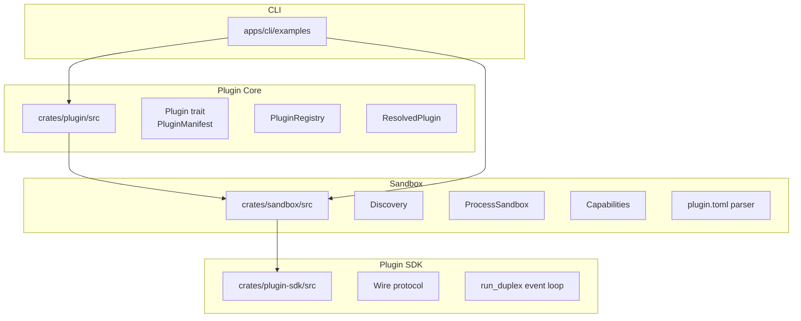
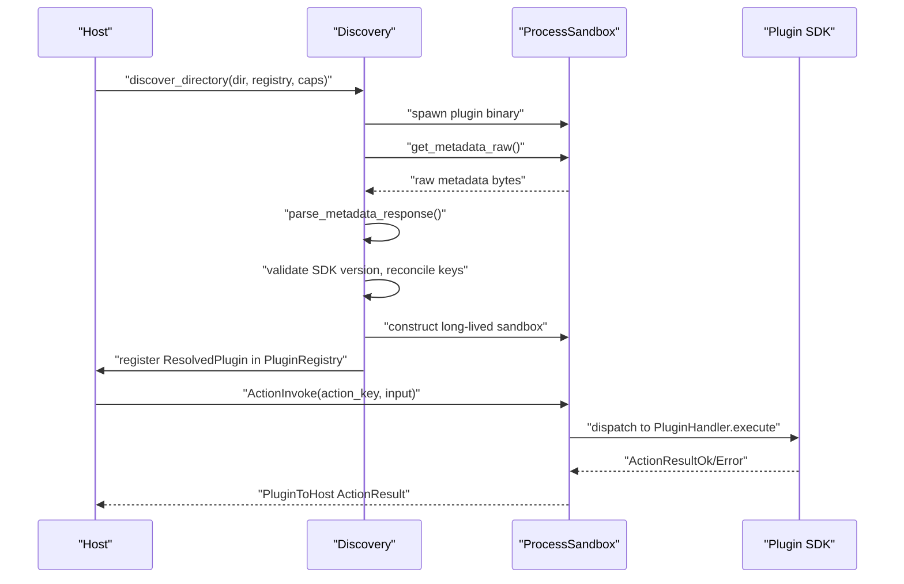
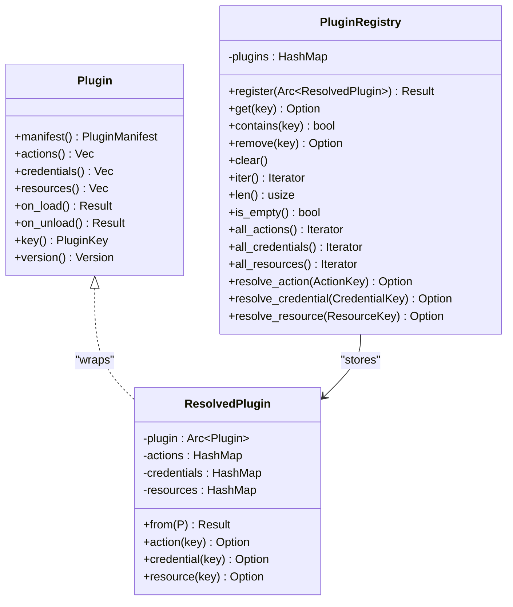
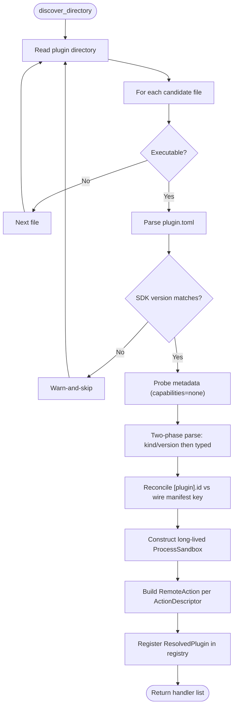
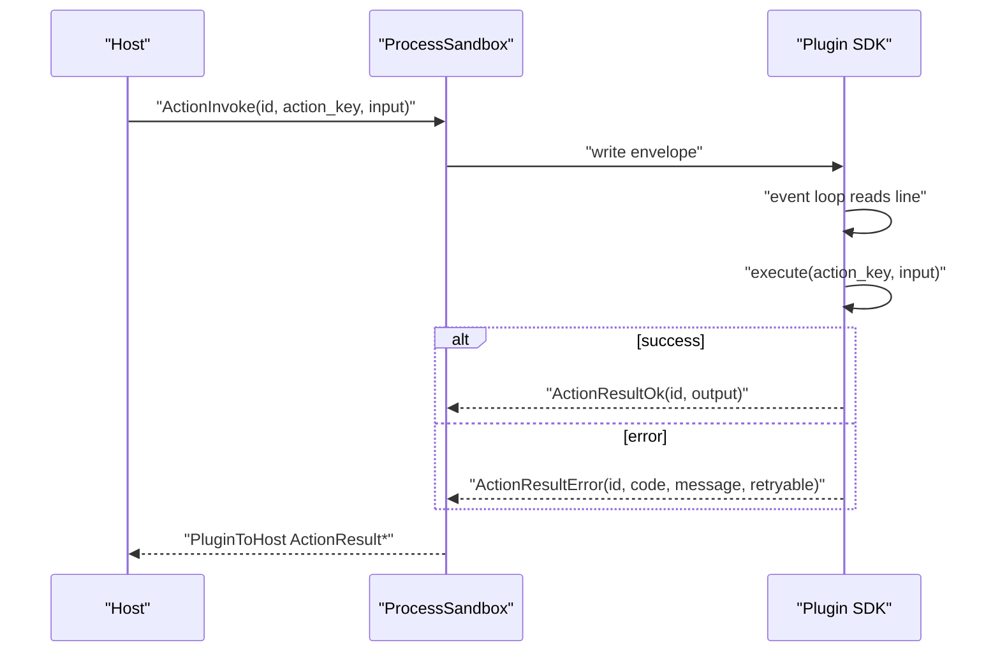
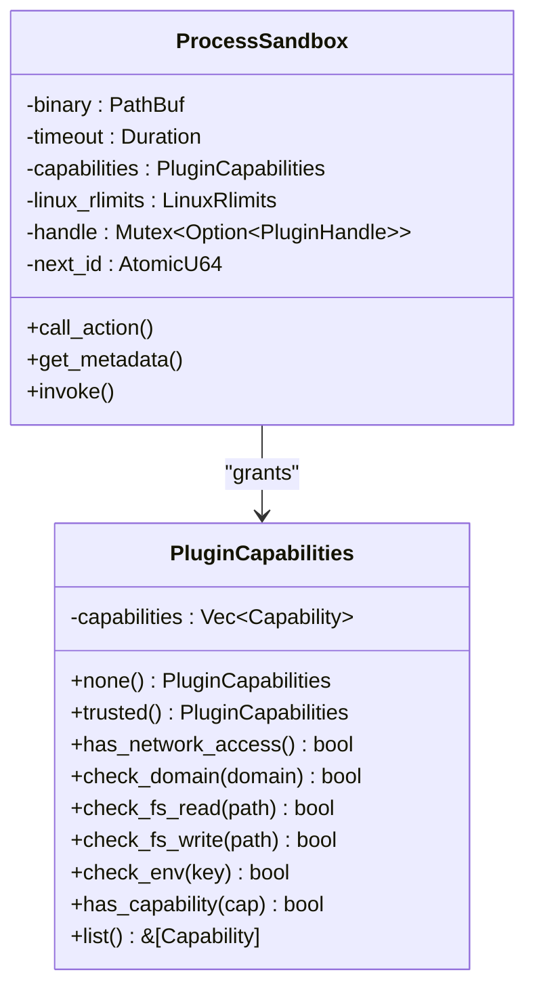
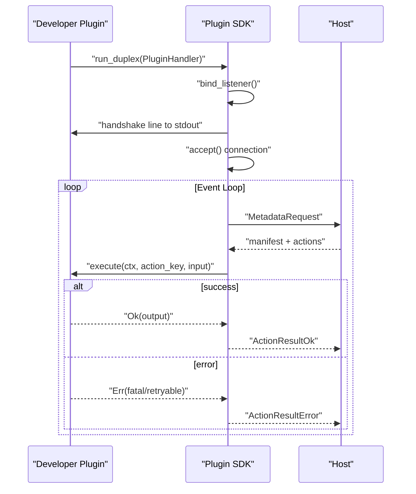
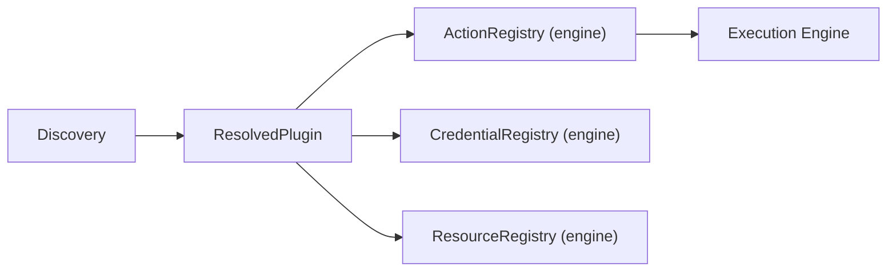
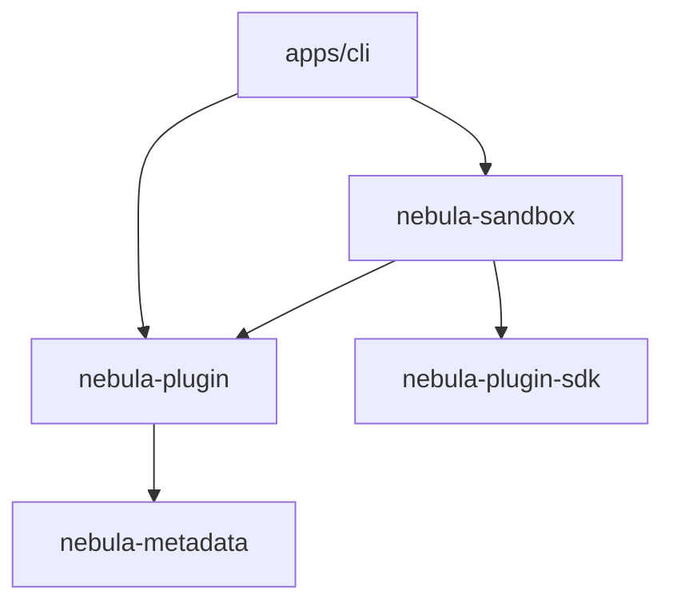

# Plugin System

<cite>
**Referenced Files in This Document**
- [lib.rs](file://crates/plugin/src/lib.rs)
- [manifest.rs](file://crates/plugin/src/manifest.rs)
- [plugin.rs](file://crates/plugin/src/plugin.rs)
- [registry.rs](file://crates/plugin/src/registry.rs)
- [resolved_plugin.rs](file://crates/plugin/src/resolved_plugin.rs)
- [lib.rs](file://crates/plugin/macros/src/lib.rs)
- [lib.rs](file://crates/sandbox/src/lib.rs)
- [discovery.rs](file://crates/sandbox/src/discovery.rs)
- [process.rs](file://crates/sandbox/src/process.rs)
- [capabilities.rs](file://crates/sandbox/src/capabilities.rs)
- [plugin_toml.rs](file://crates/sandbox/src/plugin_toml.rs)
- [lib.rs](file://crates/plugin-sdk/src/lib.rs)
- [protocol.rs](file://crates/plugin-sdk/src/protocol.rs)
- [community-plugin-test.yaml](file://apps/cli/examples/community-plugin-test.yaml)
</cite>

## Table of Contents
1. [Introduction](#introduction)
2. [Project Structure](#project-structure)
3. [Core Components](#core-components)
4. [Architecture Overview](#architecture-overview)
5. [Detailed Component Analysis](#detailed-component-analysis)
6. [Dependency Analysis](#dependency-analysis)
7. [Performance Considerations](#performance-considerations)
8. [Troubleshooting Guide](#troubleshooting-guide)
9. [Conclusion](#conclusion)
10. [Appendices](#appendices)

## Introduction
This document explains Nebula’s Plugin System with a focus on dynamic plugin loading and capability-based sandboxing. It covers:
- The plugin manifest system and metadata
- The plugin registry for discovery, loading, and lifecycle management
- Out-of-process plugin communication via a duplex JSON protocol
- Capability allowlists and sandboxing boundaries
- The plugin SDK for building custom actions
- Configuration options for plugin paths, capability grants, and security policies
- How plugins integrate with the action framework and extend workflow capabilities
- Best practices, security considerations, and troubleshooting

## Project Structure
The Plugin System spans several crates:
- Plugin core: manifest, trait, registry, and resolved plugin caching
- Sandbox: discovery, capability model, process sandbox, and transport
- Plugin SDK: wire protocol, transport, and event loop for plugin processes
- CLI examples: end-to-end workflow that exercises community plugins

**Diagram sources**
- [lib.rs:1-50](file://crates/plugin/src/lib.rs#L1-L50)
- [lib.rs:1-56](file://crates/sandbox/src/lib.rs#L1-L56)
- [lib.rs:1-515](file://crates/plugin-sdk/src/lib.rs#L1-L515)
- [community-plugin-test.yaml:1-33](file://apps/cli/examples/community-plugin-test.yaml#L1-L33)

**Section sources**
- [lib.rs:1-50](file://crates/plugin/src/lib.rs#L1-L50)
- [lib.rs:1-56](file://crates/sandbox/src/lib.rs#L1-L56)
- [lib.rs:1-515](file://crates/plugin-sdk/src/lib.rs#L1-L515)
- [community-plugin-test.yaml:1-33](file://apps/cli/examples/community-plugin-test.yaml#L1-L33)

## Core Components
- Plugin trait and manifest: define plugin identity, version, and component contributions
- Registry: in-memory store keyed by plugin key
- ResolvedPlugin: eager caching and namespace validation for actions, credentials, and resources
- Discovery: scans plugin directories, validates SDK compatibility, probes metadata, reconciles keys, and constructs resolved plugins
- ProcessSandbox: long-lived child process with capability-limited transport and bounded I/O
- PluginCapabilities: allowlist model for network, filesystem, environment, and platform features
- plugin.toml: SDK version constraint and optional id guard
- Plugin SDK: run_duplex event loop, wire protocol, and handler interface

**Section sources**
- [plugin.rs:1-125](file://crates/plugin/src/plugin.rs#L1-L125)
- [manifest.rs:1-11](file://crates/plugin/src/manifest.rs#L1-L11)
- [registry.rs:1-232](file://crates/plugin/src/registry.rs#L1-L232)
- [resolved_plugin.rs:1-208](file://crates/plugin/src/resolved_plugin.rs#L1-L208)
- [discovery.rs:1-789](file://crates/sandbox/src/discovery.rs#L1-L789)
- [process.rs:1-800](file://crates/sandbox/src/process.rs#L1-L800)
- [capabilities.rs:1-617](file://crates/sandbox/src/capabilities.rs#L1-L617)
- [plugin_toml.rs:1-143](file://crates/sandbox/src/plugin_toml.rs#L1-L143)
- [lib.rs:1-515](file://crates/plugin-sdk/src/lib.rs#L1-L515)
- [protocol.rs:1-317](file://crates/plugin-sdk/src/protocol.rs#L1-L317)

## Architecture Overview
The system separates concerns across crates:
- Host orchestrates discovery and sandboxing
- Plugins run out-of-process with a strict capability model
- Communication is a duplex JSON envelope over OS-native transport
- Registry exposes a flat action catalog to the engine

**Diagram sources**
- [discovery.rs:445-531](file://crates/sandbox/src/discovery.rs#L445-L531)
- [process.rs:513-582](file://crates/sandbox/src/process.rs#L513-L582)
- [protocol.rs:39-84](file://crates/plugin-sdk/src/protocol.rs#L39-L84)

## Detailed Component Analysis

### Plugin Manifest and Registration
- PluginManifest is re-exported from nebula-metadata and used to describe plugin identity and version
- Plugin trait defines manifest, actions, credentials, resources, and lifecycle hooks
- ResolvedPlugin eagerly builds O(1) indices and enforces namespace and duplicate checks
- PluginRegistry stores ResolvedPlugin keyed by PluginKey and exposes flat iterators for engine bootstrap

**Diagram sources**
- [plugin.rs:16-84](file://crates/plugin/src/plugin.rs#L16-L84)
- [resolved_plugin.rs:23-207](file://crates/plugin/src/resolved_plugin.rs#L23-L207)
- [registry.rs:34-154](file://crates/plugin/src/registry.rs#L34-L154)

**Section sources**
- [manifest.rs:1-11](file://crates/plugin/src/manifest.rs#L1-L11)
- [plugin.rs:16-84](file://crates/plugin/src/plugin.rs#L16-L84)
- [resolved_plugin.rs:48-207](file://crates/plugin/src/resolved_plugin.rs#L48-L207)
- [registry.rs:34-154](file://crates/plugin/src/registry.rs#L34-L154)

### Discovery and Dynamic Loading
- discover_directory scans a directory for plugin binaries, validates SDK constraints, probes metadata, reconciles keys, and registers resolved plugins
- Per-plugin failures are warn-and-skip; metadata probe runs with no capabilities
- Action descriptors are converted into RemoteAction instances and registered in the engine’s ActionRegistry

**Diagram sources**
- [discovery.rs:445-531](file://crates/sandbox/src/discovery.rs#L445-L531)
- [discovery.rs:113-196](file://crates/sandbox/src/discovery.rs#L113-L196)
- [discovery.rs:301-441](file://crates/sandbox/src/discovery.rs#L301-L441)

**Section sources**
- [discovery.rs:445-531](file://crates/sandbox/src/discovery.rs#L445-L531)
- [discovery.rs:113-196](file://crates/sandbox/src/discovery.rs#L113-L196)
- [discovery.rs:301-441](file://crates/sandbox/src/discovery.rs#L301-L441)

### Out-of-Process Communication Protocol
- Duplex line-delimited JSON envelopes over OS-native transport (UDS/Named Pipe)
- HostToPlugin: ActionInvoke, MetadataRequest, Cancel, RpcResponseOk/Error, Shutdown
- PluginToHost: ActionResultOk/Error, RpcCall, Log, MetadataResponse
- Correlation ids are echoed for response matching; plugin processes are sequential in slice 1c

**Diagram sources**
- [protocol.rs:39-84](file://crates/plugin-sdk/src/protocol.rs#L39-L84)
- [protocol.rs:86-155](file://crates/plugin-sdk/src/protocol.rs#L86-L155)
- [process.rs:498-582](file://crates/sandbox/src/process.rs#L498-L582)

**Section sources**
- [protocol.rs:39-155](file://crates/plugin-sdk/src/protocol.rs#L39-L155)
- [process.rs:498-582](file://crates/sandbox/src/process.rs#L498-L582)

### Sandbox Environment and Capability Allowlists
- ProcessSandbox maintains a long-lived handle to a child process and serializes envelopes
- Transport is bounded: handshake, envelope, and stderr line caps; oversized lines poison the transport
- PluginCapabilities supports network, filesystem, env, process spawn, system info, and desktop features
- Path and domain checks enforce strict containment and reject symlink escapes

**Diagram sources**
- [process.rs:86-117](file://crates/sandbox/src/process.rs#L86-L117)
- [capabilities.rs:73-178](file://crates/sandbox/src/capabilities.rs#L73-L178)

**Section sources**
- [process.rs:86-117](file://crates/sandbox/src/process.rs#L86-L117)
- [process.rs:160-269](file://crates/sandbox/src/process.rs#L160-L269)
- [capabilities.rs:73-178](file://crates/sandbox/src/capabilities.rs#L73-L178)
- [capabilities.rs:180-338](file://crates/sandbox/src/capabilities.rs#L180-L338)

### Plugin SDK for Developing Custom Actions
- Implement PluginHandler with manifest, actions, and execute
- run_duplex binds transport, prints handshake, and runs the event loop
- Enforces frame caps and graceful shutdown; logs malformed frames

**Diagram sources**
- [lib.rs:188-242](file://crates/plugin-sdk/src/lib.rs#L188-L242)
- [protocol.rs:39-84](file://crates/plugin-sdk/src/protocol.rs#L39-L84)
- [protocol.rs:86-155](file://crates/plugin-sdk/src/protocol.rs#L86-L155)

**Section sources**
- [lib.rs:188-242](file://crates/plugin-sdk/src/lib.rs#L188-L242)
- [protocol.rs:39-155](file://crates/plugin-sdk/src/protocol.rs#L39-L155)

### Relationship with the Action Framework
- Discovery builds RemoteAction instances and coerces them to Action and StatelessHandler for engine registries
- ResolvedPlugin exposes flat iterators over actions, credentials, and resources for engine bootstrapping
- CLI example workflow demonstrates invoking community plugin actions

**Diagram sources**
- [discovery.rs:445-531](file://crates/sandbox/src/discovery.rs#L445-L531)
- [registry.rs:90-154](file://crates/plugin/src/registry.rs#L90-L154)

**Section sources**
- [discovery.rs:445-531](file://crates/sandbox/src/discovery.rs#L445-L531)
- [registry.rs:90-154](file://crates/plugin/src/registry.rs#L90-L154)
- [community-plugin-test.yaml:13-30](file://apps/cli/examples/community-plugin-test.yaml#L13-L30)

## Dependency Analysis
- Plugin core depends on nebula-metadata for manifests and semver for versions
- Sandbox depends on plugin-sdk protocol and transport, and on plugin core types for registry integration
- Plugin SDK depends on wire protocol and transport abstractions
- CLI examples depend on the action framework and plugin registry

**Diagram sources**
- [lib.rs:42-49](file://crates/plugin/src/lib.rs#L42-L49)
- [lib.rs:37-56](file://crates/sandbox/src/lib.rs#L37-L56)
- [lib.rs:85-94](file://crates/plugin-sdk/src/lib.rs#L85-L94)

**Section sources**
- [lib.rs:42-49](file://crates/plugin/src/lib.rs#L42-L49)
- [lib.rs:37-56](file://crates/sandbox/src/lib.rs#L37-L56)
- [lib.rs:85-94](file://crates/plugin-sdk/src/lib.rs#L85-L94)

## Performance Considerations
- Discovery is warn-and-skip resilient and avoids spawning plugins with incompatible SDK versions
- ResolvedPlugin caches component maps for O(1) lookups
- ProcessSandbox reuses long-lived handles; respawns only on stale handle or transport poisoning
- Bounded I/O caps prevent memory exhaustion and support deterministic timeouts
- Two-phase metadata parsing avoids expensive typed parse on version mismatches

[No sources needed since this section provides general guidance]

## Troubleshooting Guide
Common issues and diagnostics:
- Protocol version mismatch during metadata probe surfaces as a clear error before typed parse
- Transport failures and oversized frames poison the transport; host respawns on stale handle
- Key conflicts between plugin.toml id and wire manifest key lead to skip
- Cross-namespace action keys are rejected at discovery time
- SDK version constraints enforced before spawn to avoid wasted resources

**Section sources**
- [discovery.rs:113-196](file://crates/sandbox/src/discovery.rs#L113-L196)
- [discovery.rs:208-247](file://crates/sandbox/src/discovery.rs#L208-L247)
- [process.rs:645-767](file://crates/sandbox/src/process.rs#L645-L767)

## Conclusion
Nebula’s Plugin System combines a robust manifest and registry layer with a capability-based sandbox and a strict duplex protocol. Discovery validates SDK compatibility early, enforces namespace and key integrity, and registers plugins for seamless integration with the action framework. The plugin SDK simplifies building out-of-process actions, while the sandbox provides a correctness boundary with bounded I/O and a capability allowlist model.

[No sources needed since this section summarizes without analyzing specific files]

## Appendices

### Plugin Development Patterns
- Use the derive macro to generate Plugin trait impl from struct attributes
- Define actions with ActionDescriptor and schemas; expose them via PluginHandler
- Respect namespace prefixes and avoid cross-namespace keys

**Section sources**
- [lib.rs:15-43](file://crates/plugin/macros/src/lib.rs#L15-L43)
- [lib.rs:156-186](file://crates/plugin-sdk/src/lib.rs#L156-L186)
- [protocol.rs:173-187](file://crates/plugin-sdk/src/protocol.rs#L173-L187)

### Configuration Options
- plugin.toml
  - [nebula].sdk: semver requirement the plugin was built against
  - [plugin].id: optional guard ensuring wire manifest key matches
- ProcessSandbox
  - default timeout per call
  - default capabilities for long-lived sandbox
  - Linux rlimits override
- Plugin SDK
  - NEBULA_PLUGIN_MAX_FRAME_BYTES: host-to-plugin frame cap

**Section sources**
- [plugin_toml.rs:17-28](file://crates/sandbox/src/plugin_toml.rs#L17-L28)
- [plugin_toml.rs:101-142](file://crates/sandbox/src/plugin_toml.rs#L101-L142)
- [process.rs:466-496](file://crates/sandbox/src/process.rs#L466-L496)
- [lib.rs:336-352](file://crates/plugin-sdk/src/lib.rs#L336-L352)

### Security Considerations
- Metadata probe runs with no capabilities; runtime capabilities applied only at sandbox construction
- Strict path containment and symlink escape prevention
- Transport poisoning on oversized frames; correlation id matching prevents stale response misuse
- Canonical key validation prevents namespace drift and duplicate keys

**Section sources**
- [discovery.rs:19-27](file://crates/sandbox/src/discovery.rs#L19-L27)
- [discovery.rs:130-147](file://crates/sandbox/src/discovery.rs#L130-L147)
- [capabilities.rs:180-338](file://crates/sandbox/src/capabilities.rs#L180-L338)
- [process.rs:694-714](file://crates/sandbox/src/process.rs#L694-L714)