# Resource Management

<cite>
**Referenced Files in This Document**
- [Cargo.toml](file://crates/resource/Cargo.toml)
- [lib.rs](file://crates/resource/src/lib.rs)
- [manager.rs](file://crates/resource/src/manager.rs)
- [mod.rs (topology)](file://crates/resource/src/topology/mod.rs)
- [mod.rs (runtime)](file://crates/resource/src/runtime/mod.rs)
- [mod.rs (recovery)](file://crates/resource/src/recovery/mod.rs)
- [README.md (resource docs)](file://crates/resource/docs/README.md)
- [Architecture.md (resource docs)](file://crates/resource/docs/Architecture.md)
- [Pooling.md (resource docs)](file://crates/resource/docs/Pooling.md)
- [events.md (resource docs)](file://crates/resource/docs/events.md)
- [recovery.md (resource docs)](file://crates/resource/docs/recovery.md)
- [dx-eval-real-world.rs (resource docs)](file://crates/resource/docs/dx-eval-real-world.rs)
- [resource.rs](file://crates/resource/src/resource.rs)
- [handle.rs](file://crates/resource/src/handle.rs)
- [registry.rs](file://crates/resource/src/registry.rs)
- [release_queue.rs](file://crates/resource/src/release_queue.rs)
- [cell.rs](file://crates/resource/src/cell.rs)
- [ctx.rs](file://crates/resource/src/ctx.rs)
- [options.rs](file://crates/resource/src/options.rs)
- [state.rs](file://crates/resource/src/state.rs)
- [events.rs](file://crates/resource/src/events.rs)
- [metrics.rs](file://crates/resource/src/metrics.rs)
- [error.rs](file://crates/resource/src/error.rs)
- [integration.rs](file://crates/resource/src/integration.rs)
- [engine.rs](file://crates/engine/src/engine.rs)
- [resolver.rs](file://crates/engine/src/resolver.rs)
- [resource_accessor.rs](file://crates/engine/src/resource_accessor.rs)
- [execution integration test](file://crates/engine/tests/resource_integration.rs)
- [resource integration test](file://crates/resource/tests/basic_integration.rs)
- [resource dx evaluation](file://crates/resource/tests/dx_evaluation.rs)
- [resource dx audit](file://crates/resource/tests/dx_audit.rs)
- [resource dx eval real-world.rs](file://crates/resource/docs/dx-eval-real-world.rs)
- [bulkhead.rs (resilience)](file://crates/resilience/src/bulkhead.rs)
- [gate.rs (resilience)](file://crates/resilience/src/gate.rs)
- [watchdog.rs (recovery)](file://crates/resource/src/recovery/watchdog.rs)
- [group.rs (recovery)](file://crates/resource/src/recovery/group.rs)
- [pool.rs (runtime)](file://crates/resource/src/runtime/pool.rs)
- [resident.rs (runtime)](file://crates/resource/src/runtime/resident.rs)
- [service.rs (runtime)](file://crates/resource/src/runtime/service.rs)
- [transport.rs (runtime)](file://crates/resource/src/runtime/transport.rs)
- [exclusive.rs (runtime)](file://crates/resource/src/runtime/exclusive.rs)
- [daemon.rs (runtime)](file://crates/resource/src/runtime/daemon.rs)
- [event_source.rs (runtime)](file://crates/resource/src/runtime/event_source.rs)
- [pool_config.rs (topology)](file://crates/resource/src/topology/pooled/config.rs)
- [resident_config.rs (topology)](file://crates/resource/src/topology/resident/config.rs)
- [service_config.rs (topology)](file://crates/resource/src/topology/service/config.rs)
- [transport_config.rs (topology)](file://crates/resource/src/topology/transport/config.rs)
- [exclusive_config.rs (topology)](file://crates/resource/src/topology/exclusive/config.rs)
- [daemon_config.rs (topology)](file://crates/resource/src/topology/daemon/config.rs)
</cite>

## Table of Contents
1. [Introduction](#introduction)
2. [Project Structure](#project-structure)
3. [Core Components](#core-components)
4. [Architecture Overview](#architecture-overview)
5. [Detailed Component Analysis](#detailed-component-analysis)
6. [Dependency Analysis](#dependency-analysis)
7. [Performance Considerations](#performance-considerations)
8. [Troubleshooting Guide](#troubleshooting-guide)
9. [Conclusion](#conclusion)
10. [Appendices](#appendices)

## Introduction
This document explains Nebula’s Resource Management system with a focus on the bulkhead pattern for external service lifecycle management. It covers resource topology patterns (service, transport, daemon, exclusive, resident, pooled, event-source), runtime management (resident, managed, daemon lifecycles), bulkhead isolation, resource pooling strategies, and recovery mechanisms (watchdogs and gates). It also documents the resource manager’s role in coordinating allocation, health checks, and automatic recovery, along with integration with external systems through transport resources and event-driven lifecycles. Configuration options for resource limits, timeouts, and recovery thresholds are explained, and the relationship with the execution layer is clarified.

## Project Structure
The resource management subsystem lives in the nebula-resource crate and integrates with core, resilience, telemetry, and engine crates. The module layout separates concerns into topology traits, runtime implementations, recovery primitives, and orchestration via the Manager.

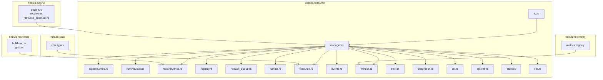

**Diagram sources**
- [lib.rs:1-108](file://crates/resource/src/lib.rs#L1-L108)
- [manager.rs:1-2004](file://crates/resource/src/manager.rs#L1-L2004)
- [mod.rs (topology):1-30](file://crates/resource/src/topology/mod.rs#L1-L30)
- [mod.rs (runtime):1-63](file://crates/resource/src/runtime/mod.rs#L1-L63)
- [mod.rs (recovery):1-14](file://crates/resource/src/recovery/mod.rs#L1-L14)
- [Cargo.toml:1-49](file://crates/resource/Cargo.toml#L1-L49)

**Section sources**
- [Cargo.toml:1-49](file://crates/resource/Cargo.toml#L1-L49)
- [lib.rs:1-108](file://crates/resource/src/lib.rs#L1-L108)

## Core Components
- Manager: central coordinator for registration, acquire dispatch, and shutdown with drain-aware lifecycle and metrics.
- TopologyRuntime: dispatch enum for topology-specific runtimes (pool, resident, service, transport, exclusive, event-source, daemon).
- Recovery layer: gates and watchdogs to prevent thundering herds and coordinate recovery.
- Pooling and residency: pooling strategies for interchangeable instances and shared instances.
- Transport integration: shared connections with multiplexed sessions for external systems.
- Event-driven lifecycle: event emission for observability and lifecycle transitions.

**Section sources**
- [manager.rs:228-800](file://crates/resource/src/manager.rs#L228-L800)
- [mod.rs (runtime):27-63](file://crates/resource/src/runtime/mod.rs#L27-L63)
- [mod.rs (recovery):1-14](file://crates/resource/src/recovery/mod.rs#L1-L14)
- [mod.rs (topology):1-30](file://crates/resource/src/topology/mod.rs#L1-L30)

## Architecture Overview
The Manager owns the Registry, RecoveryGroupRegistry, ReleaseQueue, and emits ResourceEvents. Resources are registered with a topology runtime and scoped by scope level. Acquisition paths route through topology-specific runtimes, optionally wrapped by resilience and recovery gates. Shutdown proceeds through drain and release queue phases with configurable policies.

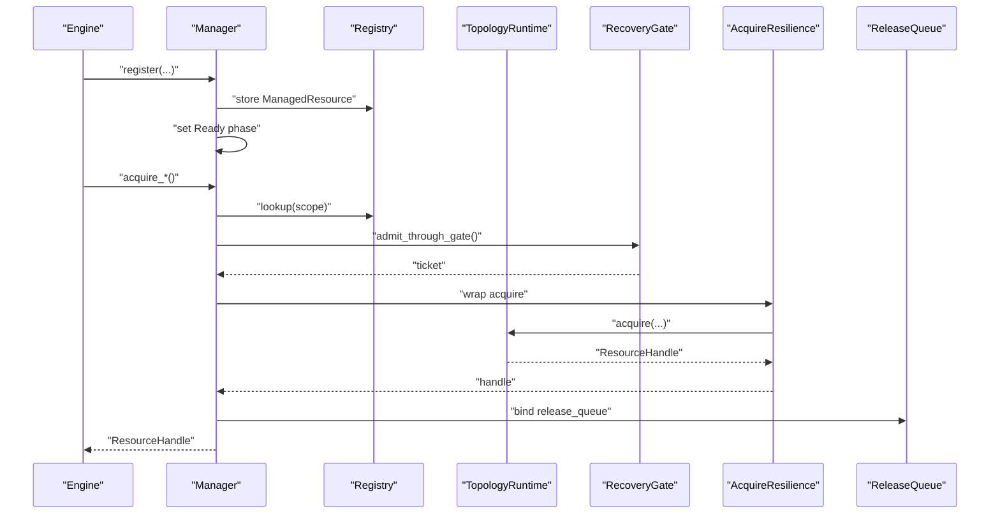

**Diagram sources**
- [manager.rs:292-772](file://crates/resource/src/manager.rs#L292-L772)
- [mod.rs (runtime):27-63](file://crates/resource/src/runtime/mod.rs#L27-L63)
- [mod.rs (recovery):11-14](file://crates/resource/src/recovery/mod.rs#L11-L14)
- [integration.rs](file://crates/resource/src/integration.rs)

## Detailed Component Analysis

### Resource Topology Patterns
Nebula defines seven topology traits, each with a runtime implementation and configuration:

- Pooled: interchangeable instances with checkout/recycle and instance metrics.
- Resident: single shared instance with clone-on-acquire semantics.
- Service: long-lived runtime with short-lived tokens.
- Transport: shared connection with multiplexed sessions.
- Exclusive: mutual exclusion via semaphore(1).
- EventSource: pull-based event subscription.
- Daemon: background run loop with restart policy.

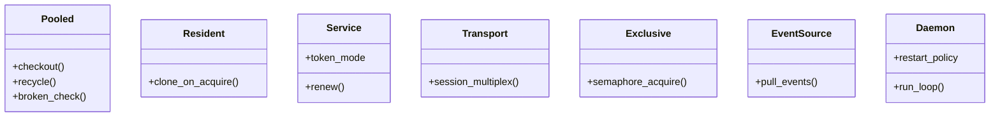

**Diagram sources**
- [mod.rs (topology):15-30](file://crates/resource/src/topology/mod.rs#L15-L30)
- [pool_config.rs](file://crates/resource/src/topology/pooled/config.rs)
- [resident_config.rs](file://crates/resource/src/topology/resident/config.rs)
- [service_config.rs](file://crates/resource/src/topology/service/config.rs)
- [transport_config.rs](file://crates/resource/src/topology/transport/config.rs)
- [exclusive_config.rs](file://crates/resource/src/topology/exclusive/config.rs)
- [daemon_config.rs](file://crates/resource/src/topology/daemon/config.rs)

**Section sources**
- [mod.rs (topology):1-30](file://crates/resource/src/topology/mod.rs#L1-L30)

### Runtime Management: Resident, Managed, and Daemon Lifecycles
- ResidentRuntime: maintains a single instance and clones it on acquire for zero-copy sharing.
- ManagedResource: wraps a Resource with config, topology, release queue, generation, status, resilience, and recovery gate.
- DaemonRuntime: runs a background loop with restart policy and integrates with the ReleaseQueue for cleanup.

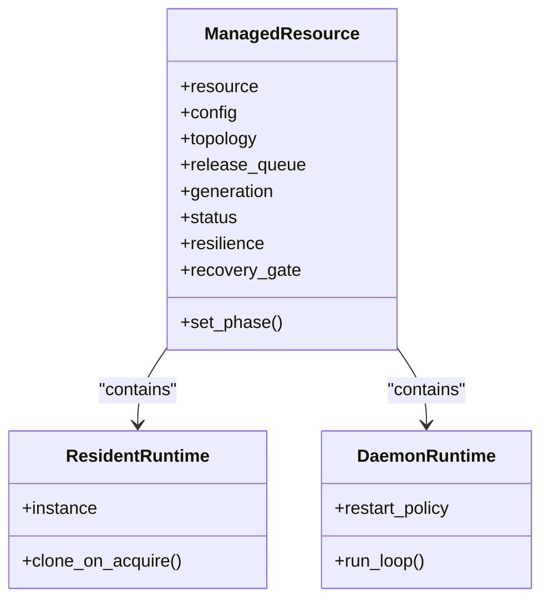

**Diagram sources**
- [manager.rs:329-338](file://crates/resource/src/manager.rs#L329-L338)
- [resident.rs (runtime)](file://crates/resource/src/runtime/resident.rs)
- [daemon.rs (runtime)](file://crates/resource/src/runtime/daemon.rs)

**Section sources**
- [manager.rs:329-338](file://crates/resource/src/manager.rs#L329-L338)
- [resident.rs (runtime)](file://crates/resource/src/runtime/resident.rs)
- [daemon.rs (runtime)](file://crates/resource/src/runtime/daemon.rs)

### Bulkhead Isolation Patterns and Resource Pooling Strategies
Bulkhead isolation is enforced through:
- Recovery gates to serialize recovery attempts and prevent thundering herds.
- Pooling with broken checks and recycle decisions to isolate failing instances.
- Acquire resilience with timeouts and retries to protect downstream callers.
- Drain-aware shutdown with configurable policies to avoid use-after-logical-drop.

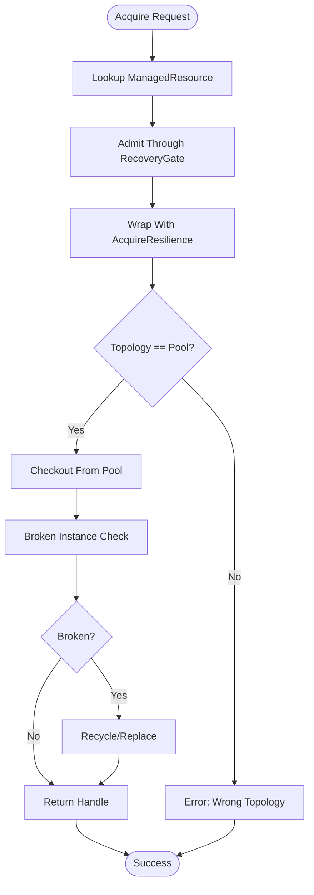

**Diagram sources**
- [manager.rs:706-772](file://crates/resource/src/manager.rs#L706-L772)
- [pool.rs (runtime)](file://crates/resource/src/runtime/pool.rs)
- [mod.rs (recovery):11-14](file://crates/resource/src/recovery/mod.rs#L11-L14)
- [integration.rs](file://crates/resource/src/integration.rs)

**Section sources**
- [manager.rs:706-772](file://crates/resource/src/manager.rs#L706-L772)
- [pool_config.rs](file://crates/resource/src/topology/pooled/config.rs)

### Recovery Mechanisms: Watchdogs and Gates
- RecoveryGate: CAS-based gate per key to serialize recovery and fast-fail transient failures.
- RecoveryGroupRegistry: groups gates by key for coordination.
- WatchdogHandle: background watchdog to monitor and trigger recovery actions.
- Manager integrates gate admission and settlement around acquire operations.

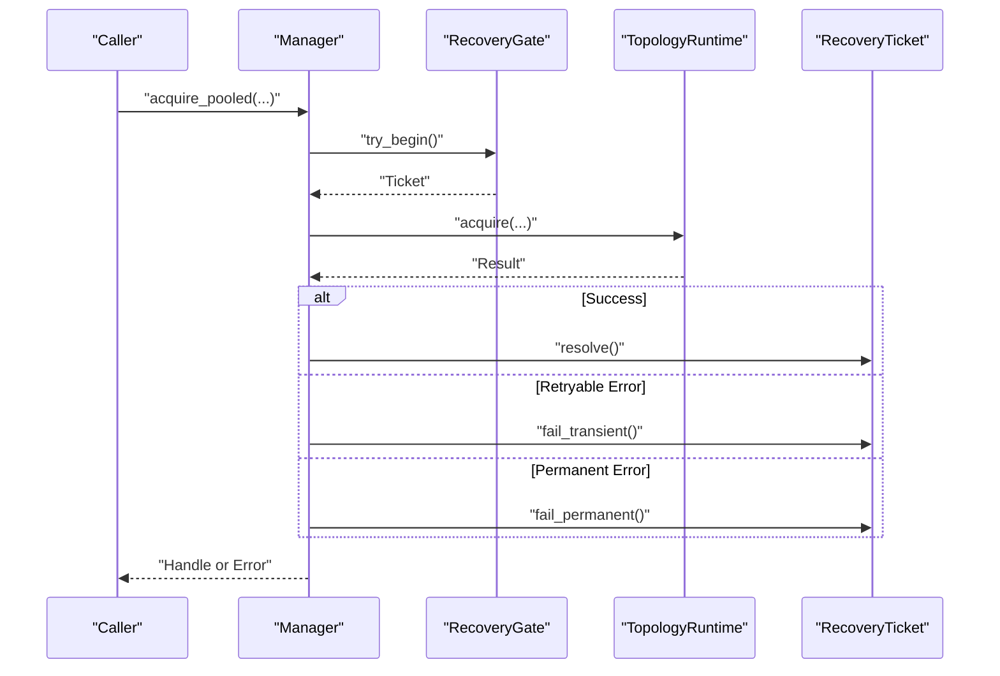

**Diagram sources**
- [manager.rs:732-770](file://crates/resource/src/manager.rs#L732-L770)
- [mod.rs (recovery):11-14](file://crates/resource/src/recovery/mod.rs#L11-L14)
- [gate.rs (resilience)](file://crates/resilience/src/gate.rs)

**Section sources**
- [manager.rs:732-770](file://crates/resource/src/manager.rs#L732-L770)
- [mod.rs (recovery):11-14](file://crates/resource/src/recovery/mod.rs#L11-L14)

### Resource Manager Orchestration
The Manager coordinates registration, acquire dispatch, and shutdown:
- Registration: validates config, creates ManagedResource, sets Ready phase, records metrics, emits Registered event.
- Acquire: scope-aware lookup, gate admission, resilience wrapping, topology dispatch, metric recording, drain tracking.
- Shutdown: cancellation, drain of active handles, release queue drain, optional force-clear with policy.

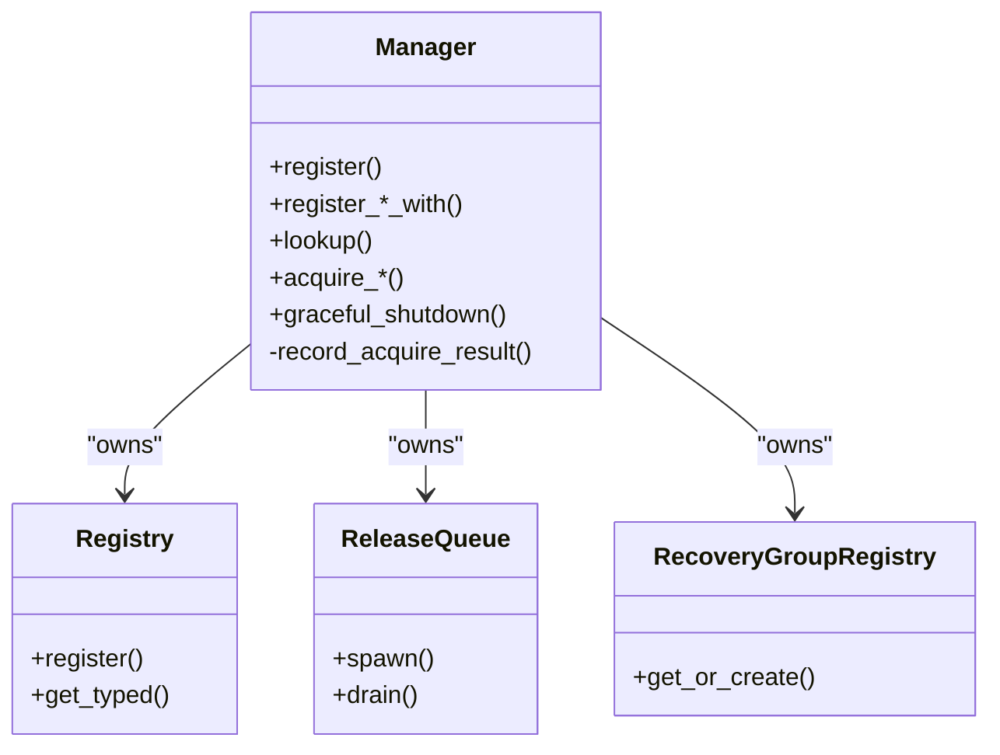

**Diagram sources**
- [manager.rs:228-800](file://crates/resource/src/manager.rs#L228-L800)
- [registry.rs](file://crates/resource/src/registry.rs)
- [release_queue.rs](file://crates/resource/src/release_queue.rs)
- [mod.rs (recovery):12](file://crates/resource/src/recovery/mod.rs#L12)

**Section sources**
- [manager.rs:228-800](file://crates/resource/src/manager.rs#L228-L800)

### Integration with External Systems via Transport Resources
Transport topology enables shared connections with multiplexed sessions, ideal for integrating with external HTTP APIs, databases, or messaging systems. The runtime encapsulates transport lifecycle and session creation, while the Manager binds the ReleaseQueue for cleanup.

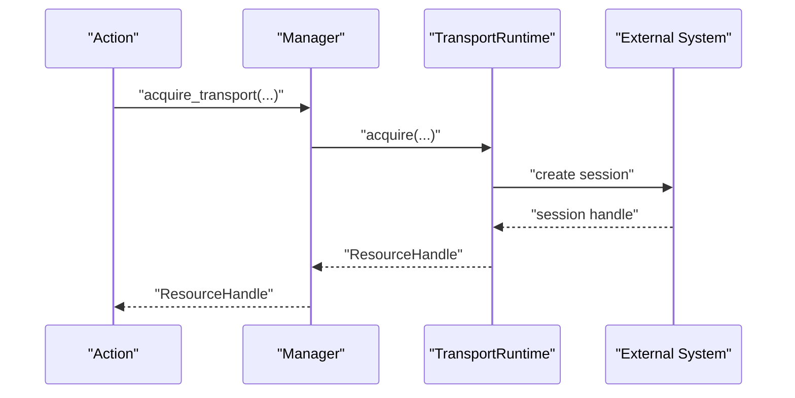

**Diagram sources**
- [manager.rs:489-518](file://crates/resource/src/manager.rs#L489-L518)
- [transport.rs (runtime)](file://crates/resource/src/runtime/transport.rs)
- [transport_config.rs](file://crates/resource/src/topology/transport/config.rs)

**Section sources**
- [manager.rs:489-518](file://crates/resource/src/manager.rs#L489-L518)

### Event-Driven Resource Lifecycle
The Manager emits ResourceEvent for lifecycle stages (Registered, Removed, Acquired, etc.). Consumers can subscribe to a broadcast channel to observe resource activity and drive observability.

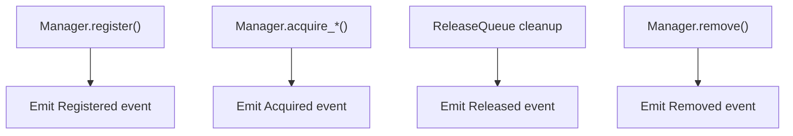

**Diagram sources**
- [manager.rs:354-355](file://crates/resource/src/manager.rs#L354-L355)
- [events.rs](file://crates/resource/src/events.rs)

**Section sources**
- [manager.rs:281-290](file://crates/resource/src/manager.rs#L281-L290)

### Configuration Options: Limits, Timeouts, and Recovery Thresholds
- ManagerConfig: release_queue_workers, optional metrics registry.
- ShutdownConfig: drain_timeout, on_drain_timeout policy, release_queue_timeout.
- RegisterOptions: scope, optional AcquireResilience, optional RecoveryGate.
- Topology configs: PoolConfig, ResidentConfig, ServiceConfig, TransportConfig, ExclusiveConfig, DaemonConfig.

Concrete examples of configuration usage appear in:
- Manager registration methods with topology-specific configs.
- Pool registration with pool-specific config validation and fingerprint initialization.
- Event-driven evaluation and integration tests demonstrate practical usage.

**Section sources**
- [manager.rs:190-227](file://crates/resource/src/manager.rs#L190-L227)
- [manager.rs:361-396](file://crates/resource/src/manager.rs#L361-L396)
- [manager.rs:520-554](file://crates/resource/src/manager.rs#L520-L554)
- [resource dx-eval-real-world.rs](file://crates/resource/docs/dx-eval-real-world.rs)

### Relationship with the Execution Layer
The engine resolves workflow steps and accesses resources via the resource accessor. The resource manager is integrated into the engine’s lifecycle and participates in execution context propagation.

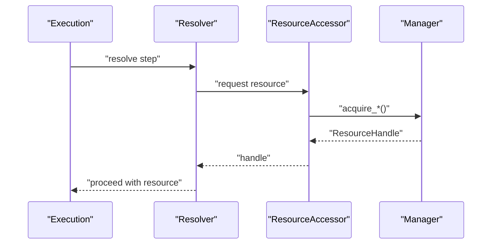

**Diagram sources**
- [resolver.rs](file://crates/engine/src/resolver.rs)
- [resource_accessor.rs](file://crates/engine/src/resource_accessor.rs)
- [engine.rs](file://crates/engine/src/engine.rs)

**Section sources**
- [resolver.rs](file://crates/engine/src/resolver.rs)
- [resource_accessor.rs](file://crates/engine/src/resource_accessor.rs)
- [engine.rs](file://crates/engine/src/engine.rs)

## Dependency Analysis
The nebula-resource crate depends on core, resilience, telemetry, and schema modules. The Manager composes Registry, ReleaseQueue, RecoveryGroupRegistry, and emits ResourceEvents. Topology runtimes depend on their respective topology traits and configurations.

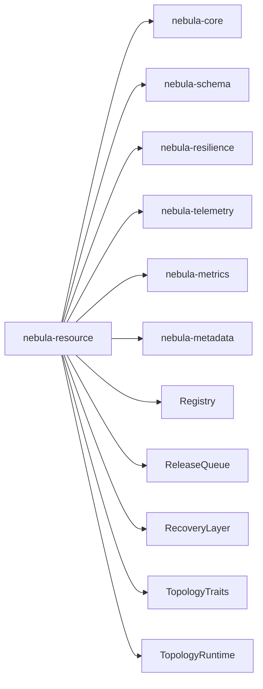

**Diagram sources**
- [Cargo.toml:17-26](file://crates/resource/Cargo.toml#L17-L26)
- [lib.rs:38-108](file://crates/resource/src/lib.rs#L38-L108)

**Section sources**
- [Cargo.toml:17-26](file://crates/resource/Cargo.toml#L17-L26)
- [lib.rs:38-108](file://crates/resource/src/lib.rs#L38-L108)

## Performance Considerations
- Pooling reduces contention and amortizes setup costs; broken checks and recycle decisions improve resilience.
- Recovery gates serialize recovery to avoid cascading failures.
- Metrics registry enables operation counters for telemetry without overhead when disabled.
- Drain-aware shutdown avoids use-after-logical-drop and supports graceful termination.
- ReleaseQueue workers process cleanup asynchronously to minimize impact on acquisition paths.

[No sources needed since this section provides general guidance]

## Troubleshooting Guide
Common issues and diagnostics:
- Drain timeout during shutdown: inspect ShutdownError variants and adjust drain_timeout or policy.
- Outstanding handles after drain: evaluate whether to accept Abort vs Force policy.
- Recovery gate blocking acquisitions: review gate state and transient failure patterns.
- Pool exhaustion or broken instances: verify pool limits, broken checks, and recycle decisions.
- Transport session failures: confirm transport config and session multiplexing behavior.

Operational references:
- Shutdown configuration and error reporting.
- Recovery gate state and ticket settlement.
- Pool and topology configuration validation.
- Integration tests for resource and execution scenarios.

**Section sources**
- [manager.rs:84-181](file://crates/resource/src/manager.rs#L84-L181)
- [manager.rs:732-770](file://crates/resource/src/manager.rs#L732-L770)
- [pool_config.rs](file://crates/resource/src/topology/pooled/config.rs)
- [execution integration test](file://crates/engine/tests/resource_integration.rs)
- [resource integration test](file://crates/resource/tests/basic_integration.rs)

## Conclusion
Nebula’s Resource Management system implements robust bulkhead isolation through topology-aware runtimes, recovery gates, and resilient acquisition paths. The Manager orchestrates lifecycle, health, and recovery, while pooling and transport topologies enable efficient integration with external systems. The design emphasizes observability, graceful shutdown, and operational safety, with clear configuration surfaces for limits, timeouts, and recovery policies.

[No sources needed since this section summarizes without analyzing specific files]

## Appendices

### Appendix A: Topology Reference
- Pooled: interchangeable instances with checkout/recycle and instance metrics.
- Resident: single shared instance with clone semantics.
- Service: long-lived runtime with token-based access.
- Transport: shared connection with multiplexed sessions.
- Exclusive: mutual exclusion via semaphore(1).
- EventSource: pull-based event subscription.
- Daemon: background run loop with restart policy.

**Section sources**
- [mod.rs (topology):15-30](file://crates/resource/src/topology/mod.rs#L15-L30)

### Appendix B: Runtime Dispatch Enum
TopologyRuntime dispatches to the appropriate runtime implementation per resource registration.

**Section sources**
- [mod.rs (runtime):27-63](file://crates/resource/src/runtime/mod.rs#L27-L63)

### Appendix C: Recovery Layer Primitives
- RecoveryGate: CAS-based gate per key.
- RecoveryGroupRegistry: registry of gates keyed by resource.
- WatchdogHandle: background watchdog for recovery monitoring.

**Section sources**
- [mod.rs (recovery):11-14](file://crates/resource/src/recovery/mod.rs#L11-L14)

### Appendix D: Documentation References
- Resource docs: architecture, pooling, events, recovery, and evaluation examples.

**Section sources**
- [README.md (resource docs)](file://crates/resource/docs/README.md)
- [Architecture.md (resource docs)](file://crates/resource/docs/Architecture.md)
- [Pooling.md (resource docs)](file://crates/resource/docs/Pooling.md)
- [events.md (resource docs)](file://crates/resource/docs/events.md)
- [recovery.md (resource docs)](file://crates/resource/docs/recovery.md)
- [dx-eval-real-world.rs (resource docs)](file://crates/resource/docs/dx-eval-real-world.rs)