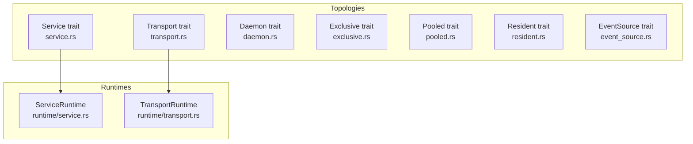
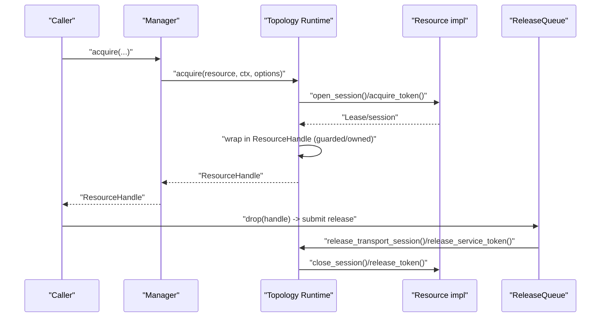
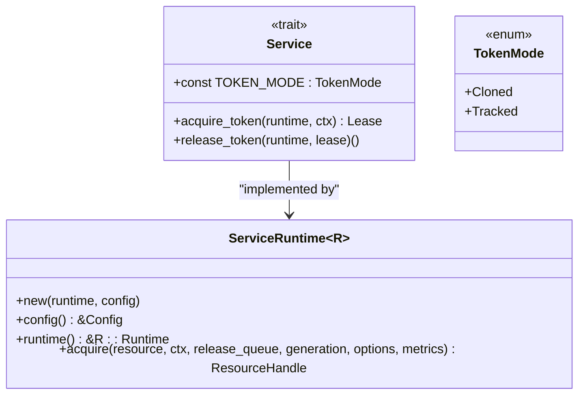
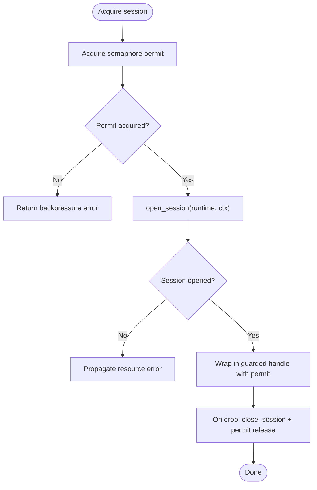
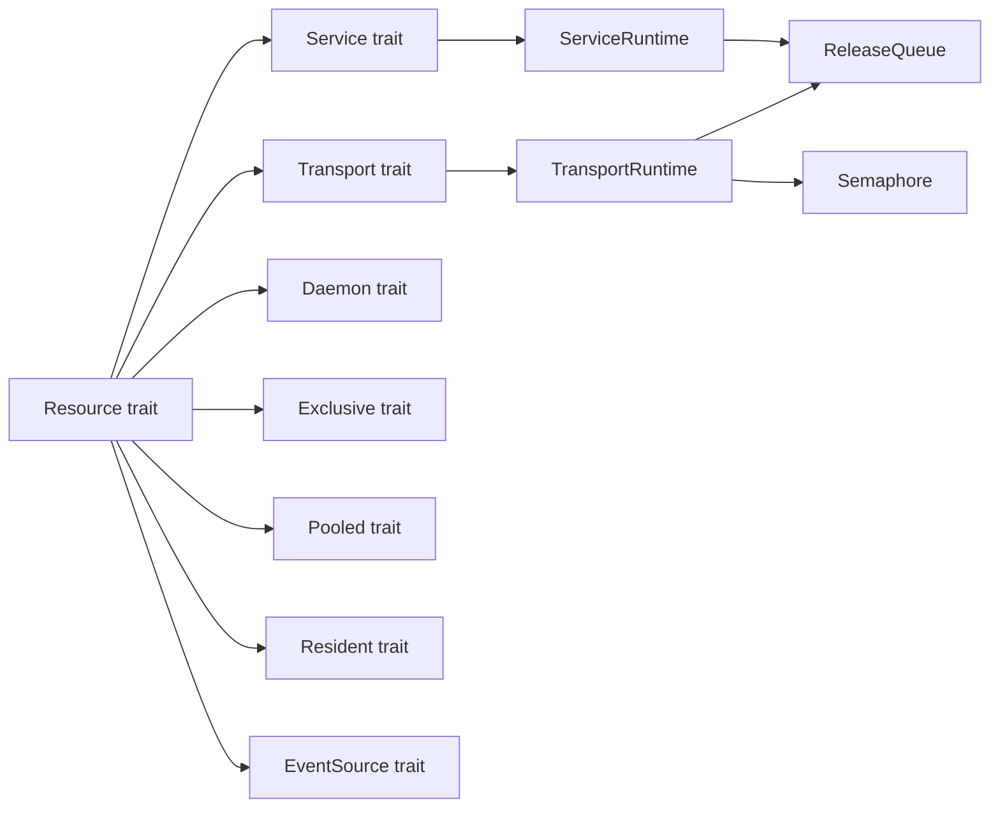

# Resource Topology Patterns

<cite>
**Referenced Files in This Document**
- [lib.rs](file://crates/resource/src/lib.rs)
- [mod.rs](file://crates/resource/src/topology/mod.rs)
- [service.rs](file://crates/resource/src/topology/service.rs)
- [transport.rs](file://crates/resource/src/topology/transport.rs)
- [daemon.rs](file://crates/resource/src/topology/daemon.rs)
- [exclusive.rs](file://crates/resource/src/topology/exclusive.rs)
- [pooled.rs](file://crates/resource/src/topology/pooled.rs)
- [resident.rs](file://crates/resource/src/topology/resident.rs)
- [event_source.rs](file://crates/resource/src/topology/event_source.rs)
- [service.rs](file://crates/resource/src/runtime/service.rs)
- [transport.rs](file://crates/resource/src/runtime/transport.rs)
- [README.md](file://crates/resource/README.md)
</cite>

## Table of Contents
1. [Introduction](#introduction)
2. [Project Structure](#project-structure)
3. [Core Components](#core-components)
4. [Architecture Overview](#architecture-overview)
5. [Detailed Component Analysis](#detailed-component-analysis)
6. [Dependency Analysis](#dependency-analysis)
7. [Performance Considerations](#performance-considerations)
8. [Troubleshooting Guide](#troubleshooting-guide)
9. [Conclusion](#conclusion)

## Introduction
This document explains the seven topology traits that define the full integration space for resources in the system. Each topology captures a distinct access pattern and lifecycle characteristic:
- Service: long-running runtime with short-lived tokens and configurable token modes
- Transport: shared connection with session multiplexing, semaphores, and health-oriented keepalive
- Daemon: background run loop with restart policies and graceful shutdown
- Exclusive: single-instance protection via a semaphore with post-release reset
- Pooled: interchangeable instances with checkout, recycle, and destruction decisions
- Resident: in-memory shared runtime with lock-free ArcSwap-based cells and optional staleness
- EventSource: pull-based event subscription layered atop a primary topology

These patterns are implemented by topology traits and backed by runtime types that enforce safe acquisition, release, and shutdown semantics.

## Project Structure
The topology traits and their runtime counterparts live under the resource crate. The topology module exposes the seven traits, while runtime modules implement acquisition and lifecycle behavior for each pattern.

**Diagram sources**
- [mod.rs:1-30](file://crates/resource/src/topology/mod.rs#L1-L30)
- [service.rs:1-67](file://crates/resource/src/topology/service.rs#L1-L67)
- [transport.rs:1-82](file://crates/resource/src/topology/transport.rs#L1-L82)
- [daemon.rs:1-69](file://crates/resource/src/topology/daemon.rs#L1-L69)
- [exclusive.rs:1-54](file://crates/resource/src/topology/exclusive.rs#L1-L54)
- [pooled.rs:1-187](file://crates/resource/src/topology/pooled.rs#L1-L187)
- [resident.rs:1-65](file://crates/resource/src/topology/resident.rs#L1-L65)
- [event_source.rs:1-51](file://crates/resource/src/topology/event_source.rs#L1-L51)
- [service.rs:1-301](file://crates/resource/src/runtime/service.rs#L1-L301)
- [transport.rs:1-196](file://crates/resource/src/runtime/transport.rs#L1-L196)

**Section sources**
- [lib.rs:1-108](file://crates/resource/src/lib.rs#L1-L108)
- [mod.rs:1-30](file://crates/resource/src/topology/mod.rs#L1-L30)

## Core Components
- Topology traits: define the interface for resource lifecycles and acquisition semantics.
- Runtime types: encapsulate long-lived runtime state and implement acquisition, release, and shutdown behavior.
- Registration and configuration: topologies expose configuration structs for tuning behavior at registration time.
- Metrics and events: resources record operational metrics and emit lifecycle events for observability.

Key runtime types and their roles:
- ServiceRuntime: holds a long-lived runtime and hands out short-lived tokens depending on TokenMode.
- TransportRuntime: holds a shared transport and gates sessions via a semaphore, closing sessions on release.

**Section sources**
- [lib.rs:38-108](file://crates/resource/src/lib.rs#L38-L108)
- [service.rs:22-101](file://crates/resource/src/runtime/service.rs#L22-L101)
- [transport.rs:24-132](file://crates/resource/src/runtime/transport.rs#L24-L132)

## Architecture Overview
The topology traits describe the contract; runtime types implement the mechanics. Acquisition returns a ResourceHandle that enforces RAII-style release semantics. Shutdown and drain are coordinated via the Manager and ReleaseQueue.

**Diagram sources**
- [transport.rs:64-132](file://crates/resource/src/runtime/transport.rs#L64-L132)
- [service.rs:56-101](file://crates/resource/src/runtime/service.rs#L56-L101)

## Detailed Component Analysis

### Service Topology
Purpose
- Long-running runtime with short-lived tokens for callers. Supports two token modes:
  - Cloned: tokens are cheap clones; release is a no-op; returns an owned handle.
  - Tracked: tokens are tracked; release is required; returns a guarded handle submitted to ReleaseQueue.

Lifecycle characteristics
- Runtime persists for the resource’s lifetime.
- Tokens are acquired per execution context and released deterministically via handle drop.
- Shutdown drains active tokens with a configurable timeout.

Configuration options
- drain_timeout: maximum time to wait for active tokens to drain during shutdown.

Integration highlights
- Resource must implement Service with acquire_token and optional release_token.
- ServiceRuntime.acquire constructs the appropriate handle based on TokenMode and schedules release via ReleaseQueue.

Metrics and error handling
- Optional ResourceOpsMetrics can be recorded on release.
- Errors from acquire_token propagate as transient or permanent depending on implementation.

Concrete examples
- Example implementations demonstrate both TokenMode variants and show how handles behave differently.

**Diagram sources**
- [service.rs:30-55](file://crates/resource/src/topology/service.rs#L30-L55)
- [service.rs:25-101](file://crates/resource/src/runtime/service.rs#L25-L101)

**Section sources**
- [service.rs:1-67](file://crates/resource/src/topology/service.rs#L1-L67)
- [service.rs:1-301](file://crates/resource/src/runtime/service.rs#L1-L301)

### Transport Topology
Purpose
- Shared connection multiplexed by many short-lived sessions. Uses a semaphore to cap concurrency and a guarded handle to close sessions on release.

Lifecycle characteristics
- Runtime holds a persistent transport.
- Sessions are opened per acquire and closed on handle drop.
- Keepalive can be periodically sent to prevent idle disconnects.

Configuration options
- max_sessions: maximum concurrent sessions.
- keepalive_interval: interval for keepalive; None disables.
- acquire_timeout: default timeout to acquire a session permit.

Integration highlights
- Resource implements Transport with open_session and optional close_session/keepalive.
- TransportRuntime.acquire acquires a semaphore permit, opens a session, and returns a guarded handle with embedded permit.

Metrics and error handling
- Backpressure errors when acquire timeouts out waiting for a permit.
- Errors from open_session propagate; close_session is invoked on release with a healthy flag.

**Diagram sources**
- [transport.rs:76-132](file://crates/resource/src/runtime/transport.rs#L76-L132)
- [transport.rs:18-51](file://crates/resource/src/topology/transport.rs#L18-L51)

**Section sources**
- [transport.rs:1-82](file://crates/resource/src/topology/transport.rs#L1-L82)
- [transport.rs:1-196](file://crates/resource/src/runtime/transport.rs#L1-L196)

### Daemon Topology
Purpose
- Secondary topology for long-running background tasks such as polling or streaming. Runs until cancelled or returns.

Lifecycle characteristics
- run is a long-running future that cooperates with a CancellationToken.
- Restart policy governs behavior after exit.

Configuration options
- restart_policy: Never, OnFailure, Always.
- max_restarts: upper bound on restart attempts.
- restart_backoff: delay between restarts.

Integration highlights
- Resource implements Daemon with run(runtime, ctx, cancel).
- The runtime coordinates cancellation and cleanup.

Metrics and error handling
- Fatal errors cause restarts according to policy.
- Graceful shutdown occurs when the token is cancelled.

**Section sources**
- [daemon.rs:1-69](file://crates/resource/src/topology/daemon.rs#L1-L69)

### Exclusive Topology
Purpose
- Enforce single-instance access via a semaphore. Ensures mutual exclusion across callers.

Lifecycle characteristics
- Acquire waits on a semaphore with a configurable timeout.
- After release, reset is invoked synchronously to prepare the runtime for the next caller.

Configuration options
- acquire_timeout: timeout to acquire the exclusive lock.

Integration highlights
- Resource implements Exclusive with optional reset.
- The runtime holds a semaphore and ensures reset ordering.

Metrics and error handling
- Backpressure errors when acquire times out.
- Reset failures block the next acquisition until resolved.

**Section sources**
- [exclusive.rs:1-54](file://crates/resource/src/topology/exclusive.rs#L1-L54)

### Pooled Topology
Purpose
- Manage interchangeable instances with checkout, recycle, and destruction decisions.

Lifecycle characteristics
- Instances are created on demand and returned to an idle pool.
- BrokenCheck runs synchronously in Drop; recycle is async with InstanceMetrics; prepare runs after checkout.

Configuration options
- min_size, max_size: pool bounds.
- idle_timeout, max_lifetime: eviction policies.
- create_timeout, strategy (Lifo/Fifo), warmup strategies.
- test_on_checkout, maintenance_interval, max_concurrent_creates.

Integration highlights
- Resource implements Pooled with is_broken, recycle, and optional prepare.
- Pool manager uses metrics and strategies to optimize instance reuse.

Metrics and error handling
- RecycleDecision determines Keep or Drop based on InstanceMetrics.
- Prepare failures lead to instance destruction and retry.

**Section sources**
- [pooled.rs:1-187](file://crates/resource/src/topology/pooled.rs#L1-L187)

### Resident Topology
Purpose
- Share a single runtime across all callers via Clone. Suitable for stateless or internally-pooled clients.

Lifecycle characteristics
- Runtime is created once and reused.
- Optional staleness detection and automatic recreation on failure.

Configuration options
- recreate_on_failure: whether to recreate on failure.
- create_timeout: timeout for Resource::create to avoid deadlocks.

Integration highlights
- Resource implements Resident with optional is_alive_sync and stale_after.
- The runtime is an Arc<R::Runtime> shared among callers.

Metrics and error handling
- Optional liveness checks and staleness windows.
- Controlled creation timeouts prevent hangs.

**Section sources**
- [resident.rs:1-65](file://crates/resource/src/topology/resident.rs#L1-L65)

### EventSource Topology
Purpose
- Pull-based event subscription layered atop a primary topology. Produces events and supports subscriptions.

Lifecycle characteristics
- subscribe creates a subscription handle.
- recv asynchronously waits for the next event.

Configuration options
- buffer_size: channel capacity for events.

Integration highlights
- Resource implements EventSource with Event and Subscription types.
- EventSource is a secondary topology that augments a primary one.

Metrics and error handling
- Errors indicate subscription breakage or shutdown.

**Section sources**
- [event_source.rs:1-51](file://crates/resource/src/topology/event_source.rs#L1-L51)

## Dependency Analysis
The topology traits are independent contracts. Runtime types depend on:
- Resource trait for creation and lifecycle
- Ctx for execution context
- ReleaseQueue for asynchronous release callbacks
- Semaphore for Transport concurrency
- Arc for shared runtime in Service and Resident

**Diagram sources**
- [service.rs:30-55](file://crates/resource/src/topology/service.rs#L30-L55)
- [transport.rs:18-51](file://crates/resource/src/topology/transport.rs#L18-L51)
- [daemon.rs:27-42](file://crates/resource/src/topology/daemon.rs#L27-L42)
- [exclusive.rs:19-33](file://crates/resource/src/topology/exclusive.rs#L19-L33)
- [pooled.rs:76-112](file://crates/resource/src/topology/pooled.rs#L76-L112)
- [resident.rs:21-38](file://crates/resource/src/topology/resident.rs#L21-L38)
- [event_source.rs:11-40](file://crates/resource/src/topology/event_source.rs#L11-L40)
- [service.rs:50-101](file://crates/resource/src/runtime/service.rs#L50-L101)
- [transport.rs:58-132](file://crates/resource/src/runtime/transport.rs#L58-L132)

**Section sources**
- [lib.rs:84-108](file://crates/resource/src/lib.rs#L84-L108)

## Performance Considerations
- Service
  - TokenMode::Cloned avoids async release overhead; suitable for cheap tokens.
  - TokenMode::Tracked enables precise release but adds ReleaseQueue scheduling.
- Transport
  - Tune max_sessions and acquire_timeout to balance throughput and backpressure.
  - Keepalive reduces idle disconnects; set interval based on upstream timeouts.
- Daemon
  - Use RestartPolicy::OnFailure to recover from transient errors; cap max_restarts to prevent thrashing.
- Exclusive
  - Short acquire_timeout prevents head-of-line blocking; ensure reset is fast.
- Pooled
  - Choose strategy (Lifo/Fifo) based on workload; warmup strategies reduce cold starts.
  - Use recycle decisions and metrics to minimize churn of healthy instances.
- Resident
  - Set recreate_on_failure judiciously; use stale_after to avoid long-lived unhealthy instances.
- EventSource
  - Buffer size affects memory footprint and consumer lag.

[No sources needed since this section provides general guidance]

## Troubleshooting Guide
- Service
  - If tokens are not released, ensure TokenMode::Tracked is used and ReleaseQueue is running.
  - Use drain_timeout to bound shutdown time.
- Transport
  - Backpressure indicates max_sessions too low or slow sessions; increase permits or improve session performance.
  - If sessions leak on cancellation, verify guarded handle usage and ReleaseQueue availability.
- Daemon
  - If restarts are excessive, adjust restart_policy and backoff; investigate root causes.
- Exclusive
  - If callers hang, check acquire_timeout and ensure reset completes quickly.
- Pooled
  - If recycle drops too many instances, review InstanceMetrics thresholds and error rates.
  - Increase max_concurrent_creates to reduce creation bottlenecks.
- Resident
  - If stale instances persist, configure stale_after and enable recreate_on_failure.
- EventSource
  - If consumers lag, increase buffer_size; monitor subscription health.

**Section sources**
- [service.rs:56-101](file://crates/resource/src/runtime/service.rs#L56-L101)
- [transport.rs:76-132](file://crates/resource/src/runtime/transport.rs#L76-L132)
- [daemon.rs:44-68](file://crates/resource/src/topology/daemon.rs#L44-L68)
- [exclusive.rs:35-53](file://crates/resource/src/topology/exclusive.rs#L35-L53)
- [pooled.rs:114-186](file://crates/resource/src/topology/pooled.rs#L114-L186)
- [resident.rs:40-64](file://crates/resource/src/topology/resident.rs#L40-L64)
- [event_source.rs:42-50](file://crates/resource/src/topology/event_source.rs#L42-L50)

## Conclusion
The seven topology traits provide a comprehensive framework for integrating diverse external systems safely and efficiently. By selecting the appropriate topology, configuring its runtime parameters, and leveraging ReleaseQueue and metrics, developers can build robust, observable, and resilient integrations across services, transports, daemons, exclusive access, pooling, residency, and event-driven workflows.