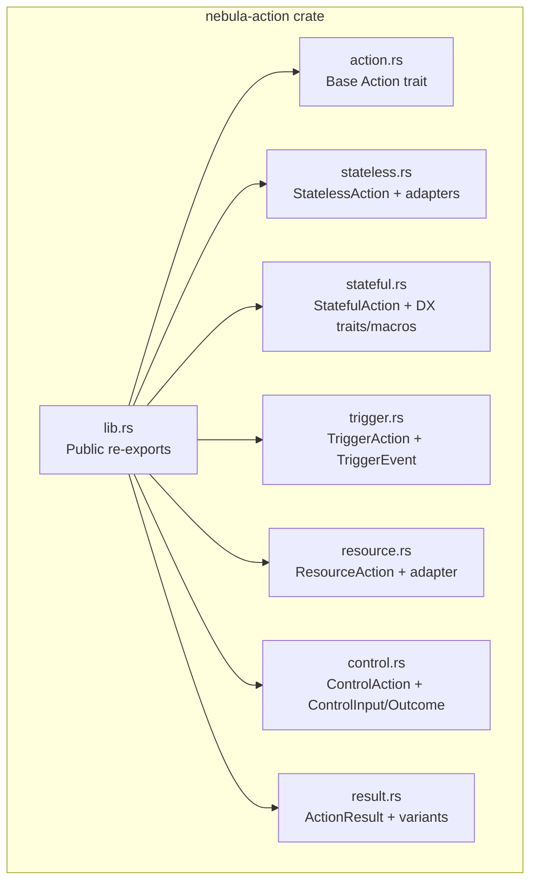
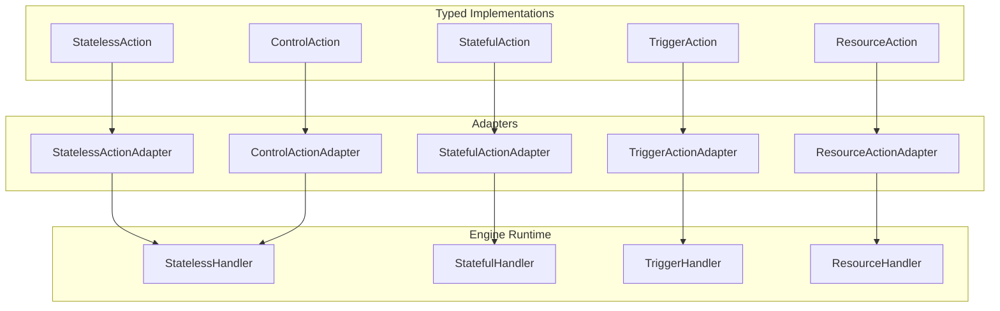
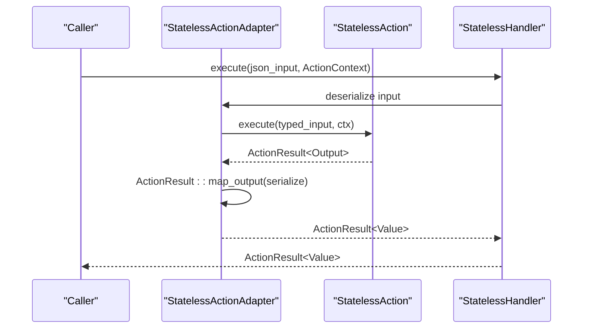
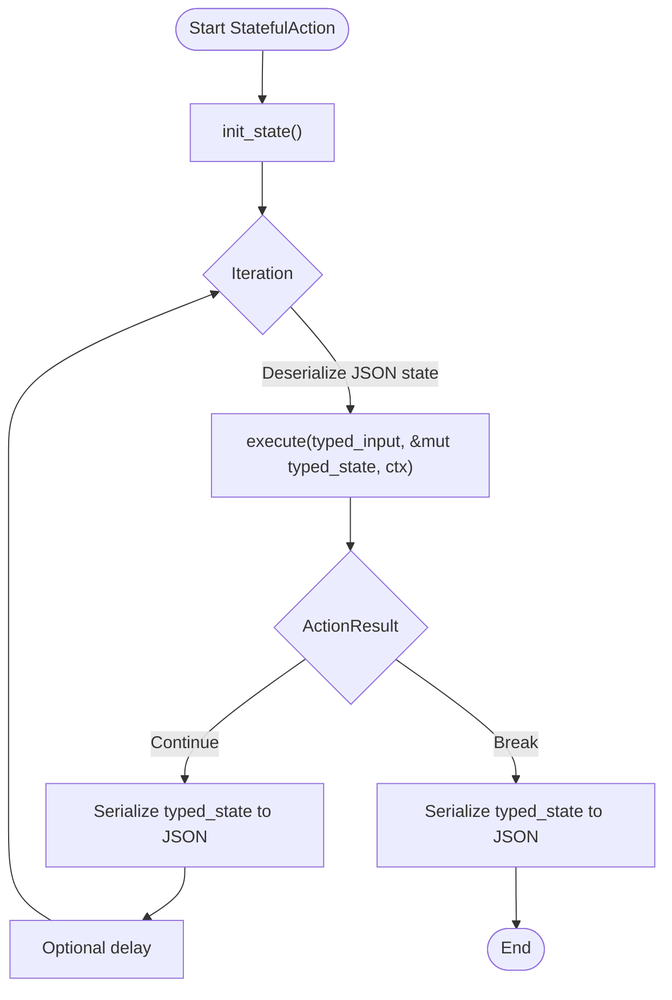
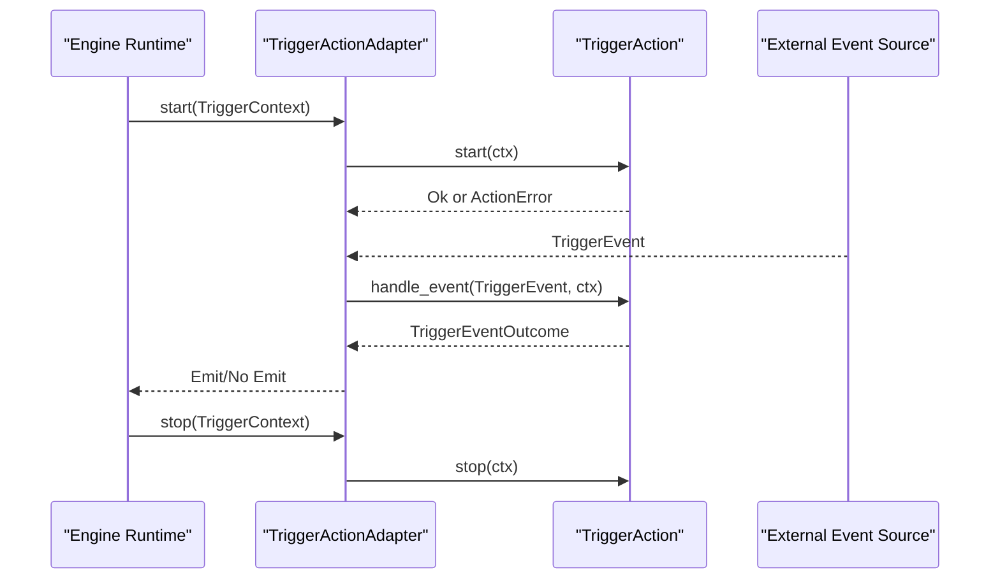
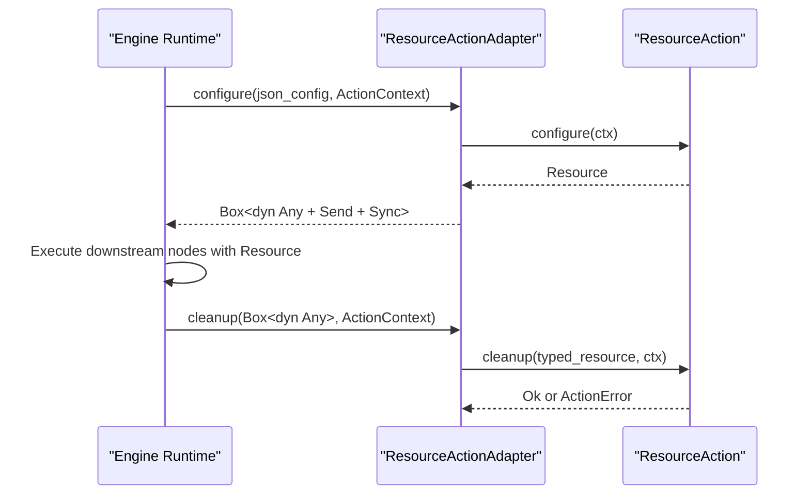
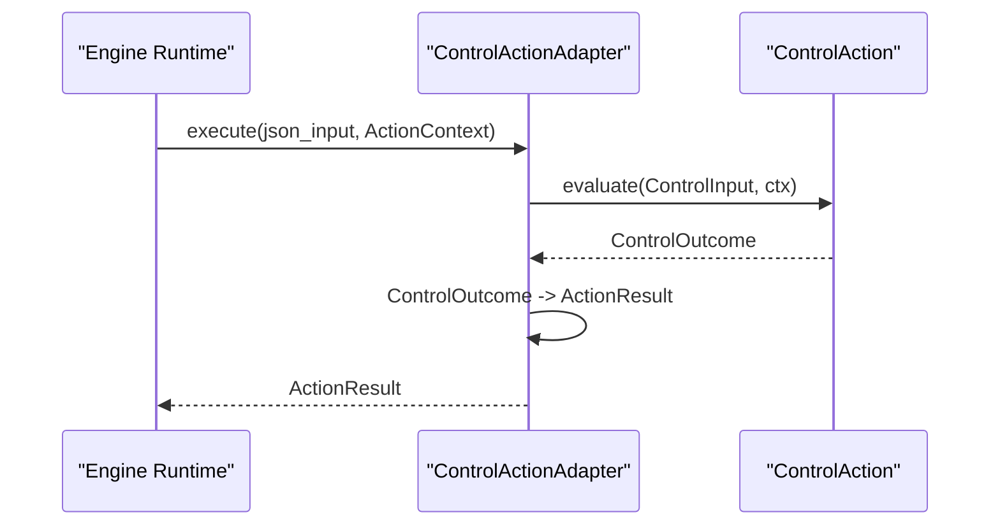
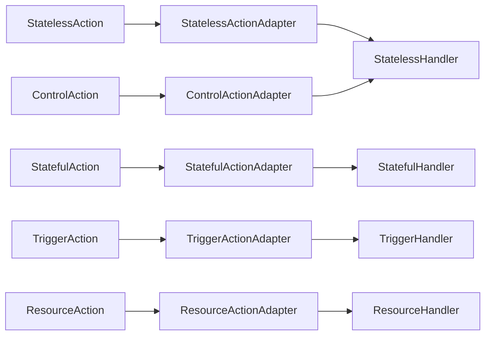

# Action Types and Patterns

<cite>
**Referenced Files in This Document**
- [lib.rs](file://crates/action/src/lib.rs)
- [action.rs](file://crates/action/src/action.rs)
- [stateless.rs](file://crates/action/src/stateless.rs)
- [stateful.rs](file://crates/action/src/stateful.rs)
- [trigger.rs](file://crates/action/src/trigger.rs)
- [resource.rs](file://crates/action/src/resource.rs)
- [control.rs](file://crates/action/src/control.rs)
- [result.rs](file://crates/action/src/result.rs)
- [hello_action.rs](file://examples/hello_action.rs)
- [poll_habr.rs](file://examples/poll_habr.rs)
- [batch_products.rs](file://examples/batch_products.rs)
- [Action Types.md](file://crates/action/docs/Action Types.md)
- [Custom Actions.md](file://crates/action/docs/Custom Actions.md)
</cite>

## Table of Contents
1. [Introduction](#introduction)
2. [Project Structure](#project-structure)
3. [Core Components](#core-components)
4. [Architecture Overview](#architecture-overview)
5. [Detailed Component Analysis](#detailed-component-analysis)
6. [Dependency Analysis](#dependency-analysis)
7. [Performance Considerations](#performance-considerations)
8. [Troubleshooting Guide](#troubleshooting-guide)
9. [Conclusion](#conclusion)
10. [Appendices](#appendices)

## Introduction
This document explains Nebula’s action types and patterns that power integrations. It focuses on the five action trait families:
- StatelessAction: pure, single-execution transformations
- StatefulAction: iterative, stateful processing with checkpointing
- TriggerAction: workflow starters emitting new executions
- ResourceAction: graph-scoped dependency injection
- ControlAction: synchronous flow-control nodes

You will learn implementation details, invocation relationships, interfaces, usage patterns, configuration options, parameters, return values, ActionResult variants, and how these integrate with the execution engine and resource management. Concrete examples from the codebase illustrate development, registration, and execution. We also cover checkpoint policies, retry mechanisms, and flow control patterns, balancing accessibility for beginners with technical depth for advanced implementers.

## Project Structure
Nebula’s action framework lives primarily in the nebula-action crate. The module layout exposes:
- Core traits and adapters for each action family
- Execution result types and flow-control semantics
- DX traits for pagination, batching, polling, webhooks, and control nodes
- Public re-exports for action authors

**Diagram sources**
- [lib.rs:1-152](file://crates/action/src/lib.rs#L1-L152)
- [action.rs:1-21](file://crates/action/src/action.rs#L1-L21)
- [stateless.rs:1-639](file://crates/action/src/stateless.rs#L1-L639)
- [stateful.rs:1-800](file://crates/action/src/stateful.rs#L1-L800)
- [trigger.rs:1-608](file://crates/action/src/trigger.rs#L1-L608)
- [resource.rs:1-295](file://crates/action/src/resource.rs#L1-L295)
- [control.rs:1-800](file://crates/action/src/control.rs#L1-L800)
- [result.rs:1-800](file://crates/action/src/result.rs#L1-L800)

**Section sources**
- [lib.rs:1-152](file://crates/action/src/lib.rs#L1-L152)

## Core Components
- Base Action trait defines identity and metadata used by the engine to inspect capabilities, isolation level, and schema.
- Each action family adds a specialized interface:
  - StatelessAction: pure function from typed input to typed output with ActionResult flow control
  - StatefulAction: iterative execution with persistent state, Continue/Break semantics, and checkpointing
  - TriggerAction: start/stop lifecycle for workflow starters emitting new executions
  - ResourceAction: configure/cleanup graph-scoped resources
  - ControlAction: synchronous decision-making for branching, routing, filtering, and termination
- ActionResult variants encode the engine’s next-step semantics: Success, Skip, Drop, Continue, Break, Branch, Route/MultiOutput, Wait, Terminate, and gated Retry

**Section sources**
- [action.rs:17-20](file://crates/action/src/action.rs#L17-L20)
- [stateless.rs:68-91](file://crates/action/src/stateless.rs#L68-L91)
- [stateful.rs:35-75](file://crates/action/src/stateful.rs#L35-L75)
- [trigger.rs:58-64](file://crates/action/src/trigger.rs#L58-L64)
- [resource.rs:37-53](file://crates/action/src/resource.rs#L37-L53)
- [control.rs:394-432](file://crates/action/src/control.rs#L394-L432)
- [result.rs:58-224](file://crates/action/src/result.rs#L58-L224)

## Architecture Overview
The action framework separates typed Rust implementations from dynamic handler contracts. Adapters bridge typed traits to dyn-compatible handlers for the engine runtime. Control actions are further adapted to StatelessHandler for synchronous flow-control nodes.

**Diagram sources**
- [stateless.rs:374-404](file://crates/action/src/stateless.rs#L374-L404)
- [stateful.rs:495-611](file://crates/action/src/stateful.rs#L495-L611)
- [trigger.rs:395-420](file://crates/action/src/trigger.rs#L395-L420)
- [resource.rs:125-174](file://crates/action/src/resource.rs#L125-L174)
- [control.rs:486-505](file://crates/action/src/control.rs#L486-L505)

## Detailed Component Analysis

### StatelessAction
- Purpose: Pure, single-execution transformations with typed input/output and ActionResult flow control.
- Key interfaces:
  - StatelessAction trait with Input/Output associated types and execute(input, ctx) -> Future
  - FnStatelessAction and FnStatelessCtxAction for low-boilerplate closures
  - StatelessActionAdapter bridges typed execute to StatelessHandler JSON contract
- Invocation relationship:
  - Typed execute -> ActionResult -> StatelessHandler::execute (JSON serialization/deserialization)
- Parameters and return values:
  - Input: HasSchema + Send + Sync
  - Output: Send + Sync
  - Return: Future<Output = Result<ActionResult<Output>, ActionError>>
- Usage patterns:
  - stateless_fn for simple closures
  - stateless_ctx_fn for closures needing credentials/resources/loggers
- Examples:
  - Minimal stateless action in examples/hello_action.rs

**Diagram sources**
- [stateless.rs:384-404](file://crates/action/src/stateless.rs#L384-L404)
- [stateless.rs:145-153](file://crates/action/src/stateless.rs#L145-L153)
- [stateless.rs:250-274](file://crates/action/src/stateless.rs#L250-L274)

**Section sources**
- [stateless.rs:36-91](file://crates/action/src/stateless.rs#L36-L91)
- [stateless.rs:95-170](file://crates/action/src/stateless.rs#L95-L170)
- [stateless.rs:172-318](file://crates/action/src/stateless.rs#L172-L318)
- [stateless.rs:374-404](file://crates/action/src/stateless.rs#L374-L404)
- [hello_action.rs:37-57](file://examples/hello_action.rs#L37-L57)

### StatefulAction
- Purpose: Iterative execution with persistent state, Continue/Break semantics, and checkpointing.
- Key interfaces:
  - StatefulAction with Input/Output/State associated types and execute(input, &mut state, ctx)
  - DX traits: PaginatedAction (cursor-driven pagination), BatchAction (fixed-size batches)
  - Macros: impl_paginated_action!, impl_batch_action!
  - StatefulActionAdapter bridges typed execute to StatefulHandler JSON contract
- Invocation relationship:
  - Typed execute -> engine checkpoint state -> next iteration or break
- Parameters and return values:
  - State: Serialize + DeserializeOwned + Clone + Send + Sync
  - Output carried in Continue/Break
- Checkpoint policy and state migration:
  - Engine persists state between iterations; migrate_state allows versioned upgrades
- Retry mechanisms:
  - Returning Continue with partial output and delay; errors classified as retryable/fatal
- Examples:
  - BatchAction in examples/batch_products.rs using impl_batch_action!

**Diagram sources**
- [stateful.rs:539-611](file://crates/action/src/stateful.rs#L539-L611)
- [stateful.rs:167-224](file://crates/action/src/stateful.rs#L167-L224)
- [stateful.rs:302-372](file://crates/action/src/stateful.rs#L302-L372)

**Section sources**
- [stateful.rs:23-75](file://crates/action/src/stateful.rs#L23-L75)
- [stateful.rs:77-152](file://crates/action/src/stateful.rs#L77-L152)
- [stateful.rs:226-372](file://crates/action/src/stateful.rs#L226-L372)
- [stateful.rs:495-611](file://crates/action/src/stateful.rs#L495-L611)
- [batch_products.rs:53-123](file://examples/batch_products.rs#L53-L123)

### TriggerAction
- Purpose: Workflow starters that live outside the execution graph and emit new executions in response to external events.
- Key interfaces:
  - TriggerAction with start(ctx) and stop(ctx)
  - TriggerEvent envelope (id, received_at, payload) and TriggerEventOutcome (Skip/Emit/EmitMany)
  - TriggerActionAdapter bridges typed start/stop to TriggerHandler
- Invocation relationship:
  - Runtime calls start/stop; adapters delegate to typed action
- Parameters and return values:
  - TriggerContext (workflow_id, trigger_id, cancellation)
  - TriggerEventOutcome indicates whether to emit executions
- Examples:
  - PollAction in examples/poll_habr.rs demonstrates validate() and poll() with PollConfig and DeduplicatingCursor

**Diagram sources**
- [trigger.rs:395-420](file://crates/action/src/trigger.rs#L395-L420)
- [trigger.rs:88-194](file://crates/action/src/trigger.rs#L88-L194)
- [trigger.rs:208-255](file://crates/action/src/trigger.rs#L208-L255)

**Section sources**
- [trigger.rs:50-64](file://crates/action/src/trigger.rs#L50-L64)
- [trigger.rs:66-205](file://crates/action/src/trigger.rs#L66-L205)
- [trigger.rs:364-428](file://crates/action/src/trigger.rs#L364-L428)
- [poll_habr.rs:92-171](file://examples/poll_habr.rs#L92-L171)

### ResourceAction
- Purpose: Graph-level dependency injection that configures a resource before downstream nodes and cleans it up when the scope ends.
- Key interfaces:
  - ResourceAction with configure(ctx) -> Resource and cleanup(resource, ctx)
  - ResourceActionAdapter bridges typed lifecycle to ResourceHandler JSON contract
- Invocation relationship:
  - Engine calls configure before downstream nodes; cleanup on scope end
- Parameters and return values:
  - Resource: Send + Sync + 'static (scoped to branch)
- Examples:
  - ResourceActionAdapter demonstrates configure() returning a boxed Any and cleanup() downcasting back to typed Resource

**Diagram sources**
- [resource.rs:125-174](file://crates/action/src/resource.rs#L125-L174)
- [resource.rs:37-53](file://crates/action/src/resource.rs#L37-L53)

**Section sources**
- [resource.rs:22-53](file://crates/action/src/resource.rs#L22-L53)
- [resource.rs:55-91](file://crates/action/src/resource.rs#L55-L91)
- [resource.rs:93-174](file://crates/action/src/resource.rs#L93-L174)

### ControlAction
- Purpose: Synchronous flow-control nodes that decide branching, routing, filtering, or termination based on a single input.
- Key interfaces:
  - ControlAction with evaluate(input: ControlInput, ctx) -> ControlOutcome
  - ControlInput provides typed accessors (get_bool/get_str/get_i64/get_f64)
  - ControlOutcome variants: Branch, Route, Pass, Drop, Terminate
  - ControlActionAdapter adapts to StatelessHandler by stamping ActionCategory
- Invocation relationship:
  - Engine calls StatelessHandler::execute -> ControlAction::evaluate -> ControlOutcome -> ActionResult
- Parameters and return values:
  - ControlInput: owned wrapper around JSON input with typed accessors
  - ControlOutcome: engine desugared to ActionResult variants
- Examples:
  - ControlActionAdapter demonstrates automatic category inference based on declared outputs

**Diagram sources**
- [control.rs:486-505](file://crates/action/src/control.rs#L486-L505)
- [control.rs:427-432](file://crates/action/src/control.rs#L427-L432)
- [control.rs:330-355](file://crates/action/src/control.rs#L330-L355)

**Section sources**
- [control.rs:92-254](file://crates/action/src/control.rs#L92-L254)
- [control.rs:357-432](file://crates/action/src/control.rs#L357-L432)
- [control.rs:434-514](file://crates/action/src/control.rs#L434-L514)

## Dependency Analysis
- Cohesion and coupling:
  - Each action family is cohesive around a single responsibility and exposed via separate modules
  - Adapters decouple typed implementations from dynamic handler contracts
- External dependencies:
  - serde_json for JSON (de)serialization in adapters
  - async_trait for async trait objects
  - tokio select! for cancellation handling across action families
- Potential circular dependencies:
  - None apparent; adapters depend on traits, not vice versa
- Interface contracts:
  - StatelessHandler, StatefulHandler, TriggerHandler, ResourceHandler, and ControlActionAdapter provide stable dyn contracts

**Diagram sources**
- [stateless.rs:374-404](file://crates/action/src/stateless.rs#L374-L404)
- [stateful.rs:495-611](file://crates/action/src/stateful.rs#L495-L611)
- [trigger.rs:395-420](file://crates/action/src/trigger.rs#L395-L420)
- [resource.rs:125-174](file://crates/action/src/resource.rs#L125-L174)
- [control.rs:486-505](file://crates/action/src/control.rs#L486-L505)

**Section sources**
- [lib.rs:93-152](file://crates/action/src/lib.rs#L93-L152)

## Performance Considerations
- StatelessAction
  - Parallelizable: multiple instances can run concurrently
  - Serialization overhead minimal for small inputs/outputs
- StatefulAction
  - State checkpointing cost proportional to state size; keep state compact
  - Prefer Continue with delay for rate limiting to avoid busy loops
- TriggerAction
  - Polling intervals and backoff strategies reduce load; validate() pre-flight checks help
- ResourceAction
  - Configure/cleanup should be lightweight; avoid heavy allocations in cleanup
- ControlAction
  - Keep evaluate() synchronous and non-blocking; avoid engine-persisted state

[No sources needed since this section provides general guidance]

## Troubleshooting Guide
Common issues and solutions for action developers:
- Validation errors on input/state
  - StatelessActionAdapter and StatefulActionAdapter return ActionError::Validation with ValidationReason for malformed JSON or schema mismatches
  - Fix: ensure inputs conform to HasSchema and ActionMetadata
- Serialization failures
  - StatelessActionAdapter returns ActionError::fatal for output serialization failures
  - StatefulActionAdapter returns ActionError::fatal for init_state or state serialization failures
  - Fix: ensure Output implements Serialize; ensure State is serializable and migratable
- Retry vs Fatal errors
  - Use ActionError::retryable for transient failures; ActionError::fatal for permanent failures
  - StatefulAction: returning Continue after mutating state ensures checkpointing before propagation
- Cancellation safety
  - StatelessAction and StatefulAction rely on runtime cancellation; implement cooperative checks if needed
- ControlAction input validation
  - ControlInput getters return ActionError::Validation for missing/incorrect types
  - Fix: validate required fields and types before branching/routing

**Section sources**
- [stateless.rs:389-402](file://crates/action/src/stateless.rs#L389-L402)
- [stateful.rs:507-517](file://crates/action/src/stateful.rs#L507-L517)
- [stateful.rs:572-602](file://crates/action/src/stateful.rs#L572-L602)
- [control.rs:151-162](file://crates/action/src/control.rs#L151-L162)

## Conclusion
Nebula’s action framework provides a robust, extensible foundation for building integrations. The five action families—StatelessAction, StatefulAction, TriggerAction, ResourceAction, and ControlAction—cover the full spectrum of integration scenarios. Adapters and ActionResult variants enable seamless integration with the engine while preserving type safety and composability. By following the patterns and examples outlined here, you can implement reliable, observable, and efficient actions tailored to your use cases.

[No sources needed since this section summarizes without analyzing specific files]

## Appendices

### ActionResult Variants and Usage
- Success: pass output to dependents
- Skip: skip downstream subgraph
- Drop: drop item without stopping branch
- Continue: re-enqueue for next iteration with optional progress and delay
- Break: finalize iteration with reason
- Branch: activate a specific branch path
- Route/MultiOutput: fan-out to output ports
- Wait: pause until external condition, timeout, or partial output
- Terminate: end the whole execution explicitly
- Retry: gated variant behind unstable feature flag

**Section sources**
- [result.rs:58-224](file://crates/action/src/result.rs#L58-L224)
- [result.rs:428-794](file://crates/action/src/result.rs#L428-L794)

### DX Traits and Macros
- PaginatedAction: cursor-driven pagination with impl_paginated_action!
- BatchAction: fixed-size batches with impl_batch_action!
- PollAction: polling with PollConfig, DeduplicatingCursor, and PollResult
- WebhookAction: HTTP webhook handling with signature verification
- ControlAction: synchronous flow-control with ControlInput/Outcome

**Section sources**
- [stateful.rs:154-224](file://crates/action/src/stateful.rs#L154-L224)
- [stateful.rs:300-372](file://crates/action/src/stateful.rs#L300-L372)
- [trigger.rs:92-194](file://crates/action/src/trigger.rs#L92-L194)
- [control.rs:92-355](file://crates/action/src/control.rs#L92-L355)

### Practical Examples Index
- StatelessAction: examples/hello_action.rs
- StatefulAction (BatchAction): examples/batch_products.rs
- TriggerAction (PollAction): examples/poll_habr.rs

**Section sources**
- [hello_action.rs:37-57](file://examples/hello_action.rs#L37-L57)
- [batch_products.rs:53-123](file://examples/batch_products.rs#L53-L123)
- [poll_habr.rs:92-171](file://examples/poll_habr.rs#L92-L171)

### Additional Guidance
- Choosing the right action type and designing custom actions
- Idempotency, observability, security, and testing strategies

**Section sources**
- [Action Types.md:11-483](file://crates/action/docs/Action Types.md#L11-L483)
- [Custom Actions.md:12-41](file://crates/action/docs/Custom Actions.md#L12-L41)