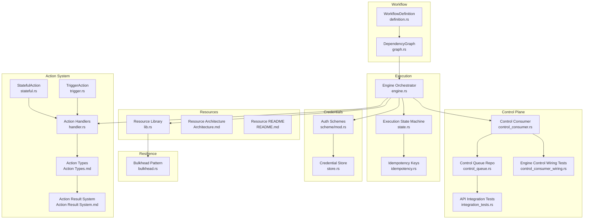
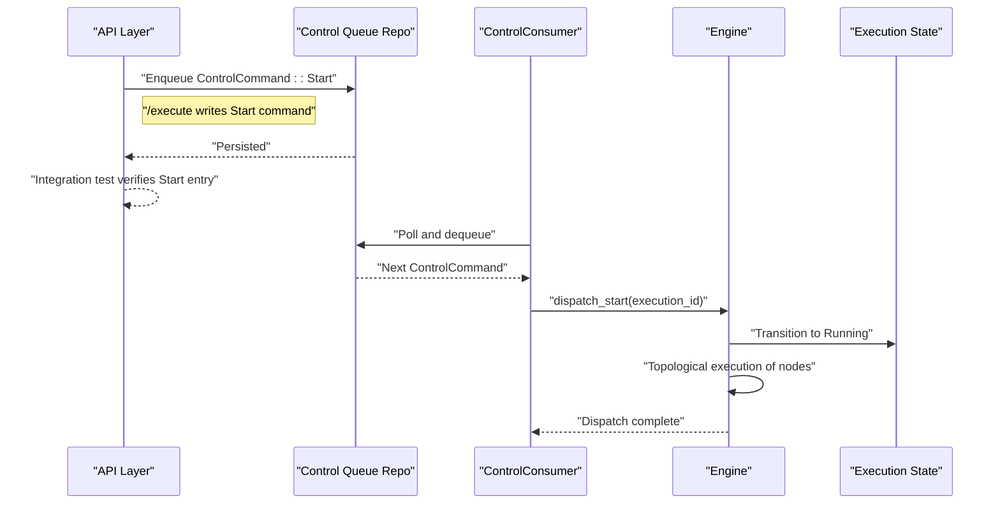
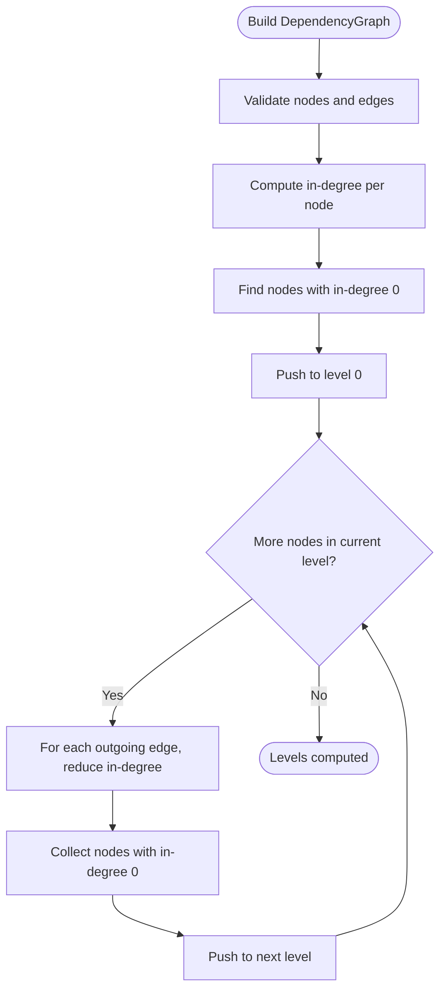
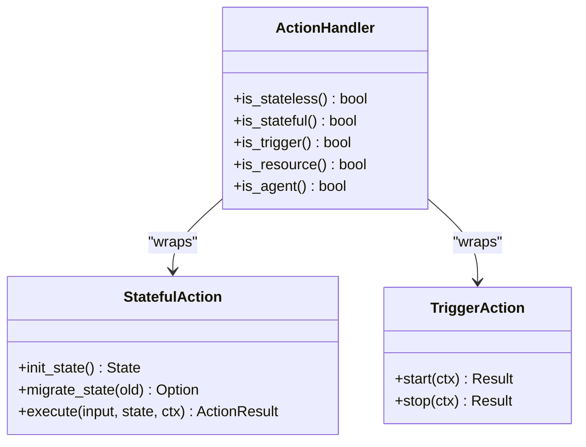
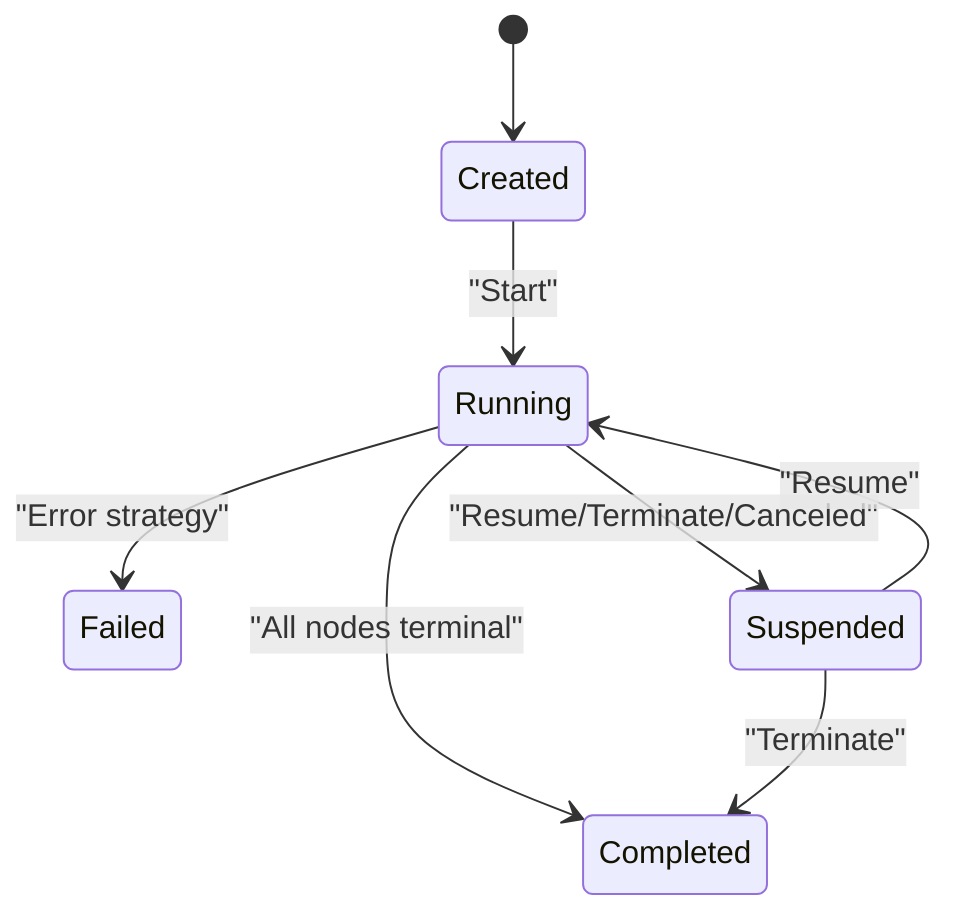
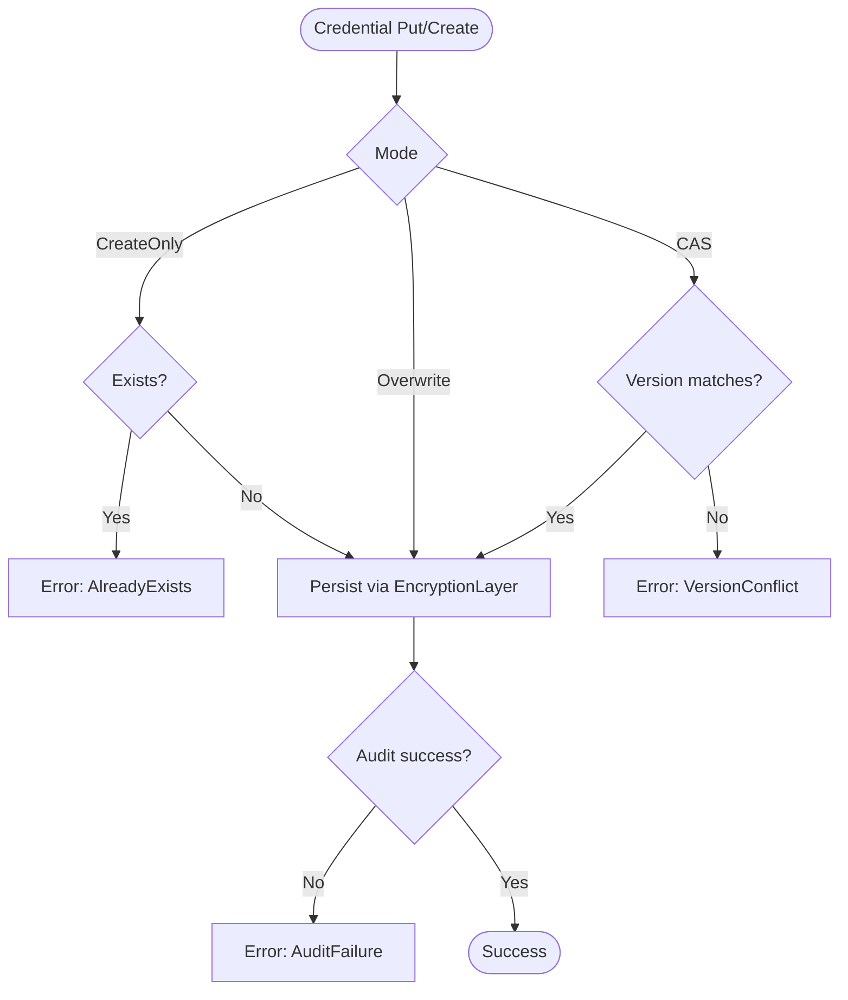
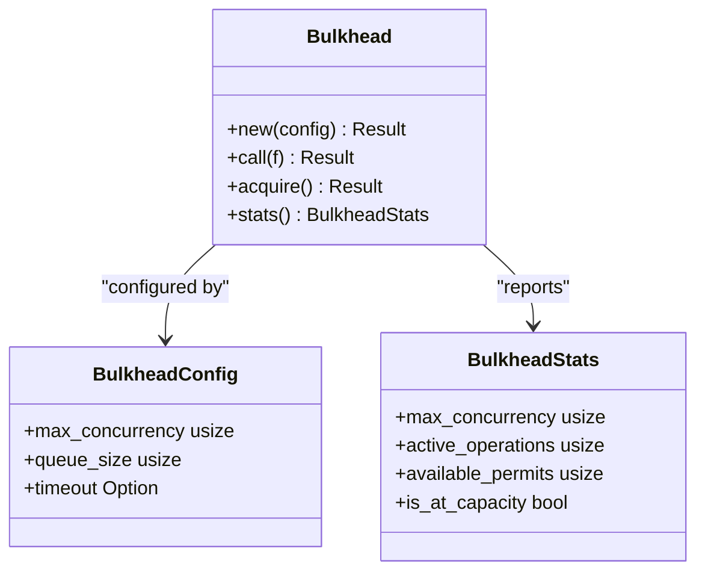
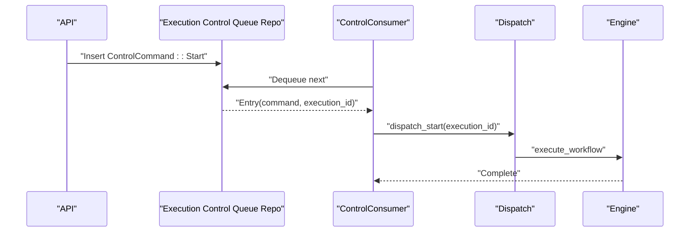
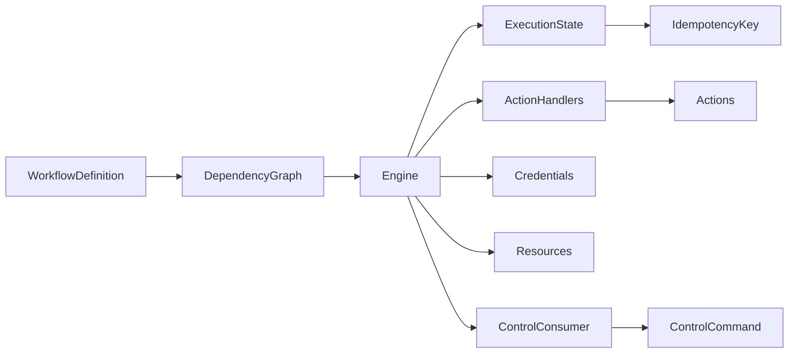

# Core Concepts

<cite>
**Referenced Files in This Document**
- [graph.rs](file://crates/workflow/src/graph.rs)
- [definition.rs](file://crates/workflow/src/definition.rs)
- [Action Types.md](file://crates/action/docs/Action Types.md)
- [Action Result System.md](file://crates/action/docs/Action Result System.md)
- [state.rs](file://crates/execution/src/state.rs)
- [idempotency.rs](file://crates/execution/src/idempotency.rs)
- [handler.rs](file://crates/action/src/handler.rs)
- [stateful.rs](file://crates/action/src/stateful.rs)
- [trigger.rs](file://crates/action/src/trigger.rs)
- [mod.rs](file://crates/credential/src/scheme/mod.rs)
- [store.rs](file://crates/credential/src/store.rs)
- [engine.rs](file://crates/engine/src/engine.rs)
- [control_consumer.rs](file://crates/engine/src/control_consumer.rs)
- [control_queue.rs](file://crates/storage/src/repos/control_queue.rs)
- [bulkhead.rs](file://crates/resilience/src/bulkhead.rs)
- [lib.rs](file://crates/resource/src/lib.rs)
- [README.md](file://crates/resource/README.md)
- [Architecture.md](file://crates/resource/docs/Architecture.md)
- [integration_tests.rs](file://crates/api/tests/integration_tests.rs)
- [control_consumer_wiring.rs](file://crates/engine/tests/control_consumer_wiring.rs)
</cite>

## Table of Contents
1. [Introduction](#introduction)
2. [Project Structure](#project-structure)
3. [Core Components](#core-components)
4. [Architecture Overview](#architecture-overview)
5. [Detailed Component Analysis](#detailed-component-analysis)
6. [Dependency Analysis](#dependency-analysis)
7. [Performance Considerations](#performance-considerations)
8. [Troubleshooting Guide](#troubleshooting-guide)
9. [Conclusion](#conclusion)

## Introduction
This document explains the core concepts of Nebula’s workflow automation model. It covers DAG-based execution, node dependencies, topological ordering, action types and patterns, credential management, resource lifecycle and bulkhead patterns, and the execution model including state machines, control queues, and idempotency handling. The goal is to help both beginners and experienced developers understand how these pieces fit together and how to implement custom actions and workflows effectively.

## Project Structure
Nebula organizes workflow automation across several cohesive crates:
- Workflow definition and graph: dependency graph, connections, and execution configuration
- Action system: typed actions, results, and handler contracts
- Execution engine: state machines, idempotency, and control plane
- Credentials: authentication schemes, secure storage, and rotation
- Resources: bulkhead pools and lifecycle management
- Resilience: bulkhead concurrency patterns
- API and storage: control queue durable outbox and integration tests

**Diagram sources**
- [definition.rs:14-58](file://crates/workflow/src/definition.rs#L14-L58)
- [graph.rs:14-18](file://crates/workflow/src/graph.rs#L14-L18)
- [handler.rs:106-129](file://crates/action/src/handler.rs#L106-L129)
- [state.rs:120-171](file://crates/execution/src/state.rs#L120-L171)
- [idempotency.rs:13-29](file://crates/execution/src/idempotency.rs#L13-L29)
- [engine.rs:1640-1655](file://crates/engine/src/engine.rs#L1640-L1655)
- [mod.rs:1-40](file://crates/credential/src/scheme/mod.rs#L1-L40)
- [store.rs:103-161](file://crates/credential/src/store.rs#L103-L161)
- [lib.rs:1-33](file://crates/resource/src/lib.rs#L1-L33)
- [Architecture.md:1-34](file://crates/resource/docs/Architecture.md#L1-L34)
- [README.md:1-18](file://crates/resource/README.md#L1-L18)
- [bulkhead.rs:20-56](file://crates/resilience/src/bulkhead.rs#L20-L56)
- [control_consumer.rs:483-504](file://crates/engine/src/control_consumer.rs#L483-L504)
- [control_queue.rs:15-35](file://crates/storage/src/repos/control_queue.rs#L15-L35)
- [integration_tests.rs:2615-2633](file://crates/api/tests/integration_tests.rs#L2615-L2633)
- [control_consumer_wiring.rs:238-279](file://crates/engine/tests/control_consumer_wiring.rs#L238-L279)

**Section sources**
- [definition.rs:14-58](file://crates/workflow/src/definition.rs#L14-L58)
- [graph.rs:14-18](file://crates/workflow/src/graph.rs#L14-L18)
- [handler.rs:106-129](file://crates/action/src/handler.rs#L106-L129)
- [state.rs:120-171](file://crates/execution/src/state.rs#L120-L171)
- [idempotency.rs:13-29](file://crates/execution/src/idempotency.rs#L13-L29)
- [engine.rs:1640-1655](file://crates/engine/src/engine.rs#L1640-L1655)
- [mod.rs:1-40](file://crates/credential/src/scheme/mod.rs#L1-L40)
- [store.rs:103-161](file://crates/credential/src/store.rs#L103-L161)
- [lib.rs:1-33](file://crates/resource/src/lib.rs#L1-L33)
- [Architecture.md:1-34](file://crates/resource/docs/Architecture.md#L1-L34)
- [README.md:1-18](file://crates/resource/README.md#L1-L18)
- [bulkhead.rs:20-56](file://crates/resilience/src/bulkhead.rs#L20-L56)
- [control_consumer.rs:483-504](file://crates/engine/src/control_consumer.rs#L483-L504)
- [control_queue.rs:15-35](file://crates/storage/src/repos/control_queue.rs#L15-L35)
- [integration_tests.rs:2615-2633](file://crates/api/tests/integration_tests.rs#L2615-L2633)
- [control_consumer_wiring.rs:238-279](file://crates/engine/tests/control_consumer_wiring.rs#L238-L279)

## Core Components
- DAG-based execution: WorkflowDefinition defines nodes and connections; DependencyGraph encodes edges; topological levels enable parallel execution.
- Action types and patterns: Stateless, Stateful, Trigger, Resource, and Control actions with rich result semantics.
- Execution model: NodeExecutionState and ExecutionState form a strict state machine with transitions and idempotency keys.
- Control plane: ControlCommand queue (Start, Cancel, Terminate, Resume, Restart) with a ControlConsumer draining entries and dispatching to the engine.
- Credentials: Authentication schemes and a store interface with optimistic concurrency and audit-aware error semantics.
- Resources: Centralized resource lifecycle with bulkhead isolation and topology-specific pooling.

**Section sources**
- [definition.rs:14-58](file://crates/workflow/src/definition.rs#L14-L58)
- [graph.rs:14-18](file://crates/workflow/src/graph.rs#L14-L18)
- [Action Types.md:23-37](file://crates/action/docs/Action Types.md#L23-L37)
- [Action Result System.md:14-41](file://crates/action/docs/Action Result System.md#L14-L41)
- [state.rs:20-42](file://crates/execution/src/state.rs#L20-L42)
- [idempotency.rs:13-29](file://crates/execution/src/idempotency.rs#L13-L29)
- [control_queue.rs:15-35](file://crates/storage/src/repos/control_queue.rs#L15-L35)
- [control_consumer.rs:483-504](file://crates/engine/src/control_consumer.rs#L483-L504)
- [mod.rs:1-40](file://crates/credential/src/scheme/mod.rs#L1-L40)
- [store.rs:103-161](file://crates/credential/src/store.rs#L103-L161)
- [lib.rs:1-33](file://crates/resource/src/lib.rs#L1-L33)

## Architecture Overview
The workflow engine orchestrates DAG execution, driven by a control plane that persists control commands and dispatches them to the engine. Actions are registered via handlers and executed according to the workflow definition. Credentials and resources are managed centrally to ensure secure, resilient access.

**Diagram sources**
- [integration_tests.rs:2615-2633](file://crates/api/tests/integration_tests.rs#L2615-L2633)
- [control_queue.rs:15-35](file://crates/storage/src/repos/control_queue.rs#L15-L35)
- [control_consumer.rs:483-504](file://crates/engine/src/control_consumer.rs#L483-L504)
- [engine.rs:1640-1655](file://crates/engine/src/engine.rs#L1640-L1655)

**Section sources**
- [integration_tests.rs:2615-2633](file://crates/api/tests/integration_tests.rs#L2615-L2633)
- [control_queue.rs:15-35](file://crates/storage/src/repos/control_queue.rs#L15-L35)
- [control_consumer.rs:483-504](file://crates/engine/src/control_consumer.rs#L483-L504)
- [engine.rs:1640-1655](file://crates/engine/src/engine.rs#L1640-L1655)

## Detailed Component Analysis

### DAG-Based Execution and Topological Ordering
- WorkflowDefinition captures nodes, connections, and runtime configuration.
- DependencyGraph builds a directed graph from connections and validates duplicates and self-loops.
- Topological levels are computed to parallelize independent nodes while respecting dependencies.

**Diagram sources**
- [graph.rs:24-38](file://crates/workflow/src/graph.rs#L24-L38)
- [graph.rs:311-327](file://crates/workflow/src/graph.rs#L311-L327)
- [definition.rs:14-58](file://crates/workflow/src/definition.rs#L14-L58)

**Section sources**
- [graph.rs:24-38](file://crates/workflow/src/graph.rs#L24-L38)
- [graph.rs:311-327](file://crates/workflow/src/graph.rs#L311-L327)
- [definition.rs:14-58](file://crates/workflow/src/definition.rs#L14-L58)

### Action Types and Patterns
Nebula supports multiple action types:
- Stateless: Pure transformations without state between executions
- Stateful: Iterative processing with persistent state across executions
- Trigger: Workflow starters emitting new executions from external events
- Resource: Scoped resource acquisition and lifecycle management
- Control: Actions that influence workflow control flow

**Diagram sources**
- [handler.rs:106-129](file://crates/action/src/handler.rs#L106-L129)
- [stateful.rs:35-75](file://crates/action/src/stateful.rs#L35-L75)
- [trigger.rs:58-64](file://crates/action/src/trigger.rs#L58-L64)

Usage patterns:
- Stateless actions are ideal for pure transformations and can be parallelized safely.
- Stateful actions manage pagination, batching, and long-running loops with checkpoints.
- Trigger actions start workflows from external events and emit execution inputs.
- Resource actions integrate with the resource manager for scoped, pooled access.
- Control actions shape branching and parallelism via rich result semantics.

**Section sources**
- [Action Types.md:23-37](file://crates/action/docs/Action Types.md#L23-L37)
- [Action Result System.md:14-41](file://crates/action/docs/Action Result System.md#L14-L41)
- [handler.rs:106-129](file://crates/action/src/handler.rs#L106-L129)
- [stateful.rs:35-75](file://crates/action/src/stateful.rs#L35-L75)
- [trigger.rs:58-64](file://crates/action/src/trigger.rs#L58-L64)

### Execution Model: State Machines, Control Queues, and Idempotency
- NodeExecutionState tracks per-node state, attempts, timestamps, and terminal/error conditions.
- ExecutionState aggregates node states, enforces status transitions, and bumps version for optimistic concurrency.
- IdempotencyKey ensures exactly-once execution per node attempt across retries and replays.
- ControlCommand queue persists control signals (Start, Cancel, Terminate, Resume, Restart) and ControlConsumer dispatches them to the engine.

**Diagram sources**
- [state.rs:120-171](file://crates/execution/src/state.rs#L120-L171)
- [state.rs:425-440](file://crates/execution/src/state.rs#L425-L440)
- [idempotency.rs:13-29](file://crates/execution/src/idempotency.rs#L13-L29)
- [control_queue.rs:15-35](file://crates/storage/src/repos/control_queue.rs#L15-L35)
- [control_consumer.rs:483-504](file://crates/engine/src/control_consumer.rs#L483-L504)

**Section sources**
- [state.rs:20-42](file://crates/execution/src/state.rs#L20-L42)
- [state.rs:120-171](file://crates/execution/src/state.rs#L120-L171)
- [state.rs:425-440](file://crates/execution/src/state.rs#L425-L440)
- [idempotency.rs:13-29](file://crates/execution/src/idempotency.rs#L13-L29)
- [control_queue.rs:15-35](file://crates/storage/src/repos/control_queue.rs#L15-L35)
- [control_consumer.rs:483-504](file://crates/engine/src/control_consumer.rs#L483-L504)

### Credential Management: Secure Storage, Rotation, and Authentication Schemes
- AuthScheme and related types define universal authentication patterns (OAuth2, SecretToken, KeyPair, etc.).
- CredentialStore provides CRUD with compare-and-swap semantics and audit-aware error handling.
- Rotation policies and error handling ensure safe credential updates with backups and rollbacks.

**Diagram sources**
- [mod.rs:1-40](file://crates/credential/src/scheme/mod.rs#L1-L40)
- [store.rs:103-161](file://crates/credential/src/store.rs#L103-L161)

**Section sources**
- [mod.rs:1-40](file://crates/credential/src/scheme/mod.rs#L1-L40)
- [store.rs:103-161](file://crates/credential/src/store.rs#L103-L161)

### Resource Lifecycle Management and Bulkhead Patterns
- Resource library centralizes lifecycle management, pool orchestration, and scope enforcement.
- Bulkhead pattern limits concurrency via semaphores and queueing with timeouts and sinks for observability.
- Resource README and Architecture docs describe topology traits and the manager API.

**Diagram sources**
- [bulkhead.rs:20-56](file://crates/resilience/src/bulkhead.rs#L20-L56)
- [bulkhead.rs:81-155](file://crates/resilience/src/bulkhead.rs#L81-L155)
- [bulkhead.rs:249-273](file://crates/resilience/src/bulkhead.rs#L249-L273)

**Section sources**
- [lib.rs:1-33](file://crates/resource/src/lib.rs#L1-L33)
- [Architecture.md:1-34](file://crates/resource/docs/Architecture.md#L1-L34)
- [README.md:1-18](file://crates/resource/README.md#L1-L18)
- [bulkhead.rs:20-56](file://crates/resilience/src/bulkhead.rs#L20-L56)
- [bulkhead.rs:81-155](file://crates/resilience/src/bulkhead.rs#L81-L155)
- [bulkhead.rs:249-273](file://crates/resilience/src/bulkhead.rs#L249-L273)

### Control Plane: Commands, Dispatch, and Integration
- ControlCommand defines canonical commands persisted with state transitions.
- ControlConsumer drains the queue and dispatches to engine handlers.
- Integration tests verify Start command enqueue and engine wiring.

**Diagram sources**
- [control_queue.rs:15-35](file://crates/storage/src/repos/control_queue.rs#L15-L35)
- [control_consumer.rs:483-504](file://crates/engine/src/control_consumer.rs#L483-L504)
- [integration_tests.rs:2615-2633](file://crates/api/tests/integration_tests.rs#L2615-L2633)
- [control_consumer_wiring.rs:238-279](file://crates/engine/tests/control_consumer_wiring.rs#L238-L279)

**Section sources**
- [control_queue.rs:15-35](file://crates/storage/src/repos/control_queue.rs#L15-L35)
- [control_consumer.rs:483-504](file://crates/engine/src/control_consumer.rs#L483-L504)
- [integration_tests.rs:2615-2633](file://crates/api/tests/integration_tests.rs#L2615-L2633)
- [control_consumer_wiring.rs:238-279](file://crates/engine/tests/control_consumer_wiring.rs#L238-L279)

## Dependency Analysis
- WorkflowDefinition and DependencyGraph are foundational for execution planning.
- Engine consumes the graph and orchestrates node execution, state transitions, and idempotency.
- Handlers abstract action implementations and expose unified contracts for stateless, stateful, and trigger actions.
- Credentials and resources are integrated into the engine to provide secure, isolated access to external systems.
- Control plane decouples API dispatch from engine execution via a durable queue.

**Diagram sources**
- [definition.rs:14-58](file://crates/workflow/src/definition.rs#L14-L58)
- [graph.rs:24-38](file://crates/workflow/src/graph.rs#L24-L38)
- [engine.rs:1640-1655](file://crates/engine/src/engine.rs#L1640-L1655)
- [state.rs:120-171](file://crates/execution/src/state.rs#L120-L171)
- [idempotency.rs:13-29](file://crates/execution/src/idempotency.rs#L13-L29)
- [handler.rs:106-129](file://crates/action/src/handler.rs#L106-L129)
- [mod.rs:1-40](file://crates/credential/src/scheme/mod.rs#L1-L40)
- [lib.rs:1-33](file://crates/resource/src/lib.rs#L1-L33)
- [control_consumer.rs:483-504](file://crates/engine/src/control_consumer.rs#L483-L504)
- [control_queue.rs:15-35](file://crates/storage/src/repos/control_queue.rs#L15-L35)

**Section sources**
- [definition.rs:14-58](file://crates/workflow/src/definition.rs#L14-L58)
- [graph.rs:24-38](file://crates/workflow/src/graph.rs#L24-L38)
- [engine.rs:1640-1655](file://crates/engine/src/engine.rs#L1640-L1655)
- [state.rs:120-171](file://crates/execution/src/state.rs#L120-L171)
- [idempotency.rs:13-29](file://crates/execution/src/idempotency.rs#L13-L29)
- [handler.rs:106-129](file://crates/action/src/handler.rs#L106-L129)
- [mod.rs:1-40](file://crates/credential/src/scheme/mod.rs#L1-L40)
- [lib.rs:1-33](file://crates/resource/src/lib.rs#L1-L33)
- [control_consumer.rs:483-504](file://crates/engine/src/control_consumer.rs#L483-L504)
- [control_queue.rs:15-35](file://crates/storage/src/repos/control_queue.rs#L15-L35)

## Performance Considerations
- Parallel execution: Topological levels enable concurrent execution of independent nodes.
- Resource pooling: Centralized resource lifecycle reduces overhead and prevents leaks.
- Bulkhead concurrency: Limits in-flight operations and queues to prevent cascading failures.
- Idempotency: Ensures retries and replays do not duplicate work.
- Control queue durability: Separates dispatch from execution for reliability.

[No sources needed since this section provides general guidance]

## Troubleshooting Guide
Common issues and remedies:
- Control plane orphan window: Producer-only queue without a consumer. Verify ControlConsumer is running and wired to dispatch Start commands.
- Missing Start command: Confirm API integration tests pass and that Start is enqueued on execution creation.
- Invalid state transitions: Use ExecutionState transition helpers to enforce state machine rules and bump version for optimistic concurrency.
- Idempotency collisions: Ensure IdempotencyKey incorporates execution_id, node_key, and attempt number.
- Credential audit failures: Investigate audit sink health; failures are fail-closed to protect audit trails.

**Section sources**
- [integration_tests.rs:2615-2633](file://crates/api/tests/integration_tests.rs#L2615-L2633)
- [control_consumer_wiring.rs:238-279](file://crates/engine/tests/control_consumer_wiring.rs#L238-L279)
- [state.rs:323-361](file://crates/execution/src/state.rs#L323-L361)
- [idempotency.rs:13-29](file://crates/execution/src/idempotency.rs#L13-L29)
- [store.rs:78-101](file://crates/credential/src/store.rs#L78-L101)

## Conclusion
Nebula’s workflow automation combines a robust DAG execution model, rich action types, strong execution state management, and resilient control and resource planes. By leveraging topological ordering, idempotency, bulkheads, and centralized credentials/resources, developers can build reliable, scalable workflows. The documented patterns and integration points provide a clear path to implement custom actions and extend the system safely.