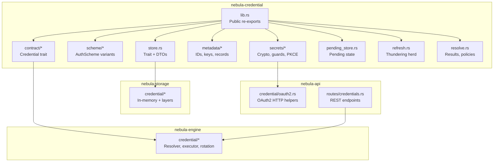
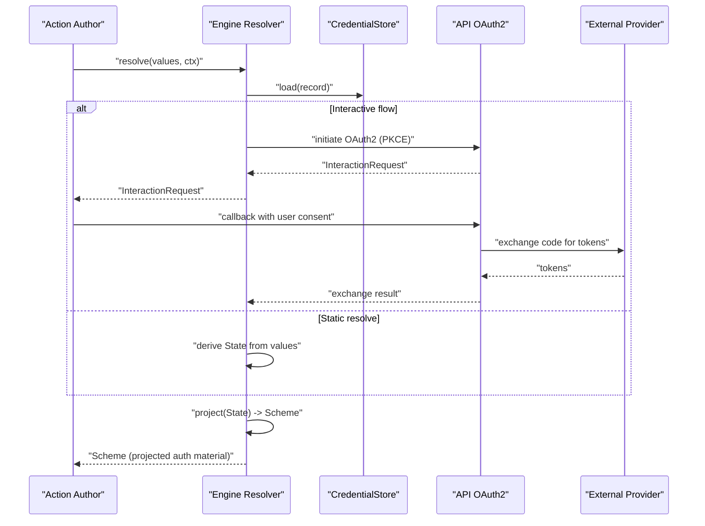
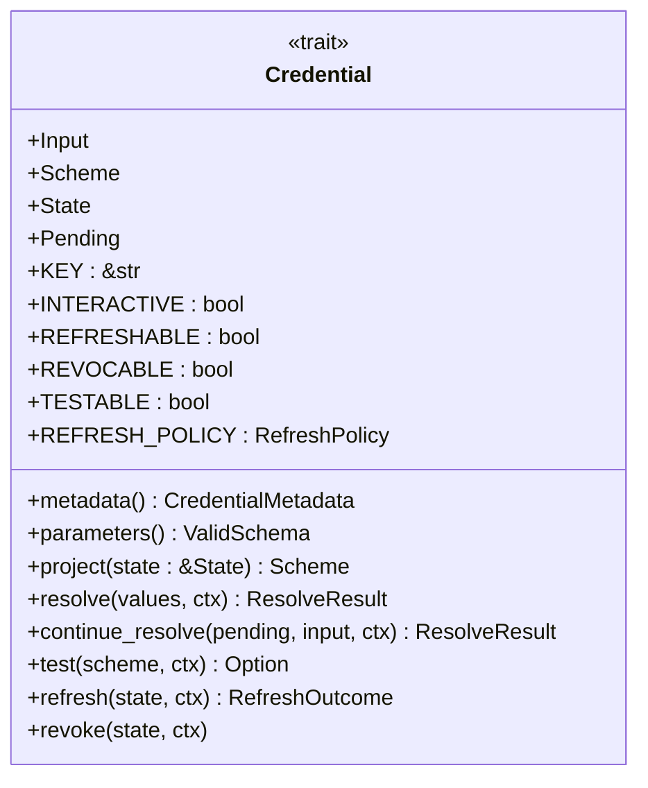
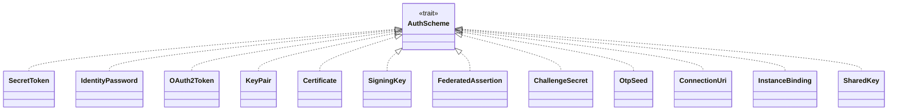
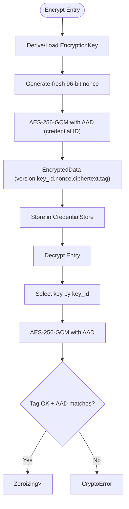
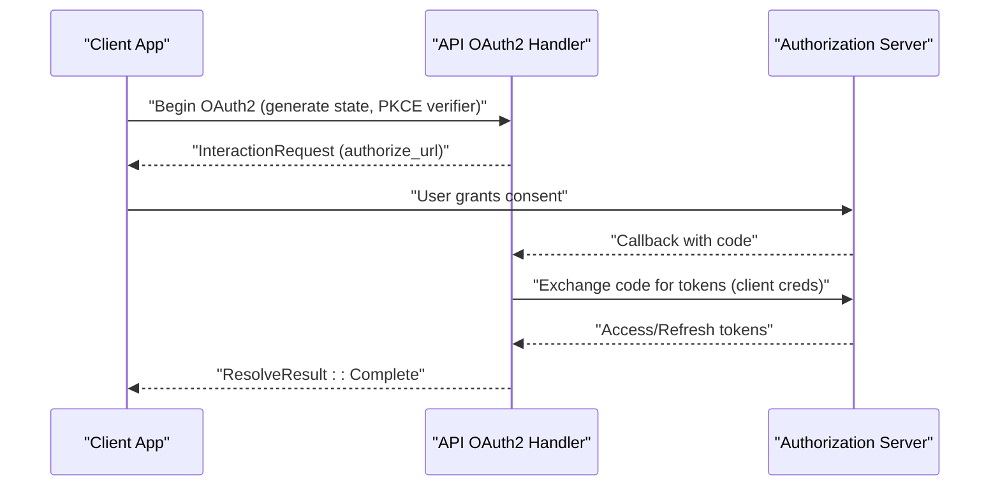
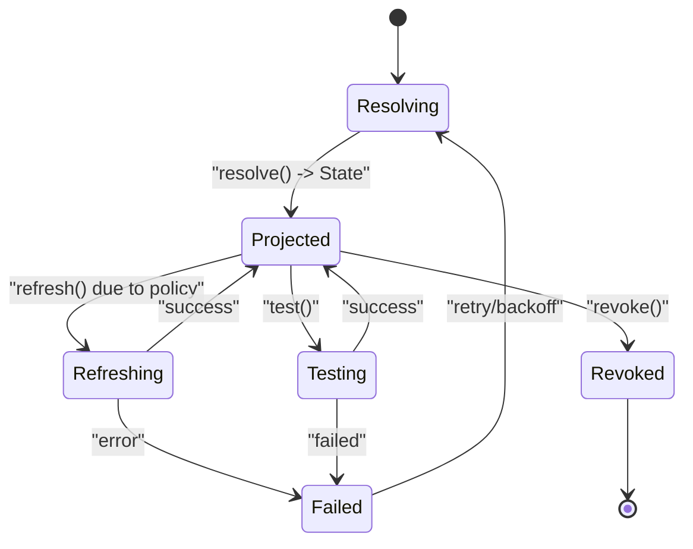
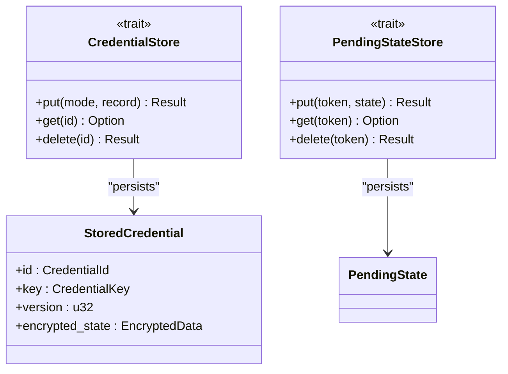
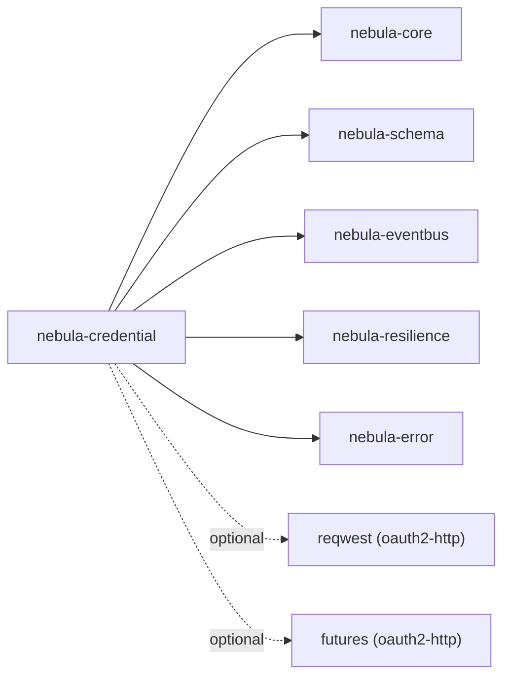

# Credential Management

<cite>
**Referenced Files in This Document**
- [lib.rs](file://crates/credential/src/lib.rs)
- [Cargo.toml](file://crates/credential/Cargo.toml)
- [README.md](file://crates/credential/README.md)
- [contract/mod.rs](file://crates/credential/src/contract/mod.rs)
- [contract/credential.rs](file://crates/credential/src/contract/credential.rs)
- [scheme/mod.rs](file://crates/credential/src/scheme/mod.rs)
- [secrets/mod.rs](file://crates/credential/src/secrets/mod.rs)
- [secrets/crypto.rs](file://crates/credential/src/secrets/crypto.rs)
- [metadata/mod.rs](file://crates/credential/src/metadata/mod.rs)
- [store.rs](file://crates/credential/src/store.rs)
- [store_memory.rs](file://crates/credential/src/store_memory.rs)
- [pending_store.rs](file://crates/credential/src/pending_store.rs)
- [pending_store_memory.rs](file://crates/credential/src/pending_store_memory.rs)
- [refresh.rs](file://crates/credential/src/refresh.rs)
- [resolve.rs](file://crates/credential/src/resolve.rs)
- [engine/credential/mod.rs](file://crates/engine/src/credential/mod.rs)
- [engine/credential/resolver.rs](file://crates/engine/src/credential/resolver.rs)
- [storage/credential/mod.rs](file://crates/storage/src/credential/mod.rs)
- [storage/credential/in_memory.rs](file://crates/storage/src/credential/in_memory.rs)
- [api/credential/mod.rs](file://crates/api/src/credential/mod.rs)
- [api/credential/oauth2.rs](file://crates/api/src/credential/oauth2.rs)
- [api/routes/credentials.rs](file://crates/api/src/routes/credentials.rs)
- [api/examples/simple_server.rs](file://crates/api/examples/simple_server.rs)
- [tests/e2e_oauth2_flow.rs](file://crates/api/tests/e2e_oauth2_flow.rs)
- [engine/tests/credential_rotation_exports_tests.rs](file://crates/engine/tests/credential_rotation_exports_tests.rs)
- [engine/tests/credential_pending_lifecycle_tests.rs](file://crates/engine/tests/credential_pending_lifecycle_tests.rs)
- [engine/tests/credential_resolve_snapshot_tests.rs](file://crates/engine/tests/credential_resolve_snapshot_tests.rs)
</cite>

## Table of Contents
1. [Introduction](#introduction)
2. [Project Structure](#project-structure)
3. [Core Components](#core-components)
4. [Architecture Overview](#architecture-overview)
5. [Detailed Component Analysis](#detailed-component-analysis)
6. [Dependency Analysis](#dependency-analysis)
7. [Performance Considerations](#performance-considerations)
8. [Troubleshooting Guide](#troubleshooting-guide)
9. [Conclusion](#conclusion)
10. [Appendices](#appendices)

## Introduction
This document explains Nebula's secure credential management system with a focus on:
- Stored state versus projected authentication material
- Encryption at rest and secret handling
- OAuth2 flow implementation and PKCE utilities
- Credential lifecycle, refresh, and rotation
- Authentication schemes and credential types
- Configuration options and integration points
- Relationships with the API layer and storage system

The goal is to help both beginners and experienced developers implement secure integrations using Nebula's typed credential contract and runtime orchestration.

## Project Structure
Nebula separates concerns across crates:
- nebula-credential: Typed credential contract, metadata, secrets, store traits, and runtime orchestration surfaces (moved to engine and storage per ADRs)
- nebula-engine: Runtime resolution, refresh coordination, and rotation orchestration
- nebula-storage: Persistent store implementations and layered composition
- nebula-api: OAuth2 HTTP ceremony and route integration
- nebula-schema: Field definitions and parameter schemas
- nebula-resilience: Retry/backoff and circuit-breaking for provider calls

**Diagram sources**
- [lib.rs:105-175](file://crates/credential/src/lib.rs#L105-L175)
- [engine/credential/mod.rs](file://crates/engine/src/credential/mod.rs)
- [storage/credential/mod.rs](file://crates/storage/src/credential/mod.rs)
- [api/credential/oauth2.rs](file://crates/api/src/credential/oauth2.rs)
- [api/routes/credentials.rs](file://crates/api/src/routes/credentials.rs)

**Section sources**
- [Cargo.toml:11-108](file://crates/credential/Cargo.toml#L11-L108)
- [lib.rs:1-175](file://crates/credential/src/lib.rs#L1-L175)

## Core Components
- Credential trait: Unified lifecycle covering resolve, project, refresh, test, revoke
- Authentication schemes: 12 built-in types plus extensible AuthScheme trait
- Secrets and encryption: AES-256-GCM with Argon2id KDF, AAD binding, zeroizing wrappers
- Store and pending state: Traits and in-memory implementations
- Refresh coordination: Thundering herd prevention
- Resolve pipeline: Results, policies, and user interaction

Key responsibilities:
- Action authors bind to a Credential type and receive only projected auth material
- Engine orchestrates stored-state vs projected material split
- Storage provides layered persistence (encryption, caching, auditing, scoping)
- API coordinates OAuth2 flows and HTTP interactions

**Section sources**
- [README.md:12-50](file://crates/credential/README.md#L12-L50)
- [lib.rs:19-36](file://crates/credential/src/lib.rs#L19-L36)
- [contract/credential.rs:27-97](file://crates/credential/src/contract/credential.rs#L27-L97)

## Architecture Overview
The credential system enforces a strict separation between stored state and projected auth material. The engine owns runtime orchestration; storage provides persistence; API handles OAuth2 HTTP flows; schema defines parameter forms; resilience governs retries.

**Diagram sources**
- [engine/credential/resolver.rs](file://crates/engine/src/credential/resolver.rs)
- [api/credential/oauth2.rs](file://crates/api/src/credential/oauth2.rs)
- [api/routes/credentials.rs](file://crates/api/src/routes/credentials.rs)
- [contract/credential.rs:165-196](file://crates/credential/src/contract/credential.rs#L165-L196)

## Detailed Component Analysis

### Credential Contract
The Credential trait unifies lifecycle operations and pins associated types for Scheme, State, and Pending. It also exposes capability flags and defaults for refresh/test/revoke.

**Diagram sources**
- [contract/credential.rs:98-245](file://crates/credential/src/contract/credential.rs#L98-L245)

**Section sources**
- [contract/credential.rs:27-97](file://crates/credential/src/contract/credential.rs#L27-L97)

### Authentication Schemes
Built-in schemes cover common patterns: SecretToken, IdentityPassword, OAuth2Token, KeyPair, Certificate, SigningKey, FederatedAssertion, ChallengeSecret, OtpSeed, ConnectionUri, InstanceBinding, SharedKey. The AuthScheme trait and AuthPattern classification enable resource integration.

**Diagram sources**
- [scheme/mod.rs:27-40](file://crates/credential/src/scheme/mod.rs#L27-L40)

**Section sources**
- [scheme/mod.rs:1-40](file://crates/credential/src/scheme/mod.rs#L1-L40)

### Secrets and Encryption
The secrets module provides authenticated encryption (AES-256-GCM), Argon2id KDF, PKCE utilities, and zeroizing wrappers. Encryption binds the credential ID via AAD to prevent record swapping. Fresh nonces are generated per encryption operation.

**Diagram sources**
- [secrets/crypto.rs:21-372](file://crates/credential/src/secrets/crypto.rs#L21-L372)

**Section sources**
- [secrets/mod.rs:1-35](file://crates/credential/src/secrets/mod.rs#L1-L35)
- [secrets/crypto.rs:21-372](file://crates/credential/src/secrets/crypto.rs#L21-L372)

### OAuth2 Flow and PKCE
The OAuth2 credential uses PKCE (S256) and random state parameters. When enabled via the oauth2-http feature, the API layer performs token exchanges and device-code polling. The engine coordinates continuation after user interaction.

**Diagram sources**
- [api/credential/oauth2.rs](file://crates/api/src/credential/oauth2.rs)
- [api/routes/credentials.rs](file://crates/api/src/routes/credentials.rs)
- [tests/e2e_oauth2_flow.rs](file://crates/api/tests/e2e_oauth2_flow.rs)

**Section sources**
- [secrets/crypto.rs:378-408](file://crates/credential/src/secrets/crypto.rs#L378-L408)
- [api/credential/oauth2.rs](file://crates/api/src/credential/oauth2.rs)
- [tests/e2e_oauth2_flow.rs](file://crates/api/tests/e2e_oauth2_flow.rs)

### Credential Lifecycle, Refresh, and Rotation
- Resolve: Single-step or interactive (with PendingState)
- Project: Transform stored State into Scheme for action/resource usage
- Refresh: Optional; controlled by RefreshPolicy; coordinated to prevent thundering herd
- Test: Optional; validates live connectivity
- Revoke: Optional; revokes at provider
- Rotation: Feature-gated; orchestrated by engine; maintains continuity for in-flight executions

**Diagram sources**
- [contract/credential.rs:165-244](file://crates/credential/src/contract/credential.rs#L165-L244)
- [refresh.rs](file://crates/credential/src/refresh.rs)
- [engine/credential/resolver.rs](file://crates/engine/src/credential/resolver.rs)

**Section sources**
- [contract/credential.rs:48-141](file://crates/credential/src/contract/credential.rs#L48-L141)
- [refresh.rs](file://crates/credential/src/refresh.rs)
- [engine/credential/resolver.rs](file://crates/engine/src/credential/resolver.rs)

### Store and Pending State
- CredentialStore trait defines persistence operations; concrete implementations live in storage
- PendingStateStore persists ephemeral interactive state until completion
- In-memory stores are provided for testing and internal use

**Diagram sources**
- [store.rs](file://crates/credential/src/store.rs)
- [store_memory.rs](file://crates/credential/src/store_memory.rs)
- [pending_store.rs](file://crates/credential/src/pending_store.rs)
- [pending_store_memory.rs](file://crates/credential/src/pending_store_memory.rs)

**Section sources**
- [store.rs](file://crates/credential/src/store.rs)
- [store_memory.rs](file://crates/credential/src/store_memory.rs)
- [pending_store.rs](file://crates/credential/src/pending_store.rs)
- [pending_store_memory.rs](file://crates/credential/src/pending_store_memory.rs)

### Metadata and Identifiers
- CredentialId: Prefixed ULID identifying a credential instance
- CredentialKey: Type-level key for the credential type
- CredentialRecord: Non-sensitive runtime state (created_at, version, expiry, tags)
- CredentialMetadata: Static descriptor (name, icon, documentation URL, parameters schema)

**Section sources**
- [metadata/mod.rs:1-29](file://crates/credential/src/metadata/mod.rs#L1-L29)

## Dependency Analysis
The credential crate depends on core, schema, eventbus, resilience, and optional HTTP client for OAuth2 flows. It re-exports public types from submodules to maintain a flat, ergonomic API surface.

**Diagram sources**
- [Cargo.toml:11-81](file://crates/credential/Cargo.toml#L11-L81)

**Section sources**
- [Cargo.toml:11-108](file://crates/credential/Cargo.toml#L11-L108)

## Performance Considerations
- Encryption: AES-256-GCM with Argon2id KDF; avoid excessive re-encryption; leverage key rotation with multi-key storage
- Nonces: Fresh 96-bit nonces per encryption; do not reuse across keys
- AAD: Bind credential ID to ciphertext to prevent swapping; decryption requires matching AAD
- Refresh: Use RefreshCoordinator to prevent thundering herd; tune RefreshPolicy for provider limits
- Serialization: Base64 helpers for binary fields; minimize allocations in hot paths
- HTTP: Enable oauth2-http feature only when needed; disable to remove reqwest dependency

[No sources needed since this section provides general guidance]

## Troubleshooting Guide
Common issues and remedies:
- Unsupported version: Ensure encryption version compatibility; re-encrypt legacy data
- AAD mismatch: Verify credential ID binding during encryption/decryption
- Thundering herd: Use RefreshCoordinator; adjust RefreshPolicy
- OAuth2 callback failures: Validate state parameter and PKCE verifier; check provider scopes
- Pending state errors: Confirm PendingStateStore availability and token lifecycle

**Section sources**
- [secrets/crypto.rs:194-315](file://crates/credential/src/secrets/crypto.rs#L194-L315)
- [refresh.rs](file://crates/credential/src/refresh.rs)
- [api/credential/oauth2.rs](file://crates/api/src/credential/oauth2.rs)
- [tests/e2e_oauth2_flow.rs](file://crates/api/tests/e2e_oauth2_flow.rs)

## Conclusion
Nebula's credential system enforces a strong separation between stored state and projected auth material, with robust encryption, standardized authentication schemes, and coordinated runtime orchestration. By leveraging the Credential trait, store abstractions, and OAuth2 helpers, developers can implement secure, maintainable integrations that remain resilient under rotation and refresh.

[No sources needed since this section summarizes without analyzing specific files]

## Appendices

### Configuration Options and Features
- oauth2-http: Enables reqwest-based token exchange and device-code polling
- rotation: Feature-gated rotation support
- test-util: Test-only helpers (never enable in production)

**Section sources**
- [Cargo.toml:95-104](file://crates/credential/Cargo.toml#L95-L104)

### Example Workflows and Integration Patterns
- Static credentials: Implement resolve returning StaticResolveResult with Scheme as State
- OAuth2 credentials: Use generate_random_state and generate_pkce_verifier; integrate with API routes for callbacks
- Rotation: Implement rotation events and outcomes; coordinate with engine for continuity
- Pending flows: Use PendingStateStore to persist ephemeral state until completion

**Section sources**
- [contract/credential.rs:63-97](file://crates/credential/src/contract/credential.rs#L63-L97)
- [secrets/crypto.rs:378-408](file://crates/credential/src/secrets/crypto.rs#L378-L408)
- [engine/tests/credential_rotation_exports_tests.rs](file://crates/engine/tests/credential_rotation_exports_tests.rs)
- [engine/tests/credential_pending_lifecycle_tests.rs](file://crates/engine/tests/credential_pending_lifecycle_tests.rs)
- [engine/tests/credential_resolve_snapshot_tests.rs](file://crates/engine/tests/credential_resolve_snapshot_tests.rs)