# Execution Model

<cite>
**Referenced Files in This Document**
- [lib.rs](file://crates/execution/src/lib.rs)
- [state.rs](file://crates/execution/src/state.rs)
- [status.rs](file://crates/execution/src/status.rs)
- [transition.rs](file://crates/execution/src/transition.rs)
- [journal.rs](file://crates/execution/src/journal.rs)
- [idempotency.rs](file://crates/execution/src/idempotency.rs)
- [replay.rs](file://crates/execution/src/replay.rs)
- [result.rs](file://crates/execution/src/result.rs)
- [context.rs](file://crates/execution/src/context.rs)
- [plan.rs](file://crates/execution/src/plan.rs)
- [error.rs](file://crates/execution/src/error.rs)
- [engine.rs](file://crates/engine/src/engine.rs)
- [execution_repo.rs](file://crates/storage/src/execution_repo.rs)
</cite>

## Table of Contents
1. [Introduction](#introduction)
2. [Project Structure](#project-structure)
3. [Core Components](#core-components)
4. [Architecture Overview](#architecture-overview)
5. [Detailed Component Analysis](#detailed-component-analysis)
6. [Dependency Analysis](#dependency-analysis)
7. [Performance Considerations](#performance-considerations)
8. [Troubleshooting Guide](#troubleshooting-guide)
9. [Conclusion](#conclusion)
10. [Appendices](#appendices)

## Introduction
This document explains Nebula’s execution model: how workflows are executed, tracked, and recovered. It focuses on the execution state machine, control queues, idempotency, lifecycle, journaling, snapshot persistence, and resume capabilities. It also documents configuration options, integration with the storage layer, and relationships with the engine and runtime scheduling. The goal is to make the execution model accessible to newcomers while providing deep technical insights for advanced implementations.

## Project Structure
Nebula separates concerns across crates:
- Execution model: defines state, status, transitions, journal, idempotency, replay, and results.
- Engine: orchestrates execution, schedules nodes, coordinates with storage, and manages leases.
- Storage: provides the persistence interface for state, journal, leases, outputs, and idempotency.

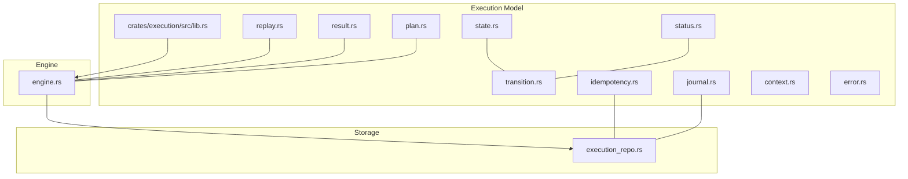

**Diagram sources**
- [lib.rs:1-63](file://crates/execution/src/lib.rs#L1-L63)
- [engine.rs:1-120](file://crates/engine/src/engine.rs#L1-L120)
- [execution_repo.rs:119-410](file://crates/storage/src/execution_repo.rs#L119-L410)

**Section sources**
- [lib.rs:1-63](file://crates/execution/src/lib.rs#L1-L63)

## Core Components
- Execution state machine: execution-level and node-level states with strict transitions.
- Journal: append-only audit trail of events.
- Idempotency: deterministic keys to prevent duplicate work.
- Replay: plan to re-run from a specific node while reusing stored outputs for unrelated branches.
- Results: summary of terminal outcomes and timing.
- Budget: concurrency, timeout, output size, and retry limits.
- Planning: parallel schedule derived from the workflow DAG.

**Section sources**
- [state.rs:20-441](file://crates/execution/src/state.rs#L20-L441)
- [status.rs:9-194](file://crates/execution/src/status.rs#L9-L194)
- [transition.rs:7-87](file://crates/execution/src/transition.rs#L7-L87)
- [journal.rs:10-158](file://crates/execution/src/journal.rs#L10-L158)
- [idempotency.rs:13-35](file://crates/execution/src/idempotency.rs#L13-L35)
- [replay.rs:27-136](file://crates/execution/src/replay.rs#L27-L136)
- [result.rs:25-121](file://crates/execution/src/result.rs#L25-L121)
- [context.rs:41-127](file://crates/execution/src/context.rs#L41-L127)
- [plan.rs:10-67](file://crates/execution/src/plan.rs#L10-L67)

## Architecture Overview
The engine executes workflows by:
- Building a dependency graph and computing a parallel schedule.
- Enforcing concurrency via a semaphore and a durable execution lease.
- Driving nodes through the node state machine, recording journal entries and outputs.
- Persisting state snapshots and final outcomes with optimistic concurrency control.
- Supporting resume and replay by reloading persisted state and outputs.

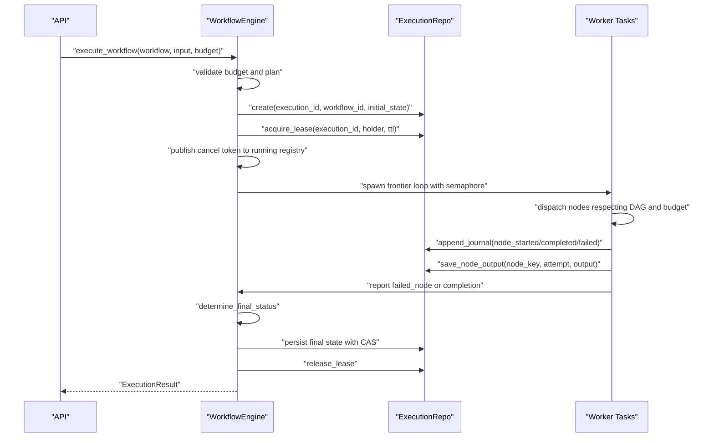

**Diagram sources**
- [engine.rs:947-1209](file://crates/engine/src/engine.rs#L947-L1209)
- [execution_repo.rs:121-190](file://crates/storage/src/execution_repo.rs#L121-L190)

## Detailed Component Analysis

### Execution State Machine and Transitions
- ExecutionStatus: Created, Running, Paused, Cancelling, Completed, Failed, Cancelled, TimedOut.
- NodeState: Pending, Ready, Running, Completed, Failed, Retrying, Skipped, Cancelled.
- Validation: Strict transition tables ensure audit trails remain consistent and timelines are correct.

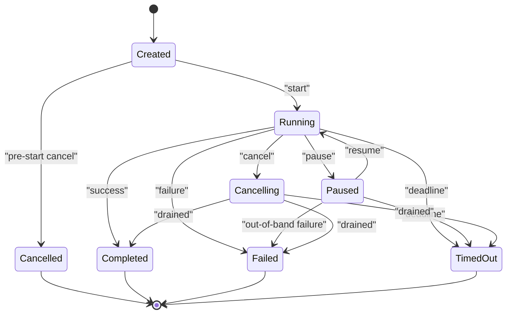

**Diagram sources**
- [status.rs:11-57](file://crates/execution/src/status.rs#L11-L57)
- [transition.rs:14-38](file://crates/execution/src/transition.rs#L14-L38)

**Section sources**
- [status.rs:9-194](file://crates/execution/src/status.rs#L9-L194)
- [transition.rs:7-87](file://crates/execution/src/transition.rs#L7-L87)
- [state.rs:120-441](file://crates/execution/src/state.rs#L120-L441)

### Control Queues and Lease Coordination
- Lease acquisition and heartbeat renewal coordinate runners to avoid concurrent writes.
- Heartbeat loss triggers cancellation and prevents persisting over another runner’s state.
- The running registry fences concurrent attempts to avoid overwriting live tokens.

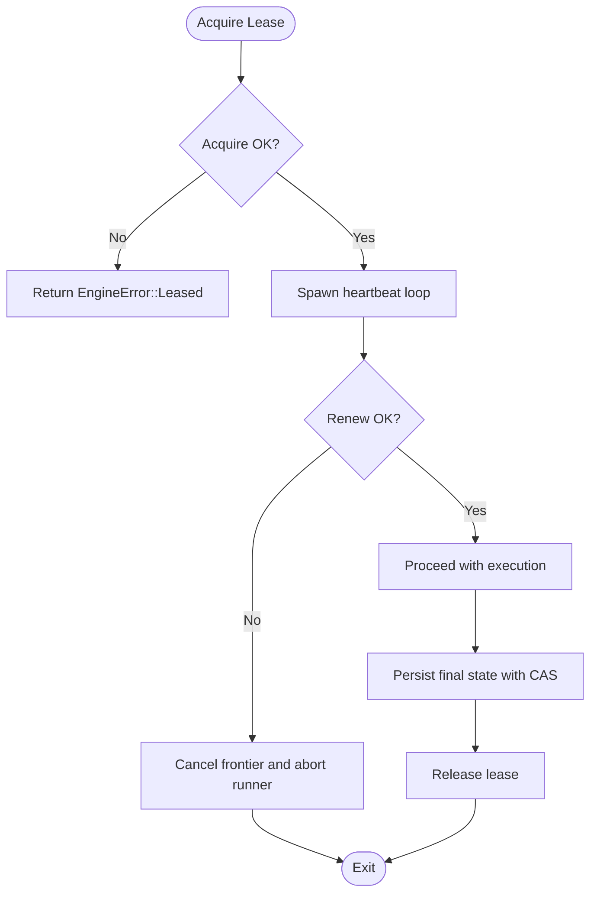

**Diagram sources**
- [engine.rs:779-936](file://crates/engine/src/engine.rs#L779-L936)
- [execution_repo.rs:154-182](file://crates/storage/src/execution_repo.rs#L154-L182)

**Section sources**
- [engine.rs:763-936](file://crates/engine/src/engine.rs#L763-L936)
- [execution_repo.rs:154-182](file://crates/storage/src/execution_repo.rs#L154-L182)

### Idempotency Handling
- IdempotencyKey is generated from execution_id, node_key, and attempt.
- The storage layer checks and marks keys to prevent duplicate work across retries or restarts.
- The execution state helper computes the correct key for the current attempt.

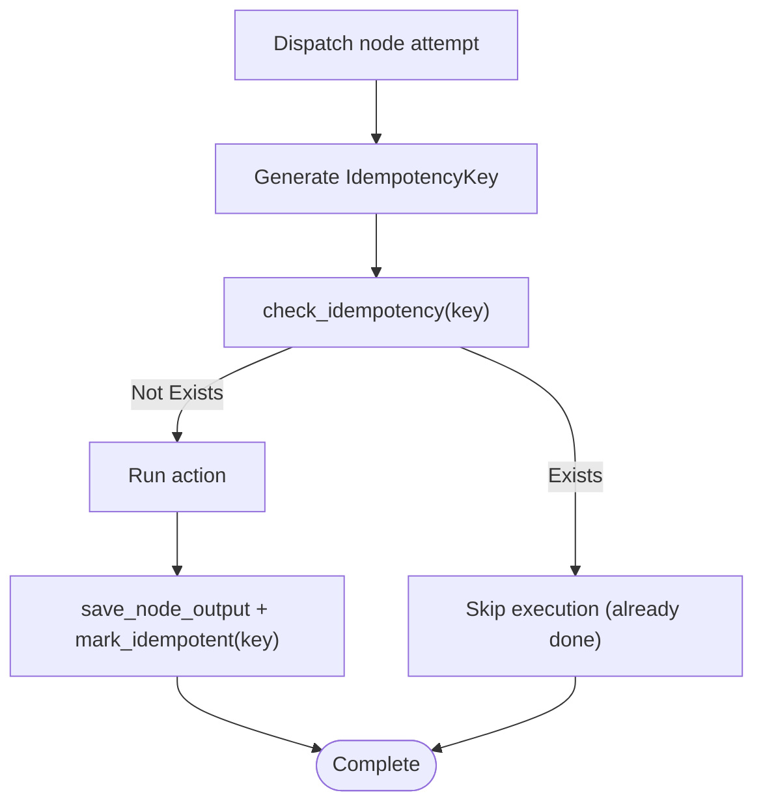

**Diagram sources**
- [idempotency.rs:17-29](file://crates/execution/src/idempotency.rs#L17-L29)
- [state.rs:228-258](file://crates/execution/src/state.rs#L228-L258)
- [execution_repo.rs:334-343](file://crates/storage/src/execution_repo.rs#L334-L343)

**Section sources**
- [idempotency.rs:13-79](file://crates/execution/src/idempotency.rs#L13-L79)
- [state.rs:228-258](file://crates/execution/src/state.rs#L228-L258)
- [execution_repo.rs:334-343](file://crates/storage/src/execution_repo.rs#L334-L343)

### Execution Lifecycle and Result Propagation
- Initial state is created and persisted, then transitioned to Running.
- Outputs are collected in a shared map and persisted per-node.
- Final status is determined, persisted with CAS reconciliation, and reported.

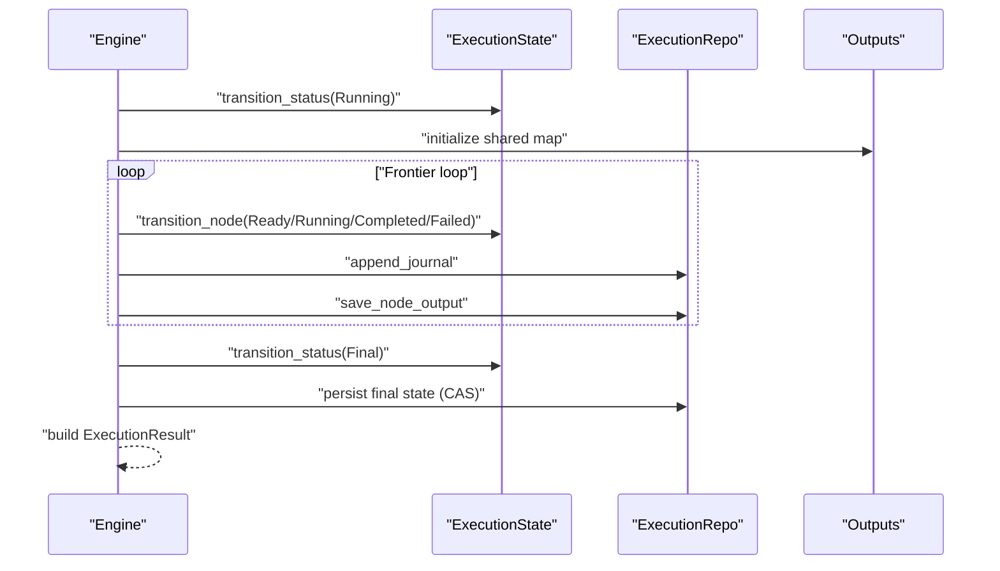

**Diagram sources**
- [engine.rs:947-1209](file://crates/engine/src/engine.rs#L947-L1209)
- [state.rs:425-440](file://crates/execution/src/state.rs#L425-L440)
- [journal.rs:10-158](file://crates/execution/src/journal.rs#L10-L158)

**Section sources**
- [engine.rs:947-1209](file://crates/engine/src/engine.rs#L947-L1209)
- [state.rs:425-440](file://crates/execution/src/state.rs#L425-L440)
- [journal.rs:10-158](file://crates/execution/src/journal.rs#L10-L158)

### Execution Journaling and Audit Trail
- JournalEntry captures all major lifecycle events: node scheduling, start, completion, failure, skipping, retrying, and execution-level events.
- Entries are append-only and serialized for auditability.

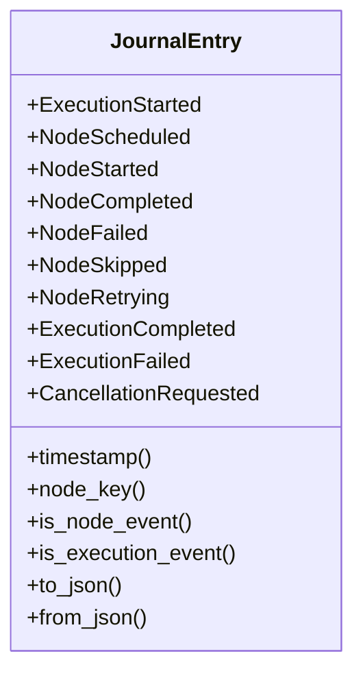

**Diagram sources**
- [journal.rs:10-158](file://crates/execution/src/journal.rs#L10-L158)

**Section sources**
- [journal.rs:9-321](file://crates/execution/src/journal.rs#L9-L321)

### Replay and Resume Capabilities
- ReplayPlan partitions nodes into pinned (reuse stored outputs) and rerun (re-execute) sets based on a replay-from node and DAG successors.
- ResumeExecution reloads persisted state and outputs, rebuilds edge activation maps, and continues from the frontier.

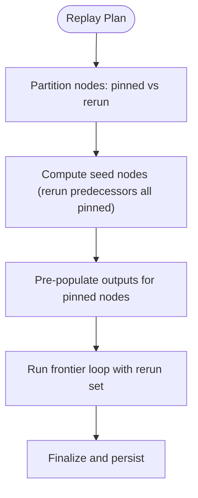

**Diagram sources**
- [replay.rs:109-136](file://crates/execution/src/replay.rs#L109-L136)
- [engine.rs:571-761](file://crates/engine/src/engine.rs#L571-L761)

**Section sources**
- [replay.rs:27-136](file://crates/execution/src/replay.rs#L27-L136)
- [engine.rs:571-761](file://crates/engine/src/engine.rs#L571-L761)

### Configuration Options and Parameters
- ExecutionBudget controls concurrency, wall-clock timeout, total output size, and total retries.
- ExecutionPlan encapsulates the parallel schedule, entry/exit nodes, and budget.

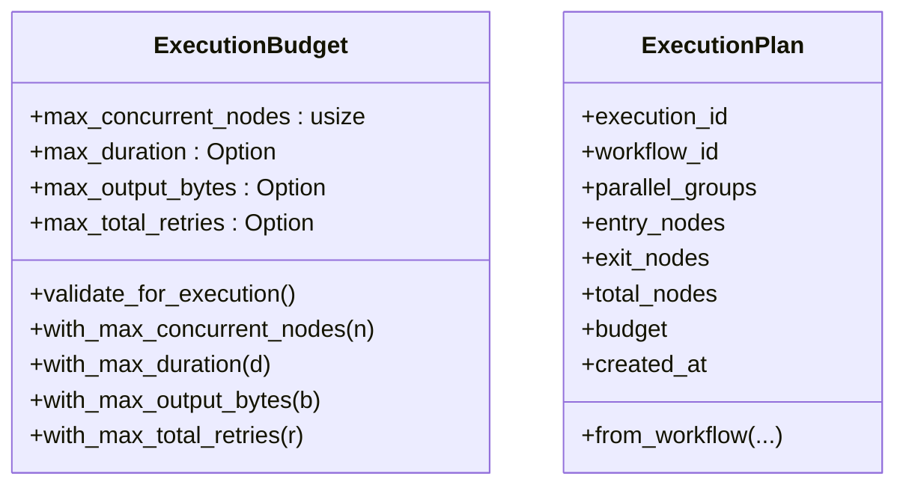

**Diagram sources**
- [context.rs:41-127](file://crates/execution/src/context.rs#L41-L127)
- [plan.rs:10-67](file://crates/execution/src/plan.rs#L10-L67)

**Section sources**
- [context.rs:25-127](file://crates/execution/src/context.rs#L25-L127)
- [plan.rs:10-67](file://crates/execution/src/plan.rs#L10-L67)

### Integration with Storage Layer
- ExecutionRepo defines the interface for state snapshots, journal, leases, outputs, idempotency, and node results.
- Engines use transition with expected version for optimistic concurrency and CAS reconciliation for final state.

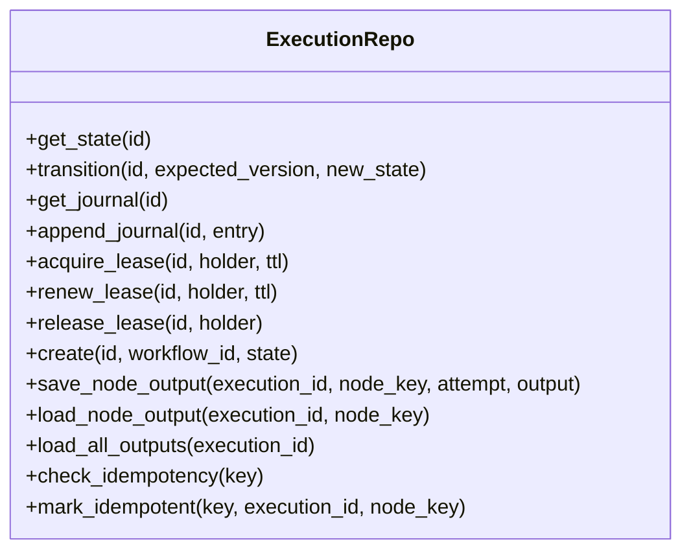

**Diagram sources**
- [execution_repo.rs:119-410](file://crates/storage/src/execution_repo.rs#L119-L410)

**Section sources**
- [execution_repo.rs:119-410](file://crates/storage/src/execution_repo.rs#L119-L410)

## Dependency Analysis
- Execution model depends on workflow definitions for graph construction and node state.
- Engine orchestrates execution, integrates with storage via ExecutionRepo, and coordinates leases and concurrency.
- Storage provides the durable primitives for state, journal, outputs, and idempotency.

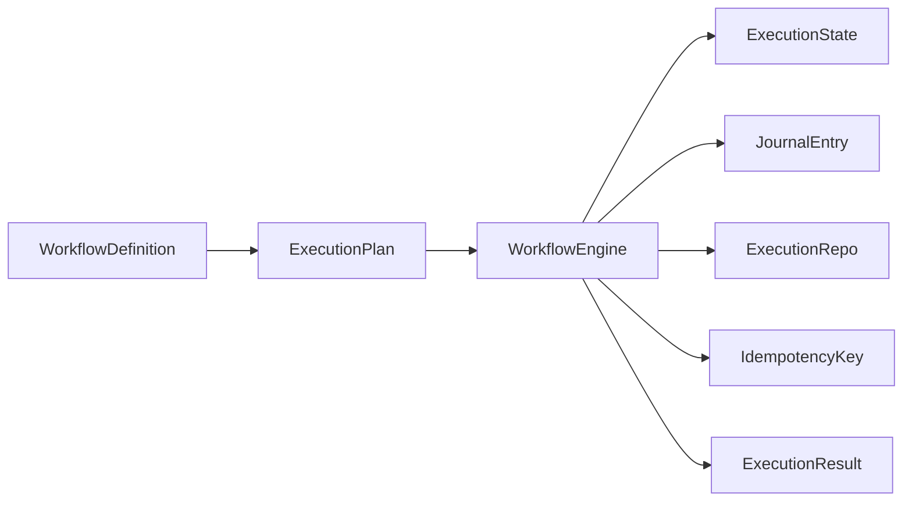

**Diagram sources**
- [plan.rs:32-67](file://crates/execution/src/plan.rs#L32-L67)
- [engine.rs:947-1209](file://crates/engine/src/engine.rs#L947-L1209)
- [state.rs:120-171](file://crates/execution/src/state.rs#L120-L171)
- [journal.rs:10-158](file://crates/execution/src/journal.rs#L10-L158)
- [idempotency.rs:17-29](file://crates/execution/src/idempotency.rs#L17-L29)
- [result.rs:25-121](file://crates/execution/src/result.rs#L25-L121)
- [execution_repo.rs:119-190](file://crates/storage/src/execution_repo.rs#L119-L190)

**Section sources**
- [plan.rs:32-67](file://crates/execution/src/plan.rs#L32-L67)
- [engine.rs:947-1209](file://crates/engine/src/engine.rs#L947-L1209)
- [state.rs:120-171](file://crates/execution/src/state.rs#L120-L171)
- [journal.rs:10-158](file://crates/execution/src/journal.rs#L10-L158)
- [idempotency.rs:17-29](file://crates/execution/src/idempotency.rs#L17-L29)
- [result.rs:25-121](file://crates/execution/src/result.rs#L25-L121)
- [execution_repo.rs:119-190](file://crates/storage/src/execution_repo.rs#L119-L190)

## Performance Considerations
- Concurrency control: tune max_concurrent_nodes to balance throughput and resource usage.
- Output size limits: cap total output bytes to control memory pressure and persistence overhead.
- Retry budgets: limit max_total_retries to prevent runaway retry storms.
- Journaling: append-only entries keep audit trails compact; consider retention policies.
- Lease TTL and heartbeat intervals: balance responsiveness to crashes with heartbeat overhead.
- CAS reconciliation: final state persistence uses expected version to avoid overwrites; monitor conflicts.

[No sources needed since this section provides general guidance]

## Troubleshooting Guide
Common issues and patterns:
- Invalid transitions: ensure state changes follow the transition tables; errors indicate incorrect sequencing.
- Lease contention: when heartbeat is lost or another runner holds the lease, the engine aborts to prevent inconsistent state.
- CAS conflicts: final state persistence may reconcile external transitions; investigate observed status and versions.
- Missing pinned outputs in replay: ensure ReplayPlan includes outputs for every pinned node.
- Budget validation: zero concurrency is rejected; validate budget before execution.

**Section sources**
- [transition.rs:77-87](file://crates/execution/src/transition.rs#L77-L87)
- [engine.rs:1078-1168](file://crates/engine/src/engine.rs#L1078-L1168)
- [engine.rs:1501-1574](file://crates/engine/src/engine.rs#L1501-L1574)
- [replay.rs:616-635](file://crates/execution/src/replay.rs#L616-L635)
- [context.rs:83-88](file://crates/execution/src/context.rs#L83-L88)

## Conclusion
Nebula’s execution model combines a strict state machine, durable persistence, and robust orchestration to deliver reliable workflow execution. The engine coordinates scheduling, idempotency, and recovery, while the storage layer ensures consistency and auditability. By tuning budgets, leveraging replay and resume, and following the transition and lease contracts, teams can implement scalable and observable execution scenarios.

[No sources needed since this section summarizes without analyzing specific files]

## Appendices

### Implementation Patterns for Authors and Operators
- Define clear error strategies and budgets to guide node execution and edge evaluation.
- Use ReplayPlan to isolate re-execution to affected branches while preserving side effects elsewhere.
- Monitor journal entries and ExecutionResult for diagnostics and SLA tracking.
- Implement idempotency guards around actions that may be retried or replayed.
- Prefer deterministic inputs and outputs to simplify resume and replay correctness.

[No sources needed since this section provides general guidance]