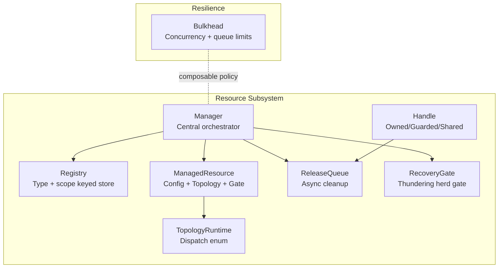
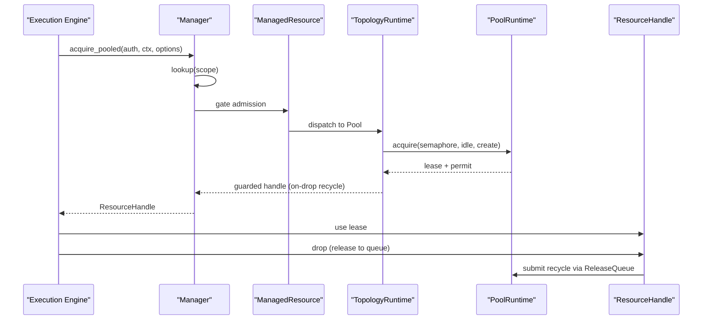
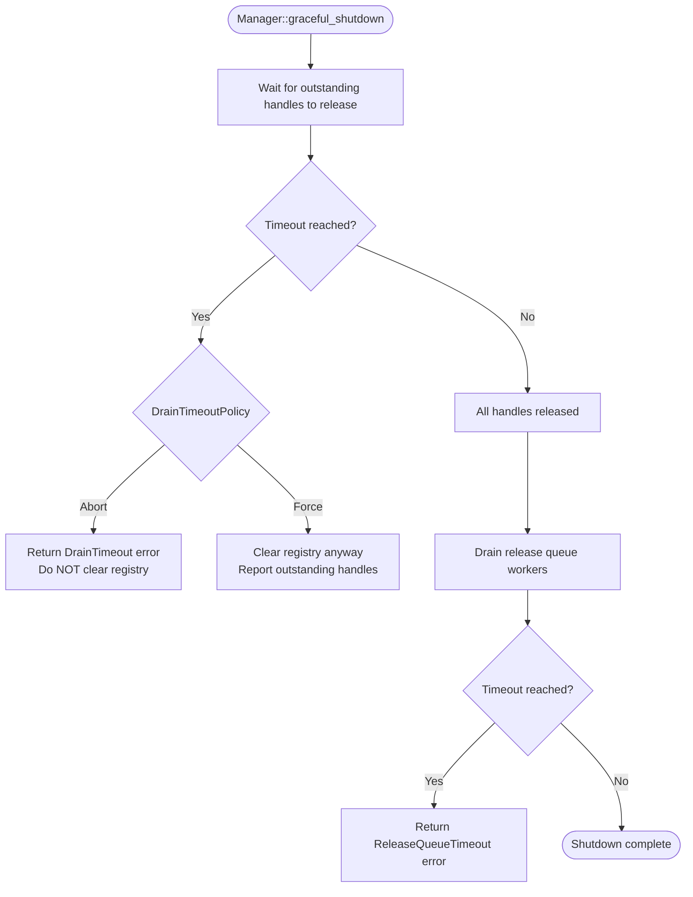
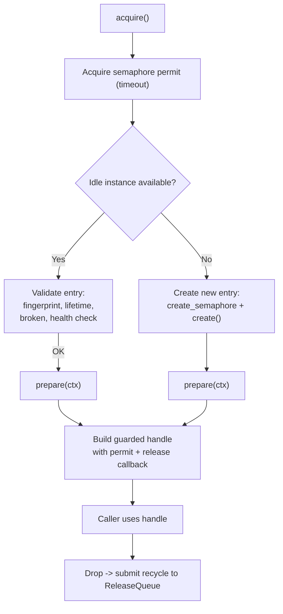
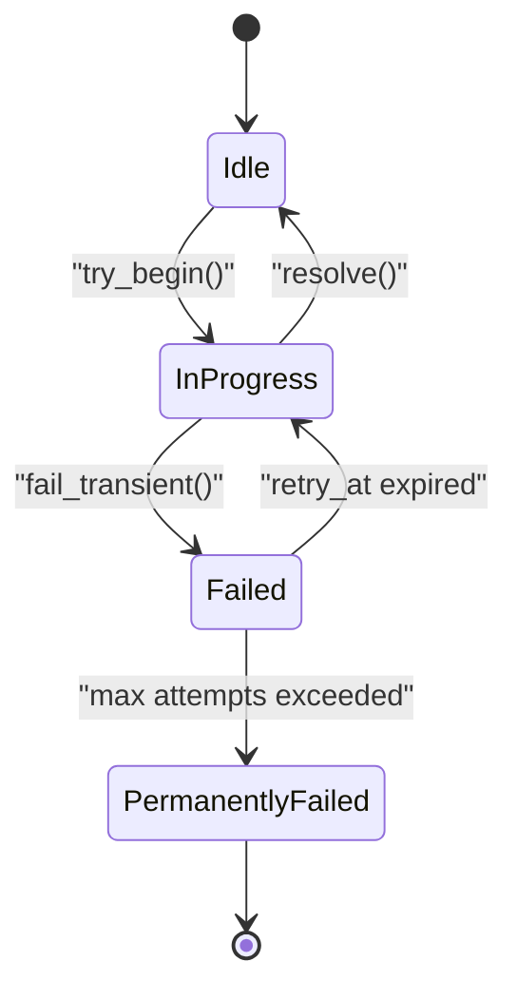
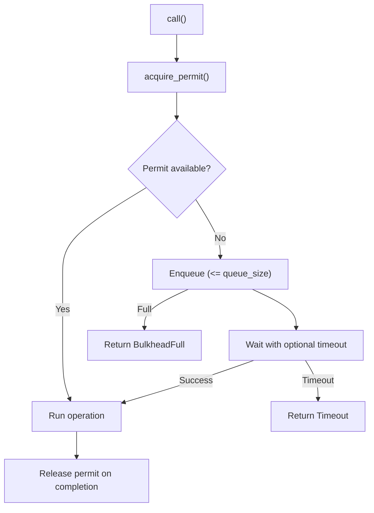
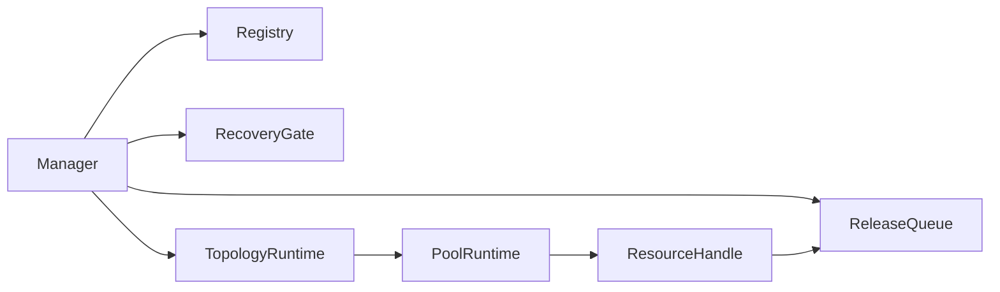

# Resource Lifecycle Management

<cite>
**Referenced Files in This Document**
- [lib.rs](file://crates/resource/src/lib.rs)
- [manager.rs](file://crates/resource/src/manager.rs)
- [mod.rs](file://crates/resource/src/runtime/mod.rs)
- [pool.rs](file://crates/resource/src/runtime/pool.rs)
- [handle.rs](file://crates/resource/src/handle.rs)
- [state.rs](file://crates/resource/src/state.rs)
- [bulkhead.rs](file://crates/resilience/src/bulkhead.rs)
- [gate.rs](file://crates/resource/src/recovery/gate.rs)
- [mod.rs](file://crates/resource/src/recovery/mod.rs)
- [integration_mod.rs](file://crates/resource/src/integration/mod.rs)
</cite>

## Table of Contents
1. [Introduction](#introduction)
2. [Project Structure](#project-structure)
3. [Core Components](#core-components)
4. [Architecture Overview](#architecture-overview)
5. [Detailed Component Analysis](#detailed-component-analysis)
6. [Dependency Analysis](#dependency-analysis)
7. [Performance Considerations](#performance-considerations)
8. [Troubleshooting Guide](#troubleshooting-guide)
9. [Conclusion](#conclusion)
10. [Appendices](#appendices)

## Introduction
This document explains Nebula’s resource lifecycle management with a focus on the bulkhead pattern and resource pooling. It covers how resources are developed, registered, acquired, monitored, and torn down safely across scopes. It also documents hot-reload via generation tracking, recovery gates to prevent thundering herds, and integration points with the execution engine and credential management. The goal is to make resource authoring approachable for beginners while providing deep technical insights for advanced integrators.

## Project Structure
Nebula’s resource subsystem centers around a Manager that owns the registry, lifecycle orchestration, and shutdown. Topologies (pool, resident, service, transport, exclusive, event source, daemon) are dispatched via a unified runtime enum. Handles encapsulate lease ownership modes and integrate with a release queue for safe async teardown. Recovery gates serialize backend recovery to avoid cascading failures. The resilience crate provides a reusable bulkhead pattern that can be composed with resource acquisition.



**Diagram sources**
- [manager.rs:228-250](file://crates/resource/src/manager.rs#L228-L250)
- [mod.rs:27-62](file://crates/resource/src/runtime/mod.rs#L27-L62)
- [handle.rs:26-57](file://crates/resource/src/handle.rs#L26-L57)
- [pool.rs:78-94](file://crates/resource/src/runtime/pool.rs#L78-L94)
- [bulkhead.rs:20-56](file://crates/resilience/src/bulkhead.rs#L20-L56)

**Section sources**
- [lib.rs:1-108](file://crates/resource/src/lib.rs#L1-L108)
- [manager.rs:1-16](file://crates/resource/src/manager.rs#L1-L16)

## Core Components
- Manager: central registry, acquire dispatch, graceful shutdown, drain tracking, and event emission.
- TopologyRuntime: dispatch enum for pool, resident, service, transport, exclusive, event source, and daemon topologies.
- PoolRuntime: pool topology with concurrency limits, idle queue, maintenance, and warmup.
- ResourceHandle: RAII wrapper for leases with Owned/Guarded/Shared modes and drain-aware teardown.
- RecoveryGate: CAS-based gate to serialize recovery and prevent thundering herd.
- Bulkhead: semaphore-based concurrency limiter with queueing and timeouts.

**Section sources**
- [manager.rs:228-250](file://crates/resource/src/manager.rs#L228-L250)
- [mod.rs:27-62](file://crates/resource/src/runtime/mod.rs#L27-L62)
- [pool.rs:78-94](file://crates/resource/src/runtime/pool.rs#L78-L94)
- [handle.rs:26-57](file://crates/resource/src/handle.rs#L26-L57)
- [bulkhead.rs:60-70](file://crates/resilience/src/bulkhead.rs#L60-L70)
- [gate.rs:209-230](file://crates/resource/src/recovery/gate.rs#L209-L230)

## Architecture Overview
The resource lifecycle follows a strict owner model: the engine (Manager) owns acquisition, health, hot-reload, and scope-aware teardown. Action code receives a ResourceHandle that derefs to the lease and releases on drop. Topologies encapsulate lifecycle behavior, and recovery gates protect backends from cascading failures.



**Diagram sources**
- [manager.rs:706-790](file://crates/resource/src/manager.rs#L706-L790)
- [mod.rs:27-62](file://crates/resource/src/runtime/mod.rs#L27-L62)
- [pool.rs:239-327](file://crates/resource/src/runtime/pool.rs#L239-L327)
- [handle.rs:255-316](file://crates/resource/src/handle.rs#L255-L316)

## Detailed Component Analysis

### Manager: Registration, Acquisition, and Graceful Shutdown
- Registration: validates config, installs ManagedResource, advances phase to Ready, records metrics and events.
- Acquire: scope-aware lookup, optional recovery gate admission, optional acquire resilience, topology dispatch, and drain tracking.
- Shutdown: coordinated cancellation, drain outstanding handles, optional force-clear registry, and release-queue drain with timeouts.



**Diagram sources**
- [manager.rs:82-181](file://crates/resource/src/manager.rs#L82-L181)

**Section sources**
- [manager.rs:292-359](file://crates/resource/src/manager.rs#L292-L359)
- [manager.rs:706-790](file://crates/resource/src/manager.rs#L706-L790)
- [manager.rs:84-132](file://crates/resource/src/manager.rs#L84-L132)

### TopologyRuntime: Dispatch and Tagging
- Encapsulates topology-specific runtimes behind a single enum for registration-time storage.
- Provides a tag for observability and lifecycle reporting.

**Section sources**
- [mod.rs:27-62](file://crates/resource/src/runtime/mod.rs#L27-L62)

### PoolRuntime: Resource Pooling and Lifecycle
- Enforces concurrency via a semaphore (max_size).
- Maintains an idle queue and optional warmup strategies.
- Implements maintenance: eviction on stale fingerprint, max lifetime, or idle timeout.
- Supports non-blocking acquire (load shedding) and blocking acquire with timeouts.
- Builds guarded handles with on-drop recycle via ReleaseQueue.



**Diagram sources**
- [pool.rs:239-327](file://crates/resource/src/runtime/pool.rs#L239-L327)
- [pool.rs:329-417](file://crates/resource/src/runtime/pool.rs#L329-L417)
- [pool.rs:437-525](file://crates/resource/src/runtime/pool.rs#L437-L525)
- [pool.rs:527-596](file://crates/resource/src/runtime/pool.rs#L527-L596)

**Section sources**
- [pool.rs:78-94](file://crates/resource/src/runtime/pool.rs#L78-L94)
- [pool.rs:176-237](file://crates/resource/src/runtime/pool.rs#L176-L237)
- [pool.rs:239-327](file://crates/resource/src/runtime/pool.rs#L239-L327)
- [pool.rs:527-596](file://crates/resource/src/runtime/pool.rs#L527-L596)

### ResourceHandle: Ownership Modes and Teardown
- Owned: direct lease ownership; no pool return.
- Guarded: exclusive lease; on drop, invokes release callback and returns permit to semaphore.
- Shared: Arc-wrapped lease; on drop, invokes release callback.
- Drain tracking: increments on acquisition, decrements on drop; used by Manager to coordinate shutdown.

```mermaid
classDiagram
class ResourceHandle {
+owned(lease, key, tag)
+guarded(lease, key, tag, gen, on_release)
+guarded_with_permit(lease, key, tag, gen, on_release, permit)
+shared(lease, key, tag, gen, on_release)
+with_drain_tracker(tracker)
+taint()
+detach() Option
+hold_duration() Duration
+resource_key() ResourceKey
+topology_tag() TopologyTag
+generation() Option<u64>
}
class HandleInner {
<<enum>>
+Owned(Lease)
+Guarded { value, on_release, permit, tainted, acquired_at, generation }
+Shared { value, on_release, tainted, acquired_at, generation }
}
ResourceHandle --> HandleInner : "contains"
```

**Diagram sources**
- [handle.rs:26-57](file://crates/resource/src/handle.rs#L26-L57)
- [handle.rs:59-236](file://crates/resource/src/handle.rs#L59-L236)

**Section sources**
- [handle.rs:26-57](file://crates/resource/src/handle.rs#L26-L57)
- [handle.rs:255-316](file://crates/resource/src/handle.rs#L255-L316)

### Recovery Gates: Thundering Herd Prevention
- CAS-based state machine: Idle → InProgress → resolve to Idle, or fail_transient with backoff, or fail_permanent.
- Ticket lifecycle: try_begin grants a ticket; caller resolves on success or calls fail_transient/fail_permanent on failure.
- Waiter support: allows callers to await state changes.



**Diagram sources**
- [gate.rs:29-54](file://crates/resource/src/recovery/gate.rs#L29-L54)
- [gate.rs:245-294](file://crates/resource/src/recovery/gate.rs#L245-L294)
- [gate.rs:301-345](file://crates/resource/src/recovery/gate.rs#L301-L345)

**Section sources**
- [gate.rs:1-14](file://crates/resource/src/recovery/gate.rs#L1-L14)
- [gate.rs:209-357](file://crates/resource/src/recovery/gate.rs#L209-L357)

### Bulkhead Pattern: Concurrency Limiting
- Limits concurrent operations via a semaphore with configurable queue size and optional timeout.
- Emits rejection events via a sink for observability.
- Integrates cleanly with resource acquisition to prevent overload.



**Diagram sources**
- [bulkhead.rs:128-155](file://crates/resilience/src/bulkhead.rs#L128-L155)
- [bulkhead.rs:159-213](file://crates/resilience/src/bulkhead.rs#L159-L213)

**Section sources**
- [bulkhead.rs:20-56](file://crates/resilience/src/bulkhead.rs#L20-L56)
- [bulkhead.rs:128-213](file://crates/resilience/src/bulkhead.rs#L128-L213)

### Health Monitoring and Recovery Mechanisms
- Manager tracks ResourceStatus with ResourcePhase and generation; emits ResourceEvent for lifecycle.
- RecoveryGate integrates with Manager::acquire to fast-fail or wait during backend recovery.
- PoolRuntime supports test_on_checkout and broken checks to maintain pool health.

**Section sources**
- [state.rs:6-48](file://crates/resource/src/state.rs#L6-L48)
- [manager.rs:47-60](file://crates/resource/src/manager.rs#L47-L60)
- [manager.rs:734-770](file://crates/resource/src/manager.rs#L734-L770)
- [pool.rs:389-394](file://crates/resource/src/runtime/pool.rs#L389-L394)

### Hot-Reload via Generation Tracking
- ManagedResource maintains a generation counter; PoolRuntime compares fingerprints to evict stale idle entries.
- Manager::reload_config updates current fingerprint; handles acquired before reload continue using prior generation.

**Section sources**
- [state.rs:50-76](file://crates/resource/src/state.rs#L50-L76)
- [pool.rs:147-151](file://crates/resource/src/runtime/pool.rs#L147-L151)
- [pool.rs:188-237](file://crates/resource/src/runtime/pool.rs#L188-L237)

### Scope-Aware Teardown and Drain Coordination
- ResourceHandle::with_drain_tracker increments a shared counter on acquisition; decrements on drop and notifies Manager shutdown.
- Manager::graceful_shutdown waits for counter to reach zero or times out according to policy.

**Section sources**
- [handle.rs:140-147](file://crates/resource/src/handle.rs#L140-L147)
- [manager.rs:16-15](file://crates/resource/src/manager.rs#L16-L15)
- [manager.rs:82-132](file://crates/resource/src/manager.rs#L82-L132)

### Integration Patterns with Execution Engine and Credentials
- Manager::register accepts optional AcquireResilience and RecoveryGate to wrap acquisition.
- ResourceConfig::validate is enforced during registration.
- Topology runtimes are constructed with runtime-specific configs and shared ReleaseQueue.

**Section sources**
- [manager.rs:292-359](file://crates/resource/src/manager.rs#L292-L359)
- [manager.rs:315-359](file://crates/resource/src/manager.rs#L315-L359)
- [integration_mod.rs:1-10](file://crates/resource/src/integration/mod.rs#L1-L10)

## Dependency Analysis
- Manager depends on Registry, RecoveryGroupRegistry, ReleaseQueue, and telemetry metrics.
- ManagedResource embeds TopologyRuntime and ReleaseQueue; PoolRuntime depends on semaphore and idle queue.
- ResourceHandle depends on topology tag and optional drain tracker.
- RecoveryGate is independent and composable with acquisition paths.



**Diagram sources**
- [manager.rs:236-250](file://crates/resource/src/manager.rs#L236-L250)
- [mod.rs:27-62](file://crates/resource/src/runtime/mod.rs#L27-L62)
- [pool.rs:78-94](file://crates/resource/src/runtime/pool.rs#L78-L94)
- [handle.rs:26-57](file://crates/resource/src/handle.rs#L26-L57)

**Section sources**
- [manager.rs:236-250](file://crates/resource/src/manager.rs#L236-L250)
- [mod.rs:27-62](file://crates/resource/src/runtime/mod.rs#L27-L62)
- [pool.rs:78-94](file://crates/resource/src/runtime/pool.rs#L78-L94)
- [handle.rs:26-57](file://crates/resource/src/handle.rs#L26-L57)

## Performance Considerations
- PoolRuntime enforces max_size concurrency and caps concurrent creation via create_semaphore to avoid backend stampedes.
- test_on_checkout and broken checks reduce faulty reuse and improve pool stability.
- ReleaseQueue offloads async teardown to prevent blocking acquisition paths.
- RecoveryGate reduces contention on failing backends by serializing recovery attempts.
- Bulkhead provides queueing and timeouts to shed load predictably.

[No sources needed since this section provides general guidance]

## Troubleshooting Guide
Common issues and resolutions for resource authors:
- Pool full/backpressure: adjust max_size or use try_acquire to shed load; ensure create_timeout and queue sizes are appropriate.
- Stale idle instances after reload: verify ResourceConfig::fingerprint and ManagedResource generation; PoolRuntime evicts mismatched entries.
- Handle leaks during shutdown: ensure ResourceHandle is dropped; drain tracker will decrement and notify Manager.
- Recovery gate stalls: inspect GateState; use RecoveryGate::reset for admin override; tune max_attempts and base_backoff.
- Release callback panics: handled safely; permit is returned to semaphore; investigate callback logic.

**Section sources**
- [pool.rs:420-435](file://crates/resource/src/runtime/pool.rs#L420-L435)
- [pool.rs:188-237](file://crates/resource/src/runtime/pool.rs#L188-L237)
- [handle.rs:255-316](file://crates/resource/src/handle.rs#L255-L316)
- [gate.rs:347-356](file://crates/resource/src/recovery/gate.rs#L347-L356)
- [manager.rs:82-132](file://crates/resource/src/manager.rs#L82-L132)

## Conclusion
Nebula’s resource lifecycle management centers on a robust Manager with topology-agnostic runtime dispatch, safe handle ownership, and resilient recovery mechanisms. The pool topology provides concurrency control and maintenance, while RecoveryGates and Bulkheads protect backends and the system from cascading failures. Integration with the execution engine and telemetry enables observability and controlled shutdowns.

[No sources needed since this section summarizes without analyzing specific files]

## Appendices

### Configuration Options and Parameters
- ManagerConfig: release_queue_workers, metrics_registry.
- ShutdownConfig: drain_timeout, on_drain_timeout, release_queue_timeout.
- PoolConfig: max_size, min_size, max_concurrent_creates, create_timeout, idle_timeout, max_lifetime, test_on_checkout, warmup strategy.
- RecoveryGateConfig: max_attempts, base_backoff.
- BulkheadConfig: max_concurrency, queue_size, timeout.

**Section sources**
- [manager.rs:190-212](file://crates/resource/src/manager.rs#L190-L212)
- [manager.rs:84-132](file://crates/resource/src/manager.rs#L84-L132)
- [pool.rs:98-140](file://crates/resource/src/runtime/pool.rs#L98-L140)
- [gate.rs:57-72](file://crates/resource/src/recovery/gate.rs#L57-L72)
- [bulkhead.rs:20-56](file://crates/resilience/src/bulkhead.rs#L20-L56)

### Topology Patterns and Examples
- Pooled: interchangeable instances with checkout/recycle; supports warmup and maintenance.
- Resident: single shared instance; clone on acquire.
- Service: long-lived runtime with short-lived tokens.
- Transport: shared connection with multiplexed sessions.
- Exclusive: one caller at a time via semaphore(1).
- EventSource: pull-based event subscription.
- Daemon: background run loop with restart policy.

**Section sources**
- [mod.rs:27-62](file://crates/resource/src/runtime/mod.rs#L27-L62)
- [lib.rs:96-108](file://crates/resource/src/lib.rs#L96-L108)