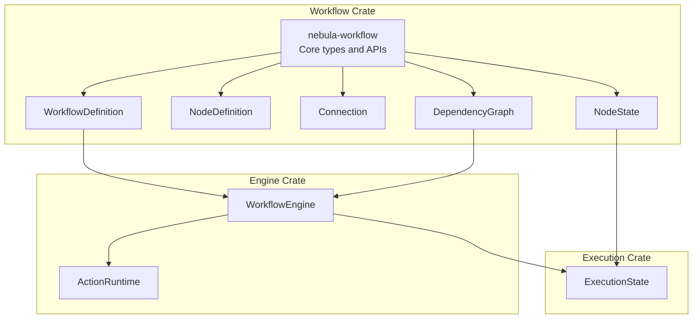
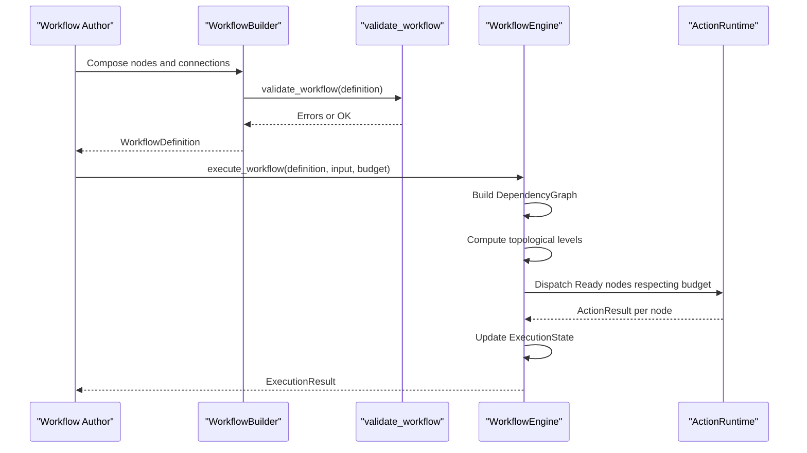
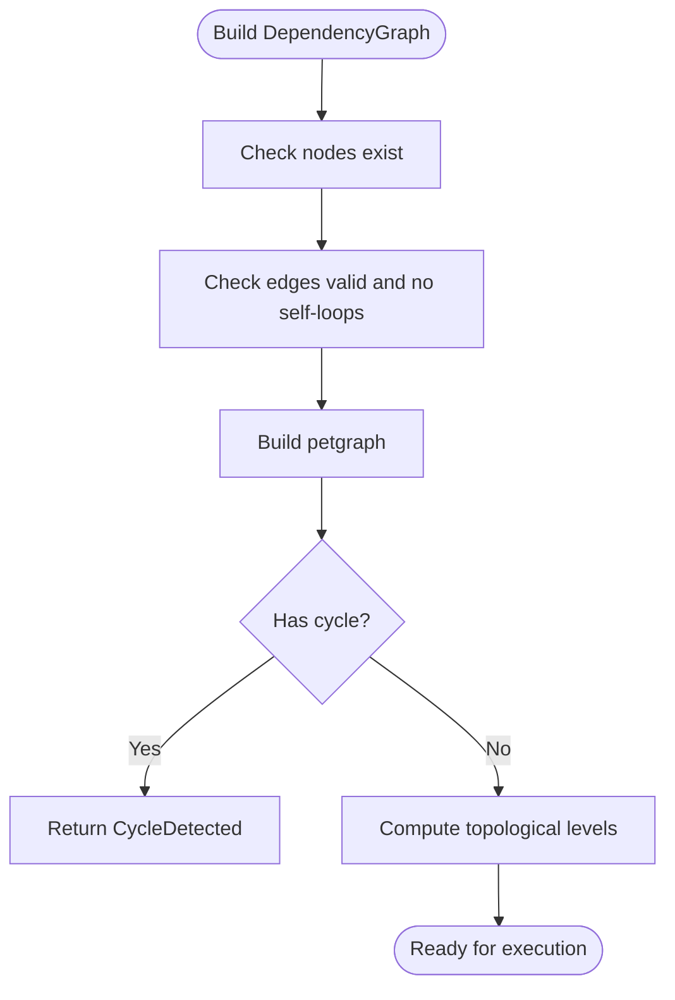
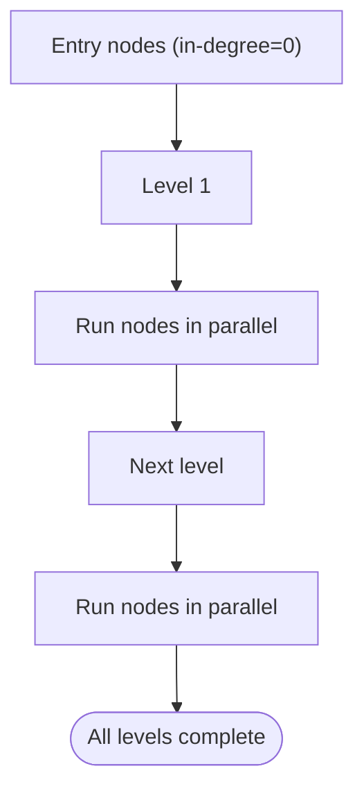
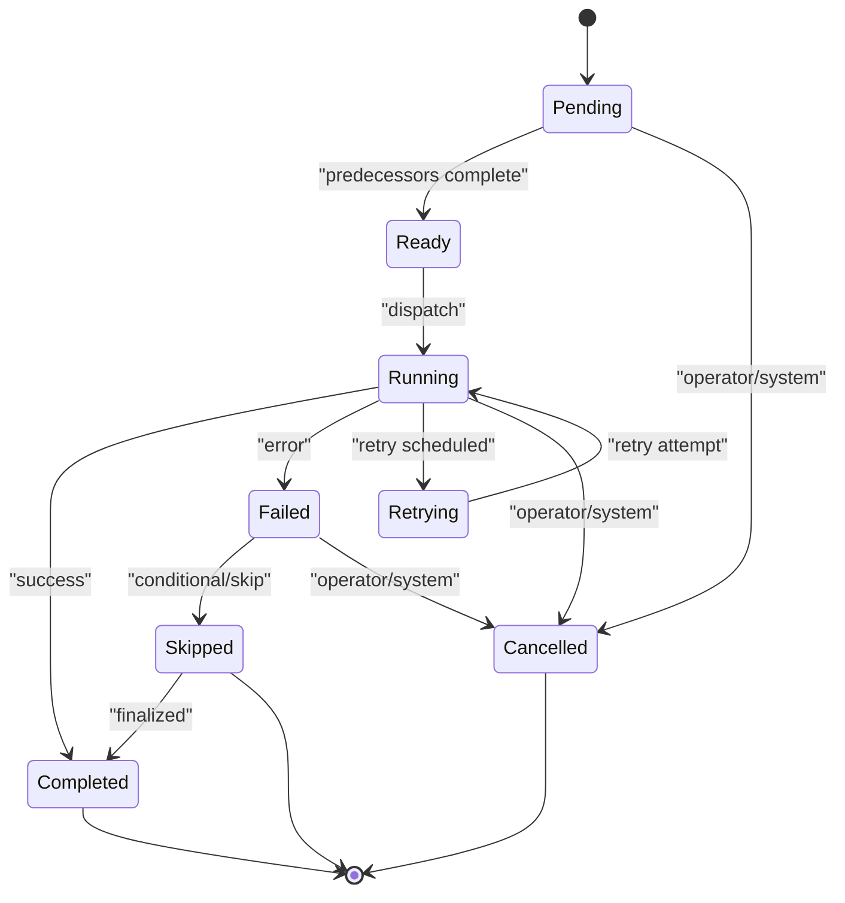
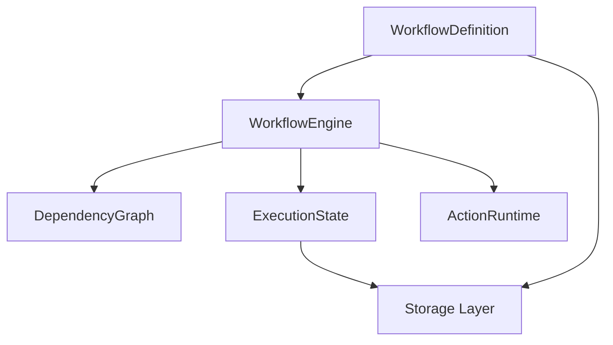
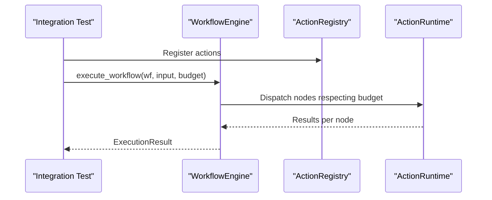
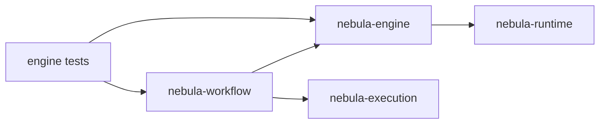

# Workflow Fundamentals

<cite>
**Referenced Files in This Document**
- [lib.rs](file://crates/workflow/src/lib.rs)
- [graph.rs](file://crates/workflow/src/graph.rs)
- [definition.rs](file://crates/workflow/src/definition.rs)
- [builder.rs](file://crates/workflow/src/builder.rs)
- [connection.rs](file://crates/workflow/src/connection.rs)
- [node.rs](file://crates/workflow/src/node.rs)
- [state.rs](file://crates/workflow/src/state.rs)
- [validate.rs](file://crates/workflow/src/validate.rs)
- [engine.rs](file://crates/engine/src/engine.rs)
- [state.rs](file://crates/execution/src/state.rs)
- [integration.rs](file://crates/engine/tests/integration.rs)
- [hello.yaml](file://apps/cli/examples/hello.yaml)
- [pipeline.yaml](file://apps/cli/examples/pipeline.yaml)
- [Architecture.md](file://crates/workflow/docs/Architecture.md)
</cite>

## Table of Contents
1. [Introduction](#introduction)
2. [Project Structure](#project-structure)
3. [Core Components](#core-components)
4. [Architecture Overview](#architecture-overview)
5. [Detailed Component Analysis](#detailed-component-analysis)
6. [Dependency Analysis](#dependency-analysis)
7. [Performance Considerations](#performance-considerations)
8. [Troubleshooting Guide](#troubleshooting-guide)
9. [Conclusion](#conclusion)
10. [Appendices](#appendices)

## Introduction
This document explains Nebula’s DAG-based workflow execution model: how workflows are defined as directed acyclic graphs, how dependencies are enforced, and how execution proceeds. It covers the core types, validation, versioning, lifecycle, and relationships with the execution engine and storage layer. Practical examples show how to construct workflows, how execution flows through nodes, and how state transitions occur.

## Project Structure
Nebula organizes workflow fundamentals across several crates:
- Workflow definition and DAG utilities live in the workflow crate.
- The engine orchestrates execution, integrates with runtime/action systems, and coordinates with storage.
- Execution state and lifecycle management reside in the execution crate.
- Examples demonstrate YAML-based workflow definitions and integration tests illustrate end-to-end execution.

**Diagram sources**
- [lib.rs:15-54](file://crates/workflow/src/lib.rs#L15-L54)
- [engine.rs:121-202](file://crates/engine/src/engine.rs#L121-L202)
- [state.rs:120-171](file://crates/execution/src/state.rs#L120-L171)

**Section sources**
- [lib.rs:15-54](file://crates/workflow/src/lib.rs#L15-L54)
- [Architecture.md:28-75](file://crates/workflow/docs/Architecture.md#L28-L75)

## Core Components
- WorkflowDefinition: Top-level container holding nodes, connections, configuration, and metadata.
- NodeDefinition: Individual action steps with parameters, timeouts, retry policies, and rate limits.
- Connection: Directed edges with optional conditions and port mapping.
- DependencyGraph: Wrapper around petgraph enabling topological sorting and level computation.
- NodeState: Enumerated state machine for per-node execution tracking.
- Validation: Comprehensive validator that collects multiple errors at once.

Key responsibilities:
- Define the graph shape and control flow.
- Enforce DAG structure and detect cycles.
- Provide topological levels for parallel execution.
- Track node and workflow execution state.
- Validate schemas, triggers, and references.

**Section sources**
- [definition.rs:14-66](file://crates/workflow/src/definition.rs#L14-L66)
- [node.rs:11-47](file://crates/workflow/src/node.rs#L11-L47)
- [connection.rs:6-25](file://crates/workflow/src/connection.rs#L6-L25)
- [graph.rs:13-224](file://crates/workflow/src/graph.rs#L13-L224)
- [state.rs:6-55](file://crates/workflow/src/state.rs#L6-L55)
- [validate.rs:12-123](file://crates/workflow/src/validate.rs#L12-L123)

## Architecture Overview
Nebula’s workflow execution model centers on a DAG:
- Nodes represent actions.
- Edges define precedence and conditional routing.
- The engine builds a dependency graph and executes nodes according to readiness and concurrency budgets.
- Execution state is tracked per node and persisted as needed.

**Diagram sources**
- [builder.rs:170-222](file://crates/workflow/src/builder.rs#L170-L222)
- [validate.rs:12-123](file://crates/workflow/src/validate.rs#L12-L123)
- [engine.rs:571-761](file://crates/engine/src/engine.rs#L571-L761)
- [state.rs:120-171](file://crates/execution/src/state.rs#L120-L171)

## Detailed Component Analysis

### Directed Acyclic Graph (DAG) Construction and Validation
- DependencyGraph builds a petgraph from WorkflowDefinition, detecting unknown nodes, self-loops, and cycles.
- Provides topological_sort and compute_levels for parallel execution planning.
- Validates DAG structure and entry nodes.

**Diagram sources**
- [graph.rs:24-54](file://crates/workflow/src/graph.rs#L24-L54)
- [graph.rs:56-120](file://crates/workflow/src/graph.rs#L56-L120)

**Section sources**
- [graph.rs:24-120](file://crates/workflow/src/graph.rs#L24-L120)
- [validate.rs:109-123](file://crates/workflow/src/validate.rs#L109-L123)

### Workflow Definition Patterns and Node Types
- WorkflowDefinition includes nodes, connections, variables, config, and optional trigger.
- NodeDefinition supports parameters, timeouts, retry policies, and rate limiting.
- ParamValue supports literals, expressions, templates, and references to other nodes’ outputs.

Common patterns:
- Linear pipelines: A → B → C.
- Fan-out/fan-in: A → B, A → C, B → D, C → D.
- Conditional edges via EdgeCondition (expression, result match, error match).
- Disabled nodes for safe debugging.

**Section sources**
- [definition.rs:14-66](file://crates/workflow/src/definition.rs#L14-L66)
- [node.rs:11-47](file://crates/workflow/src/node.rs#L11-L47)
- [connection.rs:84-147](file://crates/workflow/src/connection.rs#L84-L147)
- [builder.rs:73-118](file://crates/workflow/src/builder.rs#L73-L118)

### Execution Semantics and Topological Ordering
- The engine computes a dependency graph and executes nodes level-by-level.
- Each level contains nodes whose predecessors have all completed; these can run in parallel.
- Edges may be conditional; only activated edges propagate outputs to successors.

**Diagram sources**
- [graph.rs:75-120](file://crates/workflow/src/graph.rs#L75-L120)
- [engine.rs:571-761](file://crates/engine/src/engine.rs#L571-L761)

**Section sources**
- [graph.rs:75-120](file://crates/workflow/src/graph.rs#L75-L120)
- [engine.rs:571-761](file://crates/engine/src/engine.rs#L571-L761)

### State Machine and Lifecycle Management
- NodeState enumerates Pending, Ready, Running, Completed, Failed, Skipped, Retrying, Cancelled.
- ExecutionState tracks per-node states, timestamps, attempts, and workflow-level variables.
- Transitions are validated; version increments ensure optimistic concurrency safety.

**Diagram sources**
- [state.rs:6-55](file://crates/workflow/src/state.rs#L6-L55)
- [state.rs:120-171](file://crates/execution/src/state.rs#L120-L171)

**Section sources**
- [state.rs:6-55](file://crates/workflow/src/state.rs#L6-L55)
- [state.rs:120-171](file://crates/execution/src/state.rs#L120-L171)

### Validation, Versioning, and Configuration
- validate_workflow collects multiple errors: empty name, no nodes, duplicates, unknown nodes, self-loops, duplicate connections, invalid parameter references, unsupported schema, invalid triggers, cycles, and missing entry nodes.
- WorkflowDefinition includes semantic versioning and schema_version for compatibility.
- WorkflowConfig controls timeout, max_parallel_nodes, checkpointing, default retry policy, and error strategy.

**Section sources**
- [validate.rs:12-123](file://crates/workflow/src/validate.rs#L12-L123)
- [definition.rs:11-66](file://crates/workflow/src/definition.rs#L11-L66)
- [definition.rs:109-143](file://crates/workflow/src/definition.rs#L109-L143)

### Relationships with Engine and Storage
- WorkflowEngine orchestrates execution: builds DependencyGraph, runs frontier loop, evaluates edge conditions, resolves inputs, delegates to ActionRuntime, and tracks ExecutionState.
- ExecutionState persists execution progress and outcomes; engine can checkpoint and resume.
- Storage layer persists workflow definitions and execution snapshots.

**Diagram sources**
- [engine.rs:121-202](file://crates/engine/src/engine.rs#L121-L202)
- [state.rs:120-171](file://crates/execution/src/state.rs#L120-L171)

**Section sources**
- [engine.rs:121-202](file://crates/engine/src/engine.rs#L121-L202)
- [state.rs:120-171](file://crates/execution/src/state.rs#L120-L171)

### Concrete Examples from the Codebase
- YAML examples show minimal and pipeline workflows with nodes and connections.
- Integration tests demonstrate linear pipelines, fan-out, diamond merge, error propagation, cancellation, concurrency limits, and disabled nodes.

**Diagram sources**
- [integration.rs:286-318](file://crates/engine/tests/integration.rs#L286-L318)
- [integration.rs:320-361](file://crates/engine/tests/integration.rs#L320-L361)
- [integration.rs:363-417](file://crates/engine/tests/integration.rs#L363-L417)

**Section sources**
- [hello.yaml:1-20](file://apps/cli/examples/hello.yaml#L1-L20)
- [pipeline.yaml:1-37](file://apps/cli/examples/pipeline.yaml#L1-L37)
- [integration.rs:286-318](file://crates/engine/tests/integration.rs#L286-L318)
- [integration.rs:320-361](file://crates/engine/tests/integration.rs#L320-L361)
- [integration.rs:363-417](file://crates/engine/tests/integration.rs#L363-L417)

## Dependency Analysis
- Workflow crate exports core types and validation.
- Engine crate depends on workflow types for graph building and state updates.
- Execution crate defines ExecutionState used by engine for persistence and recovery.
- Tests integrate engine, runtime, and workflow to validate end-to-end behavior.

**Diagram sources**
- [lib.rs:40-54](file://crates/workflow/src/lib.rs#L40-L54)
- [engine.rs:43-46](file://crates/engine/src/engine.rs#L43-L46)
- [state.rs:120-171](file://crates/execution/src/state.rs#L120-L171)

**Section sources**
- [lib.rs:40-54](file://crates/workflow/src/lib.rs#L40-L54)
- [engine.rs:43-46](file://crates/engine/src/engine.rs#L43-L46)

## Performance Considerations
- Parallel execution within levels reduces total runtime for independent nodes.
- Concurrency budgets prevent resource saturation; bounded channels avoid memory pressure.
- Checkpointing balances durability and overhead; intervals can be tuned.
- Topological level computation ensures efficient scheduling and minimizes idle time.

## Troubleshooting Guide
Common issues and resolutions:
- CycleDetected: Remove circular dependencies in connections.
- NoEntryNodes: Ensure at least one node with no incoming edges.
- UnknownNode: Fix node IDs in connections to match declared nodes.
- SelfLoop: Remove edges from a node to itself.
- DuplicateNodeKey/DuplicateConnection: Ensure unique IDs and distinct connections.
- UnsupportedSchema: Upgrade schema_version or adjust definition format.
- InvalidTrigger: Correct cron expressions and webhook paths.
- ZeroConcurrencyBudget: Increase max_concurrent_nodes to avoid deadlocks.

Operational tips:
- Use validate_workflow to collect all validation errors at once.
- Inspect ExecutionState for node-level timestamps and error messages.
- Enable checkpointing for long-running workflows to support recovery.

**Section sources**
- [validate.rs:12-123](file://crates/workflow/src/validate.rs#L12-L123)
- [integration.rs:603-630](file://crates/engine/tests/integration.rs#L603-L630)
- [state.rs:120-171](file://crates/execution/src/state.rs#L120-L171)

## Conclusion
Nebula’s DAG-based workflow model provides a robust, validated, and observable framework for orchestrating complex action graphs. By combining strong typing, topological execution, conditional edges, and comprehensive state tracking, it supports both simple pipelines and advanced control flows. The engine’s integration with runtime and storage enables scalable, resilient execution suitable for production workloads.

## Appendices

### API and Configuration Reference
- WorkflowDefinition: id, name, version, nodes, connections, variables, config, trigger, tags, timestamps, owner_id, ui_metadata, schema_version.
- NodeDefinition: id, name, action_key, interface_version, parameters, retry_policy, timeout, description, enabled, rate_limit.
- Connection: from_node, to_node, condition, branch_key, from_port, to_port.
- WorkflowConfig: timeout, max_parallel_nodes, checkpointing, retry_policy, error_strategy.
- NodeState: Pending, Ready, Running, Completed, Failed, Skipped, Retrying, Cancelled.

**Section sources**
- [definition.rs:14-66](file://crates/workflow/src/definition.rs#L14-L66)
- [node.rs:11-47](file://crates/workflow/src/node.rs#L11-L47)
- [connection.rs:6-25](file://crates/workflow/src/connection.rs#L6-L25)
- [definition.rs:109-143](file://crates/workflow/src/definition.rs#L109-L143)
- [state.rs:6-55](file://crates/workflow/src/state.rs#L6-L55)