# Core Crates

<cite>
**Referenced Files in This Document**
- [lib.rs](file://crates/core/src/lib.rs)
- [Cargo.toml](file://crates/core/Cargo.toml)
- [id/mod.rs](file://crates/core/src/id/mod.rs)
- [id/types.rs](file://crates/core/src/id/types.rs)
- [keys.rs](file://crates/core/src/keys.rs)
- [scope.rs](file://crates/core/src/scope.rs)
- [context/mod.rs](file://crates/core/src/context/mod.rs)
- [context/capability.rs](file://crates/core/src/context/capability.rs)
- [accessor.rs](file://crates/core/src/accessor.rs)
- [lifecycle.rs](file://crates/core/src/lifecycle.rs)
- [error.rs](file://crates/core/src/error.rs)
- [guard.rs](file://crates/core/src/guard.rs)
- [obs.rs](file://crates/core/src/obs.rs)
- [dependencies.rs](file://crates/core/src/dependencies.rs)
</cite>

## Table of Contents
1. [Introduction](#introduction)
2. [Project Structure](#project-structure)
3. [Core Components](#core-components)
4. [Architecture Overview](#architecture-overview)
5. [Detailed Component Analysis](#detailed-component-analysis)
6. [Dependency Analysis](#dependency-analysis)
7. [Performance Considerations](#performance-considerations)
8. [Troubleshooting Guide](#troubleshooting-guide)
9. [Conclusion](#conclusion)

## Introduction
Nebula’s core crate establishes the foundational infrastructure for the entire system. It defines:
- Typed identifiers (prefixed ULIDs) for all major domain entities
- Normalized domain keys for plugins, actions, credentials, parameters, and nodes
- A hierarchical scope model for resource lifecycles and access control
- A capability-based context system enabling dependency injection
- Lifecycle primitives for coordinated shutdown
- Error handling patterns grounded in typed, stable error categories
- Accessor traits for decoupled observability and resource access
- Guard traits for RAII-style protection of sensitive resources

These primitives provide a stable, type-safe foundation that every other crate can rely on without duplicating vocabulary or diverging in semantics.

## Project Structure
The core crate is organized into focused modules that expose a cohesive public API surface. The module layout mirrors the functional areas of the infrastructure layer.

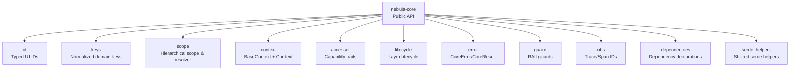

**Diagram sources**
- [lib.rs:38-77](file://crates/core/src/lib.rs#L38-L77)
- [Cargo.toml:14-22](file://crates/core/Cargo.toml#L14-L22)

**Section sources**
- [lib.rs:1-111](file://crates/core/src/lib.rs#L1-L111)
- [Cargo.toml:1-36](file://crates/core/Cargo.toml#L1-L36)

## Core Components
This section documents the primary building blocks of the core crate and how they work together to provide type safety and operational guarantees across the system.

- Typed identifiers (prefixed ULIDs)
  - Purpose: Opaque, globally unique, sortable identifiers for entities such as executions, workflows, users, resources, sessions, and triggers.
  - Implementation: A macro-driven generation of strongly-typed newtypes backed by ULIDs with explicit prefixes per entity type.
  - Benefits: Compile-time prevention of accidental misuse; deterministic ordering; robust serialization/deserialization; consistent display and parsing.

- Normalized domain keys
  - Purpose: Author-defined identifiers for plugins, actions, credentials, parameters, and nodes, enforced to a strict lowercase, underscore, and dot-safe format.
  - Implementation: Domain-key definitions with compile-time validation macros for safe construction from string literals.
  - Benefits: Consistent normalization; early failure on invalid inputs; stable public API error types for parsing/validation.

- Hierarchical scope system
  - Purpose: Define resource lifecycles and enforce access control via containment relationships.
  - Implementation: Enumerated scope levels with strict containment checks and a resolver trait for ID ownership verification.
  - Benefits: Clear lifecycle boundaries; deterministic scope resolution; support for both shallow containment and strict ownership checks.

- Context system with capability injection
  - Purpose: Provide a shared identity and lifecycle surface for all operations, composed via capability traits.
  - Implementation: BaseContext and Context trait with capability traits for resources, credentials, logging, metrics, and event bus.
  - Benefits: Decoupled composition; consistent access patterns; testable abstractions; optional tracing identity.

- Accessor traits for dependency injection
  - Purpose: Abstract over resource and credential access, metrics emission, logging, event publishing, and time.
  - Implementation: Traits with dynamic dispatch-friendly signatures and a real-time clock implementation.
  - Benefits: Backends remain pluggable; library crates remain backend-agnostic; consistent ergonomics across crates.

- Lifecycle management for shutdown coordination
  - Purpose: Provide a hierarchical cancellation mechanism with graceful shutdown signaling and task tracking.
  - Implementation: LayerLifecycle with child tokens inheriting cancellation; two-phase shutdown with grace period.
  - Benefits: Controlled shutdown across layers; predictable cleanup; observable outcomes.

- Error handling patterns
  - Purpose: Provide a small, stable set of typed errors for core operations with consistent categorization and codes.
  - Implementation: CoreError variants for invalid IDs/keys, scope violations, and dependency issues; conversion to classification traits.
  - Benefits: Predictable error semantics; non-retryable by default for validation-type errors; stable codes for observability.

- Guards for RAII protection
  - Purpose: Encapsulate acquisition and release semantics for sensitive resources and credentials.
  - Implementation: Guard and TypedGuard traits with metadata such as acquisition time and kind.
  - Benefits: Safer resource handling; clearer ownership semantics; easier testing and inspection.

- Observability identity types
  - Purpose: Provide standardized trace/span identifiers aligned with W3C standards.
  - Implementation: Strongly-typed wrappers around numeric identifiers.
  - Benefits: Interoperability with standard observability tooling; explicit typing for distributed tracing.

- Dependency declarations
  - Purpose: Capture and validate required/optional dependencies for components at registration time.
  - Implementation: Declarations of credential and resource requirements with type IDs and diagnostic metadata.
  - Benefits: Early detection of missing or cyclic dependencies; consistent diagnostics; separation of concerns between declaration and enforcement.

**Section sources**
- [id/mod.rs:1-11](file://crates/core/src/id/mod.rs#L1-L11)
- [id/types.rs:1-131](file://crates/core/src/id/types.rs#L1-L131)
- [keys.rs:1-165](file://crates/core/src/keys.rs#L1-L165)
- [scope.rs:1-392](file://crates/core/src/scope.rs#L1-L392)
- [context/mod.rs:14-118](file://crates/core/src/context/mod.rs#L14-L118)
- [context/capability.rs:1-39](file://crates/core/src/context/capability.rs#L1-L39)
- [accessor.rs:1-110](file://crates/core/src/accessor.rs#L1-L110)
- [lifecycle.rs:1-51](file://crates/core/src/lifecycle.rs#L1-L51)
- [error.rs:1-165](file://crates/core/src/error.rs#L1-L165)
- [guard.rs:1-24](file://crates/core/src/guard.rs#L1-L24)
- [obs.rs:1-12](file://crates/core/src/obs.rs#L1-L12)
- [dependencies.rs:1-127](file://crates/core/src/dependencies.rs#L1-L127)

## Architecture Overview
The core crate acts as the central vocabulary and contracts provider for the system. It exposes a curated public API that other crates consume, ensuring consistent semantics across the ecosystem.

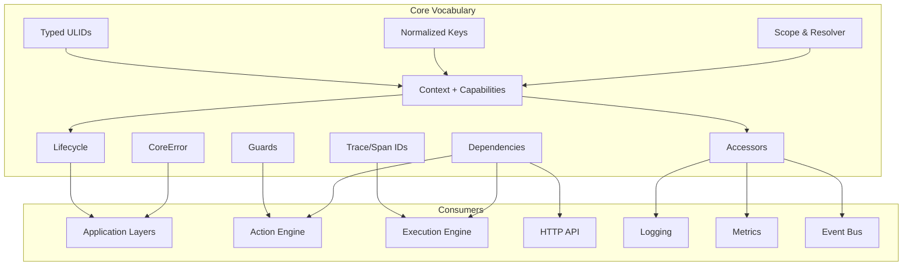

**Diagram sources**
- [lib.rs:64-110](file://crates/core/src/lib.rs#L64-L110)
- [Cargo.toml:14-22](file://crates/core/Cargo.toml#L14-L22)

## Detailed Component Analysis

### Typed Identifier System (ExecutionId, WorkflowId, UserId, etc.)
- Design
  - Each identifier is a strongly-typed newtype wrapping a ULID with a fixed, domain-specific prefix.
  - Construction is explicit (new or parse), ensuring correctness and preventing accidental misuse.
  - Serialization/deserialization and equality/ordering/hash are provided by the underlying ULID generator.
- Public API highlights
  - Newtypes include ExecutionId, WorkflowId, WorkflowVersionId, AttemptId, InstanceId, TriggerId, TriggerEventId, UserId, ServiceAccountId, ResourceId, SessionId, and OrgId (with OrganizationId deprecated in favor of OrgId).
  - Re-exports in the public API surface and a prelude for convenient imports.
- Usage patterns
  - Pass identifiers as function arguments to enforce type safety.
  - Use display/parsing for persistence and transport.
  - Leverage ordering for deterministic iteration and indexing.

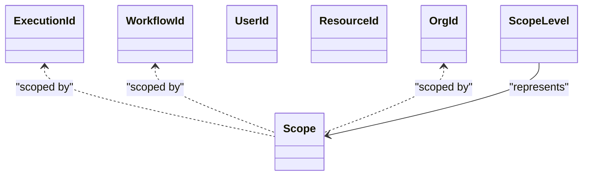

**Diagram sources**
- [id/types.rs:8-24](file://crates/core/src/id/types.rs#L8-L24)
- [scope.rs:22-40](file://crates/core/src/scope.rs#L22-L40)
- [scope.rs:189-211](file://crates/core/src/scope.rs#L189-L211)

**Section sources**
- [id/mod.rs:1-11](file://crates/core/src/id/mod.rs#L1-L11)
- [id/types.rs:1-131](file://crates/core/src/id/types.rs#L1-L131)
- [lib.rs:64-110](file://crates/core/src/lib.rs#L64-L110)

### Normalized Domain Keys (PluginKey, ActionKey, CredentialKey, ParameterKey, ResourceKey, NodeKey)
- Design
  - Keys are validated to a strict normalized form at construction time.
  - Compile-time validation macros ensure invalid literals are rejected by the compiler.
- Public API highlights
  - Key types are defined per domain with dedicated constructors and parsing.
  - Macros for compile-time validation: action_key!, credential_key!, parameter_key!, plugin_key!, resource_key!, node_key!.

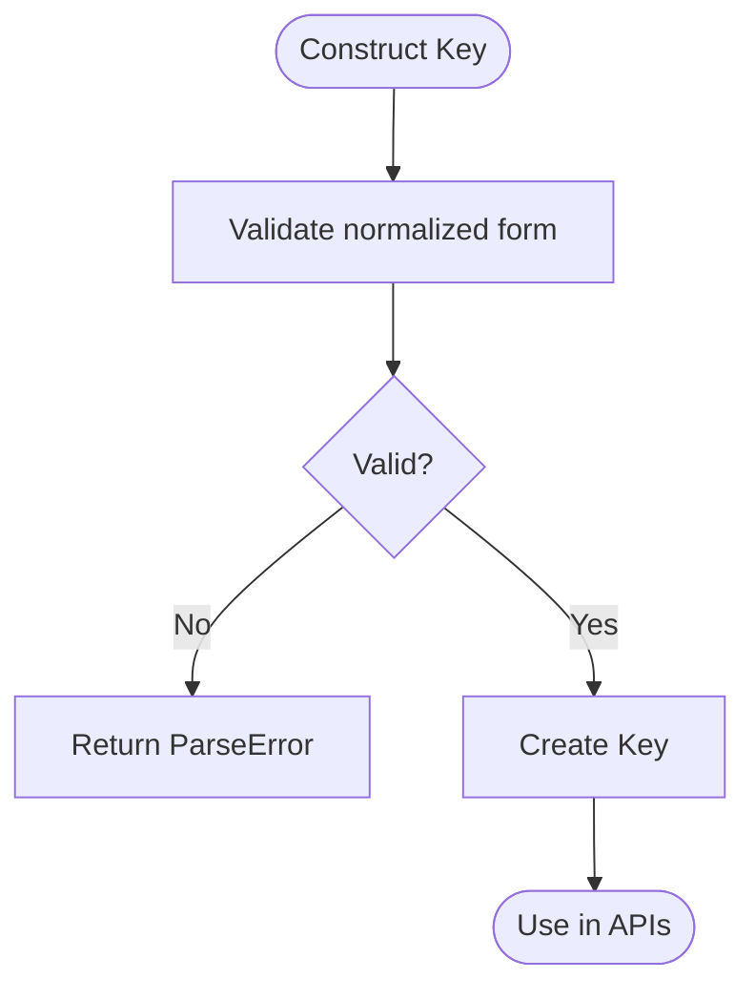

**Diagram sources**
- [keys.rs:26-44](file://crates/core/src/keys.rs#L26-L44)
- [keys.rs:56-124](file://crates/core/src/keys.rs#L56-L124)

**Section sources**
- [keys.rs:1-165](file://crates/core/src/keys.rs#L1-L165)

### Hierarchical Scope Resolution and Containment
- Design
  - Scope levels define a strict hierarchy: Global → Organization → Workspace → Workflow → Execution.
  - Containment checks are available both as shallow membership and strict ownership checks via a resolver.
  - Scope aggregates optional IDs across the hierarchy for contextual completeness.
- Public API highlights
  - ScopeLevel with helpers to detect scope kinds and extract IDs.
  - ScopeResolver trait for enforcing ownership relationships.
  - Scope container for carrying optional IDs.

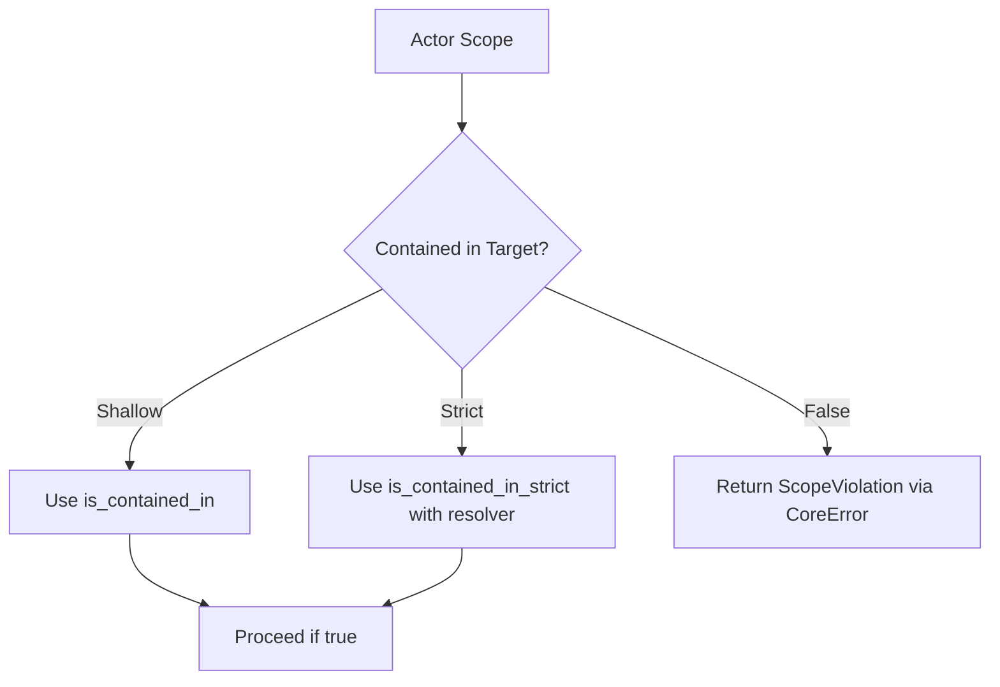

**Diagram sources**
- [scope.rs:102-162](file://crates/core/src/scope.rs#L102-L162)
- [scope.rs:165-175](file://crates/core/src/scope.rs#L165-L175)
- [scope.rs:189-211](file://crates/core/src/scope.rs#L189-L211)
- [error.rs:26-33](file://crates/core/src/error.rs#L26-L33)

**Section sources**
- [scope.rs:1-392](file://crates/core/src/scope.rs#L1-L392)
- [error.rs:1-165](file://crates/core/src/error.rs#L1-L165)

### Context System with Capability Injection
- Design
  - Context trait encapsulates scope, principal, cancellation token, clock, and optional trace ID.
  - BaseContext provides a builder for assembling contexts with defaults and sensible defaults for clock and trace ID.
  - Capability traits compose context with access to resources, credentials, logging, metrics, and event bus.
- Public API highlights
  - Context, BaseContext, BaseContextBuilder
  - Capability traits: HasResources, HasCredentials, HasLogger, HasMetrics, HasEventBus
  - Optional trace ID support for observability.

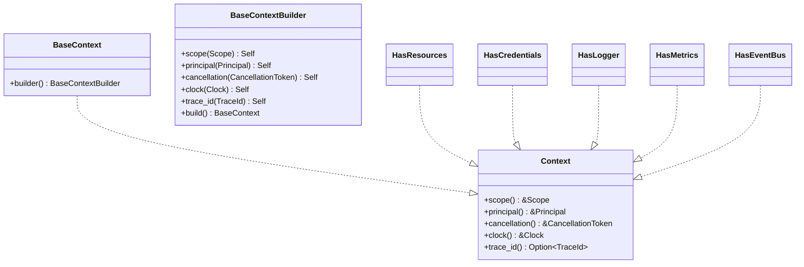

**Diagram sources**
- [context/mod.rs:14-118](file://crates/core/src/context/mod.rs#L14-L118)
- [context/capability.rs:1-39](file://crates/core/src/context/capability.rs#L1-L39)

**Section sources**
- [context/mod.rs:14-118](file://crates/core/src/context/mod.rs#L14-L118)
- [context/capability.rs:1-39](file://crates/core/src/context/capability.rs#L1-L39)

### Accessor Traits for Dependency Injection
- Design
  - Traits abstract over resource and credential access, logging, metrics emission, event publishing, and time.
  - Clock abstraction supports deterministic testing via injectable implementations.
  - Accessors return boxed futures for dynamic dispatch while remaining Send + Sync.
- Public API highlights
  - ResourceAccessor, CredentialAccessor, Logger, MetricsEmitter, EventEmitter, Clock
  - SystemClock implementation for real-time usage.

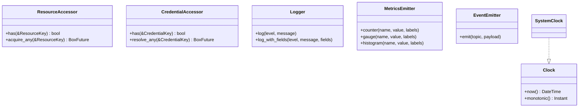

**Diagram sources**
- [accessor.rs:12-110](file://crates/core/src/accessor.rs#L12-L110)

**Section sources**
- [accessor.rs:1-110](file://crates/core/src/accessor.rs#L1-L110)

### Lifecycle Management for Shutdown Coordination
- Design
  - LayerLifecycle provides a hierarchical cancellation token and a task tracker for graceful shutdown.
  - Two-phase shutdown cancels upstream, closes the task tracker, and waits up to a grace period.
- Public API highlights
  - LayerLifecycle::root and LayerLifecycle::child for hierarchy creation
  - LayerLifecycle::shutdown with grace period returning ShutdownOutcome

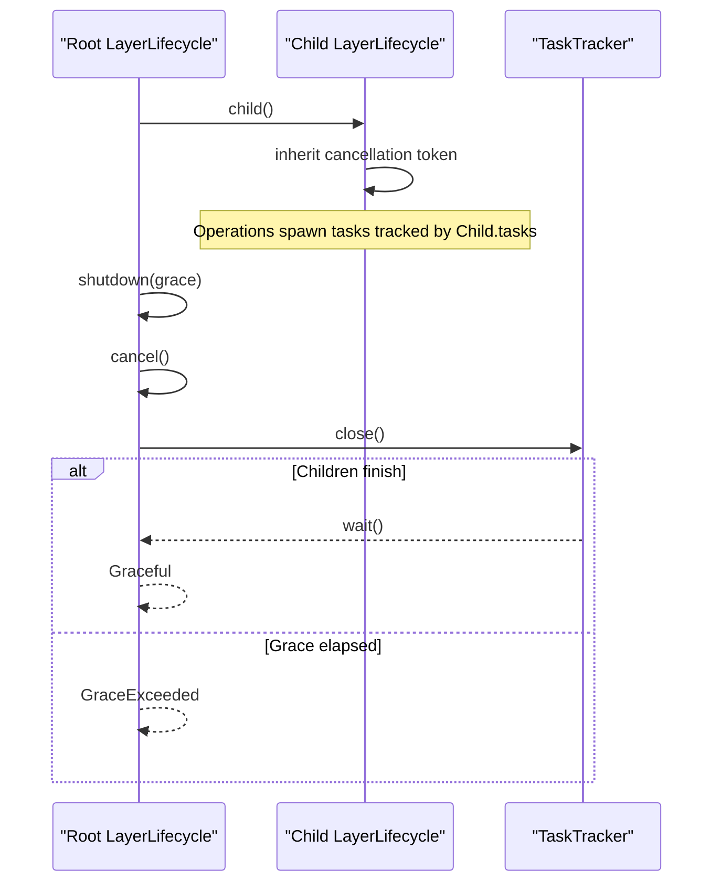

**Diagram sources**
- [lifecycle.rs:7-51](file://crates/core/src/lifecycle.rs#L7-L51)

**Section sources**
- [lifecycle.rs:1-51](file://crates/core/src/lifecycle.rs#L1-L51)

### Error Handling Patterns
- Design
  - CoreError enumerates core-level failures: invalid IDs/keys, scope violations, dependency cycles, and missing dependencies.
  - Classification traits map errors to categories and stable codes for observability.
- Public API highlights
  - Helper constructors for each variant
  - CoreResult alias for consistent result typing

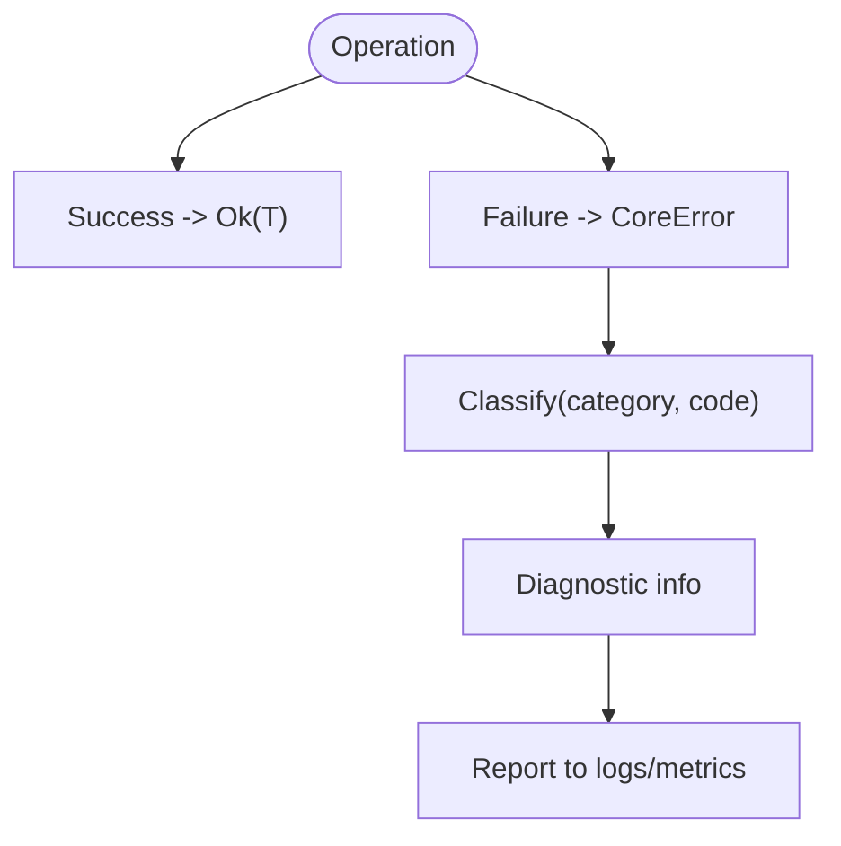

**Diagram sources**
- [error.rs:57-122](file://crates/core/src/error.rs#L57-L122)

**Section sources**
- [error.rs:1-165](file://crates/core/src/error.rs#L1-L165)

### Guards for RAII Protection
- Design
  - Guard captures acquisition metadata (kind, acquisition time).
  - TypedGuard extends Guard to expose inner values safely.
- Public API highlights
  - Guard and TypedGuard traits
  - Age calculation helper

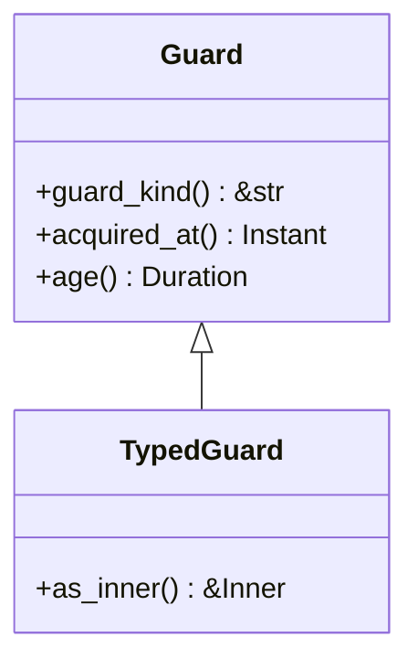

**Diagram sources**
- [guard.rs:5-24](file://crates/core/src/guard.rs#L5-L24)

**Section sources**
- [guard.rs:1-24](file://crates/core/src/guard.rs#L1-L24)

### Observability Identity Types
- Design
  - Strongly-typed TraceId and SpanId aligned with W3C Trace Context.
- Public API highlights
  - TraceId(u128), SpanId(u64)

**Section sources**
- [obs.rs:1-12](file://crates/core/src/obs.rs#L1-L12)

### Dependency Declarations
- Design
  - Dependencies capture required/optional credential and resource requirements with type IDs and diagnostic metadata.
  - DeclaresDependencies trait enables static declaration of dependencies.
  - Internal DependencyError is mapped to CoreError at the API boundary.
- Public API highlights
  - Dependencies builder pattern
  - CredentialRequirement and ResourceRequirement structs
  - DeclaresDependencies trait

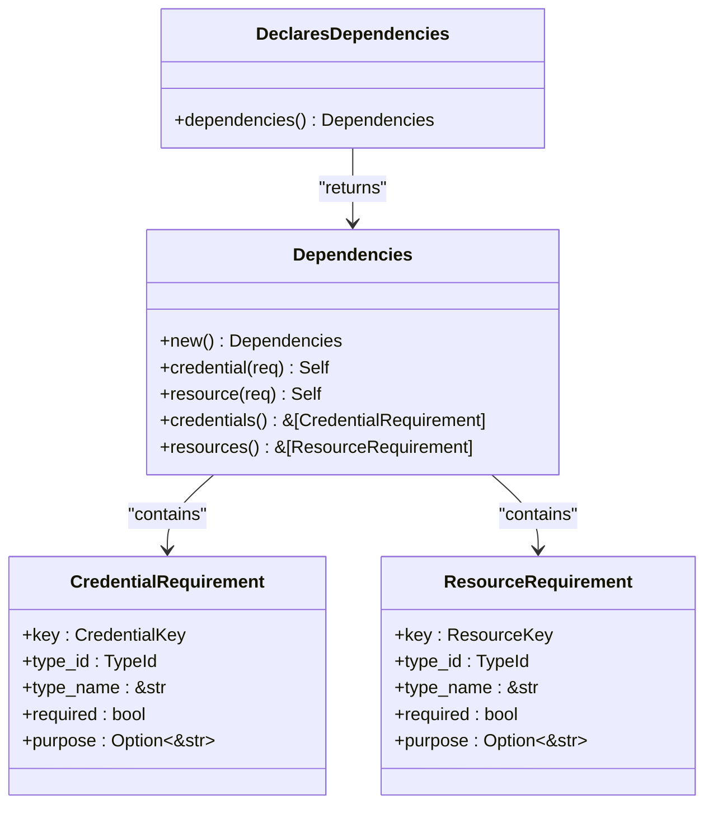

**Diagram sources**
- [dependencies.rs:7-82](file://crates/core/src/dependencies.rs#L7-L82)
- [dependencies.rs:43-52](file://crates/core/src/dependencies.rs#L43-L52)

**Section sources**
- [dependencies.rs:1-127](file://crates/core/src/dependencies.rs#L1-L127)

## Dependency Analysis
The core crate depends on external libraries for time, serialization, error handling, and ULID generation. These dependencies are minimal and purposeful, keeping the core lean while enabling rich functionality.

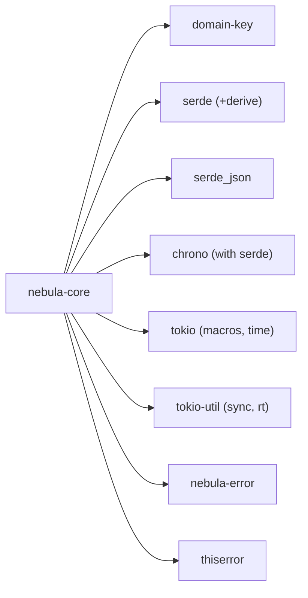

**Diagram sources**
- [Cargo.toml:14-22](file://crates/core/Cargo.toml#L14-L22)

**Section sources**
- [Cargo.toml:1-36](file://crates/core/Cargo.toml#L1-L36)

## Performance Considerations
- ULID-based identifiers are compact, sortable, and efficient for hashing and ordering, minimizing overhead in maps and sets.
- Normalized keys avoid repeated validation costs at runtime; compile-time validation macros eliminate runtime checks for invalid literals.
- Context and accessor traits use dynamic dispatch via trait objects; keep hot paths minimal and reuse contexts where possible.
- Lifecycle tokens and task trackers provide efficient cancellation and graceful shutdown signaling without heavy synchronization.
- Serialization helpers and serde features are included to reduce duplication across crates.

## Troubleshooting Guide
Common issues and resolutions when working with core primitives:

- Invalid ID parsing
  - Symptom: Parsing a string fails with an invalid ID error.
  - Cause: Wrong prefix or malformed ULID string.
  - Resolution: Ensure the string matches the expected prefix and format; use the provided helper constructors for safer creation.

- Invalid key validation
  - Symptom: Creating a key from a string literal fails.
  - Cause: Key does not meet normalized form requirements.
  - Resolution: Use the compile-time validation macros to catch issues at build time; ensure lowercase, underscore, and dot-safe forms.

- Scope containment violation
  - Symptom: An operation reports a scope violation.
  - Cause: Attempting to access a resource outside the actor’s scope or without proper ownership.
  - Resolution: Verify scope containment via is_contained_in or is_contained_in_strict with a resolver; adjust scope or permissions accordingly.

- Dependency issues
  - Symptom: Dependency cycle or missing dependency errors during registration.
  - Cause: Circular requirements or unregistered dependencies.
  - Resolution: Review dependency declarations and ensure acyclic graphs; register all required dependencies.

- Shutdown not completing
  - Symptom: Graceful shutdown exceeds grace period.
  - Cause: Long-running tasks not respecting cancellation or not closing the task tracker.
  - Resolution: Ensure all tasks observe the cancellation token and close the task tracker promptly.

**Section sources**
- [error.rs:8-91](file://crates/core/src/error.rs#L8-L91)
- [scope.rs:102-162](file://crates/core/src/scope.rs#L102-L162)
- [dependencies.rs:84-127](file://crates/core/src/dependencies.rs#L84-L127)
- [lifecycle.rs:32-41](file://crates/core/src/lifecycle.rs#L32-L41)

## Conclusion
The core crate delivers a robust, type-safe foundation for Nebula by standardizing identifiers, keys, scope, context, lifecycle, and error handling. Its capability-based design and accessor traits enable clean dependency injection and decoupling across crates. By adhering to the contracts and patterns documented here, developers can build reliable extensions and integrations that remain consistent with the broader system architecture.