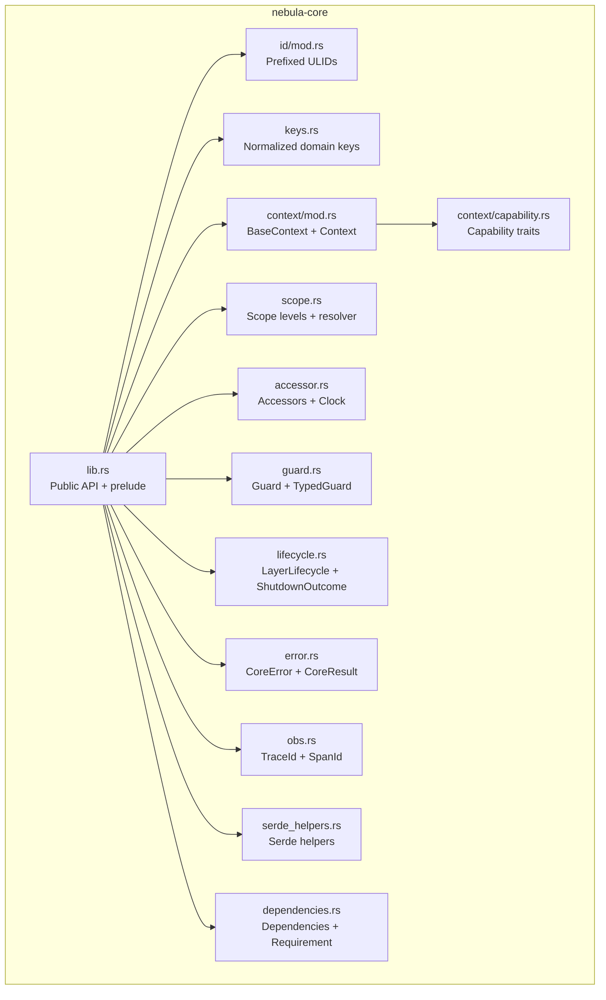
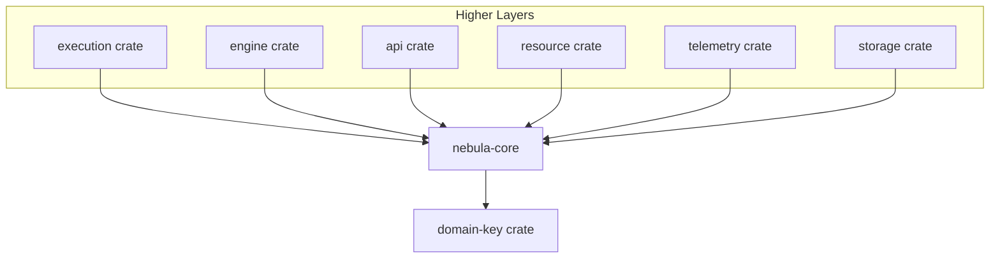
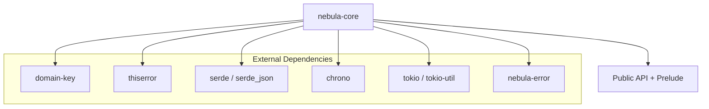
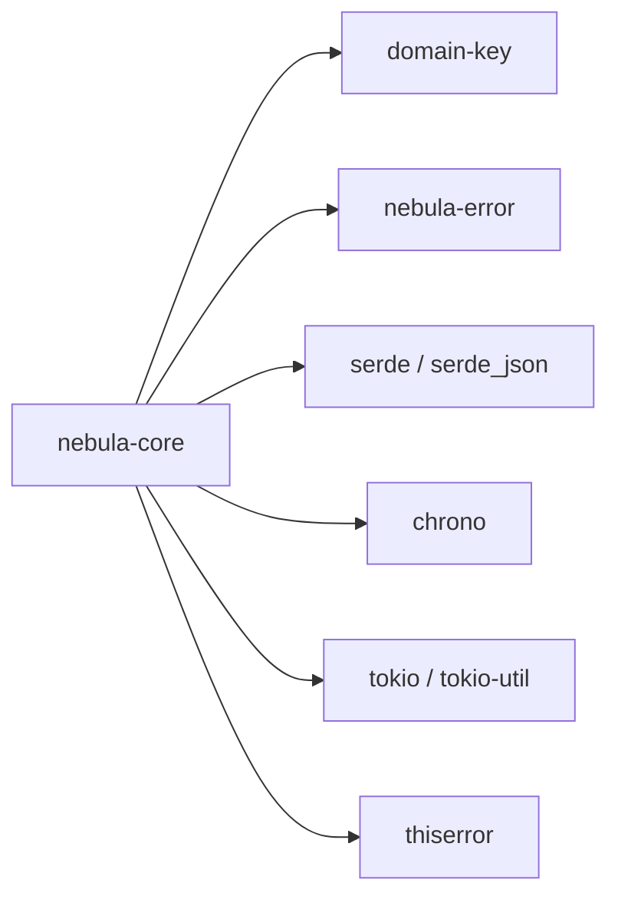

# Core Layer Documentation

<cite>
**Referenced Files in This Document**
- [crates/core/src/lib.rs](file://crates/core/src/lib.rs)
- [crates/core/Cargo.toml](file://crates/core/Cargo.toml)
- [crates/core/src/id/mod.rs](file://crates/core/src/id/mod.rs)
- [crates/core/src/id/types.rs](file://crates/core/src/id/types.rs)
- [crates/core/src/keys.rs](file://crates/core/src/keys.rs)
- [crates/core/src/accessor.rs](file://crates/core/src/accessor.rs)
- [crates/core/src/context/mod.rs](file://crates/core/src/context/mod.rs)
- [crates/core/src/context/capability.rs](file://crates/core/src/context/capability.rs)
- [crates/core/src/scope.rs](file://crates/core/src/scope.rs)
- [crates/core/src/guard.rs](file://crates/core/src/guard.rs)
- [crates/core/src/lifecycle.rs](file://crates/core/src/lifecycle.rs)
- [crates/core/src/error.rs](file://crates/core/src/error.rs)
- [crates/core/src/obs.rs](file://crates/core/src/obs.rs)
- [crates/core/src/serde_helpers.rs](file://crates/core/src/serde_helpers.rs)
- [crates/core/src/dependencies.rs](file://crates/core/src/dependencies.rs)
</cite>

## Table of Contents
1. [Introduction](#introduction)
2. [Project Structure](#project-structure)
3. [Core Components](#core-components)
4. [Architecture Overview](#architecture-overview)
5. [Detailed Component Analysis](#detailed-component-analysis)
6. [Dependency Analysis](#dependency-analysis)
7. [Performance Considerations](#performance-considerations)
8. [Troubleshooting Guide](#troubleshooting-guide)
9. [Conclusion](#conclusion)

## Introduction
Nebula’s Core Layer provides the foundational vocabulary and infrastructure that all other crates rely on. It defines:
- Strongly typed identifiers (prefixed ULIDs) for entities such as executions, workflows, nodes, users, organizations, and resources
- Normalized domain keys for plugins, actions, parameters, credentials, resources, and nodes
- A hierarchical scope model for resource lifecycles and access control
- A context system with capabilities for resources, credentials, logging, metrics, and event bus
- Accessor traits for dynamic resource and credential resolution
- Guards for RAII-style resource/credential protection
- Lifecycle primitives for layered cancellation and graceful shutdown
- Observability identity types (trace/span IDs)
- Shared serde helpers for consistent serialization/deserialization
- Dependency declarations and validation for configuration and runtime wiring
- A focused error taxonomy for validation, authorization, and dependency issues

These abstractions enable higher-level layers (execution, engine, API, storage, telemetry, etc.) to remain decoupled while ensuring type safety, runtime validation, and consistent behavior across the system.

## Project Structure
The Core Layer is implemented as a single crate with focused modules. The top-level library file documents the public API surface and re-exports, while internal modules encapsulate specific concerns.

**Diagram sources**
- [crates/core/src/lib.rs:1-111](file://crates/core/src/lib.rs#L1-L111)
- [crates/core/src/id/mod.rs:1-11](file://crates/core/src/id/mod.rs#L1-L11)
- [crates/core/src/keys.rs:1-165](file://crates/core/src/keys.rs#L1-L165)
- [crates/core/src/context/mod.rs:1-118](file://crates/core/src/context/mod.rs#L1-L118)
- [crates/core/src/context/capability.rs:1-39](file://crates/core/src/context/capability.rs#L1-L39)
- [crates/core/src/scope.rs:1-392](file://crates/core/src/scope.rs#L1-L392)
- [crates/core/src/accessor.rs:1-110](file://crates/core/src/accessor.rs#L1-L110)
- [crates/core/src/guard.rs:1-24](file://crates/core/src/guard.rs#L1-L24)
- [crates/core/src/lifecycle.rs:1-51](file://crates/core/src/lifecycle.rs#L1-L51)
- [crates/core/src/error.rs:1-165](file://crates/core/src/error.rs#L1-L165)
- [crates/core/src/obs.rs:1-12](file://crates/core/src/obs.rs#L1-L12)
- [crates/core/src/serde_helpers.rs:1-47](file://crates/core/src/serde_helpers.rs#L1-L47)
- [crates/core/src/dependencies.rs:1-127](file://crates/core/src/dependencies.rs#L1-L127)

**Section sources**
- [crates/core/src/lib.rs:1-111](file://crates/core/src/lib.rs#L1-L111)
- [crates/core/Cargo.toml:1-33](file://crates/core/Cargo.toml#L1-L33)

## Core Components
This section outlines the primary building blocks of the Core Layer and how they fit together.

- ID Management and Domain Keys
  - Prefixed ULIDs for system-generated identifiers (e.g., execution, workflow, user, resource)
  - Normalized domain keys for author-defined identifiers (plugins, actions, parameters, credentials, resources, nodes)
  - Compile-time validation macros for domain keys
- Validation Framework
  - CoreError taxonomy covering invalid IDs, invalid keys, scope violations, dependency cycles, and missing dependencies
  - Helper constructors for consistent error creation
- Parameter System
  - Typed keys for parameters and compile-time validation via macros
- Expression Engine
  - Not part of the Core Layer; see the dedicated expression crate for evaluation and templates
- Workflow Definition and Execution State Machine
  - Not part of the Core Layer; see the workflow and execution crates for definitions and state transitions
- Metadata System
  - Not part of the Core Layer; see the metadata crate for manifests and compatibility
- Accessors and Capabilities
  - ResourceAccessor, CredentialAccessor, Logger, MetricsEmitter, EventEmitter, Clock
  - Capability traits (HasResources, HasCredentials, HasLogger, HasMetrics, HasEventBus)
- Guards
  - Guard and TypedGuard for RAII-style resource/credential protection
- Lifecycle
  - LayerLifecycle with cancellation tokens and graceful shutdown
- Observability
  - TraceId and SpanId for W3C trace context
- Shared Serialization Helpers
  - Serde helpers for consistent duration serialization
- Dependency Declarations
  - Dependencies container and requirement structs for credentials/resources
  - DependencyError and conversion to CoreError

**Section sources**
- [crates/core/src/id/types.rs:1-131](file://crates/core/src/id/types.rs#L1-L131)
- [crates/core/src/keys.rs:1-165](file://crates/core/src/keys.rs#L1-L165)
- [crates/core/src/error.rs:1-165](file://crates/core/src/error.rs#L1-L165)
- [crates/core/src/accessor.rs:1-110](file://crates/core/src/accessor.rs#L1-L110)
- [crates/core/src/context/mod.rs:1-118](file://crates/core/src/context/mod.rs#L1-L118)
- [crates/core/src/context/capability.rs:1-39](file://crates/core/src/context/capability.rs#L1-L39)
- [crates/core/src/guard.rs:1-24](file://crates/core/src/guard.rs#L1-L24)
- [crates/core/src/lifecycle.rs:1-51](file://crates/core/src/lifecycle.rs#L1-L51)
- [crates/core/src/obs.rs:1-12](file://crates/core/src/obs.rs#L1-L12)
- [crates/core/src/serde_helpers.rs:1-47](file://crates/core/src/serde_helpers.rs#L1-L47)
- [crates/core/src/dependencies.rs:1-127](file://crates/core/src/dependencies.rs#L1-L127)

## Architecture Overview
The Core Layer acts as a shared foundation across the system. Higher layers depend on it for type safety and validation, while Core remains independent of domain-specific logic.

**Diagram sources**
- [crates/core/Cargo.toml:14-22](file://crates/core/Cargo.toml#L14-L22)
- [crates/core/src/lib.rs:38-77](file://crates/core/src/lib.rs#L38-L77)

## Detailed Component Analysis

### ID Management and Domain Keys
Purpose:
- Provide opaque, strongly typed identifiers for system entities
- Provide normalized, validated keys for author-defined identifiers

Key types and behaviors:
- Prefixed ULIDs: define_ulid macros generate newtype wrappers with parsing, formatting, ordering, hashing, and JSON serialization
- Domain keys: define_domain/key_type macros define typed keys with compile-time validation
- Compile-time validation macros: resource_key!, action_key!, credential_key!, plugin_key!, parameter_key!, node_key!

Public interfaces:
- ID types: OrgId, WorkspaceId, WorkflowId, WorkflowVersionId, ExecutionId, AttemptId, InstanceId, TriggerId, TriggerEventId, UserId, ServiceAccountId, ResourceId, SessionId
- Key types: PluginKey, ActionKey, NodeKey, ParameterKey, CredentialKey, ResourceKey
- Re-exported parse error for ULID parsing

Examples from the codebase:
- ID roundtrip and prefix validation tests demonstrate correctness and uniqueness
- Domain key normalization and compile-time validation macros ensure robust author-defined keys

Integration patterns:
- Use ID types wherever persistent entity identifiers are needed
- Use domain keys for configuration, routing, and metadata lookups
- Prefer compile-time validation macros to catch errors early

**Section sources**
- [crates/core/src/id/types.rs:1-131](file://crates/core/src/id/types.rs#L1-L131)
- [crates/core/src/id/mod.rs:1-11](file://crates/core/src/id/mod.rs#L1-L11)
- [crates/core/src/keys.rs:1-165](file://crates/core/src/keys.rs#L1-L165)

### Validation Framework
Purpose:
- Centralize error taxonomy and helper constructors for consistent validation feedback

CoreError variants:
- InvalidId: malformed or wrong-prefix ULID
- InvalidKey: domain key fails validation
- ScopeViolation: access across incompatible scopes
- DependencyCycle: cyclic dependency detected
- DependencyMissing: required dependency not registered

Classification and codes:
- Validation category for ID/key/scope/dependency issues
- Non-retryable errors by design

Helper constructors:
- invalid_id, invalid_key, scope_violation, dependency_cycle, dependency_missing

**Section sources**
- [crates/core/src/error.rs:1-165](file://crates/core/src/error.rs#L1-L165)

### Parameter System
Purpose:
- Define typed keys for parameters with compile-time validation

Mechanics:
- ParameterDomain and ParameterKey are defined via domain-key macros
- parameter_key! macro validates literals at compile time

Usage:
- Construct parameter keys from string literals using parameter_key!
- Use ParameterKey in configuration builders and schemas

**Section sources**
- [crates/core/src/keys.rs:28-29](file://crates/core/src/keys.rs#L28-L29)
- [crates/core/src/keys.rs:102-112](file://crates/core/src/keys.rs#L102-L112)

### Expression Engine
Not part of the Core Layer. The expression crate provides AST, lexer, parser, evaluator, built-ins, and template rendering. Consult the expression crate for evaluation and templating.

[No sources needed since this section clarifies scope]

### Workflow Definition and Execution State Machine
Not part of the Core Layer. The workflow and execution crates define workflow graphs, execution plans, state machines, and lifecycle transitions. Consult those crates for workflow semantics and execution control.

[No sources needed since this section clarifies scope]

### Metadata System
Not part of the Core Layer. The metadata crate manages manifests, compatibility, deprecation, icons, and maturity. Consult the metadata crate for metadata-related functionality.

[No sources needed since this section clarifies scope]

### Accessors and Capabilities
Purpose:
- Provide capability-based access to resources, credentials, logging, metrics, and events
- Abstract over implementations in higher layers

Interfaces:
- ResourceAccessor: has(key), acquire_any(key) returning a boxed Any
- CredentialAccessor: has(key), resolve_any(key) returning a boxed Any
- Logger: log(level, message), log_with_fields(level, message, fields)
- MetricsEmitter: counter(name, value, labels), gauge(name, value, labels), histogram(name, value, labels)
- EventEmitter: emit(topic, payload)
- Clock: now(), monotonic()
- SystemClock: default implementation
- RefreshCoordinator: acquire_refresh(token), release_refresh(token)
- RefreshToken: opaque handle

Capabilities:
- HasResources, HasCredentials, HasLogger, HasMetrics, HasEventBus

Builder pattern:
- BaseContextBuilder supports setting scope, principal, cancellation token, clock, and trace ID

**Section sources**
- [crates/core/src/accessor.rs:1-110](file://crates/core/src/accessor.rs#L1-L110)
- [crates/core/src/context/mod.rs:1-118](file://crates/core/src/context/mod.rs#L1-L118)
- [crates/core/src/context/capability.rs:1-39](file://crates/core/src/context/capability.rs#L1-L39)

### Guards
Purpose:
- RAII-style protection for resources and credentials
- Expose acquisition time and age

Traits:
- Guard: guard_kind(), acquired_at(), age()
- TypedGuard: Inner associated type and as_inner()

**Section sources**
- [crates/core/src/guard.rs:1-24](file://crates/core/src/guard.rs#L1-L24)

### Lifecycle
Purpose:
- Hierarchical cancellation and graceful shutdown across layers

Types:
- LayerLifecycle: token (CancellationToken), tasks (TaskTracker)
- ShutdownOutcome: Graceful or GraceExceeded

Behavior:
- Root and child layers inherit cancellation
- shutdown(grace) cancels, closes task tracker, waits either for completion or grace period

**Section sources**
- [crates/core/src/lifecycle.rs:1-51](file://crates/core/src/lifecycle.rs#L1-L51)

### Observability Identity Types
Purpose:
- Provide W3C Trace Context compatible identifiers

Types:
- TraceId: 128-bit
- SpanId: 64-bit

**Section sources**
- [crates/core/src/obs.rs:1-12](file://crates/core/src/obs.rs#L1-L12)

### Shared Serialization Helpers
Purpose:
- Provide reusable serde helpers for consistent serialization across crates

Helpers:
- duration_opt_ms: serialize Option<Duration> as optional u64 milliseconds; deserialize vice versa

**Section sources**
- [crates/core/src/serde_helpers.rs:1-47](file://crates/core/src/serde_helpers.rs#L1-L47)

### Dependency Declarations
Purpose:
- Describe required credentials and resources for components

Types:
- Dependencies: containers for CredentialRequirement and ResourceRequirement
- CredentialRequirement: key, type_id, type_name, required, purpose
- ResourceRequirement: key, type_id, type_name, required, purpose
- DeclaresDependencies: trait to declare dependencies statically
- DependencyError: Missing, Cycle, RegistryInvariant
- Conversion to CoreError at API boundaries

**Section sources**
- [crates/core/src/dependencies.rs:1-127](file://crates/core/src/dependencies.rs#L1-L127)

## Architecture Overview
The Core Layer establishes a stable contract for all other crates. It depends on external crates for domain keys and error classification, while higher layers depend on Core for type safety and validation.

**Diagram sources**
- [crates/core/Cargo.toml:14-22](file://crates/core/Cargo.toml#L14-L22)
- [crates/core/src/lib.rs:62-110](file://crates/core/src/lib.rs#L62-L110)

## Detailed Component Analysis

### Typed Field Definitions and Builder Patterns
- ID types: define_ulid macros generate newtype wrappers with strong typing and safe parsing/formatting
- Key types: define_domain/key_type macros generate normalized, validated keys
- Builders:
  - BaseContextBuilder: fluent setters for scope, principal, cancellation, clock, trace ID; build() produces BaseContext
- Dependency DSL:
  - Dependencies::credential(resource) adds requirements; credentials() and resources() expose them

**Section sources**
- [crates/core/src/id/types.rs:5-25](file://crates/core/src/id/types.rs#L5-L25)
- [crates/core/src/keys.rs:26-44](file://crates/core/src/keys.rs#L26-L44)
- [crates/core/src/context/mod.rs:68-117](file://crates/core/src/context/mod.rs#L68-L117)
- [crates/core/src/dependencies.rs:7-41](file://crates/core/src/dependencies.rs#L7-L41)

### Validated Configuration Approaches
- Compile-time key validation via macros ensures invalid keys are caught during compilation
- CoreError provides explicit categories for validation failures
- Dependency declarations enable static checks and runtime validation for component wiring

**Section sources**
- [crates/core/src/keys.rs:46-124](file://crates/core/src/keys.rs#L46-L124)
- [crates/core/src/error.rs:96-122](file://crates/core/src/error.rs#L96-L122)
- [crates/core/src/dependencies.rs:43-52](file://crates/core/src/dependencies.rs#L43-L52)

### Relationships with Other Layers
- Execution and Engine: use IDs, keys, scope, context, accessors, guards, lifecycle, and errors
- API: relies on Core for identity, scope, and error classification
- Storage: persists IDs and keys; Core provides the types and validation
- Telemetry: uses Core’s observability identities and metrics emitter trait
- Resource: integrates with Core’s accessors and lifecycle

**Section sources**
- [crates/core/src/lib.rs:14-28](file://crates/core/src/lib.rs#L14-L28)
- [crates/core/src/context/mod.rs:14-28](file://crates/core/src/context/mod.rs#L14-L28)
- [crates/core/src/scope.rs:22-39](file://crates/core/src/scope.rs#L22-L39)
- [crates/core/src/accessor.rs:12-32](file://crates/core/src/accessor.rs#L12-L32)
- [crates/core/src/lifecycle.rs:7-13](file://crates/core/src/lifecycle.rs#L7-L13)

### Common Use Cases and Integration Patterns
- Creating and validating domain keys:
  - Use plugin_key!, action_key!, credential_key!, resource_key!, parameter_key!, node_key! for compile-time validation
- Building contexts:
  - Use BaseContext::builder() to assemble scope, principal, cancellation, clock, and trace ID
- Declaring dependencies:
  - Implement DeclaresDependencies or use Dependencies::credential/resource to describe required credentials/resources
- Handling lifecycle:
  - Create child LayerLifecycle from a parent; initiate shutdown with a grace period
- Accessing resources and credentials:
  - Inject capability traits (HasResources, HasCredentials) and call accessors
- Error handling:
  - Match CoreError variants to provide appropriate user-facing messages and categorization

**Section sources**
- [crates/core/src/keys.rs:46-124](file://crates/core/src/keys.rs#L46-L124)
- [crates/core/src/context/mod.rs:68-117](file://crates/core/src/context/mod.rs#L68-L117)
- [crates/core/src/dependencies.rs:43-52](file://crates/core/src/dependencies.rs#L43-L52)
- [crates/core/src/lifecycle.rs:15-40](file://crates/core/src/lifecycle.rs#L15-L40)
- [crates/core/src/context/capability.rs:5-38](file://crates/core/src/context/capability.rs#L5-L38)
- [crates/core/src/error.rs:57-91](file://crates/core/src/error.rs#L57-L91)

## Dependency Analysis
Core depends on external crates for domain keys, error classification, serialization, time, and async primitives. It re-exports and composes these into a cohesive API.

**Diagram sources**
- [crates/core/Cargo.toml:14-22](file://crates/core/Cargo.toml#L14-L22)

**Section sources**
- [crates/core/Cargo.toml:14-22](file://crates/core/Cargo.toml#L14-L22)

## Performance Considerations
- ID generation and parsing: Prefixed ULIDs are compact and sortable; parsing leverages domain-key for correctness and speed
- Serialization: Serde helpers minimize duplication and ensure consistent representation
- Asynchronous accessors: BoxFuture enables dynamic dispatch without generic overhead in trait objects
- Lifecycle: TaskTracker and CancellationToken provide efficient cooperative cancellation across layers

[No sources needed since this section provides general guidance]

## Troubleshooting Guide
Common issues and resolutions:
- Invalid ID errors:
  - Cause: malformed or wrong-prefix ULID string
  - Resolution: ensure correct prefix and valid ULID format
- Invalid key errors:
  - Cause: domain key does not match normalization rules
  - Resolution: use compile-time macros to validate keys at build time
- Scope violation errors:
  - Cause: attempting to access a resource outside the current scope
  - Resolution: adjust scope or use a resolver to verify containment
- Dependency errors:
  - Cause: missing or cyclic dependencies
  - Resolution: register required dependencies or break cycles; convert to CoreError at API boundaries

**Section sources**
- [crates/core/src/error.rs:57-91](file://crates/core/src/error.rs#L57-L91)
- [crates/core/src/dependencies.rs:84-126](file://crates/core/src/dependencies.rs#L84-L126)

## Conclusion
The Core Layer establishes a robust, type-safe foundation for Nebula. By centralizing identifiers, keys, scope, context, accessors, guards, lifecycle, observability, serialization helpers, and validation, it enables higher layers to focus on domain logic while maintaining consistency, safety, and clarity. Developers integrating with Core should leverage compile-time validation macros, builder patterns, capability traits, and the error taxonomy to build reliable systems.