# Execution State Machine

<cite>
**Referenced Files in This Document**
- [lib.rs](file://crates/execution/src/lib.rs)
- [state.rs](file://crates/execution/src/state.rs)
- [status.rs](file://crates/execution/src/status.rs)
- [attempt.rs](file://crates/execution/src/attempt.rs)
- [journal.rs](file://crates/execution/src/journal.rs)
- [context.rs](file://crates/execution/src/context.rs)
- [result.rs](file://crates/execution/src/result.rs)
- [transition.rs](file://crates/execution/src/transition.rs)
- [idempotency.rs](file://crates/execution/src/idempotency.rs)
- [output.rs](file://crates/execution/src/output.rs)
- [plan.rs](file://crates/execution/src/plan.rs)
- [replay.rs](file://crates/execution/src/replay.rs)
- [error.rs](file://crates/execution/src/error.rs)
- [mod.rs](file://crates/storage/src/repos/mod.rs)
- [integration.rs](file://crates/engine/tests/integration.rs)
</cite>

## Table of Contents
1. [Introduction](#introduction)
2. [Project Structure](#project-structure)
3. [Core Components](#core-components)
4. [Architecture Overview](#architecture-overview)
5. [Detailed Component Analysis](#detailed-component-analysis)
6. [Dependency Analysis](#dependency-analysis)
7. [Performance Considerations](#performance-considerations)
8. [Troubleshooting Guide](#troubleshooting-guide)
9. [Conclusion](#conclusion)
10. [Appendices](#appendices)

## Introduction
This document explains Nebula’s Execution State Machine: how workflow executions are modeled, tracked, and managed from start to finish. It covers the state machine’s lifecycle, transitions, status tracking, retry and idempotency systems, execution journaling, replay mechanics, and persistence integration. It also documents the execution context, node outputs, and result summaries, and ties these concepts to the engine and storage layers for reliable, observable, and recoverable workflow processing.

## Project Structure
The execution subsystem resides in the execution crate and defines the core types and rules for modeling execution state, transitions, and auditing. It is intentionally decoupled from the orchestrator and storage implementation, enabling the engine to coordinate execution while storage remains an injectable dependency.

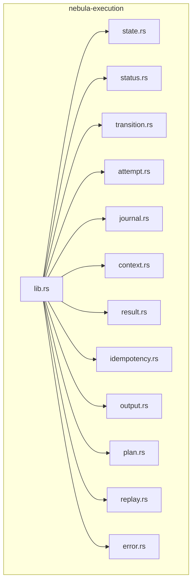

**Diagram sources**
- [lib.rs:1-63](file://crates/execution/src/lib.rs#L1-L63)
- [state.rs:1-822](file://crates/execution/src/state.rs#L1-L822)
- [status.rs:1-350](file://crates/execution/src/status.rs#L1-L350)
- [transition.rs:1-283](file://crates/execution/src/transition.rs#L1-L283)
- [attempt.rs:1-167](file://crates/execution/src/attempt.rs#L1-L167)
- [journal.rs:1-321](file://crates/execution/src/journal.rs#L1-L321)
- [context.rs:1-226](file://crates/execution/src/context.rs#L1-L226)
- [result.rs:1-273](file://crates/execution/src/result.rs#L1-L273)
- [idempotency.rs:1-80](file://crates/execution/src/idempotency.rs#L1-L80)
- [output.rs:1-239](file://crates/execution/src/output.rs#L1-L239)
- [plan.rs:1-212](file://crates/execution/src/plan.rs#L1-L212)
- [replay.rs:1-381](file://crates/execution/src/replay.rs#L1-L381)
- [error.rs:1-106](file://crates/execution/src/error.rs#L1-L106)

**Section sources**
- [lib.rs:1-63](file://crates/execution/src/lib.rs#L1-L63)

## Core Components
- ExecutionStatus: 8-state execution-level status with terminal and active flags.
- NodeExecutionState and ExecutionState: Persistent node and execution-wide state with timestamps, attempts, outputs, and versioning.
- Transition validation: Strict rules for valid state changes at both node and execution levels.
- JournalEntry: Audit trail entries for all major events.
- NodeAttempt: Per-attempt tracking with idempotency key, timing, and result.
- ExecutionOutput and NodeOutput: Output data model with inline and blob-backed variants.
- ExecutionBudget and ExecutionContext: Concurrency, timeout, and retry limits.
- ExecutionResult: Post-run summary with timing, counts, and termination reason.
- IdempotencyKey: Deterministic key for exactly-once execution guarantees.
- ExecutionPlan and ReplayPlan: Precomputed schedules and replay partitions.
- Error types: Typed errors for invalid transitions, budgets, idempotency, and serialization.

**Section sources**
- [status.rs:1-350](file://crates/execution/src/status.rs#L1-L350)
- [state.rs:1-822](file://crates/execution/src/state.rs#L1-L822)
- [transition.rs:1-283](file://crates/execution/src/transition.rs#L1-L283)
- [journal.rs:1-321](file://crates/execution/src/journal.rs#L1-L321)
- [attempt.rs:1-167](file://crates/execution/src/attempt.rs#L1-L167)
- [output.rs:1-239](file://crates/execution/src/output.rs#L1-L239)
- [context.rs:1-226](file://crates/execution/src/context.rs#L1-L226)
- [result.rs:1-273](file://crates/execution/src/result.rs#L1-L273)
- [idempotency.rs:1-80](file://crates/execution/src/idempotency.rs#L1-L80)
- [plan.rs:1-212](file://crates/execution/src/plan.rs#L1-L212)
- [replay.rs:1-381](file://crates/execution/src/replay.rs#L1-L381)
- [error.rs:1-106](file://crates/execution/src/error.rs#L1-L106)

## Architecture Overview
The execution state machine is coordinated by the engine and persisted through the storage layer. The engine uses ExecutionPlan to schedule parallel groups, ExecutionState to track progress, JournalEntry for audit, and NodeAttempt/IdempotencyKey for retries and idempotency. Results are summarized in ExecutionResult, and replay uses ReplayPlan to re-run from a specific node.

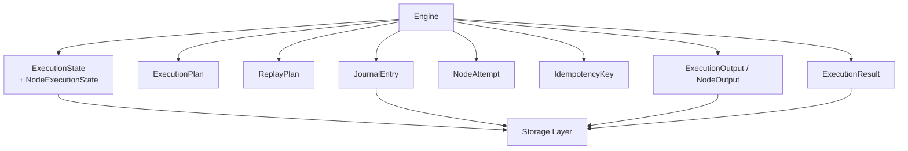

**Diagram sources**
- [state.rs:120-441](file://crates/execution/src/state.rs#L120-L441)
- [plan.rs:10-67](file://crates/execution/src/plan.rs#L10-L67)
- [replay.rs:27-137](file://crates/execution/src/replay.rs#L27-L137)
- [journal.rs:9-100](file://crates/execution/src/journal.rs#L9-L100)
- [attempt.rs:10-85](file://crates/execution/src/attempt.rs#L10-L85)
- [idempotency.rs:13-35](file://crates/execution/src/idempotency.rs#L13-L35)
- [output.rs:16-137](file://crates/execution/src/output.rs#L16-L137)
- [result.rs:11-121](file://crates/execution/src/result.rs#L11-L121)
- [mod.rs:11-38](file://crates/storage/src/repos/mod.rs#L11-L38)

## Detailed Component Analysis

### Execution Lifecycle and State Transitions
- Execution-level transitions are validated to prevent illegal state changes and to support realistic outcomes like pre-start cancellation and paused-to-failed/timed-out conversions.
- Node-level transitions enforce a strict order: Pending → Ready → Running → {Completed, Failed, Cancelled}, with retries moving Failed → Retrying → Running.

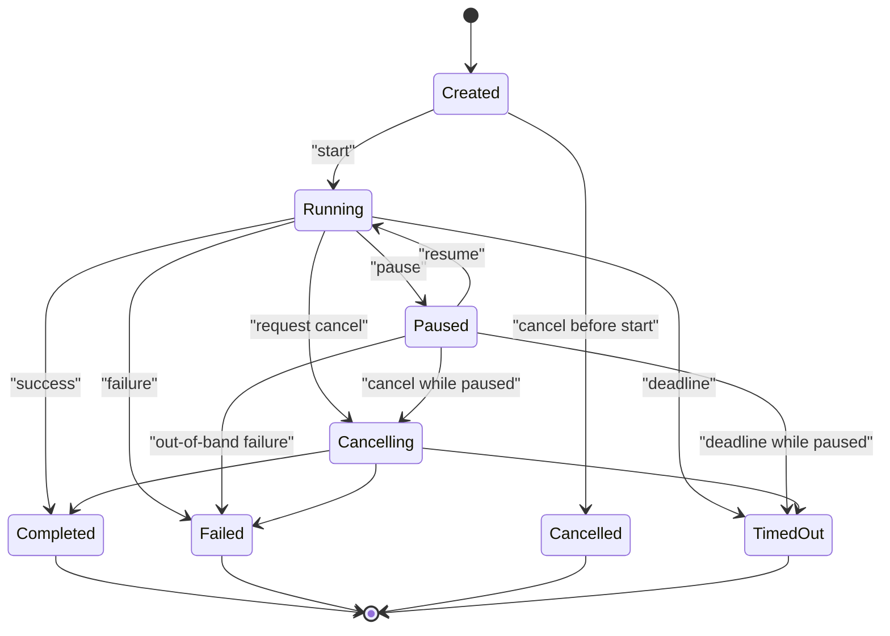

**Diagram sources**
- [transition.rs:14-87](file://crates/execution/src/transition.rs#L14-L87)
- [status.rs:8-57](file://crates/execution/src/status.rs#L8-L57)

**Section sources**
- [transition.rs:14-87](file://crates/execution/src/transition.rs#L14-L87)
- [status.rs:8-57](file://crates/execution/src/status.rs#L8-L57)

### Node Execution State Machine
- NodeExecutionState tracks scheduling, running, completion, and retry timestamps, along with the current output and error messages.
- start_attempt handles first dispatch and retry paths, ensuring only valid transitions are permitted.

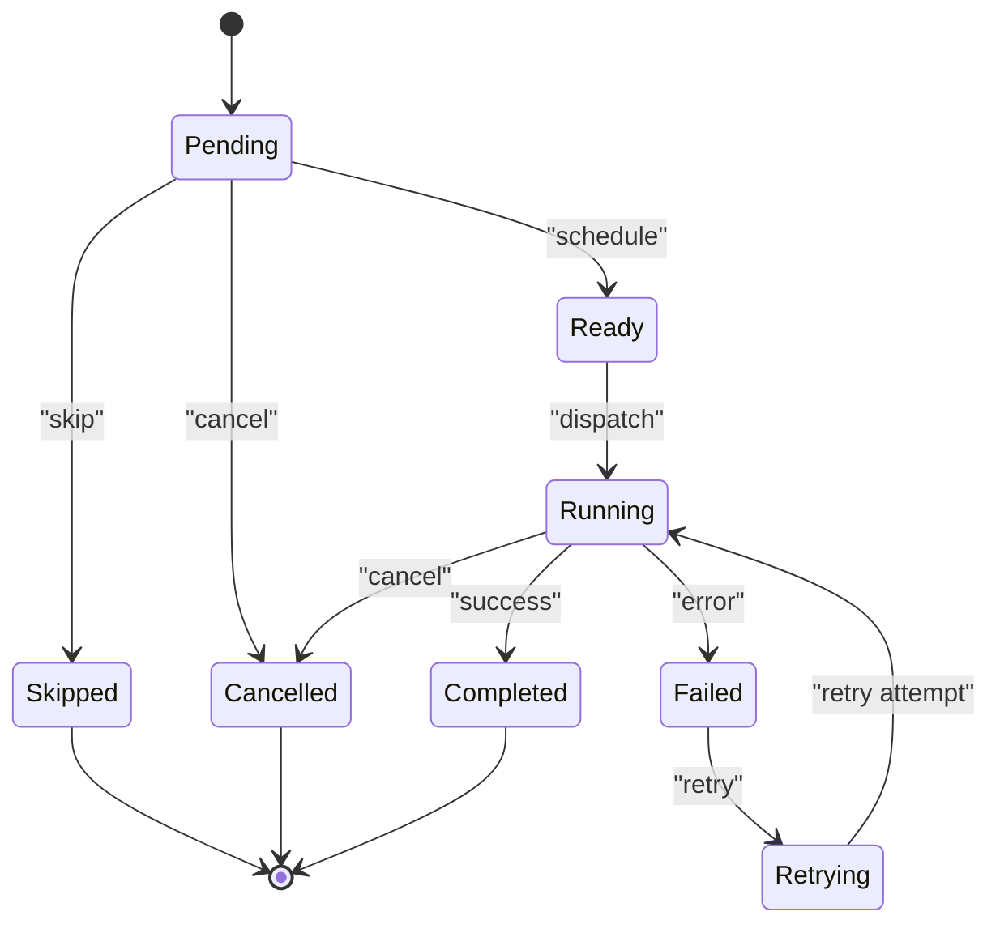

**Diagram sources**
- [state.rs:20-112](file://crates/execution/src/state.rs#L20-L112)
- [transition.rs:52-87](file://crates/execution/src/transition.rs#L52-L87)

**Section sources**
- [state.rs:20-112](file://crates/execution/src/state.rs#L20-L112)
- [transition.rs:52-87](file://crates/execution/src/transition.rs#L52-L87)

### Execution Context and Budget
- ExecutionContext carries the execution ID and ExecutionBudget, which controls concurrency, wall-clock timeout, total output size, and total retry attempts.
- Validation prevents zero concurrency, which would deadlock the scheduler.

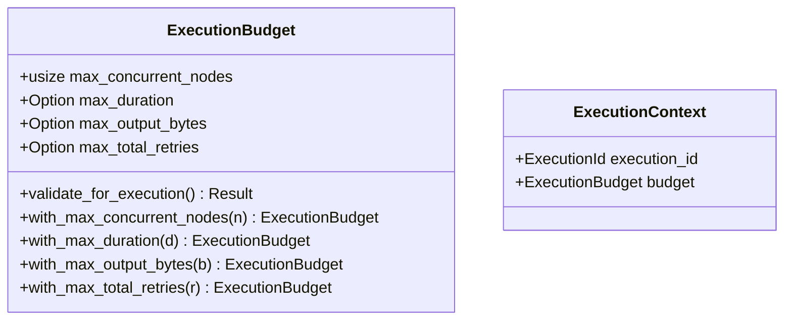

**Diagram sources**
- [context.rs:25-148](file://crates/execution/src/context.rs#L25-L148)

**Section sources**
- [context.rs:25-148](file://crates/execution/src/context.rs#L25-L148)

### Attempt System and Idempotency
- NodeAttempt captures per-attempt metadata: idempotency key, timestamps, output, and error.
- IdempotencyKey is deterministically formed from execution ID, node key, and attempt number, enabling exactly-once execution guarantees across retries and restarts.

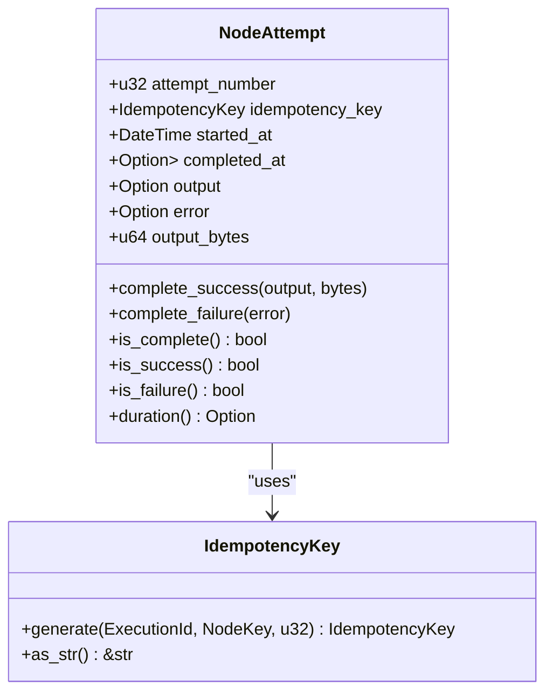

**Diagram sources**
- [attempt.rs:10-85](file://crates/execution/src/attempt.rs#L10-L85)
- [idempotency.rs:13-35](file://crates/execution/src/idempotency.rs#L13-L35)

**Section sources**
- [attempt.rs:10-85](file://crates/execution/src/attempt.rs#L10-L85)
- [idempotency.rs:13-35](file://crates/execution/src/idempotency.rs#L13-L35)

### Journal and Audit Trail
- JournalEntry records all significant events: execution start/completion/failure, node scheduling/starting/completing/failed/skipped/retrying, and cancellation requests.
- Entries carry timestamps and optional node keys, enabling timeline reconstruction and auditability.

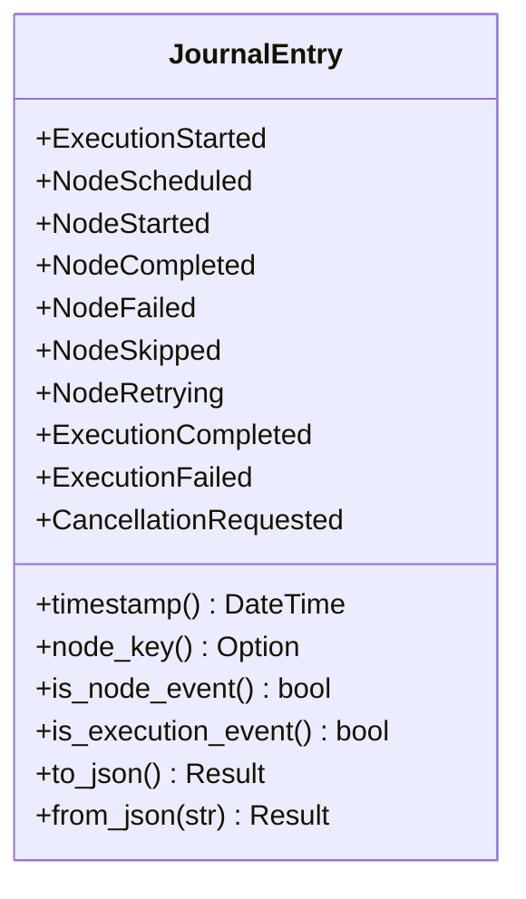

**Diagram sources**
- [journal.rs:9-158](file://crates/execution/src/journal.rs#L9-L158)

**Section sources**
- [journal.rs:9-158](file://crates/execution/src/journal.rs#L9-L158)

### Execution State Persistence and Versioning
- ExecutionState encapsulates execution-wide metadata, per-node states, version, timestamps, totals, and variables.
- Transition APIs enforce validation and bump the parent version to maintain optimistic concurrency correctness.

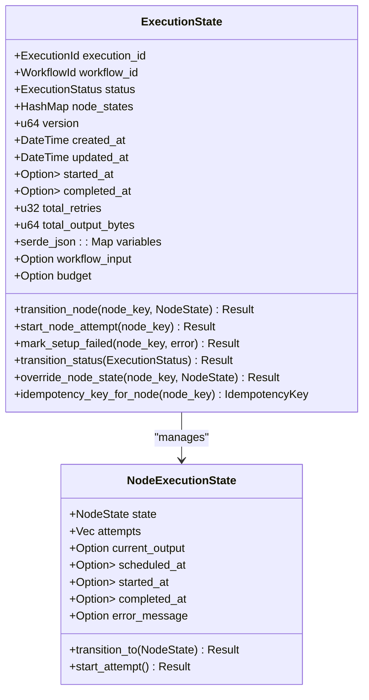

**Diagram sources**
- [state.rs:120-441](file://crates/execution/src/state.rs#L120-L441)

**Section sources**
- [state.rs:120-441](file://crates/execution/src/state.rs#L120-L441)

### Output Model and Result Summaries
- ExecutionOutput supports inline JSON and blob references for large outputs.
- NodeOutput augments output with status, timing, and size.
- ExecutionResult summarizes timing, node counts, outputs, and termination reason.

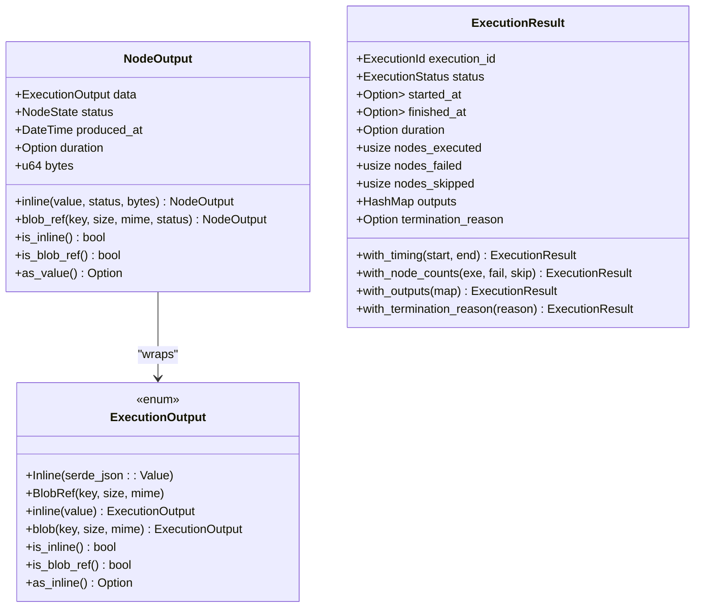

**Diagram sources**
- [output.rs:16-137](file://crates/execution/src/output.rs#L16-L137)
- [result.rs:11-121](file://crates/execution/src/result.rs#L11-L121)

**Section sources**
- [output.rs:16-137](file://crates/execution/src/output.rs#L16-L137)
- [result.rs:11-121](file://crates/execution/src/result.rs#L11-L121)

### Planning and Replay
- ExecutionPlan derives parallel execution groups from a workflow definition and preserves entry/exit nodes and budget.
- ReplayPlan partitions nodes into pinned (reuse stored outputs) and rerun (re-execute) sets, preserving correctness and avoiding unintended side effects.

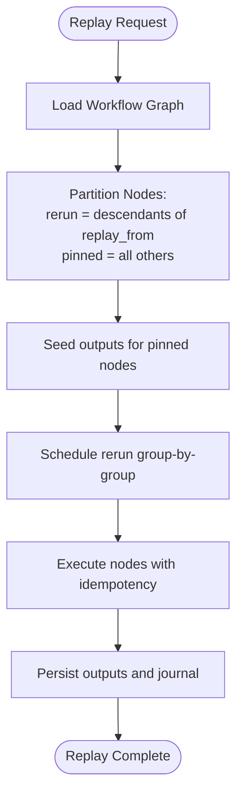

**Diagram sources**
- [plan.rs:31-67](file://crates/execution/src/plan.rs#L31-L67)
- [replay.rs:58-137](file://crates/execution/src/replay.rs#L58-L137)

**Section sources**
- [plan.rs:31-67](file://crates/execution/src/plan.rs#L31-L67)
- [replay.rs:58-137](file://crates/execution/src/replay.rs#L58-L137)

### Event-Driven Updates and Idempotency Guarantees
- The engine updates ExecutionState via transition_node and transition_status, which validate transitions and bump version for optimistic concurrency.
- IdempotencyKey ensures that retries and restarts do not duplicate outputs by using deterministic keys tied to execution, node, and attempt number.

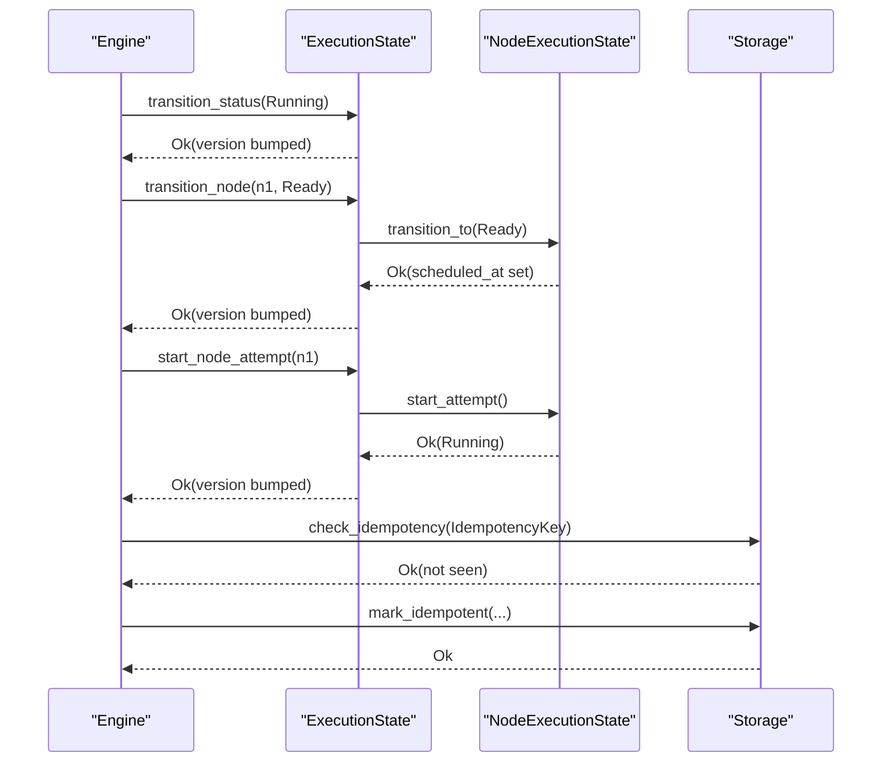

**Diagram sources**
- [state.rs:425-440](file://crates/execution/src/state.rs#L425-L440)
- [state.rs:323-361](file://crates/execution/src/state.rs#L323-L361)
- [state.rs:95-111](file://crates/execution/src/state.rs#L95-L111)
- [idempotency.rs:17-29](file://crates/execution/src/idempotency.rs#L17-L29)

**Section sources**
- [state.rs:425-440](file://crates/execution/src/state.rs#L425-L440)
- [state.rs:323-361](file://crates/execution/src/state.rs#L323-L361)
- [state.rs:95-111](file://crates/execution/src/state.rs#L95-L111)
- [idempotency.rs:17-29](file://crates/execution/src/idempotency.rs#L17-L29)

### Error Handling Patterns and Retry Policies
- ExecutionError enumerates invalid transitions, missing nodes, plan validation failures, budget exceeded, duplicate idempotency keys, serialization errors, and cancellation.
- Retry policy is modeled at the node attempt level; the engine coordinates retries and idempotency while respecting ExecutionBudget limits.

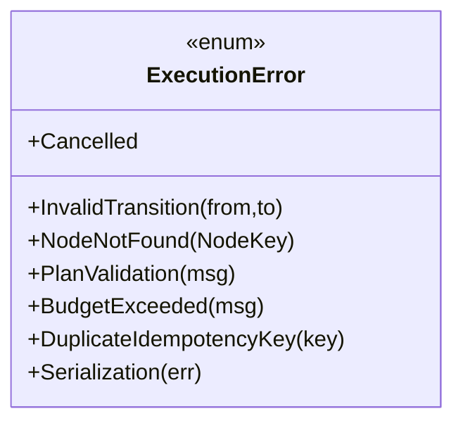

**Diagram sources**
- [error.rs:9-50](file://crates/execution/src/error.rs#L9-L50)

**Section sources**
- [error.rs:9-50](file://crates/execution/src/error.rs#L9-L50)

### Integration with Engine and Storage
- The engine uses ExecutionPlan to schedule parallel groups and ExecutionState to track progress, while JournalEntry and NodeOutput capture audit and output data.
- Storage layer contracts are defined in the storage crate; the execution crate depends on these abstractions for persistence.

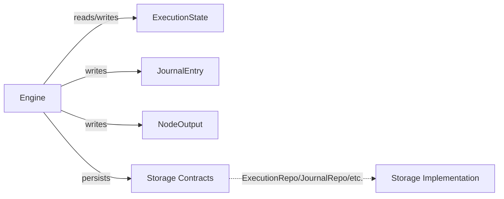

**Diagram sources**
- [mod.rs:11-38](file://crates/storage/src/repos/mod.rs#L11-L38)
- [state.rs:120-441](file://crates/execution/src/state.rs#L120-L441)
- [journal.rs:9-100](file://crates/execution/src/journal.rs#L9-L100)
- [output.rs:74-137](file://crates/execution/src/output.rs#L74-L137)

**Section sources**
- [mod.rs:11-38](file://crates/storage/src/repos/mod.rs#L11-L38)
- [state.rs:120-441](file://crates/execution/src/state.rs#L120-L441)
- [journal.rs:9-100](file://crates/execution/src/journal.rs#L9-L100)
- [output.rs:74-137](file://crates/execution/src/output.rs#L74-L137)

## Dependency Analysis
- Execution crate exports core types and re-exports shared helpers, keeping dependencies minimal and focused.
- The engine consumes ExecutionPlan, ExecutionState, JournalEntry, NodeOutput, and IdempotencyKey to orchestrate execution.
- Storage layer contracts define the persistence boundary; the execution crate does not implement storage.

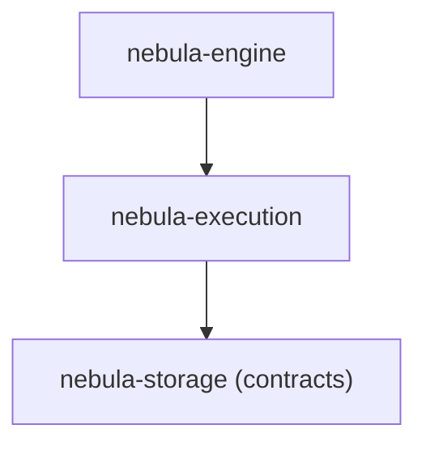

**Diagram sources**
- [lib.rs:37-62](file://crates/execution/src/lib.rs#L37-L62)
- [mod.rs:11-38](file://crates/storage/src/repos/mod.rs#L11-L38)

**Section sources**
- [lib.rs:37-62](file://crates/execution/src/lib.rs#L37-L62)
- [mod.rs:11-38](file://crates/storage/src/repos/mod.rs#L11-L38)

## Performance Considerations
- Versioning and optimistic concurrency: Each state change increments ExecutionState.version and updates updated_at, ensuring readers observe changes consistently.
- Budget enforcement: ExecutionBudget limits concurrency, output size, retries, and wall-clock time to prevent resource exhaustion.
- Output sizing: ExecutionOutput distinguishes inline vs blob-backed storage to avoid oversized payloads inlined into JSON.

[No sources needed since this section provides general guidance]

## Troubleshooting Guide
Common issues and diagnostics:
- Invalid transitions: Use validate_execution_transition and validate_node_transition to catch illegal state changes early.
- Node not found: Ensure node keys exist in ExecutionState.node_states before attempting transitions.
- Budget exceeded: Respect ExecutionBudget limits; zero concurrency is rejected to avoid deadlocks.
- Serialization errors: ExecutionError::Serialization indicates malformed JSON payloads.
- Duplicate idempotency keys: Indicates a retry or replay collision; ensure IdempotencyKey uniqueness per attempt.

Concrete examples from tests:
- Transition validation and version bumps are verified in state tests.
- Budget validation and builder methods are exercised in context tests.
- Replay partition correctness and serde round-trips are covered in replay tests.

**Section sources**
- [state.rs:425-440](file://crates/execution/src/state.rs#L425-L440)
- [state.rs:323-361](file://crates/execution/src/state.rs#L323-L361)
- [context.rs:83-88](file://crates/execution/src/context.rs#L83-L88)
- [error.rs:9-50](file://crates/execution/src/error.rs#L9-L50)
- [replay.rs:139-381](file://crates/execution/src/replay.rs#L139-L381)

## Conclusion
Nebula’s execution state machine provides a robust, auditable, and resilient foundation for workflow execution. Through strict state transitions, deterministic idempotency, comprehensive journaling, and replay capabilities, it ensures reliable processing, observability, and recovery. The separation between execution modeling and orchestration/storage enables scalable deployment and maintenance.

[No sources needed since this section summarizes without analyzing specific files]

## Appendices

### Execution Monitoring and Observability
- Metrics integration: The engine tests demonstrate metrics counters for workflow execution lifecycle events.
- Telemetry: The engine and runtime share a metrics registry, enabling visibility into action and workflow execution counts.

**Section sources**
- [integration.rs:241-275](file://crates/engine/tests/integration.rs#L241-L275)
- [integration.rs:520-561](file://crates/engine/tests/integration.rs#L520-L561)
- [integration.rs:675-715](file://crates/engine/tests/integration.rs#L675-L715)