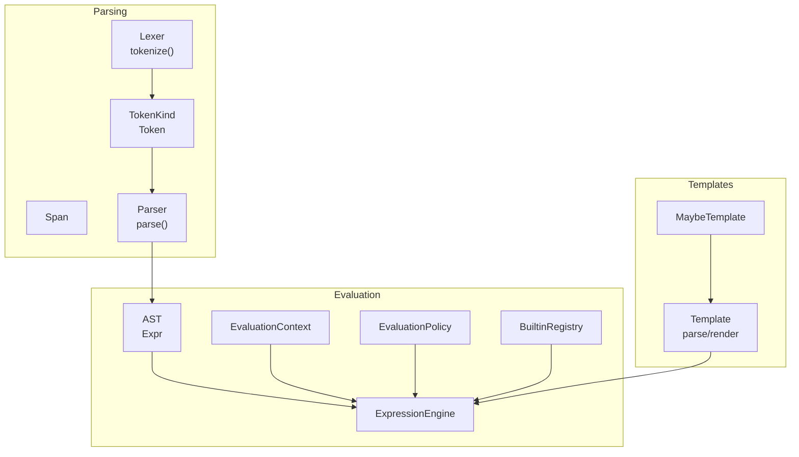
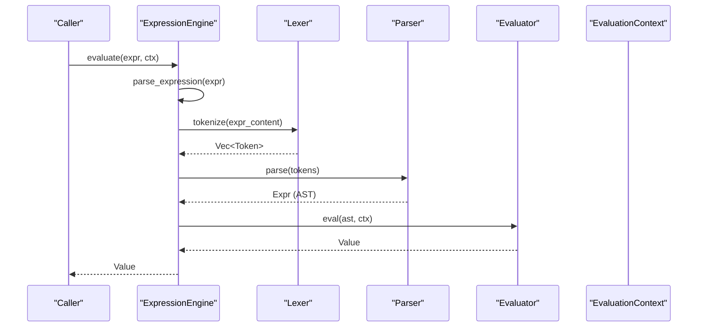
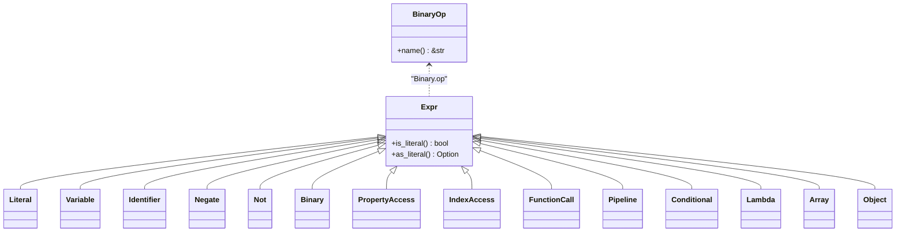
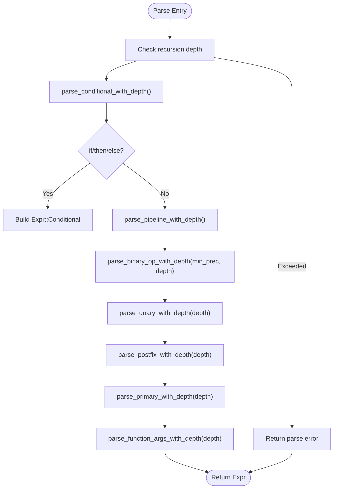
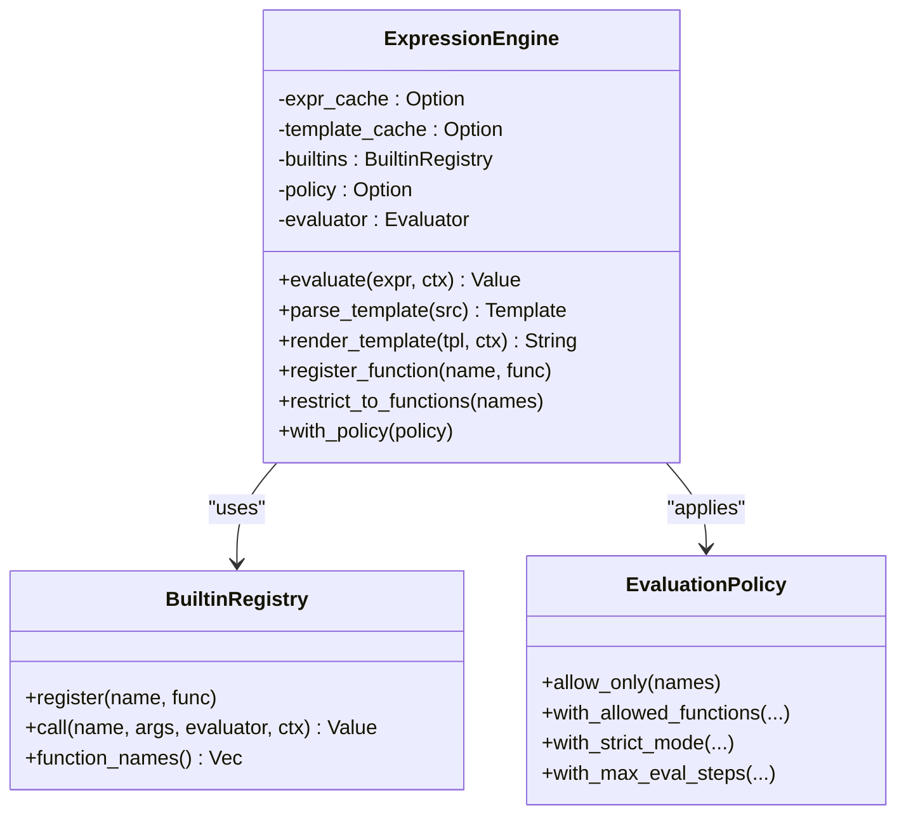
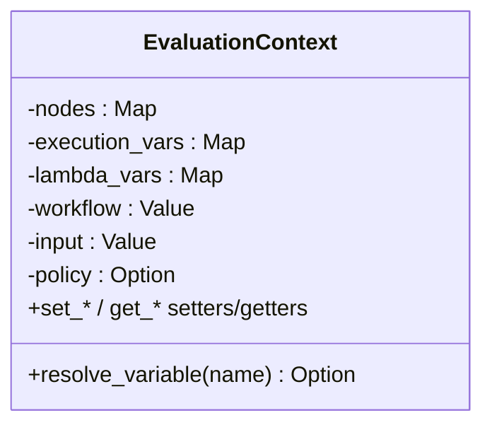
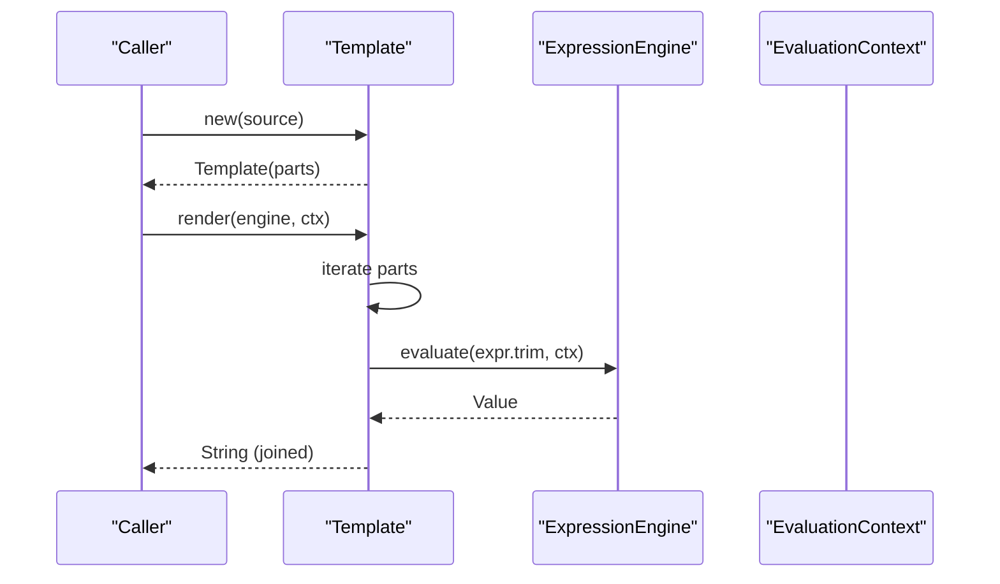
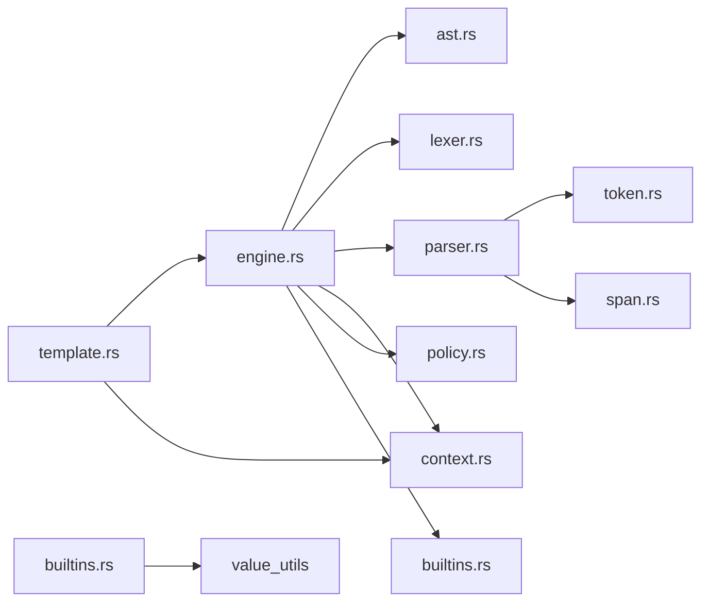

# Expression Engine

<cite>
**Referenced Files in This Document**
- [lib.rs](file://crates/expression/src/lib.rs)
- [engine.rs](file://crates/expression/src/engine.rs)
- [ast.rs](file://crates/expression/src/ast.rs)
- [parser.rs](file://crates/expression/src/parser.rs)
- [lexer.rs](file://crates/expression/src/lexer.rs)
- [token.rs](file://crates/expression/src/token.rs)
- [span.rs](file://crates/expression/src/span.rs)
- [context.rs](file://crates/expression/src/context.rs)
- [builtins.rs](file://crates/expression/src/builtins.rs)
- [string.rs](file://crates/expression/src/builtins/string.rs)
- [array.rs](file://crates/expression/src/builtins/array.rs)
- [math.rs](file://crates/expression/src/builtins/math.rs)
- [object.rs](file://crates/expression/src/builtins/object.rs)
- [conversion.rs](file://crates/expression/src/builtins/conversion.rs)
- [template.rs](file://crates/expression/src/template.rs)
- [policy.rs](file://crates/expression/src/policy.rs)
</cite>

## Table of Contents
1. [Introduction](#introduction)
2. [Project Structure](#project-structure)
3. [Core Components](#core-components)
4. [Architecture Overview](#architecture-overview)
5. [Detailed Component Analysis](#detailed-component-analysis)
6. [Dependency Analysis](#dependency-analysis)
7. [Performance Considerations](#performance-considerations)
8. [Troubleshooting Guide](#troubleshooting-guide)
9. [Conclusion](#conclusion)
10. [Appendices](#appendices)

## Introduction
Nebula’s Expression Engine powers dynamic workflow automation by evaluating expressions against execution-time context. It supports:
- Parsing and evaluating expressions with a robust AST
- A rich set of built-in functions for strings, arrays, math, objects, conversions, and optional date/time utilities
- Template rendering with embedded expressions and whitespace control
- Configurable evaluation policies for safety and performance
- Caching for repeated expression and template evaluation

This document explains the AST representation, parsing system, evaluation engine, template rendering, context resolution, built-in functions, and security/performance considerations—covering both beginner-friendly guidance and advanced customization.

## Project Structure
The expression crate organizes functionality into cohesive modules:
- Core engine and caching
- AST and tokenization
- Parser with precedence climbing
- Evaluation context and policy
- Built-in function categories
- Template parsing and rendering
- Utility types for spans and tokens

**Diagram sources**
- [lexer.rs:27-42](file://crates/expression/src/lexer.rs#L27-L42)
- [token.rs:9-23](file://crates/expression/src/token.rs#L9-L23)
- [span.rs:5-14](file://crates/expression/src/span.rs#L5-L14)
- [parser.rs:41-54](file://crates/expression/src/parser.rs#L41-L54)
- [ast.rs:9-78](file://crates/expression/src/ast.rs#L9-L78)
- [context.rs:13-28](file://crates/expression/src/context.rs#L13-L28)
- [policy.rs:8-18](file://crates/expression/src/policy.rs#L8-L18)
- [builtins.rs:27-51](file://crates/expression/src/builtins.rs#L27-L51)
- [engine.rs:103-117](file://crates/expression/src/engine.rs#L103-L117)
- [template.rs:85-92](file://crates/expression/src/template.rs#L85-L92)

**Section sources**
- [lib.rs:54-101](file://crates/expression/src/lib.rs#L54-L101)

## Core Components
- ExpressionEngine: orchestrates parsing, caching, and evaluation; exposes evaluate, parse_template, render_template, and cache introspection APIs
- AST (Expr): strongly typed nodes for literals, variables, unary/binary ops, property/index access, function calls, pipelines, conditionals, lambdas, arrays, and objects
- Parser: recursive descent with precedence climbing; enforces recursion depth limits and strict EOF consumption
- Lexer: tokenizes input with zero-copy string tokens when possible; handles keywords, operators, strings, numbers, variables, and template delimiters
- EvaluationContext: resolves $node, $execution, $workflow, $input, and helper variables like $now/$today; supports lambda-bound parameters
- EvaluationPolicy: restricts allowed functions, strict mode flags, and DoS budgets
- Built-in Registry: aggregates string, array, math, object, conversion, and optional datetime functions
- Template: parses and renders templates with embedded expressions, whitespace control, and detailed error reporting

**Section sources**
- [engine.rs:103-117](file://crates/expression/src/engine.rs#L103-L117)
- [ast.rs:9-78](file://crates/expression/src/ast.rs#L9-L78)
- [parser.rs:41-54](file://crates/expression/src/parser.rs#L41-L54)
- [lexer.rs:26-42](file://crates/expression/src/lexer.rs#L26-L42)
- [context.rs:13-28](file://crates/expression/src/context.rs#L13-L28)
- [policy.rs:8-18](file://crates/expression/src/policy.rs#L8-L18)
- [builtins.rs:27-51](file://crates/expression/src/builtins.rs#L27-L51)
- [template.rs:85-92](file://crates/expression/src/template.rs#L85-L92)

## Architecture Overview
The engine follows a layered pipeline: input string → tokens → AST → evaluation with context and policy. Templates wrap expressions with static text and optional whitespace control.

**Diagram sources**
- [engine.rs:235-266](file://crates/expression/src/engine.rs#L235-L266)
- [lexer.rs:26-42](file://crates/expression/src/lexer.rs#L26-L42)
- [parser.rs:41-54](file://crates/expression/src/parser.rs#L41-L54)
- [ast.rs:9-78](file://crates/expression/src/ast.rs#L9-L78)

## Detailed Component Analysis

### AST Representation
The AST captures the full syntactic structure of expressions:
- Literals: numbers, strings, booleans, null
- Variables and identifiers
- Unary ops: negate, logical not
- Binary ops: arithmetic, comparison, regex match, logical
- Access: property and index
- Calls: function calls and pipelines
- Conditionals: if-then-else
- Lambdas: param => body
- Collections: arrays and objects

**Diagram sources**
- [ast.rs:9-78](file://crates/expression/src/ast.rs#L9-L78)
- [ast.rs:80-126](file://crates/expression/src/ast.rs#L80-L126)

**Section sources**
- [ast.rs:9-148](file://crates/expression/src/ast.rs#L9-L148)

### Lexer and Token Handling
The lexer converts input into tokens with precise spans. It supports:
- Numeric literals (int/float)
- Strings with escape processing
- Keywords and identifiers
- Operators and punctuation
- Template delimiters
- Strict error reporting for malformed input

Key behaviors:
- Zero-copy string tokens when no escapes are present
- UTF-8 aware character advancement
- Explicit handling of multi-character operators and arrows

**Section sources**
- [lexer.rs:26-42](file://crates/expression/src/lexer.rs#L26-L42)
- [lexer.rs:209-220](file://crates/expression/src/lexer.rs#L209-L220)
- [token.rs:9-23](file://crates/expression/src/token.rs#L9-L23)
- [token.rs:26-131](file://crates/expression/src/token.rs#L26-L131)
- [span.rs:5-14](file://crates/expression/src/span.rs#L5-L14)

### Parser and Error Reporting
The parser builds the AST using precedence climbing and enforces:
- Strict EOF consumption after root expression
- Recursion depth limits to prevent stack exhaustion
- Detailed error messages with token kinds and positions

**Diagram sources**
- [parser.rs:41-54](file://crates/expression/src/parser.rs#L41-L54)
- [parser.rs:56-64](file://crates/expression/src/parser.rs#L56-L64)
- [parser.rs:66-83](file://crates/expression/src/parser.rs#L66-L83)
- [parser.rs:85-118](file://crates/expression/src/parser.rs#L85-L118)
- [parser.rs:120-188](file://crates/expression/src/parser.rs#L120-L188)
- [parser.rs:190-213](file://crates/expression/src/parser.rs#L190-L213)
- [parser.rs:215-253](file://crates/expression/src/parser.rs#L215-L253)
- [parser.rs:255-376](file://crates/expression/src/parser.rs#L255-L376)
- [parser.rs:378-416](file://crates/expression/src/parser.rs#L378-L416)

**Section sources**
- [parser.rs:17-24](file://crates/expression/src/parser.rs#L17-L24)
- [parser.rs:41-54](file://crates/expression/src/parser.rs#L41-L54)
- [parser.rs:56-64](file://crates/expression/src/parser.rs#L56-L64)

### Evaluation Engine and Caching
ExpressionEngine encapsulates:
- Optional LRU caching for parsed expressions and templates
- Built-in function registry and policy enforcement
- Safe evaluation with configurable budgets and function allowlists
- Rendering of templates with whitespace control and detailed error formatting

**Diagram sources**
- [engine.rs:103-117](file://crates/expression/src/engine.rs#L103-L117)
- [builtins.rs:27-51](file://crates/expression/src/builtins.rs#L27-L51)
- [policy.rs:20-33](file://crates/expression/src/policy.rs#L20-L33)

**Section sources**
- [engine.rs:103-117](file://crates/expression/src/engine.rs#L103-L117)
- [engine.rs:235-266](file://crates/expression/src/engine.rs#L235-L266)
- [engine.rs:268-301](file://crates/expression/src/engine.rs#L268-L301)
- [engine.rs:303-321](file://crates/expression/src/engine.rs#L303-L321)
- [engine.rs:323-379](file://crates/expression/src/engine.rs#L323-L379)
- [engine.rs:380-440](file://crates/expression/src/engine.rs#L380-L440)

### Evaluation Context and Variable Resolution
EvaluationContext provides:
- Node data, execution variables, workflow metadata, and input data
- Lambda-bound parameter isolation
- Built-in variables: $node (aggregated), $execution (aggregated), $workflow, $input, $now, $today
- Optional per-context policy override

**Diagram sources**
- [context.rs:13-28](file://crates/expression/src/context.rs#L13-L28)

**Section sources**
- [context.rs:107-148](file://crates/expression/src/context.rs#L107-L148)

### Template Rendering System
Template parsing:
- Detects {{ }} blocks and static segments
- Tracks positions for accurate error reporting
- Supports whitespace control markers {{- }} and {{ -}} for trimming
- Enforces a maximum number of expressions per template

Rendering:
- Iterates parts, evaluating expressions and appending static text
- Converts non-string results to strings
- Propagates detailed errors with source context

**Diagram sources**
- [template.rs:94-103](file://crates/expression/src/template.rs#L94-L103)
- [template.rs:115-184](file://crates/expression/src/template.rs#L115-L184)
- [template.rs:186-322](file://crates/expression/src/template.rs#L186-L322)

**Section sources**
- [template.rs:20-21](file://crates/expression/src/template.rs#L20-L21)
- [template.rs:186-322](file://crates/expression/src/template.rs#L186-L322)
- [template.rs:115-184](file://crates/expression/src/template.rs#L115-L184)

### Built-in Functions
The engine ships with categorized built-ins:
- String: length, uppercase, lowercase, trim, split, replace, substring, contains, starts_with, ends_with, pad_start, pad_end, repeat
- Array: length, first, last, sort, reverse, join, slice, concat, flatten, unique; higher-order helpers (filter/map/reduce) handled via evaluator
- Math: abs, round, floor, ceil, min, max, sqrt, pow
- Object: keys, values, has, merge, pick, omit, entries, from_entries
- Conversion: to_string, to_number, to_boolean, to_json, parse_json
- Optional datetime: now, now_iso, format_date, parse_date, date_add, date_subtract, date_diff, date_* extractors

Type checking and argument helpers ensure robust invocation with clear error messages.

**Section sources**
- [builtins.rs:84-184](file://crates/expression/src/builtins.rs#L84-L184)
- [string.rs:13-338](file://crates/expression/src/builtins/string.rs#L13-L338)
- [array.rs:13-268](file://crates/expression/src/builtins/array.rs#L13-L268)
- [math.rs:15-124](file://crates/expression/src/builtins/math.rs#L15-L124)
- [object.rs:13-201](file://crates/expression/src/builtins/object.rs#L13-L201)
- [conversion.rs:13-144](file://crates/expression/src/builtins/conversion.rs#L13-L144)

### Examples from the Codebase
Below are concrete examples demonstrating practical usage patterns. Paths reference the relevant tests and examples in the repository.

- Basic expression evaluation
  - [examples usage](file://crates/expression/examples/workflow_data.rs.disabled)
  - [engine tests:461-487](file://crates/expression/src/engine.rs#L461-L487)

- Template rendering with variables and functions
  - [template rendering example](file://crates/expression/examples/template_rendering.rs)
  - [template tests:450-480](file://crates/expression/src/template.rs#L450-L480)

- Multiple expressions in a single template
  - [template tests:442-447](file://crates/expression/src/template.rs#L442-L447)

- HTML-like template rendering
  - [template tests:546-561](file://crates/expression/src/template.rs#L546-L561)

- Whitespace control markers
  - [template tests:563-596](file://crates/expression/src/template.rs#L563-L596)

- Error reporting with positions
  - [template tests:510-519](file://crates/expression/src/template.rs#L510-L519)

- Function allowlisting
  - [engine tests:572-582](file://crates/expression/src/engine.rs#L572-L582)

- Custom function registration
  - [engine tests:562-571](file://crates/expression/src/engine.rs#L562-L571)

**Section sources**
- [engine.rs:461-582](file://crates/expression/src/engine.rs#L461-L582)
- [template.rs:442-596](file://crates/expression/src/template.rs#L442-L596)

## Dependency Analysis
The expression engine composes modules with clear boundaries and low coupling:
- Engine depends on AST, Lexer, Parser, Evaluator, Context, Policy, and Built-in Registry
- Parser depends on TokenKind and Span
- Template depends on Engine, Context, and error formatting
- Built-in functions depend on value utilities and helpers

**Diagram sources**
- [engine.rs:15-18](file://crates/expression/src/engine.rs#L15-L18)
- [parser.rs:9-15](file://crates/expression/src/parser.rs#L9-L15)
- [lexer.rs:5-12](file://crates/expression/src/lexer.rs#L5-L12)
- [token.rs:5-7](file://crates/expression/src/token.rs#L5-L7)
- [span.rs:5-7](file://crates/expression/src/span.rs#L5-L7)
- [template.rs:12-18](file://crates/expression/src/template.rs#L12-L18)
- [builtins.rs:16-22](file://crates/expression/src/builtins.rs#L16-L22)

**Section sources**
- [lib.rs:54-101](file://crates/expression/src/lib.rs#L54-L101)

## Performance Considerations
- Caching
  - ExpressionEngine supports optional LRU caches for parsed expressions and templates to avoid repeated lexing/parsing
  - Cache statistics snapshots and clear operations are exposed for observability and maintenance
- Memory and allocation
  - Lexer uses zero-copy string tokens when possible; escapes trigger owned allocations
  - Template parsing tracks positions and limits expression count to mitigate DoS
- Evaluation budgets
  - EvaluationPolicy supports max evaluation steps and strict mode flags to prevent runaway computations
- Built-in guards
  - Several functions include explicit bounds (e.g., pad_start/pad_end max lengths, repeat result size limits)

Practical tips:
- Enable caching in hot paths (e.g., repeated template rendering)
- Prefer pipelines for readable transformations
- Use allowlists to restrict expensive functions in untrusted environments

**Section sources**
- [engine.rs:103-117](file://crates/expression/src/engine.rs#L103-L117)
- [engine.rs:323-379](file://crates/expression/src/engine.rs#L323-L379)
- [lexer.rs:267-275](file://crates/expression/src/lexer.rs#L267-L275)
- [template.rs:20-21](file://crates/expression/src/template.rs#L20-L21)
- [policy.rs:90-98](file://crates/expression/src/policy.rs#L90-L98)
- [string.rs:225-230](file://crates/expression/src/builtins/string.rs#L225-L230)
- [string.rs:327-334](file://crates/expression/src/builtins/string.rs#L327-L334)

## Troubleshooting Guide
Common issues and remedies:
- Unexpected trailing token or unclosed braces
  - Parser enforces strict EOF and reports exact token kinds
  - Template parsing reports unclosed ‘{{’ with position context
- Argument type mismatches
  - Built-in helpers validate types and provide descriptive errors
- Function not found or disallowed
  - Ensure function name is registered and allowed by policy
- Excessive recursion or deep nesting
  - Parser depth limits protect against stack overflow; simplify expressions
- Large JSON parse requests
  - parse_json respects policy-provided max length to prevent memory spikes

Debugging techniques:
- Use ExpressionEngine::cache_overview to inspect cache hits/misses
- Leverage Template::expression_count and Template::expressions to audit template complexity
- Enable tracing logs around evaluation for visibility

**Section sources**
- [parser.rs:47-52](file://crates/expression/src/parser.rs#L47-L52)
- [parser.rs:58-62](file://crates/expression/src/parser.rs#L58-L62)
- [template.rs:272-281](file://crates/expression/src/template.rs#L272-L281)
- [template.rs:288-297](file://crates/expression/src/template.rs#L288-L297)
- [builtins.rs:193-223](file://crates/expression/src/builtins.rs#L193-L223)
- [engine.rs:380-440](file://crates/expression/src/engine.rs#L380-L440)

## Conclusion
Nebula’s Expression Engine delivers a safe, extensible, and performant foundation for workflow automation. Its layered design—robust lexer and parser, strongly typed AST, flexible evaluation context, rich built-ins, and powerful templating—enables expressive dynamic behavior while maintaining strong security and performance guarantees.

## Appendices

### Integration with Workflow Execution
- ExpressionEngine integrates with the broader system by resolving dynamic fields during execution and template rendering
- EvaluationContext carries $node, $execution, $workflow, and $input data, enabling contextualized expressions
- Templates embed expressions inline, supporting rich UI generation and dynamic parameter binding

**Section sources**
- [context.rs:13-28](file://crates/expression/src/context.rs#L13-L28)
- [template.rs:115-184](file://crates/expression/src/template.rs#L115-L184)

### Security and Sandboxing
- Function allowlists and denylists restrict callable built-ins
- Strict mode and strict conversion modes tighten type coercion
- DoS protections: recursion depth caps, expression count limits, JSON size caps
- Built-in functions include explicit guards against excessive allocations

**Section sources**
- [engine.rs:191-203](file://crates/expression/src/engine.rs#L191-L203)
- [policy.rs:26-33](file://crates/expression/src/policy.rs#L26-L33)
- [policy.rs:57-82](file://crates/expression/src/policy.rs#L57-L82)
- [policy.rs:84-98](file://crates/expression/src/policy.rs#L84-L98)
- [parser.rs:17-24](file://crates/expression/src/parser.rs#L17-L24)
- [template.rs:20-21](file://crates/expression/src/template.rs#L20-L21)
- [conversion.rs:13-14](file://crates/expression/src/builtins/conversion.rs#L13-L14)
- [string.rs:225-230](file://crates/expression/src/builtins/string.rs#L225-L230)
- [string.rs:327-334](file://crates/expression/src/builtins/string.rs#L327-L334)

### Extending the Engine
- Register custom built-in functions via ExpressionEngine::register_function
- Apply function allowlists with ExpressionEngine::restrict_to_functions
- Override policy per context using EvaluationContext::set_policy

**Section sources**
- [engine.rs:221-233](file://crates/expression/src/engine.rs#L221-L233)
- [engine.rs:191-203](file://crates/expression/src/engine.rs#L191-L203)
- [context.rs:97-105](file://crates/expression/src/context.rs#L97-L105)