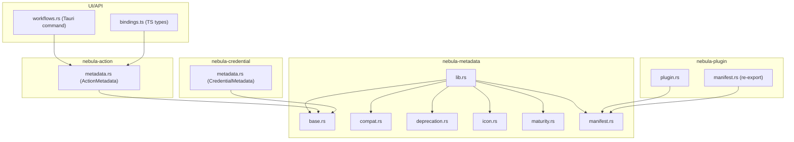
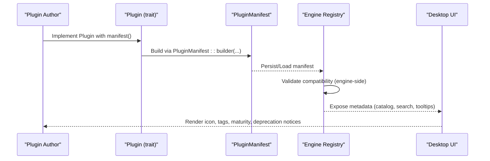
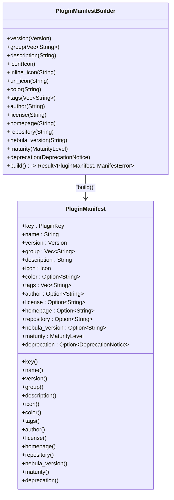
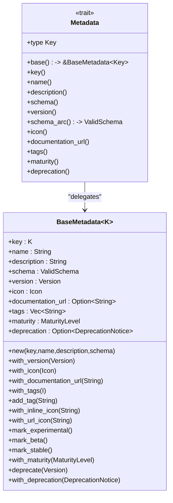
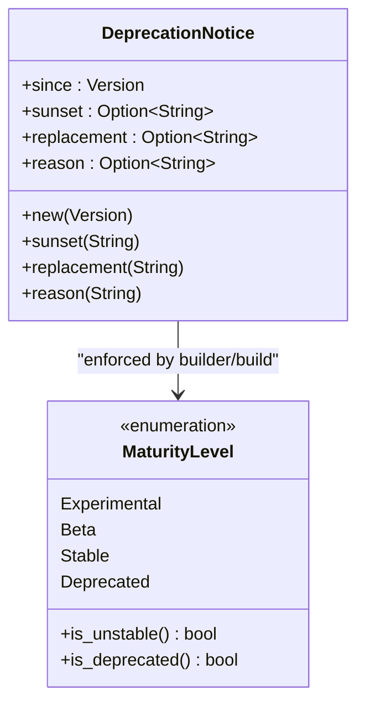
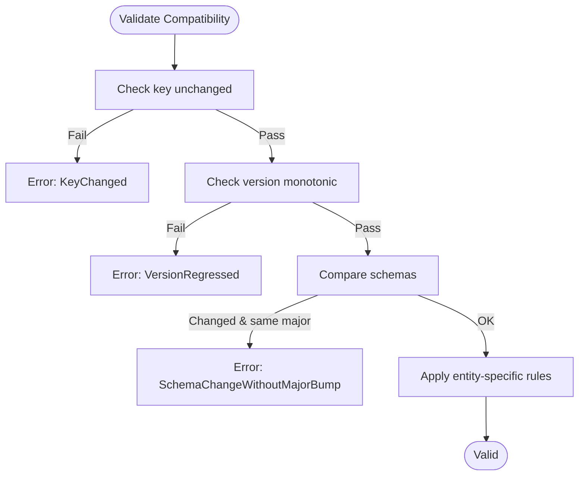
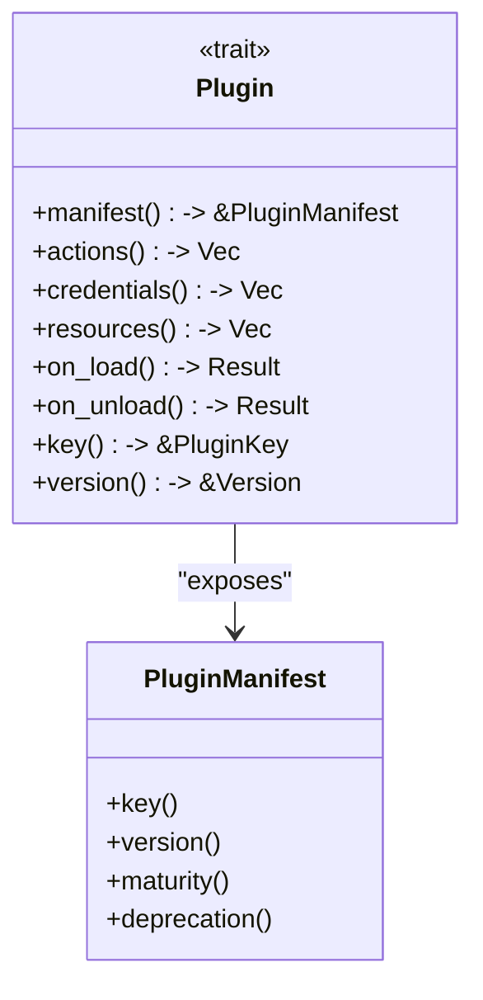
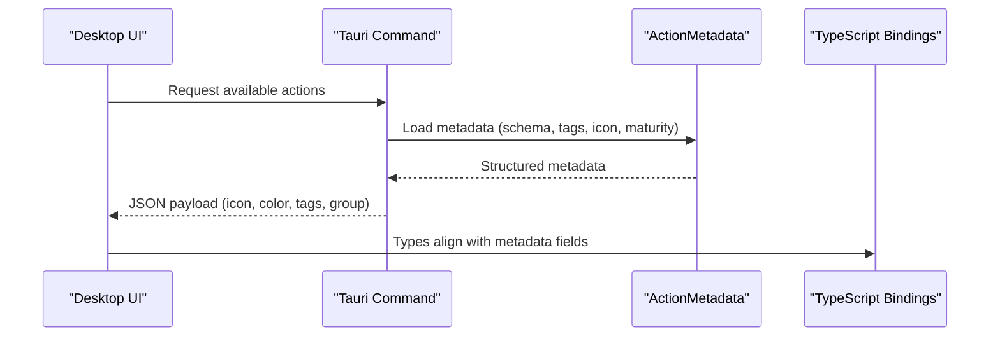
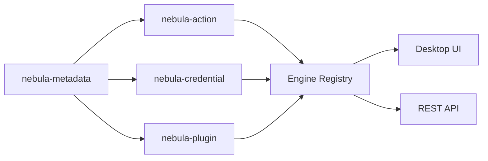

# Metadata System

<cite>
**Referenced Files in This Document**
- [lib.rs](file://crates/metadata/src/lib.rs)
- [manifest.rs](file://crates/metadata/src/manifest.rs)
- [base.rs](file://crates/metadata/src/base.rs)
- [deprecation.rs](file://crates/metadata/src/deprecation.rs)
- [maturity.rs](file://crates/metadata/src/maturity.rs)
- [icon.rs](file://crates/metadata/src/icon.rs)
- [compat.rs](file://crates/metadata/src/compat.rs)
- [plugin.rs](file://crates/plugin/src/plugin.rs)
- [manifest.rs (plugin re-export)](file://crates/plugin/src/manifest.rs)
- [metadata.rs (action)](file://crates/action/src/metadata.rs)
- [metadata.rs (credential)](file://crates/credential/src/metadata/metadata.rs)
- [2026-04-19-nebula-metadata-completion-design.md](file://docs/superpowers/specs/2026-04-19-nebula-metadata-completion-design.md)
- [workflows.rs](file://apps/desktop/src-tauri/src/commands/workflows.rs)
- [bindings.ts](file://apps/desktop/src/bindings.ts)
</cite>

## Table of Contents
1. [Introduction](#introduction)
2. [Project Structure](#project-structure)
3. [Core Components](#core-components)
4. [Architecture Overview](#architecture-overview)
5. [Detailed Component Analysis](#detailed-component-analysis)
6. [Dependency Analysis](#dependency-analysis)
7. [Performance Considerations](#performance-considerations)
8. [Troubleshooting Guide](#troubleshooting-guide)
9. [Conclusion](#conclusion)
10. [Appendices](#appendices)

## Introduction
Nebula’s Metadata System defines a shared, strongly-typed foundation for describing catalog-leaf entities (actions, credentials, resources) and plugin containers. It standardizes how components advertise identity, schema, maturity, deprecation, and branding, enabling consistent discovery, validation, and presentation across the engine, UI, and API layers. This document explains the manifest system for plugins, the shared metadata prefix for leaf entities, deprecation tracking, maturity levels, and icon management. It also covers validation, schema enforcement, compatibility checking, and the lifecycle of metadata evolution and deprecation.

## Project Structure
The metadata system is centered in the nebula-metadata crate and consumed by plugin, action, and credential subsystems. The key areas:
- Shared metadata shapes and validation rules
- Plugin manifest for container-level metadata
- Entity-specific metadata types and compatibility rules
- UI and API integration points



**Diagram sources**
- [lib.rs:10-30](file://crates/metadata/src/lib.rs#L10-L30)
- [base.rs:17-62](file://crates/metadata/src/base.rs#L17-L62)
- [compat.rs:50-84](file://crates/metadata/src/compat.rs#L50-L84)
- [deprecation.rs:6-34](file://crates/metadata/src/deprecation.rs#L6-L34)
- [icon.rs:5-30](file://crates/metadata/src/icon.rs#L5-L30)
- [maturity.rs:9-28](file://crates/metadata/src/maturity.rs#L9-L28)
- [manifest.rs:59-228](file://crates/metadata/src/manifest.rs#L59-L228)
- [plugin.rs:16-84](file://crates/plugin/src/plugin.rs#L16-L84)
- [manifest.rs (plugin re-export):1-11](file://crates/plugin/src/manifest.rs#L1-L11)
- [metadata.rs (action):86-118](file://crates/action/src/metadata.rs#L86-L118)
- [metadata.rs (credential):32-47](file://crates/credential/src/metadata/metadata.rs#L32-L47)
- [workflows.rs:196-227](file://apps/desktop/src-tauri/src/commands/workflows.rs#L196-L227)
- [bindings.ts:206-215](file://apps/desktop/src/bindings.ts#L206-L215)

**Section sources**
- [lib.rs:1-31](file://crates/metadata/src/lib.rs#L1-L31)
- [manifest.rs:1-15](file://crates/metadata/src/manifest.rs#L1-L15)

## Core Components
- BaseMetadata: The shared prefix for all catalog entities, including identity, display, schema, version, icon, documentation URL, tags, maturity, and deprecation.
- Metadata trait: A uniform interface to access BaseMetadata across entity kinds.
- DeprecationNotice: Structured payload for deprecation lifecycle with since, sunset, replacement, and reason.
- MaturityLevel: Enumerated stability levels with helpers to detect unstable or deprecated states.
- Icon: Unified icon representation that avoids invalid combinations and serializes compactly.
- BaseCompatError and validate_base_compat: Generic compatibility rules for key immutability, monotonic versioning, and schema-breaking changes requiring a major version bump.
- PluginManifest: Static descriptor for plugin bundles, including key, name, version, groups, description, icon/color, tags, author/license/homepage/repository, minimum engine version, maturity, and deprecation.

These components are designed to be reused across actions, credentials, resources, and plugins, while keeping the plugin manifest distinct as a container-level descriptor.

**Section sources**
- [base.rs:17-62](file://crates/metadata/src/base.rs#L17-L62)
- [base.rs:194-268](file://crates/metadata/src/base.rs#L194-L268)
- [deprecation.rs:6-34](file://crates/metadata/src/deprecation.rs#L6-L34)
- [maturity.rs:9-28](file://crates/metadata/src/maturity.rs#L9-L28)
- [icon.rs:5-30](file://crates/metadata/src/icon.rs#L5-L30)
- [compat.rs:13-48](file://crates/metadata/src/compat.rs#L13-L48)
- [manifest.rs:59-228](file://crates/metadata/src/manifest.rs#L59-L228)

## Architecture Overview
The metadata system underpins discovery and presentation:
- Plugins define a manifest describing the bundle identity and version.
- Actions, credentials, and resources expose metadata with a shared BaseMetadata prefix.
- Validation ensures safe evolution via compatibility checks.
- UI and API consume metadata for rendering, filtering, and discovery.



**Diagram sources**
- [plugin.rs:16-84](file://crates/plugin/src/plugin.rs#L16-L84)
- [manifest.rs:117-228](file://crates/metadata/src/manifest.rs#L117-L228)
- [workflows.rs:196-227](file://apps/desktop/src-tauri/src/commands/workflows.rs#L196-L227)

## Detailed Component Analysis

### Plugin Manifest
The PluginManifest describes a plugin bundle’s identity and metadata. It normalizes keys, supports semver versioning, and declares maturity and deprecation. It also includes bundle-level fields (author, license, homepage, repository, group, color) and a minimum engine version constraint.



**Diagram sources**
- [manifest.rs:59-228](file://crates/metadata/src/manifest.rs#L59-L228)
- [manifest.rs:230-396](file://crates/metadata/src/manifest.rs#L230-L396)

Key behaviors:
- Key normalization and validation during build.
- Default omission of common fields when unused.
- Deprecation forces maturity to Deprecated regardless of call order.
- Builder methods enable concise, fluent construction.

**Section sources**
- [manifest.rs:59-228](file://crates/metadata/src/manifest.rs#L59-L228)
- [manifest.rs:230-396](file://crates/metadata/src/manifest.rs#L230-L396)
- [manifest.rs:398-581](file://crates/metadata/src/manifest.rs#L398-L581)

### Base Metadata and Metadata Trait
BaseMetadata encapsulates the shared prefix for all catalog entities. The Metadata trait provides a uniform accessor surface, delegating to BaseMetadata for common fields. This design allows consumers to operate generically across actions, credentials, and resources.



**Diagram sources**
- [base.rs:17-62](file://crates/metadata/src/base.rs#L17-L62)
- [base.rs:194-268](file://crates/metadata/src/base.rs#L194-L268)

Entity-specific metadata types (ActionMetadata, CredentialMetadata) embed BaseMetadata with additional fields and compatibility rules.

**Section sources**
- [base.rs:17-62](file://crates/metadata/src/base.rs#L17-L62)
- [base.rs:194-268](file://crates/metadata/src/base.rs#L194-L268)

### Deprecation Notice and Maturity Levels
DeprecationNotice captures when an entity became deprecated, when it will be removed, and what replaces it. MaturityLevel enumerates stability levels with helpers to check instability or deprecation.



**Diagram sources**
- [deprecation.rs:6-34](file://crates/metadata/src/deprecation.rs#L6-L34)
- [maturity.rs:9-28](file://crates/metadata/src/maturity.rs#L9-L28)

**Section sources**
- [deprecation.rs:6-34](file://crates/metadata/src/deprecation.rs#L6-L34)
- [maturity.rs:9-28](file://crates/metadata/src/maturity.rs#L9-L28)

### Icon Management
Icon unifies inline identifiers and URL-backed assets into a single, validated representation. It serializes compactly and avoids invalid combinations.

```mermaid
classDiagram
class Icon {
<<enumeration>>
None
Inline~String~
Url~{ url : String }~
+inline(String)
+url(String)
+as_inline() -> Option~&str~
+as_url() -> Option~&str~
+is_none() bool
}
```

**Diagram sources**
- [icon.rs:5-30](file://crates/metadata/src/icon.rs#L5-L30)

**Section sources**
- [icon.rs:5-30](file://crates/metadata/src/icon.rs#L5-L30)

### Compatibility Checking and Validation
Generic compatibility rules ensure safe evolution:
- Key must remain unchanged.
- Version must be monotonic (full semver ordering).
- Breaking schema changes require a major version bump.

Entity-specific metadata types layer additional rules (e.g., action ports, credential auth pattern).



**Diagram sources**
- [compat.rs:50-84](file://crates/metadata/src/compat.rs#L50-L84)
- [metadata.rs (action):321-343](file://crates/action/src/metadata.rs#L321-L343)
- [metadata.rs (credential):223-242](file://crates/credential/src/metadata/metadata.rs#L223-L242)

**Section sources**
- [compat.rs:50-84](file://crates/metadata/src/compat.rs#L50-L84)
- [metadata.rs (action):321-343](file://crates/action/src/metadata.rs#L321-L343)
- [metadata.rs (credential):223-242](file://crates/credential/src/metadata/metadata.rs#L223-L242)

### Relationship with Plugin System
Plugins bundle actions, credentials, and resources and expose a manifest. The Plugin trait delegates key and version to the manifest, while actions/credentials/resources expose their own metadata.



**Diagram sources**
- [plugin.rs:16-84](file://crates/plugin/src/plugin.rs#L16-L84)
- [manifest.rs:117-228](file://crates/metadata/src/manifest.rs#L117-L228)

**Section sources**
- [plugin.rs:16-84](file://crates/plugin/src/plugin.rs#L16-L84)
- [manifest.rs (plugin re-export):1-11](file://crates/plugin/src/manifest.rs#L1-L11)

### UI and API Integration
The Desktop UI and API consume metadata for rendering:
- Tauri command returns plugin actions with icon, color, tags, and group for discovery.
- TypeScript bindings define types for plugin actions and workflow nodes, aligning with metadata fields.



**Diagram sources**
- [workflows.rs:196-227](file://apps/desktop/src-tauri/src/commands/workflows.rs#L196-L227)
- [bindings.ts:206-215](file://apps/desktop/src/bindings.ts#L206-L215)
- [metadata.rs (action):86-118](file://crates/action/src/metadata.rs#L86-L118)

**Section sources**
- [workflows.rs:196-227](file://apps/desktop/src-tauri/src/commands/workflows.rs#L196-L227)
- [bindings.ts:206-215](file://apps/desktop/src/bindings.ts#L206-L215)

## Dependency Analysis
The metadata system is a shared dependency across plugin, action, and credential crates. It provides:
- Common types (BaseMetadata, Icon, MaturityLevel, DeprecationNotice)
- Validation and compatibility utilities
- Plugin manifest shape and builder



**Diagram sources**
- [lib.rs:10-30](file://crates/metadata/src/lib.rs#L10-L30)
- [plugin.rs:1-15](file://crates/plugin/src/plugin.rs#L1-L15)
- [metadata.rs (action):1-8](file://crates/action/src/metadata.rs#L1-L8)
- [metadata.rs (credential):1-6](file://crates/credential/src/metadata/metadata.rs#L1-L6)

**Section sources**
- [lib.rs:10-30](file://crates/metadata/src/lib.rs#L10-L30)
- [plugin.rs:1-15](file://crates/plugin/src/plugin.rs#L1-L15)
- [metadata.rs (action):1-8](file://crates/action/src/metadata.rs#L1-L8)
- [metadata.rs (credential):1-6](file://crates/credential/src/metadata/metadata.rs#L1-L6)

## Performance Considerations
- Serialization efficiency: Icon uses untagged serialization and skip-serializing defaults to minimize payload sizes.
- Schema ownership: Metadata exposes a cheap clone of ValidSchema for consumers needing owned schema instances.
- Compatibility checks: Base compatibility validates identity, monotonic versioning, and schema changes without heavy computation.

[No sources needed since this section provides general guidance]

## Troubleshooting Guide
Common issues and resolutions:
- Invalid plugin key during manifest build: Ensure the key is normalized and valid; builder returns a specific error type for missing or invalid keys.
- Deprecation and maturity mismatch: Deprecation always forces maturity to Deprecated; if both are set, deprecation takes precedence regardless of call order.
- Breaking changes without major version bump: For actions, changing ports requires a major version bump; for credentials, changing auth pattern requires a major version bump; schema changes require a major version bump.
- Icon serialization anomalies: Use the Icon builder helpers to avoid invalid combinations; only one representation is allowed.

**Section sources**
- [manifest.rs:22-37](file://crates/metadata/src/manifest.rs#L22-L37)
- [manifest.rs:363-395](file://crates/metadata/src/manifest.rs#L363-L395)
- [metadata.rs (action):331-343](file://crates/action/src/metadata.rs#L331-L343)
- [metadata.rs (credential):229-242](file://crates/credential/src/metadata/metadata.rs#L229-L242)
- [compat.rs:50-84](file://crates/metadata/src/compat.rs#L50-L84)
- [icon.rs:5-30](file://crates/metadata/src/icon.rs#L5-L30)

## Conclusion
Nebula’s Metadata System provides a robust, shared foundation for describing plugins and catalog-leaf entities. By enforcing strong typing, consistent validation, and clear compatibility rules, it improves discoverability, safety, and user experience across the platform. The system’s separation of concerns—BaseMetadata for common fields, entity-specific metadata for specialized needs, and PluginManifest for bundles—ensures maintainability and evolvability over time.

[No sources needed since this section summarizes without analyzing specific files]

## Appendices

### Migration and Evolution Notes
- Plugin metadata evolved into PluginManifest to unify icon handling, adopt semver consistently, and add maturity and deprecation support.
- The migration plan outlines renaming, deprecation of legacy types, and updating re-export paths.

**Section sources**
- [2026-04-19-nebula-metadata-completion-design.md:275-338](file://docs/superpowers/specs/2026-04-19-nebula-metadata-completion-design.md#L275-L338)