# Schema System

<cite>
**Referenced Files in This Document**
- [lib.rs](file://crates/schema/src/lib.rs)
- [schema.rs](file://crates/schema/src/schema.rs)
- [field.rs](file://crates/schema/src/field.rs)
- [widget.rs](file://crates/schema/src/widget.rs)
- [json_schema.rs](file://crates/schema/src/json_schema.rs)
- [lint.rs](file://crates/schema/src/lint.rs)
- [loader.rs](file://crates/schema/src/loader.rs)
- [builder/mod.rs](file://crates/schema/src/builder/mod.rs)
- [builder/group.rs](file://crates/schema/src/builder/group.rs)
- [builder/list.rs](file://crates/schema/src/builder/list.rs)
- [builder/object.rs](file://crates/schema/src/builder/object.rs)
- [builder_validate.rs](file://crates/schema/examples/builder_validate.rs)
- [conditional_fields.rs](file://crates/schema/examples/conditional_fields.rs)
- [json_schema_export.rs](file://crates/schema/examples/json_schema_export.rs)
- [derive_schema.rs](file://crates/schema/tests/derive_schema.rs)
- [field_schema.rs](file://crates/schema/tests/field_schema.rs)
- [lint_and_loader.rs](file://crates/schema/tests/lint_and_loader.rs)
- [validator/lib.rs](file://crates/validator/src/lib.rs)
</cite>

## Table of Contents
1. [Introduction](#introduction)
2. [Project Structure](#project-structure)
3. [Core Components](#core-components)
4. [Architecture Overview](#architecture-overview)
5. [Detailed Component Analysis](#detailed-component-analysis)
6. [Dependency Analysis](#dependency-analysis)
7. [Performance Considerations](#performance-considerations)
8. [Troubleshooting Guide](#troubleshooting-guide)
9. [Conclusion](#conclusion)
10. [Appendices](#appendices)

## Introduction
Nebula's Schema System provides a type-safe, declarative framework for defining parameter schemas and enabling both runtime validation and UI generation. It offers:
- A rich field model covering strings, numbers, booleans, arrays, objects, secrets, modes, computed values, dynamic payloads, notices, and files.
- A builder DSL for constructing complex schemas with groups, lists, and conditional fields.
- A linting system that catches structural and cross-field inconsistencies at build time.
- JSON Schema export for interoperability with external tooling.
- A loader registry for dynamic option and record resolution.
- Tight integration with the nebula-validator crate for rule evaluation and proof-token pipelines.

This system powers action parameters, workflow inputs, and configuration schemas across the platform, ensuring correctness, usability, and maintainability.

## Project Structure
The schema system is centered in the `nebula-schema` crate with supporting modules for builders, linting, loaders, JSON export, and widget hints. The validator crate supplies the rule engine and proof-token infrastructure.

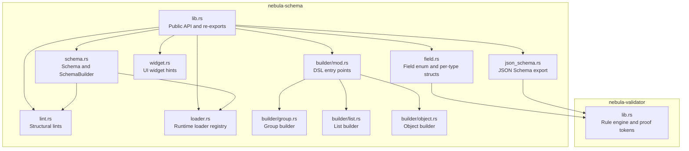

**Diagram sources**
- [lib.rs:113-156](file://crates/schema/src/lib.rs#L113-L156)
- [schema.rs:41-125](file://crates/schema/src/schema.rs#L41-L125)
- [field.rs:788-800](file://crates/schema/src/field.rs#L788-L800)
- [widget.rs:1-163](file://crates/schema/src/widget.rs#L1-L163)
- [json_schema.rs:60-75](file://crates/schema/src/json_schema.rs#L60-L75)
- [lint.rs:19-30](file://crates/schema/src/lint.rs#L19-L30)
- [loader.rs:247-344](file://crates/schema/src/loader.rs#L247-L344)
- [builder/mod.rs:1-115](file://crates/schema/src/builder/mod.rs#L1-L115)
- [builder/group.rs:16-69](file://crates/schema/src/builder/group.rs#L16-L69)
- [builder/list.rs:15-213](file://crates/schema/src/builder/list.rs#L15-L213)
- [builder/object.rs:12-130](file://crates/schema/src/builder/object.rs#L12-L130)
- [validator/lib.rs:1-95](file://crates/validator/src/lib.rs#L1-L95)

**Section sources**
- [lib.rs:1-235](file://crates/schema/src/lib.rs#L1-L235)
- [schema.rs:1-828](file://crates/schema/src/schema.rs#L1-L828)
- [field.rs:1-1362](file://crates/schema/src/field.rs#L1-L1362)
- [widget.rs:1-163](file://crates/schema/src/widget.rs#L1-L163)
- [json_schema.rs:1-663](file://crates/schema/src/json_schema.rs#L1-L663)
- [lint.rs:1-1497](file://crates/schema/src/lint.rs#L1-L1497)
- [loader.rs:1-568](file://crates/schema/src/loader.rs#L1-L568)
- [builder/mod.rs:1-115](file://crates/schema/src/builder/mod.rs#L1-L115)
- [builder/group.rs:1-185](file://crates/schema/src/builder/group.rs#L1-L185)
- [builder/list.rs:1-213](file://crates/schema/src/builder/list.rs#L1-L213)
- [builder/object.rs:1-130](file://crates/schema/src/builder/object.rs#L1-L130)
- [validator/lib.rs:1-95](file://crates/validator/src/lib.rs#L1-L95)

## Core Components
- Schema and SchemaBuilder: Define top-level field collections, attach root rules, and produce a validated schema with indexing and flags.
- Field and Field enum: A consolidated 13-variant model for all field types, including specialized builders for each variant.
- Builder DSL: Typed-closure builders for leaf fields and composite containers (objects, lists, groups).
- Linting: Structural and cross-field checks for duplicates, dangling references, contradictory rules, and loader dependencies.
- JSON Schema Export: Converts validated schemas to JSON Schema Draft 2020-12 with extended metadata.
- Loader Registry: Async resolution of dynamic select options and record payloads.
- Widget Hints: UI rendering preferences per field family.
- Validator Integration: Uses nebula-validator Rule/Predicate/Logic for runtime evaluation and proof tokens.

**Section sources**
- [schema.rs:41-125](file://crates/schema/src/schema.rs#L41-L125)
- [field.rs:788-800](file://crates/schema/src/field.rs#L788-L800)
- [builder/mod.rs:17-29](file://crates/schema/src/builder/mod.rs#L17-L29)
- [lint.rs:19-30](file://crates/schema/src/lint.rs#L19-L30)
- [json_schema.rs:60-75](file://crates/schema/src/json_schema.rs#L60-L75)
- [loader.rs:247-344](file://crates/schema/src/loader.rs#L247-L344)
- [widget.rs:1-163](file://crates/schema/src/widget.rs#L1-L163)
- [validator/lib.rs:1-95](file://crates/validator/src/lib.rs#L1-L95)

## Architecture Overview
The Schema System orchestrates schema construction, validation, and UI generation through a layered architecture:
- Construction: Builder DSL constructs Field instances and aggregates them into a Schema.
- Linting: Structural and cross-field checks prevent invalid configurations.
- Validation: Runtime evaluation against FieldValues yields ValidValues proof tokens.
- Export: Validated schemas export to JSON Schema for external tooling.
- Loaders: Dynamic options and records resolve at runtime via LoaderRegistry.

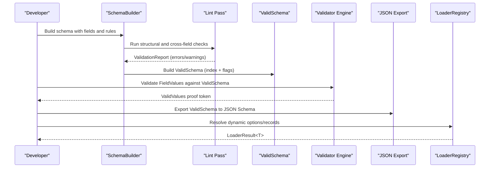

**Diagram sources**
- [schema.rs:324-363](file://crates/schema/src/schema.rs#L324-L363)
- [lint.rs:19-30](file://crates/schema/src/lint.rs#L19-L30)
- [json_schema.rs:60-75](file://crates/schema/src/json_schema.rs#L60-L75)
- [loader.rs:285-344](file://crates/schema/src/loader.rs#L285-L344)
- [validator/lib.rs:78-86](file://crates/validator/src/lib.rs#L78-L86)

## Detailed Component Analysis

### Schema Builder DSL
The DSL enables fluent construction of schemas with strong typing and composability:
- Leaf fields: string, secret, number, boolean, select, code, file.
- Composite fields: object, list, mode, computed, dynamic, notice.
- Groups: share visibility/requirement rules across multiple fields.
- Lists: define item schemas with typed-closure methods.
- Objects: nest child fields with widget and visibility controls.

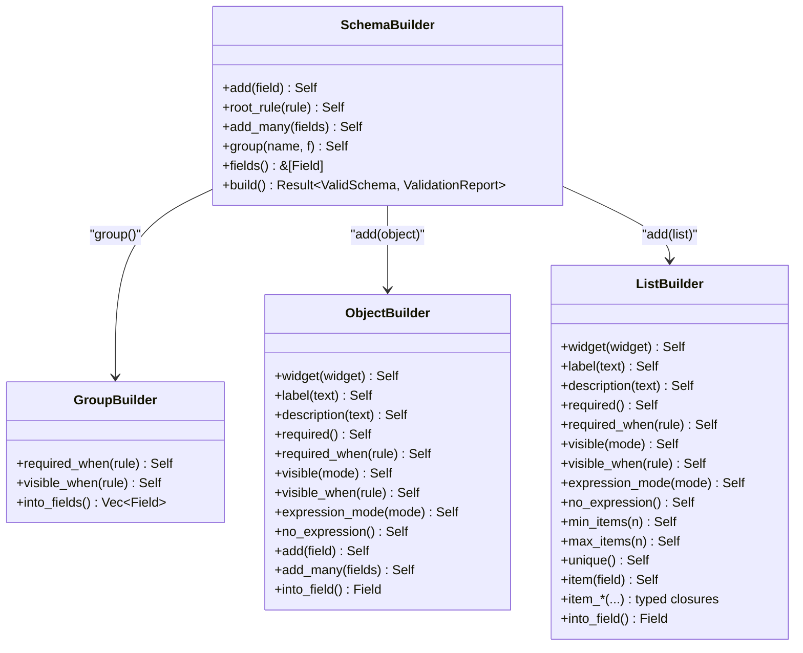

**Diagram sources**
- [builder/mod.rs:17-115](file://crates/schema/src/builder/mod.rs#L17-L115)
- [builder/group.rs:16-69](file://crates/schema/src/builder/group.rs#L16-L69)
- [builder/object.rs:12-130](file://crates/schema/src/builder/object.rs#L12-L130)
- [builder/list.rs:15-213](file://crates/schema/src/builder/list.rs#L15-L213)

**Section sources**
- [builder/mod.rs:1-115](file://crates/schema/src/builder/mod.rs#L1-L115)
- [builder/group.rs:1-185](file://crates/schema/src/builder/group.rs#L1-L185)
- [builder/object.rs:1-130](file://crates/schema/src/builder/object.rs#L1-L130)
- [builder/list.rs:1-213](file://crates/schema/src/builder/list.rs#L1-L213)

### Field Definitions and Widget System
Field variants encapsulate type-specific behavior and UI hints:
- String/Secret/Code/File: input hints, widget variants, and optional KDF for secrets.
- Number: integer mode, step increments, and numeric bounds.
- Boolean: widget variants and expression prohibition.
- Select: static/dynamic options, multi-select, searchable, custom values.
- Object/List: nested fields and item schemas.
- Mode: discriminated union with variant payloads and optional dynamic selection.
- Computed: expression-backed fields with return-type hints.
- Dynamic/Notice: runtime-only payloads and display-only notices.

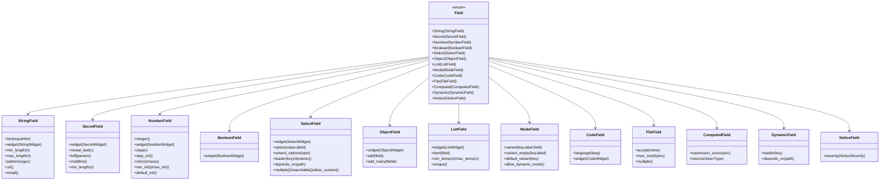

**Diagram sources**
- [field.rs:237-777](file://crates/schema/src/field.rs#L237-L777)
- [widget.rs:1-163](file://crates/schema/src/widget.rs#L1-L163)

**Section sources**
- [field.rs:1-1362](file://crates/schema/src/field.rs#L1-L1362)
- [widget.rs:1-163](file://crates/schema/src/widget.rs#L1-L163)

### Conditional Fields, Groups, and Lists
Conditional logic integrates with visibility and requirement modes:
- active_when: shorthand to set both visibility and requirement when a predicate holds.
- GroupBuilder: applies shared visibility/requirement rules to multiple fields.
- ListBuilder: defines item schemas with typed-closure helpers for common item types.

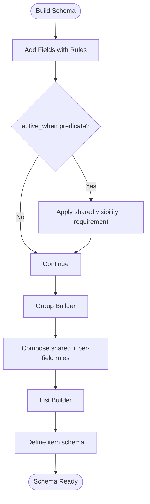

**Diagram sources**
- [builder/group.rs:78-94](file://crates/schema/src/builder/group.rs#L78-L94)
- [builder/list.rs:116-121](file://crates/schema/src/builder/list.rs#L116-L121)
- [field.rs:174-189](file://crates/schema/src/field.rs#L174-L189)

**Section sources**
- [builder/group.rs:1-185](file://crates/schema/src/builder/group.rs#L1-L185)
- [builder/list.rs:1-213](file://crates/schema/src/builder/list.rs#L1-L213)
- [field.rs:174-189](file://crates/schema/src/field.rs#L174-L189)

### Schema Compilation and Validation Pipeline
The compilation process transforms the builder into a validated schema with indexing and flags, then validates runtime values into proof tokens.

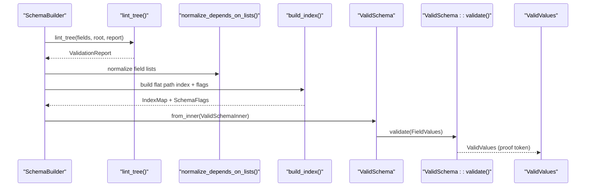

**Diagram sources**
- [schema.rs:324-363](file://crates/schema/src/schema.rs#L324-L363)
- [schema.rs:452-523](file://crates/schema/src/schema.rs#L452-L523)
- [lint.rs:19-30](file://crates/schema/src/lint.rs#L19-L30)

**Section sources**
- [schema.rs:324-363](file://crates/schema/src/schema.rs#L324-L363)
- [schema.rs:452-523](file://crates/schema/src/schema.rs#L452-L523)
- [lint.rs:19-30](file://crates/schema/src/lint.rs#L19-L30)

### JSON Schema Export Capabilities
Validated schemas export to JSON Schema Draft 2020-12 with extended metadata for Nebula-specific features:
- Field kinds, expression modes, visibility/required modes.
- File accept patterns and size limits.
- Select dynamic/multiple/allow-custom flags.
- Mode default variant and dynamic mode allowance.
- Root rules serialized as extension properties.

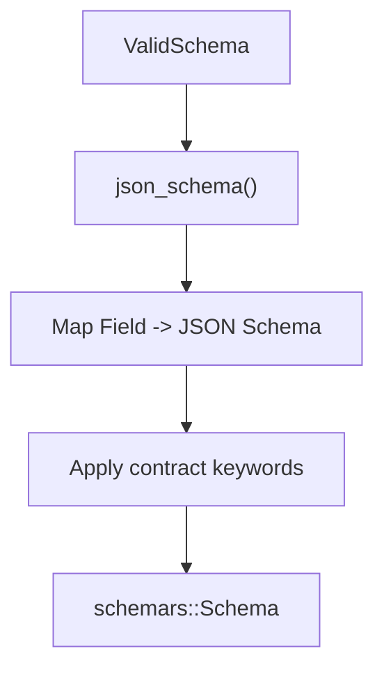

**Diagram sources**
- [json_schema.rs:60-75](file://crates/schema/src/json_schema.rs#L60-L75)
- [json_schema.rs:129-177](file://crates/schema/src/json_schema.rs#L129-L177)
- [json_schema.rs:432-506](file://crates/schema/src/json_schema.rs#L432-L506)

**Section sources**
- [json_schema.rs:1-663](file://crates/schema/src/json_schema.rs#L1-L663)

### Linting System for Schema Validation
The lint pass enforces structural soundness and detects common misconfigurations:
- Duplicate keys, dangling references, contradictory rules.
- Incompatible rule types for field families.
- Missing or inconsistent loader configurations.
- Visibility cycles, required cycles, and loader dependency cycles.
- Notice misuse and option type consistency.

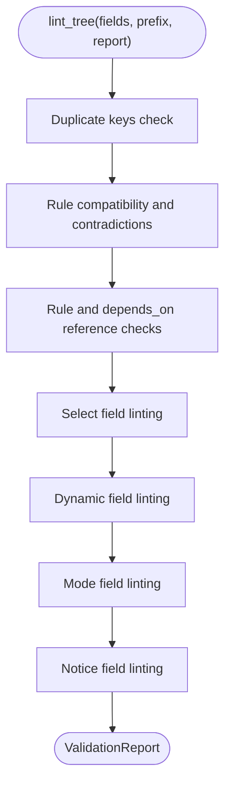

**Diagram sources**
- [lint.rs:19-30](file://crates/schema/src/lint.rs#L19-L30)
- [lint.rs:32-75](file://crates/schema/src/lint.rs#L32-L75)
- [lint.rs:192-217](file://crates/schema/src/lint.rs#L192-L217)

**Section sources**
- [lint.rs:1-1497](file://crates/schema/src/lint.rs#L1-L1497)

### Loader Mechanism for Dynamic Schema Loading
Dynamic fields defer option and record resolution to runtime via a registry:
- LoaderRegistry stores OptionLoader and RecordLoader keyed by strings.
- Schema exposes load_select_options and load_dynamic_records.
- LoaderContext carries field_key, values, filter, cursor, and metadata.
- Secrets are redacted before passing to loaders.

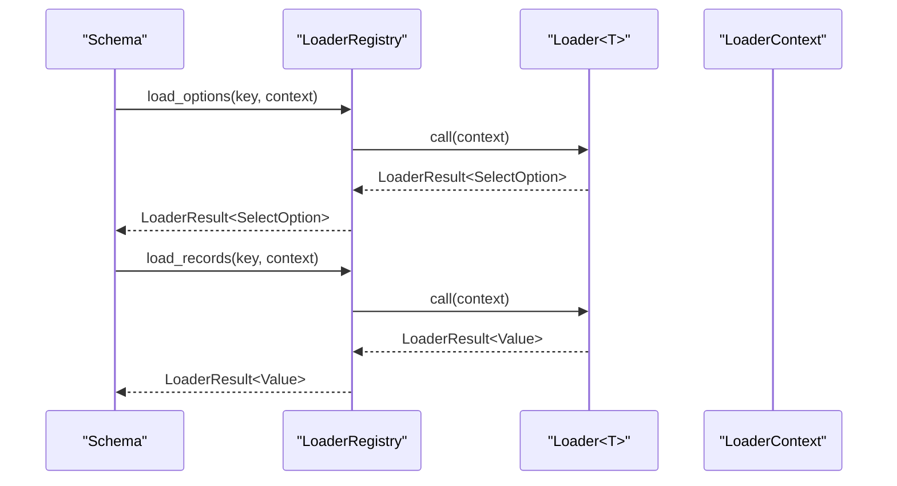

**Diagram sources**
- [schema.rs:88-125](file://crates/schema/src/schema.rs#L88-L125)
- [loader.rs:285-344](file://crates/schema/src/loader.rs#L285-L344)
- [loader.rs:97-131](file://crates/schema/src/loader.rs#L97-L131)

**Section sources**
- [schema.rs:88-125](file://crates/schema/src/schema.rs#L88-L125)
- [loader.rs:1-568](file://crates/schema/src/loader.rs#L1-L568)

### Relationship with the Validator Crate
The schema system leverages nebula-validator for:
- Rule composition (Value, Predicate, Logic, Deferred, Described).
- Execution modes controlling static-only vs deferred/full evaluation.
- Proof tokens (Validated) and structured errors.
- Expression context bridging FieldValues to rule evaluation.

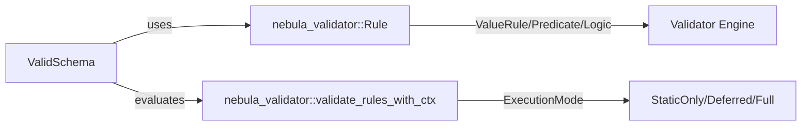

**Diagram sources**
- [schema.rs:261-274](file://crates/schema/src/schema.rs#L261-L274)
- [validator/lib.rs:78-86](file://crates/validator/src/lib.rs#L78-L86)

**Section sources**
- [schema.rs:261-274](file://crates/schema/src/schema.rs#L261-L274)
- [validator/lib.rs:1-95](file://crates/validator/src/lib.rs#L1-L95)

### Examples from the Codebase
Concrete usage patterns demonstrate the schema system in action:
- Basic builder and validation example.
- Conditional fields with active_when.
- JSON Schema export with schemars feature.
- Derive-based schema generation for structs and enums.
- Comprehensive field and schema tests.

**Section sources**
- [builder_validate.rs:1-31](file://crates/schema/examples/builder_validate.rs#L1-L31)
- [conditional_fields.rs:1-56](file://crates/schema/examples/conditional_fields.rs#L1-L56)
- [json_schema_export.rs:1-26](file://crates/schema/examples/json_schema_export.rs#L1-L26)
- [derive_schema.rs:1-247](file://crates/schema/tests/derive_schema.rs#L1-L247)
- [field_schema.rs:1-260](file://crates/schema/tests/field_schema.rs#L1-L260)
- [lint_and_loader.rs:1-674](file://crates/schema/tests/lint_and_loader.rs#L1-L674)

## Dependency Analysis
The schema system exhibits low coupling and high cohesion:
- SchemaBuilder depends on lint and loader utilities during build.
- Field enum depends on nebula-validator Rule types for constraints.
- JSON Schema export depends on schemars feature and validator rule mapping.
- LoaderRegistry isolates async resolution concerns from schema logic.

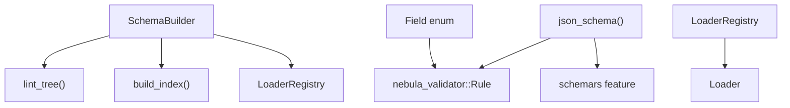

**Diagram sources**
- [schema.rs:324-363](file://crates/schema/src/schema.rs#L324-L363)
- [field.rs:7-15](file://crates/schema/src/field.rs#L7-L15)
- [json_schema.rs:6-15](file://crates/schema/src/json_schema.rs#L6-L15)
- [loader.rs:247-344](file://crates/schema/src/loader.rs#L247-L344)

**Section sources**
- [schema.rs:324-363](file://crates/schema/src/schema.rs#L324-L363)
- [field.rs:7-15](file://crates/schema/src/field.rs#L7-L15)
- [json_schema.rs:6-15](file://crates/schema/src/json_schema.rs#L6-L15)
- [loader.rs:247-344](file://crates/schema/src/loader.rs#L247-L344)

## Performance Considerations
- Index building: Flat path indexing enables O(1) lookups and tracks schema flags (depth, expression usage, async loaders).
- Deduplication: Rules and transformers are deduplicated at build time to reduce overhead.
- JSON export: Export is intentionally structural and omits runtime-only semantics to keep generated schemas concise.
- Loader redaction: Secrets are redacted before passing to loaders to avoid leaking sensitive data.

[No sources needed since this section provides general guidance]

## Troubleshooting Guide
Common issues and resolutions:
- Duplicate keys: Detected by lint; ensure unique field keys.
- Dangling references: Fix rule or depends_on paths to existing root keys.
- Contradictory rules: Adjust min/max constraints to be consistent.
- Missing loader configuration: Configure loader key or mark field non-dynamic.
- Loader dependency cycles: Break cycles in depends_on chains.
- Notice misuse: Remove required/default/rules/transformers from notice fields.
- Option type inconsistency: Ensure consistent JSON types across select options.

**Section sources**
- [lint.rs:172-190](file://crates/schema/src/lint.rs#L172-L190)
- [lint.rs:512-560](file://crates/schema/src/lint.rs#L512-L560)
- [lint.rs:627-664](file://crates/schema/src/lint.rs#L627-L664)
- [lint.rs:477-510](file://crates/schema/src/lint.rs#L477-L510)
- [lint.rs:345-375](file://crates/schema/src/lint.rs#L345-L375)
- [lint.rs:267-316](file://crates/schema/src/lint.rs#L267-L316)
- [lint_and_loader.rs:24-72](file://crates/schema/tests/lint_and_loader.rs#L24-L72)

## Conclusion
Nebula's Schema System delivers a robust, type-safe framework for defining parameter schemas with rich validation, UI hints, and dynamic loading. Its builder DSL, linting, and JSON export capabilities integrate seamlessly with the validator crate to provide both correctness and flexibility. Developers can construct complex schemas with conditional fields, groups, and lists, while relying on compile-time and runtime checks to ensure reliability.

[No sources needed since this section summarizes without analyzing specific files]

## Appendices

### Field Types and Validation Rules
- Strings: min/max length, pattern, URL/email.
- Numbers: integer mode, min/max, step increments.
- Booleans: widget variants; expressions prohibited.
- Select: static/dynamic options, multi-select, searchable, custom values.
- Objects: nested fields with widget and visibility controls.
- Lists: item schemas with min/max items and uniqueness.
- Modes: discriminated unions with variant payloads.
- Code: language and widget selection.
- Files: accept patterns, max size, multiple selection.
- Computed: expression-backed with return-type hints.
- Dynamic: runtime payload resolution.
- Notices: display-only with severity.

**Section sources**
- [field.rs:237-777](file://crates/schema/src/field.rs#L237-L777)
- [widget.rs:1-163](file://crates/schema/src/widget.rs#L1-L163)

### Builder Patterns and Examples
- Basic builder and validation: [builder_validate.rs:1-31](file://crates/schema/examples/builder_validate.rs#L1-L31)
- Conditional fields: [conditional_fields.rs:1-56](file://crates/schema/examples/conditional_fields.rs#L1-L56)
- JSON export: [json_schema_export.rs:1-26](file://crates/schema/examples/json_schema_export.rs#L1-L26)

**Section sources**
- [builder_validate.rs:1-31](file://crates/schema/examples/builder_validate.rs#L1-L31)
- [conditional_fields.rs:1-56](file://crates/schema/examples/conditional_fields.rs#L1-L56)
- [json_schema_export.rs:1-26](file://crates/schema/examples/json_schema_export.rs#L1-L26)

### Derive Macros and Integration
- #[derive(Schema)] generates field definitions from struct attributes.
- #[derive(EnumSelect)] creates select options from enum variants.
- Integration tests validate generated schemas and options.

**Section sources**
- [derive_schema.rs:1-247](file://crates/schema/tests/derive_schema.rs#L1-L247)

### Tests Demonstrating Behavior
- Field and schema roundtrips, type mismatches, transformers, and file shapes.
- Linting coverage for dangling references, contradictory rules, incompatible rules, and loader issues.
- Loader registry behavior for options and records.

**Section sources**
- [field_schema.rs:1-260](file://crates/schema/tests/field_schema.rs#L1-L260)
- [lint_and_loader.rs:1-674](file://crates/schema/tests/lint_and_loader.rs#L1-L674)