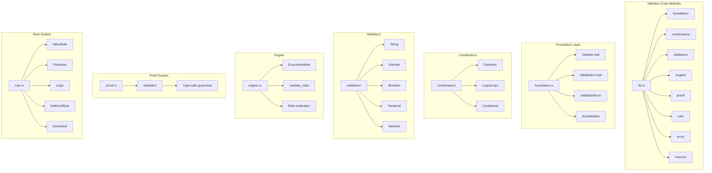
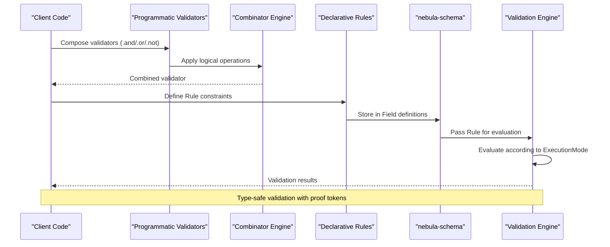
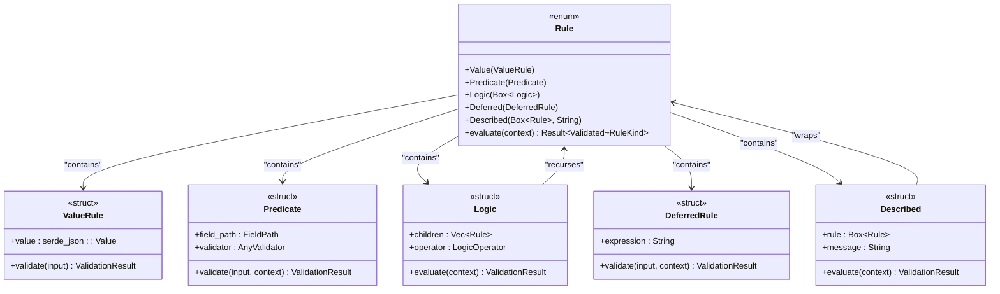
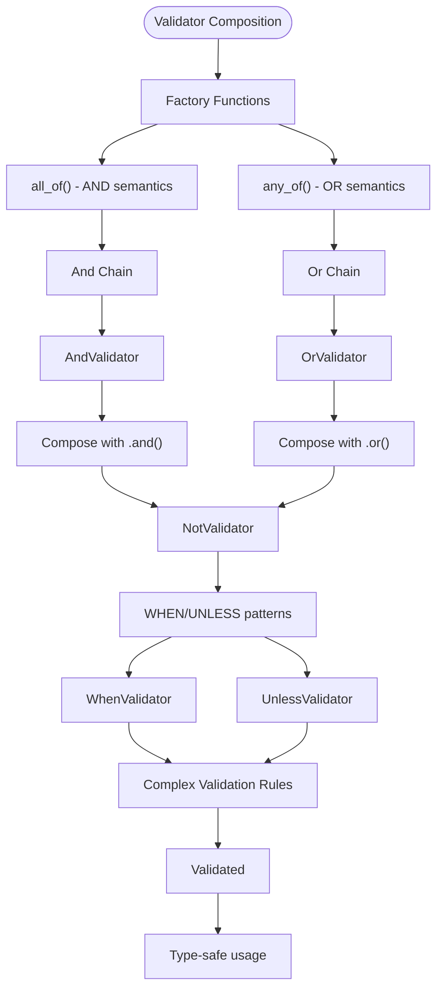
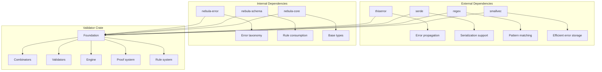

# Validator Framework

<cite>
**Referenced Files in This Document**
- [Cargo.toml](file://crates/validator/Cargo.toml)
- [lib.rs](file://crates/validator/src/lib.rs)
- [README.md](file://crates/validator/README.md)
- [CHANGELOG.md](file://CHANGELOG.md)
- [combinators/factories.rs](file://crates/validator/src/combinators/factories.rs)
- [macros.rs](file://crates/validator/src/macros.rs)
- [engine.rs](file://crates/validator/src/engine.rs)
- [error.rs](file://crates/validator/src/error.rs)
- [foundation.rs](file://crates/validator/src/foundation.rs)
- [proof.rs](file://crates/validator/src/proof.rs)
- [rule.rs](file://crates/validator/src/rule.rs)
- [validators/string.rs](file://crates/validator/src/validators/string.rs)
- [validators/number.rs](file://crates/validator/src/validators/number.rs)
- [validators/boolean.rs](file://crates/validator/src/validators/boolean.rs)
- [validators/datetime.rs](file://crates/validator/src/validators/datetime.rs)
- [validators/network.rs](file://crates/validator/src/validators/network.rs)
- [validator_derive.rs](file://examples/validator_derive.rs)
- [validator_macro.rs](file://examples/validator_macro.rs)
- [schema README.md](file://crates/schema/README.md)
- [schema lib.rs](file://crates/schema/src/lib.rs)
- [schema field.rs](file://crates/schema/src/field.rs)
- [schema validated.rs](file://crates/schema/src/validated.rs)
- [schema json_schema.rs](file://crates/schema/src/json_schema.rs)
- [schema error.rs](file://crates/schema/src/error.rs)
</cite>

## Table of Contents
1. [Introduction](#introduction)
2. [Project Structure](#project-structure)
3. [Core Components](#core-components)
4. [Architecture Overview](#architecture-overview)
5. [Detailed Component Analysis](#detailed-component-analysis)
6. [Dependency Analysis](#dependency-analysis)
7. [Performance Considerations](#performance-considerations)
8. [Troubleshooting Guide](#troubleshooting-guide)
9. [Conclusion](#conclusion)
10. [Appendices](#appendices)

## Introduction
Nebula's Validator Framework is a comprehensive validation system designed for the Nebula workflow engine. It provides a dual-mode validation surface: composable programmatic validators via the Validate trait and JSON-serializable Rule enum for declarative schema-field constraints. The framework emphasizes type safety, composability, and integration with Nebula's broader type system, particularly through proof tokens that encode validation guarantees directly in Rust's type system.

The framework serves as the validation rules engine that integrates with nebula-schema for field-level constraints and supports both static schema linting and runtime value validation during workflow execution.

## Project Structure
The validator crate follows a modular architecture with clear separation of concerns:



**Diagram sources**
- [lib.rs:57-73](file://crates/validator/src/lib.rs#L57-L73)
- [foundation.rs](file://crates/validator/src/foundation.rs)
- [combinators/factories.rs](file://crates/validator/src/combinators/factories.rs)
- [engine.rs](file://crates/validator/src/engine.rs)
- [proof.rs](file://crates/validator/src/proof.rs)
- [rule.rs](file://crates/validator/src/rule.rs)

**Section sources**
- [lib.rs:17-46](file://crates/validator/src/lib.rs#L17-L46)
- [Cargo.toml:14-25](file://crates/validator/Cargo.toml#L14-L25)

## Core Components
The validator framework centers around several foundational types that work together to provide type-safe, composable validation:

### Foundation Types
The core foundation types establish the type system for validation:

- **Validate Trait**: The primary trait that all validators implement, providing the validate method and associated types
- **ValidateExt Trait**: Extension methods for validator composition including and(), or(), and not()
- **ValidationError**: Structured error type with RFC 6901 field paths and Cow-based message storage
- **AnyValidator**: Type-erased validator for dynamic dispatch scenarios
- **Validated<T>**: Proof-token wrapper that certifies a value has passed validation

### Rule System
The declarative rule system provides JSON-serializable validation constraints:

- **Rule Enum**: Typed sum-of-sums representing Value, Predicate, Logic, Deferred, and Described variants
- **FieldPath**: RFC 6901 JSON-pointer with construction-time validation replacing raw string paths
- **PredicateContext**: Context map for predicate evaluation with sibling field lookups
- **ExecutionMode**: Controls which rule categories execute (StaticOnly, Deferred, Full)

### Error Handling
The framework implements a sophisticated error handling system:

- **Structured Errors**: ValidationError with up to 80 bytes of storage using Cow for efficient memory usage
- **Error Codes**: Stable across minor releases with registry maintained in tests
- **Cross-kind Safety**: Compile-time enforcement preventing misuse of rule variants

**Section sources**
- [lib.rs:17-46](file://crates/validator/src/lib.rs#L17-L46)
- [foundation.rs](file://crates/validator/src/foundation.rs)
- [rule.rs](file://crates/validator/src/rule.rs)
- [error.rs](file://crates/validator/src/error.rs)

## Architecture Overview
The validator framework implements a layered architecture that separates concerns between programmatic validation and declarative rule evaluation:



**Diagram sources**
- [lib.rs:79-86](file://crates/validator/src/lib.rs#L79-L86)
- [engine.rs](file://crates/validator/src/engine.rs)
- [schema field.rs](file://crates/schema/src/field.rs)

The architecture ensures that validation occurs at both compile-time (through type system guarantees) and runtime (through rule evaluation), providing comprehensive coverage for the workflow engine's needs.

## Detailed Component Analysis

### Rule Engine Architecture
The rule engine provides a typed sum-of-sums approach to validation rules, replacing the previous flat enum with a more structured representation:



**Diagram sources**
- [rule.rs](file://crates/validator/src/rule.rs)

The rule engine supports three execution modes controlled by ExecutionMode:
- **StaticOnly**: Only statically analyzable rules execute
- **Deferred**: Deferred rules execute based on runtime conditions  
- **Full**: All rules execute regardless of type

**Section sources**
- [rule.rs](file://crates/validator/src/rule.rs)
- [engine.rs](file://crates/validator/src/engine.rs)

### Combinator Patterns
The combinator library provides powerful composition patterns for building complex validation rules:



**Diagram sources**
- [combinators/factories.rs:1-30](file://crates/validator/src/combinators/factories.rs#L1-L30)

The combinator library implements several key patterns:

- **AND Pattern**: all_of() combines multiple validators where all must succeed
- **OR Pattern**: any_of() combines multiple validators where at least one must succeed  
- **NOT Pattern**: negates a validator's result
- **WHEN Pattern**: conditionally applies a validator based on a predicate
- **UNLESS Pattern**: applies a validator unless a condition is met

**Section sources**
- [combinators/factories.rs:1-30](file://crates/validator/src/combinators/factories.rs#L1-L30)

### Built-in Validators
The framework provides comprehensive built-in validators for common data types:

#### String Validators
String validation covers essential text validation scenarios:
- **MinLength**: Ensures minimum character count
- **MaxLength**: Enforces maximum character limit  
- **NotEmpty**: Prevents empty strings
- **Contains**: Validates substring presence
- **Alphanumeric**: Restricts to alphanumeric characters
- **Pattern**: Supports regex-based validation

#### Number Validators
Numeric validation includes range and constraint checking:
- **Min**: Minimum value enforcement
- **Max**: Maximum value limitation
- **InRange**: Range boundary validation
- **Integer**: Integer-only validation
- **Positive/Negative**: Sign-based constraints

#### Boolean Validators
Boolean validation is straightforward but essential:
- **IsTrue**: Requires boolean true
- **IsFalse**: Requires boolean false

#### Temporal Validators
Temporal validation supports date and time scenarios:
- **DateTime**: ISO 8601 date-time validation
- **Date**: Date-only validation
- **Time**: Time-only validation
- **Uuid**: UUID format validation

#### Network Validators
Network-related validation includes address and hostname checks:
- **Ipv4**: IPv4 address validation
- **Ipv6**: IPv6 address validation
- **IpAddr**: Generic IP address validation
- **Hostname**: Hostname format validation
- **Email**: Email address validation

**Section sources**
- [validators/string.rs](file://crates/validator/src/validators/string.rs)
- [validators/number.rs](file://crates/validator/src/validators/number.rs)
- [validators/boolean.rs](file://crates/validator/src/validators/boolean.rs)
- [validators/datetime.rs](file://crates/validator/src/validators/datetime.rs)
- [validators/network.rs](file://crates/validator/src/validators/network.rs)

### Macro System for Validator Derivation
The macro system provides convenient ways to create custom validators:

#### validator! Macro
The primary macro creates complete validators with minimal boilerplate:
- Struct definition with fields
- Validate trait implementation
- Factory function generation
- Error handling integration

#### compose! Macro  
Creates AND-chained validator compositions:
- Takes multiple validator instances
- Generates combined validator logic
- Maintains type safety

#### any_of! Macro
Creates OR-chained validator compositions:
- Alternative validator selection
- Short-circuit evaluation
- Comprehensive error reporting

**Section sources**
- [macros.rs:1-31](file://crates/validator/src/macros.rs#L1-L31)

### JSON Validation Capabilities
The framework supports JSON serialization of validation rules for persistence and transport:

```mermaid
flowchart LR
RuleDef["Rule Definition"] --> Serialize["Serialize to JSON"]
Serialize --> Storage["Store in Schema"]
Storage --> Transport["Transport to Engine"]
Transport --> Deserialize["Deserialize in Engine"]
Deserialize --> Evaluate["Evaluate Rules"]
subgraph "JSON Structure"
A["externally-tagged"] --> B["Value: {\"value\": any}" ]
A --> C["Predicate: {\"field\": string, \"validator\": any}"]
A --> D["Logic: {\"op\": string, \"rules\": [Rule]}"]
A --> E["Deferred: {\"expr\": string}"]
A --> F["Described: {\"rule\": Rule, \"message\": string}"]
end
```

**Diagram sources**
- [rule.rs](file://crates/validator/src/rule.rs)

The JSON format uses externally-tagged encoding for compact representation, reducing rule storage by approximately 60% compared to the previous flat variant.

**Section sources**
- [rule.rs](file://crates/validator/src/rule.rs)

## Dependency Analysis
The validator framework integrates closely with other Nebula crates while maintaining clear boundaries:



**Diagram sources**
- [Cargo.toml:26-42](file://crates/validator/Cargo.toml#L26-L42)

The framework maintains loose coupling through well-defined interfaces while providing tight integration with the schema system for rule evaluation.

**Section sources**
- [Cargo.toml:26-42](file://crates/validator/Cargo.toml#L26-L42)
- [schema README.md:1-50](file://crates/schema/README.md#L1-L50)

## Performance Considerations
The validator framework implements several performance optimizations:

### Memory Efficiency
- **SmallVec for errors**: Uses smallvec to avoid heap allocation for common error cases
- **Cow-based messages**: Efficient string storage using Copy-on-Write semantics
- **Proof tokens**: Eliminate redundant validation through type system guarantees

### Evaluation Strategies
- **Short-circuit evaluation**: OR chains stop at first success, AND chains stop at first failure
- **Lazy evaluation**: Deferred rules only evaluate when conditions are met
- **Batch processing**: validate_rules processes multiple rules efficiently

### Type System Benefits
- **Zero-cost abstractions**: Proof tokens provide guarantees without runtime overhead
- **Compile-time checks**: Combinator composition prevents invalid rule combinations
- **Optimized trait objects**: AnyValidator minimizes dynamic dispatch costs

## Troubleshooting Guide
Common validation issues and their solutions:

### Error Message Interpretation
- **ValidationError structure**: Understand the error code, field path, and parameters
- **Cross-kind safety violations**: Fix rule variant misuse at compile time
- **Execution mode issues**: Verify appropriate ExecutionMode for rule evaluation

### Debugging Validation Failures
- **Enable detailed logging**: Use nebula-log crate for validation event tracing
- **Rule inspection**: Examine serialized rule format for debugging
- **Context debugging**: Verify RuleContext contents for predicate evaluation

### Performance Issues
- **Rule complexity**: Simplify deeply nested combinator chains
- **Regex patterns**: Optimize expensive regular expressions
- **Deferred rule evaluation**: Monitor deferred rule execution frequency

**Section sources**
- [error.rs](file://crates/validator/src/error.rs)
- [engine.rs](file://crates/validator/src/engine.rs)

## Conclusion
Nebula's Validator Framework provides a robust, type-safe validation system that bridges programmatic and declarative validation approaches. Its modular architecture, comprehensive built-in validators, and sophisticated error handling make it suitable for complex workflow validation scenarios while maintaining excellent performance characteristics.

The framework's integration with nebula-schema ensures seamless validation of configuration data, while the proof token system provides compile-time guarantees that reduce runtime validation overhead. The JSON-serializable rule format enables persistence and transport of validation constraints across system boundaries.

## Appendices

### Quick Reference Examples
The examples directory demonstrates practical usage patterns:

- **Custom validator derivation**: Using #[derive(Validator)] for struct-level validation
- **Macro-based validators**: Creating custom validators with validator! macro
- **Rule composition**: Building complex validation logic with combinators

### Migration Notes
Recent changes include:
- Rule type refactor to typed sum-of-sums
- External tagging for compact JSON representation
- Enhanced error code stability across minor releases

**Section sources**
- [validator_derive.rs](file://examples/validator_derive.rs)
- [validator_macro.rs](file://examples/validator_macro.rs)
- [CHANGELOG.md:74-95](file://CHANGELOG.md#L74-L95)