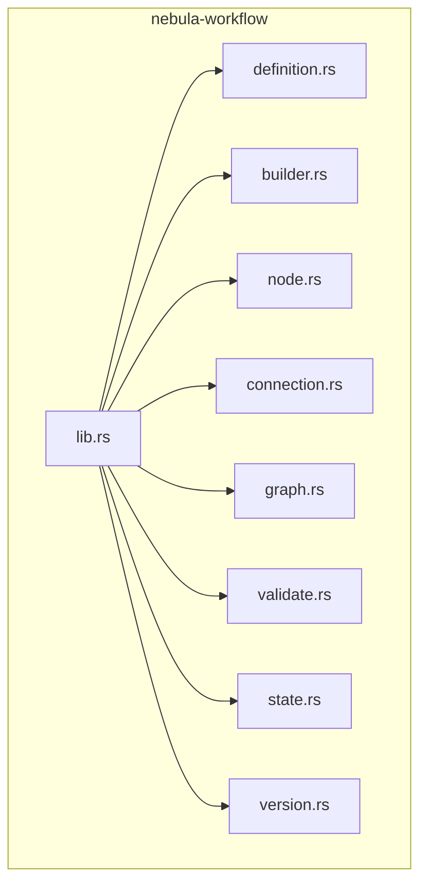
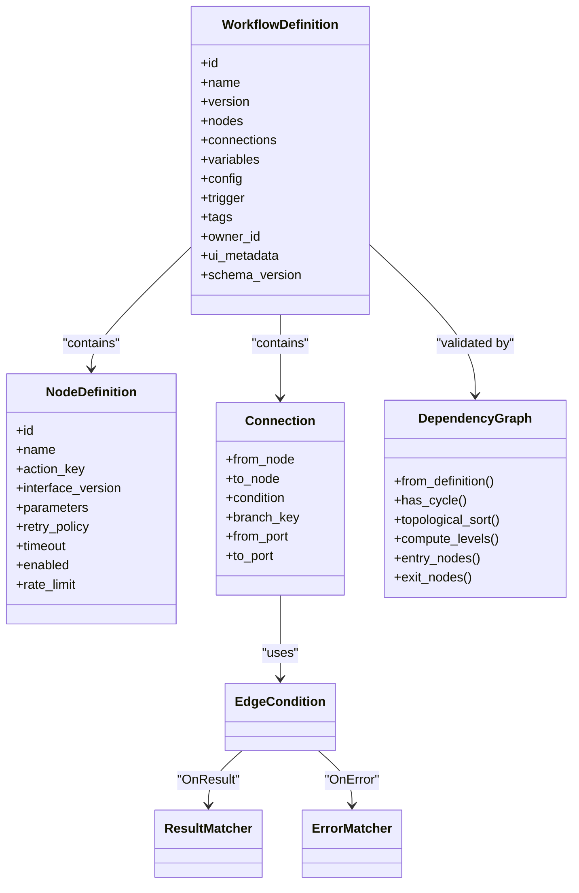
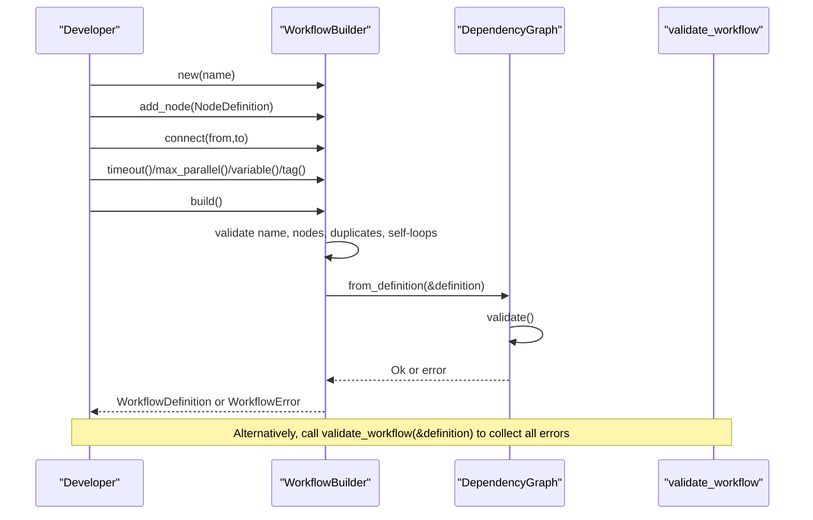
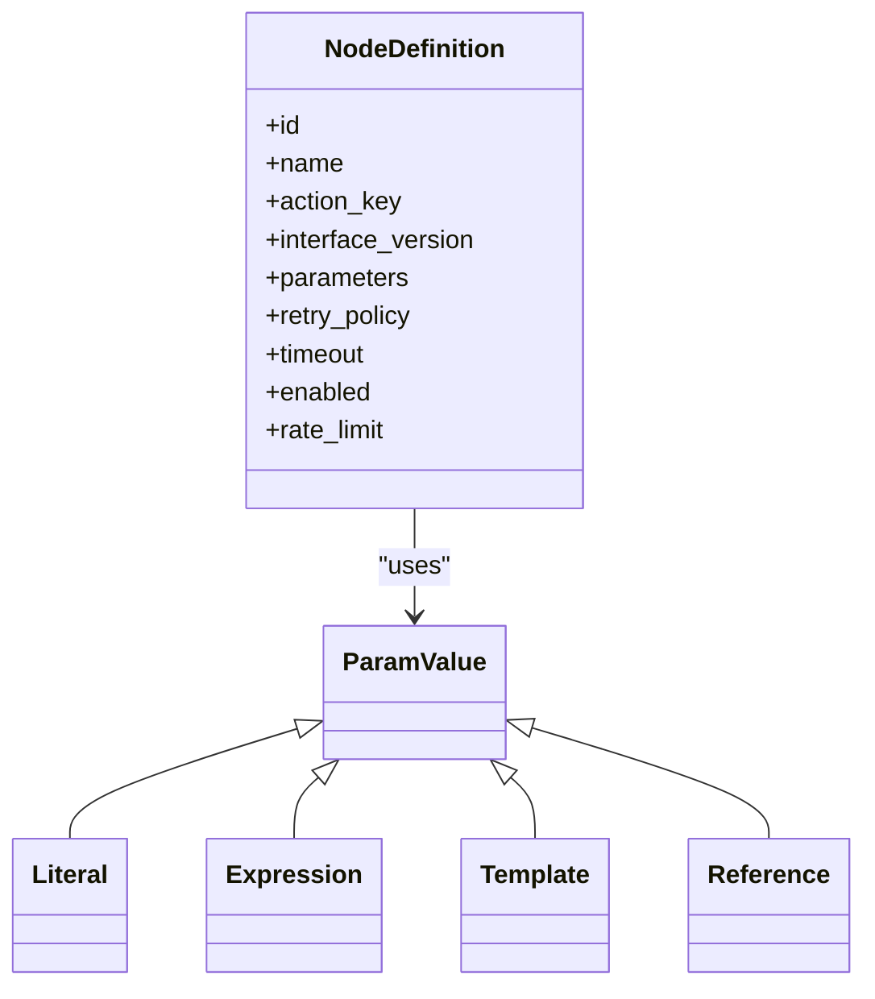
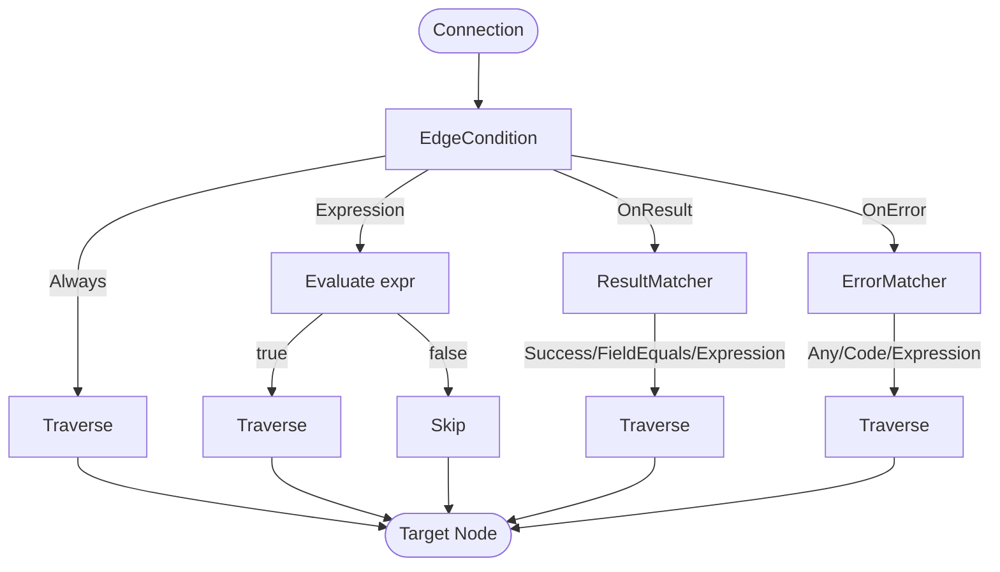
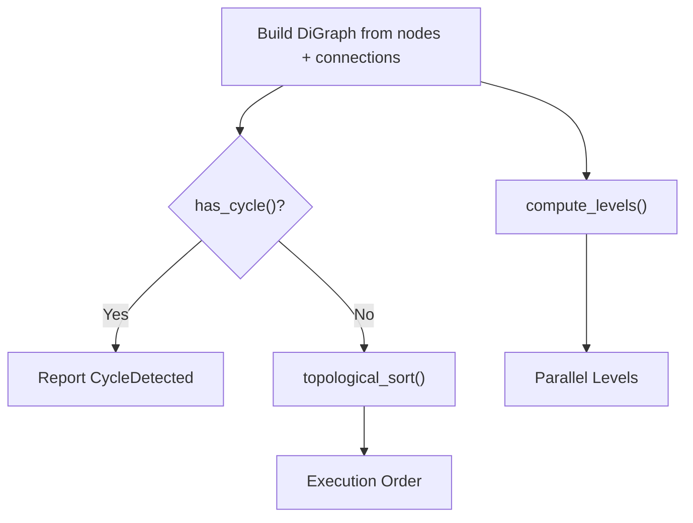
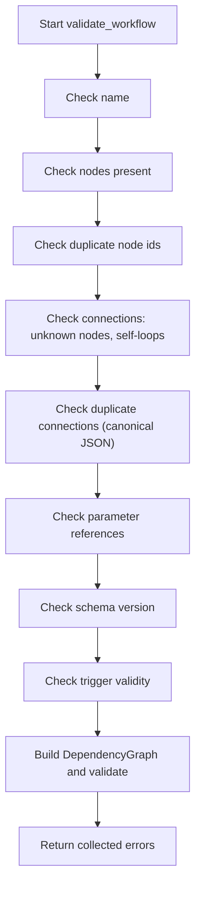
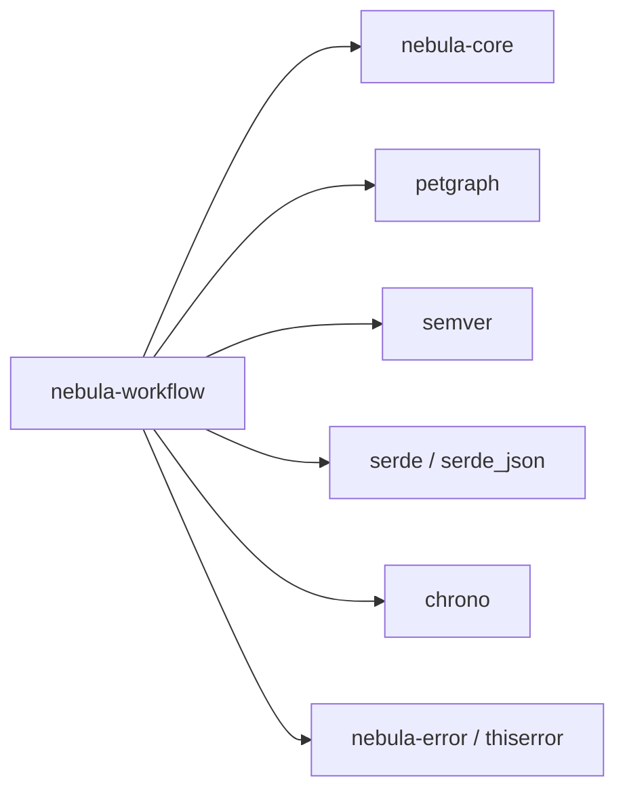

# Workflow Definition

<cite>
**Referenced Files in This Document**
- [lib.rs](file://crates/workflow/src/lib.rs)
- [definition.rs](file://crates/workflow/src/definition.rs)
- [builder.rs](file://crates/workflow/src/builder.rs)
- [node.rs](file://crates/workflow/src/node.rs)
- [connection.rs](file://crates/workflow/src/connection.rs)
- [graph.rs](file://crates/workflow/src/graph.rs)
- [validate.rs](file://crates/workflow/src/validate.rs)
- [state.rs](file://crates/workflow/src/state.rs)
- [version.rs](file://crates/workflow/src/version.rs)
- [Cargo.toml](file://crates/workflow/Cargo.toml)
- [complex.yaml](file://apps/cli/examples/complex.yaml)
</cite>

## Table of Contents
1. [Introduction](#introduction)
2. [Project Structure](#project-structure)
3. [Core Components](#core-components)
4. [Architecture Overview](#architecture-overview)
5. [Detailed Component Analysis](#detailed-component-analysis)
6. [Dependency Analysis](#dependency-analysis)
7. [Performance Considerations](#performance-considerations)
8. [Troubleshooting Guide](#troubleshooting-guide)
9. [Conclusion](#conclusion)
10. [Appendices](#appendices)

## Introduction
This document explains Nebula’s DAG-based workflow modeling system. It covers how workflows are structured as directed acyclic graphs (DAGs) of nodes and connections, how to construct them programmatically using a fluent builder, and how validation ensures correctness. It also documents node types (triggers, actions, control nodes), the connection system for data routing, graph algorithms for dependency resolution and execution ordering, and the integration with the execution engine. Finally, it addresses versioning, schema evolution, and backward compatibility.

## Project Structure
The workflow crate defines the core types and algorithms for DAG-based workflow modeling:
- Definition types for workflows, nodes, connections, configuration, and UI metadata
- A fluent builder for constructing and validating workflows
- Graph algorithms over a dependency graph built on petgraph
- A comprehensive validator that collects multiple errors
- Execution state tracking for nodes
- Versioning support for workflow definitions

**Diagram sources**
- [lib.rs:1-54](file://crates/workflow/src/lib.rs#L1-L54)
- [definition.rs:1-465](file://crates/workflow/src/definition.rs#L1-L465)
- [builder.rs:1-379](file://crates/workflow/src/builder.rs#L1-L379)
- [node.rs:1-375](file://crates/workflow/src/node.rs#L1-L375)
- [connection.rs:1-304](file://crates/workflow/src/connection.rs#L1-L304)
- [graph.rs:1-484](file://crates/workflow/src/graph.rs#L1-L484)
- [validate.rs:1-401](file://crates/workflow/src/validate.rs#L1-L401)
- [state.rs:1-178](file://crates/workflow/src/state.rs#L1-L178)
- [version.rs:1-141](file://crates/workflow/src/version.rs#L1-L141)

**Section sources**
- [lib.rs:1-54](file://crates/workflow/src/lib.rs#L1-L54)
- [Cargo.toml:1-34](file://crates/workflow/Cargo.toml#L1-L34)

## Core Components
- WorkflowDefinition: Top-level container holding nodes, connections, variables, config, trigger, tags, timestamps, owner_id, UI metadata, and schema version.
- NodeDefinition: A single action step with id, name, action_key, optional interface_version, parameters, node-level retry_policy, timeout, description, enabled flag, and optional rate_limit.
- ParamValue: Typed parameter values supporting literals, expressions, templates, and references to other nodes’ outputs.
- Connection: Directed edge with optional condition, branch_key, and explicit port mapping for multi-output/multi-input actions.
- EdgeCondition and matchers: Always, Expression, OnResult, OnError with ResultMatcher and ErrorMatcher variants.
- DependencyGraph: A wrapper around petgraph DiGraph enabling cycle detection, topological sort, and level-wise parallelism computation.
- WorkflowBuilder: Fluent builder that aggregates nodes and connections, sets metadata, and validates the resulting workflow.
- validate_workflow: Multi-error validator that checks name, node count, duplicates, unknown nodes, self-loops, duplicate connections, parameter references, schema version, trigger validity, and graph structure.
- NodeState: Enumerates node execution states (pending, ready, running, completed, failed, skipped, retrying, cancelled) and helper predicates.
- Version: Semantic versioning for workflow definitions with pre-release and build metadata.

**Section sources**
- [definition.rs:14-265](file://crates/workflow/src/definition.rs#L14-L265)
- [node.rs:11-148](file://crates/workflow/src/node.rs#L11-L148)
- [node.rs:150-208](file://crates/workflow/src/node.rs#L150-L208)
- [connection.rs:6-82](file://crates/workflow/src/connection.rs#L6-L82)
- [connection.rs:84-147](file://crates/workflow/src/connection.rs#L84-L147)
- [graph.rs:13-224](file://crates/workflow/src/graph.rs#L13-L224)
- [builder.rs:17-222](file://crates/workflow/src/builder.rs#L17-L222)
- [validate.rs:12-123](file://crates/workflow/src/validate.rs#L12-L123)
- [state.rs:6-55](file://crates/workflow/src/state.rs#L6-L55)
- [version.rs:5-70](file://crates/workflow/src/version.rs#L5-L70)

## Architecture Overview
The workflow system centers on a DAG abstraction:
- WorkflowDefinition composes NodeDefinition instances and Connection edges.
- DependencyGraph transforms the definition into a petgraph DiGraph for structural analysis.
- validate_workflow and WorkflowBuilder enforce correctness and integrity.
- Execution engines consume the graph to schedule and run nodes in parallel levels determined by predecessors.

**Diagram sources**
- [definition.rs:14-265](file://crates/workflow/src/definition.rs#L14-L265)
- [node.rs:11-148](file://crates/workflow/src/node.rs#L11-L148)
- [connection.rs:6-147](file://crates/workflow/src/connection.rs#L6-L147)
- [graph.rs:13-224](file://crates/workflow/src/graph.rs#L13-L224)

## Detailed Component Analysis

### Workflow Definition and Builder Pattern
- WorkflowDefinition encapsulates the entire workflow: nodes, connections, runtime config, trigger, variables, tags, ownership, UI metadata, and schema version.
- WorkflowBuilder provides a fluent API to add nodes, connect them, set variables, tags, timeouts, parallelism, owner_id, and UI metadata, then performs validation and produces a WorkflowDefinition.
- Validation performed by the builder includes: non-empty name, at least one node, unique node ids, no self-loops, and a valid DAG via DependencyGraph.

**Diagram sources**
- [builder.rs:170-222](file://crates/workflow/src/builder.rs#L170-L222)
- [graph.rs:20-54](file://crates/workflow/src/graph.rs#L20-L54)
- [validate.rs:12-123](file://crates/workflow/src/validate.rs#L12-L123)

**Section sources**
- [definition.rs:14-265](file://crates/workflow/src/definition.rs#L14-L265)
- [builder.rs:17-222](file://crates/workflow/src/builder.rs#L17-L222)
- [validate.rs:12-123](file://crates/workflow/src/validate.rs#L12-L123)

### Node Types and Parameters
- NodeDefinition supports:
  - action_key to select the action/plugin
  - interface_version pinning
  - parameters as a map of ParamValue variants
  - node-level retry_policy and timeout
  - enabled flag to disable nodes
  - optional rate_limit to throttle action invocation
- ParamValue supports:
  - Literal: static JSON value
  - Expression: runtime expression string
  - Template: string with interpolation placeholders
  - Reference: pointer to another node’s output via node_key and JSONPath-like output_path

**Diagram sources**
- [node.rs:11-148](file://crates/workflow/src/node.rs#L11-L148)
- [node.rs:150-208](file://crates/workflow/src/node.rs#L150-L208)

**Section sources**
- [node.rs:11-148](file://crates/workflow/src/node.rs#L11-L148)
- [node.rs:150-208](file://crates/workflow/src/node.rs#L150-L208)

### Connections and Conditional Routing
- Connection links nodes with optional:
  - EdgeCondition: Always, Expression, OnResult, OnError
  - branch_key for labeled branches (e.g., “true”/“false”)
  - from_port and to_port for multi-port actions
- EdgeCondition matchers:
  - ResultMatcher: Success, FieldEquals, Expression
  - ErrorMatcher: Any, Code, Expression

**Diagram sources**
- [connection.rs:6-147](file://crates/workflow/src/connection.rs#L6-L147)

**Section sources**
- [connection.rs:6-147](file://crates/workflow/src/connection.rs#L6-L147)

### Graph Algorithms and Execution Ordering
- DependencyGraph builds a petgraph DiGraph from WorkflowDefinition and enforces structural constraints:
  - No unknown nodes in connections
  - No self-loops
  - No cycles (via is_cyclic_directed)
  - At least one entry node (no incoming edges)
- Algorithms:
  - has_cycle: constant-time check using petgraph
  - topological_sort: returns a valid execution order or reports CycleDetected
  - compute_levels: Kahn’s algorithm partitions nodes into parallel levels based on in-degree; each level can execute concurrently
  - entry_nodes and exit_nodes: identify start/end points
  - incoming/outgoing connections and predecessors/successors: neighborhood queries

**Diagram sources**
- [graph.rs:20-120](file://crates/workflow/src/graph.rs#L20-L120)

**Section sources**
- [graph.rs:20-120](file://crates/workflow/src/graph.rs#L20-L120)

### Validation System
- validate_workflow collects multiple errors:
  - Empty name, no nodes, duplicate node ids, unknown nodes, self-loops, duplicate connections
  - Invalid parameter references (references to missing nodes)
  - Unsupported schema version
  - Invalid trigger configuration (cron empty, webhook path not starting with ‘/’)
  - Graph-level issues: cycles, no entry nodes
- WorkflowBuilder also performs a subset of these checks during build.

**Diagram sources**
- [validate.rs:12-123](file://crates/workflow/src/validate.rs#L12-L123)

**Section sources**
- [validate.rs:12-123](file://crates/workflow/src/validate.rs#L12-L123)
- [builder.rs:170-222](file://crates/workflow/src/builder.rs#L170-L222)

### Execution State Tracking
- NodeState enumerates lifecycle states and provides helper predicates:
  - is_terminal, is_active, is_success, is_failure
- These states guide scheduling and error handling decisions in the execution engine.

**Section sources**
- [state.rs:6-55](file://crates/workflow/src/state.rs#L6-L55)

### Versioning, Schema Evolution, and Backward Compatibility
- WorkflowDefinition includes schema_version and semantic Version for workflow definitions.
- CURRENT_SCHEMA_VERSION governs support; unsupported versions produce UnsupportedSchema errors.
- Tests demonstrate default schema_version and future-version rejection.

**Section sources**
- [definition.rs:11-12](file://crates/workflow/src/definition.rs#L11-L12)
- [definition.rs:56-66](file://crates/workflow/src/definition.rs#L56-L66)
- [version.rs:5-70](file://crates/workflow/src/version.rs#L5-L70)
- [definition.rs:364-401](file://crates/workflow/src/definition.rs#L364-L401)

### Integration with the Execution Engine
- The execution engine consumes the DAG to:
  - Schedule nodes in topological order
  - Run nodes in parallel levels computed by compute_levels
  - Respect node-level and workflow-level configurations (timeouts, retries, parallelism)
  - Apply error_strategy (FailFast, ContinueOnError, IgnoreErrors)
- Node outputs and references feed downstream nodes via ParamValue::Reference.

**Section sources**
- [definition.rs:109-143](file://crates/workflow/src/definition.rs#L109-L143)
- [graph.rs:75-120](file://crates/workflow/src/graph.rs#L75-L120)
- [node.rs:30-46](file://crates/workflow/src/node.rs#L30-L46)

### Relationship with the Expression Engine and Parameter Validation
- ParamValue::Expression embeds runtime expressions; the expression engine evaluates them against workflow data.
- ParamValue::Reference enables dynamic wiring of outputs across nodes using JSONPath-like output_path.
- Validation ensures references point to existing nodes.

**Section sources**
- [node.rs:150-208](file://crates/workflow/src/node.rs#L150-L208)
- [validate.rs:70-82](file://crates/workflow/src/validate.rs#L70-L82)

### Practical Examples
- The CLI example complex.yaml demonstrates:
  - Diamond fork/join pattern with parallel branches
  - Multiple action types (echo, delay, log)
  - Error routing via on_error condition
  - Workflow-level error_strategy set to continue_on_error

**Section sources**
- [complex.yaml:1-90](file://apps/cli/examples/complex.yaml#L1-L90)

## Dependency Analysis
The workflow crate depends on:
- nebula-core for NodeKey, WorkflowId, and shared types
- petgraph for graph algorithms
- semver for semantic versioning
- serde/serde_json for serialization/deserialization
- chrono for timestamps
- thiserror and nebula-error for error handling

**Diagram sources**
- [Cargo.toml:14-22](file://crates/workflow/Cargo.toml#L14-L22)

**Section sources**
- [Cargo.toml:14-22](file://crates/workflow/Cargo.toml#L14-L22)

## Performance Considerations
- Graph construction and validation are linear in the number of nodes and edges.
- Topological sort and Kahn’s level computation are O(V + E).
- Duplicate connection detection uses canonical JSON serialization; consider the cost when many connections exist.
- Parameter reference validation scans all parameters; keep parameter counts reasonable for large workflows.
- Parallelism is bounded by max_parallel_nodes; tune for throughput vs. resource contention.

## Troubleshooting Guide
Common validation errors and remedies:
- EmptyName: Provide a non-empty workflow name.
- NoNodes: Add at least one NodeDefinition.
- DuplicateNodeKey: Ensure all node ids are unique.
- UnknownNode: Fix connection targets to existing node ids.
- SelfLoop: Remove edges that connect a node to itself.
- DuplicateConnection: Keep only one connection per (from, to, condition, ports) combination.
- InvalidParameterReference: Ensure referenced node ids exist.
- UnsupportedSchema: Upgrade or downgrade schema_version to CURRENT_SCHEMA_VERSION.
- InvalidTrigger: For cron, supply a non-empty expression; for webhook, use a path starting with '/'.
- CycleDetected: Break cycles by adjusting connections.
- NoEntryNodes: Ensure at least one node has no incoming edges.

**Section sources**
- [validate.rs:12-123](file://crates/workflow/src/validate.rs#L12-L123)
- [builder.rs:170-222](file://crates/workflow/src/builder.rs#L170-L222)

## Conclusion
Nebula’s workflow system models complex, parallelizable processes as DAGs with rich node semantics, robust validation, and expressive conditional routing. The fluent builder and comprehensive validator streamline development, while the graph algorithms enable efficient, parallel execution planning. Versioning and schema support ensure safe evolution of workflow definitions over time.

## Appendices

### Example: Defining a Diamond Pipeline with Error Handling
Use the CLI example as a reference for:
- Forking from a start node into two parallel branches
- Joining outputs back into a single node
- Routing errors from one branch to a dedicated error handler
- Configuring workflow-level error_strategy

**Section sources**
- [complex.yaml:1-90](file://apps/cli/examples/complex.yaml#L1-L90)