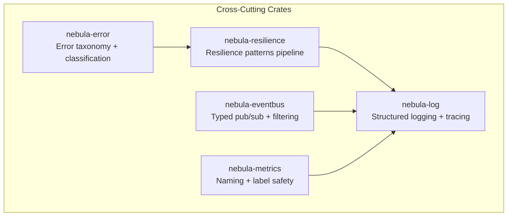
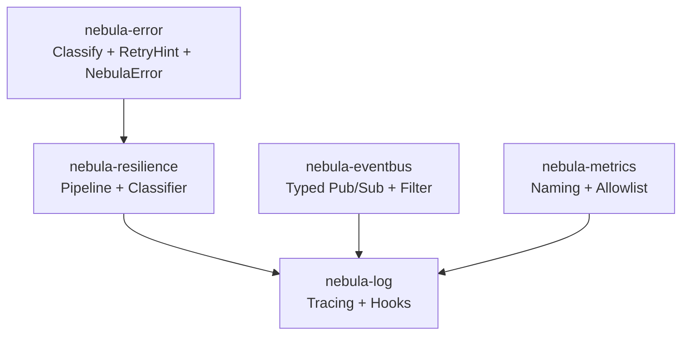
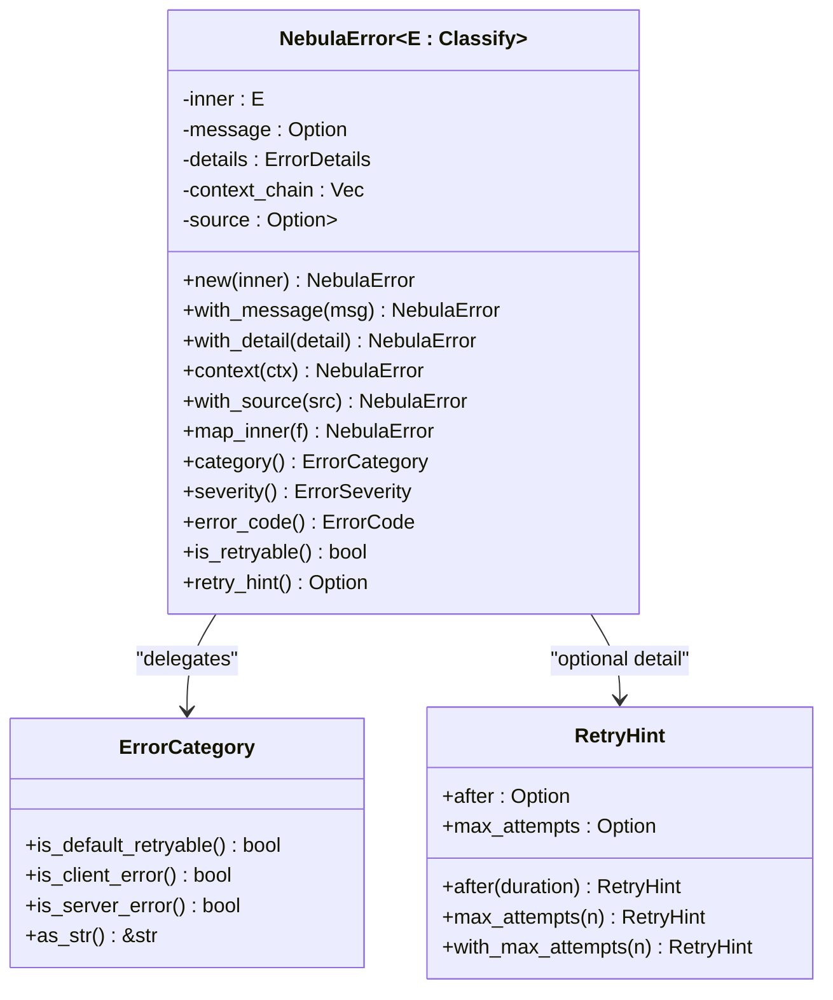
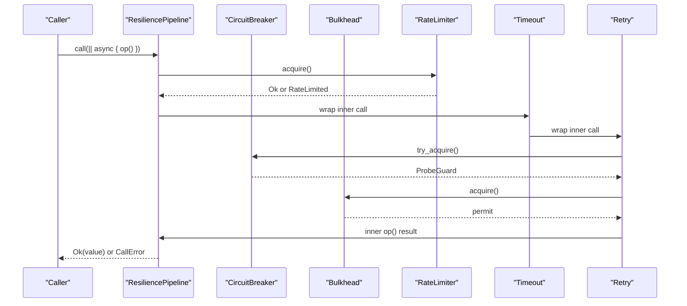
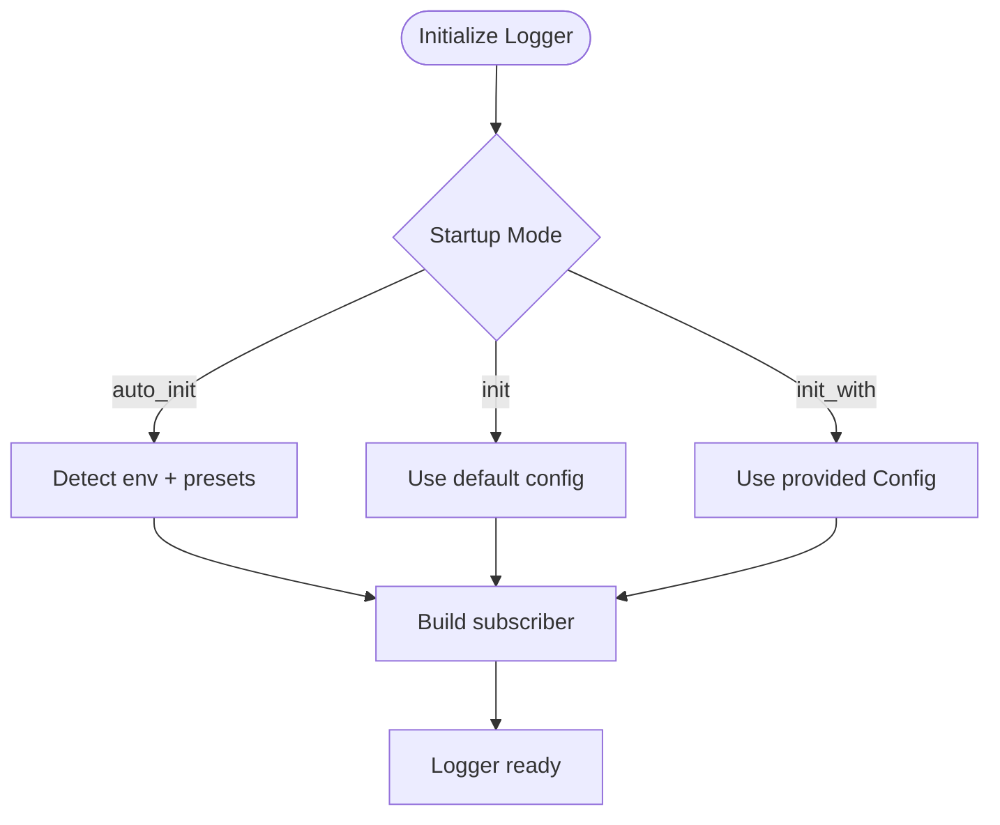
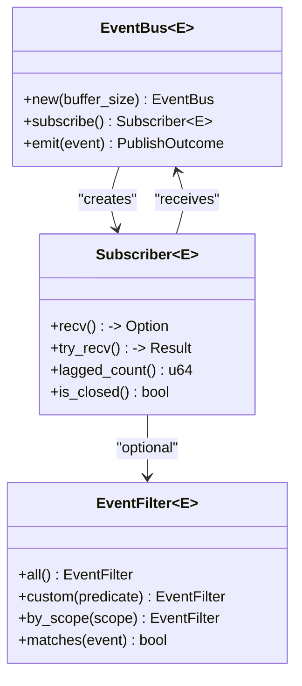
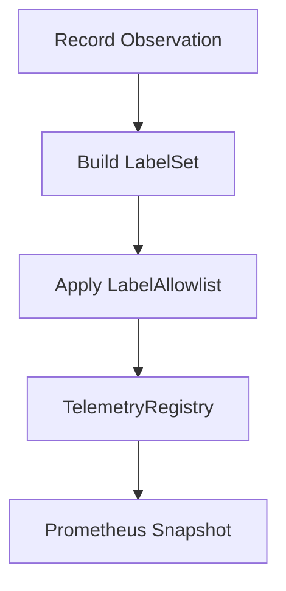
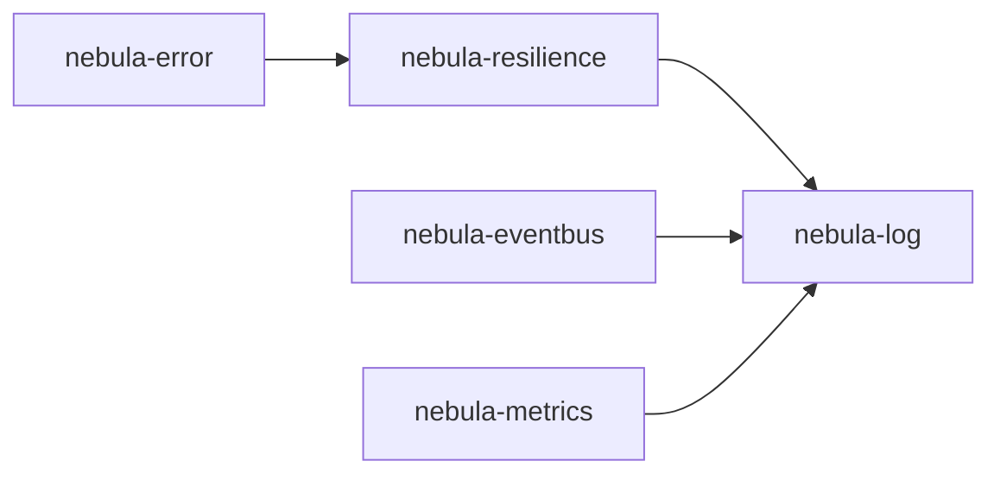

# Cross-Cutting Concerns

<cite>
**Referenced Files in This Document**
- [error/lib.rs](file://crates/error/src/lib.rs)
- [error/error.rs](file://crates/error/src/error.rs)
- [error/category.rs](file://crates/error/src/category.rs)
- [error/retry.rs](file://crates/error/src/retry.rs)
- [resilience/lib.rs](file://crates/resilience/src/lib.rs)
- [resilience/pipeline.rs](file://crates/resilience/src/pipeline.rs)
- [resilience/classifier.rs](file://crates/resilience/src/classifier.rs)
- [log/lib.rs](file://crates/log/src/lib.rs)
- [log/observability/mod.rs](file://crates/log/src/observability/mod.rs)
- [eventbus/lib.rs](file://crates/eventbus/src/lib.rs)
- [eventbus/filter.rs](file://crates/eventbus/src/filter.rs)
- [metrics/lib.rs](file://crates/metrics/src/lib.rs)
- [metrics/naming.rs](file://crates/metrics/src/naming.rs)
- [metrics/filter.rs](file://crates/metrics/src/filter.rs)
</cite>

## Table of Contents
1. [Introduction](#introduction)
2. [Project Structure](#project-structure)
3. [Core Components](#core-components)
4. [Architecture Overview](#architecture-overview)
5. [Detailed Component Analysis](#detailed-component-analysis)
6. [Dependency Analysis](#dependency-analysis)
7. [Performance Considerations](#performance-considerations)
8. [Troubleshooting Guide](#troubleshooting-guide)
9. [Conclusion](#conclusion)
10. [Appendices](#appendices)

## Introduction
This document explains Nebula’s cross-cutting concerns: error handling with classification and propagation, resilience patterns with retry strategies and circuit breakers, logging and observability with structured logging and tracing, typed pub/sub event bus, telemetry and metrics collection, and system monitoring. It synthesizes the shared infrastructure across the workspace to show how these utilities support a layered architecture and enable consistent behavior across all components. The guide is accessible to beginners while providing sufficient technical depth for experienced developers building robust, observable systems.

## Project Structure
Nebula organizes cross-cutting concerns into dedicated crates:
- Error taxonomy and classification boundary
- Resilience patterns pipeline
- Structured logging and tracing
- Typed event bus with filtering
- Metrics naming and label safety
- Observability hooks and event system

**Diagram sources**
- [error/lib.rs:1-72](file://crates/error/src/lib.rs#L1-L72)
- [resilience/lib.rs:1-184](file://crates/resilience/src/lib.rs#L1-L184)
- [log/lib.rs:1-280](file://crates/log/src/lib.rs#L1-L280)
- [eventbus/lib.rs:1-156](file://crates/eventbus/src/lib.rs#L1-L156)
- [metrics/lib.rs:1-68](file://crates/metrics/src/lib.rs#L1-L68)

**Section sources**
- [error/lib.rs:1-72](file://crates/error/src/lib.rs#L1-L72)
- [resilience/lib.rs:1-184](file://crates/resilience/src/lib.rs#L1-L184)
- [log/lib.rs:1-280](file://crates/log/src/lib.rs#L1-L280)
- [eventbus/lib.rs:1-156](file://crates/eventbus/src/lib.rs#L1-L156)
- [metrics/lib.rs:1-68](file://crates/metrics/src/lib.rs#L1-L68)

## Core Components
This section introduces the foundational cross-cutting utilities and their roles.

- Error taxonomy and classification boundary
  - Provides canonical categories, severity, retry guidance, and a generic error wrapper with typed details and context chaining.
  - Enables explicit transient vs permanent failure decisions and structured retry hints for resilience.

- Resilience patterns pipeline
  - Composable stability patterns: retry, circuit breaker, bulkhead, rate limiter, timeout, hedge, load shed.
  - Integrates error classification to drive retry filtering and CB outcomes.

- Structured logging and tracing
  - Single logging pipeline supporting multiple formats, writers, runtime reload, and optional OTLP/Sentry integrations.
  - Enforces observability contracts and provides hooks for operation events.

- Typed event bus with filtering
  - Generic in-process publish-subscribe channel with back-pressure, scoped events, and predicate-based filtering.
  - Supports best-effort delivery and lag detection for observability.

- Metrics naming and label safety
  - Standardized metric names with the nebula_* convention.
  - Label allowlist to prevent cardinality explosion and safe Prometheus export.

**Section sources**
- [error/lib.rs:10-34](file://crates/error/src/lib.rs#L10-L34)
- [resilience/lib.rs:5-22](file://crates/resilience/src/lib.rs#L5-L22)
- [log/lib.rs:6-26](file://crates/log/src/lib.rs#L6-L26)
- [eventbus/lib.rs:5-16](file://crates/eventbus/src/lib.rs#L5-L16)
- [metrics/lib.rs:4-34](file://crates/metrics/src/lib.rs#L4-L34)

## Architecture Overview
The cross-cutting concerns form a cohesive foundation enabling consistent behavior across layers:
- Error taxonomy informs resilience decisions and HTTP boundary mapping.
- Resilience patterns encapsulate outbound call stability and integrate with logging/tracing.
- Logging and observability hooks unify event emission and context propagation.
- Event bus decouples producers and consumers with typed events and filtering.
- Metrics naming and label safety ensure scalable telemetry and dashboards.

**Diagram sources**
- [error/error.rs:61-276](file://crates/error/src/error.rs#L61-L276)
- [resilience/pipeline.rs:230-308](file://crates/resilience/src/pipeline.rs#L230-L308)
- [log/observability/mod.rs:1-88](file://crates/log/src/observability/mod.rs#L1-L88)
- [eventbus/filter.rs:9-48](file://crates/eventbus/src/filter.rs#L9-L48)
- [metrics/naming.rs:1-392](file://crates/metrics/src/naming.rs#L1-L392)

## Detailed Component Analysis

### Error Handling and Classification
Purpose:
- Canonical error taxonomy and classification boundary.
- Structured retry guidance and typed details for downstream resilience and diagnostics.

Key types and behaviors:
- ErrorCategory: canonical failure classes with default retryability and client/server triage.
- ErrorSeverity: categorization for alerting and logging.
- RetryHint: advisory backoff and max attempts.
- NebulaError: generic wrapper with message override, typed details, context chain, and source chaining.

Integration patterns:
- Implement Classify on domain errors to expose category, code, severity, retryability, and optional RetryHint.
- Attach details (e.g., ResourceInfo, ExecutionContext) for richer diagnostics.
- Propagate errors using NebulaError<Result<T, E>> to preserve classification and context.

**Diagram sources**
- [error/category.rs:22-148](file://crates/error/src/category.rs#L22-L148)
- [error/retry.rs:22-86](file://crates/error/src/retry.rs#L22-L86)
- [error/error.rs:61-276](file://crates/error/src/error.rs#L61-L276)

**Section sources**
- [error/category.rs:1-338](file://crates/error/src/category.rs#L1-L338)
- [error/retry.rs:1-184](file://crates/error/src/retry.rs#L1-L184)
- [error/error.rs:1-524](file://crates/error/src/error.rs#L1-L524)

### Resilience Patterns Pipeline
Purpose:
- Compose stability patterns into a single call chain at outbound call sites.
- Drive retry filtering via error classification and circuit breaker outcomes.

Core concepts:
- Seven patterns: retry, circuit breaker, bulkhead, rate limiter, timeout, hedge, load shed.
- ResiliencePipeline builder composes steps; recommended order prioritizes load shedding, rate limiting, timeout, retry, circuit breaker, bulkhead.
- ErrorClassifier maps domain errors to ErrorClass for CB and retry decisions.

**Diagram sources**
- [resilience/pipeline.rs:310-386](file://crates/resilience/src/pipeline.rs#L310-L386)
- [resilience/classifier.rs:64-112](file://crates/resilience/src/classifier.rs#L64-L112)

**Section sources**
- [resilience/lib.rs:1-184](file://crates/resilience/src/lib.rs#L1-L184)
- [resilience/pipeline.rs:1-729](file://crates/resilience/src/pipeline.rs#L1-L729)
- [resilience/classifier.rs:1-410](file://crates/resilience/src/classifier.rs#L1-L410)

### Logging and Observability
Purpose:
- Structured tracing initialization with multiple formats, writers, runtime reload, and optional OTLP/Sentry integrations.
- Unified observability event system for operation lifecycle and domain events.

Capabilities:
- Startup modes: auto_init, init, init_with.
- Formats: pretty, compact, json, logfmt.
- Writers: stderr/stdout/file, fanout with failure policy.
- Runtime log-level reload and config file watching (async feature).
- Observability hooks and operation events with typed event kinds.

**Diagram sources**
- [log/lib.rs:192-261](file://crates/log/src/lib.rs#L192-L261)

**Section sources**
- [log/lib.rs:1-280](file://crates/log/src/lib.rs#L1-L280)
- [log/observability/mod.rs:1-88](file://crates/log/src/observability/mod.rs#L1-L88)

### Event Bus for Typed Pub/Sub
Purpose:
- In-process publish-subscribe channel for broadcasting domain events to multiple subscribers without tight coupling.
- Back-pressure with lag semantics and scoped filtering.

Key features:
- EventBus<E> with bounded broadcast semantics and zero-copy clone.
- BackPressurePolicy controls behavior when subscribers lag.
- EventFilter predicates and ScopedEvent support for targeted subscriptions.
- Stats for observability (sent, dropped, subscribers).

**Diagram sources**
- [eventbus/lib.rs:110-129](file://crates/eventbus/src/lib.rs#L110-L129)
- [eventbus/filter.rs:9-48](file://crates/eventbus/src/filter.rs#L9-L48)

**Section sources**
- [eventbus/lib.rs:1-156](file://crates/eventbus/src/lib.rs#L1-L156)
- [eventbus/filter.rs:1-55](file://crates/eventbus/src/filter.rs#L1-L55)

### Telemetry and Metrics Collection
Purpose:
- Consistent metric naming with nebula_* convention, label safety via allowlist, and Prometheus export.
- Adapter over telemetry primitives for convenient metric recording.

Patterns:
- Standardized metric names for workflows, actions, webhooks, resources, EventBus, credentials, and cache.
- LabelAllowlist to strip high-cardinality keys before registry insertion.
- Snapshot export for Prometheus scraping.

**Diagram sources**
- [metrics/naming.rs:1-392](file://crates/metrics/src/naming.rs#L1-L392)
- [metrics/filter.rs:44-111](file://crates/metrics/src/filter.rs#L44-L111)

**Section sources**
- [metrics/lib.rs:1-68](file://crates/metrics/src/lib.rs#L1-L68)
- [metrics/naming.rs:1-392](file://crates/metrics/src/naming.rs#L1-L392)
- [metrics/filter.rs:1-182](file://crates/metrics/src/filter.rs#L1-L182)

## Dependency Analysis
The cross-cutting crates are intentionally decoupled and layered:
- nebula-error provides classification and retry guidance used by resilience and API layers.
- nebula-resilience composes patterns and integrates with logging/tracing via CallError variants and metrics sinks.
- nebula-log initializes tracing and exposes observability hooks for operation events.
- nebula-eventbus decouples producers/consumers with typed events and filtering.
- nebula-metrics standardizes naming and label safety for telemetry.

**Diagram sources**
- [error/lib.rs:1-72](file://crates/error/src/lib.rs#L1-L72)
- [resilience/lib.rs:1-184](file://crates/resilience/src/lib.rs#L1-L184)
- [log/lib.rs:1-280](file://crates/log/src/lib.rs#L1-L280)
- [eventbus/lib.rs:1-156](file://crates/eventbus/src/lib.rs#L1-L156)
- [metrics/lib.rs:1-68](file://crates/metrics/src/lib.rs#L1-L68)

**Section sources**
- [error/lib.rs:1-72](file://crates/error/src/lib.rs#L1-L72)
- [resilience/lib.rs:1-184](file://crates/resilience/src/lib.rs#L1-L184)
- [log/lib.rs:1-280](file://crates/log/src/lib.rs#L1-L280)
- [eventbus/lib.rs:1-156](file://crates/eventbus/src/lib.rs#L1-L156)
- [metrics/lib.rs:1-68](file://crates/metrics/src/lib.rs#L1-L68)

## Performance Considerations
- Error handling
  - Keep context chains concise; avoid excessive nesting to minimize display cost.
  - Use RetryHint judiciously; avoid overly aggressive backoff that increases tail latency.

- Resilience pipeline
  - Order steps thoughtfully: load shedding and rate limiting before retry/timeout to reduce wasted work.
  - Prefer classify_errors with NebulaClassifier to align CB and retry with ErrorCategory semantics.

- Logging
  - Choose compact/json/logfmt formats based on environment; JSON for structured ingestion.
  - Use runtime reload sparingly; prefer explicit init_with for production determinism.

- Event bus
  - Tune buffer sizes to balance memory and lag tolerance; monitor lagged_count to detect subscriber overload.
  - Use EventFilter and ScopedEvent to reduce unnecessary processing.

- Metrics
  - Apply LabelAllowlist to prevent cardinality explosion; restrict labels to low-cardinality keys.
  - Prefer histograms for latency; counters for counts to reduce series proliferation.

[No sources needed since this section provides general guidance]

## Troubleshooting Guide
- Error taxonomy and propagation
  - Verify Classify implementations return accurate ErrorCategory and RetryHint for predictable resilience behavior.
  - Inspect NebulaError context_chain and details to diagnose root causes.

- Resilience pipeline
  - Check CallError variants to identify failure origin (timeout, rate-limited, circuit-open, retries-exhausted).
  - Validate layer order warnings and adjust builder steps accordingly.

- Logging
  - Confirm auto_init/init_with success and environment variable precedence.
  - Use ReloadHandle for runtime log-level changes; watch_config for file-driven reloads.

- Event bus
  - Monitor lagged_count and EventBusStats to detect subscriber lag.
  - Use EventFilter.by_scope to isolate events by domain scope.

- Metrics
  - Validate metric names adhere to nebula_* convention and label sets pass LabelAllowlist.
  - Export snapshot for Prometheus verification.

**Section sources**
- [error/error.rs:1-524](file://crates/error/src/error.rs#L1-L524)
- [resilience/pipeline.rs:192-226](file://crates/resilience/src/pipeline.rs#L192-L226)
- [log/lib.rs:192-261](file://crates/log/src/lib.rs#L192-L261)
- [eventbus/lib.rs:60-93](file://crates/eventbus/src/lib.rs#L60-L93)
- [metrics/naming.rs:1-392](file://crates/metrics/src/naming.rs#L1-L392)
- [metrics/filter.rs:56-111](file://crates/metrics/src/filter.rs#L56-L111)

## Conclusion
Nebula’s cross-cutting concerns provide a consistent, observable foundation across the system. By adopting canonical error taxonomy, composing resilience patterns, standardizing logging and metrics, and enabling typed pub/sub communication, teams can implement robust, maintainable, and operable software. The crates outlined here should be integrated early and consistently to ensure uniform behavior and strong reliability guarantees.

[No sources needed since this section summarizes without analyzing specific files]

## Appendices

### Error Taxonomy Reference
- Categories and default retryability
  - Timeout, Exhausted, External, RateLimit, Unavailable: default retryable
  - NotFound, Validation, Authentication, Authorization, Conflict, Unsupported, DataTooLarge: not retryable
- Severity levels
  - Error / Warning / Info for alerting and logging triage.

**Section sources**
- [error/category.rs:55-148](file://crates/error/src/category.rs#L55-L148)

### Resilience Pipeline Composition Guide
- Recommended layer order (outermost → innermost): load shed → rate limiter → timeout → retry → circuit breaker → bulkhead.
- Use classify_errors with NebulaClassifier for automatic mapping of ErrorCategory to ErrorClass.
- For fine-grained control, supply a custom ErrorClassifier via PipelineBuilder.classifier.

**Section sources**
- [resilience/pipeline.rs:3-7](file://crates/resilience/src/pipeline.rs#L3-L7)
- [resilience/pipeline.rs:178-190](file://crates/resilience/src/pipeline.rs#L178-L190)
- [resilience/classifier.rs:224-264](file://crates/resilience/src/classifier.rs#L224-L264)

### Logging Configuration Options
- Modes
  - auto_init: environment-driven resolution
  - init: default config
  - init_with: explicit Config
- Environment variables
  - NEBULA_LOG/RUST_LOG: log level/filter directives
  - NEBULA_LOG_FORMAT: pretty|compact|json|logfmt
  - NEBULA_SERVICE/ENV/VERSION/INSTANCE/REGION: service identity fields
  - OTEL_EXPORTER_OTLP_ENDPOINT: OTLP export endpoint
  - SENTRY_DSN/TRACES_SAMPLE_RATE: Sentry integration

**Section sources**
- [log/lib.rs:42-107](file://crates/log/src/lib.rs#L42-L107)
- [log/lib.rs:192-261](file://crates/log/src/lib.rs#L192-L261)

### Event Filtering and Scoping
- EventFilter.all/custom/by_scope to constrain subscriptions.
- ScopedEvent and SubscriptionScope for hierarchical targeting.

**Section sources**
- [eventbus/filter.rs:19-48](file://crates/eventbus/src/filter.rs#L19-L48)

### Metric Naming Conventions and Label Safety
- Names follow nebula_<domain>_<metric>_<unit>.
- LabelAllowlist.only([...]) to restrict labels and prevent cardinality explosion.
- Use snapshot for Prometheus scraping.

**Section sources**
- [metrics/naming.rs:1-392](file://crates/metrics/src/naming.rs#L1-L392)
- [metrics/filter.rs:56-111](file://crates/metrics/src/filter.rs#L56-L111)