# Error Handling

<cite>
**Referenced Files in This Document**
- [lib.rs](file://crates/error/src/lib.rs)
- [error.rs](file://crates/error/src/error.rs)
- [category.rs](file://crates/error/src/category.rs)
- [code.rs](file://crates/error/src/code.rs)
- [severity.rs](file://crates/error/src/severity.rs)
- [traits.rs](file://crates/error/src/traits.rs)
- [detail_types.rs](file://crates/error/src/detail_types.rs)
- [details.rs](file://crates/error/src/details.rs)
- [retry.rs](file://crates/error/src/retry.rs)
- [collection.rs](file://crates/error/src/collection.rs)
- [convert.rs](file://crates/error/src/convert.rs)
- [error.rs](file://crates/action/src/error.rs)
- [errors.rs](file://crates/api/src/errors.rs)
- [error.rs](file://crates/core/src/error.rs)
</cite>

## Table of Contents
1. [Introduction](#introduction)
2. [Project Structure](#project-structure)
3. [Core Components](#core-components)
4. [Architecture Overview](#architecture-overview)
5. [Detailed Component Analysis](#detailed-component-analysis)
6. [Dependency Analysis](#dependency-analysis)
7. [Performance Considerations](#performance-considerations)
8. [Troubleshooting Guide](#troubleshooting-guide)
9. [Conclusion](#conclusion)
10. [Appendices](#appendices)

## Introduction
This document explains Nebula’s error classification and propagation system. It covers the taxonomy of errors, machine-readable codes, severity levels, and structured detail types. It documents the error trait system, conversion mechanisms, and propagation patterns across the system. It also describes error detail collection utilities, retry strategies, formatting and serialization, and how errors integrate with logging, observability, and resilience. Practical examples are drawn from the codebase to illustrate error creation, classification, and handling patterns.

## Project Structure
The error subsystem is centered in the nebula-error crate and is consumed by domain crates (e.g., action, API, core). The key building blocks are:
- Classification traits and primitives (category, code, severity)
- A generic error wrapper with context chaining and typed details
- Structured detail types for diagnostics and routing
- Batch error aggregation and retry hints
- Conversion utilities (e.g., HTTP status mapping)

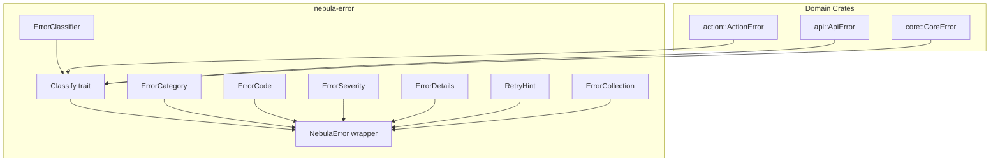

**Diagram sources**
- [lib.rs:38-61](file://crates/error/src/lib.rs#L38-L61)
- [traits.rs:45-67](file://crates/error/src/traits.rs#L45-L67)
- [error.rs:61-67](file://crates/error/src/error.rs#L61-L67)
- [category.rs:24-53](file://crates/error/src/category.rs#L24-L53)
- [code.rs:23-69](file://crates/error/src/code.rs#L23-L69)
- [severity.rs:20-28](file://crates/error/src/severity.rs#L20-L28)
- [details.rs:52-103](file://crates/error/src/details.rs#L52-L103)
- [retry.rs:22-86](file://crates/error/src/retry.rs#L22-L86)
- [collection.rs:47-196](file://crates/error/src/collection.rs#L47-L196)
- [error.rs:239-274](file://crates/action/src/error.rs#L239-L274)
- [errors.rs:95-175](file://crates/api/src/errors.rs#L95-L175)
- [error.rs:96-122](file://crates/core/src/error.rs#L96-L122)

**Section sources**
- [lib.rs:1-72](file://crates/error/src/lib.rs#L1-L72)

## Core Components
- Error taxonomy: canonical categories, machine-readable codes, and severity levels
- Classification trait: Classify defines category, code, severity, retryability, and retry hints
- Generic error wrapper: NebulaError enriches domain errors with message override, typed details, context chain, and source error
- Detail types: structured metadata for diagnostics, quotas, routing, execution context, and more
- Retry guidance: advisory RetryHint with backoff and max attempts
- Batch aggregation: ErrorCollection for multi-error scenarios
- Conversion utilities: mapping ErrorCategory to HTTP status codes and back

**Section sources**
- [category.rs:24-148](file://crates/error/src/category.rs#L24-L148)
- [code.rs:23-156](file://crates/error/src/code.rs#L23-L156)
- [severity.rs:20-89](file://crates/error/src/severity.rs#L20-L89)
- [traits.rs:45-67](file://crates/error/src/traits.rs#L45-L67)
- [error.rs:61-346](file://crates/error/src/error.rs#L61-L346)
- [detail_types.rs:30-347](file://crates/error/src/detail_types.rs#L30-L347)
- [details.rs:52-103](file://crates/error/src/details.rs#L52-L103)
- [retry.rs:22-97](file://crates/error/src/retry.rs#L22-L97)
- [collection.rs:47-269](file://crates/error/src/collection.rs#L47-L269)
- [convert.rs:39-94](file://crates/error/src/convert.rs#L39-L94)

## Architecture Overview
The error system establishes a classification boundary across the platform:
- Domain crates implement Classify on their error enums
- Errors are wrapped in NebulaError to attach details, context, and source
- Resilience and API layers consume classification and hints for routing and retries
- HTTP boundary converts ErrorCategory to problem+json

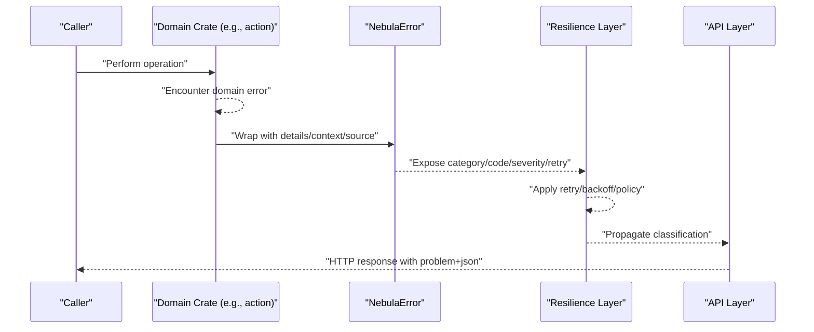

**Diagram sources**
- [traits.rs:45-67](file://crates/error/src/traits.rs#L45-L67)
- [error.rs:61-346](file://crates/error/src/error.rs#L61-L346)
- [convert.rs:39-94](file://crates/error/src/convert.rs#L39-L94)
- [errors.rs:95-175](file://crates/api/src/errors.rs#L95-L175)

## Detailed Component Analysis

### Error Taxonomy: Categories, Codes, Severity
- Categories classify “what happened” (e.g., NotFound, Validation, Authentication, Authorization, Conflict, RateLimit, Timeout, Exhausted, Cancelled, Internal, External, Unsupported, Unavailable, DataTooLarge)
- Codes are short, unique identifiers for specific failure modes; canonical codes mirror categories
- Severity indicates importance (Info < Warning < Error), defaulting to Error

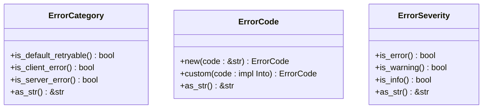

**Diagram sources**
- [category.rs:24-148](file://crates/error/src/category.rs#L24-L148)
- [code.rs:23-69](file://crates/error/src/code.rs#L23-L69)
- [severity.rs:20-89](file://crates/error/src/severity.rs#L20-L89)

**Section sources**
- [category.rs:24-148](file://crates/error/src/category.rs#L24-L148)
- [code.rs:23-156](file://crates/error/src/code.rs#L23-L156)
- [severity.rs:20-89](file://crates/error/src/severity.rs#L20-L89)

### Classification Trait and Classifier
- Classify defines category and code (required), with defaults for severity, retryability, and retry hints
- ErrorClassifier enables predicate-based matching for resilience decisions

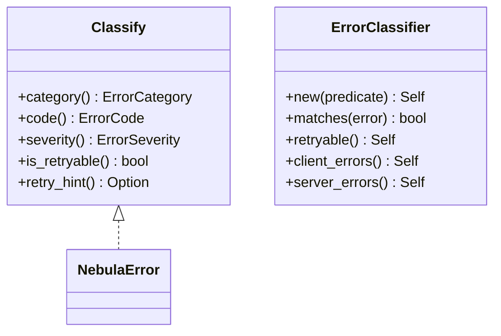

**Diagram sources**
- [traits.rs:45-133](file://crates/error/src/traits.rs#L45-L133)
- [error.rs:326-346](file://crates/error/src/error.rs#L326-L346)

**Section sources**
- [traits.rs:45-133](file://crates/error/src/traits.rs#L45-L133)
- [error.rs:326-346](file://crates/error/src/error.rs#L326-L346)

### Generic Error Wrapper: NebulaError
- Wraps any Classify error with optional message override, typed details, context chain, and source error
- Provides builder-style methods to attach details and context
- Delegates classification to the inner error and implements Display/Error

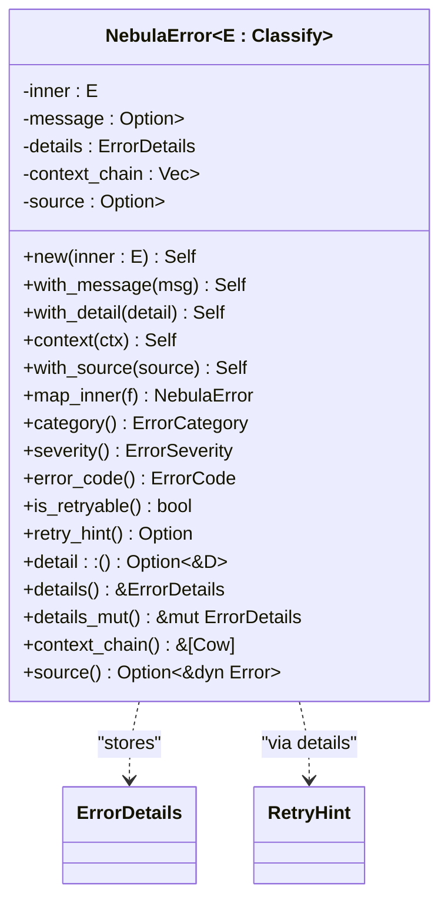

**Diagram sources**
- [error.rs:61-276](file://crates/error/src/error.rs#L61-L276)

**Section sources**
- [error.rs:61-346](file://crates/error/src/error.rs#L61-L346)

### Error Details and Structured Metadata
- ErrorDetails is a type-safe, TypeId-keyed map storing at most one value per ErrorDetail type
- Detail types include RetryHint, ResourceInfo, BadRequest/FieldViolation, DebugInfo, QuotaInfo, PreconditionFailure/Violation, ExecutionContext, ErrorRoute, TypeMismatch, HelpLink, RequestInfo, DependencyInfo

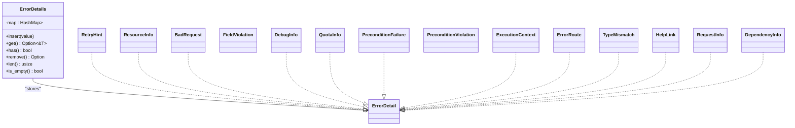

**Diagram sources**
- [details.rs:52-103](file://crates/error/src/details.rs#L52-L103)
- [detail_types.rs:11-347](file://crates/error/src/detail_types.rs#L11-L347)

**Section sources**
- [details.rs:52-103](file://crates/error/src/details.rs#L52-L103)
- [detail_types.rs:30-347](file://crates/error/src/detail_types.rs#L30-L347)

### Retry Guidance and Strategies
- RetryHint suggests backoff duration and max attempts; can be attached as a detail
- Classify::retry_hint returns an Option<RetryHint>; default is None
- ErrorClassifier::retryable matches default-retryable categories

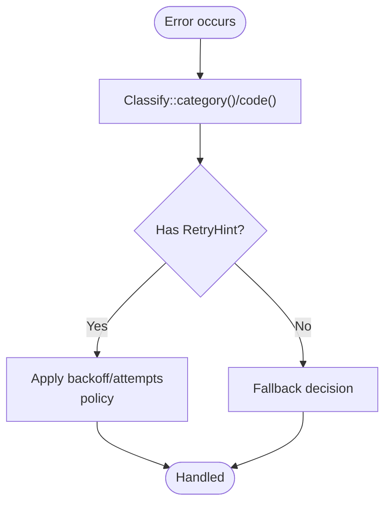

**Diagram sources**
- [retry.rs:22-97](file://crates/error/src/retry.rs#L22-L97)
- [traits.rs:57-66](file://crates/error/src/traits.rs#L57-L66)
- [error.rs:343-345](file://crates/error/src/error.rs#L343-L345)

**Section sources**
- [retry.rs:22-97](file://crates/error/src/retry.rs#L22-L97)
- [traits.rs:57-66](file://crates/error/src/traits.rs#L57-L66)

### Batch Error Aggregation
- ErrorCollection aggregates multiple NebulaError values and exposes helpers:
  - any_retryable
  - max_severity
  - uniform_category
- BatchResult<T, E> = Result<T, ErrorCollection<E>>

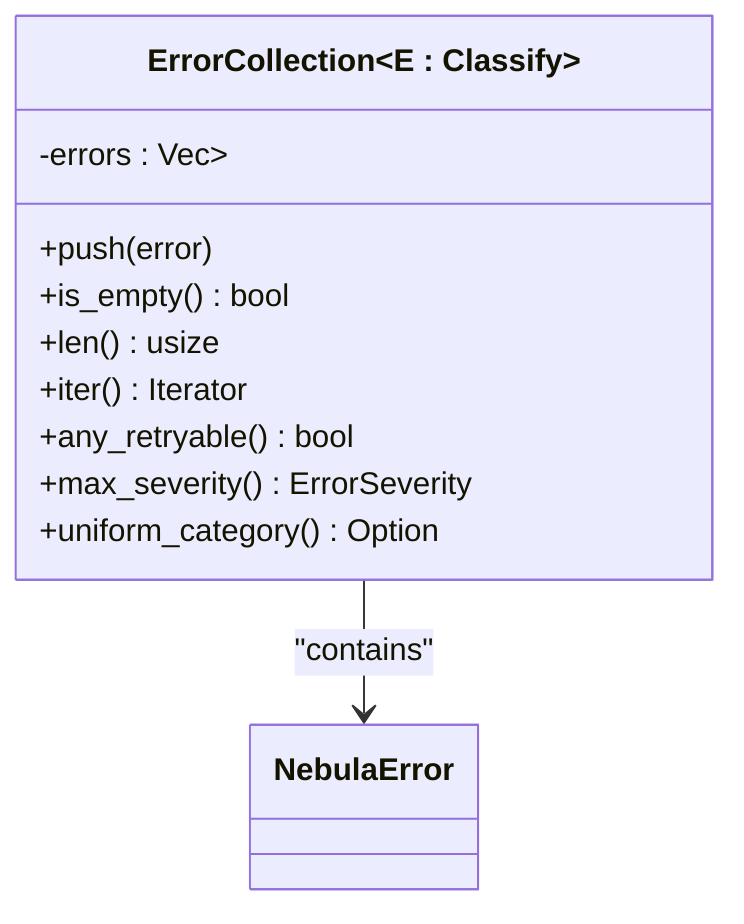

**Diagram sources**
- [collection.rs:47-196](file://crates/error/src/collection.rs#L47-L196)

**Section sources**
- [collection.rs:47-269](file://crates/error/src/collection.rs#L47-L269)

### Conversion Utilities (HTTP)
- ErrorCategory provides http_status_code() and from_http_status()
- Enables mapping to/from HTTP semantics for API boundaries

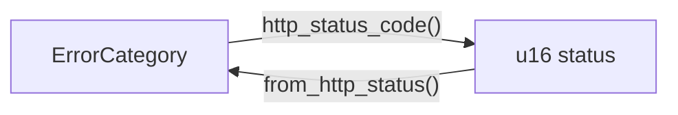

**Diagram sources**
- [convert.rs:39-94](file://crates/error/src/convert.rs#L39-L94)

**Section sources**
- [convert.rs:39-94](file://crates/error/src/convert.rs#L39-L94)

### Concrete Examples from the Codebase
- ActionError implements Classify and maps variants to categories and codes; attaches RetryHint via details when appropriate
- ApiError derives Classify and maps variants to HTTP semantics; integrates with problem+json serialization
- CoreError implements Classify with fixed retryability and category/code mapping

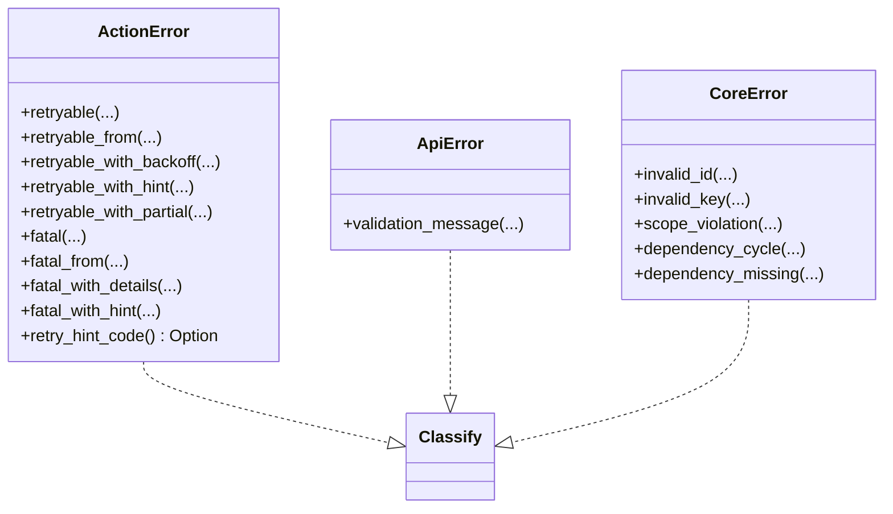

**Diagram sources**
- [error.rs:239-274](file://crates/action/src/error.rs#L239-L274)
- [errors.rs:95-175](file://crates/api/src/errors.rs#L95-L175)
- [error.rs:96-122](file://crates/core/src/error.rs#L96-L122)

**Section sources**
- [error.rs:239-429](file://crates/action/src/error.rs#L239-L429)
- [errors.rs:95-175](file://crates/api/src/errors.rs#L95-L175)
- [error.rs:96-122](file://crates/core/src/error.rs#L96-L122)

## Dependency Analysis
- Domain crates depend on nebula-error for classification and wrapping
- NebulaError depends on classification primitives and detail storage
- Resilience layer depends on classification and RetryHint
- API layer depends on classification and HTTP conversion

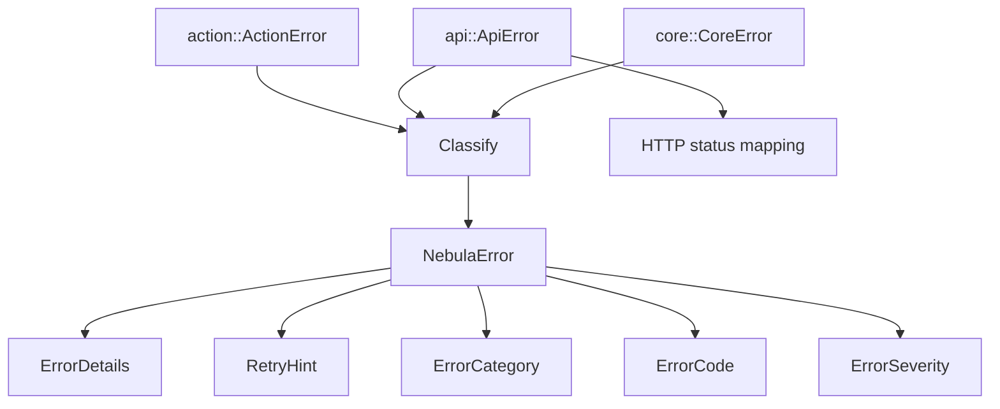

**Diagram sources**
- [traits.rs:45-67](file://crates/error/src/traits.rs#L45-L67)
- [error.rs:61-346](file://crates/error/src/error.rs#L61-L346)
- [detail_types.rs:11-347](file://crates/error/src/detail_types.rs#L11-L347)
- [convert.rs:39-94](file://crates/error/src/convert.rs#L39-L94)

**Section sources**
- [traits.rs:45-133](file://crates/error/src/traits.rs#L45-L133)
- [error.rs:61-346](file://crates/error/src/error.rs#L61-L346)
- [convert.rs:39-94](file://crates/error/src/convert.rs#L39-L94)

## Performance Considerations
- ErrorDetails uses TypeId-keyed storage; insertion and lookup are O(1) average
- RetryHint is small and copyable; minimal overhead
- Context chain and message overrides are Cow-backed for efficient borrowing
- Batch aggregation is linear in the number of errors; keep batches bounded

## Troubleshooting Guide
- Use ErrorClassifier::retryable() to quickly identify transient failures
- Attach RetryHint via ErrorDetails when retry guidance is known
- For HTTP APIs, rely on ErrorCategory::http_status_code() to ensure correct mapping
- For observability, include ExecutionContext and RequestInfo details to correlate logs and traces
- For validation-heavy flows, collect multiple errors with ErrorCollection and surface max_severity and uniform_category to decide policy

**Section sources**
- [traits.rs:116-133](file://crates/error/src/traits.rs#L116-L133)
- [retry.rs:22-97](file://crates/error/src/retry.rs#L22-L97)
- [convert.rs:39-94](file://crates/error/src/convert.rs#L39-L94)
- [detail_types.rs:196-317](file://crates/error/src/detail_types.rs#L196-L317)
- [collection.rs:98-196](file://crates/error/src/collection.rs#L98-L196)

## Conclusion
Nebula’s error handling system provides a robust, structured foundation for classification, propagation, and resilience. By adopting Classify, wrapping errors in NebulaError, and attaching typed details, applications gain consistent categorization, retry guidance, and observability. The system’s design ensures that transient vs permanent failures are explicit, enabling intelligent resilience and clear API responses.

## Appendices

### Error Formatting and Serialization
- NebulaError implements Display and Debug, composing context chain and message
- ErrorCategory, ErrorCode, ErrorSeverity, RetryHint, and ErrorDetails support optional serde serialization for transport across boundaries

**Section sources**
- [error.rs:278-324](file://crates/error/src/error.rs#L278-L324)
- [category.rs:156-203](file://crates/error/src/category.rs#L156-L203)
- [code.rs:109-122](file://crates/error/src/code.rs#L109-L122)
- [severity.rs:97-118](file://crates/error/src/severity.rs#L97-L118)
- [retry.rs:99-130](file://crates/error/src/retry.rs#L99-L130)
- [details.rs:111-117](file://crates/error/src/details.rs#L111-L117)

### Propagation Across Boundaries
- Domain errors implement Classify and are wrapped in NebulaError
- API layer maps ErrorCategory to HTTP status and serializes to problem+json
- Resilience layer inspects classification and RetryHint to apply policies

**Section sources**
- [errors.rs:95-175](file://crates/api/src/errors.rs#L95-L175)
- [convert.rs:39-94](file://crates/error/src/convert.rs#L39-L94)
- [traits.rs:98-133](file://crates/error/src/traits.rs#L98-L133)