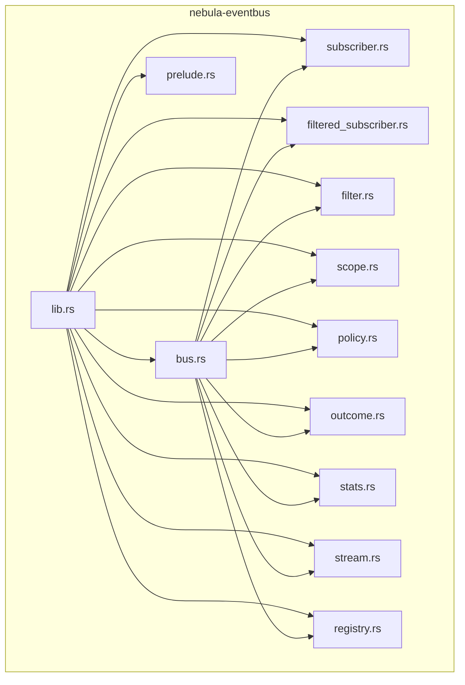
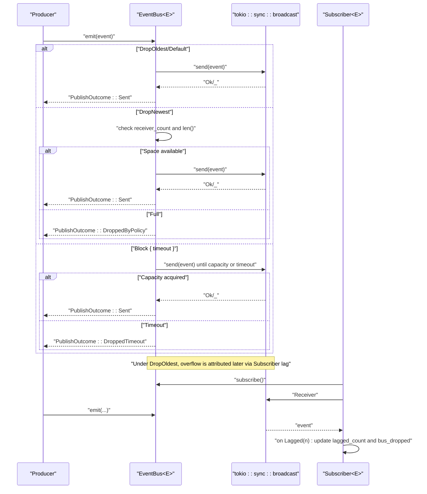
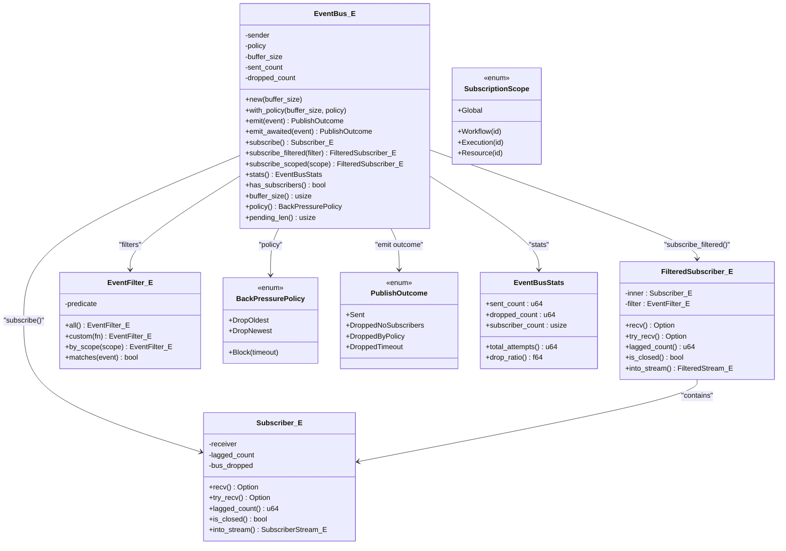
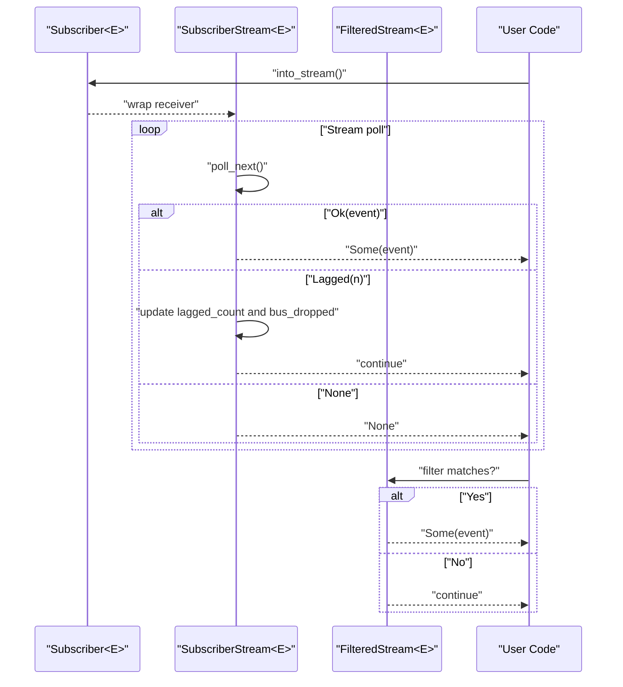
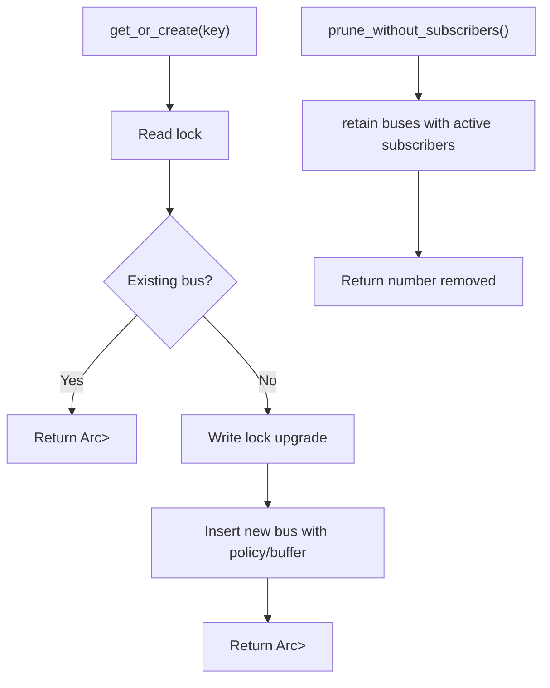
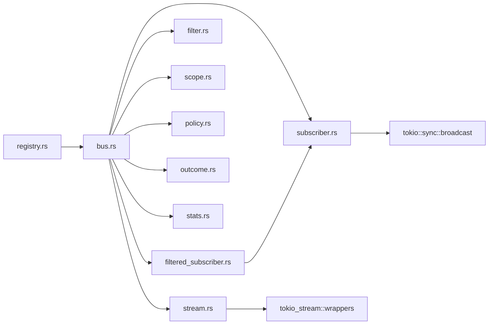

# Event Bus

<cite>
**Referenced Files in This Document**
- [Cargo.toml](file://crates/eventbus/Cargo.toml)
- [README.md](file://crates/eventbus/README.md)
- [lib.rs](file://crates/eventbus/src/lib.rs)
- [bus.rs](file://crates/eventbus/src/bus.rs)
- [subscriber.rs](file://crates/eventbus/src/subscriber.rs)
- [filtered_subscriber.rs](file://crates/eventbus/src/filtered_subscriber.rs)
- [filter.rs](file://crates/eventbus/src/filter.rs)
- [scope.rs](file://crates/eventbus/src/scope.rs)
- [policy.rs](file://crates/eventbus/src/policy.rs)
- [outcome.rs](file://crates/eventbus/src/outcome.rs)
- [stats.rs](file://crates/eventbus/src/stats.rs)
- [stream.rs](file://crates/eventbus/src/stream.rs)
- [registry.rs](file://crates/eventbus/src/registry.rs)
- [prelude.rs](file://crates/eventbus/src/prelude.rs)
- [subscriber_patterns.rs](file://crates/eventbus/examples/subscriber_patterns.rs)
- [emit.rs](file://crates/eventbus/benches/emit.rs)
- [throughput.rs](file://crates/eventbus/benches/throughput.rs)
</cite>

## Table of Contents
1. [Introduction](#introduction)
2. [Project Structure](#project-structure)
3. [Core Components](#core-components)
4. [Architecture Overview](#architecture-overview)
5. [Detailed Component Analysis](#detailed-component-analysis)
6. [Dependency Analysis](#dependency-analysis)
7. [Performance Considerations](#performance-considerations)
8. [Troubleshooting Guide](#troubleshooting-guide)
9. [Conclusion](#conclusion)
10. [Appendices](#appendices)

## Introduction
Nebula’s event bus is a typed, in-process publish-subscribe channel designed for efficient, low-overhead event distribution across subsystems. It is transport-only, meaning it does not define domain event types—those live in domain crates. The bus provides:
- Typed broadcast delivery backed by tokio broadcast channels
- Configurable back-pressure policies
- Filtering and scoped delivery
- Stream adapters for reactive consumption
- Observability counters and registry for multi-bus management

It is intentionally ephemeral and best-effort, suitable for in-process observability, logging, and cross-cutting notifications, not for durable control-plane messaging.

## Project Structure
The eventbus crate exposes a small, focused API surface centered around a generic EventBus<E> and supporting types for filtering, scoping, streams, and registry management.



**Diagram sources**
- [lib.rs:133-156](file://crates/eventbus/src/lib.rs#L133-L156)
- [bus.rs:18-265](file://crates/eventbus/src/bus.rs#L18-L265)
- [subscriber.rs:10-137](file://crates/eventbus/src/subscriber.rs#L10-L137)
- [filtered_subscriber.rs:5-75](file://crates/eventbus/src/filtered_subscriber.rs#L5-L75)
- [filter.rs:7-55](file://crates/eventbus/src/filter.rs#L7-L55)
- [scope.rs:3-67](file://crates/eventbus/src/scope.rs#L3-L67)
- [policy.rs:5-32](file://crates/eventbus/src/policy.rs#L5-L32)
- [outcome.rs:3-24](file://crates/eventbus/src/outcome.rs#L3-L24)
- [stats.rs:3-94](file://crates/eventbus/src/stats.rs#L3-L94)
- [stream.rs:17-122](file://crates/eventbus/src/stream.rs#L17-L122)
- [registry.rs:22-212](file://crates/eventbus/src/registry.rs#L22-L212)
- [prelude.rs:1-12](file://crates/eventbus/src/prelude.rs#L1-L12)

**Section sources**
- [lib.rs:133-156](file://crates/eventbus/src/lib.rs#L133-L156)
- [README.md:10-65](file://crates/eventbus/README.md#L10-L65)

## Core Components
- EventBus<E>: Generic typed broadcast bus with configurable buffer size and back-pressure policy. Provides emit, emit_awaited, subscribe, subscribe_filtered, subscribe_scoped, stats, and lifecycle helpers.
- Subscriber<E> and FilteredSubscriber<E>: Subscription handles with recv/try_recv semantics, automatic lag recovery, and optional filtering.
- EventFilter<E>: Composable predicate-based filter; includes scope-based filter via ScopedEvent.
- SubscriptionScope: Hierarchical scope enum (Global, Workflow, Execution, Resource) for targeted delivery.
- BackPressurePolicy: DropOldest (default), DropNewest, Block { timeout }.
- PublishOutcome: Outcome of emit operations (Sent, DroppedNoSubscribers, DroppedByPolicy, DroppedTimeout).
- EventBusStats and EventBusRegistryStats: Aggregated counters for sent/dropped/subscriber counts; registry supports per-key isolation and pruning.
- Stream adapters: SubscriberStream and FilteredStream integrate with futures_core::Stream.
- EventBusRegistry<K,E>: Manages multiple isolated buses keyed by K with lazy creation and pruning.

**Section sources**
- [bus.rs:42-265](file://crates/eventbus/src/bus.rs#L42-L265)
- [subscriber.rs:54-137](file://crates/eventbus/src/subscriber.rs#L54-L137)
- [filtered_subscriber.rs:21-75](file://crates/eventbus/src/filtered_subscriber.rs#L21-L75)
- [filter.rs:8-55](file://crates/eventbus/src/filter.rs#L8-L55)
- [scope.rs:6-67](file://crates/eventbus/src/scope.rs#L6-L67)
- [policy.rs:9-32](file://crates/eventbus/src/policy.rs#L9-L32)
- [outcome.rs:4-24](file://crates/eventbus/src/outcome.rs#L4-L24)
- [stats.rs:24-94](file://crates/eventbus/src/stats.rs#L24-L94)
- [stream.rs:37-122](file://crates/eventbus/src/stream.rs#L37-L122)
- [registry.rs:36-212](file://crates/eventbus/src/registry.rs#L36-L212)

## Architecture Overview
The event bus is a thin typed wrapper over tokio::sync::broadcast. Producers call emit or emit_awaited; subscribers receive via recv/try_recv or streams. Back-pressure is enforced by policy, and lag is handled by skipping to the latest event.



**Diagram sources**
- [bus.rs:85-200](file://crates/eventbus/src/bus.rs#L85-L200)
- [subscriber.rs:74-105](file://crates/eventbus/src/subscriber.rs#L74-L105)

**Section sources**
- [bus.rs:30-41](file://crates/eventbus/src/bus.rs#L30-L41)
- [subscriber.rs:12-27](file://crates/eventbus/src/subscriber.rs#L12-L27)

## Detailed Component Analysis

### EventBus<E>
- Construction: new(buffer_size) or with_policy(buffer_size, policy). Defaults to DropOldest with buffer_size 1024.
- Publishing:
  - emit(event): non-blocking; returns PublishOutcome.
  - emit_awaited(event): respects Block policy with exponential backoff until timeout or capacity.
- Subscriptions:
  - subscribe(): returns Subscriber<E>.
  - subscribe_filtered(filter): returns FilteredSubscriber<E>.
  - subscribe_scoped(scope): scope-based filter via ScopedEvent.
- Observability: stats() returns EventBusStats with sent_count, dropped_count, subscriber_count.
- Lifecycle: has_subscribers(), buffer_size(), policy(), pending_len().



**Diagram sources**
- [bus.rs:42-265](file://crates/eventbus/src/bus.rs#L42-L265)
- [subscriber.rs:54-137](file://crates/eventbus/src/subscriber.rs#L54-L137)
- [filtered_subscriber.rs:21-75](file://crates/eventbus/src/filtered_subscriber.rs#L21-L75)
- [filter.rs:8-55](file://crates/eventbus/src/filter.rs#L8-L55)
- [scope.rs:6-67](file://crates/eventbus/src/scope.rs#L6-L67)
- [policy.rs:9-32](file://crates/eventbus/src/policy.rs#L9-L32)
- [outcome.rs:4-24](file://crates/eventbus/src/outcome.rs#L4-L24)
- [stats.rs:24-94](file://crates/eventbus/src/stats.rs#L24-L94)

**Section sources**
- [bus.rs:55-265](file://crates/eventbus/src/bus.rs#L55-L265)
- [policy.rs:9-32](file://crates/eventbus/src/policy.rs#L9-L32)
- [outcome.rs:4-24](file://crates/eventbus/src/outcome.rs#L4-L24)
- [stats.rs:24-94](file://crates/eventbus/src/stats.rs#L24-L94)

### Subscriber and FilteredSubscriber
- Subscriber:
  - recv(): async receive; automatically handles Lagged by skipping to latest and updating lagged_count and bus_dropped.
  - try_recv(): non-blocking; same lag handling.
  - lagged_count(): cumulative missed events due to overflow.
  - is_closed(): true when all senders dropped.
  - into_stream(): converts to SubscriberStream for futures_core::Stream.
- FilteredSubscriber:
  - Wraps Subscriber and yields only events matching EventFilter.
  - recv()/try_recv() loop until a matching event arrives.
  - lagged_count() reflects underlying subscriber’s lag (not per-filter misses).
  - into_stream(): converts to FilteredStream.

```mermaid
flowchart TD
Start(["recv()/try_recv()"]) --> Poll["Poll receiver"]
Poll --> OkEvt{"Ok(event)?"}
OkEvt --> |Yes| ReturnEvt["Return event"]
OkEvt --> |No| ErrType{"Error type"}
ErrType --> |Lagged(n)| Record["record_lag(n)"] --> Continue["continue loop"]
ErrType --> |Closed| ReturnNone["Return None"]
Continue --> Poll
ReturnEvt --> End(["Done"])
ReturnNone --> End
```

**Diagram sources**
- [subscriber.rs:74-105](file://crates/eventbus/src/subscriber.rs#L74-L105)

**Section sources**
- [subscriber.rs:54-137](file://crates/eventbus/src/subscriber.rs#L54-L137)
- [filtered_subscriber.rs:21-75](file://crates/eventbus/src/filtered_subscriber.rs#L21-L75)

### Filtering and Scoped Delivery
- EventFilter:
  - all(): accept all events.
  - custom(predicate): predicate-based filter.
  - by_scope(scope): scope-based filter for events implementing ScopedEvent.
- ScopedEvent:
  - workflow_id(), execution_id(), resource_id() defaults to None.
  - matches_scope(scope): checks equality against provided scope.
- SubscriptionScope:
  - Global, Workflow(id), Execution(id), Resource(id).

```mermaid
classDiagram
class EventFilter_E {
-predicate : Arc<Fn(&E)->bool>
+all() EventFilter_E
+custom(f) EventFilter_E
+by_scope(scope) EventFilter_E
+matches(event) bool
}
class ScopedEvent {
<<trait>>
+workflow_id() Option<&str>
+execution_id() Option<&str>
+resource_id() Option<&str>
+matches_scope(scope) bool
}
class SubscriptionScope {
<<enum>>
+Global
+Workflow(id)
+Execution(id)
+Resource(id)
}
EventFilter_E --> ScopedEvent : "by_scope() requires"
ScopedEvent --> SubscriptionScope : "matches against"
```

**Diagram sources**
- [filter.rs:8-55](file://crates/eventbus/src/filter.rs#L8-L55)
- [scope.rs:41-67](file://crates/eventbus/src/scope.rs#L41-L67)

**Section sources**
- [filter.rs:8-55](file://crates/eventbus/src/filter.rs#L8-L55)
- [scope.rs:6-67](file://crates/eventbus/src/scope.rs#L6-L67)

### Streams and Reactive Consumption
- SubscriberStream<E>: Implements futures_core::Stream for Subscriber<E>; skips lagged events and updates lagged_count and bus_dropped.
- FilteredStream<E>: Wraps SubscriberStream<E> and yields only events matching EventFilter<E>.



**Diagram sources**
- [stream.rs:37-122](file://crates/eventbus/src/stream.rs#L37-L122)

**Section sources**
- [stream.rs:17-122](file://crates/eventbus/src/stream.rs#L17-L122)

### Registry and Multi-Bus Management
- EventBusRegistry<K,E>:
  - get_or_create(key): lazy creation with double-checked locking.
  - get(key), remove(key), len(), is_empty(), clear().
  - prune_without_subscribers(): best-effort removal of inactive buses.
  - stats(): aggregated EventBusRegistryStats across all buses.



**Diagram sources**
- [registry.rs:64-115](file://crates/eventbus/src/registry.rs#L64-L115)

**Section sources**
- [registry.rs:22-212](file://crates/eventbus/src/registry.rs#L22-L212)

### Examples and Usage Patterns
- Basic subscribe + recv loop: demonstrates emitting events and receiving them asynchronously.
- Filtered subscription: shows predicate-based filtering and try_recv consumption.
- Lag monitoring: illustrates small buffer usage to trigger lag and checking lagged_count.
- Multi-bus registry: shows per-tenant isolation and registry stats aggregation.

**Section sources**
- [subscriber_patterns.rs:36-182](file://crates/eventbus/examples/subscriber_patterns.rs#L36-L182)

## Dependency Analysis
- Internal dependencies:
  - bus.rs depends on subscriber.rs, filtered_subscriber.rs, filter.rs, scope.rs, policy.rs, outcome.rs, stats.rs, stream.rs.
  - subscriber.rs and filtered_subscriber.rs depend on tokio broadcast Receiver.
  - stream.rs depends on tokio_stream wrappers and futures_core.
  - registry.rs depends on parking_lot RwLock and HashMap.
- External dependencies:
  - tokio (sync, time), parking_lot, futures-core, tokio-stream.



**Diagram sources**
- [bus.rs:10-16](file://crates/eventbus/src/bus.rs#L10-L16)
- [subscriber.rs:3-8](file://crates/eventbus/src/subscriber.rs#L3-L8)
- [filtered_subscriber.rs:3](file://crates/eventbus/src/filtered_subscriber.rs#L3)
- [stream.rs:12-13](file://crates/eventbus/src/stream.rs#L12-L13)
- [registry.rs:3-5](file://crates/eventbus/src/registry.rs#L3-L5)

**Section sources**
- [Cargo.toml:14-27](file://crates/eventbus/Cargo.toml#L14-L27)

## Performance Considerations
- Hot path: emit() performs a single tokio::sync::broadcast::send plus two relaxed atomic increments for stats. No allocations on emit.
- Back-pressure:
  - DropOldest: non-blocking; lag reported via subscriber lagged_count and bus_dropped.
  - DropNewest: immediate drop when buffer full; emit returns DroppedByPolicy.
  - Block: emit_awaited waits with exponential backoff up to timeout; otherwise DroppedTimeout.
- Throughput and latency:
  - Benchmarks show negligible overhead for emit under active subscribers and large buffers.
  - Subscriber throughput varies with filter and scope predicates; predicate evaluation cost is proportional to event volume.

**Section sources**
- [bus.rs:24-41](file://crates/eventbus/src/bus.rs#L24-L41)
- [emit.rs:8-32](file://crates/eventbus/benches/emit.rs#L8-L32)
- [throughput.rs:25-111](file://crates/eventbus/benches/throughput.rs#L25-L111)

## Troubleshooting Guide
- No subscribers:
  - emit() returns DroppedNoSubscribers; stats reflect dropped_count increment.
- Buffer overflow (DropOldest):
  - Subscribers automatically skip lagged events; lagged_count increases; dropped_count reflects per-subscriber lag attribution.
- Filter spins indefinitely:
  - If filter never matches, recv/try_recv will loop until is_closed() is true. Ensure filters match at least some events or check closure.
- Closed bus:
  - is_closed() becomes true when all senders dropped; recv returns None.
- Registry cleanup:
  - prune_without_subscribers() is best-effort; a subscriber created between check and prune survives.

**Section sources**
- [bus.rs:85-104](file://crates/eventbus/src/bus.rs#L85-L104)
- [subscriber.rs:119-123](file://crates/eventbus/src/subscriber.rs#L119-L123)
- [filtered_subscriber.rs:16-19](file://crates/eventbus/src/filtered_subscriber.rs#L16-L19)
- [registry.rs:107-115](file://crates/eventbus/src/registry.rs#L107-L115)

## Conclusion
Nebula’s event bus offers a minimal, high-performance, typed publish-subscribe transport for in-process eventing. Its design emphasizes:
- Loose coupling between producers and consumers
- Reactive consumption via streams
- Flexible filtering and scoping
- Clear back-pressure semantics and observability
- Multi-bus isolation for environments like per-tenant separation

It is not a durable messaging layer; for authoritative delivery, pair it with a durable control plane or implement application-layer persistence.

## Appendices

### API Reference Overview
- Core types: EventBus<E>, Subscriber<E>, FilteredSubscriber<E>, EventFilter<E>, ScopedEvent, SubscriptionScope, BackPressurePolicy, PublishOutcome, EventBusStats, EventBusRegistry<K,E>, EventBusRegistryStats, SubscriberStream<E>, FilteredStream<E>
- Predefined re-exports via prelude module

**Section sources**
- [lib.rs:110-122](file://crates/eventbus/src/lib.rs#L110-L122)
- [prelude.rs:7-11](file://crates/eventbus/src/prelude.rs#L7-L11)