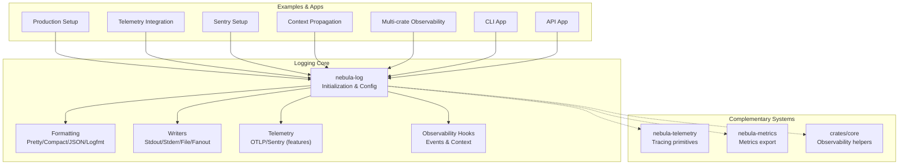
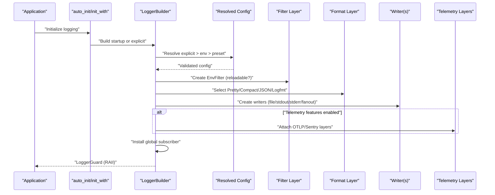
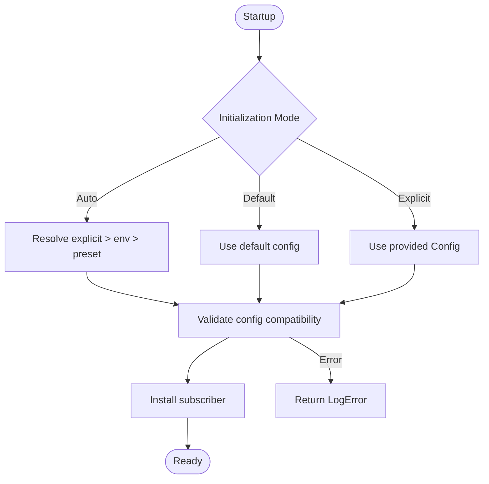
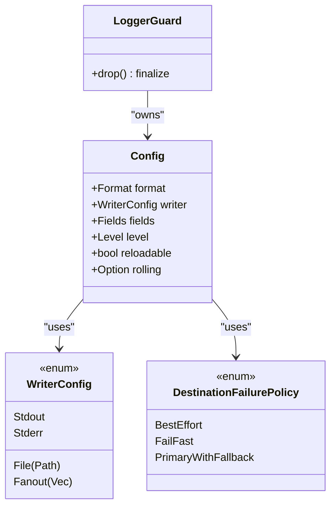
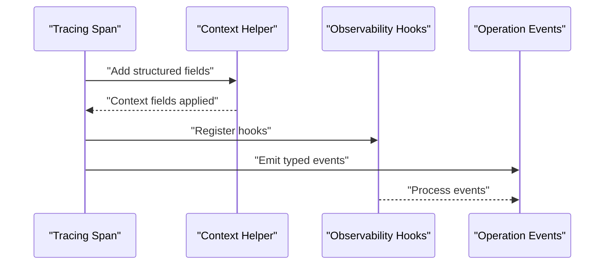
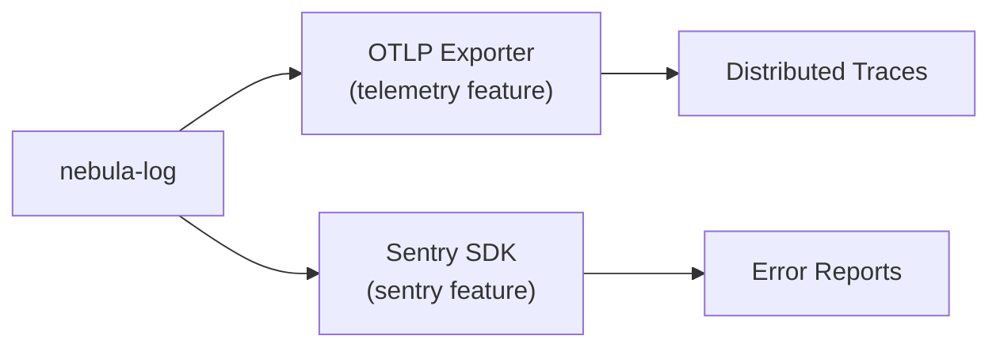
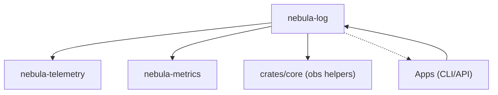

# Logging and Observability

<cite>
**Referenced Files in This Document**
- [crates/log/README.md](file://crates/log/README.md)
- [crates/log/docs/README.md](file://crates/log/docs/README.md)
- [crates/log/docs/API.md](file://crates/log/docs/API.md)
- [crates/log/docs/ARCHITECTURE.md](file://crates/log/docs/ARCHITECTURE.md)
- [crates/log/src/lib.rs](file://crates/log/src/lib.rs)
- [crates/log/examples/production.rs](file://crates/log/examples/production.rs)
- [crates/log/examples/telemetry_integration.rs](file://crates/log/examples/telemetry_integration.rs)
- [crates/log/examples/sentry_setup.rs](file://crates/log/examples/sentry_setup.rs)
- [crates/log/examples/context_propagation.rs](file://crates/log/examples/context_propagation.rs)
- [crates/log/examples/multi_crate_observability.rs](file://crates/log/examples/multi_crate_observability.rs)
- [crates/log/examples/observability_hooks.rs](file://crates/log/examples/observability_hooks.rs)
- [crates/log/examples/otlp_setup.rs](file://crates/log/examples/otlp_setup.rs)
- [crates/log/examples/file_logging.rs](file://crates/log/examples/file_logging.rs)
- [crates/log/tests/integration_tests.rs](file://crates/log/tests/integration_tests.rs)
- [crates/log/tests/config_precedence.rs](file://crates/log/tests/config_precedence.rs)
- [crates/log/tests/init_hardening.rs](file://crates/log/tests/init_hardening.rs)
- [crates/log/tests/writer_fanout.rs](file://crates/log/tests/writer_fanout.rs)
- [crates/log/tests/hook_policy.rs](file://crates/log/tests/hook_policy.rs)
- [crates/telemetry/src/lib.rs](file://crates/telemetry/src/lib.rs)
- [crates/metrics/src/lib.rs](file://crates/metrics/src/lib.rs)
- [crates/core/src/obs.rs](file://crates/core/src/obs.rs)
- [deploy/docker/docker-compose.observability.yml](file://deploy/docker/docker-compose.observability.yml)
- [deploy/docker/otel-collector-config.yaml](file://deploy/docker/otel-collector-config.yaml)
- [apps/cli/src/main.rs](file://apps/cli/src/main.rs)
- [apps/cli/src/config.rs](file://apps/cli/src/config.rs)
- [apps/api/src/app.rs](file://apps/api/src/app.rs)
- [apps/api/src/state.rs](file://apps/api/src/state.rs)
</cite>

## Table of Contents
1. [Introduction](#introduction)
2. [Project Structure](#project-structure)
3. [Core Components](#core-components)
4. [Architecture Overview](#architecture-overview)
5. [Detailed Component Analysis](#detailed-component-analysis)
6. [Dependency Analysis](#dependency-analysis)
7. [Performance Considerations](#performance-considerations)
8. [Troubleshooting Guide](#troubleshooting-guide)
9. [Conclusion](#conclusion)
10. [Appendices](#appendices)

## Introduction
This document explains Nebula's logging and observability infrastructure with a focus on structured logging, configuration management, and observability hooks. It covers how logging is initialized, configured, and integrated with tracing spans, metrics, and error reporting systems. The content is designed to be accessible to beginners while providing sufficient technical depth for experienced developers building comprehensive observability solutions.

Nebula centralizes logging through a single tracing subscriber pipeline that ensures consistent structured fields, safe secret handling, and flexible output formats. The logging crate supports development-friendly pretty output and production-grade JSON/logfmt with file writers and rolling policies. Optional integrations include OpenTelemetry OTLP and Sentry for distributed tracing and error reporting.

## Project Structure
The logging and observability system spans several crates and example workloads:

- Core logging crate: centralized initialization, configuration, formatting, writers, and observability hooks
- Telemetry and metrics crates: complementary systems for distributed tracing and metrics export
- Examples: practical demonstrations of logging setup, configuration, and observability integration
- Tests: validation of precedence, reliability, and integration behavior
- Deployment assets: Docker Compose and OpenTelemetry Collector configuration for production observability

**Diagram sources**
- [crates/log/src/lib.rs:192-261](file://crates/log/src/lib.rs#L192-L261)
- [crates/log/docs/ARCHITECTURE.md:26-46](file://crates/log/docs/ARCHITECTURE.md#L26-L46)
- [crates/telemetry/src/lib.rs](file://crates/telemetry/src/lib.rs)
- [crates/metrics/src/lib.rs](file://crates/metrics/src/lib.rs)
- [crates/core/src/obs.rs](file://crates/core/src/obs.rs)

**Section sources**
- [crates/log/docs/README.md:20-33](file://crates/log/docs/README.md#L20-L33)
- [crates/log/docs/ARCHITECTURE.md:9-24](file://crates/log/docs/ARCHITECTURE.md#L9-L24)

## Core Components
This section outlines the primary building blocks of Nebula's logging and observability system.

- Initialization APIs
  - Zero-config auto-initialization with environment and preset fallback
  - Explicit configuration for deterministic production setups
  - Test initialization with capture behavior

- Configuration system
  - Presets for development and production
  - Environment variable precedence over presets
  - Structured fields for service, environment, version, instance, region
  - Writer configuration supporting stdout, stderr, file, and fanout
  - Rolling policies for file writers
  - Runtime reload capability for log levels

- Formatting and writers
  - Multiple output formats: pretty, compact, JSON, logfmt
  - Writer failure policies: best-effort, fail-fast, primary-with-fallback
  - Asynchronous file writing for performance

- Observability hooks and context
  - Typed operation events and hook registration
  - Context propagation helpers for structured fields
  - Integration points for metrics and tracing

- Telemetry integrations
  - OpenTelemetry OTLP exporter (feature-gated)
  - Sentry integration (feature-gated)
  - Environment-driven configuration for both

- Timing utilities
  - Timer and timed instrumentation helpers

**Section sources**
- [crates/log/src/lib.rs:192-261](file://crates/log/src/lib.rs#L192-L261)
- [crates/log/docs/API.md:5-68](file://crates/log/docs/API.md#L5-L68)
- [crates/log/README.md:29-41](file://crates/log/README.md#L29-L41)

## Architecture Overview
The logging pipeline follows a deterministic build order that resolves configuration, validates compatibility, constructs layers, and installs a global tracing subscriber. Optional telemetry layers integrate OTLP and Sentry when enabled.

**Diagram sources**
- [crates/log/docs/ARCHITECTURE.md:26-46](file://crates/log/docs/ARCHITECTURE.md#L26-L46)
- [crates/log/src/lib.rs:192-261](file://crates/log/src/lib.rs#L192-L261)

**Section sources**
- [crates/log/docs/ARCHITECTURE.md:26-60](file://crates/log/docs/ARCHITECTURE.md#L26-L60)

## Detailed Component Analysis

### Logging Configuration System
Nebula's logging configuration supports three modes:
- Auto-initialization: resolves explicit config, environment variables, and presets in order
- Default initialization: compact format at info level to stderr
- Explicit initialization: full control over format, writer, fields, and telemetry

Environment variables drive configuration with a documented precedence. Structured fields are standardized for observability consistency.

**Diagram sources**
- [crates/log/docs/API.md:12-19](file://crates/log/docs/API.md#L12-L19)
- [crates/log/src/lib.rs:192-261](file://crates/log/src/lib.rs#L192-L261)

**Section sources**
- [crates/log/docs/API.md:12-19](file://crates/log/docs/API.md#L12-L19)
- [crates/log/docs/API.md:55-68](file://crates/log/docs/API.md#L55-L68)
- [crates/log/src/lib.rs:90-107](file://crates/log/src/lib.rs#L90-L107)

### Dynamic Reloading and File Writers
The logging system supports runtime log-level changes and optional file rolling. Writers can fan out to multiple destinations with failure policies. Async file writing is enabled by default for performance.

**Diagram sources**
- [crates/log/src/lib.rs:159-164](file://crates/log/src/lib.rs#L159-L164)
- [crates/log/docs/API.md:30-36](file://crates/log/docs/API.md#L30-L36)

**Section sources**
- [crates/log/src/lib.rs:73-77](file://crates/log/src/lib.rs#L73-L77)
- [crates/log/docs/API.md:30-36](file://crates/log/docs/API.md#L30-L36)

### Observability Hooks and Context Propagation
The observability module provides typed operation events, hook registration, and context helpers. Context propagation allows structured fields to be attached consistently across spans and logs.

**Diagram sources**
- [crates/log/src/lib.rs:163-164](file://crates/log/src/lib.rs#L163-L164)
- [crates/log/src/lib.rs:171-178](file://crates/log/src/lib.rs#L171-L178)

**Section sources**
- [crates/log/src/lib.rs:163-179](file://crates/log/src/lib.rs#L163-L179)

### Telemetry Integration (OpenTelemetry and Sentry)
Optional telemetry integrations enable exporting traces and error reports. Configuration is driven by environment variables when features are enabled.

**Diagram sources**
- [crates/log/src/lib.rs:86-88](file://crates/log/src/lib.rs#L86-L88)
- [crates/log/src/lib.rs:98-106](file://crates/log/src/lib.rs#L98-L106)

**Section sources**
- [crates/log/src/lib.rs:86-88](file://crates/log/src/lib.rs#L86-L88)
- [crates/log/src/lib.rs:98-106](file://crates/log/src/lib.rs#L98-L106)

### Practical Examples from the Codebase
The logging crate includes numerous examples demonstrating real-world usage patterns:

- Production logging setup with explicit configuration
- Telemetry integration with OTLP and Sentry
- Context propagation across spans and logs
- Multi-crate observability patterns
- File logging with rolling policies

These examples serve as concrete references for implementing logging and observability in applications.

**Section sources**
- [crates/log/examples/production.rs](file://crates/log/examples/production.rs)
- [crates/log/examples/telemetry_integration.rs](file://crates/log/examples/telemetry_integration.rs)
- [crates/log/examples/context_propagation.rs](file://crates/log/examples/context_propagation.rs)
- [crates/log/examples/multi_crate_observability.rs](file://crates/log/examples/multi_crate_observability.rs)
- [crates/log/examples/file_logging.rs](file://crates/log/examples/file_logging.rs)

## Dependency Analysis
The logging crate is intentionally lightweight and cross-cutting, with feature-gated optional dependencies to minimize footprint. It integrates with complementary crates for telemetry and metrics.

**Diagram sources**
- [crates/log/README.md:61-64](file://crates/log/README.md#L61-L64)
- [crates/telemetry/src/lib.rs](file://crates/telemetry/src/lib.rs)
- [crates/metrics/src/lib.rs](file://crates/metrics/src/lib.rs)
- [crates/core/src/obs.rs](file://crates/core/src/obs.rs)

**Section sources**
- [crates/log/README.md:61-64](file://crates/log/README.md#L61-L64)

## Performance Considerations
- Asynchronous file writing is enabled by default to reduce blocking during log writes
- Writer fanout allows distributing logs across multiple destinations with configurable failure policies
- Runtime reload avoids restarts for log-level changes
- Structured logging with consistent fields improves downstream processing efficiency
- Telemetry integrations are feature-gated to avoid unnecessary overhead in non-enabled environments

[No sources needed since this section provides general guidance]

## Troubleshooting Guide
Common issues and remedies:

- Already initialized dispatcher
  - Symptom: initialization returns an error indicating logging is already set
  - Resolution: use auto-initialization or treat the "already initialized" variant as success for idempotent setups

- Invalid filter directives
  - Symptom: filter parsing errors during initialization
  - Resolution: validate filter expressions and environment variable values

- Writer initialization failures
  - Symptom: errors when creating file writers or fanout destinations
  - Resolution: check file permissions, paths, and disk availability

- Telemetry setup failures
  - Symptom: OTLP or Sentry layers fail to attach
  - Resolution: verify environment variables and endpoint reachability; disable features when not needed

**Section sources**
- [crates/log/src/lib.rs:250-259](file://crates/log/src/lib.rs#L250-L259)
- [crates/log/docs/API.md:46-53](file://crates/log/docs/API.md#L46-L53)

## Conclusion
Nebula's logging and observability infrastructure provides a robust, configurable, and production-ready foundation for structured logging, tracing, and error reporting. By centralizing initialization and enforcing consistent field semantics, it simplifies deployment across environments while enabling powerful integrations with modern observability backends.

[No sources needed since this section summarizes without analyzing specific files]

## Appendices

### A. Environment Variables and Feature Flags
Key environment variables and feature flags that control logging behavior:

- Environment variables
  - Log level/filter: NEBULA_LOG, RUST_LOG
  - Format selection: NEBULA_LOG_FORMAT
  - Display options: NEBULA_LOG_TIME, NEBULA_LOG_SOURCE, NEBULA_LOG_COLORS
  - Structured fields: NEBULA_SERVICE, NEBULA_ENV, NEBULA_VERSION, NEBULA_INSTANCE, NEBULA_REGION
  - Telemetry: OTEL_EXPORTER_OTLP_ENDPOINT, SENTRY_DSN, SENTRY_ENV, SENTRY_RELEASE, SENTRY_TRACES_SAMPLE_RATE

- Feature flags
  - default: ansi, async
  - file: file writer + rolling support
  - log-compat: bridge log crate events into tracing
  - telemetry: OpenTelemetry OTLP tracing
  - sentry: Sentry integration
  - full: all major capabilities

**Section sources**
- [crates/log/README.md:78-87](file://crates/log/README.md#L78-L87)
- [crates/log/src/lib.rs:81-89](file://crates/log/src/lib.rs#L81-L89)

### B. Integration Patterns in Applications
Applications integrate logging through initialization calls and configuration management:

- CLI application
  - Initializes logging early in main
  - Uses configuration modules to manage environment-driven settings

- API application
  - Integrates logging with application state and middleware
  - Leverages observability hooks for domain events

**Section sources**
- [apps/cli/src/main.rs](file://apps/cli/src/main.rs)
- [apps/cli/src/config.rs](file://apps/cli/src/config.rs)
- [apps/api/src/app.rs](file://apps/api/src/app.rs)
- [apps/api/src/state.rs](file://apps/api/src/state.rs)

### C. Production Logging Strategies and Deployment
Production-grade logging strategies supported by the logging crate:

- Structured output formats suitable for log aggregation
- File writers with rolling policies for persistent logs
- Centralized observability stack with OpenTelemetry Collector
- Environment-driven configuration with clear precedence

Operational monitoring and log aggregation are facilitated by standardized fields and formats.

**Section sources**
- [crates/log/docs/OPERATIONS.md](file://crates/log/docs/OPERATIONS.md)
- [deploy/docker/docker-compose.observability.yml](file://deploy/docker/docker-compose.observability.yml)
- [deploy/docker/otel-collector-config.yaml](file://deploy/docker/otel-collector-config.yaml)