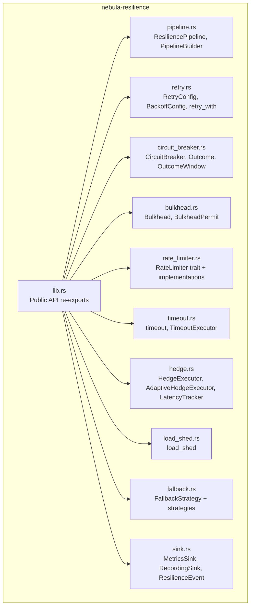
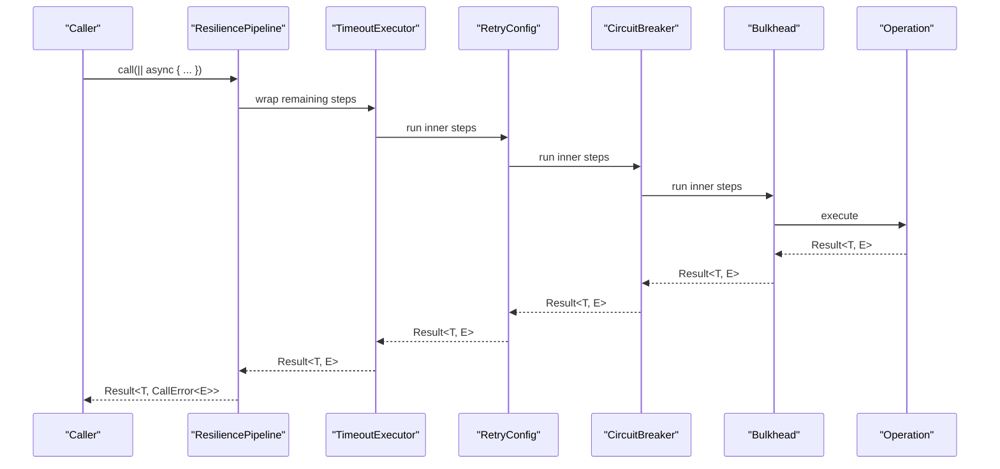
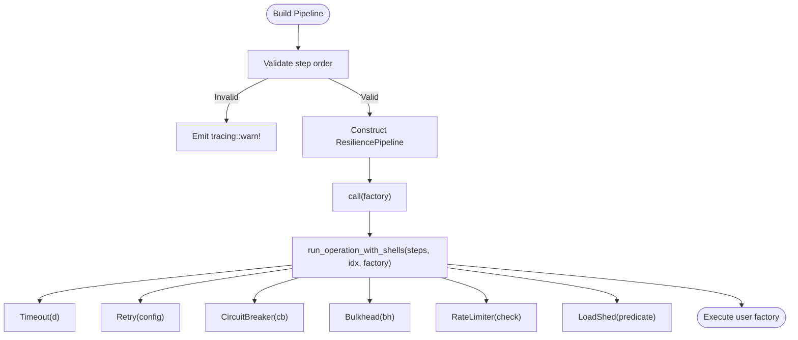
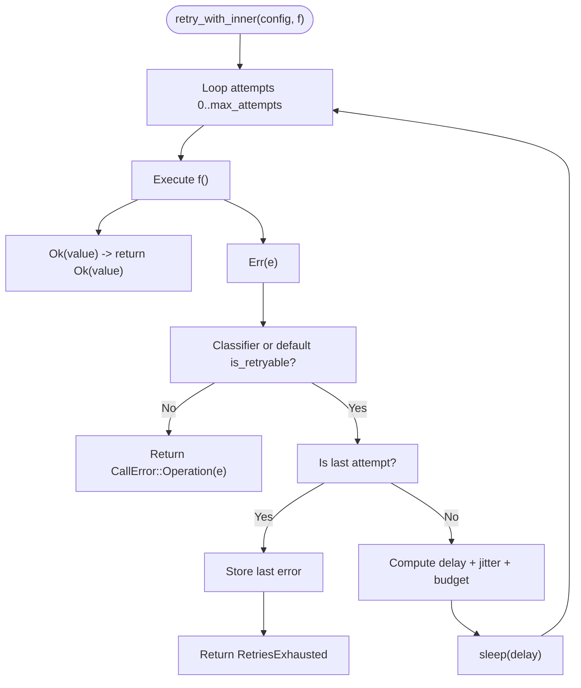
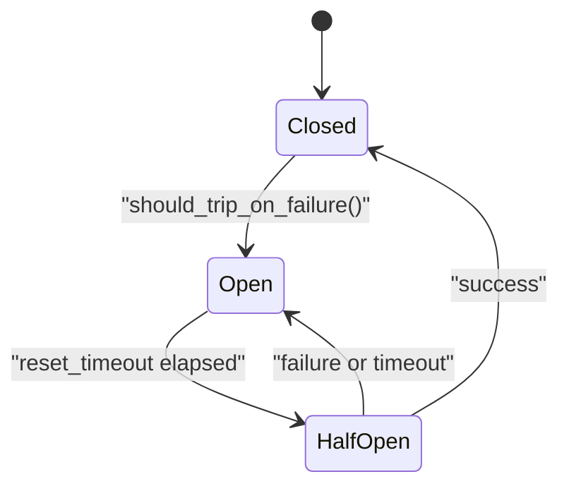
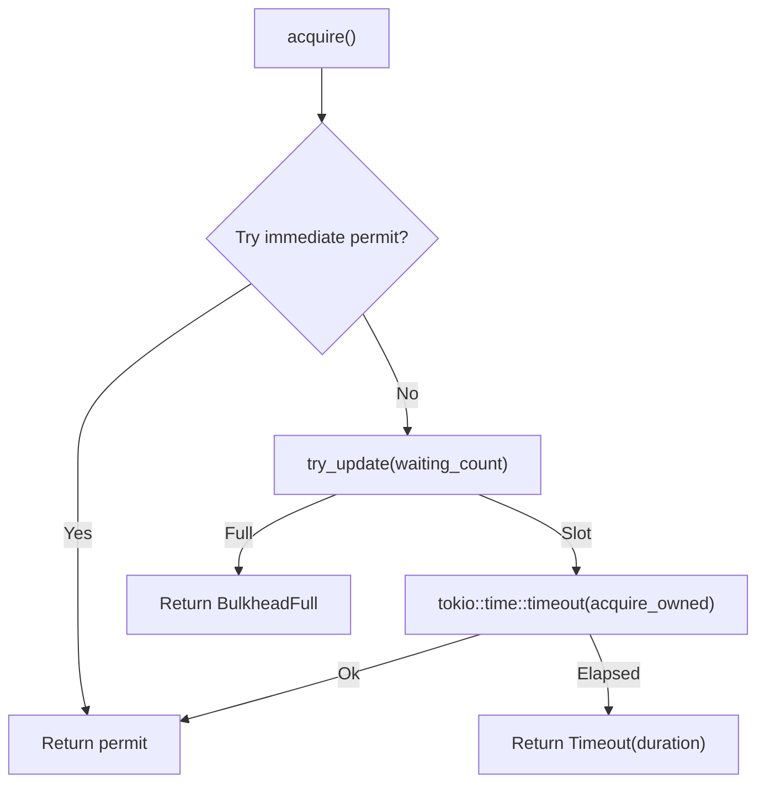
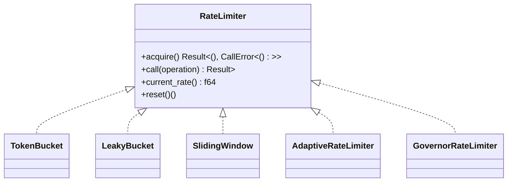
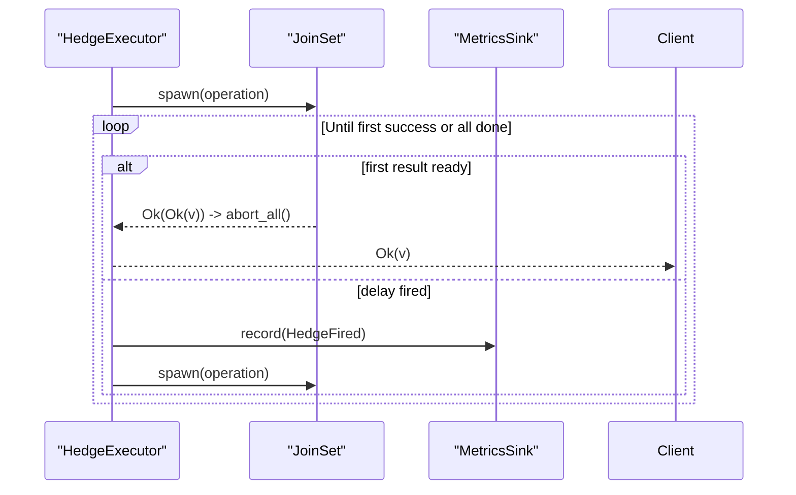
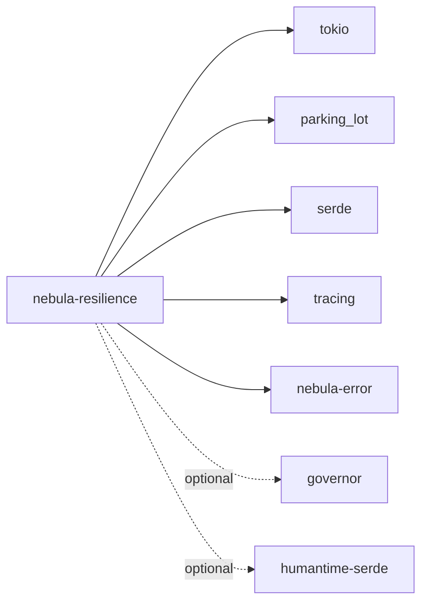

# Resilience Patterns

<cite>
**Referenced Files in This Document**
- [lib.rs](file://crates/resilience/src/lib.rs)
- [Cargo.toml](file://crates/resilience/Cargo.toml)
- [architecture.md](file://crates/resilience/docs/architecture.md)
- [composition.md](file://crates/resilience/docs/composition.md)
- [pipeline.rs](file://crates/resilience/src/pipeline.rs)
- [retry.rs](file://crates/resilience/src/retry.rs)
- [circuit_breaker.rs](file://crates/resilience/src/circuit_breaker.rs)
- [bulkhead.rs](file://crates/resilience/src/bulkhead.rs)
- [rate_limiter.rs](file://crates/resilience/src/rate_limiter.rs)
- [timeout.rs](file://crates/resilience/src/timeout.rs)
- [hedge.rs](file://crates/resilience/src/hedge.rs)
- [load_shed.rs](file://crates/resilience/src/load_shed.rs)
- [fallback.rs](file://crates/resilience/src/fallback.rs)
- [sink.rs](file://crates/resilience/src/sink.rs)
</cite>

## Table of Contents
1. [Introduction](#introduction)
2. [Project Structure](#project-structure)
3. [Core Components](#core-components)
4. [Architecture Overview](#architecture-overview)
5. [Detailed Component Analysis](#detailed-component-analysis)
6. [Dependency Analysis](#dependency-analysis)
7. [Performance Considerations](#performance-considerations)
8. [Troubleshooting Guide](#troubleshooting-guide)
9. [Conclusion](#conclusion)
10. [Appendices](#appendices)

## Introduction
This document explains Nebula’s resilience patterns and the canonical resilience pipeline used to build robust, fault-tolerant outbound calls in actions and services. It covers retry strategies, circuit breakers, rate limiting, bulkhead isolation, timeout management, hedge requests, load shedding, and fallback mechanisms. It documents the policy-based configuration approach, error classification for retries, adaptive failure detection, observability and metrics, and operational controls. Practical examples show how to construct and integrate resilience pipelines across system layers.

## Project Structure
The resilience crate exposes a composable pipeline and standalone patterns. The public API is re-exported from the library module, and the docs describe the architecture and composition model.

**Diagram sources**
- [lib.rs:152-184](file://crates/resilience/src/lib.rs#L152-L184)
- [pipeline.rs:42-51](file://crates/resilience/src/pipeline.rs#L42-L51)
- [retry.rs:19-52](file://crates/resilience/src/retry.rs#L19-L52)
- [circuit_breaker.rs:20-49](file://crates/resilience/src/circuit_breaker.rs#L20-L49)
- [bulkhead.rs:20-29](file://crates/resilience/src/bulkhead.rs#L20-L29)
- [rate_limiter.rs:38-77](file://crates/resilience/src/rate_limiter.rs#L38-L77)
- [timeout.rs:12-26](file://crates/resilience/src/timeout.rs#L12-L26)
- [hedge.rs:28-49](file://crates/resilience/src/hedge.rs#L28-L49)
- [load_shed.rs:7-16](file://crates/resilience/src/load_shed.rs#L7-L16)
- [fallback.rs:25-41](file://crates/resilience/src/fallback.rs#L25-L41)
- [sink.rs:78-85](file://crates/resilience/src/sink.rs#L78-L85)

**Section sources**
- [lib.rs:1-184](file://crates/resilience/src/lib.rs#L1-L184)
- [Cargo.toml:1-112](file://crates/resilience/Cargo.toml#L1-L112)

## Core Components
- ResiliencePipeline and PipelineBuilder: Compose patterns in a strict order and execute them recursively.
- Retry: Configurable backoff, jitter, total budget, and classifier-driven decisions.
- CircuitBreaker: Adaptive thresholds with sliding windows, slow call detection, and state transitions.
- Bulkhead: Semaphore-based concurrency and queueing with optional timeouts.
- RateLimiter: Token bucket, leaky bucket, sliding window, adaptive limiter, and optional GCRA via governor.
- Timeout: Deadline enforcement around futures with event emission.
- Hedge: Duplicate speculative requests with fixed or adaptive delays.
- LoadShed: Immediate rejection based on a predicate.
- Fallback: Strategies to gracefully degrade on failure.
- MetricsSink: Event sink for observability; RecordingSink for tests.

**Section sources**
- [lib.rs:100-119](file://crates/resilience/src/lib.rs#L100-L119)
- [pipeline.rs:42-51](file://crates/resilience/src/pipeline.rs#L42-L51)
- [retry.rs:132-160](file://crates/resilience/src/retry.rs#L132-L160)
- [circuit_breaker.rs:18-67](file://crates/resilience/src/circuit_breaker.rs#L18-L67)
- [bulkhead.rs:20-39](file://crates/resilience/src/bulkhead.rs#L20-L39)
- [rate_limiter.rs:38-77](file://crates/resilience/src/rate_limiter.rs#L38-L77)
- [timeout.rs:12-26](file://crates/resilience/src/timeout.rs#L12-L26)
- [hedge.rs:28-49](file://crates/resilience/src/hedge.rs#L28-L49)
- [load_shed.rs:7-16](file://crates/resilience/src/load_shed.rs#L7-L16)
- [fallback.rs:25-41](file://crates/resilience/src/fallback.rs#L25-L41)
- [sink.rs:78-85](file://crates/resilience/src/sink.rs#L78-L85)

## Architecture Overview
The resilience pipeline enforces a recommended order: timeout → retry → circuit breaker → bulkhead. Each step is a single-pass, recursive execution that wraps the remainder of the pipeline. Patterns emit typed events to a MetricsSink for observability.

**Diagram sources**
- [pipeline.rs:323-386](file://crates/resilience/src/pipeline.rs#L323-L386)
- [timeout.rs:21-26](file://crates/resilience/src/timeout.rs#L21-L26)
- [retry.rs:302-315](file://crates/resilience/src/retry.rs#L302-L315)
- [circuit_breaker.rs:547-560](file://crates/resilience/src/circuit_breaker.rs#L547-L560)
- [bulkhead.rs:134-140](file://crates/resilience/src/bulkhead.rs#L134-L140)

**Section sources**
- [architecture.md:238-304](file://crates/resilience/docs/architecture.md#L238-L304)
- [composition.md:20-35](file://crates/resilience/docs/composition.md#L20-L35)

## Detailed Component Analysis

### ResiliencePipeline and Composition
- Builder collects steps in order; build() validates ordering and returns a pipeline.
- Recommended order: timeout → retry → circuit_breaker → bulkhead.
- Rate limiter and load shed can be inserted earlier to preempt expensive operations.
- The pipeline wraps each step with a Box::pin and recurses through steps.

**Diagram sources**
- [pipeline.rs:169-176](file://crates/resilience/src/pipeline.rs#L169-L176)
- [pipeline.rs:323-386](file://crates/resilience/src/pipeline.rs#L323-L386)
- [composition.md:168-250](file://crates/resilience/docs/composition.md#L168-L250)

**Section sources**
- [pipeline.rs:55-176](file://crates/resilience/src/pipeline.rs#L55-L176)
- [pipeline.rs:310-386](file://crates/resilience/src/pipeline.rs#L310-L386)
- [composition.md:20-35](file://crates/resilience/docs/composition.md#L20-L35)

### Retry Pattern
- BackoffConfig supports Fixed, Linear, Exponential, Fibonacci, and Custom sequences.
- JitterConfig adds variance to backoff delays.
- RetryConfig supports total budget, classifier override, and on_retry callbacks.
- retry_with uses Classify::is_retryable() by default; pipeline retry integrates with a classifier and bail mechanism to avoid retrying structural errors.

**Diagram sources**
- [retry.rs:331-418](file://crates/resilience/src/retry.rs#L331-L418)
- [pipeline.rs:410-474](file://crates/resilience/src/pipeline.rs#L410-L474)

**Section sources**
- [retry.rs:19-113](file://crates/resilience/src/retry.rs#L19-L113)
- [retry.rs:132-282](file://crates/resilience/src/retry.rs#L132-L282)
- [retry.rs:331-418](file://crates/resilience/src/retry.rs#L331-L418)
- [pipeline.rs:410-474](file://crates/resilience/src/pipeline.rs#L410-L474)

### Circuit Breaker
- Configurable thresholds, reset timeout, slow call detection, and sliding window failure rate.
- Outcome classification maps ErrorClass to Success/Failure/Timeout/Cancelled.
- State transitions: Closed → Open (after failures/min operations), Open → HalfOpen (after reset timeout), HalfOpen → Closed on success or back to Open on failure.
- Supports adaptive break duration multiplier and caps.

**Diagram sources**
- [circuit_breaker.rs:152-157](file://crates/resilience/src/circuit_breaker.rs#L152-L157)
- [circuit_breaker.rs:615-658](file://crates/resilience/src/circuit_breaker.rs#L615-L658)
- [circuit_breaker.rs:688-726](file://crates/resilience/src/circuit_breaker.rs#L688-L726)

**Section sources**
- [circuit_breaker.rs:20-67](file://crates/resilience/src/circuit_breaker.rs#L20-L67)
- [circuit_breaker.rs:114-148](file://crates/resilience/src/circuit_breaker.rs#L114-L148)
- [circuit_breaker.rs:615-658](file://crates/resilience/src/circuit_breaker.rs#L615-L658)
- [circuit_breaker.rs:727-800](file://crates/resilience/src/circuit_breaker.rs#L727-L800)

### Bulkhead Isolation
- Semaphore-based concurrency with optional queue and timeout.
- Acquire returns a permit; dropping the permit releases the slot.
- Emits BulkheadRejected events via MetricsSink.

**Diagram sources**
- [bulkhead.rs:159-213](file://crates/resilience/src/bulkhead.rs#L159-L213)

**Section sources**
- [bulkhead.rs:20-39](file://crates/resilience/src/bulkhead.rs#L20-L39)
- [bulkhead.rs:159-213](file://crates/resilience/src/bulkhead.rs#L159-L213)
- [bulkhead.rs:249-273](file://crates/resilience/src/bulkhead.rs#L249-L273)

### Rate Limiting
- RateLimiter trait defines acquire(), call(), current_rate(), and reset().
- Implementations:
  - TokenBucket: refill rate and burst size with atomic updates.
  - LeakyBucket: constant leak rate.
  - SlidingWindow: count-based within a time window.
  - AdaptiveRateLimiter: adjusts refill rate based on error/success ratios.
  - GovernorRateLimiter (optional): GCRA via governor feature.

**Diagram sources**
- [rate_limiter.rs:38-77](file://crates/resilience/src/rate_limiter.rs#L38-L77)
- [rate_limiter.rs:101-183](file://crates/resilience/src/rate_limiter.rs#L101-L183)
- [rate_limiter.rs:254-297](file://crates/resilience/src/rate_limiter.rs#L254-L297)
- [rate_limiter.rs:354-446](file://crates/resilience/src/rate_limiter.rs#L354-L446)
- [rate_limiter.rs:467-620](file://crates/resilience/src/rate_limiter.rs#L467-L620)
- [rate_limiter.rs:702-781](file://crates/resilience/src/rate_limiter.rs#L702-L781)

**Section sources**
- [rate_limiter.rs:38-77](file://crates/resilience/src/rate_limiter.rs#L38-L77)
- [rate_limiter.rs:101-183](file://crates/resilience/src/rate_limiter.rs#L101-L183)
- [rate_limiter.rs:254-297](file://crates/resilience/src/rate_limiter.rs#L254-L297)
- [rate_limiter.rs:354-446](file://crates/resilience/src/rate_limiter.rs#L354-L446)
- [rate_limiter.rs:467-620](file://crates/resilience/src/rate_limiter.rs#L467-L620)
- [rate_limiter.rs:702-781](file://crates/resilience/src/rate_limiter.rs#L702-L781)

### Timeout Management
- timeout() wraps a future with tokio::time::timeout and returns CallError::Timeout on expiry.
- TimeoutExecutor encapsulates duration and sink for structured execution.

**Section sources**
- [timeout.rs:12-49](file://crates/resilience/src/timeout.rs#L12-L49)
- [timeout.rs:51-94](file://crates/resilience/src/timeout.rs#L51-L94)

### Hedge Requests
- HedgeExecutor sends duplicate requests after a delay and returns the first success.
- AdaptiveHedgeExecutor computes hedge delay from latency percentiles with a LatencyTracker.
- Emits HedgeFired events.

**Diagram sources**
- [hedge.rs:129-187](file://crates/resilience/src/hedge.rs#L129-L187)
- [hedge.rs:276-310](file://crates/resilience/src/hedge.rs#L276-L310)

**Section sources**
- [hedge.rs:78-188](file://crates/resilience/src/hedge.rs#L78-L188)
- [hedge.rs:190-311](file://crates/resilience/src/hedge.rs#L190-L311)

### Load Shedding
- load_shed() immediately rejects when predicate returns true, avoiding expensive work.

**Section sources**
- [load_shed.rs:7-26](file://crates/resilience/src/load_shed.rs#L7-L26)

### Fallback Mechanisms
- FallbackStrategy trait defines should_fallback() and fallback().
- Strategies:
  - ValueFallback: return a constant value.
  - FunctionFallback: compute fallback via closure.
  - CacheFallback: serve cached value with TTL and stale-if-error.
  - ChainFallback: chain multiple strategies; first success wins.
  - PriorityFallback: dispatch by CallErrorKind with optional default.
  - FallbackOperation: convenience wrapper around call().

**Section sources**
- [fallback.rs:25-41](file://crates/resilience/src/fallback.rs#L25-L41)
- [fallback.rs:43-73](file://crates/resilience/src/fallback.rs#L43-L73)
- [fallback.rs:75-145](file://crates/resilience/src/fallback.rs#L75-L145)
- [fallback.rs:153-238](file://crates/resilience/src/fallback.rs#L153-L238)
- [fallback.rs:240-301](file://crates/resilience/src/fallback.rs#L240-L301)
- [fallback.rs:303-383](file://crates/resilience/src/fallback.rs#L303-L383)
- [fallback.rs:385-426](file://crates/resilience/src/fallback.rs#L385-L426)

### Observability and Metrics
- MetricsSink trait receives ResilienceEvent with typed kinds for filtering.
- RecordingSink captures events for assertions; NoopSink is zero-cost default.
- Events include circuit state changes, retry attempts, bulkhead rejections, timeouts, hedge firings, rate limit exceeded, and load shed.

**Section sources**
- [sink.rs:22-56](file://crates/resilience/src/sink.rs#L22-L56)
- [sink.rs:78-85](file://crates/resilience/src/sink.rs#L78-L85)
- [sink.rs:95-137](file://crates/resilience/src/sink.rs#L95-L137)

## Dependency Analysis
- The resilience crate depends on tokio, parking_lot, serde, thiserror, tracing, and optional features (governor, humantime-serde).
- No internal dependencies except nebula-error for error classification.
- Pipeline composes patterns via enums and Arc sharing to minimize coupling.

**Diagram sources**
- [Cargo.toml:26-44](file://crates/resilience/Cargo.toml#L26-L44)
- [Cargo.toml:14-25](file://crates/resilience/Cargo.toml#L14-L25)

**Section sources**
- [Cargo.toml:26-44](file://crates/resilience/Cargo.toml#L26-L44)
- [Cargo.toml:14-25](file://crates/resilience/Cargo.toml#L14-L25)

## Performance Considerations
- Backoff and jitter: Prefer exponential backoff with jitter to reduce thundering herd; tune multipliers and caps.
- Retry budget: Use total_budget to bound total retry time including sleeps.
- Circuit breaker: Enable sliding window and slow call thresholds to detect degrading latency; adjust thresholds per workload.
- Bulkhead: Set max_concurrency and queue_size to protect downstream resources; use optional timeout to fail fast.
- Rate limiting: Choose algorithm based on traffic shape; adaptive limiter reduces throughput under high error rates.
- Hedge: Use adaptive hedge with percentile-based delays to balance latency and cost.
- Timeout: Place outermost to enforce a single deadline across all retry attempts; avoid nested timeouts.
- Observability: Use RecordingSink in tests; prefer NoopSink in production to avoid overhead.

[No sources needed since this section provides general guidance]

## Troubleshooting Guide
- Suboptimal step order warnings:
  - Timeout inside retry emits a tracing warning; move timeout before retry for a single deadline.
  - Rate limiter inside retry triggers retries; move rate limiter before retry to reject early.
- Circuit breaker:
  - Verify thresholds and min_operations; confirm slow call thresholds are configured appropriately.
  - Inspect state transitions and consecutive opens for dynamic break duration behavior.
- Retry:
  - Ensure retry_if predicates align with error classification; use classifier override for domain-specific logic.
  - Check total budget to avoid runaway retry loops.
- Bulkhead:
  - Monitor active operations and available permits; investigate queue timeouts and rejections.
- Rate limiting:
  - Validate capacity and refill rates; monitor adaptive limiter adjustments.
- Hedge:
  - Tune hedge_delay and max_hedges; ensure exponential backoff multiplier is ≥ 1.0.
- Timeout:
  - Confirm duration is appropriate for the operation; verify event emission.
- Fallback:
  - Use should_fallback() to restrict fallback to specific error kinds; chain strategies for layered recovery.
- Observability:
  - Use RecordingSink to assert event counts and kinds; map events to dashboards or logs.

**Section sources**
- [pipeline.rs:192-226](file://crates/resilience/src/pipeline.rs#L192-L226)
- [circuit_breaker.rs:615-658](file://crates/resilience/src/circuit_breaker.rs#L615-L658)
- [retry.rs:331-418](file://crates/resilience/src/retry.rs#L331-L418)
- [bulkhead.rs:159-213](file://crates/resilience/src/bulkhead.rs#L159-L213)
- [rate_limiter.rs:467-620](file://crates/resilience/src/rate_limiter.rs#L467-L620)
- [hedge.rs:129-187](file://crates/resilience/src/hedge.rs#L129-L187)
- [timeout.rs:21-49](file://crates/resilience/src/timeout.rs#L21-L49)
- [fallback.rs:25-41](file://crates/resilience/src/fallback.rs#L25-L41)
- [sink.rs:95-137](file://crates/resilience/src/sink.rs#L95-L137)

## Conclusion
Nebula’s resilience patterns provide a robust, composable foundation for building fault-tolerant systems. The ResiliencePipeline enforces a disciplined order, integrates error classification and adaptive detection, and exposes rich observability. By combining retry, circuit breaker, bulkhead, rate limiting, timeout, hedge, load shedding, and fallback, teams can achieve high availability and graceful degradation across diverse workloads and environments.

[No sources needed since this section summarizes without analyzing specific files]

## Appendices

### Policy-Based Configuration and Error Classification
- Use PipelineBuilder.classify_errors() to attach a NebulaClassifier for automatic mapping of ErrorCategory to ErrorClass.
- Override with a custom ErrorClassifier or retry_if predicate for fine-grained retry decisions.
- Adaptive configurations can be supplied via PolicySource<C> for rate limiting and hedge delays.

**Section sources**
- [pipeline.rs:178-190](file://crates/resilience/src/pipeline.rs#L178-L190)
- [retry.rs:219-249](file://crates/resilience/src/retry.rs#L219-L249)
- [architecture.md:132-145](file://crates/resilience/docs/architecture.md#L132-L145)

### Concrete Examples from the Codebase
- Minimal pipeline (retry only): [composition.md:170-179](file://crates/resilience/docs/composition.md#L170-L179)
- Full production stack: [composition.md:180-213](file://crates/resilience/docs/composition.md#L180-L213)
- Sharing a pipeline across tasks: [composition.md:214-232](file://crates/resilience/docs/composition.md#L214-L232)
- Observing events with RecordingSink: [composition.md:233-250](file://crates/resilience/docs/composition.md#L233-L250)
- Quick start with ResiliencePipeline: [lib.rs:31-53](file://crates/resilience/src/lib.rs#L31-L53)
- Standalone patterns (circuit breaker and retry): [lib.rs:55-98](file://crates/resilience/src/lib.rs#L55-L98)

**Section sources**
- [composition.md:168-250](file://crates/resilience/docs/composition.md#L168-L250)
- [lib.rs:31-98](file://crates/resilience/src/lib.rs#L31-L98)