# System Monitoring

<cite>
**Referenced Files in This Document**
- [Cargo.toml](file://crates/system/Cargo.toml)
- [lib.rs](file://crates/system/src/lib.rs)
- [info.rs](file://crates/system/src/info.rs)
- [cpu.rs](file://crates/system/src/cpu.rs)
- [memory.rs](file://crates/system/src/memory.rs)
- [load.rs](file://crates/system/src/load.rs)
- [process.rs](file://crates/system/src/process.rs)
- [network.rs](file://crates/system/src/network.rs)
- [disk.rs](file://crates/system/src/disk.rs)
- [system_load.rs](file://crates/system/benches/system_load.rs)
- [README.md](file://crates/system/README.md)
- [DOCS.md](file://crates/system/DOCS.md)
- [prelude.rs](file://crates/system/src/prelude.rs)
- [integration.rs](file://crates/system/tests/integration.rs)
- [lib.rs](file://crates/metrics/src/lib.rs)
- [basic_metrics.rs](file://crates/telemetry/examples/basic_metrics.rs)
- [custom_observability.rs](file://crates/log/examples/custom_observability.rs)
</cite>

## Table of Contents
1. [Introduction](#introduction)
2. [Project Structure](#project-structure)
3. [Core Components](#core-components)
4. [Architecture Overview](#architecture-overview)
5. [Detailed Component Analysis](#detailed-component-analysis)
6. [Dependency Analysis](#dependency-analysis)
7. [Performance Considerations](#performance-considerations)
8. [Troubleshooting Guide](#troubleshooting-guide)
9. [Conclusion](#conclusion)
10. [Appendices](#appendices)

## Introduction
This document explains Nebula's system-level resource tracking and health monitoring capabilities. It covers how the system gathers CPU utilization, memory usage, network statistics, disk pressure, and process metrics; how it tracks system load and applies pressure thresholds; how platform-specific implementations are organized; and how to integrate monitoring with metrics and observability layers. It also provides guidance on caching, update intervals, performance impact, capacity planning, and operational decision-making.

## Project Structure
The system monitoring layer is implemented in the nebula-system crate, which exposes cross-platform host probes and pressure classifiers. Optional modules (process, network, disk) are gated behind feature flags and backed by the sysinfo crate. The crate intentionally does not emit metrics itself; consumers record metrics using nebula-telemetry and nebula-metrics.

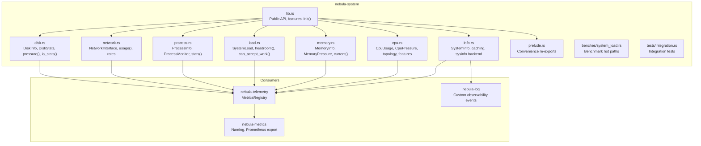

**Diagram sources**
- [lib.rs:1-123](file://crates/system/src/lib.rs#L1-L123)
- [info.rs:1-354](file://crates/system/src/info.rs#L1-L354)
- [cpu.rs:1-450](file://crates/system/src/cpu.rs#L1-L450)
- [memory.rs:1-108](file://crates/system/src/memory.rs#L1-L108)
- [load.rs:1-121](file://crates/system/src/load.rs#L1-L121)
- [process.rs:1-395](file://crates/system/src/process.rs#L1-L395)
- [network.rs:1-347](file://crates/system/src/network.rs#L1-L347)
- [disk.rs:1-379](file://crates/system/src/disk.rs#L1-L379)
- [prelude.rs:1-46](file://crates/system/src/prelude.rs#L1-L46)
- [system_load.rs:1-71](file://crates/system/benches/system_load.rs#L1-L71)
- [integration.rs:472-510](file://crates/system/tests/integration.rs#L472-L510)

**Section sources**
- [Cargo.toml:1-100](file://crates/system/Cargo.toml#L1-L100)
- [lib.rs:1-123](file://crates/system/src/lib.rs#L1-L123)
- [README.md:1-72](file://crates/system/README.md#L1-L72)
- [DOCS.md:1-176](file://crates/system/DOCS.md#L1-L176)

## Core Components
- SystemInfo: Aggregates OS, CPU, memory, and hardware metadata with a cached snapshot and a method to fetch fresh memory stats.
- CPU: Provides per-core and aggregate usage, pressure levels, CPU features, cache info, topology, and optional CPU affinity.
- Memory: Provides current memory usage, usage percent, and MemoryPressure levels.
- Load: Combines CPU and memory pressure into SystemLoad for adaptive worker scaling decisions.
- Process: Lists processes, retrieves per-process stats, and monitors a specific process over time.
- Network: Enumerates interfaces, reports totals, and computes rates with a static cache.
- Disk: Reports filesystem usage, disk pressure, and Linux I/O counters via /sys.

These components are designed to be lightweight and safe to call from hot paths, with careful attention to avoiding allocations where possible.

**Section sources**
- [info.rs:108-141](file://crates/system/src/info.rs#L108-L141)
- [cpu.rs:11-450](file://crates/system/src/cpu.rs#L11-L450)
- [memory.rs:11-108](file://crates/system/src/memory.rs#L11-L108)
- [load.rs:26-121](file://crates/system/src/load.rs#L26-L121)
- [process.rs:18-395](file://crates/system/src/process.rs#L18-L395)
- [network.rs:23-347](file://crates/system/src/network.rs#L23-L347)
- [disk.rs:17-379](file://crates/system/src/disk.rs#L17-L379)

## Architecture Overview
The system layer provides a unified interface across Linux, macOS, and Windows. It relies on sysinfo for cross-platform compatibility and caches expensive reads. Consumers (engine/runtime) poll the system layer at controlled intervals and translate readings into metrics and alerts.

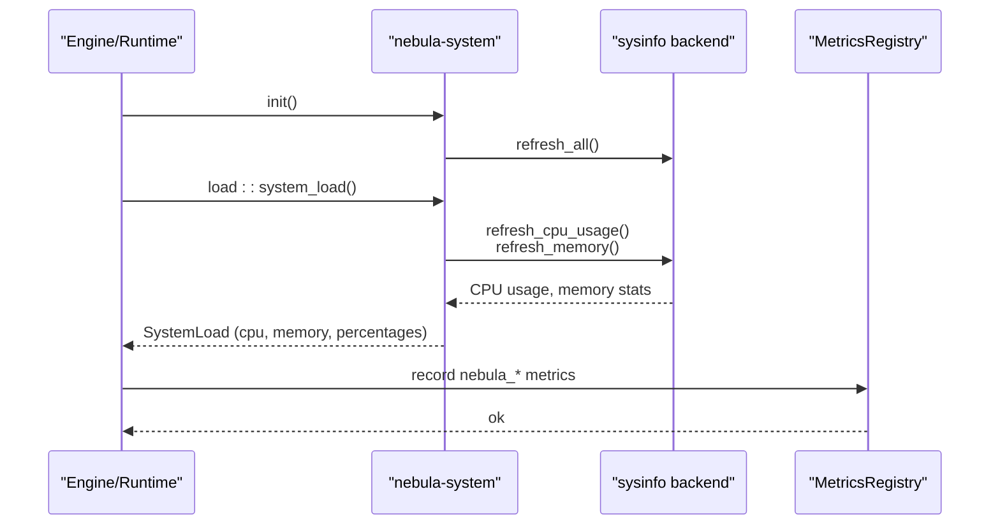

**Diagram sources**
- [lib.rs:114-123](file://crates/system/src/lib.rs#L114-L123)
- [load.rs:72-121](file://crates/system/src/load.rs#L72-L121)
- [info.rs:315-328](file://crates/system/src/info.rs#L315-L328)
- [lib.rs:1-68](file://crates/metrics/src/lib.rs#L1-L68)

## Detailed Component Analysis

### System Information and Caching
- SystemInfo::get returns a cached Arc snapshot for cheap cloning.
- SystemInfo::current_memory forces a sysinfo refresh for fresh memory data.
- Lazy locks initialize sysinfo and caches on first access or during init.

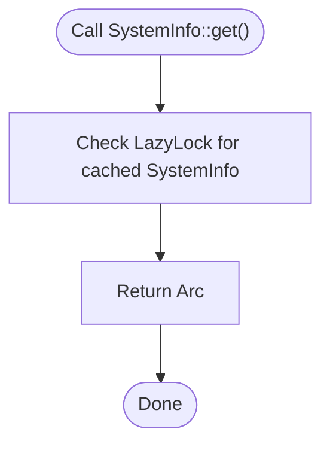

**Diagram sources**
- [info.rs:115-117](file://crates/system/src/info.rs#L115-L117)
- [info.rs:144-145](file://crates/system/src/info.rs#L144-L145)

**Section sources**
- [info.rs:108-141](file://crates/system/src/info.rs#L108-L141)
- [info.rs:144-153](file://crates/system/src/info.rs#L144-L153)
- [info.rs:315-328](file://crates/system/src/info.rs#L315-L328)

### CPU Monitoring and Pressure
- usage(): Computes per-core, average, peak, and cores under pressure in a single pass.
- pressure(): Computes CPU pressure from average usage without allocating per-core vectors.
- CpuPressure thresholds: Low (<50%), Medium (50–70%), High (70–85%), Critical (>85%).

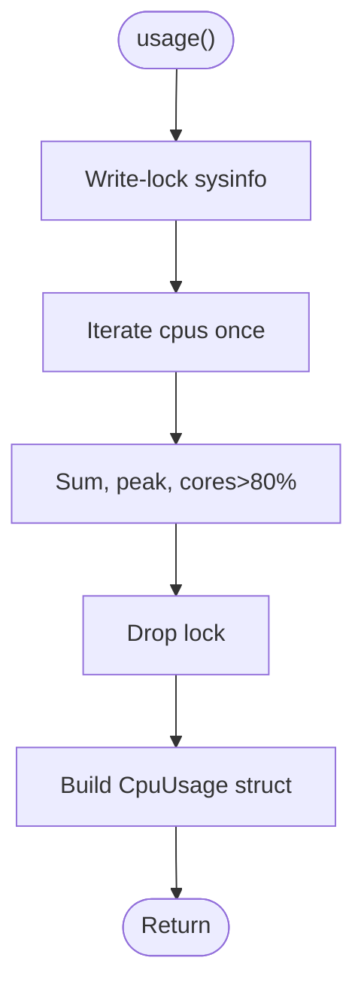

**Diagram sources**
- [cpu.rs:134-185](file://crates/system/src/cpu.rs#L134-L185)

**Section sources**
- [cpu.rs:97-131](file://crates/system/src/cpu.rs#L97-L131)
- [cpu.rs:134-185](file://crates/system/src/cpu.rs#L134-L185)
- [cpu.rs:187-213](file://crates/system/src/cpu.rs#L187-L213)

### Memory Monitoring and Pressure
- current(): Computes used bytes, usage percent (avoiding precision loss), and MemoryPressure.
- MemoryPressure thresholds: Low (<50%), Medium (50–70%), High (70–85%), Critical (>85%).

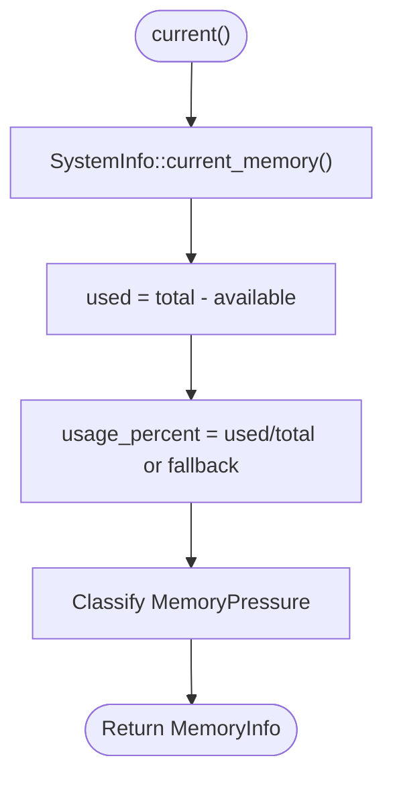

**Diagram sources**
- [memory.rs:55-96](file://crates/system/src/memory.rs#L55-L96)

**Section sources**
- [memory.rs:11-37](file://crates/system/src/memory.rs#L11-L37)
- [memory.rs:55-102](file://crates/system/src/memory.rs#L55-L102)

### System Load and Adaptive Scaling
- SystemLoad combines CPU pressure and memory pressure with percentages.
- can_accept_work(): Returns false if either CPU or memory is High/Critical.
- headroom(): Minimum of CPU and memory headroom fractions.

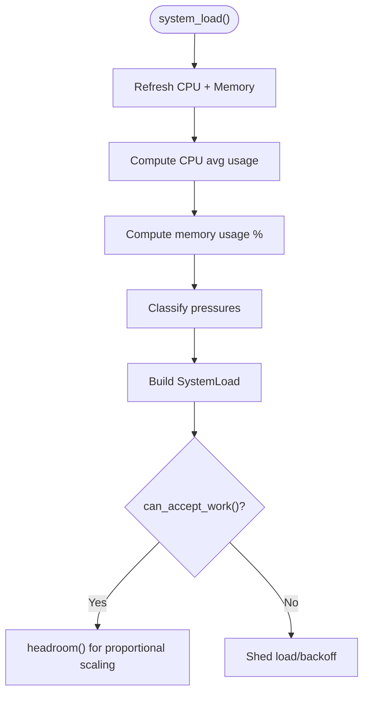

**Diagram sources**
- [load.rs:66-121](file://crates/system/src/load.rs#L66-L121)

**Section sources**
- [load.rs:26-64](file://crates/system/src/load.rs#L26-L64)
- [load.rs:72-121](file://crates/system/src/load.rs#L72-L121)

### Process Monitoring
- list(), get_process(), stats(): Enumerate and query processes via sysinfo.
- ProcessMonitor: Tracks a single PID, updates peak memory, and reports samples.

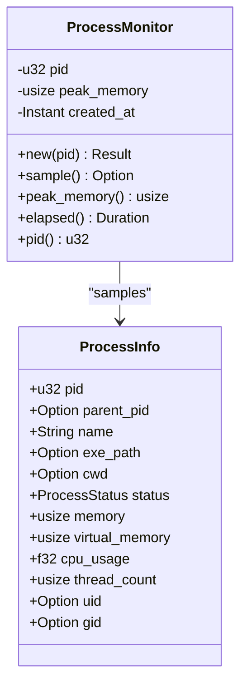

**Diagram sources**
- [process.rs:18-46](file://crates/system/src/process.rs#L18-L46)
- [process.rs:329-394](file://crates/system/src/process.rs#L329-L394)

**Section sources**
- [process.rs:124-182](file://crates/system/src/process.rs#L124-L182)
- [process.rs:293-394](file://crates/system/src/process.rs#L293-L394)

### Network Monitoring
- interfaces(): Lists network interfaces via sysinfo; ip_addresses always empty.
- usage(): Computes per-interface rates using a static cache keyed by interface name.

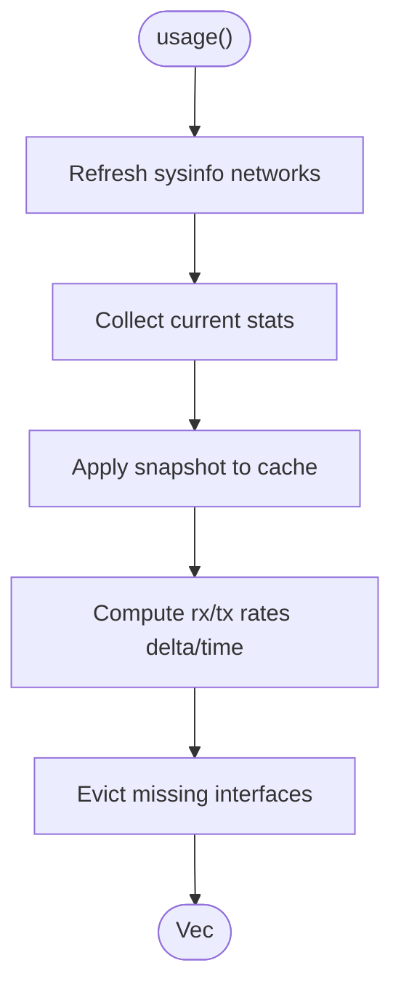

**Diagram sources**
- [network.rs:153-241](file://crates/system/src/network.rs#L153-L241)

**Section sources**
- [network.rs:107-151](file://crates/system/src/network.rs#L107-L151)
- [network.rs:153-241](file://crates/system/src/network.rs#L153-L241)

### Disk Monitoring
- list(), total_usage(): Reports filesystem usage and overall usage percent.
- pressure(): Maps usage percent to DiskPressure.
- io_stats(): Linux-only I/O counters via /sys/block/<device>/stat.

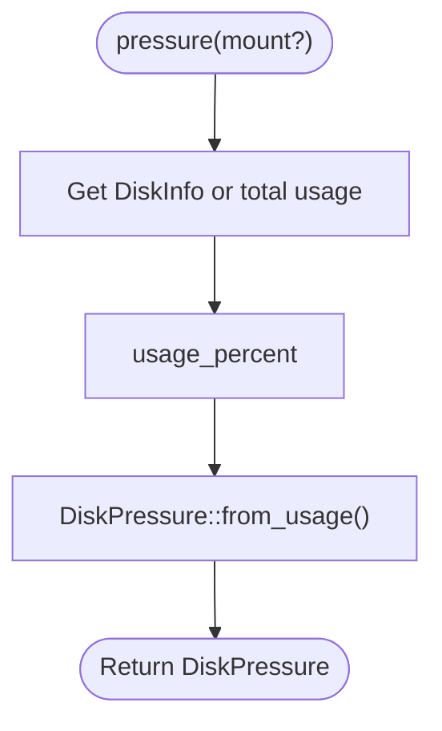

**Diagram sources**
- [disk.rs:275-285](file://crates/system/src/disk.rs#L275-L285)

**Section sources**
- [disk.rs:97-190](file://crates/system/src/disk.rs#L97-L190)
- [disk.rs:241-285](file://crates/system/src/disk.rs#L241-L285)
- [disk.rs:210-239](file://crates/system/src/disk.rs#L210-L239)

### Platform-Specific Implementations
- Linux: Uses /proc for memory/CPU, /sys/block for I/O counters, and /sys/devices/system/node for NUMA.
- macOS: Relies on sysctl/libproc for CPU and process info.
- Windows: Uses sysinfo-provided APIs; huge page size detection and allocation granularity differ.

**Section sources**
- [lib.rs:41-50](file://crates/system/src/lib.rs#L41-L50)
- [info.rs:278-313](file://crates/system/src/info.rs#L278-L313)
- [cpu.rs:254-298](file://crates/system/src/cpu.rs#L254-L298)
- [disk.rs:213-239](file://crates/system/src/disk.rs#L213-L239)

### Metrics Integration and Export
- nebula-system does not emit metrics; consumers record metrics using nebula-telemetry and nebula-metrics.
- Example patterns show registering counters/gauges/histograms and exporting Prometheus text format.

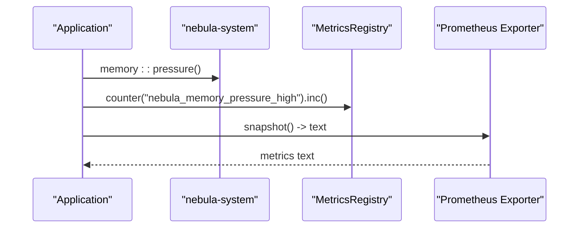

**Diagram sources**
- [lib.rs:1-68](file://crates/metrics/src/lib.rs#L1-L68)
- [basic_metrics.rs:1-33](file://crates/telemetry/examples/basic_metrics.rs#L1-L33)

**Section sources**
- [lib.rs:1-68](file://crates/metrics/src/lib.rs#L1-L68)
- [basic_metrics.rs:1-33](file://crates/telemetry/examples/basic_metrics.rs#L1-L33)

### Health Events and Observability
- nebula-log demonstrates emitting structured observability events with fields for system health.
- These events can carry CPU/memory usage and connection counts for external monitoring.

**Section sources**
- [custom_observability.rs:149-183](file://crates/log/examples/custom_observability.rs#L149-L183)

## Dependency Analysis
- nebula-system depends on sysinfo (optional) and uses parking_lot for synchronization.
- Optional features enable process, network, disk, and serde support.
- Consumers depend on nebula-telemetry for metrics and nebula-metrics for naming/export.

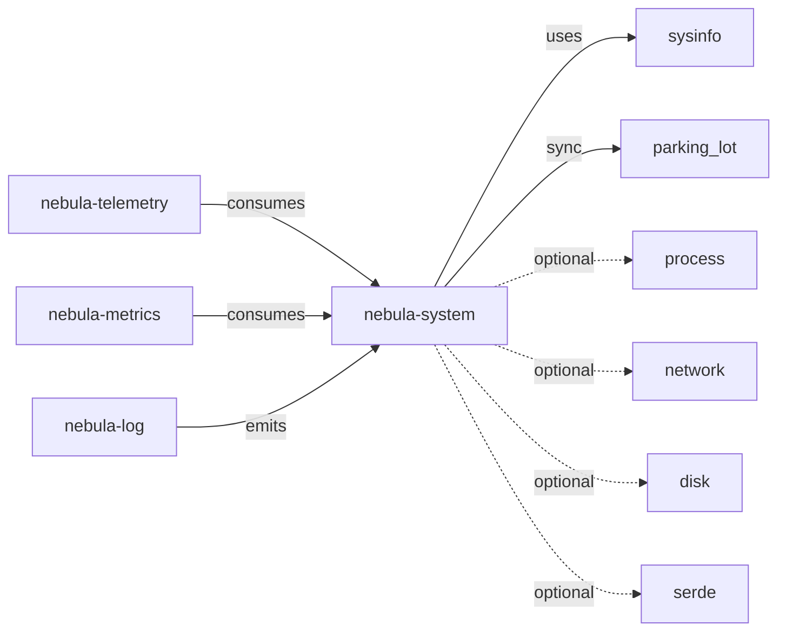

**Diagram sources**
- [Cargo.toml:33-51](file://crates/system/Cargo.toml#L33-L51)
- [lib.rs:76-98](file://crates/system/src/lib.rs#L76-L98)
- [lib.rs:1-68](file://crates/metrics/src/lib.rs#L1-L68)

**Section sources**
- [Cargo.toml:16-47](file://crates/system/Cargo.toml#L16-L47)
- [lib.rs:76-98](file://crates/system/src/lib.rs#L76-L98)

## Performance Considerations
- Hot-path benchmarks measure costs of system_load, cpu::usage, cpu::pressure, memory::current, memory::pressure, cpu::features, and SystemInfo::get.
- Recommendations:
  - Call system_load() no more than once every 100ms in production.
  - Prefer cpu::pressure() when you only need a scalar pressure level to avoid per-core allocations.
  - Use SystemInfo::get() for cheap clones; call SystemInfo::current_memory() only when freshness is required.
  - Enable only necessary features to reduce overhead.

**Section sources**
- [system_load.rs:1-71](file://crates/system/benches/system_load.rs#L1-L71)
- [load.rs:66-71](file://crates/system/src/load.rs#L66-L71)

## Troubleshooting Guide
- Initialization: Call init() once at startup to warm caches and sysinfo backend.
- Feature flags: Ensure the required features are enabled (e.g., process, network, disk) when using those modules.
- Platform limitations:
  - network.ip_addresses is always empty.
  - process.thread_count is hardcoded to 1; uid/gid always None.
  - disk.io_stats() returns zeros via list() path; use io_stats(device) on Linux.
  - CPU feature detection is x86-only.
- Validation: Integration tests confirm ranges for cpu/memory usage percent and idempotent init.

**Section sources**
- [lib.rs:114-123](file://crates/system/src/lib.rs#L114-L123)
- [README.md:46-57](file://crates/system/README.md#L46-L57)
- [network.rs:3-11](file://crates/system/src/network.rs#L3-L11)
- [process.rs:6-10](file://crates/system/src/process.rs#L6-L10)
- [disk.rs:3-12](file://crates/system/src/disk.rs#L3-L12)
- [integration.rs:472-510](file://crates/system/tests/integration.rs#L472-L510)

## Conclusion
Nebula’s system monitoring provides a cross-platform, feature-gated toolkit for gathering CPU, memory, network, disk, and process metrics, classifying pressure, and enabling adaptive scaling. By combining the system layer with nebula-telemetry and nebula-metrics, operators can instrument capacity planning, performance optimization, and operational decision-making with minimal overhead and strong platform support.

## Appendices

### Practical Integration Patterns
- Initialize once at startup, then poll system_load() at controlled intervals.
- Record metrics for CPU usage percent, memory usage percent, and pressure levels.
- Use ProcessMonitor to track sandbox workers and enforce resource caps.
- Export Prometheus metrics via nebula-metrics exporter.

**Section sources**
- [lib.rs:114-123](file://crates/system/src/lib.rs#L114-L123)
- [load.rs:66-121](file://crates/system/src/load.rs#L66-L121)
- [process.rs:329-394](file://crates/system/src/process.rs#L329-L394)
- [lib.rs:1-68](file://crates/metrics/src/lib.rs#L1-L68)