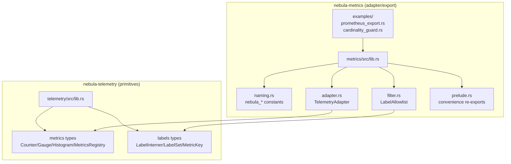
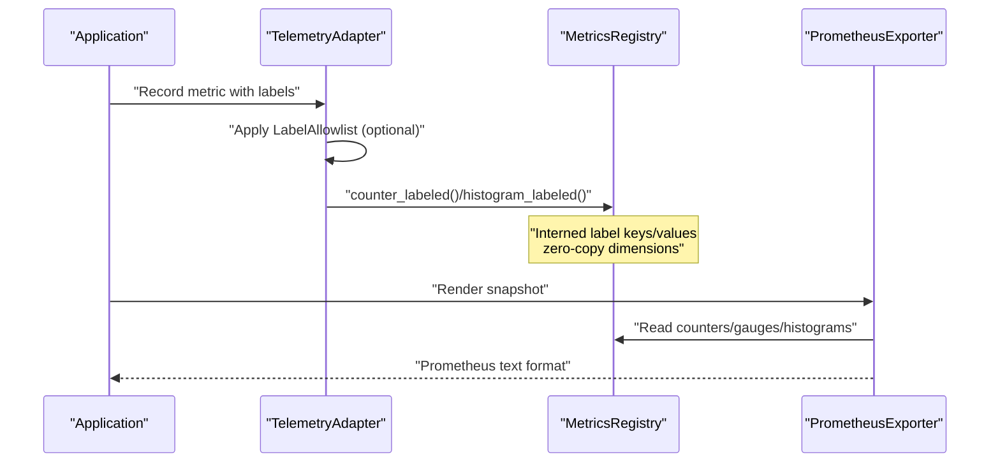
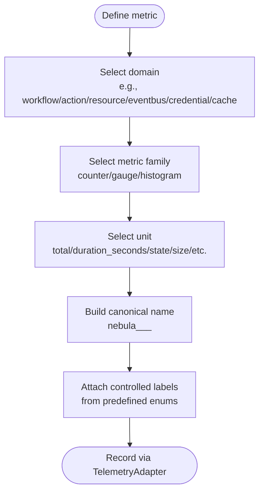
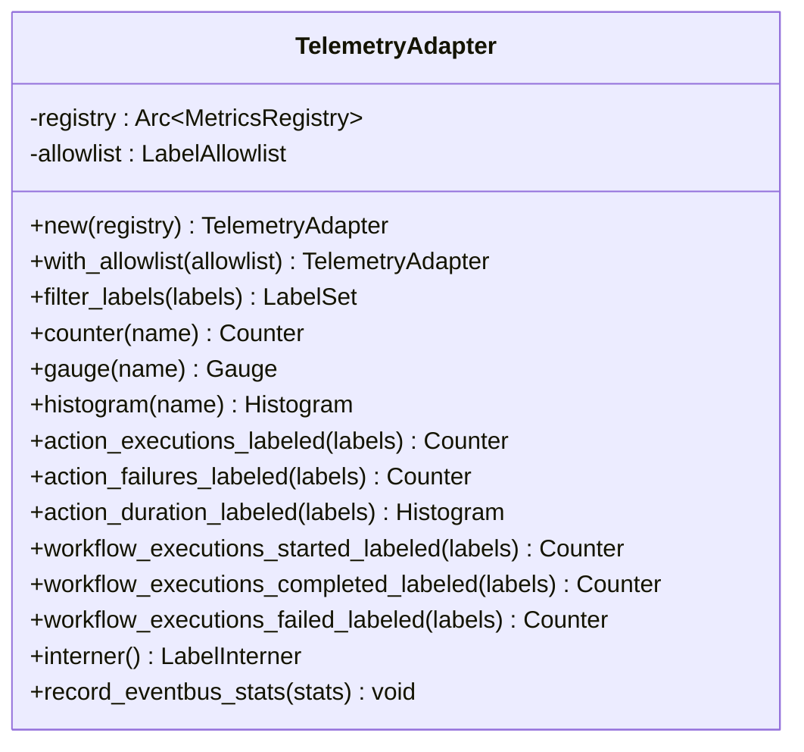
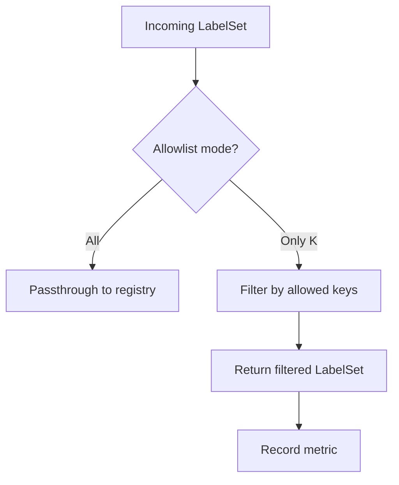
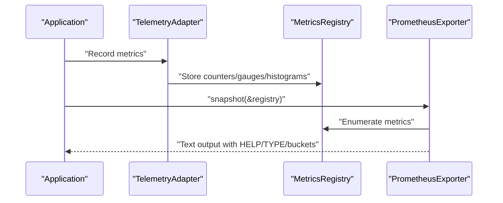
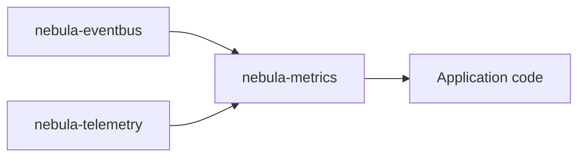

# Telemetry and Metrics

<cite>
**Referenced Files in This Document**
- [lib.rs](file://crates/metrics/src/lib.rs)
- [naming.rs](file://crates/metrics/src/naming.rs)
- [adapter.rs](file://crates/metrics/src/adapter.rs)
- [prelude.rs](file://crates/metrics/src/prelude.rs)
- [filter.rs](file://crates/metrics/src/filter.rs)
- [prometheus_export.rs](file://crates/metrics/examples/prometheus_export.rs)
- [cardinality_guard.rs](file://crates/metrics/examples/cardinality_guard.rs)
- [Cargo.toml](file://crates/metrics/Cargo.toml)
- [lib.rs](file://crates/telemetry/src/lib.rs)
- [Cargo.toml](file://crates/telemetry/Cargo.toml)
</cite>

## Table of Contents
1. [Introduction](#introduction)
2. [Project Structure](#project-structure)
3. [Core Components](#core-components)
4. [Architecture Overview](#architecture-overview)
5. [Detailed Component Analysis](#detailed-component-analysis)
6. [Dependency Analysis](#dependency-analysis)
7. [Performance Considerations](#performance-considerations)
8. [Troubleshooting Guide](#troubleshooting-guide)
9. [Conclusion](#conclusion)
10. [Appendices](#appendices)

## Introduction
This document explains Nebula’s telemetry and metrics infrastructure with a focus on how metrics are named, labeled, aggregated, and exported. It covers the adapter pattern used to unify metric names across domains, the label safety mechanisms that prevent cardinality explosions, and the Prometheus export pipeline. You will learn how to instrument code with canonical metric names, manage labels carefully, and operate reliable, high-cardinality-safe metrics in production.

## Project Structure
Nebula separates concerns across two layers:
- Lower layer: in-memory metric primitives and label interning in the telemetry crate.
- Upper layer: standardized naming, label filtering, and Prometheus export in the metrics crate.

**Diagram sources**
- [lib.rs:1-39](file://crates/telemetry/src/lib.rs#L1-L39)
- [lib.rs:1-68](file://crates/metrics/src/lib.rs#L1-L68)
- [naming.rs:1-392](file://crates/metrics/src/naming.rs#L1-L392)
- [adapter.rs:1-438](file://crates/metrics/src/adapter.rs#L1-L438)
- [filter.rs:1-182](file://crates/metrics/src/filter.rs#L1-L182)
- [prelude.rs:1-16](file://crates/metrics/src/prelude.rs#L1-L16)
- [prometheus_export.rs:1-63](file://crates/metrics/examples/prometheus_export.rs#L1-L63)
- [cardinality_guard.rs:1-106](file://crates/metrics/examples/cardinality_guard.rs#L1-L106)

**Section sources**
- [lib.rs:1-39](file://crates/telemetry/src/lib.rs#L1-L39)
- [lib.rs:1-68](file://crates/metrics/src/lib.rs#L1-L68)
- [Cargo.toml:1-26](file://crates/metrics/Cargo.toml#L1-L26)
- [Cargo.toml:1-28](file://crates/telemetry/Cargo.toml#L1-L28)

## Core Components
- Standardized metric names: canonical constants define the full set of nebula_* metrics across domains (workflows, actions, resources, eventbus, credentials, cache).
- TelemetryAdapter: a thin wrapper over the in-memory registry that exposes typed accessors for canonical metrics and labeled variants, with optional label filtering.
- LabelAllowlist: a configurable allowlist that strips high-cardinality label keys before they reach the registry.
- Prometheus export: a snapshot renderer that emits Prometheus text format with HELP and TYPE metadata and per-bucket histogram output.
- Predefined metric families: counters, gauges, and histograms are grouped by domain and unit, enabling consistent dashboards and alerts.

**Section sources**
- [lib.rs:17-68](file://crates/metrics/src/lib.rs#L17-L68)
- [naming.rs:1-392](file://crates/metrics/src/naming.rs#L1-L392)
- [adapter.rs:16-265](file://crates/metrics/src/adapter.rs#L16-L265)
- [filter.rs:36-111](file://crates/metrics/src/filter.rs#L36-L111)
- [prelude.rs:1-16](file://crates/metrics/src/prelude.rs#L1-L16)

## Architecture Overview
The telemetry stack is layered:
- Application code records metrics via TelemetryAdapter, which ensures canonical names and optional label filtering.
- The underlying MetricsRegistry stores atomic-backed counters, gauges, and histograms with interned label sets.
- Exporters (Prometheus) read from the registry to render text-formatted metrics.

**Diagram sources**
- [adapter.rs:73-75](file://crates/metrics/src/adapter.rs#L73-L75)
- [adapter.rs:171-191](file://crates/metrics/src/adapter.rs#L171-L191)
- [lib.rs:43-44](file://crates/metrics/src/lib.rs#L43-L44)

## Detailed Component Analysis

### Standardized Metric Naming
- Naming convention: nebula_<domain>_<metric>_<unit>.
- Domains include workflow, action, resource, eventbus, credential, and cache.
- Each metric constant is defined with a stable string identifier and related label enums for controlled cardinality.

**Diagram sources**
- [naming.rs:3-24](file://crates/metrics/src/naming.rs#L3-L24)
- [naming.rs:36-48](file://crates/metrics/src/naming.rs#L36-L48)
- [naming.rs:62-74](file://crates/metrics/src/naming.rs#L62-L74)

**Section sources**
- [naming.rs:1-392](file://crates/metrics/src/naming.rs#L1-L392)

### TelemetryAdapter: Unified Access and Label Filtering
- Provides typed accessors for canonical metrics and labeled variants.
- Applies LabelAllowlist to incoming LabelSet before recording.
- Exposes underlying registry for advanced or legacy metric names.

**Diagram sources**
- [adapter.rs:25-265](file://crates/metrics/src/adapter.rs#L25-L265)

**Section sources**
- [adapter.rs:16-265](file://crates/metrics/src/adapter.rs#L16-L265)

### LabelAllowlist: Preventing Cardinality Explosion
- Two modes: passthrough (all labels) and allow-only (low-cardinality keys).
- Applied at record time to strip unsafe keys (e.g., execution_id, workflow_id).
- Works with the registry’s LabelInterner to filter LabelSet efficiently.

**Diagram sources**
- [filter.rs:95-103](file://crates/metrics/src/filter.rs#L95-L103)
- [adapter.rs:73-75](file://crates/metrics/src/adapter.rs#L73-L75)

**Section sources**
- [filter.rs:36-111](file://crates/metrics/src/filter.rs#L36-L111)
- [adapter.rs:44-75](file://crates/metrics/src/adapter.rs#L44-L75)

### Prometheus Export Pipeline
- Snapshot rendering produces Prometheus text format with HELP and TYPE comments and per-bucket histogram output.
- Typical usage: collect metrics via TelemetryAdapter, then render snapshot from the registry.

**Diagram sources**
- [lib.rs:43-44](file://crates/metrics/src/lib.rs#L43-L44)
- [prometheus_export.rs:57-58](file://crates/metrics/examples/prometheus_export.rs#L57-L58)

**Section sources**
- [lib.rs:43-44](file://crates/metrics/src/lib.rs#L43-L44)
- [prometheus_export.rs:1-63](file://crates/metrics/examples/prometheus_export.rs#L1-L63)

### Instrumentation Examples
- Canonical metric recording with TelemetryAdapter and labeled accessors.
- Example demonstrates workflow and action metrics, plus labeled histograms.

**Section sources**
- [prometheus_export.rs:16-62](file://crates/metrics/examples/prometheus_export.rs#L16-L62)

### Cardinality Guard: Allowlist + Retain-Recent
- Combine LabelAllowlist (static guard) with MetricsRegistry::retain_recent (dynamic guard) to cap series growth.
- Example shows how to filter unsafe keys and evict stale series.

**Section sources**
- [cardinality_guard.rs:1-106](file://crates/metrics/examples/cardinality_guard.rs#L1-L106)

## Dependency Analysis
- nebula-metrics depends on nebula-telemetry for primitives and on nebula-eventbus for eventbus statistics recording.
- The metrics crate re-exports core types from nebula-telemetry for ergonomic imports.

**Diagram sources**
- [Cargo.toml:14-16](file://crates/metrics/Cargo.toml#L14-L16)
- [lib.rs:66-67](file://crates/metrics/src/lib.rs#L66-L67)

**Section sources**
- [Cargo.toml:1-26](file://crates/metrics/Cargo.toml#L1-L26)
- [lib.rs:66-67](file://crates/metrics/src/lib.rs#L66-L67)

## Performance Considerations
- Zero-copy label interning: label keys and values are interned to avoid allocations and reduce memory pressure.
- Atomic-backed metrics: counters, gauges, and histograms are lock-free, minimizing contention.
- Controlled label cardinality: use LabelAllowlist to prevent unbounded series growth; combine with periodic retention to prune stale series.
- Histogram buckets: exported Prometheus snapshot includes bucketed histogram data for efficient aggregation.

[No sources needed since this section provides general guidance]

## Troubleshooting Guide
- Unexpected high cardinality: verify LabelAllowlist configuration and ensure only low-cardinality keys are allowed.
- Missing labels in exports: confirm that filter_labels is applied before recording labeled metrics.
- Large registry sizes: enable periodic MetricsRegistry::retain_recent sweeps to evict inactive series.
- Export format issues: ensure the exporter snapshot is invoked against the same registry used for recording.

**Section sources**
- [adapter.rs:73-75](file://crates/metrics/src/adapter.rs#L73-L75)
- [filter.rs:95-103](file://crates/metrics/src/filter.rs#L95-L103)
- [cardinality_guard.rs:61-99](file://crates/metrics/examples/cardinality_guard.rs#L61-L99)

## Conclusion
Nebula’s telemetry and metrics system provides a robust, label-safe, and Prometheus-ready foundation for observability. By adopting canonical metric names, applying strict label filtering, and exporting snapshots consistently, teams can build reliable dashboards and alerts while avoiding cardinality pitfalls. The adapter pattern cleanly separates naming and export concerns from the underlying primitives, enabling flexible integration across domains.

[No sources needed since this section summarizes without analyzing specific files]

## Appendices

### Best Practices and Naming Conventions
- Use canonical names from naming.rs to ensure consistency across domains.
- Limit labels to low-cardinality keys; prefer enums for label values.
- Prefer histograms for durations and distributions; use counters for totals.
- Group metrics by domain and unit to simplify alerting and dashboards.

**Section sources**
- [naming.rs:3-24](file://crates/metrics/src/naming.rs#L3-L24)
- [naming.rs:36-48](file://crates/metrics/src/naming.rs#L36-L48)
- [naming.rs:62-74](file://crates/metrics/src/naming.rs#L62-L74)

### Integration with Logging and Tracing
- The telemetry crate integrates with tracing for structured logs and spans.
- Use the same resource and correlation identifiers across logs, traces, and metrics for end-to-end observability.

**Section sources**
- [lib.rs:10-15](file://crates/telemetry/src/lib.rs#L10-L15)