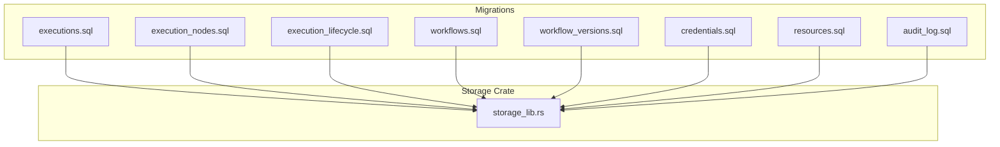
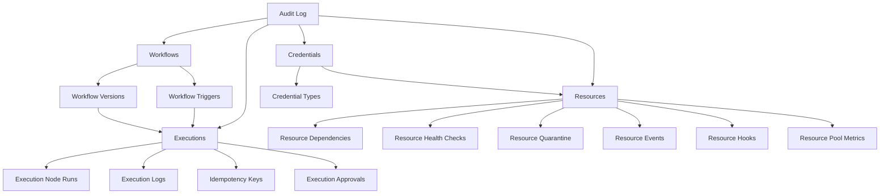
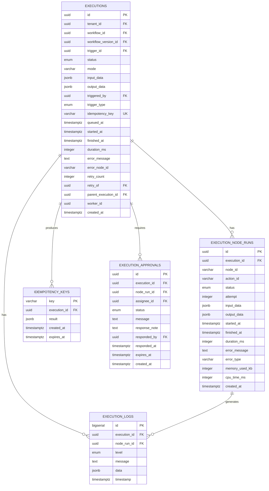
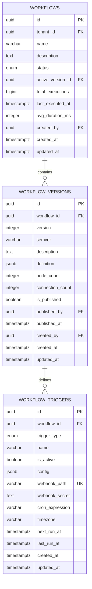
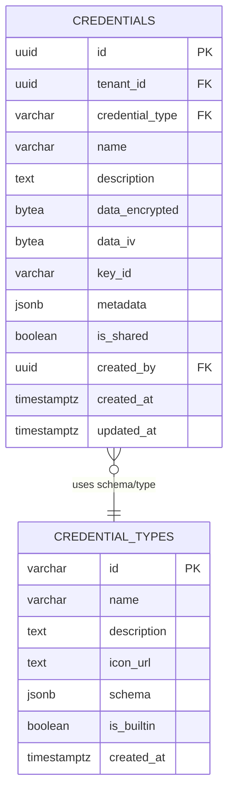
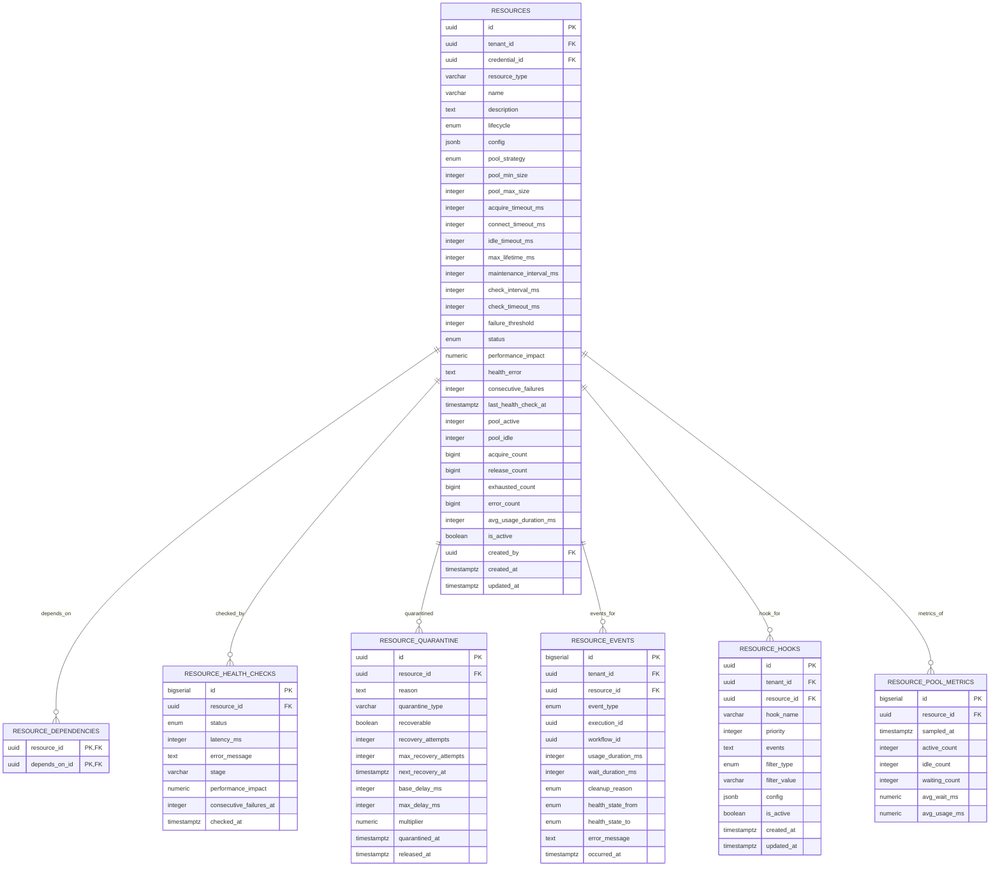
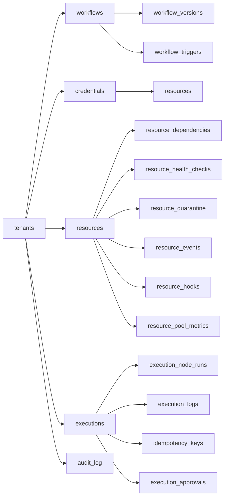

# Core Table Designs

<cite>
**Referenced Files in This Document**
- [executions.sql](file://migrations/20260225074832_executions.sql)
- [execution_nodes.sql](file://migrations/20260225074834_execution_nodes.sql)
- [execution_lifecycle.sql](file://migrations/20260225074837_execution_lifecycle.sql)
- [workflows.sql](file://migrations/20260225074718_workflows.sql)
- [workflow_versions.sql](file://migrations/20260225074718_workflow_versions.sql)
- [credentials.sql](file://migrations/20260225074547_credentials.sql)
- [resources.sql](file://migrations/20260225074547_resources.sql)
- [audit_log.sql](file://migrations/20260225074417_audit_log.sql)
- [storage_lib.rs](file://crates/storage/src/lib.rs)
</cite>

## Table of Contents
1. [Introduction](#introduction)
2. [Project Structure](#project-structure)
3. [Core Components](#core-components)
4. [Architecture Overview](#architecture-overview)
5. [Detailed Component Analysis](#detailed-component-analysis)
6. [Dependency Analysis](#dependency-analysis)
7. [Performance Considerations](#performance-considerations)
8. [Troubleshooting Guide](#troubleshooting-guide)
9. [Conclusion](#conclusion)
10. [Appendices](#appendices)

## Introduction
This document describes Nebula’s core database table designs across major domains: execution management, workflow definition, credential storage, resource management, and audit trails. It covers table schemas, data types, constraints, indexes, foreign keys, referential integrity, and the repository pattern used to access these tables. It also explains data flow patterns, business logic, and performance considerations for optimal execution performance.

## Project Structure
Nebula defines relational schemas via SQL migrations. The relevant domain schemas are implemented in dedicated migration files grouped by functional area. The storage layer exposes repository interfaces for execution and workflow persistence, while the repository pattern is documented in the storage crate’s public API.

**Diagram sources**
- [executions.sql:1-80](file://migrations/20260225074832_executions.sql#L1-L80)
- [execution_nodes.sql:1-67](file://migrations/20260225074834_execution_nodes.sql#L1-L67)
- [execution_lifecycle.sql:1-39](file://migrations/20260225074837_execution_lifecycle.sql#L1-L39)
- [workflows.sql:1-32](file://migrations/20260225074718_workflows.sql#L1-L32)
- [workflow_versions.sql:1-71](file://migrations/20260225074718_workflow_versions.sql#L1-L71)
- [credentials.sql:1-63](file://migrations/20260225074547_credentials.sql#L1-L63)
- [resources.sql:1-337](file://migrations/20260225074547_resources.sql#L1-L337)
- [audit_log.sql:1-21](file://migrations/20260225074417_audit_log.sql#L1-L21)
- [storage_lib.rs:1-105](file://crates/storage/src/lib.rs#L1-L105)

**Section sources**
- [storage_lib.rs:1-105](file://crates/storage/src/lib.rs#L1-L105)

## Core Components
This section summarizes the primary tables and their roles:
- Execution management: executions, execution_node_runs, execution_logs, idempotency_keys, execution_approvals
- Workflow definition: workflows, workflow_versions, workflow_triggers
- Credential storage: credential_types, credentials
- Resource management: resources, resource_dependencies, resource_health_checks, resource_quarantine, resource_events, resource_hooks, resource_pool_metrics
- Audit trail: audit_log

Each table’s schema, constraints, indexes, and relationships are detailed in subsequent sections.

**Section sources**
- [executions.sql:26-80](file://migrations/20260225074832_executions.sql#L26-L80)
- [execution_nodes.sql:7-67](file://migrations/20260225074834_execution_nodes.sql#L7-L67)
- [execution_lifecycle.sql:7-39](file://migrations/20260225074837_execution_lifecycle.sql#L7-L39)
- [workflows.sql:8-32](file://migrations/20260225074718_workflows.sql#L8-L32)
- [workflow_versions.sql:5-71](file://migrations/20260225074718_workflow_versions.sql#L5-L71)
- [credentials.sql:9-63](file://migrations/20260225074547_credentials.sql#L9-L63)
- [resources.sql:58-337](file://migrations/20260225074547_resources.sql#L58-L337)
- [audit_log.sql:5-21](file://migrations/20260225074417_audit_log.sql#L5-L21)

## Architecture Overview
The execution lifecycle spans workflow definition, triggering, execution orchestration, node-level runs, logging, idempotency, approvals, and resource utilization. The storage layer exposes repository traits for execution and workflow persistence.

**Diagram sources**
- [workflows.sql:8-32](file://migrations/20260225074718_workflows.sql#L8-L32)
- [workflow_versions.sql:5-71](file://migrations/20260225074718_workflow_versions.sql#L5-L71)
- [executions.sql:26-80](file://migrations/20260225074832_executions.sql#L26-L80)
- [execution_nodes.sql:7-67](file://migrations/20260225074834_execution_nodes.sql#L7-L67)
- [execution_lifecycle.sql:7-39](file://migrations/20260225074837_execution_lifecycle.sql#L7-L39)
- [resources.sql:58-337](file://migrations/20260225074547_resources.sql#L58-L337)
- [credentials.sql:9-63](file://migrations/20260225074547_credentials.sql#L9-L63)
- [audit_log.sql:5-21](file://migrations/20260225074417_audit_log.sql#L5-L21)

## Detailed Component Analysis

### Execution Management Tables
Execution management tracks workflow runs, node-level runs, logs, idempotency, and approvals.

- executions
  - Purpose: Stores top-level execution state, inputs/outputs, timing, retries, and worker assignment.
  - Key fields: id, tenant_id, workflow_id, workflow_version_id, trigger_id, status, mode, input_data, output_data, triggered_by, trigger_type, idempotency_key, timestamps, error fields, retry fields, worker_id, created_at.
  - Constraints and indexes:
    - Foreign keys: tenant_id -> tenants, workflow_id -> workflows, workflow_version_id -> workflow_versions, trigger_id -> workflow_triggers, triggered_by -> users, retry_of -> executions, parent_execution_id -> executions.
    - Generated duration_ms computed from started_at/finished_at.
    - Indexes: tenant_id, workflow_id, status, queued desc where status='queued', running where status='running', worker where worker_id not null, idempotency_key where not null, composite active (tenant_id, workflow_id, created_at desc) where status in ('queued','running','waiting').
  - Business logic: Supports idempotency via idempotency_key, retry chaining via retry_of, hierarchical sub-executions via parent_execution_id, and worker assignment for clustering.

- execution_node_runs
  - Purpose: Per-node execution results with timing, resource usage, and error metadata.
  - Key fields: id, execution_id, node_id, action_id, status, attempt, input_data, output_data, timestamps, error fields, memory/cpu usage, created_at.
  - Constraints and indexes:
    - Foreign key: execution_id -> executions.
    - Generated duration_ms computed from started_at/finished_at.
    - Indexes: execution_id, execution_id,status.
  - Business logic: Tracks node-level progress and diagnostics; supports retries per node via attempt.

- execution_logs
  - Purpose: Structured log entries per execution with levels and timestamps.
  - Key fields: id, execution_id, node_run_id, level, message, data, timestamp.
  - Constraints and indexes:
    - Foreign keys: execution_id -> executions, node_run_id -> execution_node_runs.
    - Indexes: execution_id,timestamp desc; execution_id,level.
  - Business logic: Provides searchable execution logs; includes retention cleanup function.

- idempotency_keys
  - Purpose: Deduplication records for incoming requests.
  - Key fields: key, execution_id, result, created_at, expires_at.
  - Constraints and indexes:
    - Foreign key: execution_id -> executions.
    - Index: expires_at.
  - Business logic: Ensures idempotent processing; expires_at governs cleanup.

- execution_approvals
  - Purpose: Human-in-the-loop approvals for waiting executions.
  - Key fields: id, execution_id, node_run_id, assignee_id, status, message, response fields, expires_at, created_at.
  - Constraints and indexes:
    - Foreign keys: execution_id -> executions, node_run_id -> execution_node_runs, assignee_id -> users, responded_by -> users.
    - Indexes: execution_id; assignee_id where status='pending'.
  - Business logic: Supports waiting state and approvals with expiration.

**Diagram sources**
- [executions.sql:26-80](file://migrations/20260225074832_executions.sql#L26-L80)
- [execution_nodes.sql:7-67](file://migrations/20260225074834_execution_nodes.sql#L7-L67)
- [execution_lifecycle.sql:7-39](file://migrations/20260225074837_execution_lifecycle.sql#L7-L39)

**Section sources**
- [executions.sql:26-80](file://migrations/20260225074832_executions.sql#L26-L80)
- [execution_nodes.sql:7-67](file://migrations/20260225074834_execution_nodes.sql#L7-L67)
- [execution_lifecycle.sql:7-39](file://migrations/20260225074837_execution_lifecycle.sql#L7-L39)

### Workflow Definition Tables
Workflow definition tables manage workflow metadata, versioning, and triggers.

- workflows
  - Purpose: Stores workflow metadata, denormalized active version reference, and statistics.
  - Key fields: id, tenant_id, name, description, status, active_version_id, stats, created_by, timestamps.
  - Constraints and indexes:
    - Foreign key: tenant_id -> tenants, created_by -> users, active_version_id -> workflow_versions.
    - Unique: (tenant_id, name).
    - Indexes: tenant_id, status.
  - Business logic: Denormalizes active_version_id for fast lookup; stats updated by triggers/background jobs.

- workflow_versions
  - Purpose: Versioned workflow definitions with extracted counts and publication metadata.
  - Key fields: id, workflow_id, version, semver, description, definition, counts, flags, authors, timestamps.
  - Constraints and indexes:
    - Foreign key: workflow_id -> workflows, published_by -> users, created_by -> users.
    - Unique: (workflow_id, version).
    - Indexes: workflow_id; published subset.
    - Deferred foreign key: active_version_id -> workflow_versions.
  - Business logic: Stores full JSON definition; extracted fields enable efficient queries; publication tracking.

- workflow_triggers
  - Purpose: Trigger configurations for workflows (manual, webhook, schedule, event, form).
  - Key fields: id, workflow_id, trigger_type, name, is_active, config, webhook fields, schedule fields, timestamps.
  - Constraints and indexes:
    - Foreign key: workflow_id -> workflows.
    - Unique: webhook_path; indexes: workflow_id, type, next_run where active and type='schedule', webhook_path where not null.
  - Business logic: Supports webhook paths and secrets, cron schedules with timezone, and next/last run tracking.

**Diagram sources**
- [workflows.sql:8-32](file://migrations/20260225074718_workflows.sql#L8-L32)
- [workflow_versions.sql:5-71](file://migrations/20260225074718_workflow_versions.sql#L5-L71)

**Section sources**
- [workflows.sql:8-32](file://migrations/20260225074718_workflows.sql#L8-L32)
- [workflow_versions.sql:5-71](file://migrations/20260225074718_workflow_versions.sql#L5-L71)

### Credential Storage Tables
Credential storage persists encrypted credential data with metadata and built-in credential types.

- credential_types
  - Purpose: Defines built-in and custom credential schemas.
  - Key fields: id, name, description, icon_url, schema, is_builtin, created_at.
  - Constraints and indexes: Primary key on id; inserts define built-in types with JSON schema including secret markers.
  - Business logic: Provides JSON schema for validation and UI rendering; marks sensitive fields.

- credentials
  - Purpose: Stores encrypted credential values with associated metadata and sharing flag.
  - Key fields: id, tenant_id, credential_type, name, description, data_encrypted, data_iv, key_id, metadata, is_shared, created_by, timestamps.
  - Constraints and indexes:
    - Foreign key: tenant_id -> tenants, credential_type -> credential_types, created_by -> users.
    - Unique: (tenant_id, name).
    - Indexes: tenant_id, credential_type.
  - Business logic: Encrypts credential data; stores IV and optional KMS key reference; metadata stored plaintext for search/display.

**Diagram sources**
- [credentials.sql:9-63](file://migrations/20260225074547_credentials.sql#L9-L63)

**Section sources**
- [credentials.sql:9-63](file://migrations/20260225074547_credentials.sql#L9-L63)

### Resource Management Tables
Resource management tables model resource definitions, pools, health, quarantine, events, hooks, and metrics.

- resources
  - Purpose: Resource definitions with lifecycle, pool configuration, health, and stats.
  - Key fields: id, tenant_id, credential_id, identity, lifecycle, config, pool settings, health, stats, meta.
  - Constraints and indexes:
    - Foreign keys: tenant_id -> tenants, credential_id -> credentials.
    - Unique: (tenant_id, name); check: min_size <= max_size.
    - Indexes: tenant_id, resource_type, status, lifecycle, tenant_id,is_active where active.
  - Business logic: Supports global/workflow/execution/action lifecycles; pool sizing and timeouts; health tracking; stats counters.

- resource_dependencies
  - Purpose: Topology dependencies between resources.
  - Key fields: resource_id, depends_on_id.
  - Constraints and indexes: Composite PK; check: not self-dependency; indexes for bidirectional lookups.
  - Business logic: Enables topology views and cascading health.

- resource_health_checks
  - Purpose: Historical health check results.
  - Key fields: id, resource_id, status, latency, error, stage, performance_impact, consecutive_failures, checked_at.
  - Constraints and indexes: Foreign key; indexes: resource,checked_at desc; checked_at desc.
  - Business logic: Retains recent history; used for dashboards and trend analysis.

- resource_quarantine
  - Purpose: Quarantine state with recovery backoff.
  - Key fields: id, resource_id, reason, quarantine_type, recoverable, recovery attempts, delays, timestamps, released_at.
  - Constraints and indexes: Foreign key; unique active quarantine; indexes: resource, next_recovery where active.
  - Business logic: Auto/manual quarantine; backoff-based recovery.

- resource_events
  - Purpose: Event stream for resource lifecycle and operational events.
  - Key fields: id, tenant_id, resource_id, event_type, execution/workflow context, durations/reasons, timestamps.
  - Constraints and indexes: Foreign keys; indexes: resource,tenant,event_type,execution.
  - Business logic: High-volume event log; retention handled by maintenance functions.

- resource_hooks
  - Purpose: Tenant-wide or resource-specific hooks with filters and priorities.
  - Key fields: id, tenant_id, resource_id, hook_name, priority, events, filter_type/value, config, is_active, timestamps.
  - Constraints and indexes: Foreign key; check: filter_value required when filter_type!='all'; indexes: tenant,resource,is_active.
  - Business logic: Configurable hooks for audit, slow acquisition, and other operational concerns.

- resource_pool_metrics
  - Purpose: Time-series samples of pool activity.
  - Key fields: id, resource_id, sampled_at, active/idle/waiting counts, averages.
  - Constraints and indexes: Foreign key; index: resource,sampled_at desc.
  - Business logic: Retention handled by maintenance functions.

**Diagram sources**
- [resources.sql:58-337](file://migrations/20260225074547_resources.sql#L58-L337)

**Section sources**
- [resources.sql:58-337](file://migrations/20260225074547_resources.sql#L58-L337)

### Audit Trail Tables
Audit logs capture actions, resources, and contextual metadata for compliance and monitoring.

- audit_log
  - Purpose: Central audit trail for organization/user actions.
  - Key fields: id, organization_id, user_id, action, resource_type, resource_id, metadata, ip_address, created_at.
  - Constraints and indexes: Foreign keys; indexes: organization, user, action, created_at desc.
  - Business logic: Supports correlation of actions to users and resources; timestamped for chronological analysis.

**Section sources**
- [audit_log.sql:5-21](file://migrations/20260225074417_audit_log.sql#L5-L21)

## Dependency Analysis
Foreign key relationships and referential integrity rules:
- executions
  - tenant_id -> tenants (CASCADE)
  - workflow_id -> workflows (CASCADE)
  - workflow_version_id -> workflow_versions
  - trigger_id -> workflow_triggers (SET NULL)
  - triggered_by -> users (SET NULL)
  - retry_of -> executions
  - parent_execution_id -> executions
- execution_node_runs
  - execution_id -> executions (CASCADE)
  - node_run_id -> execution_node_runs (CASCADE)
- execution_logs
  - execution_id -> executions (CASCADE)
  - node_run_id -> execution_node_runs (CASCADE)
- idempotency_keys
  - execution_id -> executions (CASCADE)
- execution_approvals
  - execution_id -> executions (CASCADE)
  - node_run_id -> execution_node_runs (CASCADE)
  - assignee_id -> users (SET NULL)
  - responded_by -> users (SET NULL)
- workflows
  - tenant_id -> tenants (CASCADE)
  - created_by -> users (SET NULL)
  - active_version_id -> workflow_versions (DEFERRABLE INITIALLY DEFERRED)
- workflow_versions
  - workflow_id -> workflows (CASCADE)
  - published_by -> users (SET NULL)
  - created_by -> users (SET NULL)
- workflow_triggers
  - workflow_id -> workflows (CASCADE)
- credentials
  - tenant_id -> tenants (CASCADE)
  - credential_type -> credential_types
  - created_by -> users (SET NULL)
- resources
  - tenant_id -> tenants (CASCADE)
  - credential_id -> credentials (SET NULL)
  - created_by -> users (SET NULL)
- resource_dependencies
  - resource_id -> resources (CASCADE)
  - depends_on_id -> resources (CASCADE)
- resource_health_checks
  - resource_id -> resources (CASCADE)
- resource_quarantine
  - resource_id -> resources (CASCADE)
- resource_events
  - tenant_id -> tenants (CASCADE)
  - resource_id -> resources (CASCADE)
  - execution_id -> executions
  - workflow_id -> workflows
- resource_hooks
  - tenant_id -> tenants (CASCADE)
  - resource_id -> resources (CASCADE)
- audit_log
  - organization_id -> organizations (SET NULL)
  - user_id -> users (SET NULL)

**Diagram sources**
- [executions.sql:26-80](file://migrations/20260225074832_executions.sql#L26-L80)
- [execution_nodes.sql:7-67](file://migrations/20260225074834_execution_nodes.sql#L7-L67)
- [execution_lifecycle.sql:7-39](file://migrations/20260225074837_execution_lifecycle.sql#L7-L39)
- [workflows.sql:8-32](file://migrations/20260225074718_workflows.sql#L8-L32)
- [workflow_versions.sql:5-71](file://migrations/20260225074718_workflow_versions.sql#L5-L71)
- [credentials.sql:9-63](file://migrations/20260225074547_credentials.sql#L9-L63)
- [resources.sql:58-337](file://migrations/20260225074547_resources.sql#L58-L337)
- [audit_log.sql:5-21](file://migrations/20260225074417_audit_log.sql#L5-L21)

**Section sources**
- [executions.sql:26-80](file://migrations/20260225074832_executions.sql#L26-L80)
- [execution_nodes.sql:7-67](file://migrations/20260225074834_execution_nodes.sql#L7-L67)
- [execution_lifecycle.sql:7-39](file://migrations/20260225074837_execution_lifecycle.sql#L7-L39)
- [workflows.sql:8-32](file://migrations/20260225074718_workflows.sql#L8-L32)
- [workflow_versions.sql:5-71](file://migrations/20260225074718_workflow_versions.sql#L5-L71)
- [credentials.sql:9-63](file://migrations/20260225074547_credentials.sql#L9-L63)
- [resources.sql:58-337](file://migrations/20260225074547_resources.sql#L58-L337)
- [audit_log.sql:5-21](file://migrations/20260225074417_audit_log.sql#L5-L21)

## Performance Considerations
- Execution queries
  - Partial indexes on status and timestamps enable efficient scanning of queued/running executions and worker assignment filtering.
  - Composite active index accelerates active execution scans by tenant/workflow.
  - Generated duration fields avoid expensive calculations at query time.
- Node-level queries
  - Node run indexes support status filtering and execution scoping.
- Logging retention
  - Dedicated cleanup functions prune old logs and related histories to control growth.
- Resource operations
  - Indexes on status, lifecycle, and active flags optimize resource discovery and filtering.
  - Maintenance functions purge stale health checks, events, and metrics to maintain performance.
- Idempotency and approvals
  - Unique idempotency_key and targeted partial indexes improve deduplication and pending approval lookups.

[No sources needed since this section provides general guidance]

## Troubleshooting Guide
- Execution stuck in queued/running
  - Verify partial indexes on status and timestamps; confirm worker assignment and lease handling.
- Excessive log volume
  - Confirm cleanup functions are scheduled; review retention policies.
- Resource pool contention
  - Monitor pool metrics and quarantine state; adjust pool sizes and timeouts.
- Credential decryption failures
  - Validate encryption fields (data_encrypted, data_iv) and KMS key reference; ensure proper rotation procedures.
- Audit trail gaps
  - Confirm audit_log indexes and retention policies; verify organization/user foreign keys.

**Section sources**
- [execution_nodes.sql:61-67](file://migrations/20260225074834_execution_nodes.sql#L61-L67)
- [resources.sql:294-317](file://migrations/20260225074547_resources.sql#L294-L317)
- [audit_log.sql:17-21](file://migrations/20260225074417_audit_log.sql#L17-L21)

## Conclusion
Nebula’s schema is designed around robust execution tracking, versioned workflows, secure credential storage, comprehensive resource management, and auditable operations. The repository pattern in the storage crate provides a clean persistence interface for execution and workflow domains, while extensive indexing and maintenance functions ensure operational performance and compliance.

[No sources needed since this section summarizes without analyzing specific files]

## Appendices

### Repository Pattern Implementation
The storage crate documents repository interfaces for execution and workflow persistence and outlines the repository module for a future row-model architecture. Production-backed repositories are exposed under the postgres feature.

- Key references:
  - Layer 1 re-exports: ExecutionRepo, WorkflowRepo, and in-memory variants.
  - Layer 2 (planned): repos module traits; ControlQueueRepo is production-wired.
  - Backends: pg module provides Postgres-backed repositories behind the postgres feature.
  - Maintenance: canonical references to durability and backend status.

**Section sources**
- [storage_lib.rs:1-105](file://crates/storage/src/lib.rs#L1-L105)