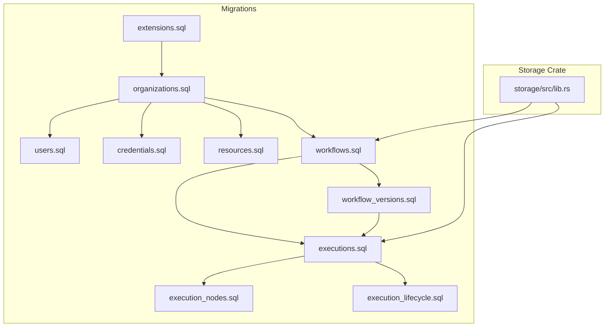
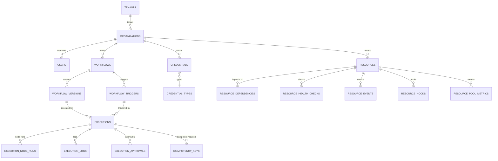
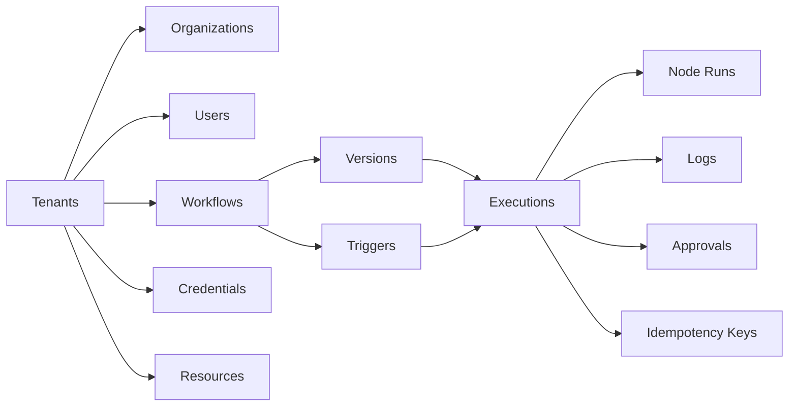

# Database Schema Design

<cite>
**Referenced Files in This Document**
- [migrations/README.md](file://migrations/README.md)
- [migrations/20260225074401_extensions.sql](file://migrations/20260225074401_extensions.sql)
- [migrations/20260225074406_organizations.sql](file://migrations/20260225074406_organizations.sql)
- [migrations/20260225074412_users.sql](file://migrations/20260225074412_users.sql)
- [migrations/20260225074547_credentials.sql](file://migrations/20260225074547_credentials.sql)
- [migrations/20260225074547_resources.sql](file://migrations/20260225074547_resources.sql)
- [migrations/20260225074718_workflows.sql](file://migrations/20260225074718_workflows.sql)
- [migrations/20260225074718_workflow_versions.sql](file://migrations/20260225074718_workflow_versions.sql)
- [migrations/20260225074832_executions.sql](file://migrations/20260225074832_executions.sql)
- [migrations/20260225074834_execution_nodes.sql](file://migrations/20260225074834_execution_nodes.sql)
- [migrations/20260225074837_execution_lifecycle.sql](file://migrations/20260225074837_execution_lifecycle.sql)
- [crates/storage/src/lib.rs](file://crates/storage/src/lib.rs)
</cite>

## Table of Contents
1. [Introduction](#introduction)
2. [Project Structure](#project-structure)
3. [Core Components](#core-components)
4. [Architecture Overview](#architecture-overview)
5. [Detailed Component Analysis](#detailed-component-analysis)
6. [Dependency Analysis](#dependency-analysis)
7. [Performance Considerations](#performance-considerations)
8. [Troubleshooting Guide](#troubleshooting-guide)
9. [Conclusion](#conclusion)
10. [Appendices](#appendices)

## Introduction
This document describes Nebula’s database schema design for execution management, workflow definitions, credential storage, and resource management. It documents entity relationships, field definitions, data types, primary/foreign keys, indexes, constraints, validation rules, referential integrity, and lifecycle policies. It also covers repository abstractions, storage backends (PostgreSQL/SQLite), and operational considerations such as caching, performance, and retention.

## Project Structure
Nebula’s persistence layer is defined by SQL migrations and a Rust storage crate that exposes repository interfaces and row types. The migrations define the canonical schema and are executed via sqlx. The storage crate abstracts PostgreSQL and SQLite backends behind a unified interface for execution and workflow persistence.

**Diagram sources**
- [migrations/20260225074401_extensions.sql:1-12](file://migrations/20260225074401_extensions.sql#L1-L12)
- [migrations/20260225074406_organizations.sql:1-23](file://migrations/20260225074406_organizations.sql#L1-L23)
- [migrations/20260225074412_users.sql:1-24](file://migrations/20260225074412_users.sql#L1-L24)
- [migrations/20260225074547_credentials.sql:1-63](file://migrations/20260225074547_credentials.sql#L1-L63)
- [migrations/20260225074547_resources.sql:1-337](file://migrations/20260225074547_resources.sql#L1-L337)
- [migrations/20260225074718_workflows.sql:1-32](file://migrations/20260225074718_workflows.sql#L1-L32)
- [migrations/20260225074718_workflow_versions.sql:1-71](file://migrations/20260225074718_workflow_versions.sql#L1-L71)
- [migrations/20260225074832_executions.sql:1-80](file://migrations/20260225074832_executions.sql#L1-L80)
- [migrations/20260225074834_execution_nodes.sql:1-67](file://migrations/20260225074834_execution_nodes.sql#L1-L67)
- [migrations/20260225074837_execution_lifecycle.sql:1-39](file://migrations/20260225074837_execution_lifecycle.sql#L1-L39)
- [crates/storage/src/lib.rs:1-105](file://crates/storage/src/lib.rs#L1-L105)

**Section sources**
- [migrations/README.md:1-60](file://migrations/README.md#L1-L60)
- [crates/storage/src/lib.rs:1-105](file://crates/storage/src/lib.rs#L1-L105)

## Core Components
- Execution persistence: managed by ExecutionRepo with production-backed implementations for SQLite and PostgreSQL.
- Workflow persistence: managed by WorkflowRepo with production-backed implementations for SQLite and PostgreSQL.
- Control queue persistence: ControlQueueRepo is a production trait with in-memory and PostgreSQL backings.
- Row types and mapping: rows module defines typed row representations for domain entities.
- Format abstraction: serialization format abstraction supports JSON and MessagePack.

These components are the primary production interfaces used by the engine and applications.

**Section sources**
- [crates/storage/src/lib.rs:1-105](file://crates/storage/src/lib.rs#L1-L105)

## Architecture Overview
The schema is designed around multi-tenancy with tenants as the top-level organizational unit. Workflows are versioned and linked to executions. Executions spawn node runs and logs, tracked with lifecycle tables for idempotency and approvals. Credentials and resources are tenant-scoped and integrated with workflows and executions.

**Diagram sources**
- [migrations/20260225074406_organizations.sql:1-23](file://migrations/20260225074406_organizations.sql#L1-L23)
- [migrations/20260225074547_credentials.sql:1-63](file://migrations/20260225074547_credentials.sql#L1-L63)
- [migrations/20260225074547_resources.sql:1-337](file://migrations/20260225074547_resources.sql#L1-L337)
- [migrations/20260225074718_workflows.sql:1-32](file://migrations/20260225074718_workflows.sql#L1-L32)
- [migrations/20260225074718_workflow_versions.sql:1-71](file://migrations/20260225074718_workflow_versions.sql#L1-L71)
- [migrations/20260225074832_executions.sql:1-80](file://migrations/20260225074832_executions.sql#L1-L80)
- [migrations/20260225074834_execution_nodes.sql:1-67](file://migrations/20260225074834_execution_nodes.sql#L1-L67)
- [migrations/20260225074837_execution_lifecycle.sql:1-39](file://migrations/20260225074837_execution_lifecycle.sql#L1-L39)

## Detailed Component Analysis

### Multi-Tenancy and Core Entities
- Tenants: Root organizational unit; referenced by most entities.
- Organizations: Human-facing grouping; links to users and tenants.
- Users: Authentication and authorization subjects; linked to organizations and audit.
- Roles and memberships: Managed via separate tables (see migration index).

Key constraints and indexes:
- Unique slugs for organizations.
- Unique usernames and emails for users.
- Timestamps updated via triggers in later migrations.

**Section sources**
- [migrations/20260225074406_organizations.sql:1-23](file://migrations/20260225074406_organizations.sql#L1-L23)
- [migrations/20260225074412_users.sql:1-24](file://migrations/20260225074412_users.sql#L1-L24)

### Credential Storage
Credential types define JSON schemas for credential fields. Credentials are encrypted at rest with deterministic fields for IV and optional KMS key reference. Metadata is stored plaintext for search and display.

Primary keys and foreign keys:
- credential_types.id → credentials.credential_type
- tenants.id → credentials.tenant_id (ON DELETE CASCADE)
- users.id → credentials.created_by (ON DELETE SET NULL)

Indexes:
- tenant, type, and unique tenant+name for efficient lookup.

Constraints:
- is_builtin defaults to false; schema is JSONB with secret markers.
- Encrypted fields are bytea with IV and optional key_id.

Retention and lifecycle:
- No explicit retention function is defined for credentials in the referenced migration.

**Section sources**
- [migrations/20260225074547_credentials.sql:1-63](file://migrations/20260225074547_credentials.sql#L1-L63)

### Resource Management
Resources define pools, health checks, quarantine, events, hooks, and metrics. Enums encapsulate lifecycle, status, pool strategy, event types, cleanup reasons, and hook filters.

Primary keys and foreign keys:
- tenants.id → resources.tenant_id (ON DELETE CASCADE)
- credentials.id → resources.credential_id (ON DELETE SET NULL)
- users.id → resources.created_by (ON DELETE SET NULL)
- resources.id → resource_dependencies (self-referencing)
- resources.id → resource_health_checks
- resources.id → resource_events
- resources.id → resource_hooks
- resources.id → resource_pool_metrics

Constraints:
- Pool min/max sizes enforced with a check constraint.
- Hook filter_value required when filter_type is not 'all'.
- Quarantine type constrained to auto/manual.

Indexes:
- Tenant, type, status, lifecycle, and active resources.
- Dependencies indexed both ways.
- Health checks, events, hooks, and metrics indexed by recency and tenant.

Maintenance functions:
- Cleanup functions for health checks, resource events, and pool metrics with retention windows.

**Section sources**
- [migrations/20260225074547_resources.sql:1-337](file://migrations/20260225074547_resources.sql#L1-L337)

### Workflow Definitions and Versioning
Workflows are tenant-scoped with status and denormalized active version reference. Workflow versions store the full definition as JSONB and extracted counts. Triggers define manual/webhook/schedule/event forms.

Primary keys and foreign keys:
- tenants.id → workflows.tenant_id (ON DELETE CASCADE)
- users.id → workflows.created_by (ON DELETE SET NULL)
- workflows.id → workflow_versions.workflow_id (ON DELETE CASCADE)
- workflows.id → workflow_triggers.workflow_id (ON DELETE CASCADE)
- workflow_versions.id → executions.workflow_version_id
- workflow_triggers.id → executions.trigger_id (ON DELETE SET NULL)

Indexes:
- Workflows by tenant and status.
- Versions by workflow and published flag.
- Triggers by type and next run time.

Constraints:
- Active version FK is deferrable initially deferred to allow creation order flexibility.

**Section sources**
- [migrations/20260225074718_workflows.sql:1-32](file://migrations/20260225074718_workflows.sql#L1-L32)
- [migrations/20260225074718_workflow_versions.sql:1-71](file://migrations/20260225074718_workflow_versions.sql#L1-L71)

### Execution Management
Executions track status, mode, input/output, timing, retries, and worker assignment. Node runs capture per-node status, attempts, timing, errors, and resource usage. Logs capture structured messages with levels and timestamps.

Primary keys and foreign keys:
- tenants.id → executions.tenant_id (ON DELETE CASCADE)
- workflows.id → executions.workflow_id (ON DELETE CASCADE)
- workflow_versions.id → executions.workflow_version_id
- workflow_triggers.id → executions.trigger_id (ON DELETE SET NULL)
- users.id → executions.triggered_by (ON DELETE SET NULL)
- executions.id → execution_node_runs.execution_id (ON DELETE CASCADE)
- executions.id → execution_logs.execution_id (ON DELETE CASCADE)
- execution_node_runs.id → execution_logs.node_run_id (ON DELETE CASCADE)

Indexes:
- Tenant, workflow, status, queued/range scans, worker assignment, idempotency key.
- Partial index for active executions.

Constraints:
- Generated duration fields computed from timestamps.
- Retry chain via retry_of and parent_execution_id.

Retention:
- Execution logs retained for 90 days via cleanup function.

**Section sources**
- [migrations/20260225074832_executions.sql:1-80](file://migrations/20260225074832_executions.sql#L1-L80)
- [migrations/20260225074834_execution_nodes.sql:1-67](file://migrations/20260225074834_execution_nodes.sql#L1-L67)

### Execution Lifecycle: Idempotency and Approvals
Idempotency keys prevent duplicate processing with TTL and optional result storage. Execution approvals support human-in-the-loop gating with status tracking and expiration.

Primary keys and foreign keys:
- executions.id → idempotency_keys.execution_id (ON DELETE CASCADE)
- executions.id → execution_approvals.execution_id (ON DELETE CASCADE)
- execution_node_runs.id → execution_approvals.node_run_id (ON DELETE SET NULL)
- users.id → execution_approvals.assignee_id (ON DELETE SET NULL)
- users.id → execution_approvals.responded_by (ON DELETE SET NULL)

Indexes:
- Expiry on idempotency keys.
- Pending approvals by assignee.

**Section sources**
- [migrations/20260225074837_execution_lifecycle.sql:1-39](file://migrations/20260225074837_execution_lifecycle.sql#L1-L39)

### Data Validation Rules and Business Rules
- Enum constraints enforce allowed values for statuses, triggers, lifecycle, and event types.
- Check constraints ensure pool sizing validity and hook filter consistency.
- Unique constraints on tenant+name for credentials and workflows.
- Deferrable FK for active workflow version to support creation ordering.
- Generated columns compute durations from timestamps.

**Section sources**
- [migrations/20260225074547_resources.sql:1-337](file://migrations/20260225074547_resources.sql#L1-L337)
- [migrations/20260225074718_workflows.sql:1-32](file://migrations/20260225074718_workflows.sql#L1-L32)
- [migrations/20260225074832_executions.sql:1-80](file://migrations/20260225074832_executions.sql#L1-L80)
- [migrations/20260225074834_execution_nodes.sql:1-67](file://migrations/20260225074834_execution_nodes.sql#L1-L67)
- [migrations/20260225074837_execution_lifecycle.sql:1-39](file://migrations/20260225074837_execution_lifecycle.sql#L1-L39)

### Referential Integrity Requirements
- All tenant-scoped entities reference tenants with ON DELETE CASCADE where appropriate.
- User references often use ON DELETE SET NULL to preserve audit trails.
- Self-referencing dependencies and cascading deletes for hierarchical structures.

**Section sources**
- [migrations/20260225074547_credentials.sql:1-63](file://migrations/20260225074547_credentials.sql#L1-L63)
- [migrations/20260225074547_resources.sql:1-337](file://migrations/20260225074547_resources.sql#L1-L337)
- [migrations/20260225074718_workflow_versions.sql:1-71](file://migrations/20260225074718_workflow_versions.sql#L1-L71)
- [migrations/20260225074832_executions.sql:1-80](file://migrations/20260225074832_executions.sql#L1-L80)

### Data Access Patterns, Caching, and Performance
Access patterns:
- Workflows: Lookup by tenant+name, published versions, and status.
- Executions: Range scans by status, queued/running, worker assignment, and idempotency key.
- Node runs: Per-execution filtering by status.
- Logs: Per-execution ordered by timestamp and level.
- Resources: Tenant filters, status, lifecycle, and active resources.

Caching strategies:
- No explicit caching layer is defined in the schema; application-level caches can target hot queries (e.g., recent logs, active executions).

Indexes and partial indexes:
- Partial indexes on active executions and pending approvals optimize hot paths.
- Functional and generated columns reduce computation overhead.

**Section sources**
- [migrations/20260225074718_workflows.sql:1-32](file://migrations/20260225074718_workflows.sql#L1-L32)
- [migrations/20260225074832_executions.sql:1-80](file://migrations/20260225074832_executions.sql#L1-L80)
- [migrations/20260225074834_execution_nodes.sql:1-67](file://migrations/20260225074834_execution_nodes.sql#L1-L67)
- [migrations/20260225074837_execution_lifecycle.sql:1-39](file://migrations/20260225074837_execution_lifecycle.sql#L1-L39)

### Data Lifecycle, Retention, and Archival
Retention policies:
- Execution logs: 90 days.
- Resource health checks: 7 days.
- Resource events: 7 days.
- Resource pool metrics: 24 hours.

Archival:
- No explicit archival tables are defined in the referenced migrations; future designs may introduce partitioning or offloading for long-term analytics.

Maintenance functions:
- Cleanup functions are provided to purge old records per retention windows.

**Section sources**
- [migrations/20260225074834_execution_nodes.sql:1-67](file://migrations/20260225074834_execution_nodes.sql#L1-L67)
- [migrations/20260225074547_resources.sql:1-337](file://migrations/20260225074547_resources.sql#L1-L337)

### Data Migration Paths, Version Management, and Schema Evolution
Migration management:
- sqlx manages migrations with descriptive names and a sequential numbering scheme.
- The migration index enumerates domains and their responsible migrations.

Schema evolution:
- New features are introduced via new migration files.
- Extensions are installed upfront to enable advanced features (UUID generation, cryptography, trigrams).
- Backward-compatible changes typically add columns or indexes; breaking changes require careful planning and downtime.

**Section sources**
- [migrations/README.md:1-60](file://migrations/README.md#L1-L60)
- [migrations/20260225074401_extensions.sql:1-12](file://migrations/20260225074401_extensions.sql#L1-L12)

### Data Security, Privacy, and Access Control
Security controls visible in schema:
- Credentials are encrypted at rest with deterministic encryption fields and optional KMS key reference.
- Metadata is stored plaintext for search/display; sensitive fields are marked in JSON schema.
- Audit-friendly design with created_by and timestamps.

Access control:
- Multi-tenancy via tenant_id on most entities.
- RBAC roles and memberships are modeled in separate migrations; enforcement occurs at application level.

Note: Database-level permissions are not defined in the referenced schema files; access control is enforced by application logic and database user segregation.

**Section sources**
- [migrations/20260225074547_credentials.sql:1-63](file://migrations/20260225074547_credentials.sql#L1-L63)
- [migrations/20260225074406_organizations.sql:1-23](file://migrations/20260225074406_organizations.sql#L1-L23)
- [migrations/20260225074412_users.sql:1-24](file://migrations/20260225074412_users.sql#L1-L24)

### Repository Pattern and Backend Abstraction
Repository interfaces:
- ExecutionRepo and WorkflowRepo are the primary production persistence interfaces.
- ControlQueueRepo is a production trait with in-memory and PostgreSQL backings.

Backends:
- SQLite is the default for development and tests; PostgreSQL is used in production.
- The storage crate exposes top-level re-exports for both backends behind feature flags.

Row types and mapping:
- Rows module provides typed row representations for domain entities.
- Mapping utilities translate between rows and domain models.

**Section sources**
- [crates/storage/src/lib.rs:1-105](file://crates/storage/src/lib.rs#L1-L105)

## Dependency Analysis
The schema exhibits a clear dependency hierarchy: tenants → organizations → users, workflows, credentials, resources; workflows → versions and triggers; versions and triggers → executions; executions → node runs and logs; lifecycle tables support idempotency and approvals.

**Diagram sources**
- [migrations/20260225074718_workflows.sql:1-32](file://migrations/20260225074718_workflows.sql#L1-L32)
- [migrations/20260225074718_workflow_versions.sql:1-71](file://migrations/20260225074718_workflow_versions.sql#L1-L71)
- [migrations/20260225074832_executions.sql:1-80](file://migrations/20260225074832_executions.sql#L1-L80)
- [migrations/20260225074834_execution_nodes.sql:1-67](file://migrations/20260225074834_execution_nodes.sql#L1-L67)
- [migrations/20260225074837_execution_lifecycle.sql:1-39](file://migrations/20260225074837_execution_lifecycle.sql#L1-L39)

**Section sources**
- [migrations/20260225074718_workflows.sql:1-32](file://migrations/20260225074718_workflows.sql#L1-L32)
- [migrations/20260225074718_workflow_versions.sql:1-71](file://migrations/20260225074718_workflow_versions.sql#L1-L71)
- [migrations/20260225074832_executions.sql:1-80](file://migrations/20260225074832_executions.sql#L1-L80)
- [migrations/20260225074834_execution_nodes.sql:1-67](file://migrations/20260225074834_execution_nodes.sql#L1-L67)
- [migrations/20260225074837_execution_lifecycle.sql:1-39](file://migrations/20260225074837_execution_lifecycle.sql#L1-L39)

## Performance Considerations
- Use partial indexes for active executions and pending approvals to accelerate hot queries.
- Prefer tenant-scoped lookups with equality predicates to leverage indexes.
- Avoid scanning large logs without time bounds; use timestamp filters.
- Resource tables include high-cardinality indexes; consider partitioning for very high volume.
- Maintenance functions help keep tables lean; schedule periodic cleanup jobs.

[No sources needed since this section provides general guidance]

## Troubleshooting Guide
Common issues and remedies:
- Stale idempotency keys: Verify expiry and TTL; ensure cleanup jobs run.
- Missing approvals: Confirm pending approvals by assignee and expiration.
- Slow execution queries: Confirm partial indexes are used; add missing indexes if needed.
- Resource event backlog: Monitor retention and consider partitioning for high-volume scenarios.
- Cleanup jobs: Validate maintenance functions and schedules.

**Section sources**
- [migrations/20260225074837_execution_lifecycle.sql:1-39](file://migrations/20260225074837_execution_lifecycle.sql#L1-L39)
- [migrations/20260225074834_execution_nodes.sql:1-67](file://migrations/20260225074834_execution_nodes.sql#L1-L67)
- [migrations/20260225074547_resources.sql:1-337](file://migrations/20260225074547_resources.sql#L1-L337)

## Conclusion
Nebula’s schema emphasizes multi-tenancy, robust workflow versioning, and lifecycle-aware execution tracking. It balances auditability, performance, and operational simplicity through enums, constraints, indexes, and maintenance functions. The storage crate abstracts PostgreSQL and SQLite backends behind repository interfaces, enabling consistent persistence across environments.

[No sources needed since this section summarizes without analyzing specific files]

## Appendices

### Appendix A: Migration Index
- Extensions: Install uuid-ossp, pgcrypto, pg_trgm.
- Organizations, Users, Memberships, Audit Log, Tenants, Tenant Config, Credentials, Resources, Registry, Cluster, Roles, Projects, Teams, Sharing ACL, Service Accounts, SSO, SCIM, Tags, MFA, Invitations, Project Variables, Permission Cache.

**Section sources**
- [migrations/README.md:1-60](file://migrations/README.md#L1-L60)

### Appendix B: Sample Data Guidance
- Credentials: Insert built-in credential types with JSON schemas; create encrypted credentials with metadata and plaintext identifiers.
- Resources: Define resource types, pool configs, health checks, and hooks; monitor quarantine and events.
- Workflows: Publish versions with extracted counts; configure triggers (webhook, schedule, manual).
- Executions: Seed executions with input data; observe node runs and logs; manage approvals and idempotency.

[No sources needed since this section provides general guidance]