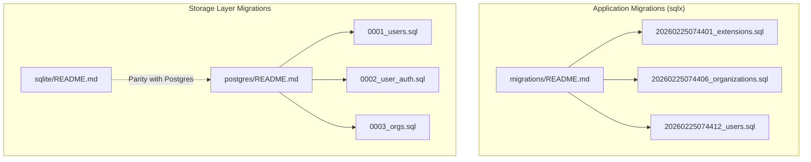
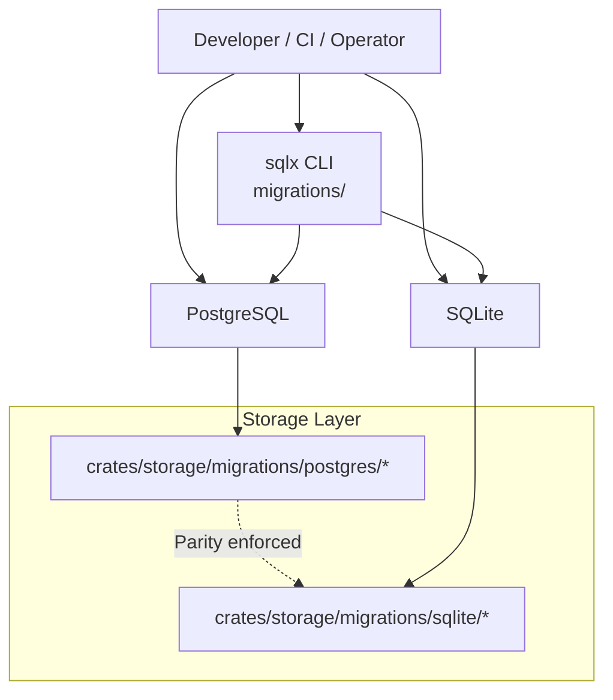
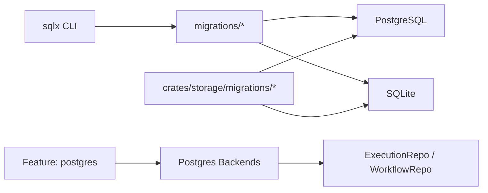

# Schema Evolution and Migration Management

<cite>
**Referenced Files in This Document**
- [lib.rs](file://crates/storage/src/lib.rs)
- [mod.rs](file://crates/storage/src/backend/mod.rs)
- [postgres/README.md](file://crates/storage/migrations/postgres/README.md)
- [sqlite/README.md](file://crates/storage/migrations/sqlite/README.md)
- [migrations/README.md](file://migrations/README.md)
- [20260225074401_extensions.sql](file://migrations/20260225074401_extensions.sql)
- [20260225074406_organizations.sql](file://migrations/20260225074406_organizations.sql)
- [20260225074412_users.sql](file://migrations/20260225074412_users.sql)
- [0001_users.sql](file://crates/storage/migrations/postgres/0001_users.sql)
- [0002_user_auth.sql](file://crates/storage/migrations/postgres/0002_user_auth.sql)
- [0003_orgs.sql](file://crates/storage/migrations/postgres/0003_orgs.sql)
- [control_queue.rs](file://crates/storage/src/pg/control_queue.rs)
</cite>

## Table of Contents
1. [Introduction](#introduction)
2. [Project Structure](#project-structure)
3. [Core Components](#core-components)
4. [Architecture Overview](#architecture-overview)
5. [Detailed Component Analysis](#detailed-component-analysis)
6. [Dependency Analysis](#dependency-analysis)
7. [Performance Considerations](#performance-considerations)
8. [Troubleshooting Guide](#troubleshooting-guide)
9. [Conclusion](#conclusion)
10. [Appendices](#appendices)

## Introduction
This document explains Nebula’s database schema evolution and migration management system. It covers the migration strategy using timestamp-based sequential numbering, how migrations are applied and tracked, dual-backend support for PostgreSQL and SQLite, validation and rollback procedures, backward compatibility guarantees, migration testing approaches, performance considerations, downtime minimization, zero-downtime deployment techniques, and practical guidelines for authoring safe migrations.

## Project Structure
Nebula organizes migrations into two complementary systems:
- Application migrations under the root migrations directory, managed by sqlx and targeting PostgreSQL.
- Spec-16 schema migrations under crates/storage/migrations/postgres and crates/storage/migrations/sqlite, aligned with the storage layer’s design and used for development, testing, and parity validation.

**Diagram sources**
- [migrations/README.md:1-60](file://migrations/README.md#L1-L60)
- [20260225074401_extensions.sql:1-12](file://migrations/20260225074401_extensions.sql#L1-L12)
- [20260225074406_organizations.sql:1-23](file://migrations/20260225074406_organizations.sql#L1-L23)
- [20260225074412_users.sql:1-24](file://migrations/20260225074412_users.sql#L1-L24)
- [postgres/README.md:1-43](file://crates/storage/migrations/postgres/README.md#L1-L43)
- [0001_users.sql:1-31](file://crates/storage/migrations/postgres/0001_users.sql#L1-L31)
- [0002_user_auth.sql:1-81](file://crates/storage/migrations/postgres/0002_user_auth.sql#L1-L81)
- [0003_orgs.sql:1-21](file://crates/storage/migrations/postgres/0003_orgs.sql#L1-L21)
- [sqlite/README.md:1-31](file://crates/storage/migrations/sqlite/README.md#L1-L31)

**Section sources**
- [migrations/README.md:1-60](file://migrations/README.md#L1-L60)
- [postgres/README.md:1-43](file://crates/storage/migrations/postgres/README.md#L1-L43)
- [sqlite/README.md:1-31](file://crates/storage/migrations/sqlite/README.md#L1-L31)

## Core Components
- Dual-backend storage layer:
  - Production-backed repositories (Layer 1) are exposed at the crate root for execution and workflow persistence, with SQLite as the default for local/dev/test and PostgreSQL available behind a feature flag.
  - The backend module wires concrete implementations for PostgreSQL when enabled.
- Migration tooling:
  - Root migrations use sqlx with timestamp-based filenames and are intended for production PostgreSQL.
  - Storage migrations define Spec-16 schema for both dialects and enforce logical parity.

Key responsibilities:
- Apply migrations in strict chronological order.
- Track applied migrations and prevent reapplication.
- Maintain schema parity between PostgreSQL and SQLite dialects.
- Provide validation and rollback mechanisms during upgrades.

**Section sources**
- [lib.rs:1-105](file://crates/storage/src/lib.rs#L1-L105)
- [mod.rs:1-20](file://crates/storage/src/backend/mod.rs#L1-L20)
- [migrations/README.md:1-60](file://migrations/README.md#L1-L60)

## Architecture Overview
The migration system comprises three layers:
- Application migrations (root): sqlx-managed, timestamped, PostgreSQL-focused.
- Storage migrations (crates/storage): Spec-16-aligned, dialect-specific, ensuring parity.
- Runtime backend selection: SQLite for local/dev/test; PostgreSQL for production.

**Diagram sources**
- [migrations/README.md:1-60](file://migrations/README.md#L1-L60)
- [postgres/README.md:1-43](file://crates/storage/migrations/postgres/README.md#L1-L43)
- [sqlite/README.md:1-31](file://crates/storage/migrations/sqlite/README.md#L1-L31)

## Detailed Component Analysis

### Migration Strategy: Timestamp-Based Sequential Numbering
- Root migrations use timestamp-based filenames with descriptive names. This ensures deterministic ordering and prevents collisions across teams.
- sqlx manages migration status and applies only pending migrations.
- The index in the root migrations README enumerates domain-focused migrations for quick orientation.

Examples of patterns observed:
- Extension setup: creates required PostgreSQL extensions early to enable subsequent migrations.
- Table creation: defines primary keys, constraints, indexes, and JSONB fields with defaults.
- Indexing: creates selective indexes to optimize common queries.

**Section sources**
- [migrations/README.md:1-60](file://migrations/README.md#L1-L60)
- [20260225074401_extensions.sql:1-12](file://migrations/20260225074401_extensions.sql#L1-L12)
- [20260225074406_organizations.sql:1-23](file://migrations/20260225074406_organizations.sql#L1-L23)
- [20260225074412_users.sql:1-24](file://migrations/20260225074412_users.sql#L1-L24)

### Dual Backend Support: PostgreSQL vs SQLite
- PostgreSQL dialect notes:
  - IDs as BYTEA (ULIDs), JSONB, TIMESTAMPTZ, INET, arrays as native BYTEA[], booleans as BOOLEAN, CAS via BIGINT version columns.
- SQLite dialect notes:
  - IDs as BLOB (ULIDs), JSON as TEXT (validated by app), timestamps as ISO 8601 TEXT, IP addresses as TEXT, arrays as JSON TEXT, booleans as INTEGER, CAS via INTEGER version columns.
  - Foreign key constraints via ALTER TABLE ADD CONSTRAINT are not supported; enforcement occurs at the application level where needed.
  - Partial indexes with NOW() are not supported; constants are required.

Parity expectations:
- Logical tables and constraints must match across dialects; types adapt to dialects.
- Both directories must remain synchronized to maintain compatibility across environments.

**Section sources**
- [postgres/README.md:1-43](file://crates/storage/migrations/postgres/README.md#L1-L43)
- [sqlite/README.md:1-31](file://crates/storage/migrations/sqlite/README.md#L1-L31)

### Migration Validation and Rollback Procedures
Validation:
- Schema parity between PostgreSQL and SQLite is enforced by design documents and READMEs.
- Tests and integration scenarios exercise end-to-end persistence, validating that migrations produce a usable schema for both backends.

Rollback:
- sqlx supports downgrading migrations; however, the repository’s storage layer emphasizes forward-only evolution for production-grade stability.
- For scenarios requiring rollback, use sqlx’s downgrade capability and ensure downstream consumers (repositories, engines) tolerate schema changes gracefully.

Backward compatibility:
- The storage layer exposes Layer 1 repository interfaces that abstract backend differences, enabling controlled evolution while maintaining application contracts.
- Test suites validate schema contracts and behavior across environments.

**Section sources**
- [postgres/README.md:37-43](file://crates/storage/migrations/postgres/README.md#L37-L43)
- [sqlite/README.md:27-31](file://crates/storage/migrations/sqlite/README.md#L27-L31)
- [lib.rs:1-105](file://crates/storage/src/lib.rs#L1-L105)

### Zero-Downtime Deployment Techniques
- Use PostgreSQL-specific features where applicable (e.g., deferrable constraints) to reduce contention and improve transactional safety during seeding or constrained insertions.
- The storage layer demonstrates deferrable foreign keys in tests to support atomic seeding workflows, aligning with zero-downtime deployment goals.

**Section sources**
- [control_queue.rs:350-369](file://crates/storage/src/pg/control_queue.rs#L350-L369)

### Migration Testing Approach
- Local-first development with SQLite mirrors production schema parity, enabling fast iteration and validation.
- sqlx-managed migrations in the root ensure production-like environments can be replicated locally and in CI.
- Integration tests exercise repositories and persistence layers against both backends to catch regressions early.

**Section sources**
- [sqlite/README.md:1-31](file://crates/storage/migrations/sqlite/README.md#L1-L31)
- [migrations/README.md:1-60](file://migrations/README.md#L1-L60)

### Examples of Migration Patterns
- Extension setup: Ensures required PostgreSQL extensions are available before dependent migrations run.
- Table creation: Defines identity, tenancy, workflow, execution, and audit tables with appropriate constraints and indexes.
- Schema alterations: Demonstrated in the storage migrations for adding result persistence and control queue reclaim counts, keeping logical parity across dialects.

**Section sources**
- [20260225074401_extensions.sql:1-12](file://migrations/20260225074401_extensions.sql#L1-L12)
- [20260225074406_organizations.sql:1-23](file://migrations/20260225074406_organizations.sql#L1-L23)
- [20260225074412_users.sql:1-24](file://migrations/20260225074412_users.sql#L1-L24)
- [0001_users.sql:1-31](file://crates/storage/migrations/postgres/0001_users.sql#L1-L31)
- [0002_user_auth.sql:1-81](file://crates/storage/migrations/postgres/0002_user_auth.sql#L1-L81)
- [0003_orgs.sql:1-21](file://crates/storage/migrations/postgres/0003_orgs.sql#L1-L21)

## Dependency Analysis
The migration system depends on:
- sqlx for root migrations management and status tracking.
- Crate-local storage migrations for schema parity and backend-specific dialects.
- Backend selection via feature flags to choose PostgreSQL-backed repositories in production.

**Diagram sources**
- [migrations/README.md:1-60](file://migrations/README.md#L1-L60)
- [lib.rs:96-105](file://crates/storage/src/lib.rs#L96-L105)
- [postgres/README.md:1-43](file://crates/storage/migrations/postgres/README.md#L1-L43)
- [sqlite/README.md:1-31](file://crates/storage/migrations/sqlite/README.md#L1-L31)

**Section sources**
- [lib.rs:1-105](file://crates/storage/src/lib.rs#L1-L105)
- [mod.rs:1-20](file://crates/storage/src/backend/mod.rs#L1-L20)

## Performance Considerations
- Indexing strategy: Create selective indexes on frequently queried columns (e.g., email, username, role) to optimize read performance.
- Data types: Prefer efficient types per backend (JSONB in PostgreSQL, validated TEXT in SQLite) to minimize storage and parsing overhead.
- Transaction boundaries: Use deferrable constraints and atomic operations to reduce lock contention during seeding and constrained inserts.
- Cleanup policies: Implement retention and cleanup jobs for long-running tables (e.g., execution nodes) to control growth.

[No sources needed since this section provides general guidance]

## Troubleshooting Guide
Common issues and remedies:
- Migration conflicts or duplicate applications:
  - Verify migration status and re-run sqlx migrate info to diagnose.
  - Revert to a known good state and re-apply migrations in order.
- Backend-specific limitations:
  - SQLite lacks ALTER TABLE ADD CONSTRAINT for foreign keys; enforce constraints at the application level where necessary.
  - Partial indexes with NOW() are unsupported; use constants or application-side filtering.
- Seed failures in tests:
  - Adjust deferrable constraints temporarily to support atomic seeding workflows, as demonstrated in the storage layer tests.

**Section sources**
- [sqlite/README.md:14-16](file://crates/storage/migrations/sqlite/README.md#L14-L16)
- [control_queue.rs:350-369](file://crates/storage/src/pg/control_queue.rs#L350-L369)

## Conclusion
Nebula’s migration system combines timestamp-based, sqlx-managed migrations for production PostgreSQL with Spec-16-aligned storage migrations for both PostgreSQL and SQLite. This dual approach ensures schema parity, robust validation, and controlled evolution. By leveraging deferrable constraints, careful indexing, and thorough testing across backends, teams can achieve reliable, low-downtime deployments and maintain backward compatibility.

[No sources needed since this section summarizes without analyzing specific files]

## Appendices

### Migration Naming Conventions
- Root migrations: Use timestamp prefixes followed by a descriptive underscore-separated name (e.g., 20260225074401_extensions.sql).
- Storage migrations: Use four-digit sequential numbers with descriptive names (e.g., 0001_users.sql, 0002_user_auth.sql).

**Section sources**
- [migrations/README.md:20-25](file://migrations/README.md#L20-L25)
- [postgres/README.md:17-35](file://crates/storage/migrations/postgres/README.md#L17-L35)

### Guidelines for Creating New Migrations
- Define logical tables and constraints first; ensure parity between PostgreSQL and SQLite dialects.
- Add indexes for common filters and joins; avoid over-indexing.
- Use JSONB in PostgreSQL and validated TEXT in SQLite for JSON payloads.
- Keep migrations small and focused; group related changes together.
- Test against both backends locally and in CI before merging.

**Section sources**
- [postgres/README.md:37-43](file://crates/storage/migrations/postgres/README.md#L37-L43)
- [sqlite/README.md:27-31](file://crates/storage/migrations/sqlite/README.md#L27-L31)

### Migration Rollback and Emergency Recovery
- Use sqlx’s downgrade capability to roll back problematic migrations when necessary.
- Maintain a recent backup of the database prior to applying major schema changes.
- Validate rollback scenarios in staging environments mirroring production.

**Section sources**
- [migrations/README.md:1-18](file://migrations/README.md#L1-L18)