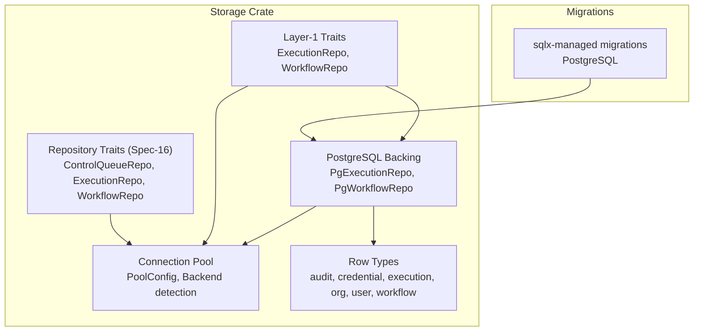
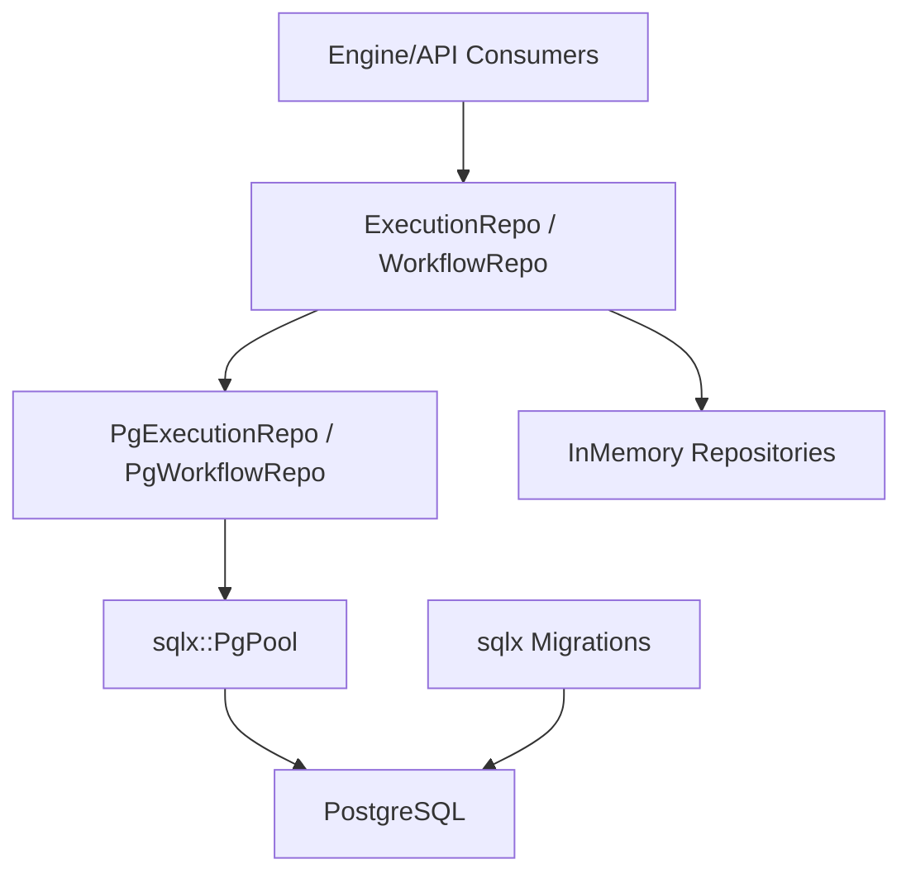
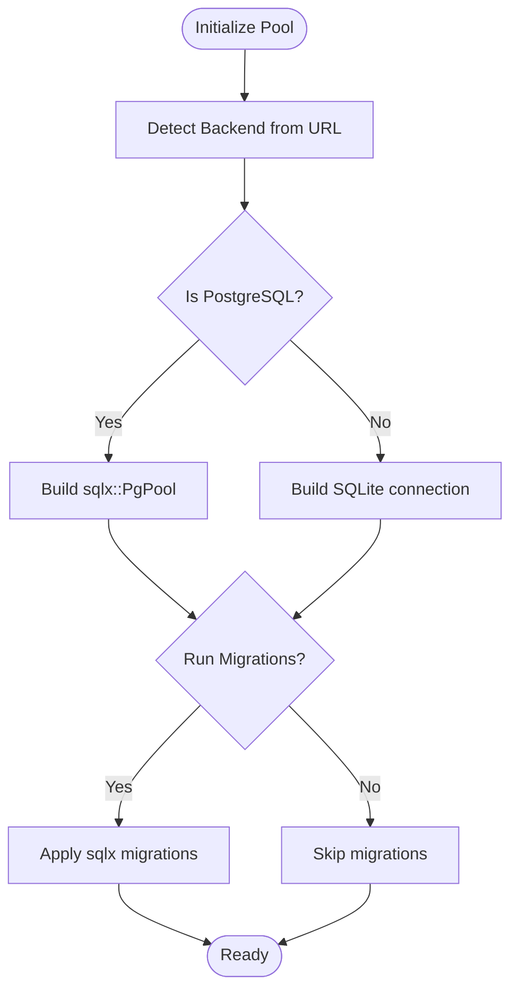
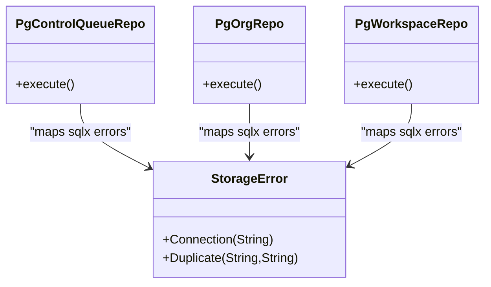
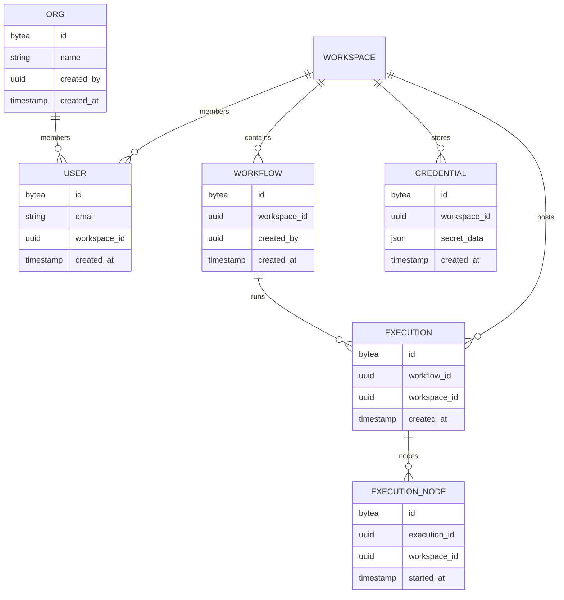
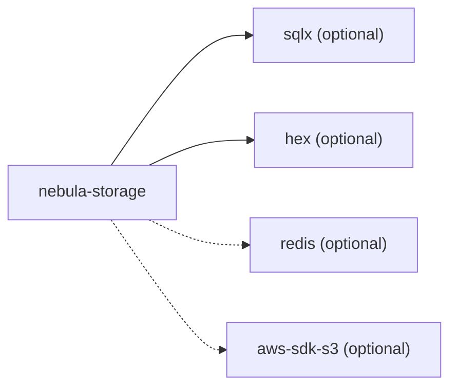

# Database Operations

<cite>
**Referenced Files in This Document**
- [Cargo.toml](file://crates/storage/Cargo.toml)
- [lib.rs](file://crates/storage/src/lib.rs)
- [pool.rs](file://crates/storage/src/pool.rs)
- [mod.rs](file://crates/storage/src/pg/mod.rs)
- [mod.rs](file://crates/storage/src/rows/mod.rs)
- [mod.rs](file://crates/storage/src/repos/mod.rs)
- [README.md](file://migrations/README.md)
- [20260225074401_extensions.sql](file://migrations/20260225074401_extensions.sql)
- [20260225074406_organizations.sql](file://migrations/20260225074406_organizations.sql)
- [20260225074412_users.sql](file://migrations/20260225074412_users.sql)
- [20260225074415_memberships.sql](file://migrations/20260225074415_memberships.sql)
- [20260225074417_audit_log.sql](file://migrations/20260225074417_audit_log.sql)
- [20260225074547_credentials.sql](file://migrations/20260225074547_credentials.sql)
- [20260225074547_resources.sql](file://migrations/20260225074547_resources.sql)
- [20260225074547_tenant_config.sql](file://migrations/20260225074547_tenant_config.sql)
- [20260225074547_tenants.sql](file://migrations/20260225074547_tenants.sql)
- [20260225074718_workflow_sharing.sql](file://migrations/20260225074718_workflow_sharing.sql)
- [20260225074718_workflow_versions.sql](file://migrations/20260225074718_workflow_versions.sql)
- [20260225074718_workflows.sql](file://migrations/20260225074718_workflows.sql)
- [20260225074832_executions.sql](file://migrations/20260225074832_executions.sql)
- [20260225074834_execution_nodes.sql](file://migrations/20260225074834_execution_nodes.sql)
- [20260225074837_execution_lifecycle.sql](file://migrations/20260225074837_execution_lifecycle.sql)
- [20260225075033_cluster.sql](file://migrations/20260225075033_cluster.sql)
- [20260225075033_registry.sql](file://migrations/20260225075033_registry.sql)
- [20260225075207_projects.sql](file://migrations/20260225075207_projects.sql)
- [20260225075207_roles.sql](file://migrations/20260225075207_roles.sql)
- [20260225075207_sharing_acl.sql](file://migrations/20260225075207_sharing_acl.sql)
- [20260225075207_teams.sql](file://migrations/20260225075207_teams.sql)
- [20260225075416_scim.sql](file://migrations/20260225075416_scim.sql)
- [20260225075416_service_accounts.sql](file://migrations/20260225075416_service_accounts.sql)
- [20260225075416_sso.sql](file://migrations/20260225075416_sso.sql)
- [20260225075620_invitations.sql](file://migrations/20260225075620_invitations.sql)
- [20260225075620_mfa.sql](file://migrations/20260225075620_mfa.sql)
- [20260225075620_permission_cache.sql](file://migrations/20260225075620_permission_cache.sql)
- [20260225075620_project_variables.sql](file://migrations/20260225075620_project_variables.sql)
- [20260225075620_tags.sql](file://migrations/20260225075620_tags.sql)
- [20260304120000_storage_kv.sql](file://migrations/20260304120000_storage_kv.sql)
- [20260304123500_storage_kv_jsonb.sql](file://migrations/20260304123500_storage_kv_jsonb.sql)
</cite>

## Table of Contents
1. [Introduction](#introduction)
2. [Project Structure](#project-structure)
3. [Core Components](#core-components)
4. [Architecture Overview](#architecture-overview)
5. [Detailed Component Analysis](#detailed-component-analysis)
6. [Dependency Analysis](#dependency-analysis)
7. [Performance Considerations](#performance-considerations)
8. [Troubleshooting Guide](#troubleshooting-guide)
9. [Conclusion](#conclusion)
10. [Appendices](#appendices)

## Introduction
This document explains Nebula’s database operations with a focus on schema evolution, migration orchestration, and dual-backend support for PostgreSQL and SQLite. It covers migration architecture, version management, rollback procedures, backup and restore, connection pooling, performance tuning, monitoring, maintenance, upgrades, schema validation, data integrity verification, and security considerations.

## Project Structure
Nebula’s storage subsystem provides a clean separation between repository interfaces, backend-specific implementations, and migration management. The storage crate exposes:
- Layer-1 production traits for execution and workflow persistence
- PostgreSQL-backed implementations behind a feature flag
- A connection pool abstraction supporting both backends
- Row types mirroring SQL schemas
- A dedicated migrations directory for PostgreSQL-managed schemas

**Diagram sources**
- [lib.rs:1-105](file://crates/storage/src/lib.rs#L1-L105)
- [pool.rs:1-136](file://crates/storage/src/pool.rs#L1-L136)
- [mod.rs:1-43](file://crates/storage/src/pg/mod.rs#L1-L43)
- [mod.rs:1-58](file://crates/storage/src/rows/mod.rs#L1-L58)
- [mod.rs:1-71](file://crates/storage/src/repos/mod.rs#L1-L71)

**Section sources**
- [lib.rs:1-105](file://crates/storage/src/lib.rs#L1-L105)
- [pool.rs:1-136](file://crates/storage/src/pool.rs#L1-L136)
- [mod.rs:1-43](file://crates/storage/src/pg/mod.rs#L1-L43)
- [mod.rs:1-58](file://crates/storage/src/rows/mod.rs#L1-L58)
- [mod.rs:1-71](file://crates/storage/src/repos/mod.rs#L1-L71)

## Core Components
- Dual-backend selection: Backend detection from database URLs enables runtime switching between PostgreSQL and SQLite.
- Connection pooling: Configurable pool sizes and migration-on-connect behavior.
- PostgreSQL feature: sqlx-backed implementations guarded by a feature flag.
- Row types: Strongly typed row mappings for all domain entities.
- Migration system: sqlx-managed migrations for PostgreSQL; SQLite migrations handled separately.

**Section sources**
- [pool.rs:13-96](file://crates/storage/src/pool.rs#L13-L96)
- [Cargo.toml:61-75](file://crates/storage/Cargo.toml#L61-L75)
- [lib.rs:96-105](file://crates/storage/src/lib.rs#L96-L105)
- [mod.rs:1-58](file://crates/storage/src/rows/mod.rs#L1-L58)

## Architecture Overview
The storage architecture separates concerns across layers:
- Layer-1 traits define the production persistence contract used by the engine and API.
- PostgreSQL implementations provide durable, multi-process-safe persistence.
- Connection pooling abstracts backend selection and migration execution.
- Migrations evolve the PostgreSQL schema independently of SQLite.

**Diagram sources**
- [lib.rs:96-105](file://crates/storage/src/lib.rs#L96-L105)
- [mod.rs:1-43](file://crates/storage/src/pg/mod.rs#L1-L43)
- [README.md:1-60](file://migrations/README.md#L1-L60)

## Detailed Component Analysis

### Migration System and Version Management
- PostgreSQL migrations are managed by sqlx and stored alongside the API server migrations.
- Quick start commands demonstrate running migrations and checking status.
- Migration index enumerates domains covered by schema changes.

Operational guidance:
- Set DATABASE_URL to a PostgreSQL connection string.
- Run migrations to bring the schema up to date.
- Use migrate info to inspect current status.

**Section sources**
- [README.md:1-60](file://migrations/README.md#L1-L60)

### PostgreSQL Schema Evolution Examples
Below are representative migration files demonstrating schema changes across domains. These illustrate typical patterns: extension creation, table definitions, indexes, and data transformations.

- Extensions and foundational capabilities
  - [20260225074401_extensions.sql](file://migrations/20260225074401_extensions.sql)
- Organizational hierarchy and memberships
  - [20260225074406_organizations.sql](file://migrations/20260225074406_organizations.sql)
  - [20260225074415_memberships.sql](file://migrations/20260225074415_memberships.sql)
- User and session management
  - [20260225074412_users.sql](file://migrations/20260225074412_users.sql)
- Audit logging
  - [20260225074417_audit_log.sql](file://migrations/20260225074417_audit_log.sql)
- Credentials and resources
  - [20260225074547_credentials.sql](file://migrations/20260225074547_credentials.sql)
  - [20260225074547_resources.sql](file://migrations/20260225074547_resources.sql)
- Tenancy and tenant configuration
  - [20260225074547_tenants.sql](file://migrations/20260225074547_tenants.sql)
  - [20260225074547_tenant_config.sql](file://migrations/20260225074547_tenant_config.sql)
- Workflows, versions, and sharing
  - [20260225074718_workflows.sql](file://migrations/20260225074718_workflows.sql)
  - [20260225074718_workflow_versions.sql](file://migrations/20260225074718_workflow_versions.sql)
  - [20260225074718_workflow_sharing.sql](file://migrations/20260225074718_workflow_sharing.sql)
- Executions and execution nodes
  - [20260225074832_executions.sql](file://migrations/20260225074832_executions.sql)
  - [20260225074834_execution_nodes.sql](file://migrations/20260225074834_execution_nodes.sql)
- Execution lifecycle and idempotency
  - [20260225074837_execution_lifecycle.sql](file://migrations/20260225074837_execution_lifecycle.sql)
- Registry and cluster
  - [20260225075033_registry.sql](file://migrations/20260225075033_registry.sql)
  - [20260225075033_cluster.sql](file://migrations/20260225075033_cluster.sql)
- Projects, roles, teams, and ACL
  - [20260225075207_projects.sql](file://migrations/20260225075207_projects.sql)
  - [20260225075207_roles.sql](file://migrations/20260225075207_roles.sql)
  - [20260225075207_teams.sql](file://migrations/20260225075207_teams.sql)
  - [20260225075207_sharing_acl.sql](file://migrations/20260225075207_sharing_acl.sql)
- SSO, SCIM, MFA, invitations, and tags
  - [20260225075416_sso.sql](file://migrations/20260225075416_sso.sql)
  - [20260225075416_scim.sql](file://migrations/20260225075416_scim.sql)
  - [20260225075620_mfa.sql](file://migrations/20260225075620_mfa.sql)
  - [20260225075620_invitations.sql](file://migrations/20260225075620_invitations.sql)
  - [20260225075620_tags.sql](file://migrations/20260225075620_tags.sql)
- Project variables and permission cache
  - [20260225075620_project_variables.sql](file://migrations/20260225075620_project_variables.sql)
  - [20260225075620_permission_cache.sql](file://migrations/20260225075620_permission_cache.sql)
- Service accounts
  - [20260225075416_service_accounts.sql](file://migrations/20260225075416_service_accounts.sql)
- Key-value storage and JSONB
  - [20260304120000_storage_kv.sql](file://migrations/20260304120000_storage_kv.sql)
  - [20260304123500_storage_kv_jsonb.sql](file://migrations/20260304123500_storage_kv_jsonb.sql)

Backward compatibility considerations:
- Many migrations introduce indexes and constraints; ensure idempotent creation and safe removal during rollbacks.
- Data transformations should preserve existing records and provide migration steps to revert changes.

### Connection Pooling and Dual-Backend Strategy
- Backend detection supports postgresql/postgres and sqlite URL schemes, in-memory and file-backed SQLite.
- PoolConfig allows setting max/min connections and disabling automatic migrations on connect.
- PostgreSQL feature flag gates sqlx-based implementations and related dependencies.

**Diagram sources**
- [pool.rs:21-96](file://crates/storage/src/pool.rs#L21-L96)
- [Cargo.toml:61-75](file://crates/storage/Cargo.toml#L61-L75)

**Section sources**
- [pool.rs:13-96](file://crates/storage/src/pool.rs#L13-L96)
- [Cargo.toml:61-75](file://crates/storage/Cargo.toml#L61-L75)

### PostgreSQL Implementation Details
- PostgreSQL implementations live under a feature-gated module and share common error mapping for unique violations.
- Error mapping translates SQLSTATE 23505 into a duplicate error variant, preserving constraint details.

**Diagram sources**
- [mod.rs:1-43](file://crates/storage/src/pg/mod.rs#L1-L43)

**Section sources**
- [mod.rs:1-43](file://crates/storage/src/pg/mod.rs#L1-L43)

### Row Types and Data Models
- Row modules define 1:1 mappings to SQL columns, including IDs, enums, timestamps, and JSON fields.
- These row types serve as the foundation for mapping between SQL and domain models.

**Diagram sources**
- [mod.rs:13-57](file://crates/storage/src/rows/mod.rs#L13-L57)

**Section sources**
- [mod.rs:1-58](file://crates/storage/src/rows/mod.rs#L1-L58)

### Repository Traits (Spec-16) and Current Status
- The spec-16 module defines repository traits for future adoption.
- As of now, only ControlQueueRepo has production implementations; others remain design placeholders awaiting refactor.

**Section sources**
- [mod.rs:1-71](file://crates/storage/src/repos/mod.rs#L1-L71)

## Dependency Analysis
- The storage crate depends on sqlx for PostgreSQL when the feature is enabled.
- Features gate optional backends (Redis, S3) and internal capabilities (rotation, msgpack).
- The PostgreSQL feature activates sqlx and hex, enabling migration and UUID/chrono support.

**Diagram sources**
- [Cargo.toml:14-75](file://crates/storage/Cargo.toml#L14-L75)

**Section sources**
- [Cargo.toml:14-75](file://crates/storage/Cargo.toml#L14-L75)

## Performance Considerations
- Connection pooling
  - Tune max_connections and min_connections according to workload and concurrency needs.
  - Prefer PostgreSQL for multi-process deployments; SQLite is optimized for single-threaded or embedded usage.
- Indexing and constraints
  - Review migration files for newly added indexes and foreign keys; ensure queries leverage appropriate indexes.
- Query patterns
  - Use pagination and selective projections for large datasets (e.g., executions, nodes).
- Monitoring
  - Track pool utilization, query latency, and error rates; correlate with backend selection.

[No sources needed since this section provides general guidance]

## Troubleshooting Guide
Common issues and remedies:
- Backend detection failures
  - Ensure DATABASE_URL uses supported schemes (postgres://,postgresql:// for PostgreSQL; sqlite:, file:, :memory: for SQLite).
- Migration errors
  - Verify DATABASE_URL and run migrate info to inspect current state.
  - For unique constraint violations, confirm idempotent creation and rollback steps.
- Connection problems
  - Confirm pool configuration and network connectivity for PostgreSQL.
  - For SQLite, avoid concurrent writes; prefer serialized access or WAL mode externally.

**Section sources**
- [pool.rs:21-96](file://crates/storage/src/pool.rs#L21-L96)
- [README.md:1-60](file://migrations/README.md#L1-L60)

## Conclusion
Nebula’s database operations are built around a robust migration system for PostgreSQL and a flexible dual-backend connection pool. The storage crate’s design cleanly separates production traits, PostgreSQL implementations, and row types, while migration files document schema evolution across domains. By following the operational procedures and performance recommendations herein, teams can maintain reliable, secure, and scalable database operations.

[No sources needed since this section summarizes without analyzing specific files]

## Appendices

### Backup and Restore Procedures
- PostgreSQL
  - Use logical backups (e.g., pg_dump/pg_restore) to capture schema and data.
  - Schedule periodic backups and validate restore procedures regularly.
- SQLite
  - Treat the SQLite database file as a unit; back up the file or use WAL mode for crash-safe operations.
  - For in-memory databases, ensure persistent storage is configured for production.

[No sources needed since this section provides general guidance]

### Rollback Procedures
- Plan reversible schema changes in migrations (indexes, constraints, defaults).
- Use migrate revert to step down to previous versions; verify data integrity after each step.
- For PostgreSQL, coordinate downtime windows and test rollback in staging environments.

**Section sources**
- [README.md:1-60](file://migrations/README.md#L1-L60)

### Upgrade and Schema Validation
- Pre-upgrade validation
  - Run migrate info to confirm current version and pending changes.
  - Validate application compatibility with the target schema.
- Controlled rollout
  - Perform rolling upgrades with read-only migrations where possible.
  - Monitor error rates and pool saturation post-upgrade.
- Post-upgrade verification
  - Execute targeted queries to verify data integrity and performance.

**Section sources**
- [README.md:1-60](file://migrations/README.md#L1-L60)

### Security Considerations
- Access control
  - Limit database credentials and enforce least privilege for application roles.
- Encryption at rest
  - Enable transparent data encryption on the database host or filesystem.
- Audit logging
  - Maintain audit logs for sensitive operations; retain logs per retention policies.
- Transport security
  - Use TLS for PostgreSQL connections; avoid plaintext credentials in URLs.

[No sources needed since this section provides general guidance]